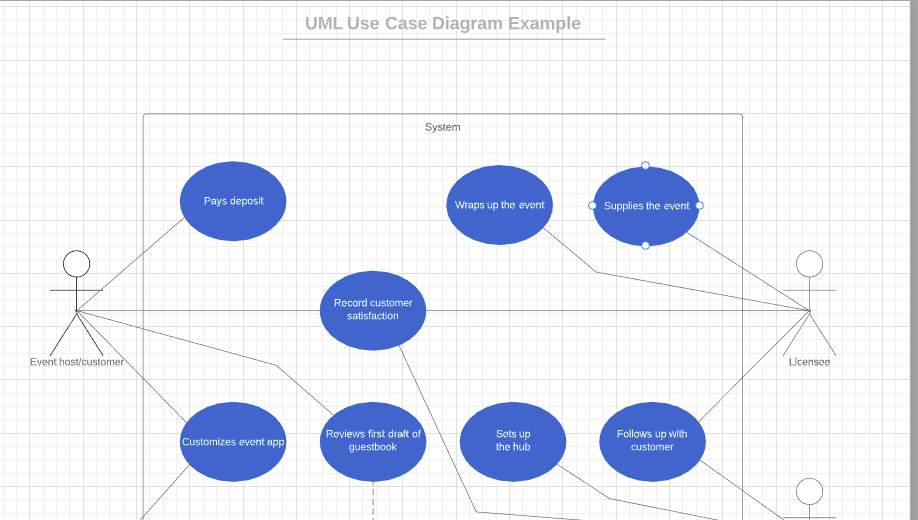
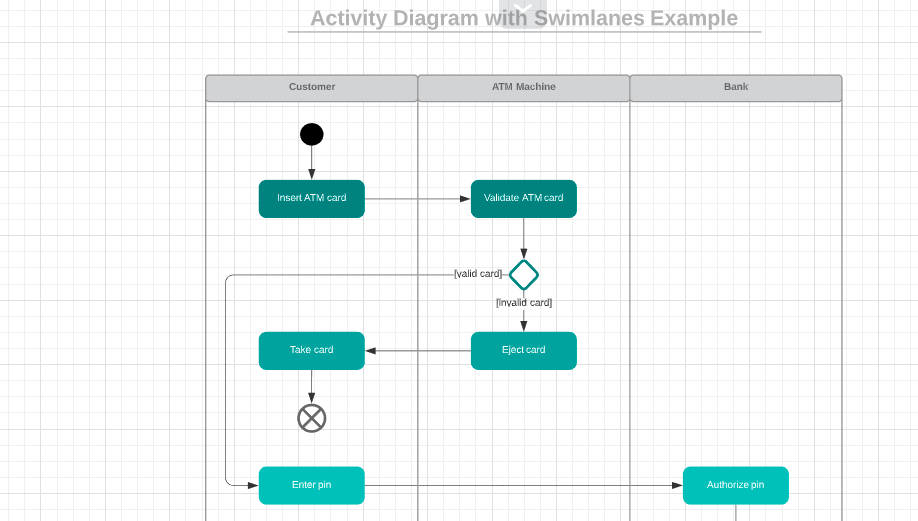
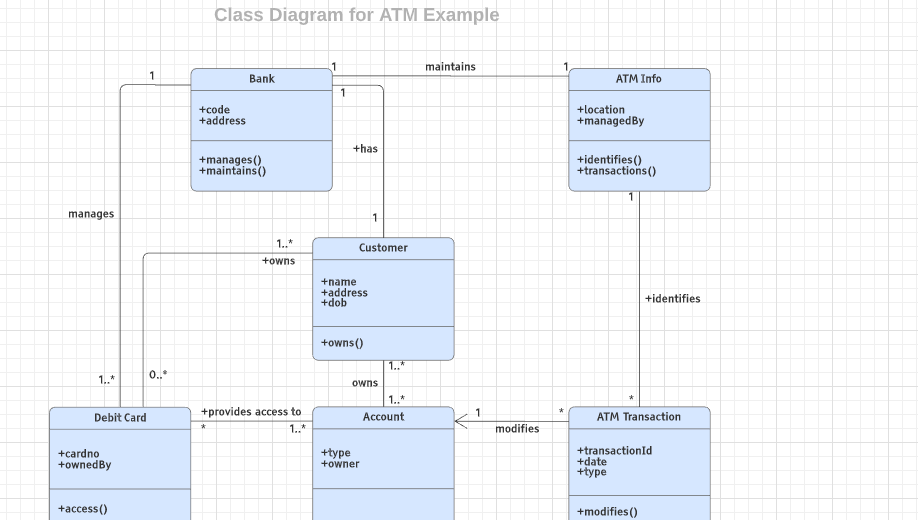

*Any interview process for software engineer will have atleast one Object Oriented Design round. This is true for senior software developer role as well as for entry level developer roles.*  
  
**The main ojective of the round is to identify:**  
1. Given a generic problem statement candidate can ask the right questions and come up with a technical solution
2. Is he able to identify the different objects and entities from a problem statement
3. Identify how much the candidate is comfortable with OOPs concepts and principles
  
**Prerequisites:**  
1. Have some Programming experinece OOPs language such as Java/C++/Python etc.
2. You must have good understanding of OOPs concepts such as :
    * Abstraction
    * Encapsulation
    * Inheritance
    * Polymorphism
    * Association , Agreegation, Composition
3. Having good understanding of Object Oriented Design principles such as `SOLID/DRY` principles etc helps
4. Having good command over Deisign pattenrs is a bonus point for entry level developers and kind of expected for senior level developers  
  
## Steps to approach the the problem:
1. Requirements [5–7 mins]  
*First of all identify if the interviewer is looking for a System Level Design or Object Level Design.*
   1. Talk about and write down the top requirements.
   2. Talk about the use cases and possible other use cases on high level
   3. Define your assumptions
   4. Clarify the scope that you are going to address in the interview
2. Use case Diagram : [3 mins]  
While discussing the requirements you effectively already have identified the use cases to address. Now it’s time to transform it into a Use case diagram.
   1. Identify the actors
   2. Identify the what the different actors can do

3. Activity Diagram [3 mins]  
Till now you have identified the actors and what each actors needs to do. In this step you will focus on the logic how the overall flow of the system will look like. Writing down the flow diagram will solidify your understaing of the problem as well as it will give you a chance to correct any mistake you made.
   1. Create the flow diagram for the main use cases

4. Class diagram [10 mins]  
This is the main part where the interviewer is most interested in. Although if you have followed the above steps you have all the materials ready to finish this step with ease.
   1. Identify the core objects; Rule to identify Objects:
       1. Nouns in requirements are possible candidates for Objects
       2. Verbs in the requirements are possible methods
   2. Identify the relationship between objects.
   3. Identify whether to use abstract class or interface for abstractions
   4. Identify if you can can use some Design Pattern
   5. Design the class diagram

**Possibly once you come up with the class diagram, the interviewer will ask you few questions regarding your design choices. You need to justify why you made the choices. Remember that in a design round there are no wrong answers … so defend your design. Although keep in mind the basic design principles while justifying your design.**
5. Code [15 mins]  
Mostly the coing part is optional for an Object Oriented Design round. But Interviewer might ask you to implement some specific parts of the problem.  
If you are asked to code the whole problem then prioritize:
   1. Start with the Interfaces or abstract classes
   2. Code for the core objects and the skeleton structures
   3. Write the implementations
   4. Write Junit

Reference: [[1]](https://medium.com/@nrkapri/how-to-approach-object-oriented-design-questions-step-by-step-67ed6a5a30e5)  
