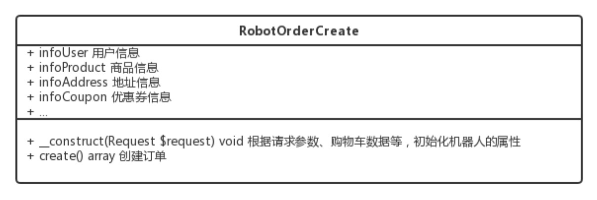
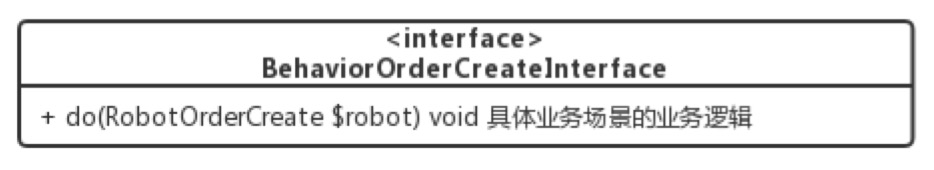
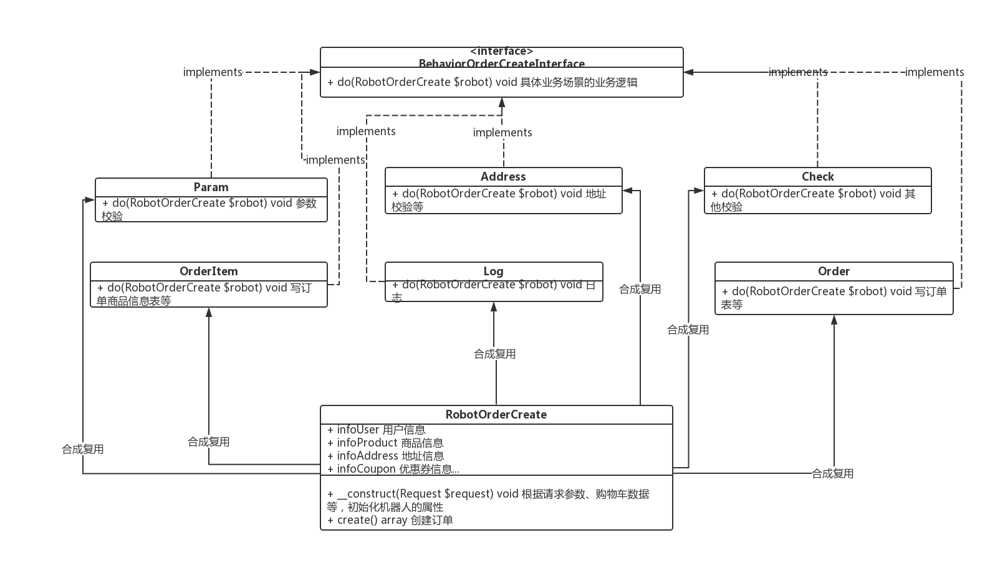

转载：https://xiaomi-info.github.io/2019/10/11/oo-design/  
  
### 背景
工作中的坏代码：  
* 没法改
* 耦合高
* 无法扩展
  
如何克服上面的问题?  
  
### 场景
首先问个问题：  
平常工作中来了一个业务需求，如何开始写代码的？  
通常大多数人可能：  
1. 梳理业务
2. 设计数据库、接口、缓存
3. 评审
4. 于是就开始了码代码的过程
   
此处有啥问题么？  
  
### 一个简单的业务场景
比如产品提了个需求：  
```
描述“我一个同事”一天的生活，简单来看看他一天干些啥。

1.0 饿了吃饭
1.1 到点吃饭

2.0 渴了喝水
2.1 到点喝水

3.0 困了睡觉
3.1 到点睡觉
3.2 有可能一个人睡觉，也有可能... 是吧？复杂
```
刚开始，一个业务逻辑从头写到尾：  
```java
public void doSomething() {
    // 吃饭
    // 喝水
    // 睡觉
}
```
  
进阶，一个业务逻辑(拆成多个函数)从头写到尾：  
```java
public void eat() {}
public void drink() {}
public void sleep() {}
public void doSomething() {
    eat();
    drink();
    sleep();
}
```
  
再进阶，一个业务逻辑(引入类并拆成多个类方法)从头写到尾，也许、可能、貌似、猜测大多数人停留到了这个阶段（问题：某一天多了社交的能力，咋办？）：  
```java
public class DemoPeople {
    public void eat() {}
    public void drink() {}
    public void sleep() {}
    public void doSomething() {
        this.eat();
        this.drink();
        this.sleep();
    }
}
```
  
再进阶，一个业务逻辑(拆成多类)从头写到尾：  
```java
public class DemoPeople {
    private DemoEat demoEat = new DemoEat();
    // ...
    public void doSomething() {
        demoEat.eat();
        // ...
    }
}
public class DemoEat {
    public void eat() {}
}
// ...
```
  
最终，一个业务逻辑(拆成类、抽象类、接口)从头写到尾（思考：这里的代码就没啥问题了吗？）：  
```java
interface Behaviour {
    public void do();
}
public class DemoPeople {
    private String state;
    public void doSomething() {
        makeDecision().do();
    }
    private Behaviour makeDecision() {
        switch (this.state) {
            case "hunger":
                return new DemoEat();
                break;
            // ...
            default:
                throw new Exception("invalid state");
                break;
        }
    }
}
public class DemoEat implements Behaviour {
    public void do() {
        // ...
    }
}
// ...
```
  
上面就是面向对象设计的代码结果。所以，如何设计出完全面向对象的代码？  

## 代码建模
什么是代码建模？  
把业务抽象成事物（类 class、抽象类 abstact class）和行为（接口 interface）的过程。  
  
实例分析  
又来看一个实际的业务场景：  
```
最近“我一个同事”开始创业了，刚创立了一家电商公司，B2C，自营书籍《3分钟学会交际》。最近开始写提交订单的代码。

注意场景：1.刚创业 2.简单的单体应用 3.此处不探讨架构
```
  
一般来说，我们根据业务需求一顿分析，开始定义接口 API、设计数据库、缓存、技术评审等就开始码代码了。  
```
接口参数：
uid
address_id
coupon_id
.etc

业务逻辑：
参数校验->
地址校验->
其他校验->
写订单表->
写订单商品信息表->
写日志->
扣减商品库存->
清理购物车->
扣减各种促销优惠活动的库存->
使用优惠券->
其他营销逻辑等等->
发送消息->
等等...
```
就开始写代码了怎么怎么样...如果怎么怎么样...怎么怎么样...一蹴而就、思路清晰、逻辑清楚、很快搞定完代码，很优秀是不是，值得鼓励。  
  
但是，上面的结果就是大概所有人都见过的连续上千行的代码等等。上面的流程没啥问题吗，那正确的做法是什么了？就是接着要说的代码建模。  
  
我们根据上面的场景，开始建模。  
  
### 业务分析少不了
同样，首先，我们看看提交订单这个业务场景要做的事情:  
  
`换个角度看业务其实很简单：根据用户相关信息生成一个订单。`  
  
1. 梳理得到业务逻辑
```
参数校验->
地址校验->
其他校验->
写订单表->
写订单商品信息表->
写日志->
扣减商品库存->
清理购物车->
扣减各种促销优惠活动的库存->
使用优惠券->
其他营销逻辑等等->
发送消息->
等等...
```
2. 梳理业务逻辑依赖信息
```
用户信息
商品信息
地址信息
优惠券信息
等等...
```
  
再次回归概念  
什么是代码建模？把业务抽象成事物（类 class、抽象类 abstact class）和行为（接口 interface）的过程。  
  
### 获取事物
比如我们把订单生成的过程可以想象成机器人，一个生成订单的订单生成机器人，或者订单生成机器啥的，这样我们就得到了代码建模过程中的一个事物。  
从而我们就可以把这个事物转化成一个类(或结构体)，或者抽象类。  

  
### 获取行为
这些操作就是上面机器人要做的事情。  
事物有了：订单生成机器人  
行为呢？毫无疑问就是上面各种业务逻辑。把具体的行为抽象成一个订单创建行为接口：  

  
### 得到 UML

  
### 设计代码
1. 定义一个类
```java
public class RobotOrderCreate {
    private Object infoUser;
    private Object infoProduct;
    private Object infoAddress;
    private Object infoCoupon;
    public RobotOrderCreate(Request request) {}
    public void create() {} // 创建订单
}
```
2. 定义一个订单创建行为的接口
```java
interface BehaviorOrderCreateInterface {
    public <T> T do(RobotOrderCreate robot);
}
```
3. 定义具体的不同订单创建行为类
```
参数校验->
地址校验->
其他校验->
写订单表->
写订单商品信息表->
写日志->
扣减商品库存->
清理购物车->
扣减各种促销优惠活动的库存->
使用优惠券->
其他营销逻辑等等->
发送消息->
等等...
```
```java
class Param implements BehaviorOrderCreateInterface {
    public boolean do(RobotOrderCreate robot) {} // 参数校验
}
class Address implements BehaviorOrderCreateInterface {
    public boolean do(RobotOrderCreate robot) {}
}
class Check implements BehaviorOrderCreateInterface {
    public boolean do(RobotOrderCreate robot) {}
}
class Order implements BehaviorOrderCreateInterface {
    public boolean do(RobotOrderCreate robot) {}
}
class OrderItem implements BehaviorOrderCreateInterface {
    public boolean do(RobotOrderCreate robot) {}
}
class Log implements BehaviorOrderCreateInterface {
    public void do(RobotOrderCreate robot) {}
}
```
4. 创建订单  
这里的代码该怎么写，这样？  
```java
public void create(Request request) {
    try {
        (new Param()).do(this);
        (new Address()).do(this);
        (new Check()).do(this);
        (new Order()).do(this);
        (new OrderItem()).do(this);
        (new Log()).do(this);
        // ...
    } catch (Exception e) {}
}
```
```java
// 还可以继续优化
public void create(Request request, List<BehaviorOrderCreateInterface> behaviorList) {
    try {
        for (BehaviorOrderCreateInterface behavior : behaviorList) {
            behavior.do(this);
        }
    } catch (Exception e) {}
}
```
  
### 完整代码
```java
interface BehaviorOrderCreateInterface {
    public <T> T do(RobotOrderCreate robot);
}

class Param implements BehaviorOrderCreateInterface {
    public boolean do(RobotOrderCreate robot) {} // 参数校验
}
class Address implements BehaviorOrderCreateInterface {
    public boolean do(RobotOrderCreate robot) {}
}
class Check implements BehaviorOrderCreateInterface {
    public boolean do(RobotOrderCreate robot) {}
}
class Order implements BehaviorOrderCreateInterface {
    public boolean do(RobotOrderCreate robot) {}
}
class OrderItem implements BehaviorOrderCreateInterface {
    public boolean do(RobotOrderCreate robot) {}
}
class Log implements BehaviorOrderCreateInterface {
    public void do(RobotOrderCreate robot) {}
}

public class RobotOrderCreate {
    private Object infoUser;
    private Object infoProduct;
    private Object infoAddress;
    private Object infoCoupon;
    private List<BehaviorOrderCreateInterface> behaviorList;
    public RobotOrderCreate(Request request) {}
    public void registerBehavior(BehaviorOrderCreateInterface behavior) {
        behaviorList.add(behavior);
    }
    public void create() {
        try {
            for (BehaviorOrderCreateInterface behavior : behaviorList) {
                behavior.do(this);
            }
        } catch (Exception e) {}
    }
}

public class Main {
    public void main(String[] args) {
        RobotOrderCreate robot = new RobotOrderCreate(request);
        robot.registerBehavior(new Param());
        // ...
        robot.create();
    }
}
```
上面的代码有什么好处？  
假如“我一个同事”又要新开发一个新的应用，新的应用创建订单的时候又有新的逻辑，比如没有优惠逻辑、新增了增加用户积分的逻辑等等，复用上面的代码，是不是就很简单了。  
```java
public void main(String[] args) {
    RobotOrderCreate robot = new RobotOrderCreate(request);
    // ...
    robot.registerBehavior(new UserPoint());
    robot.create();
}
```
  
所以现在，什么是面向对象？  
  
## 概念
### 面向对象的设计原则
* 对接口编程而不是对实现编程
* 优先使用对象组合而不是继承
* 抽象用于不同的事物，而接口用于事物的行为

针对上面的概念，我们再回头开我们上面的代码  
  
`对接口编程而不是对实现编程`
结果：RobotOrderCreate依赖了BehaviorOrderCreateInterface抽象接口  
  
`优先使用对象组合而不是继承`
结果：完全没有使用继承，多个行为不同场景组合使用  
  
`抽象用于不同的事物，而接口用于事物的行为`
结果：
1. 抽象了一个创建订单的机器人 RobotOrderCreate
2. 机器人又有不同的创建行为
3. 机器人的创建行为最终依赖于 BehaviorOrderCreateInterface 接口  

是不是完美契合，所以这就是“面向对象的设计过程”。  
  
## 结论
`代码建模过程就是“面向对象的设计过程”的具体实现方式。`  
  
## 预习
### 设计模式  
最后，设计模式又是什么？  
同样，我们下结合上面的场景和概念预习下设计模式。  

设计模式的设计原则  
`开闭原则（Open Close Principle）：对扩展开放，对修改封闭`  
  
看看上面的最终的代码是不是完美契合。  
```java
public void main(String[] args) {
    RobotOrderCreate robot = new RobotOrderCreate(request);
    // ...
    robot.registerBehavior(new BehaviorOrderCreateInterface() {
        public boolean do(RobotOrderCreate robot) {
            // ...
        }
    });
    robot.create();
}
```
  
`依赖倒转原则：对接口编程，依赖于抽象而不依赖于具体`
结果：创建订单的逻辑从依赖具体的业务转变为依赖于抽象接口 BehaviorOrderCreateInterface  
  
`接口隔离原则：使用多个接口，而不是对一个接口编程，去依赖降低耦合`
结果：上面的场景，我们只简单定义了订单创建的接 BehaviorOrderCreateInterface。由于订单创建过程可能出现异常回滚，我们就需要再定义一个订单创建回滚的接口 BehaviorOrderCreateRollBackInterface  
  
`迪米特法则，又称最少知道原则：减少内部依赖，尽可能的独立`
结果：还是上面那段代码，我们把 RobotOrderCreate 机器人依赖的行为通过外部注入的方式使用。  
  
`合成复用原则：多个独立的实体合成聚合，而不是使用继承`
结果：RobotOrderCreate 依赖了多个实际的订单创建行为类。  
  
`里氏代换：超类（父类）出现的地方，派生类（子类）都可以出现`
结果：不好意思，我们完全没用继承。（备注：继承容易造成父类膨胀。）
