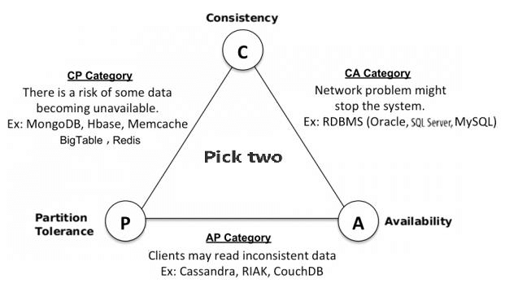

It is impossible for a distributed software system (especially data store) to simultaneously provide more than two of the following guarantees (CAP): Consistency, Availability, and Partition tolerance. When design a distributed system, trading off among CAP is almost the first thing to consider.  
* Consistency - All nodes see the same data at the same time. It is achieved by updating several nodes before allowing further reads.
* Availability - Every request gets a response on success/failure. It is achieved by replicating the data across different servers.
* Partition tolerance - System continues to work despite message loss or partial failure.
  
Eric Brewer 提出了 CAP 理论。依据这个理论，在一个大规模分布式数据系统中，有三个需求是彼此循环依赖的：一致性、可用性和分区耐受性。  
* 一致性（Consistency）对于所有的数据库客户端使用同样的查询都可以得到同样的结果，即使是有并发更新的时候也是如此。
* 可用性（Availability）所有的数据库客户端总是可以读写数据。
* 分区耐受性（Partition Tolerance）数据库可以分散到多台机器上（甚或跨网络、跨地域），即使发生网络故障，被分成多个分区，依然可以提供服务。

Brewer 理论是说，对于任意给定系统，只能强化这三个特性中的两个。这很类似于软件开发中的名言：“你可以让软件很好，让它很快，或者很便宜：不过三个里面你只能选择两个。”  
由于循环依赖关系，我们不得不在它们之中做出选择。比如，你期望获得更强的一致性，那可能就只能拥有较低的分区耐受性，除非你在可用性上做一些让步。  
CAP 理论在 2002 年被证明。不过，在分布式系统中你将不得不面对网络分区的问题，而且在某些时候，机器也常常出现故障，从而导致某些节点不可达。丢包同样是与生俱来的问题。所以，我们可以得到结论，一个分布式系统必须尽力在网络发生分裂的情况下继续工作（具有分区耐受性），这样我们实际上只能在剩下的两个特性里二选一：可用性或是一致性。  

* CA - 主要支持一致性和可用性，这意味着你很可能使用了两阶段提交的分布式事务。也就是说，如果网络发生分裂，那么系统可能会停止响应，这也意味着你的系统很可能被限制在一个数据中心集群以降低网络分区发生的可能性。如果你只需要这个级别的规模扩展，那么可以选择 CA 取向的系统，它较易于管理，允许你使用简单而且熟悉的结构。
* CP - 主要支持一致性和分区耐受性，你可以通过改进系统架构，设置数据分片来提升可扩展性。你的数据将保持一致性，但如果有节点发生故障，仍然会有部分数据无法访问（不可用）。例子如银行系统
* AP - 主要支持可用性和分区耐受性，你的系统可能返回不太精确的数据，但系统将始终可用，即使是网络发生分区的时候也是如此。DNS 可能是这类系统中最为著名的例子了，这类系统可扩展性非常强，高可用，而且具有分区耐受性。例子如社交系统

  
  

## 其他
对于设计分布式系统来说（不仅仅是分布式事务）的架构师来说，CAP 就是入门理论。  

* C (一致性)：对某个指定的客户端来说，读操作能返回最新的写操作。对于数据分布在不同节点上的数据上来说，如果在某个节点更新了数据，那么在其他节点如果都能读取到这个最新的数据，那么就称为强一致，如果有某个节点没有读取到，那就是分布式不一致。
* A (可用性)：非故障的节点在合理的时间内返回合理的响应 (不是错误和超时的响应)。可用性的两个关键一个是合理的时间，一个是合理的响应。合理的时间指的是请求不能无限被阻塞，应该在合理的时间给出返回。合理的响应指的是系统应该明确返回结果并且结果是正确的，这里的正确指的是比如应该返回 50，而不是返回 40。
* P (分区容错性)：当出现网络分区后，系统能够继续工作。打个比方，这里个集群有多台机器，有台机器网络出现了问题，但是这个集群仍然可以正常工作。

熟悉 CAP 的人都知道，三者不能共有，在分布式系统中，网络无法 100% 可靠，分区其实是一个必然现象，如果选择了 CA 而放弃了 P，那么当发生分区现象时，为了保证一致性，这个时候必须拒绝请求，但是 A 又不允许，所以分布式系统理论上不可能选择 CA 架构，只能选择 CP 或者 AP 架构（非分布式系统还是可以选择 CA 的，但本身这种场景也比较少见，通常是小型系统比如同一局域网内、单一服务器或服务节点的：公司内部 OA 系统、部门级系统、工厂内部的生产控制系统等，但是需注意因为随着云原生的普及，纯 CA 系统越来越少）。  
对于 CP 来说，放弃可用性，追求一致性和分区容错性，zookeeper 其实就是追求的强一致。  
对于 AP 来说，放弃一致性(这里说的一致性是强一致性)，追求分区容错性和可用性，这是很多分布式系统设计时的选择，后面的 BASE 也是根据 AP 来扩展。  
顺便一提，CAP 理论中是忽略网络延迟，也就是当事务提交时，从节点 A 复制到节点 B，但是在现实中这个是明显不可能的，所以总会有一定的时间是不一致。同时 CAP 中选择两个，比如选择了 CP，并不是放弃 A。因为 P 出现的概率实在是太小了，大部分的时间仍然需要保证 CA。就算分区出现了也要为后来的 A 做准备，比如通过一些日志的手段，是其他机器回复至可用。  

[Ref](https://javaguide.cn/distributed-system/protocol/cap-and-base-theorem.html#%E7%AE%80%E4%BB%8B)  

### BASE  
BASE 是 Basically Available(基本可用)、Soft state(软状态)和 Eventually consistent (最终一致性)三个短语的缩写。是对 CAP 中 AP 的一个扩展  

* 基本可用：分布式系统在出现故障时，允许损失部分可用功能，保证核心功能可用。
* 软状态：允许系统中存在中间状态，这个状态不影响系统可用性，这里指的是 CAP 中的不一致。
* 最终一致：最终一致是指经过一段时间后，所有节点数据都将会达到一致。

BASE 解决了 CAP 中理论没有网络延迟，在 BASE 中用软状态和最终一致，保证了延迟后的一致性。BASE 和 ACID 是相反的，它完全不同于 ACID 的强一致性模型，而是通过牺牲强一致性来获得可用性，并允许数据在一段时间内是不一致的，但最终达到一致状态。  

作者：咖啡拿铁
链接：https://juejin.cn/post/6844903647197806605

### FLP
* [FLP 不可能定理](https://zhuanlan.zhihu.com/p/384511433)
* [参考](https://alexstocks.github.io/html/alg.html)
* [Wiki](https://en.wikipedia.org/wiki/Consensus_(computer_science)#The_FLP_impossibility_result_for_asynchronous_deterministic_consensus)
