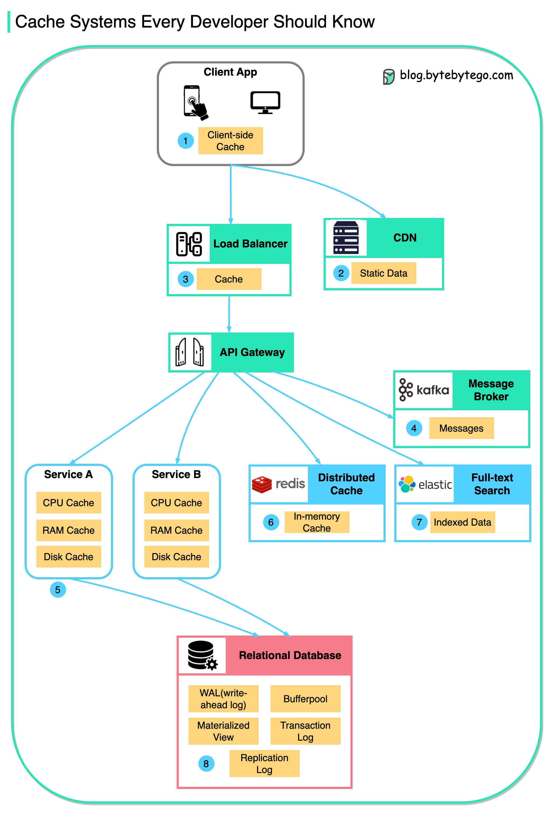
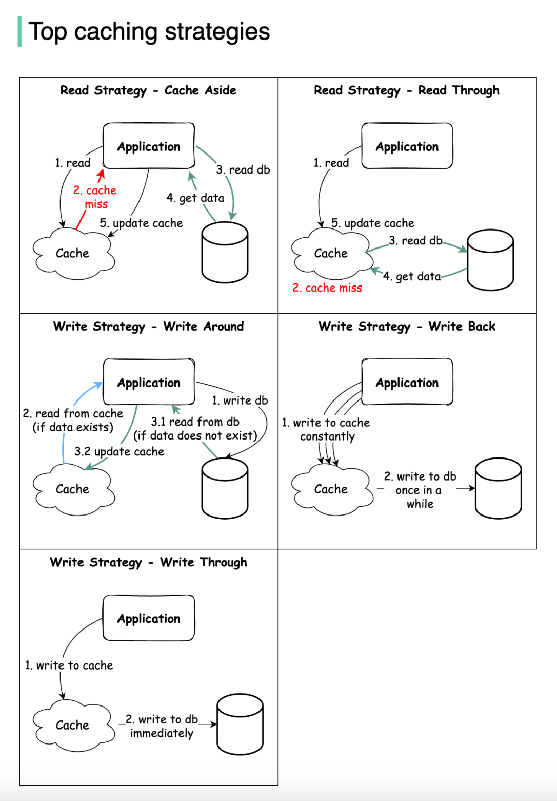
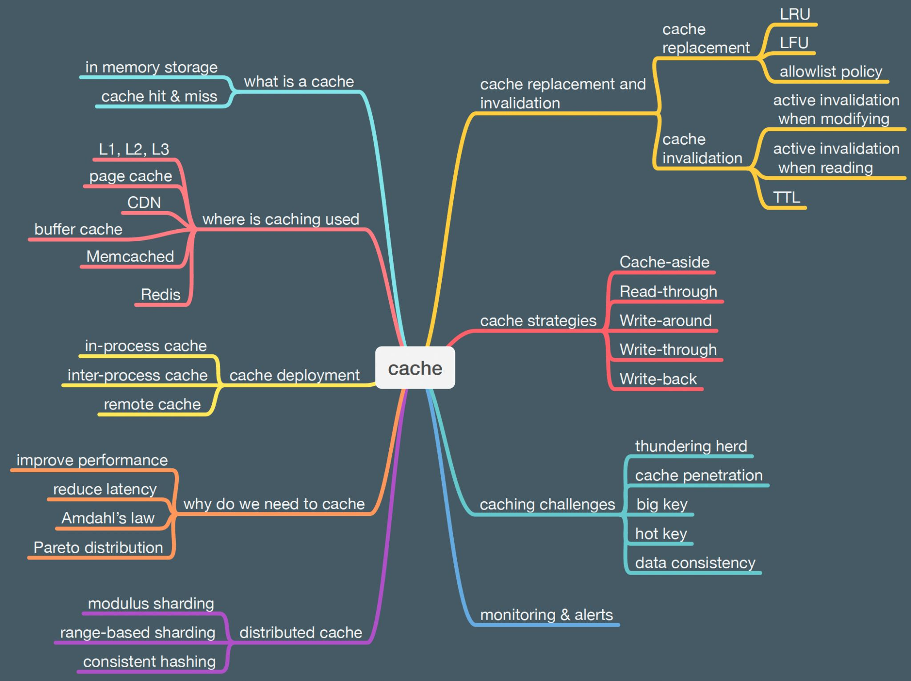

# 缓存
这里的缓存指的是多个应用服务之间的共享缓存，通常使用 Redis，每个应用服务自己本地也可以使用自己的内存（数据结构如数组、哈希表）作为本地缓存。  

相关：
* [缓存那些事](https://tech.meituan.com/2017/03/17/cache-about.html)
* [Redis 基本功](../../Computer%20System%20Layer/数据库/Redis/README.md)

缓存在几乎每个计算层级中都被使用：硬件、操作系统、Web 浏览器、Web 应用程序等等（可以存在于体系结构的所有层级中），但通常在最靠近前端的层级中使用。它类似于短期记忆且速度快。注意多级缓存系统可能会带来很多系统复杂性与变数，要视业务场景（数据一致性）判断使用，其中云计算时代使得本地缓存可能实际上没有节省内存资源成本（反而可能增加），从性能上来看更多地是优化了网络 IO 部分。  
  

* 本地缓存（应用服务器缓存）- 如果数据不在缓存中，请求节点将从磁盘查询数据（比访问网络存储快）。然而，如果负载均衡（LB）随机分发请求到不同的节点，同样的请求可能会发送到不同的节点，从而增加了缓存未命中。两种克服选择是全局缓存（global caches）和分布式缓存（distributed caches）。
* 内容分发网络（CDN） - CDN 是一种在为大量静态媒体提供服务的站点中发挥作用的缓存。如果内容在本地不可用，CDN 将向后端服务器查询文件，将其缓存到本地并提供给用户。上述操作可以由 Nginx 完成。
* 缓存失效（Cache Invalidation）- 缓存需要一些维护来保持与真实数据源（例如数据库）的一致性。
  * 写入-通过缓存（Write-through cache） - 数据同时写入缓存和相应的数据库。
    * 这种模式确保了缓存和持久性存储之间的数据一致性，但可能会影响写入操作的性能。
    * 适用于情况：数据一致性要求高、避免数据丢失、写入操作不频繁、读取性能较重要等等。
  * 写入-绕过缓存（Write-around cache） - 数据直接写入永久存储，绕过缓存。
  * 写回缓存（Write-back cache） - 数据仅写入缓存，然后立即向客户端确认完成。写入永久存储在指定的时间间隔或特定条件下进行。
  * 读取-通过缓存（Read-through cache）- 缓存系统在缓存未命中时，会自动从持久化存储（如数据库）中读取数据，并将数据放入缓存，以便下次访问时可以从缓存中获取数据，从而提高读取操作的性能。这种模式可以有效减轻后端数据库的负载，提高读取操作的速度。
    * 适用于那些对读取性能要求较高的场景，例如，读取操作频繁、数据变化不频繁、数据量较大的情况。这种模式可以减少对后端存储的直接读取压力，提高读取速度，同时确保了数据的一致性。需要注意的是，在 Read-Through 缓存模式中，数据的更新通常需要额外的处理，以确保缓存中的数据与持久化存储中的数据保持一致。这可能涉及到缓存失效、数据更新通知等机制。
* 缓存淘汰策略（Cache eviction policies）及其[代码实现](https://www.sakuratears.top/blog/%E7%BC%93%E5%AD%98%E6%B7%98%E6%B1%B0%E7%AE%97%E6%B3%95%EF%BC%88LFU%E3%80%81LRU%E3%80%81FIFO%E3%80%81ARC%E3%80%81MRU%EF%BC%89.html)
  * 先进先出（FIFO）
  * 后进先出（LIFO）
  * 最近最少使用（LRU）
  * 最近最常使用（MRU）（[使用场景](https://stackoverflow.com/questions/5088128/why-does-cache-use-most-recently-used-mru-algorithm-as-evict-policy)）
  * 最不常使用（LFU - Least Frequently Used）
  * 自适应缓存替换（ARC）（结合了 LRU 与 LFU 的特点）
  * 随机替换（RR - Random Replacement）

  

其他：[Ring Buffer / Circular Buffer](https://zh.wikipedia.org/wiki/%E7%92%B0%E5%BD%A2%E7%B7%A9%E8%A1%9D%E5%8D%80)  

分层缓存（Tiered Cache）：将缓存分成多个层级，每个层级具有不同的容量和速度。通常将最常访问的数据存储在速度较快的高层级缓存中，较少访问的数据存储在速度较慢的低层级缓存中。  

## 垃圾回收
缓存的淘汰策略会与内存释放息息相关，因此要注意相关性能的影响，比如用 C 语言实现的 Redis，在进行淘汰策略时是使用主动的内存管理，因此性能最优，如果是依赖垃圾回收机制的语言如 Java、Go 等实现缓存的淘汰策略时，要注意垃圾回收带来的性能影响，在读写更新十分频繁的情况下可能会放大负面影响。  

## 过时策略
通常是随机抽样检查和惰性检查的组合（By ChatGPT）：
* 随机抽样检查 - Redis 会周期性地对部分过期键进行检查和清理。这种策略可以保证即使某些键因为惰性检查而未被删除，仍然能够在随机抽样检查中被及时清理，提高过期键的清理效率。Redis 通过在每次执行完数据库命令后，以一定的概率来触发随机抽样检查。
* 惰性检查 - 当访问键时，Redis 会在需要时检查键是否过期，并根据过期状态进行删除。这种策略能够保证在访问键时能够及时地发现过期键，并删除它们。惰性检查是 Redis 的默认过期策略，它在访问时检查键的过期状态，并在需要时删除过期的键。

## 块缓存（Block Cache）
块缓存通常可以用来缓存各种类型的数据，包括视频、文件等大型数据块。块缓存适用于任何需要频繁访问的数据块，无论其类型是文本、图片、视频、音频还是其他格式。  
在存储视频、文件等大型数据时，块缓存可以有效地减少对底层存储介质（如磁盘或网络存储）的访问次数，从而提高数据的读取性能。通过将这些数据块加载到内存中的缓存中，应用程序可以更快地获取数据，减少了读取时间，并且在用户体验方面能够得到显著的改善。  
然而，需要注意的是，缓存大型数据块可能会占用较多的内存空间，因此在设计缓存策略时需要平衡内存的使用和缓存命中率。对于特别大的数据块，也可以考虑使用分布式文件系统或对象存储等技术来管理和存储这些数据，以确保系统的可扩展性和性能。  
支持块缓存的软件系统有 HBase、RocksDB 等等。  

By ChatGPT  
