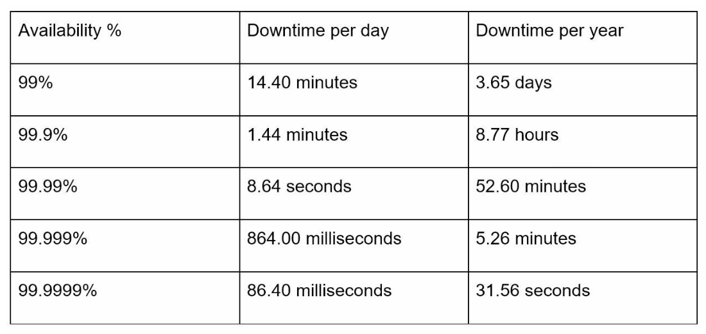
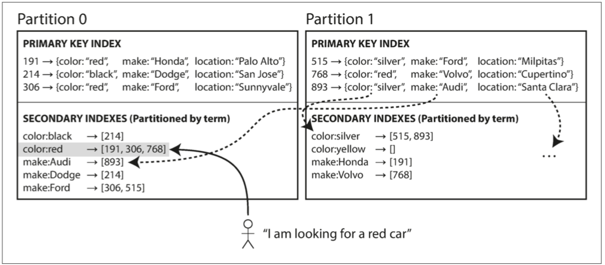

# [DDIA（Designing Data-Intensive Applications）](http://ddia.vonng.com/#/)
## 数据系统基础
### 数据密集型应用组件
现今很多应用程序都是数据密集型（data-intensive）的，而非计算密集型（compute-intensive）的。因此 CPU 很少成为这类应用的瓶颈，更大的问题通常来自数据量、数据复杂性、以及数据的变更速度。  
数据密集型应用通常由标准组件构建而成，标准组件提供了很多通用的功能；例如，许多应用程序都需要：  
* 存储数据，以便自己或其他应用程序之后能再次找到（数据库 database）
* 记住开销昂贵操作的结果，加快读取速度（缓存 cache）
* 允许用户按关键字搜索数据，或以各种方式对数据进行过滤（搜索索引 search indexes）
* 向其他进程发送消息，进行异步处理（流处理 stream processing）
* 定期处理累积的大批量数据（批处理 batch processing）  
  
### 非功能性需求
* 可靠性（Reliability）意味着即使发生故障，系统也能正常工作。故障可能发生在硬件（通常是随机的和不相关的），软件（通常是系统性的Bug，很难处理），和人类（不可避免地时不时出错）。容错技术可以对终端用户隐藏某些类型的故障。
* 可扩展性（Scalability）意味着即使在负载增加的情况下也有保持性能的策略。为了讨论可扩展性，首先需要定量描述负载和性能的方法（SLO、SLA）。简要了解了推特主页时间线的例子，介绍描述负载的方法，并将响应时间百分位点（中位数 p50 以及 p95，p99 和 p999 等等）作为衡量性能的一种方式。在可扩展的系统中可以添加处理容量（processing capacity）以在高负载下保持可靠。（监控相关：Telemetry / 遥测技术，一般是指从物理网元或者虚拟网元上远程实时高速采集数据，实现对网络实时、高速和更精细的监控技术。相比于传统的网络监控技术如 CLI、SNMP 等拉模式，Telemetry 通过推模式，主动向采集器上推动数据信息，提供更实时更高速更精确的网络监控功能。[更多参考](https://www.sdnlab.com/23887.html)）
* 可维护性（Maintainability）有许多方面，但实质上是关于工程师和运维团队的生活质量的。良好的抽象可以帮助降低复杂度，并使系统易于修改和适应新的应用场景。良好的可操作性意味着对系统的健康状态具有良好的可见性，并拥有有效的管理手段。
  * 可操作性（运维相关）
  * 简单性：管理复杂度 - 用于消除额外复杂度的最好工具之一是抽象（abstraction）。一个好的抽象可以将大量实现细节隐藏在一个干净，简单易懂的外观下面。一个好的抽象也可以广泛用于各类不同应用。比起重复造很多轮子，重用抽象不仅更有效率，而且有助于开发高质量的软件。抽象组件的质量改进将使所有使用它的应用受益。复杂度有各种可能的症状，例如：状态空间激增、模块间紧密耦合、纠结的依赖关系、不一致的命名和术语、解决性能问题的 Hack、需要绕开的特例等等。
    * 复杂度导致维护困难时，预算和时间安排通常会超支。在复杂的软件中进行变更，引入错误的风险也更大：当开发人员难以理解系统时，隐藏的假设、无意的后果和意外的交互就更容易被忽略。相反，降低复杂度能极大地提高软件的可维护性，因此简单性应该是构建系统的一个关键目标。
    * 简化系统并不一定意味着减少功能；它也可以意味着消除额外的（accidental）的复杂度。额外复杂度的定义为：由具体实现中涌现，而非（从用户视角看，系统所解决的）问题本身固有的复杂度。
  * 可演化性：拥抱变化 - 在组织流程方面，敏捷（agile）工作模式为适应变化提供了一个框架。敏捷社区还开发了对在频繁变化的环境中开发软件很有帮助的技术工具和模式，如测试驱动开发（TDD, test-driven development）和重构（refactoring） 。
  
#### 可扩展性
##### 描述负载
负载可以用一些称为 负载参数（load parameters） 的数字来描述。参数的最佳选择取决于系统架构，它可能是每秒向 Web 服务器发出的请求、数据库中的读写比率、聊天室中同时活跃的用户数量、缓存命中率或其他东西。除此之外，也许平均情况对你很重要，也许你的瓶颈是少数极端场景。  
##### 如何描述系统性能
* 对于 Hadoop 这样的批处理系统，通常关心的是吞吐量（throughput），即每秒可以处理的记录数量，或者在特定规模数据集上运行作业的总时间。
* 对于在线系统，通常更重要的是服务的响应时间（response time），即客户端发送请求到接收响应之间的时间（通常看中位数）。

**百分位点通常用于 服务级别目标（SLO, service level objectives）和 服务级别协议（SLA, service level agreements），即定义服务预期性能和可用性的合同。 SLA 可能会声明，如果服务响应时间的中位数小于 200 毫秒，且 99.9 百分位点低于 1 秒，则认为服务工作正常（如果响应时间更长，就认为服务不达标）。这些指标为客户设定了期望值，并允许客户在 SLA 未达标的情况下要求退款。**

SLI（Service Level Indicator）是服务水平指标，是衡量服务性能和可靠性的具体度量。它与 SLA（Service Level Agreement，服务级别协议）和 SLO（Service Level Objective，服务级别目标）密切相关，但侧重于具体的必须可明确测量的指标、且应与用户体验或业务目标直接相关：
1. 常见 SLI 类型
   - 可用性：系统正常运行的时间百分比，比如 30 天内系统可用性达到 99.99%
   - 延迟：响应请求所需的时间，比如过去 5 分钟内，99% 的 API 请求延迟低于 100ms
   - 吞吐量：系统每秒处理的请求数，比如每秒处理 1000 个事务
   - 错误率：失败请求的百分比
   - 饱和度：系统资源使用程度（如 CPU、内存使用率）
2. SLI 与 SLO 和 SLA 的关系
   - SLI：具体的度量指标
   - SLO：基于SLI设定的目标值
   - SLA：基于SLO制定的服务承诺
3. 选择 SLI 的考虑因素
   - 用户体验影响：选择直接影响用户感知的指标
   - 可控性：选择团队可以直接影响和改善的指标
   - 可测量性：确保能够准确、持续地收集数据
   - 业务相关性：与业务目标和成功标准关联
4. SLI 的实施
   - 监控系统：使用监控工具持续收集 SLI 数据
   - 数据存储：存储历史 SLI 数据以进行趋势分析
   - 报告机制：定期生成 SLI 报告以评估服务表现
   - 告警设置：当 SLI 偏离预期时触发告警
5. SLI 的挑战
   - 数据收集的准确性：确保测量的准确性和一致性
   - 指标选择的适当性：选择真正反映服务质量的指标
   - 平衡多个 SLI：不同 SLI 可能相互影响，需要权衡

  

排队延迟（queueing delay）通常占了高百分位点处响应时间的很大一部分。由于服务器只能并行处理少量的事务（如受其 CPU 核数的限制），所以只要有少量缓慢的请求就能阻碍后续请求的处理，这种效应有时被称为 头部阻塞（head-of-line blocking）。即使后续请求在服务器上处理的非常迅速，由于需要等待先前请求完成，客户端最终看到的是缓慢的总体响应时间。因为存在这种效应，测量客户端的响应时间非常重要。  
在多重调用的后端服务里，高百分位数变得特别重要。即使并行调用，最终用户请求仍然需要等待最慢的并行调用完成。只需要一个缓慢的调用就可以使整个最终用户请求变慢。即使只有一小部分后端调用速度较慢，如果最终用户请求需要多个后端调用，则获得较慢调用的机会也会增加，因此较高比例的最终用户请求速度会变慢（效果称为尾部延迟放大）。  

要解决这些性能问题，就需要扩展系统架构，比如纵向横向扩展、引入分布式设计等等，这种可伸缩架构需要根据具体情况而定，没有通用的。  

### 数据模型与查询语言（Data Model and Query）
* 数据模型
  * 关系模型
  * 文档模型（层级模型/树结构模型）
  * 图数据模型（网络模型）

* 命令式查询
  * IMS 和 CODASYL
  * 常用的编程语言
* 声明式查询
  * SQL
  * CSS
  
**关系模型 vs 文档模型：**
* 在表示多对一和多对多的关系时，关系数据库和文档数据库并没有根本的不同：在这两种情况下，相关项目都被一个唯一的标识符引用，这个标识符在关系模型中被称为外键，在文档模型中称为文档引用。
* 支持文档数据模型的主要论据是架构灵活性，因局部性而拥有更好的性能，以及对于某些应用程序而言更接近于应用程序使用的数据结构。关系模型通过为 JOIN 提供更好的支持以及支持多对一和多对多的关系来反击。
* 文档模型有时又称层级（hierarchical）模型/树结构模型，即总是一种树结构，每个记录至多只有一个父记录，且每个记录又可以有零或多个子记录。

**哪种数据模型更有助于简化应用代码？**  
如果应用程序中的数据具有类似文档的结构（即，一对多关系树，通常一次性加载整个树），那么使用文档模型可能是一个好主意。将类似文档的结构分解成多个表的关系技术可能导致繁琐的模式和不必要的复杂的应用程序代码。  
文档模型有一定的局限性：例如，不能直接引用文档中的嵌套的项目，而是需要说 “ID XXX 的位置列表中的第 X 项”（很像层次模型中的访问路径）。但是，只要文件嵌套不太深，这通常不是问题。  
文档数据库对连接的糟糕支持可能是个问题，也可能不是问题，这取决于应用程序。例如，如果某分析型应用程序使用一个文档数据库来记录何时何地发生了何事，那么多对多关系可能永远也用不上。但如果应用程序确实会用到多对多关系，那么文档模型就不方便。尽管可以通过反规范化来消除对连接的需求，但这需要应用程序代码来做额外的工作以确保数据一致性，会导致更复杂的应用代码与更差的性能。对高度关联的数据而言，文档模型是极其糟糕的，关系模型是可以接受的，而选用图形模型是最自然的。  

**文档和关系数据库的融合**  
目前大多数关系数据库系统（MySQL 除外）都已支持 XML。这包括对 XML 文档进行本地修改的功能，以及在 XML 文档中进行索引和查询的功能。这允许应用程序使用那种与文档数据库应当使用的非常类似的数据模型。  
现版本的 PostgreSQL、MySQL、IBM DB2 也对 JSON 文档提供了类似的支持级别。关系数据库和文档数据库似乎变得越来越相似，关系模型和文档模型的混合是未来数据库一条很好的路线。  

**数据查询语言**  
当引入关系模型时，关系模型包含了一种查询数据的新方法：SQL 是一种`声明式`查询语言（SQL 紧密地遵循关系代数的结构），而 IMS 和 CODASYL 使用`命令式`代码来查询数据库（许多常用的编程语言是命令式的）。  
声明式查询语言通常比命令式 API 更加简洁和容易。但更重要的是，它还隐藏了数据库引擎的实现细节，这使得数据库系统可以在无需对查询做任何更改的情况下进行性能提升。  
声明式语言往往适合并行执行。现在，CPU 的速度通过核心的增加变得更快，而不是以比以前更高的时钟速度运行。命令代码很难在多个核心和多个机器之间并行化，因为它指定了指令必须以特定顺序执行。  

css 也是一种声明式查询，试想如果通过 javascript 去实现 css 的相同功能，会需要嵌套很多逻辑、麻烦很多。  

**MapReduce 查询**  
一些 NoSQL 数据存储支持有限形式的 MapReduce，作为在多个文档中执行只读查询的机制。  
MapReduce 既不是一个声明式的查询语言，也不是一个完全命令式的查询 API，而是处于两者之间：查询的逻辑用代码片段来表示，这些代码片段会被处理框架重复性调用。它基于 map（也称为 collect）和 reduce（也称为 fold 或 inject）函数，两个函数存在于许多函数式编程语言中。  
MapReduce 是一个相当底层的编程模型，用于计算机集群上的分布式执行。像 SQL 这样的更高级的查询语言可以用一系列的 MapReduce 操作来实现，但是也有很多不使用 MapReduce 的分布式 SQL 实现。  
MapReduce 的一个可用性问题是，必须编写两个密切合作的函数，这通常比编写单个查询更困难。此外，声明式查询语言为查询优化器提供了更多机会来提高查询的性能。  

**图数据模型**  
多对多关系是不同数据模型之间具有区别性的重要特征。如果应用程序大多数的关系是一对多关系（树状结构化数据），或者大多数记录之间不存在关系，那么使用文档模型是合适的。  
但是，要是系统里主要都是多对多关系时，关系模型虽可以处理多对多关系的简单情况，但是随着数据之间的连接变得更加复杂，将数据建模为图形显得更加自然。  
一个图由两种对象组成：顶点（vertices，也称为 节点，即 nodes，或 实体，即 entities），和 边（edges，也称为 关系，即 relationships，或 弧，即 arcs）。多种数据可以被建模为一个图形。典型的例子包括：社交图谱、网络图谱、公路或铁路网络等等。可以将那些众所周知的算法运用到这些图上：例如，导航系统搜索道路网络中两点之间的最短路径，PageRank 可以用在网络图上来确定网页的流行程度，从而确定该网页在搜索结果中的排名。  
可以将图存储看作由两个关系表组成：一个存储顶点，另一个存储边。头部和尾部顶点用来存储每条边；如果想要一组顶点的输入或输出边，可以分别通过 head_vertex 或 tail_vertex 来查询 edges 表。  
图数据模型有时又称网络模型。  

关于这个模型的一些重要方面是：  
1. 任何顶点都可以有一条边连接到任何其他顶点。没有模式限制哪种事物可不可以关联。
2. 给定任何顶点，可以高效地找到它的入边和出边，从而遍历图，即沿着一系列顶点的路径前后移动（比如在 tail_vertex 和 head_vertex 列上设置索引）。
3. 通过对不同类型的关系使用不同的标签，可以在一个图中存储几种不同的信息，同时仍然保持一个清晰的数据模型。

图的声明式查询：  
* Cypher 是属性图的声明式查询语言，为 Neo4j 图形数据库而发明。
* 三元组存储和 SPARQL
  * 在三元组存储中，所有信息都以非常简单的三部分表示形式存储（主语，谓语，宾语）。三元组的主语相当于图中的一个顶点。而宾语是下面两者之一：1. 原始数据类型中的值；2. 图中的另一个顶点。
  * SPARQL 是一种用于三元组存储的面向 RDF（资源描述框架）数据模型的查询语言。SPARQL 早于 Cypher，并且由于 Cypher 的模式匹配借鉴于 SPARQL，这使得它们看起来非常相似。

**SQL 中的图查询**  
可以在关系数据库中表示图数据。如果图数据已经以关系结构存储，也可以使用 SQL 查询，查询可变长度遍历路径的思想可以使用称为`递归公用表表达式`（WITH RECURSIVE 语法）来表示。但是，与 Cypher 相比，其语法非常笨拙。  

**小结**  
新的非关系型 NoSQL 数据存储分化为两个主要方向：  
* 文档数据库 - 主要关注自我包含的数据文档，而且文档之间的关系非常稀少。
* 图形数据库 - 用于相反的场景：任意事物之间都可能存在潜在的关联。

三种模型（文档，关系和图形）在今天都被广泛使用，并且在各自的领域都发挥很好。一个模型可以用另一个模型来模拟 —— 例如，图数据可以在关系数据库中表示 —— 但结果往往是糟糕的。这就是为什么有着针对不同目的的不同系统，而不是一个单一的万能解决方案。  

### 存储与检索
两大类存储引擎：日志结构（log-structured） 的存储引擎，以及 面向页面（page-oriented） 的存储引擎（例如 B 树）。  

最简单的数据库可以用两个 Bash 函数实现：  
```bash
#!/bin/bash
db_set () {
  echo "$1,$2" >> database
}

db_get () {
  grep "^$1," database | sed -e "s/^$1,//" | tail -n 1
}
```
与 db_set 做的事情类似，许多数据库在内部使用了日志（log），也就是一个仅追加（append-only）的数据文件。真正的数据库有更多的问题需要处理（如并发控制，回收硬盘空间以避免日志无限增长，处理错误与部分写入的记录），但基本原理是一样的。日志极其有用。但是查找一个键时，db_get 必须从头到尾扫描整个数据库文件来查找键的出现，即算法时间复杂度是 O(n)，性能不好，为了高效查找数据库中特定键的值，需要一个数据结构：索引（index）。  

主流索引的数据结构：
* 散列映射/表
  * 假设数据存储只是一个追加写入的文件，那么最简单的索引策略就是：保留一个内存中的散列映射，其中每个键都映射到数据文件中的一个字节偏移量，指明了可以找到对应值的位置。当将新的键值对追加写入文件中时，还要更新散列映射，以反映刚刚写入的数据的偏移量（这同时适用于插入新键与更新现有键）。当想查找一个值时，使用散列映射来查找数据文件中的偏移量，寻找（seek） 该位置并读取该值即可。现实中，Riak 中默认的存储引擎 Bitcask 实际上就是这么做的。
  * Bitcask 这样的存储引擎非常适合工作负载中每个键的值经常更新的情况、有很多写操作，但是没有太多不同的键的这种类型 —— 每个键有很多的写操作，但是将所有键保存在内存中是可行的。
  * 到目前为止只是在追加写入一个文件 —— 所以如何避免最终用完硬盘空间？一种好的解决方案是，将日志分为特定大小的段（segment），当日志增长到特定尺寸时关闭当前段文件，并开始写入一个新的段文件。然后就可以对这些段进行压缩（compaction）。这里的压缩意味着在日志中丢弃重复的键，只保留每个键的最近更新。
  * 如果要删除一个键及其关联的值，则必须在数据文件中追加一个特殊的删除记录（逻辑删除，有时被称为 tombstone）。当日志段被合并时，合并过程会通过这个 tombstone 知道要将被删除键的所有历史值都丢弃掉。
  * 崩溃恢复 - 如果数据库重新启动，则内存散列映射将丢失。原则上，可以通过从头到尾读取整个段文件并记录下来每个键的最近值来恢复每个段的散列映射。但是，如果段文件很大，可能需要很长时间，这会使服务的重启比较痛苦。Bitcask 通过将每个段的散列映射的快照存储在硬盘上来加速恢复，可以使散列映射更快地加载到内存中。
  * 散列表索引局限性：
    * 散列表必须能放进内存。如果有非常多的键则不理想。原则上可以在硬盘上维护一个散列映射，不幸的是硬盘散列映射很难表现优秀。它需要大量的随机访问 I/O，而后者耗尽时想要再扩充是很昂贵的，并且需要很烦琐的逻辑去解决散列冲突。
    * 范围查询效率不高。例如无法轻松扫描 00000 和 99999 之间的所有键 —— 必须在散列映射中单独查找每个键。
* [LSM 树](../../Common%20Data%20Structure%20and%20Data%20Type/Data%20Structure%20Implementation/LSMTree/README.md)
  * 与使用散列索引的日志段相比，SSTable 有几个大的优势：
    * 即使文件大于可用内存，合并段的操作仍然是简单而高效的。这种方法就像归并排序算法中使用的方法一样。
    * 为了在文件中找到一个特定的键，不再需要在内存中保存所有键的索引（仍然需要一个内存中的索引来告诉你一些键的偏移量，但它可以是稀疏的）。
    * 由于读取请求无论如何都需要扫描所请求范围内的多个键值对，因此可以将这些记录分组为块（block），并在将其写入硬盘之前对其进行压缩。稀疏内存索引中的每个条目都指向压缩块的开始处。除了节省硬盘空间之外，压缩还可以减少对 I/O 带宽的使用。
  * 构建和维护 SSTables（虽然在硬盘上维护有序结构也是可能的（例如 “B 树”），但在内存保存则要容易得多）
    * 有新写入时，将其添加到内存中的平衡树数据结构（例如红黑树）。这个内存树有时被称为内存表（memtable）。
    * 当内存表大于某个阈值（通常为几兆字节）时，将其作为 SSTable 文件写入硬盘。这可以高效地完成，因为树已经维护了按键排序的键值对。新的 SSTable 文件将成为数据库中最新的段。当该 SSTable 被写入硬盘时，新的写入可以在一个新的内存表实例上继续进行。
    * 收到读取请求时，首先尝试在内存表中找到对应的键，如果没有就在最近的硬盘段中寻找，如果还没有就在下一个较旧的段中继续寻找，以此类推。
    * 时不时地，在后台运行一个合并和压缩过程，以合并段文件并将已覆盖或已删除的值丢弃掉。
  * 用 SSTables 制作 LSM 树
  * 全文搜索的索引引擎，在 Elasticsearch 和 Solr 被使用，它使用类似的方法来存储它的关键词词典。全文索引比键值索引复杂得多，但是基于类似的想法。
  * LSM 树的基本思想 —— 保存一系列在后台合并的 SSTables —— 简单而有效。即使数据集比可用内存大得多，它仍能继续正常工作。由于数据按排序顺序存储，可以高效地执行范围查询（扫描所有从某个最小值到某个最大值之间的所有键），并且因为硬盘写入是连续的，所以 LSM 树可以支持非常高的写入吞吐量。
* [B/B+ 树](../../Common%20Data%20Structure%20and%20Data%20Type/Data%20Structure%20Implementation/BPlusTree/README.md)
  * B 树在几乎所有的关系数据库中仍然是标准的索引实现，许多非关系数据库也会使用到 B 树。
  * B 树将数据库分解成固定大小的块（block）或分页（page），传统上大小为 4KB（有时会更大），并且一次只能读取或写入一个页面。这种设计更接近于底层硬件，因为硬盘空间也是按固定大小的块来组织的。每个页面都可以使用地址或位置来标识，这允许一个页面引用另一个页面 —— 类似于指针，但在硬盘而不是在内存中。可以使用这些页面引用来构建一个页面树。
  * 一个页面会被指定为 B 树的根；在索引中查找一个键时，就从这里开始。该页面包含几个键和对子页面的引用。每个子页面负责一段连续范围的键，根页面上每两个引用之间的键，表示相邻子页面管理的键的范围（边界）。
  * 如果想添加一个新的键，需要找到其范围能包含新键的页面，并将其添加到该页面。如果页面中没有足够的可用空间容纳新键，则将其分成两个半满页面，并更新父页面以反映新的键范围分区。向 B 树中插入一个新的键是相当符合直觉的，但删除一个键（同时保持树平衡）就会牵扯很多其他东西了。这个算法可以确保树保持平衡：具有 n 个键的 B 树总是具有 O(logn) 的深度。
  * 为了使数据库能处理异常崩溃的场景，B 树实现通常会带有一个额外的硬盘数据结构：预写式日志（WAL，即 write-ahead log，也称为重做日志，即 redo log）。这是一个仅追加的文件，每个 B 树的修改在其能被应用到树本身的页面之前都必须先写入到该文件。当数据库在崩溃后恢复时，这个日志将被用来使 B 树恢复到一致的状态。
  * 并发控制 —— 通常是通过使用锁存器（latches，轻量级锁）保护树的数据结构来完成。

LSM 树可以被压缩得更好，通常能比 B 树在硬盘上产生更小的文件。B 树存储引擎会由于碎片化（fragmentation）而留下一些未使用的硬盘空间：当页面被拆分或某行不能放入现有页面时，页面中的某些空间仍未被使用。由于 LSM 树不是面向页面的，并且会通过定期重写 SSTables 以去除碎片，所以它们具有较低的存储开销。  
B 树的一个优点是每个键只存在于索引中的一个位置，而日志结构化的存储引擎可能在不同的段中有相同键的多个副本。这个方面使得 B 树在提供强大的事务语义中更有优势。  
B 树和日志结构索引都有次级索引。  
没有简单易行的办法来判断哪种类型（B 树或 LSM 树）的存储引擎对系统的使用场景更好，所以需要通过一些测试来得到相关经验。  

从索引到堆文件（实际的行被存储的地方）的额外跳跃对读取来说性能损失太大，因此可能希望将被索引的行直接存储在索引中。这被称为聚集索引（clustered index）。例如，在 MySQL 的 InnoDB 存储引擎中，表的主键总是一个聚集索引，次级索引则引用主键（而不是堆文件中的位置）。  

**其他索引结构**  
多维索引（multi-dimensional index）是一种查询多个列的更一般的方法，这对于地理空间数据尤为重要。例如，网站可能有一个数据库，其中包含每个个体的经度和纬度。一个标准的 B 树或者 LSM 树索引不能够高效地处理这种查询：它可以返回一个纬度范围内的所有个体，或者返回在同一个经度范围内的所有个体，但不能同时满足两个条件。  
一种选择是使用空间填充曲线（space-filling curve）将二维位置转换为单个数字，然后使用常规 B 树索引。更普遍的是，使用特殊化的空间索引，例如 **R 树**。  
多维索引不仅可以用于地理位置。例如，在电子商务网站上可以使用建立在（红，绿，蓝）维度上的三维索引来搜索特定颜色范围内的产品，也可以在天气观测数据库中建立（日期，温度）的二维索引。  

其他：  
* 全文搜索和模糊索引
* 在内存中存储一切
  * 内存数据库的性能优势的原因在于省去了将内存数据结构编码为硬盘数据结构的开销
  * 内存数据库的另一个优势是提供了难以用基于硬盘的索引实现的数据模型。例如，Redis 为各种数据结构（如优先级队列和集合）提供了类似数据库的接口。因为它将所有数据保存在内存中，所以它的实现相对简单

#### 事务处理还是分析
|属性	|事务处理系统 OLTP	|分析系统 OLAP |
|-- |-- |-- |
|主要读取模式	|查询少量记录，按键读取	|在大批量记录上聚合 |
|主要写入模式	|随机访问，写入要求低延时	|批量导入（ETL）或者事件流 |
|主要用户	|终端用户，通过 Web 应用	|内部数据分析师，用于决策支持 |
|处理的数据	|数据的最新状态（当前时间点）	|随时间推移的历史事件 |
|数据集尺寸	|GB ~ TB	|TB ~ PB |

**数据仓库**  
数据仓库包含公司各种 OLTP 系统中所有的只读数据副本。从 OLTP 数据库中提取数据（使用定期的数据转储或连续的更新流），转换成适合分析的模式，清理并加载到数据仓库中。将数据存入仓库的过程称为 “抽取 - 转换 - 加载（ETL）”。  
数据仓库的数据模型通常是关系型的，因为 SQL 通常很适合分析查询。有许多图形数据分析工具可以生成 SQL 查询，可视化结果，并允许分析人员探索数据（通过下钻、切片和切块等操作）。表面上，一个数据仓库和一个关系型 OLTP 数据库看起来很相似，因为它们都有一个 SQL 查询接口。然而，系统的内部看起来可能完全不同，因为它们针对非常不同的查询模式进行了优化。  

**星型和雪花型：分析的模式**  
模式的中心是一个所谓的事实表，事实表的每一行代表在特定时间发生的事件。“星型模式” 这个名字来源于这样一个事实，即当对表之间的关系进行可视化时，事实表在中间，被维度表包围；与这些表的连接就像星星的光芒。这个模板的变体被称为雪花模式，其中维度被进一步分解为子维度。  

#### 列式存储
尽管事实表通常超过 100 列，但典型的数据仓库查询一次只会访问其中 4 个或 5 个列。但传统的面向行的存储引擎仍然需要将所有这些行（每个包含超过 100 个属性）从硬盘加载到内存中，解析它们，并过滤掉那些不符合要求的属性。这可能需要很长时间。  
列式存储背后的想法很简单：不要将所有来自一行的值存储在一起，而是将来自每一列的所有值存储在一起。如果每个列式存储在一个单独的文件中，查询只需要读取和解析查询中使用的那些列，这可以节省大量的工作。  
列压缩 - 还可以通过压缩数据来进一步降低对硬盘吞吐量的需求，通常情况下，一列中不同值的数量与行数相比要小得多，所以列式存储通常很适合压缩。  

聚合：数据立方体和物化视图  
数据仓库的另一个值得一提的优化方面是物化聚合（materialized aggregates）。如前所述，数据仓库查询通常涉及一个聚合函数，如 SQL 中的 COUNT、SUM、AVG、MIN 或 MAX。如果相同的聚合被许多不同的查询使用，那么每次都通过原始数据来处理可能太浪费了。为什么不将一些查询使用最频繁的计数或总和缓存起来？创建这种缓存的一种方式是物化视图（Materialized View）。物化视图的常见特例称为数据立方体或 OLAP 立方。它是按不同维度分组的聚合网格。物化数据立方体的优点是可以让某些查询变得非常快，因为它们已经被有效地预先计算了。  

### 编码与演化
几种编码数据的格式，包括 JSON、XML、CSV、Protocol Buffers、Thrift 和 Avro。尤其将关注这些格式如何应对模式变化，以及它们如何对新旧代码数据需要共存的系统提供支持。然后将讨论如何使用这些格式进行数据存储和通信：在 Web 服务中，表述性状态传递（REST）和远程过程调用（RPC），以及消息传递系统（如 Actor 和消息队列）。  

程序通常（至少）使用两种形式的数据：
1. 在内存中，数据保存在对象、结构体、列表、数组、散列表、树等中。这些数据结构针对 CPU 的高效访问和操作进行了优化（通常使用指针）。
2. 如果要将数据写入文件，或通过网络发送，则必须将其编码（encode）为某种自包含的字节序列（例如，JSON 文档）。这个字节序列表示会与通常在内存中使用的数据结构完全不同。

在两种表示之间进行某种类型的翻译。从内存中表示到字节序列的转换称为编码（Encoding）（也称为序列化（serialization）或编组（marshalling）），反过来称为解码（Decoding）（或解析（Parsing），反序列化（deserialization），反编组（unmarshalling））。  
许多编程语言都内建了将内存对象编码为字节序列的支持。例如，Java 有 java.io.Serializable，Ruby 有 Marshal，Python 有 pickle 等等。许多第三方库也存在。这些语言内置编码库非常方便，但性能以及编码简洁度可能不理想。  

尽管存在一些缺陷，但 JSON、XML 和 CSV 格式对很多需求来说已经足够好了。  
二进制编码 - 对于仅在组织内部使用的数据，使用最小公约数式的编码格式压力较小。例如，可以选择更紧凑或更快的解析格式。虽然对小数据集来说，收益可以忽略不计；但一旦达到 TB 级别，数据格式的选型就会产生巨大的影响。JSON 比 XML 简洁，但与二进制格式相比还是太占空间。  
Apache Thrift 和 Protocol Buffers（protobuf）是基于相同原理的二进制编码库。Thrift 和 Protocol Buffers 都需要一个模式来编码任何数据。使用这两种格式对数据进行编码前，要先使用接口定义语言（IDL）来描述模式。它们都带有一个代码生成工具，采用了类似于这里所示的模式定义，并且生成了以各种编程语言实现模式的类，应用程序代码可以调用此生成的代码来对模式的记录进行编码或解码。  

*许多数据系统也为其数据实现了类似上面的二进制编码。例如，大多数关系数据库都有一个网络协议，可以通过该协议向数据库发送查询并获取响应。这些协议通常特定于特定的数据库，并且数据库供应商提供将来自数据库的网络协议的响应解码为内存数据结构的驱动程序（例如使用 ODBC 或 JDBC API）。*  

**字段标签和模式演变**  
Thrift 和 Protocol Buffers 可以处理模式更改，同时保持向前向后兼容性。  
可以添加新的字段到架构，只要给每个字段一个新的标签号码。如果旧的代码（不知道添加的新的标签号码）试图读取新代码写入的数据，包括一个新的字段，其标签号码不能识别，它可以简单地忽略该字段。数据类型注释允许解析器确定需要跳过的字节数。这保持了向前兼容性：旧代码可以读取由新代码编写的记录。  
只要每个字段都有一个唯一的标签号码，新的代码总是可以读取旧的数据，因为标签号码仍然具有相同的含义。唯一的细节是，如果添加一个新的字段，不能设置为必需。如果要添加一个字段并将其设置为必需，那么如果新代码读取旧代码写入的数据，则该检查将失败，因为旧代码不会写入添加的新字段。因此，为了保持向后兼容性，在模式的初始部署之后添加的每个字段必须是可选的或具有默认值。  
删除一个字段就像添加一个字段，只是这回要考虑的是向前兼容性。这意味着只能删除一个可选的字段（必需字段永远不能删除），而且不能再次使用相同的标签号码（因为可能仍然有数据写在包含旧标签号码的地方，而该字段必须被新代码忽略）。  

Protobuf 没有列表或数组数据类型，而是有一个字段的重复标记（repeated，这是除必需和可选之外的第三个选项）。  

除了 Thrift 和 Protocol Buffers 之外还有 Avro，Avro 与前两者的不同是它有 Writer 模式与 Reader 模式。  
当数据解码（读取）时，Avro 库通过并排查看 Writer 模式和 Reader 模式并将数据从 Writer 模式转换到 Reader 模式来实现兼容、解决差异。也因此，Avro 对动态生成的模式更友善。为了保持兼容性，只能添加或删除具有默认值的字段。  

#### 数据流的类型
数据可以通过多种方式从一个进程/主机流向另一个进程/主机。一方编码数据一方解码。以下是数据如何在进程/主机之间流动的一些最常见的方式：
* 通过数据库
* 通过[服务调用](./System%20Design%20Fundamentals.md#API%20Design)（REST 与 SOAP、RPC）- 服务器公开的 API 服务。
  * 关于 API 版本化应该如何工作（即客户端如何指示它想要使用哪个版本的 API）没有一致意见。对于 RESTful API，常用的方法是在 URL 或 HTTP Accept 头中使用版本号。对于使用 API 密钥来标识特定客户端的服务，另一种选择是将客户端请求的 API 版本存储在服务器上，并允许通过单独的管理界面更新该版本选项。
* 通过异步消息传递（消息传递中的数据流，与数据库类似，不是通过直接的网络连接发送消息，而是通过称为消息代理的中介 - 也称为消息队列或面向消息的中间件来临时存储消息）
  * [分布式的 Actor 框架](./消息队列与流处理.md#分布式的%20Actor%20框架)

## 分布式数据
垂直扩展（更强大的机器）的问题在于，成本增长速度快于线性增长：一台有着双倍处理器数量，双倍内存大小，双倍磁盘容量的机器，通常成本会远远超过原来的两倍。而且可能因为存在瓶颈，并不足以处理双倍的载荷。而且它必然囿于单个地理位置的桎梏。  
水平扩展（无共享架构 - 多个独立机器）则在实际工程中更常用，虽然分布式无共享架构有许多优点，但它通常也会给应用带来额外的复杂度，有时也会限制可用数据模型的表达力。  

### 复制
复制意味着在通过网络连接的多台机器上保留相同数据的副本。  
三种流行的变更复制算法：单领导者（single leader，单主），多领导者（multi leader，多主）和无领导者（leaderless，无主）。几乎所有分布式数据库都使用这三种方法之一。  

#### 基于领导者的复制（leader-based replication）
也称主/从复制，客户端想要从数据库中读取数据时，它可以向领导者或任一追随者进行查询。但只有领导者才能接受写入操作。这种复制模式是许多关系数据库的内置功能，也被用于一些非关系数据库。此类复制并不仅限于数据库：像 Kafka 和 RabbitMQ 高可用队列这样的分布式消息代理也使用它，某些网络文件系统，例如 DRBD 这样的块复制设备也与之类似。  

**同步复制与异步复制**  
复制系统的一个重要细节是：复制是同步（synchronously）发生的还是异步（asynchronously）发生的。在关系型数据库中这通常是一个配置项，其他系统则通常硬编码为其中一个。  
通常情况下，复制的速度相当快：大多数数据库系统能在不到一秒内完成从库的同步，但它们不能提供复制用时的保证。有些情况下，从库可能落后主库几分钟或更久，例如：从库正在从故障中恢复，系统正在最大容量附近运行，或者当节点间存在网络问题时。  
同步复制的优点是，从库能保证有与主库一致的最新数据副本。如果主库突然失效，可以确信这些数据仍然能在从库上找到。缺点是，如果同步从库没有响应（比如它已经崩溃，或者出现网络故障，或其它任何原因），主库就无法处理写入操作。主库必须阻止所有写入，并等待同步副本再次可用。  
因此，将所有从库都设置为同步的是不切实际的：任何一个节点的中断都会导致整个系统停滞不前。实际上，如果在数据库上启用同步复制，通常意味着其中一个从库是同步的，而其他的从库则是异步的。如果该同步从库变得不可用或缓慢，则将一个异步从库改为同步运行。这保证至少在两个节点上拥有最新的数据副本：主库和同步从库。这种配置有时也被称为半同步（semi-synchronous）。  

实际通常情况下（广泛使用），基于领导者的复制都配置为完全异步。如果主库失效且不可恢复，则任何尚未复制给从库的写入都会丢失。这意味着即使已经向客户端确认成功，写入也不能保证是持久（Durable）的。然而，一个完全异步的配置也有优点：即使所有的从库都落后了，主库也可以继续处理写入。  

**设置新从库**  
有时候需要设置一个新的从库：也许是为了增加副本的数量，或替换失败的节点。如何确保新的从库拥有主库数据的精确副本？
1. 在某个时刻获取主库的一致性快照（如果可能，就因此不必锁定整个数据库）。大多数数据库都具有这个功能，因为它是备份必需的。
2. 将快照复制到新的从库节点。
3. 从库连接到主库，并拉取快照之后发生的所有数据变更。这要求快照与主库复制日志中的位置精确关联。
4. 当从库处理完快照之后积累的数据变更，就可以说它赶上（caught up）了主库，现在它可以继续及时处理主库产生的数据变化了。

在某些系统中，以上这个过程是完全自动化的。  

**处理节点宕机**  
系统中的任何节点都可能宕机，可能因为意外的故障，也可能由于计划内的维护（例如，重启机器以安装内核安全补丁）。对运维而言，能在系统不中断服务的情况下重启单个节点好处多多。因此目标是，即使个别节点失效，也能保持整个系统运行，并尽可能控制节点停机带来的影响。通过基于领导者的复制实现高可用：  
* 从库失效：追赶恢复
* 主库失效：故障切换（failover）

**复制日志的实现**  
* 基于语句的复制 - 主库记录下它执行的每个写入请求（语句，即 statement）并将该语句日志发送给从库。但有很多问题：非确定性函数（如 NOW()、RAND()）的语句，可能会在每个副本上生成不同的值；又如自增列，或者依赖于数据库中的现有数据，则必须在每个副本上按照完全相同的顺序执行它们，否则可能会产生不同的效果；有副作用的语句（例如：触发器、存储过程、用户定义的函数）可能会在每个副本上产生不同的副作用，除非副作用是绝对确定性的。
* 传输预写式日志（WAL）- 该日志都是包含了所有数据库写入的仅追加字节序列。可以使用完全相同的日志在另一个节点上构建副本：除了将日志写入磁盘之外，主库还可以通过网络将其发送给从库。其主要缺点是日志记录的数据非常底层：WAL 包含哪些磁盘块中的哪些字节发生了更改。这使复制与存储引擎紧密耦合。如果数据库将其存储格式从一个版本更改为另一个版本，通常不可能在主库和从库上运行不同版本的数据库软件。
* 逻辑日志复制（基于行）- 对复制和存储引擎使用不同的日志格式，这样可以将复制日志从存储引擎的内部实现中解耦出来（系统可以更容易地做到向后兼容）。
* 基于触发器的复制 - 触发器允许将数据更改（写入事务）发生时自动执行的自定义应用程序代码注册在数据库系统中。触发器有机会将更改记录到一个单独的表中，使用外部程序读取这个表，再加上一些必要的业务逻辑，就可以将数据变更复制到另一个系统去。

**复制延迟问题**  
当应用程序从异步从库读取时，如果从库落后，它可能会看到过时的信息。这会导致数据库中出现明显的不一致：同时对主库和从库执行相同的查询，可能得到不同的结果，因为并非所有的写入都反映在从库中。这种不一致只是一个暂时的状态 —— 如果停止写入数据库并等待一段时间，从库最终会赶上并与主库保持一致。出于这个原因，这种效应被称为最终一致性。  
解决方案：
* 读己之写（read-your-writes）
* 单调读（monotonic reads）- 对不同异步从库进行多次读取时可能发生时光倒流，实现单调读的一种方式是确保每个用户总是从同一个副本进行读取（不同的用户可以从不同的副本读取）（但是，如果该副本出现故障，用户的查询将需要重新路由到另一个副本）
* 一致前缀读 - 可能发生因果倒置异常，例子如第三方可能看到一个回复先于询问被看到，这仍是因为分布式复制延迟导致的原因，解决方案即一致前缀读：确保任何因果相关的写入都写入相同的分区，但在一些应用中可能无法高效地完成这种操作，但是还有一些显式跟踪因果依赖关系的算法。

在使用最终一致的系统时，如果复制延迟增加到几分钟甚至几小时，则应该考虑应用程序的行为，如果答案是“没问题”则很好，但如果结果对于用户来说是不好的体验，那么设计系统来提供更强的保证（例如写后读）是很重要的。明明是异步复制却假设复制是同步的，这是很多麻烦的根源。应用程序可以提供比底层数据库更强有力的保证，例如通过主库进行某种读取，但在应用程序代码中处理这些问题是复杂的，容易出错。另外还有一个进阶方案是分布式事务，但是较为复杂。  

**多主复制**  
以下是可能的场景：
* 多个数据中心，则每个数据中心应有一个主库，单数据中心则没必要这样。在多主配置中，每个写操作都可以在本地数据中心进行处理，并与其他数据中心异步复制。
* 应用程序在断网之后仍然需要继续工作（离线操作的客户端 - 每个设备都有一个充当主库的本地数据库接受写请求）。
* 协同编辑（如 Google Doc）。

多主复制的最大问题是可能发生写冲突。解决办法：  
* 从源头避免冲突（推荐）- 确保来自特定用户的请求始终路由到同一数据中心，并使用该数据中心的主库进行读写。不同的用户可能有不同的 “主” 数据中心（可能根据用户的地理位置选择），但从任何一位用户的角度来看，本质上就是单主配置了。
* 收敛至一致的状态
  * 最后写入胜利（LWW，last write wins）：给每个写入一个唯一的 ID（例如时钟时间戳、长随机数、UUID 或者键和值的哈希），挑选最高 ID 的写入作为胜利者，并丢弃其他写入。
  * 为每个副本分配一个唯一的 ID，ID 编号更高的写入具有更高的优先级。
  * 以某种方式将这些值合并在一起 - 例如，按字母顺序排序，然后连接它们。
  * 用一种可保留所有信息的显式数据结构来记录冲突，并编写解决冲突的应用程序代码（也许通过提示用户的方式）。
* 自定义冲突解决逻辑 - 多数多主复制工具允许使用应用程序代码编写冲突解决逻辑，该代码可以在写入或读取时执行。

多主复制拓扑（复制拓扑用来描述写入操作从一个节点传播到另一个节点的通信路径）：  
* 全部到全部（all-to-all）- 其中每个主库都将其写入发送给其他所有的主库。
* 环形拓扑 - 每个节点都从一个节点接收写入，并将这些写入（加上自己的写入）转发给另一个节点。
* 星形拓扑 - 一个指定的根节点将写入转发给所有其他节点。

其中第一种全部到全部（图形拓扑）在节点增多时关系复杂度会爆炸性增长，因此实际应用中推荐用星形拓扑，设定一个中心节点作为同步代理，为了避免中心节点的单点故障，可以引入分布式选举算法思想，在中心节点失效的时候重新推选一个中心节点即可，另外也可以动态地为中心节点添加资源倾斜，使其比其他非中心节点的可靠性更高一些。  

为了防止无限复制循环，每个节点被赋予一个唯一的标识符，并且在复制日志中，每次写入都会使用其经过的所有节点的标识符进行标记。  

**无主复制（leaderless）**  
一些数据存储系统采用不同的方法，放弃主库的概念，并允许任何副本直接接受来自客户端的写入。亚马逊其内部的 Dynamo 系统即是无主复制。  
在一些无主复制的实现中，客户端直接将写入发送到几个副本中，而另一些情况下，由一个协调者（coordinator）节点代表客户端进行写入。但与主库数据库不同，协调者不执行特定的写入顺序。  

当节点故障时写入数据库,在 Dynamo 风格的数据存储中经常使用两种机制：
* 读修复（Read repair）
* 反熵过程（Anti-entropy process）- 后台进程不断查找副本之间的数据差异，并将任何缺少的数据从一个副本复制到另一个副本。

读写的法定人数  
如果有 n 个副本，每个写入必须由 w 个节点确认才能被认为是成功的，并且必须至少为每个读取查询 r 个节点。只要 w+r>n，可以预期在读取时能获得最新的值，因为 r 个读取中至少有一个节点是最新的。遵循这些 r 值和 w 值的读写称为 法定人数（quorum）的读和写。可以认为，r 和 w 是有效读写所需的最低票数。（有时候这种法定人数被称为严格的法定人数，其相对 “宽松的法定人数” 而言）  

法定人数一致性的局限性  
可以将 w 和 r 设置为较小的数字，以使 w+r≤n（即法定条件不满足）。在这种情况下，读取和写入操作仍将被发送到 n 个节点，但操作成功只需要少量的成功响应。较小的 w 和 r 更有可能会读取到陈旧的数据，另一方面，这种配置允许更低的延迟和更高的可用性，但是即使在 w+r>n 的情况下，也可能存在返回陈旧值的边缘情况（因此更强有力的保证通常需要事务或共识），因此运维方面需要监控陈旧度。  

##### 宽松的法定人数
在一个大型的集群中（节点数量明显多于 n 个），网络中断期间客户端可能仍能连接到一些数据库节点，但又不足以组成一个特定的法定人数。在这种情况下，接受写入，然后将它们写入一些可达的节点，但不在这些值通常所存在的 n 个节点上：此即宽松的法定人数（sloppy quorum），写和读仍然需要 w 和 r 个成功的响应，但这些响应可能来自不在指定的 n 个 “主” 节点中的其它节点。一旦网络中断得到解决，一个节点代表另一个节点临时接受的任何写入都将被发送到适当的 “主” 节点。这就是所谓的提示移交（hinted handoff）。  

##### 检测并发写入
* 最后写入胜利（丢弃并发写入）- 仅适用于数据丢失可接受的情况下
* 合并并发写入的值 - 这种算法可以确保没有数据被无声地丢弃，但客户端需要做一些额外的工作
* 版本向量 - 所有副本的版本号集合称为版本向量，有时也被称为向量时钟但其实有微妙的区别

### 分区
分区主要是为了可伸缩性。  
分区的基本原理均适用于事务性工作或分析性工作。  
分区通常与复制结合使用，使得每个分区的副本存储在多个节点上。这意味着，即使每条记录属于一个分区，它仍然可以存储在多个不同的节点上以获得容错能力。且一个节点可能存储多个分区，如果使用主从复制模型，则分区和复制的组合如下图所示。每个分区领导者（主库）被分配给一个节点，追随者（从库）被分配给其他节点。每个节点可能是某些分区的主库，同时是其他分区的从库。  
  

如果分区是不公平的，一些分区比其他分区有更多的数据或查询，称之为偏斜（skew）。数据偏斜的存在使分区效率下降很多。  

**根据键的范围分区**  
一种分区的方法是为每个分区指定一块连续的键范围（从最小值到最大值）。键的范围不一定均匀分布，因为数据也很可能不均匀分布。为了均匀分配数据，分区边界需要依据数据调整。  
分区边界可以由管理员手动选择，也可以由数据库自动选择。Bigtable、HBase 等多个数据库使用了这种分区策略。  
在每个分区中，可以按照一定的顺序保存键。好处是进行范围扫描非常简单，可以将键作为联合索引来处理，以便在一次查询中获取多个相关记录。然而，Key Range 分区的缺点是某些特定的访问模式会导致热点。  

**根据键的散列分区**
由于偏斜和热点的风险，许多分布式数据存储使用散列函数来确定给定键的分区。  
一个好的散列函数可以将偏斜的数据均匀分布。假设有一个 32 位散列函数，无论何时给定一个新的字符串输入，它将返回一个 0 到 2^32-1 之间的 “随机” 数。即使输入的字符串非常相似，它们的散列也会均匀分布在这个数字范围内。  
出于分区的目的，散列函数不需要多么强壮的加密算法：例如 MD5、Fowler-Noll-Vo 函数。许多编程语言都有内置的简单哈希函数（用于散列表），但是它们可能不适合分区。  
一个重要的技术是**一致性哈希**。  
但是通过使用键散列进行分区的一个缺点是无法高效执行范围查询的能力，任何范围查询都必须发送到所有分区。  

*有些数据库如 Cassandra 采取了折衷的策略。*  

但是即使是使用散列分区，在一些极端情况下仍然无法避免负载偏斜与消除热点，因此特殊情况仍需程序逻辑去给读写做一些额外处理。  

#### 分区与次级索引
上面的分区方案皆依赖键值数据模型，但当涉及次级索引，情况会变得更加复杂，因为次级索引通常并不能唯一地标识记录。  
次级索引的问题是它们不能整齐地映射到分区。有两种用次级索引对数据库进行分区的方法：基于文档的分区（document-based）和基于关键词（term-based）的分区。  

**基于文档的次级索引进行分区**  
如果数据库仅支持键值模型，则可能需要尝试在应用程序代码中创建从值到文档 ID 的映射来实现次级索引。但是竞争条件和间歇性写入失败（其中一些更改已保存，但其他更改未保存）很容易导致数据不同步。  
  
在这种索引方法中，每个分区是完全独立的：每个分区维护自己的次级索引，仅覆盖该分区中的文档。它不关心存储在其他分区的数据。无论何时需要写入数据库（添加，删除或更新文档），只需处理正在编写的文档 ID 的分区即可。出于这个原因，文档分区索引也被称为本地索引（相对应于全局索引）。  
因此，如果搜索基于次级索引，则需要将查询发送到所有分区，并合并所有返回的结果。这种查询分区数据库的方法有时被称为分散/聚集（scatter/gather），并且可能会使次级索引上的读取查询相当昂贵，即使并行查询分区，分散/聚集也容易导致尾部延迟放大。  
  
**基于关键词(Term)的次级索引进行分区**  
可以构建一个覆盖所有分区数据的全局索引，而不是给每个分区创建自己的次级索引（本地索引）。但是，不能只把这个索引存储在一个节点上，因为它可能会成为瓶颈，违背了分区的目的。全局索引也必须进行分区，但可以采用与主键不同的分区方式。  
  
这种索引称为关键词分区（term-partitioned），因为寻找的关键词决定了索引的分区方式。例如，一个关键词可能是：color:red。关键词（Term） 这个名称来源于全文搜索索引（一种特殊的次级索引），指文档中出现的所有单词。  
可以通过关键词本身或者它的散列进行索引分区。根据关键词本身来分区对于范围扫描非常有用（例如对于数值类的属性，像汽车的报价），而对关键词的哈希分区提供了负载均衡的能力。关键词分区的全局索引优于文档分区索引的地方点是它可以使读取更有效率：不需要分散/收集所有分区，客户端只需要向包含关键词的分区发出请求。全局索引的缺点在于写入速度较慢且较为复杂，因为写入单个文档现在可能会影响索引的多个分区（文档中的每个关键词可能位于不同的分区或者不同的节点上）。  
*理想情况下，索引总是最新的，写入数据库的每个文档都会立即反映在索引中。但是，在关键词分区索引中，这需要跨分区的分布式事务，并不是所有数据库都支持。在实践中，对全局次级索引的更新通常是异步的。*  
  
#### 分区再平衡
生产中，许多情况需要数据和请求从一个节点移动到另一个节点。将负载从集群中的一个节点向另一个节点移动的过程称为再平衡（rebalancing）。  

**再平衡策略**
* 固定数量的分区 - 创建比节点更多的分区，并为每个节点分配多个分区。在这种配置中，分区的数量通常在数据库第一次建立时确定，之后不会改变。
* 动态分区 - 适用键范围分区的数据库，具有固定边界的固定数量的分区将非常不便。当分区增长到超过配置的大小时，会被分成两个分区，每个分区约占一半的数据，与之相反如果大量数据被删除并且分区缩小到某个阈值以下，则可以将其与相邻分区合并。此过程与 B 树类似。动态分区的一个优点是分区数量适应总数据量。如果只有少量的数据，少量的分区就足够了，所以开销很小。
* 按节点比例分区 - 每个节点具有固定数量的分区。

**运维：手动还是自动再平衡**  
在全自动再平衡（系统自动决定何时将分区从一个节点移动到另一个节点，无须人工干预，但有不可测风险）和完全手动（分区指派给节点由管理员明确配置，仅在管理员明确重新配置时才会更改，但是慢且麻烦）之间有一个权衡。  

#### 请求路由
当客户端想要发出请求时，如何知道要连接哪个节点？这个问题可以概括为服务发现（service discovery），它不仅限于数据库。任何可通过网络访问的软件都有这个问题，特别是如果它的目标是高可用性（在多台机器上运行冗余配置）。  
通常该问题有几种不同的方案：
* 允许客户端联系任何节点（例如，通过循环策略的负载均衡，即 Round-Robin Load Balancer）。如果该节点恰巧拥有请求的分区，则它可以直接处理该请求；否则，它将请求转发到适当的节点，接收回复并传递给客户端。
* 首先将所有来自客户端的请求发送到路由层，它决定了应该处理请求的节点，并相应地转发。此路由层本身不处理任何请求；它仅负责分区的负载均衡。
* 要求客户端知道分区和节点的分配。在这种情况下，客户端可以直接连接到适当的节点，而不需要任何中介。

关键问题是：作出路由决策的组件（可能是节点之一，还是路由层或客户端）如何了解分区 - 节点之间的分配关系变化？  
* 依赖于一个独立的协调服务，比如 ZooKeeper 来跟踪集群元数据。每个节点在 ZooKeeper 中注册自己，ZooKeeper 维护分区到节点的可靠映射。
* 在节点之间使用流言协议（gossip protocol）来传播集群状态的变化。请求可以发送到任意节点，该节点会转发到包含所请求的分区的适当节点。这个模型在数据库节点中增加了更多的复杂性，但是避免了对像 ZooKeeper 这样的外部协调服务的依赖。

当使用路由层或向随机节点发送请求时，客户端仍然需要找到要连接的 IP 地址。这些地址并不像分区的节点分布变化的那么快，所以使用 DNS 通常就足够了。  

**执行并行查询**  
通常用于分析的大规模并行处理（MPP, Massively parallel processing）关系型数据库产品在其支持的查询类型方面要复杂得多。一个典型的数据仓库查询包含多个连接，过滤，分组和聚合操作。 MPP 查询优化器将这个复杂的查询分解成许多执行阶段和分区，其中许多可以在数据库集群的不同节点上并行执行。涉及扫描大规模数据集的查询特别受益于这种并行执行。  

### 事务
从概念上讲，事务中的所有读写操作被视作单个操作来执行：整个事务要么成功提交（commit），要么失败中止（abort）或回滚（rollback）。事务所提供的安全保证，通常由众所周知的首字母缩略词 ACID 来描述。  
传统的关系数据库不限制事务的持续时间，因为它们是为等待人类输入的交互式应用而设计的。  
如果没有事务处理，各种错误情况（进程崩溃，网络中断，停电，磁盘已满，意外并发等）意味着数据可能以各种方式变得不一致。例如，非规范化的数据可能很容易与源数据不同步。如果没有事务处理，就很难推断复杂的交互访问可能对数据库造成的影响。  

#### 单对象和多对象操作
对单节点上的单个对象（例如键值对）上提供原子性和隔离性。原子性可以通过使用日志来实现崩溃恢复（WAL），并且可以使用每个对象上的锁来实现隔离（每次只允许一个线程访问对象）。  
假设想同时修改多个对象（行，文档，记录）。通常需要多对象事务（multi-object transaction）来保持多块数据同步。  
许多分布式数据存储已经放弃了多对象事务，因为多对象事务很难跨分区实现，而且在需要高可用性或高性能的情况下，它们可能会碍事。但是仍有场景需要协调写入几个不同的对象。  

#### 弱隔离级别
如果两个事务不触及相同的数据，它们可以安全地并行（parallel）运行，因为两者都不依赖于另一个。当一个事务读取由另一个事务同时修改的数据时，或者当两个事务试图同时修改相同的数据时，并发问题（竞争条件）才会出现。  
* 读已提交
* 快照隔离和可重复读
* 防止丢失更新
* 写入偏差与幻读

#### 可串行化
可串行化（Serializability）隔离通常被认为是最强的隔离级别，该方案针对的问题是上面隔离级别难以理解，并且在不同的数据库中实现的不一致，且光检查应用代码很难判断在特定的隔离级别运行是否安全，也没有检测竞争条件的好工具。它保证即使事务可以并行执行，最终的结果也是一样的，就好像它们没有任何并发性，连续挨个执行一样。因此数据库保证，如果事务在单独运行时正常运行，则它们在并发运行时继续保持正确 —— 换句话说，数据库可以防止所有可能的竞争条件。  
传统的数据库教科书将隔离性形式化为可串行化（Serializability），这意味着每个事务可以假装它是唯一在整个数据库上运行的事务。数据库确保当多个事务被提交时，结果与它们串行运行（一个接一个）是一样的，尽管实际上它们可能是并发运行的。  
然而实践中很少会使用可串行的隔离，因为它有性能损失。一些流行的数据库如 Oracle，甚至没有实现它。在 Oracle 中有一个名为 “可串行的” 隔离级别，但实际上它实现了一种叫做快照隔离（snapshot isolation）的功能，这是一种比可串行化更弱的保证。  
**可串行化实现方式**
* 真的串行顺序执行事务
* 两阶段锁定（2PL, two-phase locking），几十年来唯一可行的选择
* 乐观并发控制技术，例如可串行化快照隔离（serializable snapshot isolation）

事实上，数据库设计人员意识到 OLTP 事务通常很短，而且只进行少量的读写操作。相比之下，长时间运行的分析查询通常是只读的，因此它们可以在串行执行循环之外的一致快照（即使用快照隔离）上运行。  
又因为人的操作速度慢，几乎所有的 OLTP 应用程序都避免在事务中等待交互式的用户输入，以此来保持事务的简短。在 Web 上，这意味着事务在同一个 HTTP 请求中被提交 —— 一个事务不会跨越多个请求。一个新的 HTTP 请求开始一个新的事务。  

**在这种交互式的事务方式中，应用程序和数据库之间的网络通信耗费了大量的时间。如果不允许在数据库中进行并发处理，且一次只处理一个事务，则吞吐量将会非常糟糕，因为数据库大部分的时间都花费在等待应用程序发出当前事务的下一个查询。在这种数据库中，为了获得合理的性能，需要同时处理多个事务。**  
**出于这个原因，具有单线程串行事务处理的系统不允许交互式的多语句事务。取而代之，应用程序必须提前将整个事务代码作为存储过程提交给数据库。这些方法之间的差异如下图所示。如果事务所需的所有数据都在内存中，则存储过程可以非常快地执行，而不用等待任何网络或磁盘 I/O。**  
  
**存储过程**的一些实例  
现代的存储过程实现放弃了 PL/SQL，而是使用现有的通用编程语言：VoltDB 使用 Java 或 Groovy，Datomic 使用 Java 或 Clojure，而 Redis 使用 Lua（[Redis 6.0 主线程 + IO 线程模型](https://www.cnblogs.com/wzh2010/p/15886804.html)、[Redis 多线程图解](./redis6-threads.png)）。  
存储过程与内存存储，使得在单个线程上执行所有事务变得可行。由于不需要等待 I/O，且避免了并发控制机制的开销，它们可以在单个线程上实现相当好的吞吐量。**对于写入吞吐量较高的应用，单线程事务处理器可能成为一个严重的瓶颈。为了伸缩至多个 CPU 核心和多个节点，可以对数据进行分区。**  
但是，对于需要访问多个分区的任何事务，数据库必须在触及的所有分区之间协调事务。存储过程需要跨越所有分区锁定执行，以确保整个系统的可串行性。  

##### 两阶段锁定
在数据库中只有一种广泛使用的串行化算法：两阶段锁定（2PL，two-phase locking）。  
*虽然两阶段锁定（2PL）听起来非常类似于两阶段提交（2PC），但它们是完全不同的东西。两阶段提交是为了保证分布式事务的一致性原子性，两阶段锁定是避免并发事务中的冲突以确保事务的隔离性*  
两阶段锁定的锁的要求更强得多。只要没有写入，就允许多个事务同时读取同一个对象。但对象只要有写入（修改或删除），就需要 独占访问（exclusive access） 权限：
* 如果事务 A 读取了一个对象，并且事务 B 想要写入该对象，那么 B 必须等到 A 提交或中止才能继续（这确保 B 不能在 A 底下意外地改变对象）。
* 如果事务 A 写入了一个对象，并且事务 B 想要读取该对象，则 B 必须等到 A 提交或中止才能继续。

在 2PL 中，写入不仅会阻塞其他写入，也会阻塞读，反之亦然。  
但是两阶段锁定性能是个巨大缺点。  

##### 谓词锁
谓词锁（类似于共享/排它锁，但不属于特定的对象 - 例如表中的一行，它属于所有符合某些搜索条件的对象）限制访问，如下所示：
* 如果事务 A 想要读取匹配某些条件的对象，就像在这个 SELECT 查询中那样，它必须获取查询条件上的 共享谓词锁（shared-mode predicate lock）。如果另一个事务 B 持有任何满足这一查询条件对象的排它锁，那么 A 必须等到 B 释放它的锁之后才允许进行查询。
* 如果事务 A 想要插入，更新或删除任何对象，则必须首先检查旧值或新值是否与任何现有的谓词锁匹配。如果事务 B 持有匹配的谓词锁，那么 A 必须等到 B 已经提交或中止后才能继续。

谓词锁实例如 MySQL 里的间隙锁。它用于防止幻读。  

##### 索引范围锁
但是谓词锁性能不佳：如果活跃事务持有很多锁，检查匹配的锁会非常耗时。因此，大多数使用 2PL 的数据库实际上实现了索引范围锁（index-range locking，也称为临键锁 next-key locking），这是一个简化的近似版谓词锁（即通过使谓词匹配到一个更大的集合来实现 - 比如原先满足两个索引的不同条件的锁简化为命中其中一个索引的条件的排它锁）。  
这种方法能够有效防止幻读和写入偏差。索引范围锁并不像谓词锁那样精确（它们可能会锁定更大范围的对象，但又不是维持可串行化所必需的范围），但是开销较低，所以是一个很好的折衷。但是条件要求有索引，否则会退化到使用整个表上的共享锁，影响性能。  

##### 可串行化快照隔离
**一个称为可串行化快照隔离（SSI, serializable snapshot isolation）的算法是非常有前途的。它提供了完整的可串行化隔离级别，但与快照隔离相比只有很小的性能损失。**目前，SSI 既用于单节点数据库（PostgreSQL 9.1 以后的可串行化隔离级别），也用于分布式数据库（FoundationDB 使用类似的算法）。由于 SSI 与其他并发控制机制相比还很年轻，还处于在实践中证明自己表现的阶段。  
串行化快照隔离是一种乐观的并发控制技术，意味着如果存在潜在的危险也不阻止事务，而是继续执行事务，希望一切都会好起来。当一个事务想要提交时，数据库检查是否有什么不好的事情发生（即隔离是否被违反）；如果是的话，事务将被中止，且必须重试。只有可串行化的事务才被允许提交。事务中的所有读取都是来自数据库的一致性快照，且在快照隔离的基础上，SSI 添加了一种算法来检测写入之间的串行化冲突，并确定要中止哪些事务。  
事务中的查询与写入可能存在因果依赖。为了提供可串行化的隔离级别，如果事务在过时的前提下执行操作，数据库必须能检测到这种情况，并中止事务。  
* 检测对旧 MVCC 对象版本的读取（读之前存在未提交的写入）
* 检测影响先前读取的写入（读之后发生写入）

与两阶段锁定相比，可串行化快照隔离的最大优点是一个事务不需要阻塞等待另一个事务所持有的锁。就像在快照隔离下一样，写不会阻塞读，反之亦然。这种设计原则使得查询延迟更可预测，波动更少。特别是，只读查询可以运行在一致快照上，而不需要任何锁定，这对于读取繁重的工作负载非常有吸引力。  

### 分布式系统的麻烦
ToDo...  

### 一致性与共识
ToDo...  


## 衍生数据

### 批处理
ToDo...  

### 流处理
把事件流（event stream）视为一种数据管理机制：无界限，增量处理。  

#### 传递事件流
在批处理领域，作业的输入和输出是文件（也许在分布式文件系统上）。流处理领域中的等价如下：  
当输入是一个文件（一个字节序列），第一个处理步骤通常是将其解析为一系列记录。在流处理的上下文中，记录通常被叫做事件（event），但它本质上是一样的：一个小的、自包含的、不可变的对象，包含某个时间点发生的某件事情的细节。一个事件通常包含一个来自日历时钟的时间戳，以指明事件发生的时间。  

事件可能被编码为文本字符串或 JSON，或者某种二进制编码。这种编码允许存储一个事件，例如将其追加到一个文件，将其插入关系表，或将其写入文档数据库。它还允许通过网络将事件发送到另一个节点以进行处理。  
在批处理中，文件被写入一次，然后可能被多个作业读取。类似地，在流处理术语中，一个事件由生产者（producer/publisher/sender）生成一次，然后可能由多个消费者（consumer/subscribers/recipients）进行处理。在文件系统中，文件名标识一组相关记录；在流式系统中，相关的事件通常被聚合为一个主题（topic）或流（stream）。  

原则上讲，文件或数据库就足以连接生产者和消费者：生产者将其生成的每个事件写入数据存储，且每个消费者定期轮询数据存储，检查自上次运行以来新出现的事件。这实际上正是批处理在每天结束时处理当天数据时所做的事情。  
但当想要进行低延迟的连续处理时，如果数据存储不是为这种用途专门设计的，那么轮询开销就会很大。轮询的越频繁，能返回新事件的请求比例就越低，而额外开销也就越高。相比之下，最好能在新事件出现时直接通知消费者。  
数据库在传统上对这种通知机制支持的并不好，关系型数据库通常有触发器（trigger），它们可以对变化（如，插入表中的一行）作出反应，但是它们的功能非常有限，并且在数据库设计中有些后顾之忧。相应的是，已经开发了专门的工具来提供事件通知。  

##### 消息传递系统
向消费者通知新事件的常用方式是使用消息传递系统（messaging system）：生产者发送包含事件的消息，然后将消息推送给消费者。  
像生产者和消费者之间的 Unix 管道或 TCP 连接这样的直接信道，是实现消息传递系统的简单方法。但是，大多数消息传递系统都在这一基本模型上进行了扩展。特别的是，Unix 管道和 TCP 将恰好一个发送者与恰好一个接收者连接，而一个消息传递系统允许多个生产者节点将消息发送到同一个主题，并允许多个消费者节点接收主题中的消息。  
发布订阅系统通常要面对 2 个问题
* 如果生产者发送消息的速度比消费者能够处理的速度快会发生什么？三种选择：
  * 系统可以丢掉消息
  * 将消息放入缓冲队列 - 如果消息被缓存在队列中，那么理解队列增长会发生什么是很重要的。当队列装不进内存时系统会崩溃吗？还是将消息写入磁盘？如果是这样，磁盘访问又会如何影响消息传递系统的性能
  * 使用背压（backpressure，也称为 流量控制，即 flow control：阻塞生产者，以免其发送更多的消息）
* 如果节点崩溃或暂时脱机，会发生什么情况？是否会有消息丢失？与数据库一样，持久性可能需要写入磁盘和/或复制的某种组合，这是有代价的。如果能接受有时消息会丢失，则可能在同一硬件上获得更高的吞吐量和更低的延迟。

是否可以接受消息丢失取决于应用。  

**直接从生产者传递给消费者**  
许多消息传递系统使用生产者和消费者之间的直接网络通信，而不通过中间节点  
* 比如 UDP 组播及其衍生
* 如果消费者在网络上公开了服务，生产者可以直接发送 HTTP 或 RPC 请求将消息推送给使用者。这就是 webhooks 背后的想法，一种服务的回调 URL 被注册到另一个服务中，并且每当事件发生时都会向该 URL 发出请求。

尽管这些直接消息传递系统在设计它们的环境中运行良好，但是它们通常要求应用代码意识到消息丢失的可能性。它们的容错程度极为有限：即使协议检测到并重传在网络中丢失的数据包，它们通常也只是假设生产者和消费者始终在线。  

**消息代理**  
广泛使用的替代方法是通过消息代理（message broker，也称为 消息队列，即 message queue）发送消息，消息代理实质上是一种针对处理消息流而优化的数据库。它作为服务器运行，生产者和消费者作为客户端连接到服务器。生产者将消息写入代理，消费者通过从代理那里读取来接收消息。  
通过将数据集中在代理上，这些系统可以更容易地容忍来来去去的客户端（连接，断开连接和崩溃），而持久性问题则转移到代理的身上。一些消息代理只将消息保存在内存中，而另一些消息代理（取决于配置）将其写入磁盘，以便在代理崩溃的情况下不会丢失。针对缓慢的消费者，它们通常会允许无上限的排队（而不是丢弃消息或背压），尽管这种选择也可能取决于配置。  

**消息代理与数据库的对比**  
* 数据库通常保留数据直至显式删除，而大多数消息代理在消息成功递送给消费者时会自动删除消息。这样的消息代理不适合长期的数据存储。
* 由于它们很快就能删除消息，大多数消息代理都认为它们的工作集相当小 —— 即队列很短。如果代理需要缓冲很多消息，比如因为消费者速度较慢（如果内存装不下消息，可能会溢出到磁盘），每个消息需要更长的处理时间，整体吞吐量可能会恶化。
* 数据库通常支持次级索引和各种搜索数据的方式，而消息代理通常支持按照某种模式匹配主题，订阅其子集。虽然机制并不一样，但对于客户端选择想要了解的数据的一部分，都是基本的方式。
* 查询数据库时，结果通常基于某个时间点的数据快照；如果另一个客户端随后向数据库写入一些改变了查询结果的内容，则第一个客户端不会发现其先前结果现已过期（除非它重复查询或轮询变更）。相比之下，消息代理不支持任意查询，但是当数据发生变化时（即新消息可用时），它们会通知客户端。

**多个消费者**  
有 2 种主要的消息传递模式（两种模式可以组合使用）
* 负载均衡（load balancing）- 每条消息都被传递给消费者之一，当处理消息的代价高昂，希望能并行处理消息时，此模式非常有用
* 扇出（fan-out）- 每条消息都被传递给所有消费者，多个独立的消费者各自 “收听” 相同的消息广播，而不会相互影响

**确认与重新传递**  
消费者随时可能会崩溃，所以有一种可能的情况是：代理向消费者递送消息，但消费者没有处理，或者在消费者崩溃之前只进行了部分处理。为了确保消息不会丢失，消息代理使用确认（acknowledgments）：客户端必须显式告知代理消息处理完毕的时间，以便代理能将消息从队列中移除。如果与客户端的连接关闭，或者代理超出一段时间未收到确认，代理则认为消息没有被处理，因此它将消息再递送给另一个消费者。（请注意可能发生这样的情况，消息实际上是处理完毕的，但确认在网络中丢失了，此时需要一种原子提交协议才能处理这种情况）  
因此，即使消息代理试图保留消息的顺序，负载均衡与重传的组合也不可避免地可能导致乱序消费。为避免此问题，可以让每个消费者使用单独的队列（即不使用负载均衡功能）。如果消息是完全独立的，则消息顺序重排并不是一个问题。如果消息之间存在因果依赖关系，这就是一个很重要的问题。  

##### 分区日志
AMQP/JMS 风格的消息传递总是在送达给消费者之后也会很快删除消息（即使是将消息持久地写入磁盘的消息代理）  
既有数据库的持久存储方式，又有消息传递的低延迟通知的方案：基于日志的消息代理（log-based message brokers）  

**使用日志进行消息存储**  
日志只是磁盘上简单的仅追加记录序列。Unix 工具 `tail -f` 能监视文件被追加写入的数据，基本上就是这样工作的。  
为了伸缩超出单个磁盘所能提供的更高吞吐量，可以对日志进行分区。不同的分区可以托管在不同的机器上，使得每个分区都有一份能独立于其他分区进行读写的日志。  
Apache Kafka、Amazon Kinesis Streams 和 Twitter 的 DistributedLog 都是基于日志的消息代理，Google Cloud Pub/Sub 在架构上类似。  

**日志与传统的消息传递相比**  
基于日志的方法天然支持扇出式消息传递，因为多个消费者可以独立读取日志，而不会相互影响 —— 读取消息不会将其从日志中删除。  

**消费者偏移量**  
顺序消费一个分区使得判断消息是否已经被处理变得相当容易：所有偏移量小于消费者的当前偏移量的消息已经被处理，而具有更大偏移量的消息还没有被看到。因此，代理不需要跟踪确认每条消息，只需要定期记录消费者的偏移即可。这种方法减少了额外簿记开销，而且在批处理和流处理中采用这种方法有助于提高基于日志的系统的吞吐量。  

**磁盘空间使用**  
如果只追加写入日志，则磁盘空间终究会耗尽。为了回收磁盘空间，日志实际上被分割成段，并不时地将旧段删除或移动到归档存储。  
实际上，日志实现了一个有限大小的缓冲区，当缓冲区填满时会丢弃旧消息，它也被称为 循环缓冲区（circular buffer） 或 环形缓冲区（ring buffer）。不过由于缓冲区在磁盘上，因此缓冲区可能相当的大。  

**当消费者跟不上生产者时**  
在 “消息传递系统” 中，如果消费者无法跟上生产者发送信息的速度时，三种选择：丢弃信息，进行缓冲或施加背压。在这种分类法里，基于日志的方法是缓冲的一种形式，具有很大但大小固定的缓冲区（受可用磁盘空间的限制）。  
可以监控消费者落后日志头部的距离，如果落后太多就发出报警。由于缓冲区很大，因而有足够的时间让运维人员来修复慢消费者，并在消息开始丢失之前让其赶上。  

**重播旧消息**  
使用 AMQP 和 JMS 风格的消息代理，处理和确认消息是一个破坏性的操作，因为它会导致消息在代理上被删除。另一方面，在基于日志的消息代理中，使用消息更像是从文件中读取数据：这是只读操作，不会更改日志。  
除了消费者的任何输出之外，处理的唯一副作用是消费者偏移量的前进。但偏移量是在消费者的控制之下的，所以如果需要的话可以很容易地操纵：例如可以用昨天的偏移量跑一个消费者副本，并将输出写到不同的位置，以便重新处理最近一天的消息。可以使用各种不同的处理代码重复任意次。这使得基于日志的消息传递更像批处理。  

#### 数据库与流
事件是某个时刻发生的事情的记录。发生的事情可能是用户操作（例如键入搜索查询）或读取传感器，但也可能是写入数据库。某些东西被写入数据库的事实是可以被捕获、存储和处理的事件。  
事实上，复制日志是一个由数据库写入事件组成的流，由主库在处理事务时生成。从库将写入流应用到它们自己的数据库副本，从而最终得到相同数据的精确副本。复制日志中的事件描述发生的数据更改。  

##### 保持系统同步
由于相同或相关的数据出现在了不同的地方，因此相互间需要保持同步：如果某个项目在数据库中被更新，它也应当在缓存、搜索索引和数据仓库中被更新。对于数据仓库，这种同步通常周期性的完整数据库转储（ETL 进程），如果同步过于缓慢，有时会使用的替代方法是双写（dual write），其中应用代码在数据变更时明确写入每个系统：例如，首先写入数据库，然后更新搜索索引，然后使缓存项失效（甚至同时执行这些写入）。  
但是，双写有一些严重的（并发）问题，其中一个是竞争条件（比如 A、B 请求同时竞争写同一个数据，但是在数据库里 A 成功覆盖 B，而在搜索索引里 B 成功覆盖了 A）。双重写入的另一个问题是，其中一个写入可能会失败，而另一个成功。这是一个容错问题，而不是一个并发问题，但也会造成两个系统互相不一致的结果。确保它们要么都成功要么都失败，是原子提交问题的一个例子，解决这个问题的代价是昂贵的（原子提交与两阶段提交）。  
系统同步如此困难是因为它们本质上是不同的服务集群（比如数据库、搜索索引、缓存等有其各自的主服务器，而非全部都共享跟随一个）  

##### 变更数据捕获
变更数据捕获（change data capture, CDC）是一种观察写入数据库的所有数据变更，并将其提取并转换为可以复制到其他系统中的形式的过程。CDC 很有用，尤其是当变更能在被写入后立刻用于流时。  
例如，可以捕获数据库中的变更，并不断将相同的变更应用至搜索索引。如果变更日志以相同的顺序应用，则可以预期搜索索引中的数据与数据库中的数据是匹配的。搜索索引和任何其他衍生数据系统只是变更流的消费者。  

**变更数据捕获的实现**  
从本质上说，变更数据捕获使得一个数据库成为领导者（被捕获变化的数据库），并将其他组件变为追随者。基于日志的消息代理非常适合从源数据库传输变更事件，因为它保留了消息的顺序（避免了重新排序问题）。  
* 解析复制日志是一种稳健的方法（但应对模式变更时也很麻烦），比如 Databus、Maxwell、Debezium etc。
* *数据库触发器可用来实现变更数据捕获，但是它们往往是脆弱的，而且有显著的性能开销。*

与消息代理一样，变更数据捕获通常是异步的。该设计具有的运维优势是，添加缓慢的消费者不会过度影响记录系统。不过，所有复制延迟可能有的问题在这里都可能出现。  

**初始快照**  
如果拥有所有对数据库进行变更的日志，则可以通过重播该日志，来重建数据库的完整状态。但是在许多情况下，永远保留所有更改会耗费太多磁盘空间，且重播过于费时，因此日志需要被截断。  
数据库的快照必须与变更日志中的已知位置或偏移量相对应，以便在处理完快照后知道从哪里开始应用变更。一些 CDC 工具集成了这种快照功能，而其他工具则把它留给你手动执行。  

**日志压缩**  
如果只能保留有限的历史日志，则每次要添加新的衍生数据系统时，都需要做一次快照。但日志压缩（log compaction）提供了一个很好的备选方案。原理很简单：存储引擎定期在日志中查找具有相同键的记录，丢掉所有重复的内容，并只保留每个键的最新更新。这个压缩与合并过程在后台运行。  
如果 CDC 系统被配置为，每个变更都包含一个主键，且每个键的更新都替换了该键以前的值，那么只需要保留对键的最新写入就足够了。何时需要重建衍生数据系统（如搜索索引），可以从压缩日志主题的零偏移量处启动新的消费者，然后依次扫描日志中的所有消息。日志能保证包含数据库中每个键的最新值 —— 即可以使用它来获取数据库内容的完整副本，而无需从 CDC 源数据库取一个快照。Apache Kafka 支持这种日志压缩功能。  

**变更流的 API 支持**  
越来越多的数据库开始将变更流作为第一等的接口，而不像传统上要去做加装改造，或者费工夫逆向工程一个 CDC。  

##### 事件溯源
这是一个在领域驱动设计（domain-driven design, DDD）社区中发展出来的技术。  
与变更数据捕获类似，事件溯源涉及到将所有对应用状态的变更存储为变更事件日志。最大的区别是事件溯源将这一想法应用到了一个不同的抽象层次上。  

**从事件日志中派生出当前状态**  
事件溯源在更高层次进行建模：事件通常表示用户操作的意图，而不是因为操作而发生的状态更新机制。在这种情况下，后面的事件通常不会覆盖先前的事件，所以需要完整的历史事件来重新构建最终状态。这里进行同样的日志压缩是不可能的。  

**命令和事件**  
事件溯源要仔细区分事件（event）和命令（command）。当来自用户的请求刚到达时，它一开始是一个命令：在这个时间点上它仍然可能可能失败，比如，因为违反了一些完整性条件。应用必须首先验证它是否可以执行该命令。如果验证成功并且命令被接受，则它变为一个持久化且不可变的事件。  

##### 状态、流和不变性
通常将数据库视为应用程序当前状态的存储 —— 这种表示针对读取进行了优化，而且通常对于服务查询而言是最为方便的表示。状态的本质是，它会变化，所以数据库才会支持数据的增删改。这又该如何匹配不变性呢？数学表示，应用状态是事件流对时间求积分得到的结果，而变更流是状态对时间求微分的结果。  
日志压缩是连接日志与数据库状态之间的桥梁：它只保留每条记录的最新版本，并丢弃被覆盖的版本。

**不可变事件的优点**  
容错性 - 如果意外地部署了将错误数据写入数据库的错误代码，当代码会破坏性地覆写数据时，恢复要困难得多。使用不可变事件的仅追加日志，诊断问题与故障恢复就要容易的多。  
不可变的事件也包含了比当前状态更多的信息 - 比如对分析目的而言，记录下每个事件，可能对用户/系统行为研究很有用。  

**从同一事件日志中派生多个视图**  
通过从不变的事件日志中分离出可变的状态，可以针对不同的读取方式，从相同的事件日志中衍生出几种不同的表现形式。  
添加从事件日志到数据库的显式转换，能够使应用更容易地随时间演进：如果想要引入一个新功能，以新的方式表示现有数据，则可以使用事件日志来构建一个单独的、针对新功能的读取优化视图，无需修改现有系统而与之共存。并行运行新旧系统通常比在现有系统中执行复杂的模式迁移更容易。一旦不再需要旧的系统，你可以简单地关闭它并回收其资源。  
如果不需要担心如何查询与访问数据，那么存储数据通常是非常简单的。模式设计、索引和存储引擎的许多复杂性，都是希望支持某些特定查询和访问模式的结果（参阅第三章）。出于这个原因，通过将数据写入的形式与读取形式相分离，并允许几个不同的读取视图，能获得很大的灵活性。这个想法有时被称为"命令查询责任分离"（command query responsibility segregation, CQRS）。  

**并发控制**  
从事件日志导出当前状态也简化了并发控制的某些部分。许多对于多对象事务的需求源于单个用户操作需要在多个不同的位置更改数据。通过事件溯源，可以设计一个自包含的事件以表示一个用户操作。然后用户操作就只需要在一个地方进行单次写入操作，即将事件附加到日志中（很容易使原子化）。  

事件溯源和变更数据捕获的最大缺点是它是异步的，从日志衍生视图中读取时发现写入还没有反映在读取视图中。一种解决方案是将事件追加到日志时同步执行读取视图的更新。而将这些写入操作合并为一个原子单元需要 事务，所以要么将事件日志和读取视图保存在同一个存储系统中，要么就需要跨不同系统进行分布式事务。

**不变性的局限性**  
除了性能方面的原因外，也可能有出于管理方面的原因需要删除数据的情况，尽管这些数据都是不可变的。例如，隐私条例可能要求在用户关闭帐户后删除他们的个人信息，数据保护立法可能要求删除错误的信息，或者可能需要阻止敏感信息的意外泄露。在这种情况下，仅仅在日志中添加另一个事件来指明先前的数据应该被视为删除是不够的。真正删除数据是非常非常困难的，因为副本可能存在于很多地方。  
另一个就是更新频繁时，成本与性能较高。  

#### 流处理
可以用流做什么？  
1. 可以将事件中的数据写入数据库、缓存、搜索索引或类似的存储系统，然后能被其他客户端查询。
2. 以某种方式将事件推送给用户，例如发送报警邮件或推送通知，或将事件流式传输到可实时显示的仪表板上。
3. 处理一个或多个输入流，并产生一个或多个输出流。

处理这样的流的代码片段，被称为算子（operator）或作业（job）。它与前面讨论过的 Unix 进程和 MapReduce 作业密切相关（基本的 Map 操作，如转换和过滤记录，也是一样的），数据流的模式是相似的：一个流处理器以只读的方式使用输入流，并将其输出以仅追加的方式写入一个不同的位置。  

与批量作业相比的一个关键区别是，流不会结束。因此导致一下 2 点：
* 无法使用排序合并连接
* 容错机制须改变 - 不能简单开始重启失败任务

**流处理的应用**  
长期以来，流处理一直用于监控目的，如果某个事件发生，组织希望能得到警报。这些类型的应用需要非常精密复杂的模式匹配与相关检测。  
* 复合事件处理（CEP）- 适用于需要搜索某些事件模式的应用。与正则表达式允许在字符串中搜索特定字符模式的方式类似，CEP 允许指定规则以在流中搜索某些事件模式
* 流分析 - 关注大量事件上的聚合与统计指标。流分析系统有时会使用概率算法，例如 Bloom filter 管理成员资格、HyperLogLog 用于基数估计以及各种百分比估计算法
* 维护物化视图 - 数据库的变更流可以用于维护衍生数据系统（如缓存、搜索索引和数据仓库），并使其与源数据库保持最新。可以将这些示例视作维护物化视图（materialized view） 的一种具体场景：在某个数据集上衍生出一个替代视图以便高效查询，并在底层数据变更时更新视图
* 在流上搜索 - 基于复杂标准（例如全文搜索查询）来搜索单个事件的需求
* 消息传递和 RPC - RPC 类系统与流处理之间有一些交叉领域。例如，Apache Storm 有一个称为 分布式 RPC 的功能，它允许将用户查询分散到一系列也处理事件流的节点上；然后这些查询与来自输入流的事件交织，而结果可以被汇总并发回给用户。也可以使用 Actor 框架来处理流

**时间推理**  
流处理通常需要与时间打交道，尤其是用于分析目的时候，会频繁使用时间窗口，例如 “过去五分钟的平均值” 含义看上去似乎是清晰而无歧义的，但不幸的是，这个概念非常棘手。  
许多流处理框架使用处理机器上的本地系统时钟来确定时间窗口（批处理则通常使用事件时间即额外记录的时间戳），这种方法的优点是简单但是如果有任何延迟则会导致错误
* 使用处理时间 - 很多原因都可能导致处理延迟：排队，网络故障，性能问题导致消息代理 / 消息处理器出现争用，流消费者重启，从故障中恢复时或修复代码 BUG 之后重新处理过去的事件。总之，将事件时间和处理时间搞混会导致错误的数据
* 使用事件时间 - 基于此定义窗口的一个棘手的问题是，永远也无法确定是不是已经收到了特定窗口的所有事件，还是说还有一些事件正在来的路上。在一段时间没有看到任何新的事件之后，可以超时并宣布一个窗口已经就绪，但仍然可能发生某些事件被缓冲在另一台机器上、由于网络中断而延迟的情况。需要能够处理这种在窗口宣告完成之后到达的滞留事件。大体上有 2 种选择：忽略这些滞留事件，因为在正常情况下它们可能只是事件中的一小部分，可以将丢弃事件的数量作为一个监控指标，并在出现大量丢消息的情况时报警；
发布一个更正，一个包括滞留事件的更新窗口值，可能还需要收回以前的输出

应用可能会在设备处于脱机状态时被使用，在这种情况下，它将在设备本地缓冲事件，并在下一次互联网连接可用时向服务器上报这些事件（可能是几小时甚至几天）。它们就如延迟极大的滞留事件一样。  
在这种情况下，事件上的时间戳是用户移动设备的本地时钟。然而用户控制的设备上的时钟通常是不可信的，因为它可能会被无意或故意设置成错误的时间。服务器收到事件的时间（取决于服务器的时钟）可能是更准确的，但在描述用户交互方面意义不大。  

要校正不正确的设备时钟，一种方法是记录三个时间戳：
* 事件发生的时间，取决于设备时钟
* 事件发送往服务器的时间，取决于设备时钟
* 事件被服务器接收的时间，取决于服务器时钟

通过从第三个时间戳中减去第二个时间戳，可以估算设备时钟和服务器时钟之间的偏移（假设网络延迟与所需的时间戳精度相比可忽略不计）。然后可以将该偏移应用于事件时间戳，从而估计事件实际发生的真实时间。  

确定一个事件的时间戳后，下一步就是如何定义时间段的窗口。然后窗口就可以用于聚合，例如事件计数，或计算窗口内值的平均值。有几种窗口很常用：
* 滚动窗口（Tumbling Window）- 即固定窗口，前后窗口紧邻但不重叠，事件四舍五入只会落入其中一个窗口
* 跳动窗口（Hopping Window）- 也是固定窗口，但前后窗口重叠（固定重叠宽度，所以与滑动窗口不太一样）
* 滑动窗口（Sliding Window）
* 会话窗口（Session Window）- 没有固定的持续时间，定义为：将同一用户出现时间相近的所有事件分组在一起，而当用户一段时间没有活动时（例如，如果 30 分钟内没有事件）窗口结束。会话切分是网站分析的常见需求

**流连接**  
> 在许多数据集中，一条记录与另一条记录存在关联是很常见的：关系模型中的外键，文档模型中的文档引用或图模型中的边。当需要同时访问这一关联的两侧（持有引用的记录与被引用的记录）时，连接就是必须的。正如前面所讨论的，非规范化可以减少对连接的需求，但通常无法将其完全移除。  

* 流流连接（窗口连接）- 例如，按会话 ID 索引最近一小时内发生的所有事件。无论何时发生搜索事件或点击事件，都会被添加到合适的索引中，而流处理器也会检查另一个索引是否有具有相同会话 ID 的事件到达。如果有匹配事件就会发出一个表示搜索结果被点击的事件；如果搜索事件直到过期都没看见有匹配的点击事件，就会发出一个表示搜索结果未被点击的事件。
* 流表连接（流扩充）- 例如，输入是包含用户 ID 的活动事件流，而输出还是活动事件流，但其中用户 ID 已经被扩展为用户的档案信息。这个过程有时被称为使用数据库的信息来扩充（enriching）活动事件。
* 表表连接（维护物化视图）- 推特时间线例子，在流处理器中实现这种缓存维护，需要推文事件流（发送与删除）和关注关系事件流（关注与取消关注）。流处理需要维护一个数据库，包含每个用户的粉丝集合。以便知道当一条新推文到达时，需要更新哪些时间线。观察这个流处理过程的另一种视角是：它维护了一个连接了两个表（推文与关注）的物化视图，流连接直接对应于这个查询中的表连接。时间线实际上是这个查询结果的缓存，每当底层的表发生变化时都会更新。

连接的时间依赖性  
三种连接（流流，流表，表表）有很多共通之处：它们都需要流处理器维护连接一侧的一些状态（搜索与点击事件，用户档案，关注列表），然后当连接另一侧的消息到达时查询该状态。用于维护状态的事件顺序是很重要的（先关注然后取消关注，或者其他类似操作）。但典型情况下是没有跨流或跨分区的顺序保证的。  
在数据仓库中，这个问题被称为缓慢变化的维度（slowly changing dimension, SCD），通常通过对特定版本的记录使用唯一的标识符来解决。这种变化使连接变为确定性的，但也会导致日志压缩无法进行：表中所有的记录版本都需要保留。  

**容错**  


To Be Continue ...  
