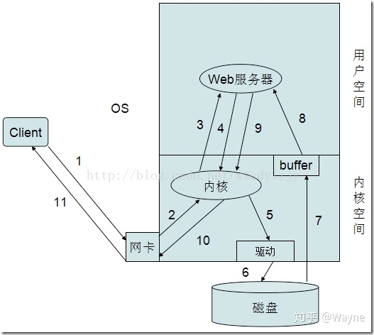

# I/O 模型与 Web 服务器工作模型

## Web服务器处理并发连接请求的工作模型  
来源：https://www.cnblogs.com/hello-/articles/9329066.html  

一、单线程web服务器(Single-threaded web servers)  
此种架构方式中，web服务器一次处理一个请求，结束后读取并处理下一个请求。在某请求处理过程中，其它所有的请求将被忽略，因此，在并发请求较多的场景中将会出现严重的性能问题。（即一次只能处理一个请求）
 
二、多进程/多线程web服务器  
此种架构方式中，web服务器生成多个进程或线程并行处理多个用户请求，进程或线程可以按需或事先生成。有的web服务器应用程序为每个用户请求生成一个单独的进程或线程来进行响应，不过，一旦并发请求数量达到成千上万时，多个同时运行的进程或线程将会消耗大量的系统资源。（即每个进程只能响应一个请求，并且一个进程对应一个线程）
 
三、I/O多路复用web服务器  
为了能够支持更多的并发用户请求，越来越多的web服务器正在采用多种复用的架构--即同步监控所有的连接请求的活动状态，当一个连接的状态发生改变时(如数据准备完毕或发生某错误)，将为其执行一系列特定操作；在操作完成后，此连接将重新变回暂时的稳定态并返回至打开的连接列表中，直到下一次的状态改变。由于其多路复用的特性，进程或线程不会被空闲的连接所占用，因而可以提供高效的工作模式。（这种架构可以理解为一个进程可以生成多个线程，每个请求交给一个线程进行处理）。
 
linux下常用的I/O模型  
先引入select和epoll概念：  
select和epoll是两个处理I/O模型的机制，可以加速请求处理，2者处理方式不同：通俗的讲，select机制是对没有处理好的I/O请求在一段时间内进行检测，并将其状态通知给用户，即有没有完成都会通知。而epoll机制则是在该I/O请求完成后才通知给用户。
 
在Unix/Linux下共有五种I/O模型，分别是：  
1. 阻塞I/O
2. 非阻塞I/O
3. I/O复用（select和poll）
4. 信号驱动I/O（SIGIO）
5. 异步I/O（Posix.1的aio_系列函数）
 
对以上模型的比较：  
阻塞I/O：  
应用程序调用一个IO函数，导致应用程序阻塞，等待数据准备好。 如果数据没有准备好，一直等待….数据准备好了，从内核拷贝到用户空间,IO函数返回成功指示
 
非阻塞I/O:  
我们把一个套接口设置为非阻塞就是告诉内核，当所请求的I/O操作无法完成时，不要将进程睡眠，而是返回一个错误。这样我们的I/O操作函数将不断的测试数据是否已经准备好，如果没有准备好，继续测试，直到数据准备好为止。在这个不断测试的过程中，会大量的占用CPU的时间。
 
I/O复用（select和poll）:  
I/O复用模型会用到select或者poll函数，这两个函数也会使进程阻塞，但是和阻塞I/O所不同的的，这两个函数可以同时阻塞多个I/O操作。而且可以同时对多个读操作，多个写操作的I/O函数进行检测，直到有数据可读或可写时，才真正调用I/O操作函数。
 
信号驱动I/O（SIGIO）:  
首先我们允许套接口进行信号驱动I/O,并安装一个信号处理函数，进程继续运行并不阻塞。当数据准备好时，进程会收到一个SIGIO信号，可以在信号处理函数中调用I/O操作函数处理数据。 
 
异步I/O（Posix.1的aio_系列函数）:  
当一个异步过程调用发出后，调用者不能立刻得到结果。实际处理这个调用的部件在完成后，通过状态、通知和回调来通知调用者的输入输出操作
 
回顾下apache的工作模块：  
prefork：多进程，每个请求用一个进程响应，这个过程会用到select机制来通知。  
worker：多进程，一个进程可以生成多个线程，每个线程响应一个请求。  
event：一个进程，每个进程响应多个用户请求，它是基于事件实现的。  
 
基于事件机制的特性：  
一个进程响应多个用户请求，利用run-loop机制，让套接字复用，请求过来后进程并不处理请求，而是直接交由其他机制来处理，通过select或epoll机制来通知请求是否完成；在这个过程中，进程本身一直处于空闲状态，可以一直接收用户请求。
 
 
对于高并发请求的实现:  
1、基于线程：即一个进程生成多个线程，每个线程响应用户的每个请求。如worker模型  
2、基于事件的模型，一个进程处理多个请求，并且通过epoll机制来通知用户请求完成。如event模型    
 
四、多路复用多线程web服务器  
将多进程和多路复用的功能结合起来形成的web服务器架构，其避免了让一个进程服务于过多的用户请求，并能充分利用多CPU主机所提供的计算能力。（这种架构可以理解为有多个进程，并且一个进程又生成多个线程，每个线程处理一个请求）
 
五、web服务器工作流程：  
我们知道web服务器是工作在用户空间的，用户空间通过系统调用来与内核打交道。
用户请求-->送达用户空间-->系统调用-->内核空间-->内核到磁盘上读取网页资源（在此过程中就牵涉到了以上几种模型的运用）
 
传统上基于进程或线程模型架构的web服务通过每进程或每线程处理并发连接请求，这势必会在网络和I/O操作时产生阻塞，其另一个必然结果则是对内存或CPU的利用率低下。生成一个新的进程/线程需要事先备好其运行时环境，这包括为其分配堆内存和栈内存，以及为其创建新的执行上下文等。这些操作都需要占用CPU，而且过多的进程/线程还会带来线程抖动或频繁的上下文切换，系统性能也会由此进一步下降。
 
六、NGINX  
nginx的主要着眼点就是其高性能以及对物理计算资源的高密度利用，因此其采用了不同的架构模型。受启发于多种操作系统设计中基于“事件”的高级处理机制，nginx采用了模块化、事件驱动、异步、单线程及非阻塞的架构，并大量采用了多路复用及事件通知机制。在nginx中，连接请求由为数不多的几个仅包含一个线程的进程worker以高效的回环(run-loop)机制进行处理，而每个worker可以并行处理数千个的并发连接及请求。
 
Nginx会按需同时运行多个进程：一个主进程(master)和几个工作进程(worker)，配置了缓存时还会有缓存加载器进程(cache loader)和缓存管理器进程(cache manager)等。所有进程均是仅含有一个线程，并主要通过“共享内存”的机制实现进程间通信。主进程以root用户身份运行，而worker、cache loader和cache manager均应以非特权用户身份运行。
 
主进程主要完成如下工作：
1. 读取并验正配置信息；
2. 创建、绑定及关闭套接字；
3. 启动、终止及维护worker进程的个数；
4. 无须中止服务而重新配置工作特性；
5. 控制非中断式程序升级，启用新的二进制程序并在需要时回滚至老版本；
6. 重新打开日志文件；
7. 编译嵌入式perl脚本；
 
worker进程主要完成的任务包括：
1. 接收、传入并处理来自客户端的连接；
2. 提供反向代理及过滤功能；
3. nginx任何能完成的其它任务；

如果负载以CPU密集型应用为主，如SSL或压缩应用，则worker数应与CPU数相同；如果负载以IO密集型为主，如响应大量内容给客户端，则worker数应该为CPU个数的1.5或2倍
 
Nginx的代码是由一个核心和一系列的模块组成, 核心主要用于提供Web Server的基本功能，以及Web和Mail反向代理的功能；还用于启用网络协议，创建必要的运行时环境以及确保不同的模块之间平滑地进行交互。不过，大多跟协议相关的功能和某应用特有的功能都是由nginx的模块实现的。这些功能模块大致可以分为事件模块、阶段性处理器、输出过滤器、变量处理器、协议、upstream和负载均衡几个类别，这些共同组成了nginx的http功能。事件模块主要用于提供OS独立的(不同操作系统的事件机制有所不同)事件通知机制如kqueue或epoll等。协议模块则负责实现nginx通过http、tls/ssl、smtp、pop3以及imap与对应的客户端建立会话。
 
在nginx内部，进程间的通信是通过模块的pipeline或chain实现的；换句话说，每一个功能或操作都由一个模块来实现。例如，压缩、通过FastCGI或uwsgi协议与upstream服务器通信，以及与memcached建立会话等。
 
缓存机制：  
我们知道，用户请求不止要请求静态内容，反而大多数请求的都是动态类的网页，在请求动态内容时，php服务器要和mysql打交道，如果请求数量太多，这势必会导致响应用户请求的速度变慢，为了解决这一问题，我们还要引入缓存的概念。
 
在这里我们引入一个加速缓存的工具：Memcached  
Memcached是一款开源、高性能、分布式内存对象缓存系统，可应用各种需要缓存的场景，其主要目的是通过降低对Database的访问来加速web应用程序。它是一个基于内存的“键值对”存储，用于存储数据库调用、API调用或页面引用结果的直接数据，如字符串、对象等。
 
Memcached是一款开发工具，它既不是一个代码加速器，也不是数据库中间件。其设计哲学思想主要反映在如下方面：
1. 简单key/value存储：服务器不关心数据本身的意义及结构，只要是可序列化数据即可。存储项由“键、过期时间、可选的标志及数据”四个部分组成；
2. 功能的实现一半依赖于客户端，一半基于服务器端：客户负责发送存储项至服务器端、从服务端获取数据以及无法连接至服务器时采用相应的动作；服务端负责接收、存储数据，并负责数据项的超时过期；
3. 各服务器间彼此无视：不在服务器间进行数据同步；
4. O(1)的执行效率
5. 清理超期数据：默认情况下，Memcached是一个LRU缓存，同时，它按事先预订的时长清理超期数据；但事实上，memcached不会删除任何已缓存数据，只是在其过期之后不再为客户所见；而且，memcached也不会真正按期限清理缓存，而仅是当get命令到达时检查其时长；
 
Memcached提供了为数不多的几个命令来完成与服务器端的交互，这些命令基于memcached的协议实现。  
* 存储类命令：set, add, replace, append, prepend
* 获取数据类命令：get, delete, incr/decr
* 统计类命令：stats, stats items, stats slabs, stats sizes
* 清理命令： flush_all

## Web 优化必须了解的原理之 I/O 的五种模型和 Web 的三种工作模式
来源：https://blog.51cto.com/litaotao/1289790  

五种I/O：

 1）阻塞I/0

 2）非阻塞I/O

 3）I/O复用

 4）事件(信号)驱动I/O

 5）异步I/O

为什么要发起系统调用？

    因为进程想要获取磁盘中的数据，而能和硬件打交道的只能是内核，进程通知内核说我要磁盘中的数据，此过程就是系统调用。

一次I/O的完成的步骤

    当进程发起系统调用时，这个系统调用就进入内核模式，然后开始I/O操作

I/O操作分为两个步骤；

    1、磁盘把数据装载到内核的内存空间，

    2、内核的内存空间的数据copy到用户的内存空间中(此过程是I/O发生的地方)

以下是进程获取数据的详细图解过程；

     整个过程：此进程需要对磁盘中的数据进行操作，则会向内核发起一个系统调用，然后此进程，将会被切换出去，此进程会被挂起或者进入睡眠状态，也叫不可中断的睡眠，因为数据还没有得到，只有等到系统调用的结果完成后，则进程会被唤醒，继续接下来的操作，从系统调用的开始到系统调用结束经过的步骤：

①进程向内核发起一个系统调用，

②内核接收到系统调用，知道是对文件的请求，于是告诉磁盘，把文件读取出来

③磁盘接收到来着内核的命令后，把文件载入到内核的内存空间里面

④内核的内存空间接收到数据之后，把数据copy到用户进程的内存空间(此过程是I/O发生的地方)

⑤进程内存空间得到数据后，给内核发送通知

⑥内核把接收到的通知回复给进程，此过程为唤醒进程，然后进程得到数据，进行下一步操作

I/O发生的地方才会出现阻塞或非阻塞

    阻塞：进程发起I/O调用，进程又不得不等待I/O的完成，此时CPU把进程切换出去，进程处于睡眠状态则此过程为阻塞I/O

    阻塞I/O系统怎么通知进程？

       I/O完成，系统直接通知进程，则进程被唤醒

阻塞I/O的图解

  非阻塞：进程发起I/O调用，I/O自己知道需过一段时间完成，就立即通知进程进行别的操作，则为非阻塞I/O

非阻塞I/O，系统怎么通知进程？

   每隔一段时间，问内核数据是否准备完成，系统完成后，则进程获取数据，继续执行(此过程也称盲等待)

非阻塞I/O的图解：

I/O复用的图解：

事件(信号)驱动I/O的图解：

    水平触发的事件驱动机制；内核通知进程来读取数据，进程没来读取数据，内核需要一次一次的通知进程；

     边缘触发的事件驱动机制；内核只通知一次让进程来读取数据，进程可以在超时时间之内随时来读取数据。

     nginx就采用了边缘触发的事件驱动机制，这就是为什么nginx的并发性比apache好，当然nginx的性能比apache好，还有其它方面，如nginx支持异步I/O，mmap(内存映射)等等

异步I/O的图解：

  前四种I/O属于同步操作，最后的一种则属于异步操作

五种I/O模型的比较：

web的三种工作模式

Prefork工作原理

    主进程生成多个工作进程，由工作进程一对一的去响应客户端的请求

  图解Prefork工作原理：

Worker工作原理

    主进程生成多个工作进程，每个工作进程生成一个多个线程，每个线程去

响应客户端的请求

   图解Worker工作原理：

Event工作原理

    主进程生成多个工作进程，每个工程进程响应多个客户端的请求，当接收

到客户端的I/O操作请求后，把I/O操作交给内核执行，进程去响应其他客

户端的请求，此进程最后接到内核的通知，然后通过此进程回复客户端的

请求结果，通过事件回调函数

  图解Event工作原理：

## 五种IO模型
来源：https://zhuanlan.zhihu.com/p/163003197  
I/O通常有内存IO、网络I/O、磁盘I/O等，但我们通常说的是网络I/O以及磁盘I/O。 网络I/O：本质是socket读取

每次I/O请求，都会有两个阶段组成： 第一步：等待数据，即数据从磁盘到内核内存；将数据从磁盘文件先加载到内核内存空间（缓冲区），等待数据准备完成，时间较长。 第二步：复制数据，即数据内核内存到进程内存；将数据从内核缓冲复制到用户空间的进程内存中，时间较短。

Web请求处理过程
  

1. 客户端发起情况到服务器网卡
2. 服务器网卡接受到请求后转交给内核处理
3. 内核根据请求对应的套接字，将请求交给工作在用户空间的Web服务器进程
4. Web服务器进程根据用户请求，向内核进行系统调用，申请获取相应资源（如：客户端获取图片）
5. 内核发现Web服务器进程请求的是一个存放在本地硬盘上的资源，因此通过驱动程序连接磁盘
6. 内核调用磁盘，获取需要的资源
7. 内核将资源存放在自己的缓存区中，并通知Web服务器进程
8. Web服务器进程通过系统调用取得资源，并将其复制到进程自己的缓冲区中
9. Web服务器进程形成响应，通过系统调用再次发给内核以响应请求
10. 内核将响应发送至网卡
11. 网卡发送响应给用户
12. 通过这样的一个复杂过程，一次请求就完成了

简单来说就是：

用户请求——》送达用户空间——〉系统调用——》内核空间——〉内核到磁盘上读取图片资源——》返回到用户空间——〉响应给用户

上述简单的说明了一下，客户端向Web服务器请求过程，在这个过程中，有两个I/O过程：一是客户端请求的网络I/O，二个是Web服务器请求图片磁盘I/O。
