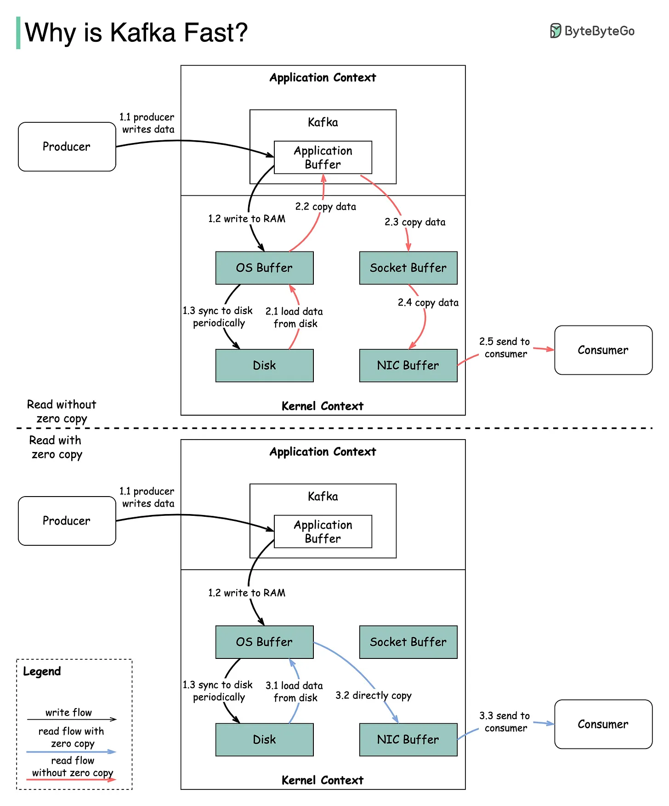
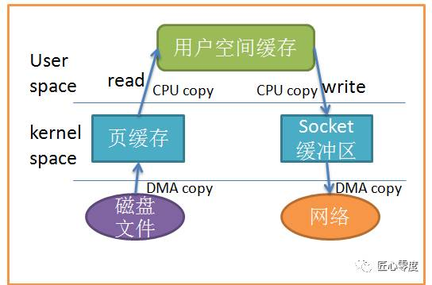
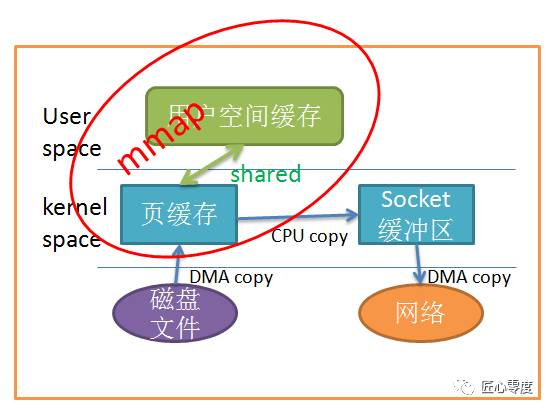

# I/O 模型与 Web 服务器工作模型

## [阻塞与中断基础知识](../../Computer%20System%20Layer/阻塞与中断.md)

## NIO 相关基础
来源：  
* [NIO 基础](https://mp.weixin.qq.com/s?__biz=MzU0MzQ5MDA0Mw==&mid=2247483907&idx=1&sn=3d5e1384a36bd59f5fd14135067af1c2&chksm=fb0be897cc7c61815a6a1c3181f3ba3507b199fd7a8c9025e9d8f67b5e9783bc0f0fe1c73903&scene=21#wechat_redirect)
* [高级 IO 模型之 kqueue 和 epoll](https://www.cnblogs.com/flydean/p/16036421.html)

用户空间以及内核空间概念
我们知道现在操作系统都是采用虚拟存储器，那么对32位操作系统而言，它的寻址空间（虚拟存储空间）为4G（2的32次方）。操心系统的核心是内核，独立于普通的应用程序，可以访问受保护的内存空间，也有访问底层硬件设备的所有权限。为了保证用户进程不能直接操作内核，保证内核的安全，操心系统将虚拟空间划分为两部分，一部分为内核空间，一部分为用户空间。针对linux操作系统而言，将最高的1G字节（从虚拟地址0xC0000000到0xFFFFFFFF），供内核使用，称为内核空间，而将较低的3G字节（从虚拟地址0x00000000到0xBFFFFFFF），供各个进程使用，称为用户空间。每个进程可以通过系统调用进入内核，因此，Linux内核由系统内的所有进程共享。于是，从具体进程的角度来看，每个进程可以拥有4G字节的虚拟空间。

空间分配如下图所示：

有了用户空间和内核空间，整个linux内部结构可以分为三部分，从最底层到最上层依次是：硬件-->内核空间-->用户空间。

1. 内核空间中存放的是内核代码和数据，而进程的用户空间中存放的是用户程序的代码和数据。不管是内核空间还是用户空间，它们都处于虚拟空间中。
2. Linux使用两级保护机制：0级供内核使用，3级供用户程序使用。

Linux 网络 I/O模型

都知道，为了OS的安全性等的考虑，进程是无法直接操作I/O设备的，其必须通过系统调用请求内核来协助完成I/O动作，而内核会为每个I/O设备维护一个buffer。
如下图所示：
  
  

整个请求过程为： 用户进程发起请求，内核接受到请求后，从I/O设备中获取数据到buffer中，再将buffer中的数据copy到用户进程的地址空间，该用户进程获取到数据后再响应客户端。

在整个请求过程中，数据输入至buffer需要时间，而从buffer复制数据至进程也需要时间。因此根据在这两段时间内等待方式的不同，I/O动作可以分为以下五种模式：

* 阻塞I/O (Blocking I/O)
* 非阻塞I/O (Non-Blocking I/O)
* I/O复用 (I/O Multiplexing)
* 信号驱动的I/O (Signal Driven I/O)
* 异步I/O (Asynchrnous I/O) 
  
说明：如果像了解更多可能需要linux/unix方面的知识了，可自行去学习一些网络编程原理应该有详细说明，不过对大多数java程序员来说，不需要了解底层细节，知道个概念就行，知道对于系统而言，底层是支持的。

本文最重要的参考文献是 Richard Stevens 的 “UNIX® Network Programming Volume 1, Third Edition: The Sockets Networking ”，6.2节“I/O Models ”。

记住这两点很重要
1. 等待数据准备 (Waiting for the data to be ready)
2. 将数据从内核拷贝到进程中 (Copying the data from the kernel to the process)

I/O发生的地方才会出现阻塞或非阻塞

    阻塞：进程发起I/O调用，进程又不得不等待I/O的完成，此时CPU把进程切换出去，进程处于睡眠状态则此过程为阻塞I/O

    阻塞I/O系统怎么通知进程？I/O完成，系统直接通知进程，则进程被唤醒

阻塞I/O (Blocking I/O)  
  
在linux中，默认情况下所有的socket都是blocking，一个典型的读操作流程大概是这样：
当用户进程调用了recvfrom这个系统调用，内核就开始了IO的第一个阶段：等待数据准备。对于network io来说，很多时候数据在一开始还没有到达（比如，还没有收到一个完整的UDP包），这个时候内核就要等待足够的数据到来。而在用户进程这边，整个进程会被阻塞。当内核一直等到数据准备好了，它就会将数据从内核中拷贝到用户内存，然后内核返回结果，用户进程才解除block的状态，重新运行起来。
所以，blocking IO的特点就是在IO执行的两个阶段都被block了。

非阻塞I/O (Non-Blocking I/O)  
  
linux下，可以通过设置socket使其变为non-blocking。当对一个non-blocking socket执行读操作时，流程是这个样子：
当用户进程调用recvfrom时，系统不会阻塞用户进程，而是立刻返回一个ewouldblock错误，从用户进程角度讲 ，并不需要等待，而是马上就得到了一个结果。用户进程判断标志是ewouldblock时，就知道数据还没准备好，于是它就可以去做其他的事了，于是它可以再次发送recvfrom，一旦内核中的数据准备好了。并且又再次收到了用户进程的system call，那么它马上就将数据拷贝到了用户内存，然后返回。

当一个应用程序在一个循环里对一个非阻塞调用recvfrom，我们称为轮询。应用程序不断轮询内核，看看是否已经准备好了某些操作。这通常是浪费CPU时间，但这种模式偶尔会遇到。

I/O复用 (I/O Multiplexing)  
  
IO multiplexing这个词可能有点陌生，但是如果我说select，epoll，大概就都能明白了。有些地方也称这种IO方式为event driven IO。我们都知道，select/epoll的好处就在于单个process就可以同时处理多个网络连接的IO。它的基本原理就是select/epoll这个function会不断的轮询所负责的所有socket，当某个socket有数据到达了，就通知用户进程：  
当用户进程调用了select，那么整个进程会被block，而同时，内核会“监视”所有select负责的socket，当任何一个socket中的数据准备好了，select就会返回。这个时候用户进程再调用read操作，将数据从内核拷贝到用户进程。
这个图和blocking IO的图其实并没有太大的不同，事实上，还更差一些。因为这里需要使用两个system call (select 和 recvfrom)，而blocking IO只调用了一个system call (recvfrom)。但是，用select的优势在于它可以同时处理多个connection。（多说一句。所以，如果处理的连接数不是很高的话，使用select/epoll的web server不一定比使用multi-threading + blocking IO的web server性能更好，可能延迟还更大。select/epoll的优势并不是对于单个连接能处理得更快，而是在于能处理更多的连接。）
在IO multiplexing Model中，实际中，对于每一个socket，一般都设置成为non-blocking，但是，如上图所示，整个用户的process其实是一直被block的。只不过process是被select这个函数block，而不是被socket IO给block。

文件描述符fd  
Linux的内核将所有外部设备都可以看做一个文件来操作。那么我们对与外部设备的操作都可以看做对文件进行操作。我们对一个文件的读写，都通过调用内核提供的系统调用；内核给我们返回一个filede scriptor（fd,文件描述符）。而对一个socket的读写也会有相应的描述符，称为socketfd(socket描述符)。描述符就是一个数字，指向内核中一个结构体（文件路径，数据区，等一些属性）。那么我们的应用程序对文件的读写就通过对描述符的读写完成。

**select**  
基本原理：select 函数监视的文件描述符分3类，分别是writefds、readfds、和exceptfds。调用后select函数会阻塞，直到有描述符就绪（有数据 可读、可写、或者有except），或者超时（timeout指定等待时间，如果立即返回设为null即可），函数返回。当select函数返回后，可以通过遍历fdset，来找到就绪的描述符。

缺点:
1. select最大的缺陷就是单个进程所打开的FD是有一定限制的，它由FDSETSIZE设置，32位机默认是1024个，64位机默认是2048。
一般来说这个数目和系统内存关系很大，”具体数目可以cat /proc/sys/fs/file-max察看”。32位机默认是1024个。64位机默认是2048.
1. 对socket进行扫描时是线性扫描，即采用轮询的方法，效率较低。
当套接字比较多的时候，每次select()都要通过遍历FDSETSIZE个Socket来完成调度，不管哪个Socket是活跃的，都遍历一遍。这会浪费很多CPU时间。”如果能给套接字注册某个回调函数，当他们活跃时，自动完成相关操作，那就避免了轮询”，这正是epoll与kqueue做的。
3、需要维护一个用来存放大量fd的数据结构，这样会使得用户空间和内核空间在传递该结构时复制开销大。

**poll**  
基本原理：poll本质上和select没有区别，它将用户传入的数组拷贝到内核空间，然后查询每个fd对应的设备状态，如果设备就绪则在设备等待队列中加入一项并继续遍历，如果遍历完所有fd后没有发现就绪设备，则挂起当前进程，直到设备就绪或者主动超时，被唤醒后它又要再次遍历fd。这个过程经历了多次无谓的遍历。

它没有最大连接数的限制，原因是它是基于链表来存储的，但是同样有一个缺点：
1. 大量的fd的数组被整体复制于用户态和内核地址空间之间，而不管这样的复制是不是有意义。
2. poll还有一个特点是“水平触发”，如果报告了fd后，没有被处理，那么下次poll时会再次报告该fd。

注意：从上面看，select和poll都需要在返回后，通过遍历文件描述符来获取已经就绪的socket。事实上，同时连接的大量客户端在一时刻可能只有很少的处于就绪状态，因此随着监视的描述符数量的增长，其效率也会线性下降。

### **epoll 和 kqueue**
epoll是之前的select和poll的增强版本。相对于select和poll来说，epoll更加灵活，没有描述符限制。epoll使用一个文件描述符管理多个描述符，将用户关系的文件描述符的事件存放到内核的一个事件表中，这样在用户空间和内核空间的copy只需一次。

基本原理：epoll支持水平触发和边缘触发，最大的特点在于边缘触发，它只告诉进程哪些fd刚刚变为就绪态，并且只会通知一次。还有一个特点是，epoll使用“事件”的就绪通知方式，通过epollctl注册fd，一旦该fd就绪，内核就会采用类似callback的回调机制来激活该fd，epollwait便可以收到通知。

*水平触发的事件驱动机制；内核通知进程来读取数据，进程没来读取数据，内核需要一次一次的通知进程；边缘触发的事件驱动机制；内核只通知一次让进程来读取数据，进程可以在超时时间之内随时来读取数据。nginx就采用了边缘触发的事件驱动机制，这就是为什么nginx的并发性比apache好，当然nginx的性能比apache好，还有其它方面，如nginx支持异步I/O，mmap(内存映射)等等*

epoll的优点：
1. 没有最大并发连接的限制，能打开的FD的上限远大于1024（1G的内存上能监听约10万个端口）。
2. 效率提升，不是轮询的方式，不会随着FD数目的增加效率下降。
只有活跃可用的FD才会调用callback函数；即Epoll最大的优点就在于它只管你“活跃”的连接，而跟连接总数无关，因此在实际的网络环境中，Epoll的效率就会远远高于select和poll。
1. 内存拷贝，利用mmap()文件映射内存加速与内核空间的消息传递；即epoll使用mmap减少复制开销。

**select和poll虽然都是多路复用IO，但是他们都有些缺点。而epoll和kqueue就是对他们的优化。epoll是linux系统中的系统命令，可以将其看做是event poll。对于传统的select和poll来说，因为需要不断的遍历所有的file descriptors，所以每一次的select的执行效率是O(n) ,但是对于epoll来说，这个时间可以提升到O(1)。这是因为epoll会在具体的监控事件发生的时候触发通知，所以不需要使用像select这样的轮询，其效率会更高。epoll 使用红黑树 (RB-tree) 数据结构来跟踪当前正在监视的所有文件描述符。**

**epoll和kqueue之所以比select和poll更加高级， 是因为他们充分利用操作系统底层的功能，对于操作系统来说，数据什么时候ready是肯定知道的，通过向操作系统注册对应的事件，可以避免select的轮询操作，提升操作效率。**

JDK1.5_update10版本使用epoll替代了传统的select/poll，极大的提升了NIO通信的性能。

备注：JDK NIO的BUG，例如臭名昭著的epoll bug，它会导致Selector空轮询，最终导致CPU 100%。官方声称在JDK1.6版本的update18修复了该问题，但是直到JDK1.7版本该问题仍旧存在，只不过该BUG发生概率降低了一些而已，它并没有被根本解决。这个可以在后续netty系列里面进行说明下。

信号驱动的I/O (Signal Driven I/O)  
  
由于signal driven IO在实际中并不常用，所以简单提下。
很明显可以看出用户进程不是阻塞的。首先用户进程建立SIGIO信号处理程序，并通过系统调用sigaction执行一个信号处理函数，这时用户进程便可以做其他的事了，一旦数据准备好，系统便为该进程生成一个SIGIO信号，去通知它数据已经准备好了，于是用户进程便调用recvfrom把数据从内核拷贝出来，并返回结果。

异步I/O  
  
一般来说，这些函数通过告诉内核启动操作并在整个操作（包括内核的数据到缓冲区的副本）完成时通知我们。这个模型和前面的信号驱动I/O模型的主要区别是，在信号驱动的I/O中，内核告诉我们何时可以启动I/O操作，但是异步I/O时，内核告诉我们何时I/O操作完成。
当用户进程向内核发起某个操作后，会立刻得到返回，并把所有的任务都交给内核去完成（包括将数据从内核拷贝到用户自己的缓冲区），内核完成之后，只需返回一个信号告诉用户进程已经完成就可以了。

5中I/O模型的对比  
  
结果表明：前四个模型之间的主要区别是第一阶段，四个模型的第二阶段是一样的：过程受阻在调用recvfrom当数据从内核拷贝到用户缓冲区。然而，异步I/O处理两个阶段，与前四个不同。

从同步、异步，以及阻塞、非阻塞两个维度来划分来看：

### 零拷贝  
  
CPU不执行拷贝数据从一个存储区域到另一个存储区域的任务，这通常用于在网络上传输文件时节省CPU周期和内存带宽。

缓存 IO  
缓存 IO 又被称作标准 IO，大多数文件系统的默认 IO 操作都是缓存 IO。在 Linux 的缓存 IO 机制中，操作系统会将 IO 的数据缓存在文件系统的页缓存（ page cache ）中，也就是说，数据会先被拷贝到操作系统内核的缓冲区中，然后才会从操作系统内核的缓冲区拷贝到应用程序的地址空间。

缓存 IO 的缺点：数据在传输过程中需要在应用程序地址空间和内核进行多次数据拷贝操作，这些数据拷贝操作所带来的 CPU 以及内存开销是非常大的。

零拷贝技术分类  
零拷贝技术的发展很多样化，现有的零拷贝技术种类也非常多，而当前并没有一个适合于所有场景的零拷贝技术的出现。对于 Linux 来说，现存的零拷贝技术也比较多，这些零拷贝技术大部分存在于不同的 Linux 内核版本，有些旧的技术在不同的 Linux 内核版本间得到了很大的发展或者已经渐渐被新的技术所代替。概括起来，Linux 中的零拷贝技术主要有下面这几种：
* 直接 I/O：对于这种数据传输方式来说，应用程序可以直接访问硬件存储，操作系统内核只是辅助数据传输：这类零拷贝技术针对的是操作系统内核并不需要对数据进行直接处理的情况，数据可以在应用程序地址空间的缓冲区和磁盘之间直接进行传输，完全不需要 Linux 操作系统内核提供的页缓存的支持。
* 在数据传输的过程中，避免数据在操作系统内核地址空间的缓冲区和用户应用程序地址空间的缓冲区之间进行拷贝。有的时候，应用程序在数据进行传输的过程中不需要对数据进行访问，那么，将数据从 Linux 的页缓存拷贝到用户进程的缓冲区中就可以完全避免，传输的数据在页缓存中就可以得到处理。在某些特殊的情况下，这种零拷贝技术可以获得较好的性能。Linux 中提供类似的系统调用主要有 mmap()，sendfile() 以及 splice()。
* 对数据在 Linux 的页缓存和用户进程的缓冲区之间的传输过程进行优化。该零拷贝技术侧重于灵活地处理数据在用户进程的缓冲区和操作系统的页缓存之间的拷贝操作。这种方法延续了传统的通信方式，但是更加灵活。在Linux 中，该方法主要利用了写时复制技术。

硬件和软件之间的数据传输可以通过使用 DMA 来进行，DMA 进行数据传输的过程中几乎不需要CPU参与，这样就可以把 CPU 解放出来去做更多其他的事情，但是当数据需要在用户地址空间的缓冲区和 Linux 操作系统内核的页缓存之间进行传输的时候，并没有类似 DMA 这种工具可以使用，CPU 需要全程参与到这种数据拷贝操作中，所以这第三类方法的目的是可以有效地改善数据在用户地址空间和操作系统内核地址空间之间传递的效率。  
  

当应用程序访问某块数据时，操作系统首先会检查，是不是最近访问过此文件，文件内容是否缓存在内核缓冲区，如果是，操作系统则直接根据read系统调用提供的buf地址，将内核缓冲区的内容拷贝到buf所指定的用户空间缓冲区中去。如果不是，操作系统则首先将磁盘上的数据拷贝的内核缓冲区，这一步目前主要依靠DMA来传输，然后再把内核缓冲区上的内容拷贝到用户缓冲区中。  
接下来，write系统调用再把用户缓冲区的内容拷贝到网络堆栈相关的内核缓冲区中，最后socket再把内核缓冲区的内容发送到网卡上。  

应用程序调用 mmap()，磁盘上的数据会通过 DMA 被拷贝的内核缓冲区，接着操作系统会把这段内核缓冲区与应用程序共享，这样就不需要把内核缓冲区的内容往用户空间拷贝。应用程序再调用 write(),操作系统直接将内核缓冲区的内容拷贝到 socket 缓冲区中，这一切都发生在内核态，最后，socket 缓冲区再把数据发到网卡去。  
  

## Web服务器处理并发连接请求的工作模型  
来源：https://www.cnblogs.com/hello-/articles/9329066.html  

一、单线程web服务器(Single-threaded web servers)  
此种架构方式中，web服务器一次处理一个请求，结束后读取并处理下一个请求。在某请求处理过程中，其它所有的请求将被忽略，因此，在并发请求较多的场景中将会出现严重的性能问题。（即一次只能处理一个请求）
 
二、多进程/多线程web服务器  
此种架构方式中，web服务器生成多个进程或线程并行处理多个用户请求，进程或线程可以按需或事先生成。有的web服务器应用程序为每个用户请求生成一个单独的进程或线程来进行响应，不过，一旦并发请求数量达到成千上万时，多个同时运行的进程或线程将会消耗大量的系统资源。（即每个进程只能响应一个请求，并且一个进程对应一个线程）
 
三、I/O多路复用web服务器  
为了能够支持更多的并发用户请求，越来越多的web服务器正在采用多种复用的架构--即同步监控所有的连接请求的活动状态，当一个连接的状态发生改变时(如数据准备完毕或发生某错误)，将为其执行一系列特定操作；在操作完成后，此连接将重新变回暂时的稳定态并返回至打开的连接列表中，直到下一次的状态改变。由于其多路复用的特性，进程或线程不会被空闲的连接所占用，因而可以提供高效的工作模式。（这种架构可以理解为一个进程可以生成多个线程，每个请求交给一个线程进行处理）。
 
回顾下apache的工作模块：  
prefork：多进程，每个请求用一个进程响应，这个过程会用到select机制来通知。  
worker：多进程，一个进程可以生成多个线程，每个线程响应一个请求。  
event：一个进程，每个进程响应多个用户请求，它是基于事件实现的。  
 
基于事件机制的特性：  
一个进程响应多个用户请求，利用run-loop机制，让套接字复用，请求过来后进程并不处理请求，而是直接交由其他机制来处理，通过select或epoll机制来通知请求是否完成；在这个过程中，进程本身一直处于空闲状态，可以一直接收用户请求。
 
 
对于高并发请求的实现:  
1、基于线程：即一个进程生成多个线程，每个线程响应用户的每个请求。如worker模型  
2、基于事件的模型，一个进程处理多个请求，并且通过epoll机制来通知用户请求完成。如event模型    
 
四、多路复用多线程web服务器  
将多进程和多路复用的功能结合起来形成的web服务器架构，其避免了让一个进程服务于过多的用户请求，并能充分利用多CPU主机所提供的计算能力。（这种架构可以理解为有多个进程，并且一个进程又生成多个线程，每个线程处理一个请求）
 
五、web服务器工作流程：  
我们知道web服务器是工作在用户空间的，用户空间通过系统调用来与内核打交道。
用户请求-->送达用户空间-->系统调用-->内核空间-->内核到磁盘上读取网页资源（在此过程中就牵涉到了以上几种模型的运用）
 
传统上基于进程或线程模型架构的web服务通过每进程或每线程处理并发连接请求，这势必会在网络和I/O操作时产生阻塞，其另一个必然结果则是对内存或CPU的利用率低下。生成一个新的进程/线程需要事先备好其运行时环境，这包括为其分配堆内存和栈内存，以及为其创建新的执行上下文等。这些操作都需要占用CPU，而且过多的进程/线程还会带来线程抖动或频繁的上下文切换，系统性能也会由此进一步下降。
 
六、NGINX  
nginx的主要着眼点就是其高性能以及对物理计算资源的高密度利用，因此其采用了不同的架构模型。受启发于多种操作系统设计中基于“事件”的高级处理机制，nginx采用了模块化、事件驱动、异步、单线程及非阻塞的架构，并大量采用了多路复用及事件通知机制。在nginx中，连接请求由为数不多的几个仅包含一个线程的进程worker以高效的回环(run-loop)机制进行处理，而每个worker可以并行处理数千个的并发连接及请求。
 
Nginx会按需同时运行多个进程：一个主进程(master)和几个工作进程(worker)，配置了缓存时还会有缓存加载器进程(cache loader)和缓存管理器进程(cache manager)等。所有进程均是仅含有一个线程，并主要通过“共享内存”的机制实现进程间通信。主进程以root用户身份运行，而worker、cache loader和cache manager均应以非特权用户身份运行。
 
主进程主要完成如下工作：
1. 读取并验正配置信息；
2. 创建、绑定及关闭套接字；
3. 启动、终止及维护worker进程的个数；
4. 无须中止服务而重新配置工作特性；
5. 控制非中断式程序升级，启用新的二进制程序并在需要时回滚至老版本；
6. 重新打开日志文件；
7. 编译嵌入式perl脚本；
 
worker进程主要完成的任务包括：
1. 接收、传入并处理来自客户端的连接；
2. 提供反向代理及过滤功能；
3. nginx任何能完成的其它任务；

如果负载以CPU密集型应用为主，如SSL或压缩应用，则worker数应与CPU数相同；如果负载以IO密集型为主，如响应大量内容给客户端，则worker数应该为CPU个数的1.5或2倍
 
Nginx的代码是由一个核心和一系列的模块组成, 核心主要用于提供Web Server的基本功能，以及Web和Mail反向代理的功能；还用于启用网络协议，创建必要的运行时环境以及确保不同的模块之间平滑地进行交互。不过，大多跟协议相关的功能和某应用特有的功能都是由nginx的模块实现的。这些功能模块大致可以分为事件模块、阶段性处理器、输出过滤器、变量处理器、协议、upstream和负载均衡几个类别，这些共同组成了nginx的http功能。事件模块主要用于提供OS独立的(不同操作系统的事件机制有所不同)事件通知机制如kqueue或epoll等。协议模块则负责实现nginx通过http、tls/ssl、smtp、pop3以及imap与对应的客户端建立会话。
 
在nginx内部，进程间的通信是通过模块的pipeline或chain实现的；换句话说，每一个功能或操作都由一个模块来实现。例如，压缩、通过FastCGI或uwsgi协议与upstream服务器通信，以及与memcached建立会话等。
 
缓存机制：  
我们知道，用户请求不止要请求静态内容，反而大多数请求的都是动态类的网页，在请求动态内容时，php服务器要和mysql打交道，如果请求数量太多，这势必会导致响应用户请求的速度变慢，为了解决这一问题，我们还要引入缓存的概念。
 
在这里我们引入一个加速缓存的工具：Memcached  
Memcached是一款开源、高性能、分布式内存对象缓存系统，可应用各种需要缓存的场景，其主要目的是通过降低对Database的访问来加速web应用程序。它是一个基于内存的“键值对”存储，用于存储数据库调用、API调用或页面引用结果的直接数据，如字符串、对象等。
 
Memcached是一款开发工具，它既不是一个代码加速器，也不是数据库中间件。其设计哲学思想主要反映在如下方面：
1. 简单key/value存储：服务器不关心数据本身的意义及结构，只要是可序列化数据即可。存储项由“键、过期时间、可选的标志及数据”四个部分组成；
2. 功能的实现一半依赖于客户端，一半基于服务器端：客户负责发送存储项至服务器端、从服务端获取数据以及无法连接至服务器时采用相应的动作；服务端负责接收、存储数据，并负责数据项的超时过期；
3. 各服务器间彼此无视：不在服务器间进行数据同步；
4. O(1)的执行效率
5. 清理超期数据：默认情况下，Memcached是一个LRU缓存，同时，它按事先预订的时长清理超期数据；但事实上，memcached不会删除任何已缓存数据，只是在其过期之后不再为客户所见；而且，memcached也不会真正按期限清理缓存，而仅是当get命令到达时检查其时长；
 
Memcached提供了为数不多的几个命令来完成与服务器端的交互，这些命令基于memcached的协议实现。  
* 存储类命令：set, add, replace, append, prepend
* 获取数据类命令：get, delete, incr/decr
* 统计类命令：stats, stats items, stats slabs, stats sizes
* 清理命令： flush_all

## Web 优化必须了解的原理之 I/O 的五种模型和 Web 的三种工作模式
来源：https://blog.51cto.com/litaotao/1289790  

### web 的三种工作模式

Prefork工作原理

    主进程生成多个工作进程，由工作进程一对一的去响应客户端的请求

  图解Prefork工作原理：

Worker工作原理

    主进程生成多个工作进程，每个工作进程生成一个多个线程，每个线程去

响应客户端的请求

   图解Worker工作原理：

Event工作原理

    主进程生成多个工作进程，每个工程进程响应多个客户端的请求，当接收

到客户端的I/O操作请求后，把I/O操作交给内核执行，进程去响应其他客

户端的请求，此进程最后接到内核的通知，然后通过此进程回复客户端的

请求结果，通过事件回调函数

  图解Event工作原理：

## 五种IO模型
来源：https://zhuanlan.zhihu.com/p/163003197  
I/O通常有内存IO、网络I/O、磁盘I/O等，但我们通常说的是网络I/O以及磁盘I/O。 网络I/O：本质是socket读取

每次I/O请求，都会有两个阶段组成： 第一步：等待数据，即数据从磁盘到内核内存；将数据从磁盘文件先加载到内核内存空间（缓冲区），等待数据准备完成，时间较长。 第二步：复制数据，即数据内核内存到进程内存；将数据从内核缓冲复制到用户空间的进程内存中，时间较短。

Web请求处理过程
  

1. 客户端发起情况到服务器网卡
2. 服务器网卡接受到请求后转交给内核处理
3. 内核根据请求对应的套接字，将请求交给工作在用户空间的Web服务器进程
4. Web服务器进程根据用户请求，向内核进行系统调用，申请获取相应资源（如：客户端获取图片）
5. 内核发现Web服务器进程请求的是一个存放在本地硬盘上的资源，因此通过驱动程序连接磁盘
6. 内核调用磁盘，获取需要的资源
7. 内核将资源存放在自己的缓存区中，并通知Web服务器进程
8. Web服务器进程通过系统调用取得资源，并将其复制到进程自己的缓冲区中
9. Web服务器进程形成响应，通过系统调用再次发给内核以响应请求
10. 内核将响应发送至网卡
11. 网卡发送响应给用户
12. 通过这样的一个复杂过程，一次请求就完成了

简单来说就是：

用户请求——》送达用户空间——〉系统调用——》内核空间——〉内核到磁盘上读取图片资源——》返回到用户空间——〉响应给用户

上述简单的说明了一下，客户端向Web服务器请求过程，在这个过程中，有两个I/O过程：一是客户端请求的网络I/O，二个是Web服务器请求图片磁盘I/O。

## 深入浅出理解 select、poll、epoll 的实现
参考：https://zhuanlan.zhihu.com/p/367591714  
