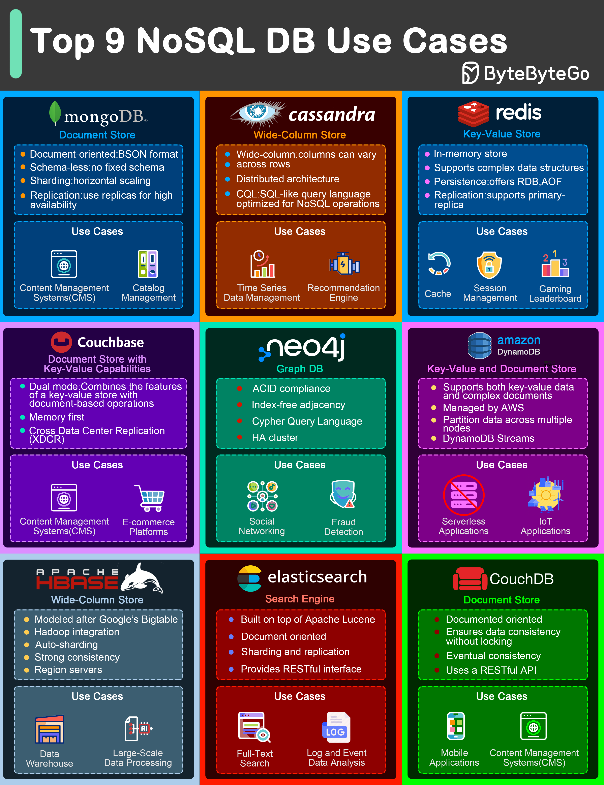
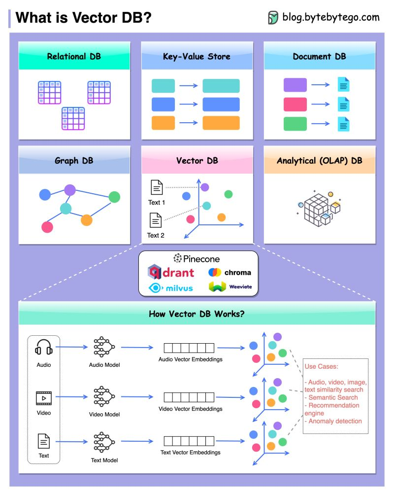
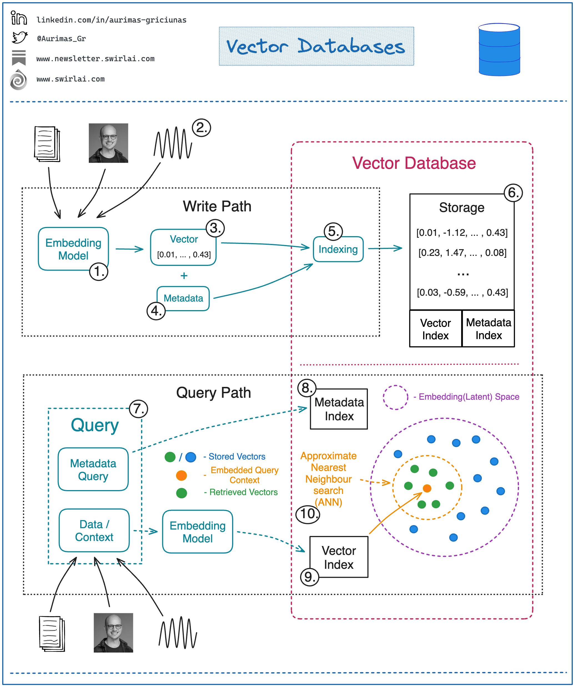

NoSQL 的全称是 Not Only SQL，也可以理解非关系型的数据库，是一种新型的数据库设计方式，不过它不是为了取代传统的关系型数据库而被设计的，它们分别代表了不同的数据库设计思路。  

# 键值数据库
## RocksDB
RocksDB（Facebook）延伸自 LevelDB（Google）的分支（该分支项目的初衷是提高服务器在高工作负载下的性能），它是一个用于键值数据的高性能嵌入式数据库，针对输入/输出（I/O）性能受限的负载状况，对多核处理器（CPUs）进行了优化，可以有效利用高速存储，如固态驱动器（SSD）等，它采用结构化日志合并树（LSM 树）的数据结构。  
RocksDB 与 LevelDB 一样，将键和值存储在任意字节数组中，并且数据按键或通过提供自定义比较器按字节排序。RocksDB 提供了 LevelDB 的所有功能，此外还包括：事务、备份和快照、列族、布隆过滤器、生存时间 (TTL) 支持、通用压实、合并运算符、统计收集、地理空间索引以及其他 RocksDB 包含但 LevelDB 中没有的功能。  

## Redis
* 是一个纯粹的内存数据库（内存满了会发生删除数据或拒绝写入）。
* 持久化方式：Redis 所有数据都是放在内存中的，持久化是使用 RDB 方式或者 aof 方式。  
  
# 文档数据库
其实是 KV 数据库的子集。  
除了可以存储常见数据外还可以直接存储图片、视频等二进制文件（替代对象存储，比如 MongoDB 的 [GridFS](https://www.mongodb.com/zh-cn/docs/v6.0/core/gridfs/)），有不俗的支持，另外半结构化的的数据支持使得可以作为前期快速 demo 的基础，比关系数据库灵活且读写性能也更好（ES 只适合读多写少）、比关系数据库易扩展，支持一些 NoSQL 不支持的操作如事务、JOIN（lookup）等。  
和 ES 有些类似，但是文档只支持有限的嵌值查询没有 ES 那么强大。总体来说文档数据库有点像万金油但是各项能力都不是最出众的（也因此作为一开始产品 demo 支持可以极大简化工程架构，加快迭代速度和试错）。  

## MongoDB
* 它是一个内存数据库，数据都是放在内存里面的。
* 对数据的操作大部分都在内存中，但 MongoDB 并不是单纯的内存数据库。
* MongoDB 是由 C++ 语言进行编写的，是一个基于分布式文件存储的开源数据库系统。
* 在高负载的情况下，添加更多的节点，可以保证服务器的性能。 
* MongoDB 旨为 WEB 应用提供可扩展的高性能数据存储解决方案。
* MongoDB 将数据存储为一个文档，将数据结构由键值（key => value）对组成。MongoDB 文档类似于 JSON 对象。字段值可以包含其他文档，数组及文档数组。
* MongoDB 与 MySQL 对比，传统的关系数据库一般由数据库（database）、表（table）、记录（record）三个层次概念组成，MongoDB 是由数据库（database）、集合（collection）、文档对象（document）三个层次组成。集合对应关系型数据库里的表，但是集合中没有列、行和关系概念，这体现了模式自由的特点。  
  
### MongoDB 的存储特点
在传统的关系型数据库中，数据是以表单为媒介进行存储的，每个表单均拥有纵向的列和横向的列。相比较 MySQL，MongoDB 以一种直观文档的方式来完成数据的存储。它很像 JavaScript 中定义的 JSON 格式，不过数据在存储的时候 MongoDB 数据库为文档增加了序列化操作，最终存进磁盘的其实是叫做 BSON 的格式，即 Binary-JSON。  
在数据库存放的数据中，有一种特殊的键值叫做主键，它用于唯一的标识表中的某一条记录。也就是说，一个表不能有多个主键，并且主键不能为空值。无论是 MongoDB 还是 MySQL，都存在着主键的定义。  
MongoDB 会充分使用系统内存作为缓存，这是一种非常优秀的特征。比如测试机的内存有 64G，在插入时，MongoDB 会尽可能地在内存快写不进去数据之后，再将数据持久化保存到硬盘上。  
MongoDB 的索引默认通过 B-Tree 实现（但是也提供了哈希索引引擎，可按需更换）。索引放在内存中，能够提升随机读写的性能，如果索引不能完全放在内存，一旦出现随机读写比较高的时候，就会频繁地进行磁盘交换，MongoDB 的性能就会急剧下降。  
  
### MongoDB 的应用场景
在另一方面，对于开发者来说，如果是因为业务需求或者是项目初始化阶段，而是导致数据具体格式无法明确定义的话，MongoDB 的这一鲜明特性就脱颖而出了。相比传统的关系型数据库，它非常容易被扩展，这也为写代码带来了极大的方便（对开发者十分友好）。不过 MongoDB 对数据之间事务关系支持比较弱，如果业务这一方面要求比较高的话，MongoDB 还是并不适合此类的应用。  
非关系型数据库（NoSQL），属于文档型数据库。先解释一下文档型数据库，即可以存放 xml、json、bson 类型系的数据。这些数据具备自述性（self-describing），呈现分层的树状数据结构。数据结构由键值（key => value）对组成。  
  
### MongoDB 与 MySQL 的适用场景
MongoDB 的适用场景为：数据不是特别重要（例如通知，推送这些），数据表结构变化较为频繁，数据量特别大，数据的并发性特别高，数据结构比较特别（例如地图的位置坐标），又比如数据库具体数据格式不明确或者数据库数据格式经常变化的需求模型，自带了对 Map-Reduce 运算框架的支持（很方便进行数据的统计），这些情况下用 MongoDB，其他情况就还是用 MySQL，这样组合使用就可以达到最大的效率。  
1. 如果需要将 MongoDB 作为后端 DB 来代替 MySQL 使用，即这里 MySQL 与 MongoDB 属于平行级别，那么，这样的使用可能有以下几种情况的考量：
    * MongoDB 所负责部分以文档形式存储，能够有较好的代码亲和性，json 格式的直接写入方便（如日志之类）。
    * 从 data models 设计阶段就将原子性考虑于其中，无需事务之类的辅助。开发用如 nodejs 之类的语言来进行开发，对开发比较方便。
    * MongoDB 本身的 failover 机制，无需使用如 MHA 之类的方式实现。
2. 将 MongoDB 作为类似 Redis，Memcache 来做缓存 DB，为 MySQL 提供服务，或是后端日志收集分析。考虑到 MongoDB 属于 NoSQL 型数据库，SQL 语句与数据结构不如 MySQL 那么亲和，也会有很多时候将 MongoDB 做为辅助 MySQL 而使用的类似 Redis、Memcache 之类的缓存 DB。亦或是仅作日志收集分析。
    * MongoDB 有一个最大的缺点，就是它占用的空间很大，因为它属于典型空间换时间原则的类型。那么它的磁盘空间比普通数据库会浪费一些。
    * 另外一个就是在一定的时间后，所占空间会莫明其妙地增大，所以要定期把数据库做修复，定期重新做索引，这样会提升 MongoDB 的稳定性和效率，在最新的版本里，它已经在实现在线压缩，可以在后台执行 repair database 的一些操作，有助于解决这一问题。  
  
### MongoDB 缺点（主要是无事务机制）
* MongoDB 不支持事务操作（最主要的缺点）
* MongoDB 占用空间过大
* MongoDB 没有如 MySQL 那样成熟的维护工具，这对于开发和 IT 运营都是个值得注意的地方  
  
注意：以上只针对旧版本，现版本的 MongoDB（从 4.0 开始）已支持多文档事务，但是只在单个分片上高效、且跨分片事务性能较差，建议尽量避免。  
    
## DynamoDB
* Key-Value 和 Document 的数据库。
* 比 MongoDB 安全性更高。
* 比 MongoDB 更方便（AWS 完全托管的，将用户从底层基础结构中解放出来，并且仅通过远程端点与数据库进行交互，用户使用 DynamoDB 时无需担心操作问题或关注其他硬件规定）。
* 费用比 MongoDB 昂贵。
* 支持的语言和工具没有 MongoDB 多、生态比 MongoDB 小。  
  
# 图数据库
用于解决复杂的多对多关系等问题（当关系数据库无法胜任其复杂性、性能要求或数据量扩展性时，同时值得留意的是图数据库支持 ACID 事务）。图数据库内置了许多图算法，以提供对图数据的高级分析功能。  
常见应用场景：
* 路径搜索、网络节点定位 - 比如最短路径是图计算中一类最常见的问题等：
  * 在两个地理位置之间寻找导航路径；
  * 在社交网络分析中，计算人们之间相隔的距离，
  * Dijkstra 算法：边带权重的最短路径；
  * `A*` 算法：基于启发式规则的最短路径；
  * k 条最短路径。
  * 最小生成树、随机游走等图遍历算法。
* 集合检测、分析
  * 从属关系、多对多关系
  * 关联性分析、中心性算法 - 在图论和网络分析中，中心性指标识别图中最重要的顶点。其应用广泛，包括识别社交网络中最有影响力的人、互联网或城市网络中的关键基础设施节点，以及疾病的超级传播者。最成功的中心度算法当属 “页面排行”（PageRank）。这是谷歌搜索引擎背后的网页排序算法的核心。页面排行除了计算页面本身的连接，同时评估链接到它的其他页面的影响力。页面的重要性越高，信息来源的可靠度也越高。
  * 相似度分析 - 相似度描述两个节点以及更加复杂的子图结构是否在何等程度上属于同一类别，或者有多相似。图/网络相似性度量有三种基本方法：
    * 结构等价（Structural Equivalence）；
    * 自同构等价（Automorphic Equivalence）；
    * 正则等价（Regular Equivalence）。

图数据库计算范围则包括：
* 节点对之间；
* 单一起点到图中其他所有节点；
* 全图中所有节点对之间。

还有一类是先将节点转换成 N 维向量 (x1, x2, ...xn) 并 “投射” 到一个 N 维空间中，然后计算节点之间的夹角或者距离来衡量相似度。这个转换的方法叫作 “嵌入”（Embedding），转换的过程叫作 “图的表示”，如果是由算法自动得到最佳的转换结果，那么该过程叫作 “图的表示学习”。基于图的学习是近年来在人工智能领域非常热门的一个方向，被广泛应用到欺诈检测、智能推荐、自然语言处理等多个领域。  

以上转载自：https://36kr.com/p/1855235313373057  

图数据库通常采用图结构来存储数据（对比传统数据库的 B+树），其中节点和边是基本的数据单元。节点和边可以包含各种属性信息，并且可以定义复杂的关系和路径。为了高效地支持图查询和图算法，图数据库通常会使用一些专门的数据结构和算法，如邻接表、邻接矩阵、图遍历算法（如深度优先搜索和广度优先搜索）、最短路径算法（如 Dijkstra 算法）等。  

当前图数据库索引技术主要基于以下几种算法或数据结构：
* 原生图方案
  * **邻接表和邻接矩阵**：邻接表和邻接矩阵是最基本的图数据存储方式，它们将图的结构表示为节点和边的列表或矩阵。虽然这种存储方式在空间上效率较低，但在一些小规模图数据库中仍然被广泛使用。
  * **基于属性图索引**：基于属性图索引是一种针对图结构数据的索引技术，它通过将图的节点和边的属性进行索引，以支持高效的图查询操作。
  * **频繁子图索引优化**：一些图数据库采用频繁子图挖掘和索引技术，通过发现图数据库中的频繁子图来构建索引结构、基础，以提高图查询的效率和性能，具体如 [GIndex 算法](https://www.researchgate.net/publication/2915152_Graph_Indexing_A_Frequent_Structure-based_Approach)。
  * **图匹配和图搜索算法**：图匹配和图搜索算法是一种用于在图数据库中查找特定子图的技术，常见的算法包括 [GraphGrep](https://ieeexplore.ieee.org/document/1048250)、Subgraph Isomorphism 等。这些算法通常通过将图结构转换为字符串序列，并利用字符串匹配算法在图数据库中进行搜索。
    * **分治法**：[Ref](https://web.cs.ucla.edu/~weiwang/paper/ICDE07_1.pdf)
  * **图数据库引擎**：一些图数据库采用自己设计的图数据库引擎，针对图结构数据进行了优化，提供了高效的节点和边的存储结构、图查询算法和图算法实现。这种引擎通常能够提供优秀的图查询性能，适用于处理大规模的图结构数据。
* 基于 KV 数据库方案
  * 数据持久化基于现有 KV 数据库，比如 [JanusGraph 以 HBase 或 Cassandra 等作为后端支持](https://docs.janusgraph.org/v0.2/storage-backend/)

以上 by ChatGPT  

其他参考：
* [AWS Neptune](https://sides-share.s3.cn-north-1.amazonaws.com.cn/AWS+Webinar+2020/0225/Amazon+Neptune+Webinar-.pdf)

# 时序数据库
时序数据库 vs 关系型数据库？  
当对时序数据库有一定了解后，可能会疑惑，虽然时序数据是非常好的结构化数据，但是关系数据库自上世纪 80 年代开始就支持时间戳数据类型，那么为什么不使用关系数据库处理时序数据，而要开发专门的时序数据库呢？  
这要从关系数据库的存储引擎说起，传统关系数据库使用行存储引擎存储数据，通过 B+ 树来提升查询的性能。B+ 树是一种为读而优化的数据结构，数据写入时会引起 B+ 树分页，而分页会造成随机磁盘 IO，随机磁盘 IO 会大幅降低数据写入的性能。此外 B+ 树的压缩比也较低。  

正因为关系数据库的这些特性，使得它不适合做时序数据库。时序数据库中绝大多数操作是写入操作，所以希望为数据写入而优化；时序数据量比较大，所以需要达到较好的压缩比，这都是传统关系数据库所不具备的条件。  
时序数据库大多不使用 B+ 树，而是使用 LSM（Log Structured Merge）树或其变种。LSM 树是为写而优化的数据结构，写性能出色，故而很多时序数据库选择 LSM 或者 LSM 的变种作为其核心存储引擎，比如 InfluxDB、OpenTSDB（OpenTSDB 基于 HBase，而 HBase 基于 LSM 树）等。  
那么 LSM 树就能满足时序数据库所有的特性需求吗？也不尽然。LSM 树虽然写性能优异，但是不能很好地支持读操作。为此时序数据库引入不同的机制来提升查询性能，譬如 InfluxDB 使用 B 树索引、倒排索引和 Bloomfilter 等技术提升查询性能，这样一方面提升了读操作的查询性能，另一方面写数据时需要维护这些不同类型的索引，也增加了写操作的开销。可见时序数据库需要取得读操作和写操作之间的平衡，而不是单纯的追求其中之一。  

近几年有些产品开始挑战关系数据库不适合处理时序数据的假设，并基于行存和 B+ 树开发出性能出色的关系型时序数据库，具有代表性的产品是 TimescaleDB。TimescaleDB 基于时序数据天然具有时间戳属性的特点，把时序数据表按照时间分区，当前分区使用行存和 B+ 树，老分区使用基于行存的类列式存储引擎（把 1000 行合并成一行，达到类似列存的效果）。那么 TimescaleDB 的写性能如何呢？一些评测发现其写性能优于专用时序数据库 InfluxDB，这是为什么呢？B+ 树不是为读而优化，写性能不如 LSM 树吗？B+ 树理论上确实会造成磁盘随机 IO，但是数据库工程实现时都会使用 WAL 日志 + 缓冲区的方式来尽可能避免随机 IO：WAL 总是顺序读写，B+ 树的页面发生修改时不会直接写入磁盘，而是先写 WAL 日志，然后更新内存缓冲区，只有内存缓冲区满了之后才会刷新入磁盘，这样就很大程度上把随机磁盘 IO 优化为顺序磁盘 IO 了。而 LSM 树为了提升写性能引入了各种各样的索引，一定程度上增加了写开销。  

以上转载自：https://www.ymatrix.cn/article/4  

时序数据库支持类 SQL 语句，比如 InfluxDB 的 InfluxQL。  
时序数据库（TSDB）通常都支持分区（可以按时间分区，也可以按指定字段分区 - 通常如果查询有给定指定字段则按其来分区比较高效），而且许多数据库提供内置分区和分布式存储优化，以提高查询和写入性能。另外时序数据库也提供字段索引功能。  

### [In-memory indexing and the Time-Structured Merge Tree (TSM)](https://docs.influxdata.com/influxdb/v1/concepts/storage_engine/)

# 向量数据库
* 
* 

对比传统数据库的 B+ 树，向量数据库通常采用一些特定的向量索引结构和相似度搜索算法来存储和检索向量数据。  
常见的多维索引结构包括 KD 树、球树（Ball Tree）、VP 树（Vantage Point Tree）等。  
https://www.cloudraft.io/blog/top-5-vector-databases  

[Understanding Vector Indexing: A Comprehensive Guide](https://medium.com/@myscale/understanding-vector-indexing-a-comprehensive-guide-d1abe36ccd3c)  
在实际的高维向量数据的存储和检索过程中，向量数据库会使用一些高效的数据结构与相似度搜索算法，其中通常包括
* 数据结构[分层可导航小世界图（HNSW）](../../Common%20Algorithm%20and%20Theory/HNSW.md)，而算法则如最近邻搜索（Nearest Neighbor Search）和近似最近邻搜索 ANN（Approximate Nearest Neighbor Search），以及一些聚类算法（如 K-Means 聚类）来支持数据的分析和检索。
* IVF（IVFFLAT、IVFPQ、IVFSQ）- 基于 K-Means（均值）聚类算法
  * 向量空间划分：将高维向量空间划分为多个子空间（簇）
  * 聚类中心：每个子空间有一个聚类中心（称为质心）
  * 向量分配：每个向量被分配到最近的聚类中心
  * 倒排索引：为每个聚类创建一个列表，存储属于该聚类的所有向量

**语义搜索**  
工作流程：
* 预处理（词嵌入）：文本 -> NLP 模型 -> 向量
* 存储：向量 -> 向量数据库（建立索引）
* 查询：查询文本 -> 向量 -> 向量数据库搜索 -> 相似向量 -> 原始数据
  * 其中向量与原始数据的映射实现：
    * 每个向量在存储时都会被分配一个唯一的 ID
    * 数据库维护一个映射表，将向量 ID 与原始数据的引用（如文档 ID、数据库记录 ID 等）关联起来。

以上 by ChatGPT  

# 列数据库
[列数据库 - 维基百科](https://zh.m.wikipedia.org/zh-hans/%E5%88%97%E5%BC%8F%E6%95%B0%E6%8D%AE%E5%BA%93)  
[列数据库在处理大量数据分析查询时表现较好，尤其是涉及聚合和统计分析的操作。](https://cloud.baidu.com/article/3031766)如果聚合有条件筛选时，性能可能会有所下降，但仍然通常优于行式数据库，特别是当筛选条件涉及的列数量相对较少时。但是对数据进行更新或删除操作时性能通常较差。  

列式数据库（Column-Oriented DBMS）是以列相关存储架构进行数据存储的数据库，主要适合于批量数据处理和即时查询。相对应的是行式数据库，数据以行相关的存储体系架构进行空间分配，主要适合于小批量的数据处理，常用于联机事务型数据处理。  
数据库以行、列的二维表的形式存储数据，但是却以一维字符串的方式存储，如下表：  

|RowId	|EmpId	|Lastname	|Firstname	|Salary |
|---   |---    |---         |---        |---    |
|001	|10	    |Smith	    |Joe	    |40000  |
|002	|12	    |Jones	    |Mary	    |50000  |
|003	|11	    |Johnson	|Cathy	    |44000  |
|004	|22	    |Jones	    |Bob	    |55000  |

这个简单的表包括员工编号 (EmpId)、姓名字段 (Lastname and Firstname) 及工资 (Salary).  
这个表存储在电脑的内存 (RAM) 和存储(硬盘)中。虽然内存和硬盘在机制上不同，电脑的操作系统是以同样的方式存储的。数据库必须把这个二维表存储在一系列一维的“字节”中，由操作系统写到内存或硬盘中。  
列式数据库把一列中的数据值串在一起存储起来，然后再存储下一列的数据，以此类推。  
```
10:001,12:002,11:003,22:004;
Smith:001,Jones:002,Johnson:003,Jones:004;
Joe:001,Mary:002,Cathy:003,Bob:004;
40000:001,50000:002,44000:003,55000:004; 
```  
行式数据库把一行中的数据值串在一起存储起来，然后再存储下一行的数据，以此类推。  
```
001:10,Smith,Joe,40000;
002:12,Jones,Mary,50000;
003:11,Johnson,Cathy,44000;
004:22,Jones,Bob,55000;
```  
这只是一个简化的说法。此外，partitioning, 索引, 缓存机制, 视图, 联机分析多维数据集, 以及诸如预写式日志和多版本并发控制此类的事务系统都在现实的应用环境中发挥作用。一般来说, 侧重于联机事务处理 (OLTP) 的系统更适用行式数据库, 而侧重于联机分析处理的系统就必须在行式数据库和列式数据库中找到适当得平衡。  
**因为硬盘寻址时间相较于计算机上其他部件的运行速度来说不是一般的慢，所以常用相同工作负载下的硬盘访问性能来比较行式数据库和列式数据库。通常，顺序读取数据要比随机访问更快。**  
1. 在只需要根据某几列来聚合数据的时候按列的数据组织方式更有效。因为这样只需要读取一部分数据，要比读取全部数据更快。
2. 当只需要修改某一列值的时候按列的数据组织方式更有效。因为可以直接找到某列数据并修改，而与行中的其他列无关。
3. 当需要某行的多列数据的时候按行的数据组织方式更有效。当行中数据不是太多的情况下一次硬盘寻址就可以获得该行的所有数据。
4. 在新增行数据的时候，如果各列都有值，那么按行的数据组织方式会更有效，因为只需要一次硬盘寻址就可以写入整行的全部数据。


存储的数据量对列式数据库和行式数据库之间的性能差距有很大的影响。  

**使用列式数据库进行实时分析**  
列式数据库通常擅长实时分析，这种分析需要高写入吞吐量和复杂分析查询的低延迟。  
或者考虑事件驱动架构或事件源（Event Source）方法，其中状态通过聚合带有时间戳的事件的长期历史来维护，而不是使用更新或替换在表中维护。对于面向行的关系数据库来说，存储和聚合时间序列数据可能非常困难，但列式数据库可以很好地处理时间序列分析。  
归根结底，这归结于基本物理学。大多数数据库中的数据都存储在磁盘上并从磁盘访问，而列式数据库存储数据的方式与行式数据库不同。当您想要非常快速地访问列中的数据，同时又避免了事务性行式数据库的一些优势时，分析性列式数据库具有明显的优势。  

**什么时候应该避免使用列式数据库？**  
如果不打算进行复杂的分析，并且希望保留事务性、面向行的数据库的优势，则应避免使用列式数据库。例如，列式数据库通常未针对频繁的单行更新或删除进行优化，这两项操作都是用于在线事务处理的传统数据库的重要功能。  

**在处理大量数据时，列式数据库的优势更加明显，但即使对于小型数据集，可能也需要列式数据库（特别是当预计数据会增长时）**  
同样，如果处理的数据量较少，则可能不需要使用列式数据库。虽然在处理较小数据集时使用列式数据库在技术上没有什么“错误”，但这些数据库通常具有更陡峭的学习曲线，并且您可能可以使用更舒适且广泛支持的关系数据库（如 Postgres 或 MySQL）来实现所需的功能。  

以上转载自：https://www.tinybird.co/blog-posts/what-is-a-columnar-database  


**聚合的更多细节**  
聚合是一项非常昂贵的操作，即使是列式数据库也需要小心使用，以下是优化聚合统计的解决方案：
* 提前预算
* 建立统计数据表，以日期区分，如：20201201 一天，销售了多少订单、金额等等数据。
* 定时任务，比如半小时一次计算总和，或异步流式处理，然后更新到统计数据表中。

聚合小结
* 索引并不能解决统计聚合数据慢查询问题，因为无论如何聚合查询的时间复杂度都是 O(N) 以上，即使是列式数据库也仅是优化了物理 IO 层面，当然亿级数据筛选过滤到百万级时如 Clickhouse 等高性能列式数据库还是可以秒级响应，并且还可以进一步优化比如按天分区存储等等。
* 聚合函数谨慎用，最好不用，因为无法预算以后的数据量需要扫描多少行数据来计算
* 优化方案离不开统计表，都需要按一定的周期储存运算好的统计数据

现代数据库系统可以通过向量化执行来优化聚合操作。向量化执行的基本思想是将一批数据作为一个整体进行处理，而不是一行一行地逐个处理。这种方法利用了 CPU 的向量化指令（如 SIMD，Single Instruction Multiple Data），从而提高了处理效率。具体比如 Clickhouse 就支持了此类功能。但是这类向量化执行仍然是线性复杂度的，假设总处理数据量为 N 的情况下，实际时间复杂度为 `O(N/V)`，其中 V 是每个向量寄存器一次可以处理的数据量。通常情况下，V 的值是一个固定的常数，例如 4 或 8，这取决于 CPU 的 SIMD 指令集。  

<details>
<summary>Cassandra 权威指南</summary>  

> 在列数据库中，数据围绕列而非行来组织。这样，可以对某些应用的负载更加优化，特别是数据仓库和分析类应用，因为它们在计算时需要聚集大量的相似数据。列数据库（或说面向列的数据库）特别适合那些对大数据集进行查询的在线分析处理（OLAP）应用。  
> 为了优化磁盘空间和 IO 消耗的时间，在列数据库里，数据存储的工作方式有些许不同。例如，列数据库允许写一条记录时，只写很多列中的一列，并且只有这列会占用实际空间。这和 RDBMS 非常不同，在 RDBMS 里，空值也不是零开销的。你可以把 RDBMS 想象成一个工作表，每行的同一列都占用同样的空间，为了维持表格数据结构的形状，即使没有东西也要维护一个空值在那。这个模型对列数据库根本就不适用，因为没有“空”值存在。列数据可以想象成是标签：值可以是任意长的，并且列的名字和宽度都不做预设。  
> 列数据库经常要求数据的类型是一致的，这样可以更好地进行数据压缩。  
> 列数据库最早大约出现在 20 世纪 70 年代早期。Sybase IQ 就是最早的列数据库之一，很多年来，都只有商业的列数据库。  
> 不过，近几年的项目（主要是开源项目）才是这里讨论的 NoSQL 的一部分，这些数据库演进自基本的键—值存储，但拥有更为丰富的数据模型。可以把这些列数据库看做是多维的键值存储或哈希表，它们不仅支持简单直接的键值对，还允许使用“列族”这样的数据模型来帮助组织各列，提供更丰富的模型。这些列数据库包括 Google 的 BigTable、HBase、Hypertable 和 Cassandra。  
> Google 的 Bigtable 是现代列数据库的鼻祖。它是一个内部自用的系统，但是 Google 发表了几篇论文来介绍它的设计，后面所有讨论的列数据库的实现都紧随 Bigtable 的设计。就 Cassandra 而言，它也从 Bigtable 继承了一些关键理念。  
</details>

<details>
<summary>列式数据库与关系数据库</summary>  

https://aws.amazon.com/cn/nosql/columnar/  
> 关系数据库针对存储数据行进行了优化，通常用于事务性应用程序，而列式数据库针对快速检索数据列进行了优化，通常用于分析应用程序。适用于数据库表的列式存储是分析查询性能的一个重要组成部分，因为它极大地降低了整体磁盘 I/O 要求，并减少了需要从磁盘载入的数据量。  
> 与其他 NoSQL 数据库一样，列式数据库旨在利用低成本硬件的分布式群集进行横向扩展，进而提高吞吐量，从而使其适用于数据仓库和大数据处理。  
* AWS 上的列式数据库
  * Amazon Redshift
* Amazon EC2 或 Amazon EMR 上的列式数据库
  * Apache Cassandra
  * Apache HBase
</details>

[为什么列存储数据库读取速度会比传统的行数据库快](https://www.zhihu.com/question/29380943/answer/1755250021)  

<br/>

# 数据仓库与普通数据库的区别
* 数据库 (Database) 的特点是：
  * 相对复杂的表格结构，存储结构相对紧致，少冗余数据。
  * 读和写都有优化。
  * 相对简单的 read/write query，单次作用于相对的少量数据。
* 数据仓库 (Datawarehouse) 的特点是：
  * 相对简单的 (Denormalized) 表格结构，存储结构相对松散，多冗余数据。
  * 一般只是读优化。
  * 相对复杂的 read query，单次作用于相对大量的数据（历史数据）。

数据库与数据仓库的区别实际讲的是 OLTP 与 OLAP 的区别。  

链接：
* https://www.zhihu.com/question/20623931/answer/750367153
* https://www.modb.pro/db/383514

## 其他
数据量和性能的比较：当物理内存够用的时候，Redis > MongoDB > MySQL 。  
当物理内存不够用的时候，Redis 和 MongoDB 都会使用虚拟内存。  
MySQL 支持 join，MongoDB 没有 join（因为 MongoDB 这类数据库就是设计成单个数据记录是聚合的/Aggregation。MongoDB 中有一个 lookup 操作，可以做 join 查询，但是理想情况下，这个 lookup 操作应该不会经常使用，如果开发者需要经常使用它，那么开发者就使用了错误的数据库存储了，如果有相关联的数据，应该使用关系型数据库）（注意：前面仅针对旧版本 MongoDB，从版本 3.2 开始，MongoDB 已支持 left outer join）。  
  
参考链接：https://www.jianshu.com/p/ad8992223812  
