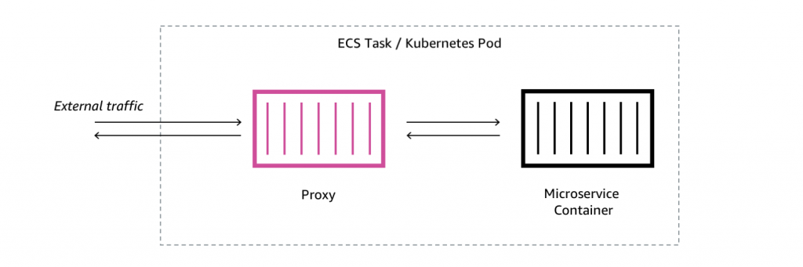
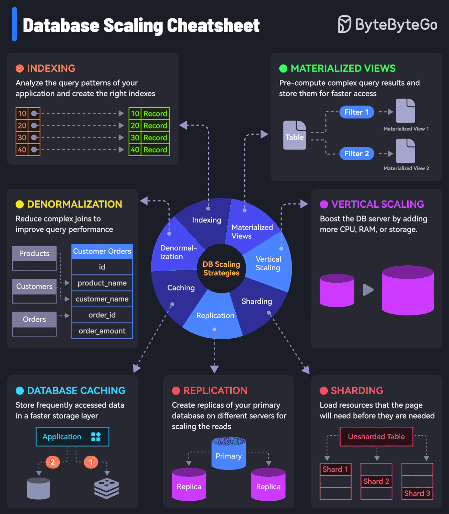
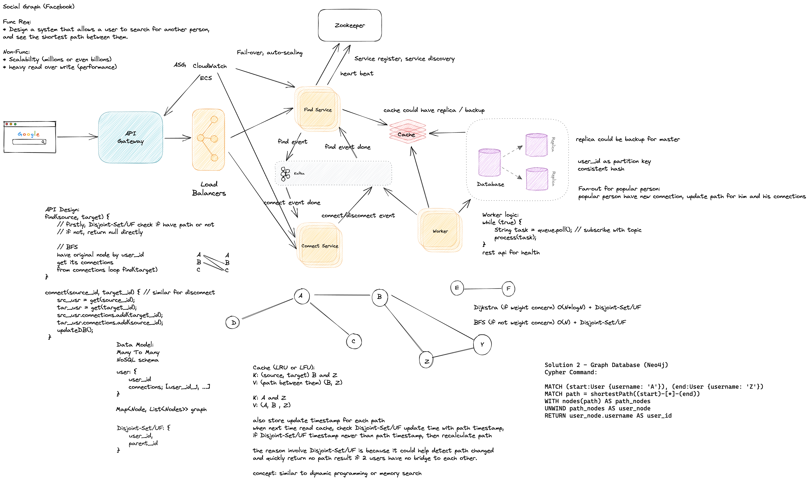
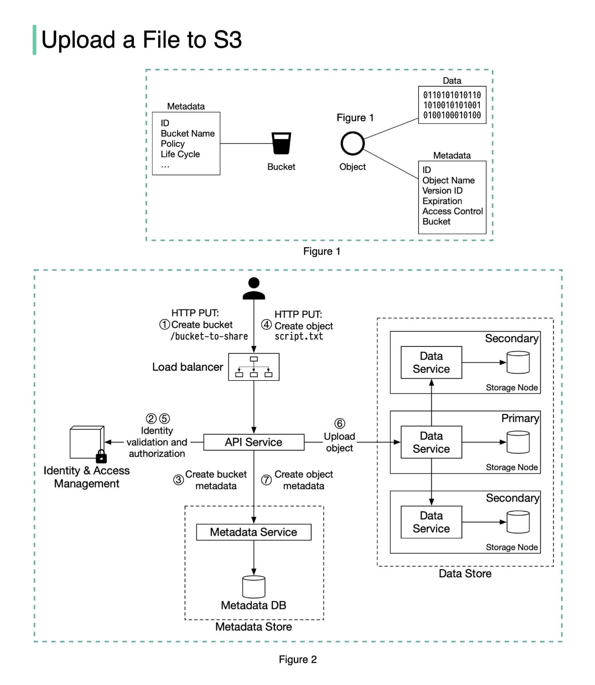
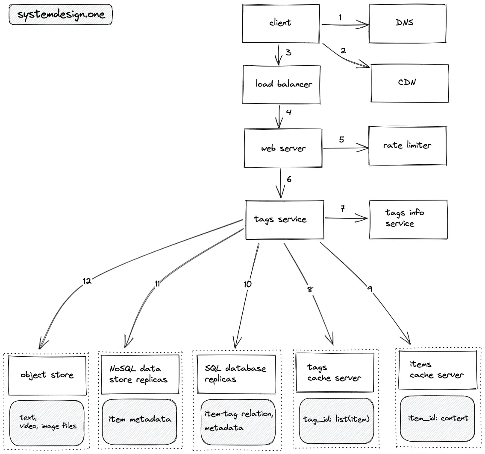
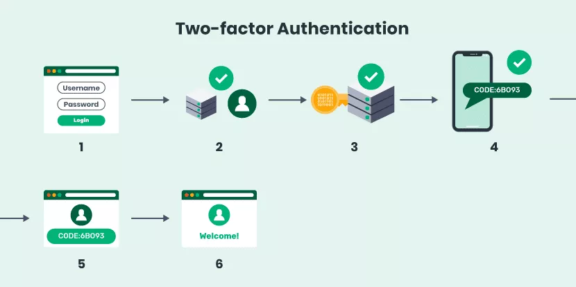
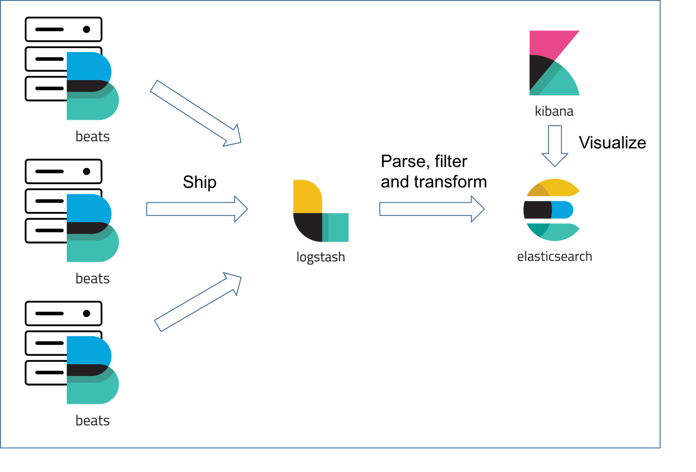
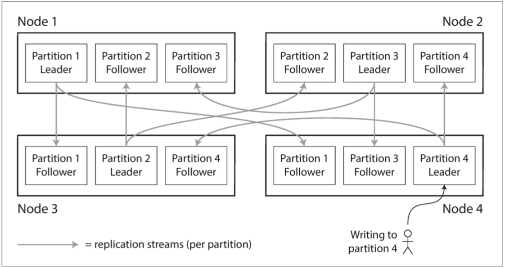

# 系统设计学习资源
系统设计重要性：在 Senior 或 Team Leader 或更高级别的岗位招聘面试中，系统设计常常拥有一票否决权。  
[前置阅读：架构、复杂度与三原则](../../Behavior%20Question%20and%20Best%20Practice/架构、复杂度与三原则.md)  
而且[系统设计与现实生活有许多共通的哲学与智慧](https://www.youtube.com/watch?v=th_73AVA4dY)，例如二八法则、边际效益递减、系统冗余、机会成本（取舍策略）、墨菲定律、正负反馈（马太效应）、连锁反应（耦合解耦）、过滤分工分级（类似[分级诊疗](https://zh.wikipedia.org/wiki/%E5%88%9D%E7%B4%9A%E7%85%A7%E8%AD%B7)、梯次纵深防御）、长尾效应、飞轮理论等等。  
有专门的学科[系统科学](https://en.wikipedia.org/wiki/Systems_science)，系统设计就是其内容之一，软件的系统设计可以说是其子集。  
另外，虽然身为工程师，但是系统设计时也需要具备产品经理的思维，比如要注意应对用户的不可预测的非预期的操作（即通常的错误使用方式，比如秒杀活动时疯狂重复点击抢单）。  

[其他相关概念](https://www.amazonaws.cn/en/knowledge/)  
  
## 针对面试
* 白板工具：比如 https://excalidraw.com/
* [Grokking-System-Design](https://github.com/lei-hsia/grokking-system-design)
* [Systems Design Youtube Playlist](https://www.youtube.com/watch?v=ZgdS0EUmn70&list=PL73KFetZlkJSZ9vTDSJ1swZhe6CIYkqTL)
* [systemdesign.one](https://systemdesign.one/system-design-interview-cheatsheet/)
* [系统设计题怎么考怎么答](https://www.youtube.com/watch?v=28n0DVP3U14)
* [系統设计面试 6 个技巧](https://www.youtube.com/watch?v=zomYKjlvJGU)  
  
### **面试步骤**
[真实面试过程模拟 (System Design Mock: with ex-Google EM)](https://www.youtube.com/watch?v=_K-eupuDVEc)
* 需求（功能与非功能，写非功能需求时最好把具体原因写上比如流媒体服务性能需求主要体现在下载资源流畅）与场景确认（所有细节，Back-of-the-envelope estimation 比如 QPS、带宽、存储）、分析 -（OOD 也一样）
  * 非常重要，因为准确理解后可以简化、引导后续所有步骤：按顺序构建设计，逐一满足功能要求。这将帮助保持专注，确保不会在设计过程中迷失方向。一旦满足了功能要求，就可以依靠非功能性要求来指导逐步增加设计的深度和复杂性
  * 另外因为面试时间短，不可能设计完整系统，因此只关注核心需求（要和面试官确认）
* 初步架构图（注意可以在一开始列出主要服务如 booking / ordering、payment、feed / stream、search、upload / download、cronjob、auth / limit、notification 等等并用不同的组件画框把它们区分开来）至少画 5-6 个系统的核心组件 -（对应于 OOD 的流程图）
  * 除了架构图外，还可以视情况需要使用其他绘图方式辅助表达，包括大部分 UML - 具体参考 [OOD 设计绘图](../object%20oriented%20design/README.md#前置知识点：一些基本设计分工)
* 数据建模、数据库选择（SQL 还是 NoSQL 及其原因）与 schema 设计（所有的 Table 然后细讲主要的 Table）-（对应于 OOD 里选择什么数据结构以及类设计进行存储）
* 系统接口或函数方法，API 设计或某段主要服务、功能的逻辑流，可用伪代码 -（对应 OOD 里的外部可调用 public 函数）
* Deep dive 2、3 个组件；扩展与可能的瓶颈、风险以及它们的解决方案（安全、可用性、可扩展性、高并发、性能等等）

系统设计面试主要考察以下几个方面：  
* 可行解 Work Solution、特定问题 Special Case、分析能力 Analysis、权衡 Tradeoff、知识储备 Knowledge Base  
  
以上参考[来源](https://juejin.cn/post/6863387461947506702)  

**注意：有的系统设计可能一开始给了个类似算法或设计的问题、或非常规的用例，其实可以先从单机简单开始进行类似 OOD 设计并使用数据结构、算法解决简单场景先，然后可以扩展场景比如更大的数据量更多的客户交互等等，然后把已设计好的 OOD 转化成系统设计（比如 Queue 换成消息队列、HashMap 换成内存缓存服务器如 Redis 或采用哈希索引引擎的关系/非关系型持久化数据库），[例题](../../Other%20Practices/game%20of%20life/)。因此某种意义上其实系统设计（HLD）就是算法、设计题（LLD）的进阶扩展而已（比如自动扩展/负载均衡/高并发对应多线程/锁操作、数据库/索引/缓存对应可二分搜索的有序顺序表或红黑树且 NoSQL 的 value 是泛型而关系型数据库就是都写明数据类型的 KV 键值对、消息队列对应链表、分布式流式计算框架对应编程语言 Stream API、表设计对应结构体/类设计、独立通用的模块/函数/方法对应独立的服务/组件、特定的算法（如 Geohash / MapReduce 等等）/数据结构（如内存四叉树、字典树等等）、文件/网络/IO 操作、以及设计模式/异步等等概念也都是通用的）。**  
[思考：什么时候选用内存系统还是外存系统？](../../Computer%20System%20Layer/内存与外存.md)  
  
#### 4S 分析法
* Scenario：场景 - 需要设计哪些（核心）功能（询问面试官、也可以自己想），需要承受多大的访问量？
  * Read Heavy? - 考虑使用缓存
  * Write Heavy? - 考虑使用消息队列
* Service：服务 - 逻辑处理的整合，对于同一类问题的逻辑处理可以归并到一个服务中。这一步实际上就是将整个系统细分为若干个小的服务。
* Storage：存储 - 最重要的部分。根据每个服务的数据特性选择合适的存储结构，然后细化数据表结构。系统设计中可以选择的存储结构一般有三大类（数据库系统，文件系统，缓存系统）。其中数据库系统又分为关系型数据库（[SQL Database](./../../HackerRank%20Practises/sql/README.md)）和非关系型数据库（[NoSQL Database](./NoSQL.md)）。
  * 数据库表设计部分可以参考、基于 [OOD、数据模型的设计、知识](https://youtu.be/8TE2DvpKxvA?t=151)，即如果数据模型本身是可高度结构化的，就可以使用 SQL，如果数据模型根据情况可能不统一，则可以使用 NoSQL。
* Scale：扩展 - 主要分两部分，一个是优化，包括解决设计缺陷，更多功能设计以及一些特殊情况如何处理；另一个是维护，包括系统的鲁棒性和扩展性，比如有一台服务器/数据库挂了怎么办？如果有流量暴增，如何扩展？
  * [Scale a Website Step by Step](./scale-a-website-step-by-step.jpeg)
  
最后，系统设计面试中需要注意的点：  
* Ask before design. 问清楚再动手设计，不要一上来就冲着一个巨牛的方案去设计 - 比如可能只是一个每天百位数以内请求、无并发可能的场景。
* No more no less. 不要总想着设计最牛的系统，要设计够用的系统。
* Work solution first. 先设计一个基本能工作的系统，然后再逐步优化。
* Analysis is important than solution. 系统设计没有标准答案，记住答案是没用的，通过分析过程展示知识储备，权衡各种设计方式的利弊。
* 另外不要总是只局限于如何在服务端工作/优化，有时还可以根据具体情况把相关工作/优化搬到客户端去做，比如缓存、重试策略、限流、reCaptcha 等等，可能会比服务端更高效、适用，又比如如果一个服务端 API 实现多个功能如果太过困难复杂 -- 比如 SQL 要做多个 JOIN 甚至跨库操作等等，可以根据情况把单个 API 拆分成多个 API（或者有时是相反的如 SQL 处理更简便比如 GROUP_CONCAT）然后让客户端负责分别调用它们、聚合返回的数据以降低复杂性、提高健壮性。永远记着两个方向上都考虑到，而且这有时还会影响整个系统架构的设计变动。
  
## 系统学习
* [Grok System Design Tutorial](https://github.com/yihaoye/data-structure-and-algorithm-study-notes/blob/master/Leetcode%20Practices/system%20design/grok_system_design_interview.pdf)
* [System Design Fundamentals](./System%20Design%20Fundamentals.md)
* [ByteByteGo Articles](https://blog.bytebytego.com/archive?sort=new)
* [System-Design-Primer](https://github.com/donnemartin/system-design-primer)
* [Scalability Architecture](https://github.com/binhnguyennus/awesome-scalability#architecture)
* [System Design Interview](https://www.youtube.com/c/SystemDesignInterview)
  
## 系统主要大类（其他系统皆可从中找到类似）
<details>
<summary>System Category</summary>

* 
* 
* [更多应用分类](https://interview-science.org/%E7%B3%BB%E7%BB%9F%E8%AE%BE%E8%AE%A1/%E5%BA%94%E7%94%A8%E5%88%86%E7%B1%BB)

</details>
<br />
  
## **系统设计模式**
系统设计也有设计模式（类似 OOD 的设计模式），就像算法需要掌握数据结构，系统设计也需要掌握系统设计模式，因为这些都是最佳实践、通常比自己创造想象的要来得稳健。  
<details>
<summary>主要的系统设计模式：https://docs.microsoft.com/zh-cn/azure/architecture/patterns/</summary>

  

* [代表/大使模式](https://docs.microsoft.com/zh-cn/azure/architecture/patterns/ambassador) - 代表模式是一种将外部系统或组件与微服务之间的交互抽象成一个代表（Representative）的模式。这个代表可以是一个单独的微服务，负责与外部系统通信、处理复杂的逻辑或封装对外部系统的访问。代表模式可以帮助减少微服务之间的直接依赖，从而提高系统的可维护性和扩展性。
* [边车/挎斗模式](https://learn.microsoft.com/zh-cn/azure/architecture/patterns/sidecar) - 边车模式是一种将某些辅助功能或非核心功能从主微服务中分离出来，放置到一个独立的边车（Sidecar）中运行的模式。这个边车与主微服务一起部署，但是可以独立地进行扩展、升级或替换，而且语言无关，边车服务可以用任何语言编写。边车模式常用于处理与主微服务业务不直接相关的功能，例如通用的基建功能：日志收集、监控追踪、安全、服务发现、网络连接、负载均衡、认证授权、流量控制等。边车模式的一个例子是 [Service Mesh](https://zhuanlan.zhihu.com/p/61901608)。
* [防损层/反腐层模式](https://docs.microsoft.com/zh-cn/azure/architecture/patterns/anti-corruption-layer) - 在现代应用程序与旧系统之间实施外观或适配器层。
  * 在不共享相同语义的不同子系统之间实施外观或适配器层。此层转换一个子系统向另一个子系统发出的请求。
  * 大多数应用程序依赖于其他系统的某些数据或功能。例如，旧版应用程序迁移到新式系统时，可能仍需要现有的旧的资源。新功能必须能够调用旧系统。逐步迁移尤其如此，随着时间推移，较大型应用程序的不同功能迁移到新式系统中。
* [异步 Request-Reply 模式](https://docs.microsoft.com/zh-cn/azure/architecture/patterns/async-request-reply) - 在后端处理需要是异步处理但前端仍需要明确响应的情况下，将后端处理与前端主机分离。
  * 解决方法类似使用 HTTP 轮询。
* [用于前端的后端模式](https://docs.microsoft.com/zh-cn/azure/architecture/patterns/backends-for-frontends) - 创建单独的后端服务，供特定的前端应用程序或接口使用。
* [隔层模式](https://docs.microsoft.com/zh-cn/azure/architecture/patterns/bulkhead) - 将应用程序的元素隔离到池中，这样，如果一个元素发生故障，其他元素可继续工作。
  * 一个使用者可以使用每个请求的资源同时向多个服务发送请求。当使用者向配置不当或无响应的服务发送请求时，可能无法及时释放客户端请求所用的资源。随着不断地向服务发送请求，这些资源可能会耗尽。例如，客户端的连接池可能会耗尽。此时，使用者向其他服务发出的请求会受到影响。最终，使用者不再能够向其他服务（而不仅仅是原始的无响应服务）发送请求。
* [缓存端模式](https://docs.microsoft.com/zh-cn/azure/architecture/patterns/cache-aside) - 将数据按需从数据存储加载到缓存（如 Redis）中。
  * [Fan-out 模式](https://en.wikipedia.org/wiki/Fan-out_(software)) - 是其衍生模式，具体可看下面的设计 Twitter。
* [协调/编舞模式](https://docs.microsoft.com/zh-cn/azure/architecture/patterns/choreography) - 让每项服务都参与决定业务运营的处理时间和处理方式，而不是依赖于一个中心型业务流程协调程序。
  * 实现协调/编舞的一种解决方案是使用异步消息传送模式（消息队列）协调业务运营。客户端请求将消息发布到消息队列，消息到达时，它们会推送到对该消息感兴趣的订阅者或服务，每个订阅的服务按消息指示执行其操作，并响应操作成功或失败的消息队列，如果成功，服务可以将消息推送回同一队列或其他消息队列，以便另一个服务根据需要继续工作流，如果操作失败，消息总线可以重试该操作。由于没有点到点通信，因此此模式有助于减少服务之间的耦合。
  * 如果希望经常更新、删除或添加新服务，请使用编舞模式。可以修改整个应用，工作量较小，对现有服务造成最少的中断。如果在中央业务流程协调程序中遇到性能瓶颈，请考虑此模式。此模式是无服务器体系结构的自然模型，其中所有服务都可以短生存期或事件驱动。服务可能会因为事件而启动，执行其任务，并在任务完成后被删除。
* [断路器模式](https://docs.microsoft.com/zh-cn/azure/architecture/patterns/circuit-breaker) - 连接到远程服务或资源时处理故障，此类故障所需修复时间不定，这可以提高应用程序的稳定性和复原能力。但在处理对应用程序中的本地私有资源的访问，例如内存中数据结构，不推荐使用断路器模式，因为在此环境中使用断路器会增加系统开销。
  * 如上图所示它的机制是一个有限状态机，状态包括：`关闭`、`打开`、`半开`。
    * 关闭：正常操作，统计失败次数的计数，如果在给定时间内失败次数超过阈值，则改成打开状态。 
    * 打开：来自应用程序的请求立即失败，并向应用程序返回异常。在打开状态中，断路器可定期执行对远程服务或资源的 ping 操作来决定其是否变得再次可用，或使用计时器来判断何时应切换至半开状态。
    * 半开：允许数量有限的调用操作。如果成功，则假定先前导致失败的问题已被修复，并切换到关闭状态。 如果有任何请求失败，否则恢复到打开状态。
  * 断路器模式的目的与重试模式不同。重试模式在预期操作将成功的情况下让应用程序重试操作。断路器模式则防止应用程序执行很可能失败的操作。应用程序可以使用重试模式通过断路器调用操作，来组合这两种模式。重试逻辑应该在断路器指示故障为非临时性的情况下放弃重试尝试，针对可能失败的操作，应监视最近发生的失败次数，并使用此信息来决定是允许操作继续进行，还是立即返回异常。
  * 如果服务限制客户端，则返回 HTTP 429（请求过多）；如果服务当前不可用，则返回 HTTP 503（服务不可用）。响应可包括附加信息，如延迟的预期持续时间。
* [Reference-Based 消息传送模式 / 声明检查模式](https://docs.microsoft.com/zh-cn/azure/architecture/patterns/claim-check) - 将大型消息拆分成声明检查和有效负载，将声明检查发送到消息传送平台，并将有效负载存储到外部服务（Blob 存储）。此模式允许处理大型消息，同时保护消息总线和客户端不被压倒或减慢。此模式还有助于降低成本，因为存储通常比消息平台使用的资源单位便宜。
  * 某些时候，基于消息的体系结构必须能够发送、接收和操作大型消息。此类消息可能包含任何内容，包括图像 (例如，MRI 扫描) 、声音文件 (例如呼叫中心呼叫) 、文本文档或任意大小的任何类型的二进制数据。不建议直接将此类大型消息发送到消息总线，因为它们需要消耗更多的资源和带宽。
  * 解决方案：将整个消息有效负载存储在外部服务（例如数据库）中。获取对存储有效负载的引用，并仅发送对消息总线的引用：引用的行为类似于用于检索一件行李的声明检查，因此得名。对处理特定消息感兴趣的客户端可以使用获取的引用来检索有效负载。一些云平台可以使用 Blob 存储和事件网格自动声明检查生成（发送方将消息有效负载拖放到指定的云 Blob 存储容器中，云事件网格自动生成标记/引用，并将其发送到受支持的消息总线，例如云存储队列，接收方可以轮询队列、获取消息，然后使用存储的引用数据直接从 Blob 存储下载有效负载）。
  * 如果只有有权查看有效负载的服务才能访问有效负载，也可以使用该模式。通过将有效负载卸载到外部资源，可以制定更严格的身份验证和授权规则，以确保在有效负载中存储敏感数据时强制实施安全性。
* [事件溯源模式](https://docs.microsoft.com/zh-cn/azure/architecture/patterns/event-sourcing) - 使用只追加存储来记录对数据采取的完整系列操作，而不是仅存储域中数据的当前状态。该存储可作为记录系统，可用于具体化域对象。
  * 
  * 大多数应用程序会使用数据，而典型的方法（比如 CRUD 模型）是用户使用数据时通过更新数据使应用程序保持数据的当前状态。但是这往往有一些限制：
    * CRUD 系统直接对数据存储执行更新操作，其所需的处理工作开销会降低性能和响应能力，并会限制可扩展性。
    * 在包含多个并发用户的协作域中，由于会对数据单个项进行更新操作，因此出现数据更新冲突的可能性更大。
    * 除非存在记录单独日志中每个操作详细信息的其他审核机制，否则历史记录会丢失。
  * 有点像日志系统，常用于需要记录每一次数据的改变，数据溯源的系统。需要关注每次操作的完整数据更新流程，例如 Shopping、File Sync（除了记录当前文件信息，还需要记录每次同步的信息）、Trading（除了记录当前持仓信息，还需要记录每次交易的信息）等系统。其他典型用途还包括在应用程序中的操作更改实体时保持实体的具体化视图（通过执行响应事件的数据管理任务和具体化存储事件的视图，事件溯源通常与 CQRS 模式结合）以及用于与外部系统集成。
  * 问题和注意事项：事件存储是信息的永久源，因此请勿更新事件数据，更新实体以撤销更改的唯一方式是将补偿事件添加到事件存储，比如需要使用补偿事件来取消更改。只有通过重播事件创建具体化视图或生成数据投影时，系统才可实现最终一致性，应用程序将事件添加到事件存储作为处理请求的结果、发布事件和事件使用者处理事件之间存在一定程度的延迟，在此期间，描述实体的进一步更改的新事件可能已到达事件存储。事件溯源不需要直接更新数据存储中的对象，因而有助于防止并发更新造成冲突，但是，域模型必须仍然设计为避免可能导致不一致状态的请求：
    * 多线程应用程序和应用程序的多个实例可能将事件存储在事件存储中。事件存储中的事件一致性至关重要，影响特定实体的事件的顺序（实体更改发生的顺序会影响当前状态）同样至关重要。将时间戳添加到每个事件有助于避免出现问题。另一常见做法是使用增量标识符注释请求引起的每个事件。如果两个操作尝试同时为同一实体添加事件，则事件存储可拒绝与现有实体标识符和事件标识符相匹配的事件。
  * 读取事件以获取信息并没有标准方法或现有机制，例如 SQL 查询。可提取的唯一数据是将事件标识符用作条件的事件流。事件 ID 通常会映射到各个实体。仅可根据实体原始状态通过重播与其关联的所有事件来确定实体的当前状态。
  * 事件发布可能至少为一次，因此事件使用者必须是幂等的。如果事件处理次数大于 1，则使用者不得重新应用该事件中描述的更新。
* [补偿事务模式](https://learn.microsoft.com/zh-cn/azure/architecture/patterns/compensating-transaction) - 分布式系统中最终一致性模型中的一个难题是如何处理失败步骤。失败后，可能需要撤消该操作中先前步骤已完成的所有工作。然而，不能总是回滚数据，因为应用程序的其他并发实例可能已更改了数据。即使在并发实例未更改数据的情况下，撤消步骤也可能比还原原始状态更为复杂。可能需要应用多种业务特定规则。
  * 解决方案是实现补偿事务。补偿事务中的步骤可撤销原始操作中步骤的效果。一种直观的方法是将当前状态替换为系统在该操作开始时所处的状态。 但补偿事务不能总是采用这种方法，因为该方法可能会覆盖应用程序的其他并发实例所做的更改。相反，补偿事务必须是一个考虑并发实例执行的所有工作的智能过程。此过程通常特定于应用程序，由原始操作执行的工作的性质驱动。常见方法是使用工作流来实现需要补偿的最终一致操作。原始操作进行期间，系统会记录每个步骤的相关信息，包括如何撤销相应步骤执行的工作。如果操作在任何时刻失败，则工作流会回退已完成的步骤。在每个步骤中，工作流会撤销该步骤所执行的工作。
  * 两个要点是：一，补偿事务可能并不一定要按照与原始操作完全相反的顺序撤消工作。二，可能会并行执行某些撤销步骤。
  * 补偿事务本身是一个最终一致性操作，因此也可能会失败。系统应能够在失败时恢复补偿事务，然后继续。该事务可能需要重复执行失败的步骤，因此补偿事务中的步骤应定义为幂等命令。
  * 在某些情况下，手动干预可能是从失败的步骤中恢复的唯一方法。这类情况下，系统应会发出警报，并会提供尽可能多的有关失败原因的信息。
  * 仅对失败时必须撤销的操作使用此模式。如果可能，请设计相关解决方案来避免需要补偿事务所带来的麻烦。
* [网关聚合模式](https://docs.microsoft.com/zh-cn/azure/architecture/patterns/gateway-aggregation) - 使用网关可将多个单独请求聚合成一个请求。当客户端必须向不同的后端系统发出多个调用来执行某项操作时，此模式非常有用。实际应用例子：网关聚合 NGINX 服务等等。
  * 当客户端可能需要向不同的后端服务发出多个调用时，客户端与后端之间的这种频繁通信可能会对应用程序的性能和规模产生不利影响（此问题在微服务体系结构中更常见，因为围绕许多小型服务构建的应用程序原生就包含更多的跨服务调用）。尽管可以并行执行每个请求，但应用程序必须发送、等待并处理每个请求的数据，而所有这些操作都要通过单独的连接完成，因此增大了故障可能性。
  * 解决方案 - 使用网关减少客户端与服务之间的通信频率。网关（客户端与后端/服务端之间）会接收客户端请求，将请求分派到不同的后端系统，然后聚合结果并将其返回给请求客户端。此模式可以减少应用程序向后端服务发出的请求数，并通过高延迟网络改进应用程序的性能。过程示例：应用程序向网关发送一个请求（该请求包含其他一些请求）-> 网关分解其他这些请求，并通过将每个请求发送到相关的服务来处理每个请求 -> 每个服务向网关返回响应 -> 网关组合来自每个服务的响应，并向应用程序发送响应 -- 整个过程应用程序发出单个请求，并仅接收来自网关的单个响应。
* [索引表模式](https://learn.microsoft.com/zh-cn/azure/architecture/patterns/index-table) - 基于数据存储中经常由查询引用的字段创建（辅助）索引。此模式可让应用程序更快地找到要从数据存储中检索的数据，从而提高了查询性能。尽管辅助索引在关系数据库系统中很常见，但云应用程序使用的部分 NoSQL 数据存储并不提供等效的功能。
  * 解决方案：如果数据存储不支持辅助索引，开发者可以通过创建自己的索引表来手动模拟辅助索引。索引表按指定的键组织数据。根据所需的辅助索引数目以及应用程序执行的查询性质，通常可以使用三种策略来构建索引表。
    * 第一种策略是复制每个索引表中的数据，但按不同的键（完全非规范化）组织这些数据。如果相对于使用每个键查询数据的次数而言数据较为静态，则此策略适用。如果数据较为动态，则维护每个索引表所产生的处理开销会变得过大，因此，此方法并不有效。此外，如果数据量极大，存储重复数据所需的空间量也很大。
    * 第二种策略是创建按不同键组织的规范化索引表，并使用主键来引用原始数据，而不是复制数据，原始数据称为事实数据表。此方法可节省空间，并减少维护重复数据所产生的开销。其缺点在于，应用程序必须使用辅助键执行两项查找操作才能找到数据。应用程序必须在索引表中查找数据的主键，然后使用主键来查找事实数据表中的数据。
    * 第三种策略是创建按不同键组织的、可复制经常检索的字段的部分规范化索引表。 引用事实数据表即可访问不经常访问的字段。如果使用此策略，可以在前两种方法之间取得平衡。可以使用单个查找操作快速检索用于常见查询的数据，同时，空间和维护开销不如复制整个数据集那么大。
  * 问题与注意事项：
    * 维护辅助索引所产生的开销可能很大。必须分析并了解应用程序使用的查询。仅当应用程序定期使用索引表时，才创建索引表。
    * 复制索引表中的数据可能会明显增大存储成本方面的开销，以及维护多个数据副本所需的工作量。
    * 将索引表实现为引用原始数据的规范化结构需要应用程序执行两项查找操作才能找到数据。第一项操作搜索索引表以检索主键，第二项操作使用主键提取数据。
    * 如果系统基于极大型数据集整合了许多索引表，则可能很难维持索引表与原始数据之间的一致性。也许可以围绕最终一致性模型设计应用程序。例如，若要插入、更新或删除数据，应用程序可以向队列发布一条消息，让单独的任务执行该操作，并维护以异步方式引用此数据的索引表。
    * 索引表本身可能已分区或分片。
  * 反向索引模式 - 是其衍生模式，用于搜索系统。
* [CQRS 模式](https://learn.microsoft.com/zh-cn/azure/architecture/patterns/cqrs) -- CQRS 是“命令和查询责任分离”的英文缩写，它是一种将数据存储的读取操作和更新操作分离的模式。在应用程序中实现 CQRS 可以最大限度地提高其性能、可缩放性和安全性。通过迁移到 CQRS 而创建的灵活性使系统能够随着时间的推移而更好地发展，并防止更新命令在域级别导致合并冲突。
  * 背景：在传统的体系结构中，使用同一数据模型查询和更新数据库。这十分简单，非常适用于基本的 CRUD 操作。但是，在更复杂的应用程序中，此方法会变得难以操作。例如，在读取方面，应用程序可能执行大量不同的查询，返回具有不同形状的数据传输对象 (DTO)。对象映射可能会变得复杂。在写入方面，模型可能实施复杂验证和业务逻辑。结果，模型执行太多操作，过度复杂。读取和写入工作负载通常是非对称的，两者的性能和缩放要求有很大的差异。
  * 解决方案：CQRS 将读取和写入分离到不同的模型，使用命令来更新数据，使用查询来读取数据。
    * 命令应基于任务，而不是以数据为中心。（如 “预订酒店客房”，而不是 “将 ReservationStatus 设置为 Reserved”）。
    * 可将命令排入队列，以进行异步处理而不是同步处理。
    * 查询从不修改数据库。查询返回的 DTO 不封装任何域知识。
    * 例子 1  参考自[链接](https://stackoverflow.com/questions/38711908/how-many-database-in-a-microservices-event-driven-architecture)
    * 例子 2  参考自[链接](https://www.infoq.com/articles/event-driven-finding-seams/)
    * 例子 3  参考自 ByteByteGo
  * 方案举例：
    * 为更好地实现隔离，可将读取数据与写入数据通过物理方式分离。在此情况下，读取数据库可使用自己的已针对查询进行优化的数据架构。例如，它可以存储数据的具体化视图，从而避免复杂联接或复杂 ORM 映射。它甚至可能使用不同类型的数据存储。例如，写入数据库可能是关系数据库，而读取数据库是文档数据库。
    * 读取存储可以是写入存储的只读副本，或者读取和写入存储可以具有完全不同的结构。 使用多个只读副本可以提高查询性能，尤其是在只读副本靠近应用程序实例的分布式方案中。
    * 读取和写入存储的分离还允许彼此适当地缩放以匹配负载。 例如，读取存储通常会遇到高于写入存储的负载。
  * 其他优势：
    * 独立缩放 - CQRS 允许读取和写入工作负载独立缩放，这可能会减少锁争用。
    * 优化的数据架构 - 读取端可使用针对查询优化的架构，写入端可使用针对更新优化的架构。
    * 安全性 - 更轻松地确保仅正确的域实体对数据执行写入操作。
    * 关注点分离 - 分离读取和写入端可使模型更易维护且更灵活。大多数复杂的业务逻辑被分到写模型。读模型会变得相对简单。
    * 查询更简单 - 通过将具体化视图存储在读取数据库中，应用程序可在查询时避免复杂联接。
  * 注意事项：
    * CQRS 会使得应用程序设计复杂性提高（CQRS 模式通常与事件溯源模式一起使用）。也因此如果域或业务规则非常简单，使用简单的 CRUD 模式就够用的情况下不建议使用 CQRS 模式。
    * 如果使用独立的读取和写入数据库，则它们必须保持同步。通常，每次更新数据库时写入模型会发布一个事件，从而可实现同步，参阅事件驱动的体系结构样式。由于消息代理和数据库通常无法登记到单个分布式事务中，因此在更新数据库和发布事件时，在保证一致性方面可能存在挑战。
* [重试模式](https://learn.microsoft.com/zh-cn/azure/architecture/patterns/retry) - 与在云中运行的元素进行通信的应用程序必须能够敏感地察觉到此环境中可能会出现的暂时性错误。这类故障包括组件和服务瞬间断开网络连接、服务暂时不可用，或者当服务繁忙时出现超时。这些错误通常可以自己修复，如果在延迟合适的时间后重新执行触发了错误的操作，该操作可能会成功。[重试模式 Java 实现](../../Other%20Practices/backoff%20retry/Solution.java)
  * 解决方案：如果应用程序在尝试将请求发送到远程服务时检测到故障，则它可以使用以下策略来处理故障：
    * 取消 - 如果错误表明故障不是暂时性的或者在重新执行的情况下不可能成功，则应用程序应当取消操作并报告异常。例如，对于因为提供了无效的凭据而导致的身份验证失败，无论尝试多少次，身份验证都不可能成功。
    * 重试 - 如果所报告的具体错误不常见或极少见，则它可能是由不常见的情况（例如网络包在传输过程中损坏）导致的。在这种情况下，应用程序可以立即再次重试失败的请求，因为不大可能会重复出现同一故障并且请求可能会成功。
    * 在延迟一段时间后重试 - 如果错误是由更普遍的连接或繁忙故障之一引起的，则网络或服务可能需要很短的一段时间来等待连接问题得以修复或积压的工作得以清除。应用程序应当等待合适的时间，然后重试请求。如果需要，可以在增大重试尝试之间的延迟时间的情况下不断重复此过程，直到已尝试的请求数目达到某个最大数目。可以采用递增方式或指数方式增大延迟时间，具体取决于故障的类型和它在此时间段内被更正的可能性。
  * 应用程序应当将访问远程服务的所有尝试包装在代码中并在代码中实现与上面列出的策略之一匹配的重试策略。发送到不同服务的请求遵守不同的策略。某些供应商提供了实现了重试策略的库，应用程序可以在这些重试策略中指定最大重试次数、重试尝试之间的间隔时间以及其他参数。应用程序应当记录错误和失败操作的详细信息。此信息对操作员比较有用。尽管如此，为避免操作员在随后的重试尝试成功后收到大量操作警报，最好将早期失败记录为信息性条目，并仅将最后一次重试尝试失败记录为错误。
  * 何时使用此模式 - 当应用程序与远程服务进行交互或者访问远程资源时可能会遇到暂时性错误时，请使用此模式。这些错误预计只会短时存在，并且通过后续尝试重复执行之前失败的请求可能会成功。
* [附属密钥模式](https://learn.microsoft.com/zh-cn/azure/architecture/patterns/valet-key) - 客户端程序和 Web 浏览器通常需要从应用程序的存储读取和写入文件或数据流。通常，应用程序会处理数据的移动 — 通过从存储提取数据并流式传输到客户端，或通过从客户端读取上传的流并将它存储在数据存储中。但是，此方法会占用宝贵资源，如计算、内存和带宽。使用 token 进行鉴权，使用户可以直接访问资源，无需每次都经过服务器。
  * 解决方案：在存储无法管理客户端的身份验证和授权的情况下，控制对数据存储的访问。一种典型方案是限制对数据存储公用连接的访问，并向客户端提供数据存储可以验证的密钥或令牌。此密钥或令牌通常称为附属密钥。它提供对特定资源的限时访问，仅允许执行预定义操作，如读取和写入存储或队列，或是在 Web 浏览器中上传和下载。应用程序可以快速、方便地创建附属密钥并颁发给客户端设备和 Web 浏览器，使客户端可以执行所需操作，而无需应用程序直接处理数据传输。这样可从应用程序和服务器中消除处理开销以及对性能和可伸缩性的影响。客户端使用此令牌在特定时间段内访问数据存储中的特定资源，并且访问权限会受到特定限制，如图所示。在指定时间段之后，密钥会成为无效状态，不允许访问资源。
  * 附属密钥通常在获取的同时就会被使用，比如立刻在下一刻访问资源的地址的请求里附加上密钥（因此整个过程在 JS 运行时内存里完成），如果想长期使用则可以存储在内存或浏览器的 [cookie](https://stackoverflow.com/a/54258744)，如果过期了则需要获取新的密钥并更新 cookie 的相关（虽然另一个选择 - localStorage 默认也有同源策略保护，但仍要小心 XSS 或 CSRF 攻击）。
  * 附属密钥除了可以应用于常见的 blob/object 存储之外，也可以用于 [CDN](https://learn.microsoft.com/zh-cn/azure/cdn/cdn-token-auth) 对非公开 asset 的鉴权。
  * 示例：在使用 AWS S3 时，S3 会在接收到请求后自行验证请求的签名和凭证的有效性，而不需要与 IAM 进行额外的验证。这是因为 AWS S3 内部已经集成了 AWS IAM 的身份验证和授权机制。当客户端发送请求到 S3 时，请求中包括了 Access Key 和 Signature，S3 会根据请求中的签名信息来验证请求的有效性。验证的过程包括：
    1. Access Key：请求中包括了 Access Key。
    2. 签名验证：S3 使用请求中的 Access Key 来检索与之相关联的 Secret Key（由 IAM 分享的存储在 AWS 后端，通常是对称加密的密钥，因为对称解密更快）。然后，它使用 Secret Key 来重现请求中的签名（Signature）。
    3. 签名比对：S3 将使用 Secret Key 重现的签名与请求中的签名进行比对。如果两者匹配，S3 认为请求是有效的。
    4. 权限检查：一旦请求被验证为有效，S3 将进一步检查请求的权限，以确保请求的执行者具有执行请求操作的权限，这一部分是根据 S3 存储桶策略和 ACL 来检查请求的权限。
* [守护程序模式](https://learn.microsoft.com/zh-cn/azure/architecture/patterns/gatekeeper) - 应用程序通过接受和处理请求向客户端公开其功能。在云托管方案中，应用程序公开客户端连接，并通常包括代码以处理来自客户端的请求。此代码执行身份验证和验证、部分或全部请求处理，并可能代表客户端访问存储和其他服务。如果恶意用户能够危害系统并获得对应用程序托管环境的访问权限，那么它所使用的安全机制（例如凭据和存储密钥）以及它访问的服务和数据都会暴露出来。因此，恶意用户可以无限制地访问敏感信息和其他服务。
  * 解决方案：为了最大限度地减少客户端访问敏感信息和服务的风险，请将公共 endpoint 的主机或任务与处理请求和访问存储的代码分离。可通过使用某个门面或专用主机或任务完成此操作，该门面或专用主机或任务与客户端交互，然后可能通过一个分离的接口将请求提交到将要处理该请求的主机或任务。
* [物化视图](https://learn.microsoft.com/zh-cn/azure/architecture/patterns/materialized-view) - 对经常查询或者展示的数据建立 prepopulated views，提高查询效率以及应用处理的性能。
  * [许多数据库提供了物化视图的功能](./../../Computer%20System%20Layer/%E6%95%B0%E6%8D%AE%E5%BA%93/SQL/README.md#物化视图)
* [速率限制模式](https://learn.microsoft.com/zh-cn/azure/architecture/patterns/rate-limiting-pattern) - 节流模式用于减少流量以及增加带宽吞吐量，节流策略可以从每秒请求数，请求数据量，费用等维度进行配置。
  * 具体参考下面 Practice Examples 的 `设计 API Rate Limiter`
* 集合统计模式 - [Redis 实现 4 种常用统计](https://www.cnblogs.com/520lq/p/14654500.html)
  * 聚合统计 - 指统计多个集合元素的聚合结果，包括：`交集统计`统计多个集合的共有元素；`差集统计`把两个集合相比并统计其中一个集合独有的元素；`并集统计`统计多个集合的所有元素，除此之外还可以延伸出`分布统计`、`频率统计`等
  * 排序统计 - 涉及到数据的排名和顺序、序列等需求，因此集合本身应是有序集合，除此之外还可以延伸出`趋势分析`
  * 二值状态统计 - 指集合元素如 Bitmap 的取值只有 0 和 1 两种状态，通常用于表示某个事件是否发生或某个条件是否成立
  * 基数统计 - 统计一个集合中不重复的元素个数
* [更多：计算资源合并、外部配置存储、网关路由、运行状况 endpoint 监视、领导选择、优先级队列、发布方/订阅方、基于队列的负载调控、分片、静态内容托管、Geodes、竞争性使用者等等](https://learn.microsoft.com/zh-cn/azure/architecture/patterns/)

</details>
<br />
  
## 系统通用基础设施

<details>
<summary>主要组件：https://www.cnblogs.com/ilinuxer/p/6697015.html </summary>

* 负载均衡、虚拟 IP、DNS 服务（通常情况下，大型互联网公司在不同的数据中心中存储的数据是相同的或者是部分相同的。这是为了实现高可用性、容错性和性能优化而采用的策略之一。其中全球负载均衡通常通过 DNS 解析来实现。这种方法被称为 “全局负载均衡 DNS” 或 “全球负载均衡 DNS”。DNS 还可以返回客户端虚拟 IP 以重定向请求到不同的负载均衡节点）
* API 网关（身份验证、路由、速率限制、流量控制治理调度、计费、监控、分析、协议转换、安全防护）、[Firewall 防火墙（访问控制）](./firewall.jpg)
* 自动扩展与 fail-over（ECS、K8S）
* 业务应用和后端基础框架（MVC、IOC、ORM）
* 缓存、CDN（本地缓存即内存中的缓存机制：ConcurrentHashMap etc；分布式缓存即单独的缓存服务：Redis、Memcached etc）
* 主机、计算实例（[CPU、GPU](./CPU-vs-GPU.md)）、服务器（EC2、Docker、Serverless）
* 数据库（SQL、NoSQL、分库分表、主从复制）
* 搜索引擎（全文搜索、ElasticSearch、MySQL）
* [消息队列与流处理](./消息队列与流处理.md)（RabbitMQ、Kafka）[阅读材料](http://www.52im.net/thread-1979-1-1.html)
* 对象/文件/非结构化数据存储（S3、Hadoop HDFS、Blob Storage - Binary Large Object Storage）（e.g. distributed file storage system for storing photos and videos，另外其实数据湖 i.e. Data Lake 本质上也是 blob storage 且存的是 CSV 这类半结构化文件）
* 镜像/备份/归档（如为云主机、容器或数据库及其存储卷等等的镜像/快照的服务，可以存储至文件存储如 S3 等）
* 认证中心（用户的注册、登录验证、token 鉴权；内部信息系统用户的管理、权限和登录鉴权；应用管理，应用的 secret 生成，应用信息的验证 - 如验证接口签名等）
* 加密解密（如 KMS）、压缩解压（无损，如图像多媒体文件、通信、存储备份等）
* 单点登录系统（Central Authentication Service - CAS）
* [配置中心](https://en.wikipedia.org/wiki/Configuration_management)（可分布式，Config Server、propeties、yaml）
* 管理后台/管理控制台（允许客服或工程师直接访问和管理数据库数据以支持用户，比如 Django Admin、WordPress）
* [服务调用/服务治理框架（REST API、RPC、GraphQL）](./System%20Design%20Fundamentals.md#API%20Design)，服务发现、注册、查询（如 Consul、etcd、ZooKeeper）
* 统一调度中心（定时调度 cron job，如定时抓取数据、刷新状态等）
* 统一日志服务（log4j、logback、Kibana、CloudWatch）、[分布式链路追踪](https://github.com/CoderLeixiaoshuai/java-eight-part/blob/master/docs/distributed/%E5%8E%9F%E6%9D%A510%E5%BC%A0%E5%9B%BE%E5%B0%B1%E5%8F%AF%E4%BB%A5%E6%90%9E%E6%87%82%E5%88%86%E5%B8%83%E5%BC%8F%E9%93%BE%E8%B7%AF%E8%BF%BD%E8%B8%AA%E7%B3%BB%E7%BB%9F%E5%8E%9F%E7%90%86.md#%E4%BB%80%E4%B9%88%E6%98%AF%E9%93%BE%E8%B7%AF%E8%BF%BD%E8%B8%AA)（X-Ray）与[日志管理](./日志管理.md)
* 数据基础设施（大数据：Hadoop、Spark、数据仓库；数据管道：Kafka、Kinesis；数据分析：Hadoop、Spark、Tableau、Python、SAS、Excel）
* 故障监控（系统监控、业务监控；Datadog、ELK、故障定位、警报等级、IM 或 oncall）(Telemetry)
* DX（内部服务：包括大数据、构建交付工具、通用运行时服务类库、数据持久化、安全等）
* 分布式锁、[分布式一致性](./System%20Design%20Fundamentals.md)与[选举算法/共识机制](./example%20questions/Leader%20Election.md)
* 网络（如 [VPN](./VPN.gif) 等）、拓扑（如 AWS VPC 等），点对点网络/去中心化（Peer-to-peer Networks，如 VPC Peering、指数增长的高效的针对大规模目标对象的数据拷贝传输、区块链项目如 Bitcoin、等等）  
  


</details>
<br />
  
# System Design Basics
During designing a large system, investing in scaling before it is needed is generally not a smart business proposition; however, some forethought into the design can save valuable time and resources in the future.  
Core scalable/distributed system concepts include: `Consistent Hashing`, `CAP Theorem`, `Load Balancing`, `Caching`, `Data Partitioning`, `Indexes`, `Proxies`, `Queues`, `Replication`, and choosing between `SQL vs NoSQL`.  

## Key Characteristics of Distributed Systems
其实不止大型互联网系统的设计，所以的软件（包括单体单机系统）都应该考虑以下特性
* **Scalability** - the capability of a system, process, or a network to continuously evolve/grow and manage increased demand. (相关组件与手段：负载均衡、自动扩展、分库分表、数据备份、分布式)
  * *Horizontal Scaling - Add more servers (e.g. Cassandra and MongoDB easy to scale horizontally).*
  * *Vertical Scaling - Add more resource/power (CPU, RAM, Storage etc) to same server (e.g. MySQL easy to scale vertically) (scaling involves downtime).*
* **Reliability** - the probability a system will fail in a given period. （相关组件与手段： API 网关、测试、CI/CD 与回滚、故障监控与 failover/故障转移、服务降级），故障分类 - DDIA 里故障的分类可以分为三大类：硬件故障、软件错误、人为错误 - [来源参考](https://xie.infoq.cn/article/a83e33394a05086a1514c2826)。Reliability 指标有两个：MTTF（Mean Time To Failure）平均故障前的时间，即系统平均能够正常运行多长时间才发生一次故障，系统的可靠性越高，MTTF 越长；MTTR（Mean Time To Repair）平均修复时间，即从故障出现到故障修复的这段时间，这段时间越短越好。
  * 硬件故障
    * 过去一般通过增加冗余度来提高单台机器的可靠性（比如磁盘可以做 RAID，服务器可以双路电源、备用发电机等）。现代系统一般都通过云平台使用大量的机器，硬件故障也变得非常常见。
    * 所以优选考虑已经不在是硬件冗余，因为硬件故障是随机的、相互独立的，大量硬件不可能同时发生失效。所以现在一般是通过系统设计（Design for failure）来降低单台机器失效对系统的影响。
  * 软件故障
    * 性能问题。资源不够，比如 CPU 时间、内存、硬盘空间或者网络带宽。
    * 错误输入。对输入没有做安全校验和异常捕获导致系统崩溃。比如输入的格式、参数类型错误。
    * 依赖服务慢，无响应。比如查询数据超时。
    * 级联故障。一个组件小问题引发其它组件级联故障。
  * 人为错误
    * 系统总是在更新和修改，运维过程中就配置错误是导致服务中断的首要因数。
  * Fault Tolerant 
* **Availability** - the time a system remains operational to perform its required function in a specific period. (相关组件与手段：负载均衡、故障监控与 failover/故障转移、数据备份、无主分布式)
  * *Reliability Vs Availability - If a system is reliable, it is available. However, if it is available, it is not necessarily reliable. high reliability contributes to high availability, but it is possible to achieve a high availability even with an unreliable product by minimizing repair time and ensuring that spares are always available when they are needed.*
  * 可用性（Availability）= MTBF / (MTBF + MTTR) * 100% 
  * [异地多活](http://kaito-kidd.com/2021/10/15/what-is-the-multi-site-high-availability-design/)
* **Efficiency or Performance** - Two standard measures of efficiency are response time (or latency) and the throughput (or bandwidth). （相关组件与手段：CDN、异步处理耗时任务如消息队列、缓存、读写分离、索引、分页）. The two measures correspond to the following unit costs:
  * *Number of messages globally sent by the nodes of the system regardless of the message size.*
  * *Size of messages representing the volume of data exchanges.*
  * Database Performance 
  * 系统设计中的时间复杂度（主要为数据库、数据仓库、缓存、消息队列等持久化数据的操作）
    * SQL - 索引优化影响所有操作，以下描述约定 M 为已经被 WHERE 等查询优化了范围后符合条件的目标数据量，N 为表的数据总数，且约定下面操作皆为查询优化后的复杂度。（常见的 SQL 数据库即使千万级数据，全表扫描也仅需 10 至几十秒。理论上，使用 SSD 且前提条件没有复杂的数据存储结构 + 是顺序读取，遍历千万级数据可以在 3-5 秒内完成）
      * GROUP BY - 时间复杂度 `O(M)`，因为聚合总是要遍历所有数据行
      * COUNT、SUM、MAX 等聚合函数 - 时间复杂度 `O(M)`
      * ORDER BY - 时间复杂度 `O(M*logM)`
      * JOIN - 时间复杂度有索引 FULL JOIN `O(N1*logN1 + N2*logN2)` 无索引或笛卡尔积 CROSS JOIN `O(N1*N2)`，因为 JOIN 命令顺序在 WHERE 之前，所以不会被 WHERE 优化，但是可以被索引优化，另外索引优化过的 INNER、LEFT、RIGHT JOIN 都是 `O(N1*logN2)`。其中 INNER JOIN 执行时会自动选择选择最小的表当基础表，是 JOIN 中效率最高的，所以通常最佳实践都会建议尽量使用数据量小的表当主表（前提是索引优化）。[JOIN 优化](https://www.cnblogs.com/wql025/p/14439071.html)
        * 如果一定想通过 WHERE 优化 JOIN，也是可以的，方法是将 JOIN 的目标表修改为子查询结果（但必须过滤结果较小以避免大的内存消耗）
      * HAVING - 时间复杂度 `O(M)`
      * LIMIT - 时间复杂度 `O(K)`
      * UNION - 时间复杂度 `O(M1 + M2)`
      * LIKE
        * 前缀匹配（如 LIKE 'prefix%'）- 时间复杂度 `O(logN)`，因为数据库可以利用索引
        * 全模糊匹配或中间模糊匹配（如 LIKE '%substring%'）- 时间复杂度 `O(N)`，因为不能使用索引，通常会进行全表扫描
      * IN | NOT IN - 时间复杂度 `O(logN)` ~ `O(N)`，IN 操作通常能利用索引，尤其是当查询中的元素数较少时，如果元素过多，优化器可能会选择全表扫描。NOT IN 操作通常较难通过索引优化，特别是当查询中涉及到排除大量数据时，数据库更倾向于执行全表扫描，若数据表中存在 NULL 值，NOT IN 查询的结果可能会不准确，且性能更差。为提高性能，尽量避免使用 NOT IN，而是考虑使用 NOT EXISTS 或 LEFT JOIN 等替代方案，同时，确保对相关字段创建有效的索引，以优化查询性能
* **Serviceability or Manageability** - how easy to operate and maintain. simplicity and speed with which a system can be repaired or maintained. （相关组件与手段：日志系统、CI/CD、统一配置中心、应用框架、IaC、版本管理、标准制定如协议、解耦）
  * *If the time to fix a failed system increases, then availability will decrease.*
  * *Ease of diagnosing and understanding problems when they occur, ease of making updates or modifications, and how simple the system is to operate.*
* **Consistency** - 一致性，比如事务以及数据是否总是最新的（相关组件与手段：多数从节点写入、锁/分布式锁、CAS 及版本、WAL 预写日志、消息队列、时间戳、唯一 ID 等等）
  * Strong Consistency
  * Eventual Consistency (Tradeoff with Availability)
  * Idempotence（幂等性）- 保证幂等性是非常重要的，特别是在面临网络故障、超时、重试请求等情况下。以下是一些常见的方法来确保系统的操作是幂等的：
    * 请求标识符（Request Identifier）以及请求去重：可以每个请求都包含一个唯一的标识符，通常是一个全局唯一的请求 ID 或者事务 ID 又或者是时间戳与用户 ID 组合，服务端可以使用这个标识符来检测和过滤重复的请求。又或者是使用缓存系统缓存同一用户的 ID，设置为在一小段时间内发送的同类请求都视为重复并过滤。
    * 乐观锁、检查状态或版本号：如果系统中的操作是基于某个资源的状态或版本号的，可以在请求中包含当前资源的状态或版本号，并在服务端进行比对。如果请求的状态或版本与服务端存储的一致，就执行操作。如果不一致，拒绝请求或者执行相应的冲突解决逻辑。即类似 CAS 通过版本号或时间戳等方式来检测和防止冲突。
    * 幂等操作设计：在系统设计中，应该考虑如何使操作本身成为幂等操作。这可能包括将操作分解为多个步骤，其中每个步骤都是幂等的。如果操作的某一部分失败，系统可以在重试时继续执行。
    * 幂等 HTTP 方法：在 RESTful API 中，HTTP 方法应该被正确使用。GET 和 PUT 方法通常应该是幂等的，而 POST 方法通常不是幂等的。确保在设计 API 时遵循 HTTP 方法的幂等性规则。
    * 幂等性标志：可以在请求中包含一个幂等性标志，如果该标志为真，则服务端执行幂等或相应操作。这在某些情况下可能有用，例如处理一些负载均衡和请求路由的情况。
    * 幂等性检查点：在系统执行操作的不同阶段，可以插入幂等性检查点。这些检查点可以记录操作的执行状态，并在操作需要重试时，根据检查点来继续操作。
    * 回滚机制：在执行非幂等操作时，实现回滚机制，以便在操作失败时能够撤销之前的影响，恢复到初始状态。
* **Security** - Data/Operation security etc.
  * 权限管理
  * 数据加密解密（传输与存储）、隐私、合规性
  * 攻击防护（DDoS、伪造或注入攻击）
  * 监控与日志
    
## 服务治理与 API Gateway
API 网关是位于客户端与后端服务集之间的大门 - API 管理工具，本身包括访问控制、防火墙等功能。通常 API 网关还与其他关键组件服务（服务治理）一起集成，又或者是负载均衡器既承担了服务发现的角色，又承担了网关的角色，所以经常叫 API 网关服务器（Http 服务器，Nginx、Nginx Plus、Kong 就是此类服务端发现模式的负载均衡器）。[Spring Cloud 方案](https://github.com/yihaoye/spring-framework-example/tree/master/spring-cloud-fundamentals)、[服务发现和负载均衡](https://bbs.huaweicloud.com/blogs/193876)、[负载均衡器和 API 网关](https://z.itpub.net/article/detail/194354318C67A5BF584DBB6F9F78F945)、[API Gateway 使用场景](./api-gateway-use-cases.gif)。  
  
  
  
  

### [流量治理](https://icyfenix.cn/distribution/traffic-management/)
流量治理可以看作是基于 API 网关与负载均衡等功能之上的更高层次的管理，实际上是对流量分配、控制和优化的一个更全面和高级的策略集合，包含但不限于 API 网关和负载均衡（整合并扩展了这些组件的功能），具有更广泛的管理和优化能力：
* [Ref](https://www.cnblogs.com/jiagoubaiduren/p/15253253.html)
* [Azure Traffic Manager](https://learn.microsoft.com/zh-cn/azure/traffic-manager/traffic-manager-overview)
* [GCP Traffic Management](https://www.cloudskillsboost.google/paths/31/course_templates/35/video/432916?locale=en)
* 异地多活 - 流量治理是实现和优化异地多活的关键技术手段
  * 智能路由
  * 故障切换
  * 延迟优化
  * 流量分配

### 自动扩展与容器编排
底层实现中需要调度器（硬件机器、端口）、命令行（镜像、启动/停止容器）、状态机等。[具体参考](https://github.com/gogococo/orchestrator-in-go)  
现成方案：Kubernetes、Docker Swarm、AWS ECS 等等。  
#### 概念：[集群（Cluster）](./集群.md)
#### IaaS 如何管理硬件基础设施
包括物理服务器、网络设备、存储设备等，这些硬件资源通常分布在多个数据中心或可用区域中：
* 虚拟化技术：提供商使用虚拟化技术将物理硬件资源抽象为虚拟资源。这包括使用虚拟机监视器（VM Hypervisor）将物理服务器划分为多个虚拟机（VM）。每个 VM 都具有自己的操作系统和资源分配，但它们在物理硬件上共享资源。
* 资源池管理：IaaS 提供商创建资源池，其中包含一组虚拟资源，如 CPU、内存、存储容量等。这些资源池可用于分配给客户。
* 请求和分配：当客户发送资源请求时，IaaS 提供商会根据客户的需求动态分配资源。这通常包括指定所需的虚拟机规格（例如，CPU 核数、内存大小、存储容量）和其他配置选项。


### [服务注册与服务发现](https://docshome.gitbook.io/microservices/4-service-discovery)
  
现成方案：Etcd（共享配置、服务发现和的调度协调）、ZooKeeper（数据发布/订阅、负载均衡、命名服务、分布式协调/通知、集群管理、Master 选举、分布式锁和分布式队列等功能）。  

[心跳机制/心跳包（Heartbeat）](https://zh.wikipedia.org/wiki/%E5%BF%83%E8%B7%B3%E6%9C%BA%E5%88%B6) - 在计算机科学中指一种周期性的信号，通过硬件或软件的形式来检测行为的正常与否，或者与计算机系统是否一致。通常，机器间会每隔几秒钟发送一次心跳包。如果接收终端没有在指定时间内（通常是几个心跳包发送的时间间隔内）接收到心跳包，发送终端将会被判定发送失败。  
心跳协议通常用于与资源通信（如：浮动 IP 地址）并监控其有效性。  
心跳包会尝试去证明一台机器是否健康，心跳协议以及传输过程的可靠性是十分重要。因误报所造成的故障转移（这取决于资源），这是实践上不希望的。但另一方面又需要对实际的障碍进行迅速的反馈，所以心跳包而言可靠性十分重要。正因此，会希望心跳包运行在多条路线，从而提高可靠性。比如，一个心跳包通过以太网的 UDP/IP，另一个则用串行链路。  

### [负载均衡与路由](./Load%20Balancing.md)
因为负载均衡器是中心式的，所以它也必须是一个集群，单个实例不足以支撑高并发访问，针对负载均衡器本身的服务发现和负载均衡通常借助 DNS。  
### 配置管理
配置的本质体现在以下几个方面：
* 参数化 - 通过配置，应用程序可以将一些参数化的选项提取出来，以便在不同的情况下进行调整。这些参数可以包括数据库连接信息、日志级别、缓存策略等。
* 灵活性 - 配置使得应用程序的行为和功能可以根据具体需求进行定制和调整，而不需要修改源代码。这种灵活性使得应用程序能够更容易地适应不同的使用场景和业务需求。
* 可维护性 - 将应用程序的配置与代码分离可以提高代码的可维护性。通过配置，可以将一些常变化的参数和选项提取出来，使得代码更加清晰和易于理解。
* 环境隔离 - 使用不同的配置文件可以实现在不同的环境中运行相同的应用程序，比如开发环境、测试环境、生产环境等。这样可以降低因环境变化导致的错误和问题。
* 外部可见性 - 配置是以外部可见的形式存在的，可以由系统管理员或运维人员进行编辑和管理，而不需要涉及开发人员。这样可以降低部署和维护的成本，提高系统的可管理性。“配置”一词一般还是会指系统管理员才能进行的变更。
### 认证权限
### [服务降级、服务熔断、断路器](./服务降级与服务熔断.md)
### 监控统计日志

## [链路追踪](./README.md#设计分布式链路追踪系统)

## Cache vs Message Queue / Stream
相比之下 Cache 更像 Java 的 HashMap，Message Queue / Stream 更像 Java 的 Queue / Deque / Stream：
* Cache 通常用于索引定位更快的响应的场景，而不是用于有序事件处理（虽然如 Redis 也有相关功能但在需要更高级的消息队列功能，例如消息确认、重试、顺序性保证等时，Kafka 是更好的选择）
* Message Queue / Stream 保证先入先出、（处理）事件有序的场景应用，而不是为了快速索引定位响应（因为如 Kafka 等系统是使用硬盘日志而不是内存存储数据，因此延迟较高）。
* 处理实时数据时（持续快速更新数据的场景），消息队列比缓存更适用，因为缓存在这种情况要非常注意读写一致性问题（引入读写策略、锁之类的）可能非常复杂、麻烦。

### [Caching](./Caching.md)
因为缓存多使用 KV 内存数据库，因此缓存也有许多与数据库相似的设计与思想，比如缓存也可以分库分表、分布式等等。  
内存缓存与 NoSQL KV 数据持久化数据库的区别：内存缓存应用于更极致的高读取低延迟的场景，但通常内存缓存的单价比 NoSQL 更高、数据易失性高。  

### [Message Queue and Stream](./消息队列与流处理.md)
注意，一般的消息队列（Kafka、Redis、ActiveMQ etc）不支持索引查询，但是一些关系型数据库、时序数据库（时间序列数据库 Time Series Database，如 InfluxDB、MongoDB、Prometheus、RedisTimeSeries etc）除了能当简单的消息队列（比一般数据库吞吐性能更强，但仅限低吞吐量等有限场景。大规模、高吞吐量场景还是要用专门的消息队列系统）还可以索引查询（时间序列数据库通常会使用时间戳作为主要的索引字段，以便快速按时间范围查询数据。这使得在时间序列数据库中执行时间范围查询非常高效），而可以使用数据库来替代的重要原因也是因为新特性 [skip locked](https://www.modb.pro/db/69904) 带来的性能以及可能性。另外，[有些消息队列可以直接支持优先级排序]((./消息队列与流处理.md#优先队列))而不是仅仅 FIFO。  
[对象存储也可以实现简单的消息队列](./README.md#设计分布式云消息队列-包括-Notification-系统)，比如把 bucket 分成未处理和已处理两个路径，从未处理的 bucket 读出最前面的文件，处理它，然后把文件转移至已处理路径即可（此办法不足以应对多个消费者订阅同一个主题消息的场景，需要进一步改动）。  

## 处理编程范式
* 同步处理
  * 请求响应模式 - 延迟最小的一种范式，响应时间处于亚毫秒到毫秒之间，而且响应时间一般非常稳定。这种处理模式一般是阻塞的（同步），应用程序向处理系统发出请求，然后等待响应。在数据库领域，这种范式就是线上交易处理（OLTP）。通常的形式是 SOAP、REST API、RPC、GraphQL 等。
    * 轮询、长轮询、全双工（例如 Websocket）。
  * 管道 - 一个进程的输出紧联（实时触发）着另一个进程的输入，而且写入管道后必须先被消费掉否则后续写入会被阻塞，Unix 系统管道 bash 示例 ```./producer_app | ./consumer_app```
  * 流式处理 [Ref 1](https://github.com/yihaoye/big-data-training/blob/main/kafka/README.md#%E6%B5%81%E5%BC%8F%E5%A4%84%E7%90%86)、[Ref 2](https://keys961.github.io/2018/07/05/%E6%B5%81%E5%BC%8F%E5%A4%84%E7%90%86%E5%9F%BA%E6%9C%AC%E6%A6%82%E5%BF%B5/)、[Usage in AI System](https://www.nvidia.cn/glossary/data-science/stream-processing/) - 这种范式介于同步的请求响应和异步的批处理之间（准实时，更接近同步，类似管道）。大部分的业务不要求亚毫秒级的响应，不过也接受不了要等到第二天才知道结果。大部分业务流程都是持续进行的，只要业务报告保持更新，业务产品线能够持续响应，那么业务流程就可以进行下去，而无需等待特定的响应，也不要求在几毫秒内得到响应。一些业务流程具有持续性和非阻塞的特点。
* 异步处理
  * 回调模式 - 系统级：Webhook、API 调用等；线程/进程级：JavaScript 回调、CompletableFuture、接口回调等。通常情况下，回调是在一个不同于主线程/主服务的另一个线程/服务中执行的。回调常用于异步处理中，当某个特定事件发生时，会触发回调函数的执行。
  * 批处理 - 该范式有高延迟和高吞吐量的特点。处理系统按照设定的时间启动处理进程。处理系统按照设定时间启动一次处理，读取可用数据，输出结果，然后等待下一次处理的启动，数据库领域为 DWH / BI。
  * 发布订阅、生产消费、（消息）队列 - 比批处理更低延时、更实时的异步处理。

## [并发编程模型](../../Computer%20System%20Layer/并发编程模型.md)

## DB Scaling, Sharding or Data Partitioning
* [分片的几种方式、标准](./Sharding%20or%20Data%20Partitioning.md)
* [数据库数据建模分库分表](./数据库数据建模分库分表.md) - 不止关系数据库可以分库分表，NoSQL 也可以考虑甚至冗余分表比如 ES（参考词云系统）
* 

### [Consistent Hashing](./一致性哈希.md)

## [Indexes](./Indexes.md)

## [Proxies](./Proxies.md)

## Redundancy and Replication
* Redundancy - backup or failover to avoid single points of failure
* Replication - sharing information to ensure consistency between redundant resources (e.g. db master-slave relationship)

## [文件系统](./../../Computer%20System%20Layer/文件系统.md)

## [SQL vs NoSQL](./SQL%20vs%20NoSQL.md)

## [CAP Theorem](./CAP.md)

### [BASE 最佳实践](./CAP.md#base)

### [FLP 不可能定理](./CAP.md#flp)

## [I/O 模型与 Web 服务器工作模型](./IO模型与Web服务器工作模型.md)

## 压缩解压
压缩技术通常能够提高 IO（输入/输出）操作的性能与存储空间，尤其是在涉及到大量数据的场景下，例子如 gRPC。  
压缩和解压缩本身也会消耗一定的计算资源和性能。因此，在考虑是否使用压缩技术时，需要权衡压缩和解压缩所带来的性能开销与压缩后的效益之间的关系：  
* 数据特征：压缩技术适用于重复性较高、冗余较多的数据。如果数据具有较高的压缩率，那么使用压缩技术可能更为划算。相反，如果数据不适合进行压缩（如已经是压缩过的数据、随机数据等），那么使用压缩技术可能会带来不必要的性能开销。
* 操作频率：如果操作（比如 IO）的频率较高，而且压缩后的数据需要频繁地进行解压，则压缩技术可能会带来更大的性能开销，需要权衡开销。
* 系统资源：压缩和解压需要消耗计算资源，包括 CPU 和内存。如果系统的计算资源较为充足、成本不敏感，并且对于收益操作的性能要求较高，那么使用压缩技术可能是划算的。相反则需要谨慎使用。
* 数据传输与存储成本：如果数据需要通过网络传输，那么压缩技术可以减少传输的数据量，从而节省网络带宽和传输时间，这可能会抵消压缩解压的性能开销。

## Access Pattern
适用于硬盘与内存：
* Random I/O (slower)
* Sequential I/O (much faster)

## 事务
### [分布式事务](./分布式事务.md)

## 锁
  
### [分布式锁](./分布式锁.md)

## [网络相关](https://github.com/yihaoye/stem-notes/blob/master/e-computer-network/README.md)
  
网络适配器（Network Interface Card，NIC）通常会在硬件层级上接收数据包并将其存储在环形缓冲区（Ring Buffer）中。这个环形缓冲区是一块内存区域，用于临时存储接收到的数据包，然后将其传递给操作系统的网络栈进行进一步处理。  
以下是简化的网络数据包接收过程
1. **数据包接收**：当数据包到达计算机的网络适配器时，NIC 会检测到该数据包。这通常发生在物理层或数据链路层。
2. **存储到环形缓冲区**：NIC 会将接收到的数据包存储到环形缓冲区中。这个缓冲区可以被认为是一个循环队列，新的数据包会被添加到缓冲区的尾部。
3. **中断通知**：一旦数据包被存储到环形缓冲区，NIC 会向计算机的中央处理单元（CPU）发送一个中断通知，以指示有新的数据包可供处理。
4. **操作系统处理**：操作系统的网络栈会定期检查环形缓冲区，以查找新的数据包。一旦发现新数据包，操作系统将从缓冲区中读取它，解封装数据包并根据目标 IP 地址和端口号将其传递给正确的应用程序或服务（即 [Socket](./README.md#设计-whatsappslackim)）。

这个过程确保了网络数据包的有效接收和传递给相应的应用程序。环形缓冲区用于解决网络速度和处理速度之间的差异，因为 NIC 可以以更高的速度接收数据包，而操作系统可能无法立即处理所有接收到的数据包。缓冲区允许数据包在等待处理时保持在适配器上。  

发送时，应用程序会调用 Socket 发送数据包的接口，由于这个是系统调用，所以会从用户态陷入到内核态中的 Socket 层，内核会申请一个内核态的 sk_buff 内存，将用户待发送的数据拷贝到 sk_buff 内存，并将其加入到发送缓冲区。接下来，网络协议栈从 Socket 发送缓冲区中取出 sk_buff，并按照 TCP/IP 协议栈从上到下逐层处理。  
如果使用的是 TCP 传输协议发送数据，那么先拷贝一个新的 sk_buff 副本 ，这是因为 sk_buff 后续在调用网络层，最后到达网卡发送完成的时候，这个 sk_buff 会被释放掉。而 TCP 协议是支持丢失重传的，在收到对方的 ACK 之前，这个 sk_buff 不能被删除。所以内核的做法就是每次调用网卡发送的时候，实际上传递出去的是 sk_buff 的一个拷贝，等收到 ACK 再真正删除。  
接着，对 sk_buff 填充 TCP 头。这里提一下，sk_buff 可以表示各个层的数据包，在应用层数据包叫 data，在 TCP 层称为 segment，在 IP 层叫 packet，在数据链路层称为 frame。  

参考：https://www.xiaolincoding.com/network/1_base/how_os_deal_network_package.html#linux-%E5%8F%91%E9%80%81%E7%BD%91%E7%BB%9C%E5%8C%85%E7%9A%84%E6%B5%81%E7%A8%8B  

### 常用网络协议
* HTTP/HTTPS/QUIC - HTTP 请求和响应结构、状态码、请求方法（GET、POST、PUT、DELETE 等）以及 HTTPS 加密原理等。QUIC 协议是一种双工通信协议，它的设计目标包括低延迟、高性能、安全性和可靠性，它非常适合且广泛应用在实时视频流、音频流、在线游戏和 WebRTC 等系统。
* UDP/TCP/IP - TCP 的连接建立和终止、IP 地址和子网掩码、路由表等内容。
* DNS - DNS 查询、DNS 解析、DNS 缓存、递归查询和迭代查询等。
* SSH/SCP/VNC/LDAP - 远程访问和管理计算机系统。LDAP 控制访问和维护目录服务，常用于身份验证和目录查询。
* SMTP/POP3/IMAP - SMTP 用于电子邮件的发送，而 POP3 和 IMAP 用于电子邮件的接收。
* FTP/SFTP - 文件传输的工作原理：文件切块、数据连接、数据传输、确认和重试、汇总文件。另外还有认证机制以及安全性考虑。
* QUIC/WebSocket/MQTT - 双工通信协议，可根据具体情况在开发中使用、替换。

### [路由](./路由.md)

## 状态有无
在计算机系统中，"stateful"（有状态）和 "stateless"（无状态）是两种不同的概念，用于描述系统或组件在处理请求和交互时是否保存状态信息。state (for instance user session data). 简单来说区别其实就是前者是总是指定服务器服务指定用户，后者是随时任意一个服务器服务指定用户。  

```
Stateless (REST API):  
Client -> Load Balancer -> [Server1/Server2/Server3] 随机  
每个请求都带着 token，哪台服务器处理都行  

Stateful (WebSocket、SSE):  
Client -> Load Balancer -> Server2 (固定)  
必须保持和 Server2 的连接，不能随意切换服务器  
```
  
1. **Stateful（有状态）：**
   - 一个有状态的系统或组件会在处理请求和交互时维护一些状态信息。这意味着系统在不同的请求之间会保留之前的状态，从而能够跟踪用户或对象的操作。
   - 有状态的系统通常需要在服务器端存储数据，以便在不同的请求之间共享和维护状态。这可能涉及到会话管理、状态跟踪、数据存储等。
   - 有状态的系统可以更容易地跟踪用户的操作和状态变化，但可能会增加服务器的负担和复杂性。
   - 例子：用户登录、购物车功能等等。
2. **Stateless（无状态）：**
   - 一个无状态的系统或组件在处理请求和交互时不保存任何状态信息。每个请求都是独立的，不依赖于之前也不影响之后的请求或状态。
   - 无状态的系统通常不需要在服务器端保存状态信息，因此可以更容易地进行横向扩展和负载均衡。
   - 无状态的系统可以更轻量级且易于扩展，但在某些情况下可能需要在每个请求中传递较多的信息，以便执行所需的操作。
   - 例子：HTTP 请求、REST API 请求、DNS 查询等等。

无论是有状态还是无状态的设计，都取决于具体的应用场景和需求。一些应用可能需要维护状态以跟踪用户活动，而另一些应用可能更适合使用无状态的设计以获得更好的可扩展性和性能。  

> 状态化的判断是指两个来自相同发起者的请求在服务器端是否具备上下文关系。  
> 如果是状态化请求，那么服务器端一般都要保存请求的相关信息，每个请求可以默认地使用以前的请求信息。  
> 而无状态的请求，服务器端的处理信息必须全部来自于请求所携带的信息以及可以被所有请求所使用的公共信息。  
> 
> 为什么主流观点都在说要将方法多做成无状态的呢？因为人们更习惯于编写有状态的代码，但是有状态不利于系统的易伸缩性和可维护性。  

以上来源：https://cloud.tencent.com/developer/article/1620559  

  
  
## [Deployment](https://www.youtube.com/watch?v=AWVTKBUnoIg)
*  (by ByteByteGo)
  
<br />
  
# Practice Examples
## 设计 TinyURL
<details>
<summary>details</summary>

* [系统设计 TinyURL 完整版](./example%20questions/Design%20a%20URL%20Shortener%20(TinyURL)%20System.md)  

Why do we need URL shortening? - save a lot of space when displayed, printed, messaged, or tweeted, and hiding affiliated original URLs.

Functional Requirements:
* 把长链接转换成短链接（唯一）且短链接不可猜测
* 访问短链接时可以重定向到对应的长链接
* （进阶）自定义短链接
* （进阶）设置短链接过期时间（Purging or DB cleanup）
* （进阶）长链接也保证唯一（即如果之前为其创建了短链接，就复用返回）

Non-Functional Requirements:
* Scalability（分库分表）
* Availability（备份、fail-over）
* Performance（缓存）

Capacity Estimation and Constraints (Traffic estimates -> Bandwidth estimates -> Storage estimates, Memory/Cache estimates -> Summary/High Level estimates).  

基本思路：  
为每个添加的长链接返回一个数据库表新主键 ID，然后通过模运算得到 `ID <-> 短链接` 唯一对唯一映射，访问短链接时可以快速计算出主键 ID 然后找到长链接（不需要通过长链接找短链接，因为实际场景没有这个需求）。  

API Design:
```java
String createShortUrl(String longUrl) {
  int id = getNewIdFromDB();
  return idToShortUrl(id);
}

String getLongUrl(String shortUrl) {
  int id = shortUrlToId(shortUrl);
  return getLongUrlById(id);
}
```

Database Design - Choose NoSQL since no relationships between objects within requirement and easier to scale.  
`mapping_table: {id, longUrl, shortUrl}`  

Basic System Design and Algorithm - Encoding algorithm (e.g. MD5, SHA256, KGS etc) (concurrency problems?).  

Data Partitioning and Replication - come up with a partitioning scheme that would divide and store data to different DB servers (Range Based Partitioning, Hash-Based Partitioning).  

Cache (cache eviction policy - e.g. Least Recently Used (LRU) with LinkedHashMap).  

长链接保证唯一并复用之前为其创建的短链接：引入布隆过滤器，对长链接进行检查，若不存在则必不存在，若显示存在则可能存在可能不存在，此时需要去数据库检索求证（且如果已有则直接返回短链接），因长链接为长字符串，对数据库索引不友好不理想，因此可以每次存入时增加对长链接进行哈希计算获取定长哈希值添加进同记录的额外列中并索引，如此，检查是否有该长链接时可以用后面的 SQL 进行优化 `SELECT * FROM table WHERE hash = xxx AND long_url = xxxxxx`。采用较好、理想的哈希算法可以尽量减少重复冲突。  
以上思想与 Java 对象的 hashCode()、equals() 思想类似。  
自定义短链接如果需要查重，则可以先将其转换成 ID，然后再检查 ID 记录是否已存在即可。  

其他：  
* Telemetry.
* Security and Permissions (user permission).
  * 该系统的一个安全考虑是：使用 `ID <-> 短链接` 容易被外部推测有多少记录从而可能泄露业务信息，最佳办法是使用[高性能大规模唯一随机数生成算法](../../Common%20Algorithm%20and%20Theory/lurand.go)

</details>


## 设计 Pastebin
<details>
<summary>details</summary>

* 步骤 1：Pastebin 允许用户在网络（互联网）上存储纯文本或图像，并生成唯一的 URL 以访问上传的数据。此类服务还用于快速在网络上共享数据，因为用户只需传递 URL 给其他用户即可查看数据。
* 步骤 2：系统的需求和目标。
* 步骤 3：一些设计考虑。Pastebin 与 TinyURL 有一些共同的需求，但还有一些额外的考虑。
  * 用户一次可以粘贴的文本量应该有多大的限制。
  * 是否应该对自定义 URL 设置大小限制。
* 步骤 4：容量估算和约束（流量估算 -> 存储估算 -> 带宽估算 -> 内存估算）。
* 步骤 5：系统 API - SOAP 或 REST API
  * addPaste(api_dev_key, paste_data, custom_url=None user_name=None, paste_name=None, expire_date=None)
  * getPaste(api_dev_key, api_paste_key)
  * deletePaste(api_dev_key, api_paste_key) (该部分 cronjob 可以是按每天执行)
* 步骤 6：数据库设计
  * Paste {URLHash: varchar(16), ContentKey: varchar(512), ExpirationDate: datatime, CreationDate: datetime}
  * User {UserID: int, Name: varchar(20), Email: varchar(32), CreationDate: datetime, LastLogin: datatime}
* 步骤 7：高级设计
  * 客户端 -> 应用程序 -> 对象存储（例如 Amazon S3：粘贴内容）和元数据存储（数据库：与每个粘贴、用户等相关的元数据）
  * 上述数据的分割还将使我们能够单独扩展它们。
* 步骤 8: Component Design
  * Application layer (根据粘贴内容创建一个随机 6 字符的 Key，将 Key 和粘贴内容一对一存在数据库，如果 Key 重复了就重创建直到没有重复；另一种办法是使用 KGS - Key Generation Service 并使用一个 Key 数据库作为 Key 池子 -- 一个已使用 Key 表一个未使用 Key 表，KGS 还可以用内存缓存未使用 Key -- 使用后则移除并存入已使用 Key 表，KGS 可能成为单点故障，所以需要为其准备一个 replica KGS，另外每个应用服务也可以缓存一些 Key 数据库的 Key)
    * 
  * Datastore layer
    * Metadata database: 可以是 RDBMS 如 MySQL 或 Distributed Key-Value store 如 Dynamo 或 Cassandra
* 步骤 9: Purging or DB Cleanup (参考 TinyURL)
* 步骤 10: Data Partitioning and Replication (参考 TinyURL)
* 步骤 11: 缓存与负载均衡 (参考 TinyURL)
  * 如果需要为 content 或 URL 设置过时限制，对于缓存端可以采用 TTL 来简化缓存端的读一致性。
* 步骤 12: 安全与权限 (参考 TinyURL)

进阶：[设计协同编辑系统](./README.md#设计协同编辑系统)  

</details>


## 设计 Twitter
<details>
<summary>details</summary>

  

推特的伸缩性挑战并不是主要来自推特量，而是来自扇出（fan-out）—— 每个用户关注了很多人，也被很多人关注。  

大体上讲，这一对操作有两种实现方式：  
1. 发布推文时，只需将新推文插入全局推文集合即可。当一个用户请求自己的主页时间线时，首先查找他关注的所有人，查询这些被关注用户发布的推文并按时间顺序合并。查询如下：
   * ```SELECT tweets.*, users.* FROM tweets JOIN users ON tweets.sender_id = users.id JOIN follows ON follows.followee_id = users.id WHERE follows.follower_id = current_user```
2. 为每个用户的主页时间线维护一个缓存，就像每个用户的推文收件箱。当一个用户发布推文时，查找所有关注该用户的人，并将新的推文插入到每个主页时间线缓存中。因此读取主页时间线的请求开销很小，因为结果已经提前计算好了。

> 推特的第一个版本使用了方法 1，但系统很难跟上主页时间线查询的负载。所以转向了方法 2，方法 2 的效果更好，因为发推频率比查询主页时间线的频率几乎低了两个数量级，所以在这种情况下，最好在写入时做更多的工作，而在读取时做更少的工作。  
> 然而方法 2 的缺点是，发推现在需要大量的额外工作。而且用户粉丝数差异巨大，一些用户有超过千万的粉丝，这意味着一条推文就可能会导致主页时间线缓存的千万次写入。  
> 在推特的例子中，每个用户粉丝数的分布（可能按这些用户的发推频率来加权）是探讨可伸缩性的一个关键负载参数，因为它决定了扇出负载。其他应用程序可能具有非常不同的特征，但可以采用相似的原则来考虑它的负载。  
> 推特轶事的最终转折：现在已经稳健地实现了方法 2，推特逐步转向了两种方法的混合。大多数用户发的推文会被扇出写入其粉丝主页时间线缓存中。但是少数拥有海量粉丝的用户（即名流）会被排除在外。当用户读取主页时间线时，分别地获取出该用户所关注的每位名流的推文，再与用户的主页时间线缓存合并，如方法 1 所示。这种混合方法能始终如一地提供良好性能。  

  
Twitter System Publish Flow - by ByteByteGo  

[用代码实现部分 Twitter 逻辑](../algorithms/medium/355%20Design%20Twitter.java)  

[花花酱讲解](https://www.youtube.com/watch?v=PMCdWr6ejpw)
* Step 1: What is Twitter?
* Step 2: Requirements and Goals of the System (Functional Requirements, Non-Functional Requirements, Extended Requirements).
* Step 3: Capacity Estimation and Constraints (XXXAction per day, Storage Estimates, Bandwidth Estimates)
* Step 4: System APIs
* Step 5: High Level System Design (read-heavy system, load balancers, database & file storage)
* Step 6: Database Schema (table: tweet, user, user_follow, favorite)
* Step 7: Data Sharding (Sharding based on UserID, Sharding based on TweetID, Sharding based on Tweet creation time, combine sharding by TweedID and Tweet creation time)
* Step 8: Cache, e.g. many Memcache servers store targeted users' whole tweet objects posted within partial time
  * Which cache replacement policy - LRU (Least Recently Used)
  * More intelligent cache - 80-20 rule, cache 20% of daily read volume from each shard
  * Cache the latest data - cache all the tweets from the past three days, cache would be like a hash table where ‘key’ would be ‘OwnerID’ and ‘value’ would be a doubly linked list containing all the tweets from that user in the past three days, can always insert new tweets at the head of the linked list and remove tweets from the tail
* Step 9: Timeline Generation
* Step 10: Replication and Fault Tolerance (secondary db servers for read replica and replace primary server if it fail)
* Step 11: Load Balancing, policy e.g. Round Robin approach (improvement - periodically check server traffic load and adjust it), Between Clients and Application servers; Application servers and database replication servers; Aggregation servers and Cache server
* Step 12: Monitoring, e.g. metrics
* Step 13: Extended Requirements
</details>


## 设计 Social Graph (Facebook)
<details>
<summary>details</summary>

  

如果有些节点有天量的连接，也可以使用关系型数据库，并使用中间表表示节点的多对多关系来减少数据冗余，但是因为可能被分库，因此这类的计算也十分复杂，可能还需要引入 MapReduce 之类的处理方式。  

</details>


## 设计 API Rate Limiter
<details>
<summary>details</summary>

**具体代码实现可参考 Java 实现 RateLimiter [漏桶、令牌桶](./../object%20oriented%20design/other%20practices/rate%20limiter%203/Solution.java)**、**[固定窗口、滑动窗口](./../object%20oriented%20design/other%20practices/rate%20limiter%202/Solution.java)**、[其他例子](./../object%20oriented%20design/other%20practices/rate%20limiter%201/)、[Leetcode 例题](./../algorithms/easy/359%20Logger%20Rate%20Limiter.java)。  

**[分布式限流：基于 Redis + Lua 实现](https://pandaychen.github.io/2020/09/21/A-DISTRIBUTE-GOREDIS-RATELIMITER-ANALYSIS/)**  
```lua
local bucket = redis.call('hmget', KEYS[1], 'last_refill_ts', 'tokens') -- KEYS[1] : 令牌桶的键名
local capacity = tonumber(ARGV[1]) -- ARGV[1] : 令牌桶容量
local rate = tonumber(ARGV[2]) -- ARGV[2] : 令牌填充速率（每秒）
local requested = tonumber(ARGV[3]) -- ARGV[3] : 请求的令牌数（通常为1）
local now_ts = redis.call('time')[1]  -- 获取当前 Unix 时间戳（秒）
local last_refill_ts = tonumber(bucket[1]) or now_ts -- 上次 refill 的时间
local tokens = tonumber(bucket[2]) or capacity

-- 每次都设置 TTL 约为填满令牌桶所需时间的两倍或更多，优化节省了 Redis 内存使用，且不会过早过期，如果过期了初始化的 tokens 也是正确的
local ttl = math.floor(capacity / rate * 2) -- 或至少比 capacity / rate * 2 大的任意时间
redis.call("expire", KEYS[1], ttl)

-- 计算需要添加的令牌数
local gap_ts = math.max(0, now_ts - last_refill_ts)
local new_tokens = math.min(capacity, tokens + gap_ts * rate)

-- 如果有足够的令牌，则允许请求
if new_tokens >= requested then
    redis.call('hmset', KEYS[1], 'last_refill_ts', now_ts, 'tokens', new_tokens - requested)
    return 1
else
    redis.call('hmset', KEYS[1], 'last_refill_ts', now_ts, 'tokens', new_tokens)
    return 0
end
```
```python
# 加载 Lua 脚本
rate_limiter_script = redis_client.register_script(lua_script)

def try_acquire(key, capacity, rate, requested=1):
    return rate_limiter_script(
        keys=[key],
        args=[capacity, rate, requested]
    )

# 使用示例
if try_acquire("bucket_key_x", capacity=10, rate=0.1):
    print("请求被允许")
else:
    print("请求被限流")
```  

**[使用 Redis 的 ZSet + Lua 实现滑动窗口限流](https://juejin.cn/post/7109055415668867080)**  
```lua
local key = KEYS[1] -- 用户号或 IP
local uuid = KEYS[2]
local window_ts = tonumber(ARGV[1]) -- 窗口时长
local max_count = tonumber(ARGV[2]) -- 最大次数
local now_ts = redis.call('time')[1] -- 当前时间
local start_ts = now_ts - window_ts; -- 窗口开始时间
redis.call("ZREMRANGEBYSCORE", key, 0, start_ts); -- 清除所有过期成员，时间复杂度 O(log(N)+M)
local cur_count = redis.call('zcard', key) -- zcard 时间复杂度 O(1)，更复杂的统计可以采用 zcount

if cur_count and tonumber(cur_count) >= max_count then
    return tonumber(cur_count);
end

redis.call("zadd", key, uuid, now_ts); -- 或者使用 tostring(now_ms) 之类的，因为实际场景里如果毫秒冲突了通常是非预期的
redis.call("expire", key, window_ts);
return tonumber(current) -- 返回 key 的当前窗口的元素数量
```  
使用 ZSet 而非 List 的原因：ZSet 时间复杂度优势（删除过期元素），ZSet 自然去重而 List 需要额外逻辑处理重复，ZSet 自动按时间戳排序而 List 需要手动维护顺序，多粒度限流（ZSet 可以轻松实现多个时间窗口），ZSet 的大多数操作是原子的、在并发环境中更安全，ZSet 对于进阶功能的实现更简洁高效等等。  
</br>

**整体设计**  
* Step 1: Rate Limiter 限制用户发送的请求数量。单个服务每秒可处理的请求是有限的，因此需要机制限制实体（用户、设备、IP 等）单个时间内的请求、事件执行数量。
  * 比如用户每秒可发 1 个消息、用户每天允许 3 次失败的信用卡交易、同一 IP 每天最多可创建 20 个账户
* Step 2: 为什么需要 API Rate Limiter？在应用层面上避免 DDoS 攻击、暴力破解密码的尝试、暴力大数量的信用卡交易等等，此类攻击通常难以预判、并会使服务、应用、API 宕机。另外该机制还可以用于防止收入损失、降低基础设施成本、阻止垃圾邮件和阻止在线骚扰，以下是细节好处：
  * 过滤行为不端的客户端/脚本或低优先级但量大的请求
  * 安全（暴力破解密码）
  * 防止滥用行为和不良设计实践
  * 控制成本和资源使用
  * 收入模型（某些服务不同套餐有不同的 API 限制）
  * 消除流量高峰
* Step 3: 系统的需求与目标。
  * 功能需求：限制实体在一个时间窗口内可以向 API 发送的请求数量，例如每秒 15 个请求。API 服务可能是集群，因此应考虑跨服务器的限制，即每当在单个服务器或服务器组合中超过定义的阈值时，用户都会收到错误消息。
  * 非功能需求：系统应该是高可用的，速率限制器应该始终有效，因为它可以保护服务免受外部攻击。速率限制器不应引入影响用户体验的大量延迟。
* Step 4: 如何 Rate Limiting？节流是在给定时间段内控制客户对 API 使用的过程，可以在应用层级 和/或 API 层级上定义限制，当超过节流限制时，服务器返回 HTTP 状态 “429 - 请求过多”。
* Step 5: 不同类型的节流
  * 硬节流: API 请求数绝不能超过节流数限制。
  * 软节流: 可以将 API 请求限制设置为超过一定百分比。例如，如果速率限制为每分钟 100 条消息以及允许超过 10% 的限制，速率限制器将允许每分钟最多 110 条消息。
  * 弹性或动态节流: 在弹性节流下，如果系统有一些可用资源，请求数可以超过阈值。例如，如果用户每分钟只允许发送 100 条消息，当系统中有可用资源时，可以让用户每分钟发送 100 多条消息。
* Step 6: 不同的 Rate Limiting 算法
  * Fixed Window Algorithm: 在下图中，第 0-1 秒之间有 2 条消息，第 1-2 秒之间有 3 条消息。如果有每秒 2 条消息的速率限制，则该算法将仅限制第 5 条消息（m5）。
  * Sliding Window Algorithm: 例如，如果在第 300 毫秒和第 400 毫秒发送了 2 条消息，会将它们从该秒的第 300 毫秒到下一秒的第 300 毫秒算作 2 条消息。在图中，每秒保留 2 条消息，将限制 “m3” 和 “m4”。
  * 
* Step 7: High level design for Rate Limiter
  * 新的请求到达，Web 服务器首先询问 Rate Limiter 来决定它是被服务还是被节流。如果请求没有被限制，那么它将被传递到 API 服务器。
  * 
* Step 8: 基本系统设计与算法
  * **应该把计数器存储在哪里？不建议使用数据库，因为磁盘访问较慢。通常选择内存缓存，因为它速度快，并支持基于时间的过期策略。例如，Redis 是一个常用的选项来实现速率限制，它是内存存储，并提供了两个命令：INCR 和 EXPIRE。**
  * 举个例子，想限制每个用户的请求数量。在这种情况下，对于每个唯一用户，将保留一个计数，表示用户发出的请求数以及开始计算请求时的时间戳。可以将它保存在一个哈希表中，其中 “键” 将是 UserID，“值” 将是一个包含 Count 整数和 Epoch time 整数的结构体（UserID: {Count, StartTime}）。
    1. 如果哈希表中不存在 UserID，则插入它，将 Count 设置为 1，将 StartTime 设置为当前时间（标准化为一分钟），并允许请求。
    2. 否则，查找 UserID 的记录，如果 CurrentTime – StartTime >= 1 min，将 StartTime 设置为当前时间，Count 设置为 1，并允许请求。
    3. 如果 CurrentTime - StartTime <= 1 分钟并且：如果 Count < 限制数，增加 Count 并允许请求；如果 Count >= 限制数，拒绝请求。
  * Fixed Window 算法的问题
    * 因为在每分钟结束时重置 StartTime，这意味着它可能允许每分钟两倍的请求数。想象一下，如果 A 在一分钟的最后一秒发送了三个请求（假设每分钟限制数为 3），那么他可以在下一分钟的第一秒立即再发送三个请求，从而在两秒内产生 6 个请求。这个问题的解决方案是 Sliding Window 算法。
    * 原子性：分布式环境中，先读后写行为会产生竞争条件。比如，如果 A 当前的 Count 是 2，并且再发出两个请求，如果两个单独的进程处理这些请求中的每一个，并在其中任何一个更新它之前同时读取 Count，则每个进程都会认为 A 可以再有一个请求并且没有达到 Rate Limit。
      * 如果使用 Redis 来存储这些键值，解决原子性问题的一种解决方案是在读取更新操作期间使用 [Redis 锁](https://redis.io/topics/distlock)。然而，这将减慢来自同一用户的并发请求并引入另一层复杂性。可以使用 Memcached，但它会有类似的复杂性。
      * 如果使用一个简单的哈希表，可以有一个自定义实现来锁定每条记录来解决原子性问题。一个键值占 8+2+2=12 字节，假设哈希表每条记录有 20 字节的开销，如果需要随时跟踪一百万用户，需要的总内存将是 32MB，假设需要一个 4 字节的数字来锁定每个用户的记录来解决原子性问题，那么总共需要 36MB 内存。这可以容易地在单个服务器上实现，但实际并不希望通过一台机器路由所有的流量，此外如果假设每秒 10 个请求的 Rate Limit，这将转化为 Rate Limiter 服务的 1000 万 QPS！这对于单个服务器来说太多了。实际上，可以假设将在该分布式系统中使用 Redis 或 Memcached 这类的解决方案，将所有数据存储在远程 Redis 服务器中，所有速率限制器服务器将在服务或限制任何请求之前读取（和更新）这些服务器。
* Step 9: 滑动窗口（Sliding Window）算法
  * 如果可以跟踪每个用户的每个请求，就可以维护一个滑动窗口。可以将每个请求的时间戳存储在 Redis 的[排序 Set](https://redis.io/topics/data-types)，该 Set 在哈希表的 “值” 字段中，“键” 为 UserID。
  * 假设速率限制器允许每个用户每分钟三个请求，因此，每当有新请求进来时，速率限制器将执行以下步骤：
    1. 根据 UserID 在哈希表中获取其排序 Set。
    2. 从排序 Set 中删除所有早于 "CurrentTime - 1 分钟" 的时间戳。
    3. 统计排序 Set 的元素总数。如果此计数大于限制数 3，则拒绝请求。
    4. 在排序 Set 中插入当前时间并接受请求。
  * 需要多少内存来存储滑动窗口的所有用户数据？假设 UserID 占用 8 个字节，时间戳需要 4 个字节，假设需要每小时 500 个请求的速率限制，假设哈希表的开销为 20 字节，排序 Set 的开销为 20 字节。最后最多总共需要 12KB 来存储一个用户的数据：8 + (4 + 20 (sorted set overhead)) * 500 + 20 (hash-table overhead) = 12KB。
  * 这里为每个元素保留了 20 字节的开销。在有序集合中，可以假设至少需要两个指针来维护元素之间的顺序 —— 一个指向前一个元素的指针和一个指向下一个元素的指针。在 64 位机器上，每个指针将花费 8 个字节，所以需要 16 个字节的指针。添加了一个额外的字（4 个字节）来存储其他开销。如果需要随时跟踪一百万用户，需要的总内存将是 12GB：12KB * 1 million ~= 12GB。
  * 与固定窗口相比，滑动窗口算法需要大量内存；这会是一个关于可扩展性的问题。如果可以结合以上两种算法来优化内存使用呢？
* Step 10: 带计数器的滑动窗口（Sliding Window）
  * 如果使用多个 Fixed time windows 来跟踪每个用户的请求计数会怎样？例如，速率限制时间窗口大小的 1/60。如果有每小时的速率限制，可以计算每分钟的计数，然后合计过去一小时内所有计数器的总和来计算节流限制，这将减少内存占用。举一个例子，将速率限制为每小时 500 个请求，额外限制为每分钟 10 个请求。这意味着当过去一小时内带有时间戳的计数器的总和超过请求阈值 (500) 时，用户已超出速率限制。除此之外，每分钟不能发送超过 10 个请求。这将是一个合理且实际的考虑，因为没有一个真正的用户会频繁发送请求。即使他们这样做了，他们也会在重试中成功，因为他们的限制都会每分钟重置一次。
  * 可以将计数器存储在 [Redis Hash](https://redis.io/topics/data-types) 中，因为它为少于 100 个键提供了非常高效的存储。当每个请求增加散列中的计数器时，它还会将散列设置为在一小时后[到期](https://redis.io/commands/ttl)。将每个 “时间” 标准化为一分钟。
  * 需要多少内存来存储带有计数器的滑动窗口（sliding window）的所有用户数据？假设 UserID 占用 8 个字节，每个时间需要 4 个字节，而 Counter 需要 2 个字节。假设限制为每小时 500 个请求，假设哈希表的开销为 20 字节，Redis Hash 的开销为 20 字节。由于要对每分钟进行计数，因此最多需要为每个用户提供 60 个 entries。总共需要 1.6KB 来存储一个用户的数据：8 + (4 + 2 + 20 (Redis hash overhead)) * 60 + 20 (hash-table overhead) = 1.6KB
  * 如果需要随时跟踪一百万用户，需要的总内存将是 1.6GB：1.6KB * 100 万 ~= 1.6GB。因此，“带计数器的滑动窗口（sliding window）” 算法使用的内存比简单的滑动窗口算法少 86%。
* Step 11: 数据分片（Data Sharding）和缓存
  * 可以根据 UserID 进行分片来分发用户的数据。对于容错和复制，应该使用[一致性哈希](https://en.wikipedia.org/wiki/Consistent_hashing)。如果想对不同的 API 有不同的节流限制，可以选择按用户每个 API 进行分片。以 URL Shortener 为例；可以为每个用户或 IP 的 createURL() 和 deleteURL() API 设置不同的速率限制器。
  * 如果 API 是分区（partitioned）的，一个实际的考虑可能是为每个 API 分片也有一个单独的（稍微小一些）速率限制器。以 URL Shortener 为例，希望限制每个用户每小时创建的短 URL 不超过 100 个。假设在 createURL() API 使用`基于哈希的分区`，可以对每个分区进行速率限制，以允许用户除了每小时创建 100 个短 URL 之外，每分钟创建不超过三个短 URL。
  * 系统可以从缓存最近的活跃用户中获得巨大的好处。应用服务器可以在访问后端服务器之前快速检查缓存是否有所需的记录。通过仅更新缓存中的所有计数器和时间戳，速率限制器可以显着受益于回写缓存（Write-back cache）。可以以固定的时间间隔写入永久存储。通过这种方式，可以确保速率限制器添加到用户请求中的延迟最小。读取总是可以先命中缓存；一旦用户达到最大限制并且速率限制器将仅读取数据而不进行任何更新，这将非常有用。
  * Least Recently Used (LRU) 是系统的合理缓存驱逐策略。
* Step 12: 应该按 IP 还是按用户限速？
  * 不同方案的利弊：
    * IP：在这个方案中，限制每个 IP 的请求；尽管在区分 “好” 和 “坏” 请求者方面不是最佳选择，但总比没有速率限制要好。基于 IP 的节流的最大问题是当多个用户共享一个公共 IP 时，例如在使用同一网关的网吧或智能手机用户中。一个不良用户可能会导致其他用户受到限制。缓存基于 IP 的限制时可能会出现另一个问题，因为即使是一台计算机，黑客也可以使用大量 IPv6 地址，让服务器耗尽内存跟踪 IPv6 地址不是难事。
    * 用户：可以在用户认证后对 API 进行速率限制。一旦通过身份验证，用户将获得一个令牌，用户将在每个请求中传递该令牌。这将确保对具有有效身份验证令牌的特定 API 进行速率限制。但是如果必须限制的是登录本身的 API 则怎么办？这种速率限制的弱点是黑客可以通过输入错误的凭据来对用户进行拒绝服务攻击，如此，实际用户将无法登录。
  * 如果将上述两种方案结合起来怎么样？混合：正确的方法可能是对每个 IP 和每个用户进行速率限制，因为它们在单独实施时都有弱点，但是，这将导致更多的缓存 entries 和每个 entries 的更多详细信息，因此需要更多的内存和存储。
* PS: [漏桶法（Leaky Bucket）和令牌桶法（Token Bucket）](./../object%20oriented%20design/other%20practices/rate%20limiter%203/Solution.java)、滑动日志
  * Leaky Bucket - 可以使用 FIFO 队列实现来实现简单的漏桶算法。它将请求转换为先进先出格式，以正常速率处理队列中的项目。
  * Token Bucket - 这是最简单的速率限制器算法，仅仅跟踪在设定的时间间隔内发出的请求数量。使用 Redis 的作为桶，设计一个 5QPM 速率限制，对于每个新的唯一用户请求，会在 userId 上创建一个哈希 key entry，其中包含请求时间戳和令牌计数。对于后续请求，将获取该特定 userId 的映射散列，并使用当前请求时间戳和剩余的可用令牌计数更新它，如果用户在第一次请求的同一分钟窗口内用完令牌，则来自该用户的所有其他请求都将被丢弃，当速率限制时间间隔过去时，令牌被重置为原始计数。警告：对于上面的 Redis 实现，由于先读后写行为，操作不是原子性的，因此在分布式环境中，可能会遇到竞争问题。（用户令牌计数和请求时间戳作为 Redis hash keys）
  * 关于单机版的限流器，比较著名的基本上都是基于令牌桶实现的，比如 Google 的 Guava，Go 语言的官方库中也有 rate。(https://guanhonly.github.io/2020/05/30/distributed-rate-limiter/, https://medium.com/swlh/rate-limiting-fdf15bfe84ab)

其他：  
* 限速器应该放在哪里？从系统整体的角度上来看，限速器应该放在哪里？通常有三种选择，如下
  * 客户端 - 可以在客户端设置限速器。但是有个问题是，都知道在 Web 前端做一些限制实际上是不安全的，同样客户端也是一样的，限速客户端可以做，但是远远不够。
  * 服务端 - 在服务端设置限速器是很常见且安全的，即 API Server 之后。
  * 中间件 - 还有一种做法是，可以提供一个单独的限速中间件，即客户端与 API Server 之间类似网关位置。

实际上，很多网关都有限速的实现（比如 Nginx 内置了这些功能），包括认证、IP 白名单功能。限速器应该放在哪里？没有固定的答案，它取决于公司的技术栈，系统规模。

其他参考材料：  
* [系统设计: 设计一个限流组件](https://tw511.com/a/01/44259.html)

</details>


## 设计 Yelp
<details>
<summary>details</summary>

设计 Yelp 或附近的朋友  
设计一个类似 Yelp 的服务，用户可以搜索附近的地方，如餐馆、剧院或购物中心等，还可以添加/查看地方的评论。类似的服务；近距离（Proximity）服务器。难度等级：难  
1. 为什么是 Yelp 或 Proximity 服务器？Proximity 服务器用于发现附近的景点，如地方、活动等。
2. 系统的要求和目标 - 服务将存储关于不同地方的信息，以便用户可以对它们进行搜索。在查询时，服务将返回用户周围的地方列表。  
  
**Scenario 场景 + Service 服务**  
类似 Yelp 的服务应该满足以下要求：  
* 功能要求：
  1. 用户应该能够添加/删除/更新地方。
  2. 给定他们的位置（经度/纬度），用户应该能够找到附近所有在给定半径内的地方。
  3. 用户应该能够添加关于一个地方的反馈/评论。反馈可以有图片、文字和评价。
* 非功能要求：
  1. 用户应该有一个最低延迟的实时搜索体验。
  2. 服务应该支持大量的搜索负载。与增加一个新地方相比，会有大量的搜索请求。
  3. 规模估计 - 建立系统，假设有 5 亿个地方和每秒 10 万次查询（QPS）。也假设每年有 20% 的地方和 QPS 的增长。
  4. 数据库 schema - 
     1. 每个位置可以有以下字段。
        1. 地点ID（8 字节）。独一无二地识别一个地点。（尽管一个 4 字节的数字足以唯一地识别 500M 的地点，但考虑到未来的增长，将采用 8 字节的 LocationID。）
        2. 名称（256 字节）
        3. 纬度（8 个字节）
        4. 经度（8 个字节）
        5. 描述（512 字节）
        6. 类别（1 字节）。例如，咖啡店、餐馆、剧院等。
        7. 总大小：8 + 256 + 8 + 8 + 512 + 1 => 793 字节
     2. 还需要存储一个地方的评论、照片和评级。可以有一个单独的表来存储地方的评论。
        1. 地点ID（8 字节）
        2. ReviewID（4 字节）。唯一标识一个评论，假设任何地点不会有超过 2^32 条评论。
        3. ReviewText (512 bytes)
        4. 评价（1字节）：一个地方得到多少颗星（满分 10 分）。

系统 API  
可以有 SOAP 或 REST APIs 来暴露服务的功能。以下可以是搜索的 API 的定义。  
```search(api_dev_key, search_terms, user_location, radius_filter, max_results_to_return, category_filter, sort, page_token)```  
参数：  
* api_dev_key（字符串）一个注册账户的 API 开发者密钥。这将被用于根据分配的配额来节制用户。
* search_terms（字符串）一个包含搜索条件的字符串。
* user_location（字符串）执行搜索的用户的位置。
* radius_filter（数字）可选的搜索半径，以米为单位。
* maximum_results_to_return（数字）要返回的业务结果的数量。
* category_filter（字符串）用于过滤搜索结果的可选类别，例如餐馆、购物中心等。
* sort（数字）可选的排序模式。最佳匹配（0-默认），最小距离（1），最高评价（2）。
* page_token（字符串）这个标记将指定结果集中的一个页面，应该被返回。
  
API 返回数据 (JSON)  
一个包含符合搜索查询的企业列表信息的 JSON。每个结果条目将有企业名称、地址、类别、评级和缩略图。  

**Storage 存储**  
基本系统设计和算法  
在高层次上，需要存储和索引上述的每个数据集（地方 - place、评论等）。鉴于一个地方的位置并不经常变化，不需要担心数据的频繁更新。作为对比，如果打算建立一个对象确实经常改变其位置的服务，例如，人或出租车，那么可能会想出一个非常不同的设计。  
* （不可行方案）传统 SQL 解决方案
  * 每个地方将被存储在一个单独的行中，由 LocationID 唯一标识。每个地方的经度和纬度将分别存储在两个不同的列中，为了进行快速搜索，应该对这两个字段建立索引。要找到一个给定位置（X，Y）在半径 `D` 内的所有附近的地方，可以这样查询：```Select * from Places where Latitude between X-D and X+D and Longitude between Y-D and Y+D```（更严格的应使用勾股定理）
  * 这个查询的效率会有多高？估计有 5 亿个地方要存储在服务中。由于有两个独立的索引，每个索引都可以返回一个巨大的地方列表，在这两个列表上执行交集是没有效率的。另一种看待这个问题的方式是，在 `X-D` 和 `X+D` 之间可能有太多的位置，同样，在 `Y-D` 和 `Y+D` 之间也是如此。如果能以某种方式缩短这些列表，就能提高查询的性能。
* （可行方案一）是使用 QuadTree，就是说把地图上任意一个区域都划分成四个子区域，每个区域如果节点超过一个阈值，就继续划分。
  * 即把整个地图划分成更小的网格。每个网格将存储所有在特定经度和纬度范围内的地点。该方案将只需查询几个网格就可以找到附近的地方。给定一个位置和半径，就可以找到所有邻近的网格，然后查询这些网格来找到附近的地方（place）。GridID（一个 4 字节的数字）是地图中唯一的。
  * 合理的网格大小：因为想减少网格的数量，可以把网格大小设置等于想查询的距离。如果网格大小等于要查询的距离，那么只需要在包含给定位置和邻近 8 个网格的网格内进行搜索。
  * 在数据库中，可以将 GridID 与每个位置一起存储，并在其上建立索引，以加快搜索速度。```Select * from Places where Latitude between X-D and X+D and GridID in (GridID0, GridID1, ... GridID8)``` 现在查询将会改善查询的运行时间
  * 应该在内存中保留索引吗？将索引保持在内存中会提高服务性能。可以将索引保存在一个哈希表中，其中 `key` 是 GridID，`value` 是该网格中包含的地方列表。需要多少内存来存储该索引？假设搜索半径是 10 英里；鉴于地球的总面积约为 2 亿平方英里，将有 2000 万个网格。将需要一个 4 字节的数字来唯一标识每个网格，由于 LocationID（或称 PlaceID）是 8 字节，将需要 4GB 的内存（忽略哈希表的开销）来存储索引。(4 * 20m) + (8 * 500m) ~= 4GB
  * 解决方案仍然会运行缓慢，因为 Place 并不是均匀地分布在网格中，有的区域稠密有的相反。动态地调整网格大小，当有一个有很多地方的网格时，就把它分解成更小的网格，这个问题就可以得到解决。该方法的几个挑战可能是：1 如何将这些网格映射到地点；2 如何找到一个网格的所有相邻的网格。
  * 假设不希望在一个网格中拥有超过 500 个位置，这样就可以有一个更快的搜索。因此，每当一个网格达到这个极限时，就把它分解成四个同等大小的网格，并在其中分配位置。
  * 什么数据结构可以保存这些信息？一个每个节点有 4 个子节点的树可以达到该目的。每个节点将代表一个网格，并包含该网格中所有地方的信息。如果一个节点达到了 500 个位置的上限，将把它分解，在它下面创建 4 个子节点，并在它们之间分配位置。这样一来，所有的叶子节点将代表不能进一步分解的网格。所以叶子节点将保留一个地方的列表与他们。这种每个节点可以有 4 个孩子的树状结构被称为 QuadTree，```Select * from Places where Latitude between X-D and X+D and GridID in (GridID0, GridID1, ... GridID8)```
  * 将如何建立一个 QuadTree？将从一个根节点（在网格中代表整个世界）开始。由于它将有超过 500 个位置，将把它分解成 4 个节点并在它们之间分配位置。将在每个子节点上不断重复这个过程，直到不再有超过 500 个位置的节点。
  * 如何为一个给定的位置找到网格？将从根节点开始，向下搜索以找到需要的节点/网格。在每一步，将查看正在访问的当前节点是否有子节点。如果有，将移动到包含所需位置的子节点，并重复这个过程。如果该节点没有任何子节点，那么该节点就是想要的节点。
  * 将如何找到一个给定网格的相邻网格？由于只有叶子节点包含位置列表，可以用一个双链表连接所有的叶子节点。这样就可以在相邻的叶子节点中向前或向后迭代，找出想要的位置。另一种寻找相邻网格的方法是通过父节点。可以在每个节点中保留一个指针来访问其父节点，由于每个父节点都有指向其所有子节点的指针，可以很容易地找到一个节点的兄弟姐妹。可以通过上升到父节点的指针来不断扩大对邻近网格的搜索。
  * 搜索的工作流程将是什么？将首先找到包含用户位置的节点。如果该节点有足够多的想要的地方，可以将它们返回给用户。如果没有，将继续扩展到邻近的节点（通过父指针或双链表），直到找到所需数量的地方或基于最大半径的搜索。
  * 存储 QuadTree 需要多少内存？对于每个地方，如果只缓存 LocationID 和 Lat/Long，将需要 12GB 来存储所有地方。24 * 500m => 12 GB 由于每个网格最多可以有 500 个地方，当有 500M 个地点，那么总共会有多少个网格？500M / 500 => 1M 网格。这意味着将有 1M 个叶子节点，它们将保存 12GB 的位置数据。一个有 100 个叶子节点的 QuadTree 将有大约 1/3 的内部节点，每个内部节点将有 4 个指针（用于其子节点）。如果每个指针是 8 个字节，那么需要存储所有内部节点的内存将是 - 1m * 1/3 * 4 * 8 = 10 mb。因此，容纳整个 QuadTree 所需的总内存将是 12.01GB。这可以很容易地装入服务器。
  * 如何将一个新的地方插入到系统中？每当用户添加了一个新的地方，就需要把它插入到数据库和 QuadTree 中。如果树居住在一台服务器上，添加一个新的地方很容易，但如果 QuadTree 分布在不同的服务器上，首先需要找到新地方的网格/服务器，然后将其添加到那里（在下一节讨论）。
* （可行方案二）是使用 Geohash，本质上就是降维。降维的原因是，一维的数据管理和查找起来要容易得多，二维的数据要做到高效查找比较困难。查找条件是基于经纬度的，而不是一个单值；存储的数据也都是一个个经纬度形成的点，因此，Geohash 的办法就是把查找条件和存储的数据全部都变成一个个单值，这样就可以利用开发中熟悉的一维数组区域查找的技术来高效实现（比如把它索引化，而索引化其实是可以通过 B+ 树来实现的，因此 Geohash 的查询时间复杂度和 QuadTree 是可以在同一个数量级的，都是 logN）。
* （可行方案三）Google S2 希尔伯特曲线。  
  
PS：问：一些教程在教 Yelp、Uber 时使用 QuadTree 而一些使用 Geohash，有什么不同？哪个更好？答：QuadTree 是更精准更慢，Geohash 是不精准会有突变但更快，微软用 QuadTree，很多开源的如 ElasticSearch、MongoDB 用 Geohash，还有谷歌用 Hilbertcurve。[参考](https://www.1point3acres.com/bbs/thread-537353-1-1.html)  
  
**Scale 扩展**  
**数据分片**  
如果有大量的地方，以至于索引无法容纳在一台机器的内存中，怎么办？随着每年 20% 的增长，将在未来达到服务器的内存极限。另外，如果一台服务器不能提供所需的读取流量怎么办？为了解决这些问题，必须对 QuadTree 进行分区  
将在此探讨 2 种解决方案（这 2 种分区方案也可以应用于数据库）  
* 方案一，基于区域的分片。可以将 Places 划分为区域（如邮政编码），这样，属于一个区域的所有地方将被存储在一个固定节点上。为了存储一个地方，将通过其区域找到服务器，同样地，在查询附近的地方时，将询问包含用户位置的区域服务器。这种方法有几个问题。
   1. 如果一个区域变得很热怎么办？持有该区域的服务器上会有大量的查询，使它的性能变慢。这将影响服务的性能。
   2. 随着时间的推移，与其他区域相比，一些区域最终会储存大量的地方。因此，在区域不断增长的情况下，保持地方的均匀分布是相当困难的。为了从这些情况中恢复，必须重新划分数据，或者使用一致性散列（方案二）。
* 方案二，基于 LocationID 的分片：散列函数将把每个 LocationID 映射到将存储该地点的服务器。在构建 QuadTree 时，将遍历所有的地方，并计算每个 LocationID 的哈希值，以找到它将被存储的服务器。为了找到一个地点附近的地方。必须查询所有的服务器，每个服务器将返回一组附近的地方。一个集中式的服务器将汇总这些结果，并将其返回给用户。系统会在不同的分区上有不同的 QuadTree 结构吗？是的，这可能发生，因为不能保证在所有分区上的任何给定网格都有相同数量的地方。然而，确实会确保所有服务器上的位置数量大致相等。不过，不同服务器上的这种不同的树状结构不会造成任何问题，因为系统将在所有分区上搜索给定半径内的所有邻近网格。  

  
  
**Replicas 和容错**  
为 QuadTree 数据服务器设置主从（副本）机制，并采用读写分离也可有效缓解问题（分压、failover）。从机可能没有一些最近插入的 Place（会有几毫秒的延迟），但这可以接受。  
如果主次服务器同时 fail 则必须分配一个新的服务器，并在其上重建相同的 QuadTree。由于不知道这台服务器上存储了哪些 Places，如何才能做到这一点？Naive 的解决方案是遍历整个数据库，并使用哈希函数过滤 LocationIDs，以找出将被保存在这个服务器上的所有需要的 Places。这是低效和缓慢的；此外，在服务器重建期间，将无法从它那里提供任何查询，从而错过了一些应该被用户看到的 Place。  
如何才能有效地检索 place 和 QuadTree 服务器之间的映射？必须建立一个反向索引，将所有的 Places 映射到它们的 QuadTree 服务器。可以有一个单独的 QuadTree 索引服务器来保存这些信息。需要建立一个 HashMap，其中 Key 是 QuadTree 服务器的编号，Value 是一个 HashSet，包含 QuadTree 服务器上保存的所有 Places。需要在每个 Place 存储 LocationID 和 Lat/Long，因为信息服务器可以通过这个建立他们的 QuadTree。请注意，将 Places 的数据保存在一个 HashSet 中，这将能够快速从索引中添加/删除 Places。所以现在，每当 QuadTree 服务器需要重建自己的时候，它可以简单地要求 QuadTree 索引服务器提供它需要存储的所有 Places。这种方法肯定会相当快。还应该有一个 QuadTree 索引服务器的副本，以实现容错。如果一个 QuadTree 索引服务器 fail 了，它总能从数据库的迭代中重建它的索引。  
  
**缓存**  
为了处理热门位置，可以在数据库前面引入一个缓存。可以使用像 Memcache 这样的现成的解决方案，它可以存储所有关于热点地区的数据。应用服务器在访问后端数据库之前，可以快速检查缓存中是否有那个 space。根据客户的使用模式，可以调整需要多少个缓存服务器。对于缓存的驱逐策略，LRU 似乎适合 Yelp 系统。  
  
**负载平衡（LB）**  
可以在系统中的两个地方添加负载平衡层：1 在客户和应用服务器之间；2 在应用服务器和后端服务器之间。最初，可以采用一个简单的 Round Robin 方法；这将在后端服务器之间平均分配所有传入的请求。这种方法实现起来很简单，而且不会引入任何开销。这种方法的另一个好处是，如果一个服务器宕机了，负载平衡器将把它从轮流中剔除，并停止向它发送任何流量。  
Round Robin LB 的一个问题是，它不会把服务器的负载考虑在内。如果一个服务器过载或缓慢，负载平衡器将不会停止向该服务器发送新的请求。为了处理这个问题，需要一个更智能的 LB 解决方案，定期查询后端服务器的负载，并在此基础上调整流量。  
  
**排名**  
如果想对搜索结果进行排名，而不仅仅是根据距离的远近，同时也根据受欢迎程度或相关性进行排名，那会怎么样？  
怎样才能在一个给定的半径内返回最受欢迎的地方呢？假设跟踪每个地方的总体受欢迎程度。在系统中，一个汇总的数字可以代表这种受欢迎程度，例如，一个地方在十颗星中得到多少颗星（这将是用户给出的不同排名的平均值）？将把这个数字存储在数据库以及 QuadTree 中。在搜索给定半径内的前 100 个地方时，可以要求 QuadTree 的每个分区返回最受欢迎的前 100 个地方。  
然后，聚合器服务器可以在不同分区返回的所有地方中确定前 100 个地方。  
请记住，建立的系统并不是为了经常更新地方的数据。在这种设计下，如何修改 QuadTree 中一个地方的受欢迎程度？虽然可以搜索一个地方并更新它在 QuadTree 中的受欢迎程度，但这需要大量的资源，而且会影响搜索请求和系统的吞吐量。假设一个地方的人气不会在几个小时内反映在系统中，可以决定每天更新一次或两次，特别是在系统负载最小的时候。  
  
</details>


## 设计 Uber
<details>
<summary>details</summary>

设计一个像 Uber 一样的乘车共享服务，将需要乘车的乘客与有车的司机联系起来。类似的服务。Lyft, Didi, Sidecar 等。难度：困难。  
前置知识：设计 Yelp  
  
基本系统设计和算法  
可以采用`设计 Yelp` 中讨论的解决方案，并对其进行修改，使其适用于 Uber 用例。最大的区别是，QuadTree 在构建时没有考虑到会有频繁的更新。因此，动态网格解决方案有两个问题。
* 由于所有活跃的司机都是每 3 秒报告一次他们的位置，需要更新系统的数据结构来反映这一点。如果必须为司机位置的每一次变化更新 QuadTree，就会花费大量的时间和资源。为了将司机更新到新的位置，必须根据司机之前的位置找到合适的网格。如果新的位置不属于当前的网格，必须将司机从当前的网格中移除，并将用户移动/重新插入到正确的网格中。在这次移动之后，如果新的网格达到了司机的最大限制，就必须重新划分。
* 需要有一个快速的机制，将附近所有司机的当前位置传播给该区域的任何活跃客户。另外，当乘车正在进行时，我们的系统需要通知司机和乘客关于汽车的当前位置。
  
**办法是每次有司机报告他们的位置时，并不立即修改 QuadTree。** 如果不在司机每次更新时更新 QuadTree，它就会有一些旧数据，不能正确反映司机的当前位置。但是，建立 QuadTree 的目的是为了有效寻找附近的司机（或地方）。由于所有活跃的司机每三秒钟报告一次他们的位置，因此树上发生的更新将比查询附近的司机多得多。那么可以把所有司机报告的最新位置保存在一个哈希表中，并减少更新 QuadTree 的频率 - 保证司机的当前位置将在 15 秒内反映在 QuadTree 上，同时，维护一个哈希表（DriverLocationHT），该表将存储司机报告的当前位置。

这里将不再继续讨论 Grok System Design 的 QuadTree 方案，采用 Geohash 方案将可以更简洁地实现 Uber 系统设计。想更深入理解可以参考[Uber 实际方案](https://medium.com/@buckhx/unwinding-uber-s-most-efficient-service-406413c5871d) 和 [高效的多维空间点索引算法 — Geohash 和 Google S2](https://halfrost.com/go_spatial_search/)  
  
**下面是基于 Geohash 的 Uber / Uber Eat 系统设计**  
引用：https://jiayi797.github.io/2018/01/21/%E7%B3%BB%E7%BB%9F%E8%AE%BE%E8%AE%A1-%E8%AE%BE%E8%AE%A1Uber/  
  
Uber 单一地区的系统架构:  
  
注意，如果是 Uber Eat，架构大致类似，但是多一个 Restaurant 的客户端，而匹配最佳 Driver 时是根据 Restaurant 和 Driver 的位置来进行（不需要考虑 Customer 的位置），另外也因此匹配程序可以进行进一步优化（Driver 更新位置时更新 Restaurant 附近的 Driver 队列/池，匹配时可直接从队列/池里取出一个 Driver - 不一定是最近但是匹配效率更好）。  

Uber 多地区的系统架构概况:  
  

**得分点 Checklist：**  
* Weak（完成以下）
    * 分析出 Uber 是写密集型应用（与大部分应用是读密集型不一样）
    * 解决 LBS 类应用的核心问题 - Geohash（字符串或二分优化） / Google S2（希尔伯特曲线）/ QuadTree
        * 如何存储 Driver 的地理位置
        * 如何查询乘客周边的车
* Hired（完成以下）
  * 分析出一个 Work Solution，说明整个打车流程
  * 分析出按照城市进行 Sharding
  * 知道如何做 Geo Fence 的查询
  * 通过分析选择合适的数据库
  * 考虑到单点失效（多机）与数据故障（备份）如何解决
* Strong Hired（完成以下）
  * 深入理解 NoSQL DB 的实现以及 Ring Pop 的实现（读论文 http://bit.ly/1mDs0Yh ）
  * 设计 Uber Pool / Uber East
  
**Scenario 场景**  
需要设计哪些功能？设计到什么地步？  
* 第一阶段
    * Driver report locations 司机报告自己的位置（司机需要定期通知服务，告诉他们当前的位置和他们可以接载乘客） —— heart beat 模式
    * Rider request Uber, match a driver with rider 乘客叫车，匹配一辆车（乘客可以看到附近所有可用的司机）
* 第二阶段
    * Driver deny/accept a request 司机取消/启动 接单
    * Driver cancel a match request 司机取消订单
    * Ride cancel a request 乘客取消请求
    * Driver pick up a ride/ start a trip 司机接人
    * Driver drop off a rider/end a trip 司机送到人
* 第三阶段
    * Uber Pool
    * Uber Eat

**QPS**  
假设 20w 司机同时在线：  
Driver QPS = 200k/4 = 50k，每次汇报 200k 个请求，每 4 秒汇报一次；这个占大头  
Peek Driver QPS = 50k x 3 = 150k  
Rider QPS 可以忽略：不用随时汇报位置，一定远小于 Driver QPS  
  
**Service 服务**  
Uber 主要干的事情就两件：  
* 记录车的位置：GeoService
* 匹配打车请求：DispatchService

Driver 如何获得打车请求？—— Report location 的同时，服务器顺便返回匹配上的打车请求，基本纲要：  
* 司机向 dispatch service 发送位置信息，同时返回匹配的乘客信息  
* 乘客向 dispatch service 发送打车请求，同时返回请求  

**具体打车流程 Work Solution（重点）**  
1. 乘客发出打车请求，服务器创建一次 Trip
    1. 将 trip_id 返回给用户
    2. 乘客每隔几秒询问一次服务器是否匹配成功
2. 服务器（Match Engine）根据 Location Table 和 Geohash 算法找到匹配的司机，写入 Trip，状态为等待司机回应
3. 同时修改 Driver Table 中的司机状态为不可用，并存入对应的 trip_id
4. 司机汇报自己的位置（更新 Location Table）
5. 顺便在 Driver Table 中发现有分配给自己的 trip_id
6. 去 Trip Table 查询对应的 Trip，返回给司机
7. 司机接受打车请求
8. 修改 Driver Table, Trip 中的状态信息
9. 乘客发现自己匹配成功，获得司机信息
10. 司机拒绝打车请求
11. 修改 Driver Table，Trip 中的状态信息，标记该司机已经拒绝了该 trip
12. 重新匹配一个司机，重复第 2 步

  

数据库设计纲要（具体看下一节 `Stroage 数据`）：  
* Location Table -（存储 Driver - driver id 的实时位置，以及最后更新时间） - 写多  
* Driver Table -（Driver 是否可用 - 检查是否有分配 trip id）
* Trip Table（匹配 Driver 和 Rider 的表） — 读多（司机每 4 秒 requst 时会去读一下有没有匹配的）  
* Rider/User Table - 乘客/用户数据  
  
**Stroage 数据**  
**Geohash（前置知识）**  
经纬度可通过数学办法（多种）转换成字符串哈希，前缀共同字符越多说明越相近。  
  
比如当一个 Rider（打车者）的位置的 Geohash 为 9q9hvu7wbq2s 时，如何找到位置开头以 9q9hv 开头的车辆？数据库怎么存？  
* SQL 数据库
    * 首先需要对 geohash 建索引
        * CREATE INDEX on geohash;
        * 使用 Like Query: SELECT * FROM location WHERE geohash LIKE "9q9hv%";
* NoSQL - Cassandra
    * 将 geohash 设为 column key
    * 使用 range query (9q9hv0, 9q9hvz)
* NoSQL - Redis / Memcached
    * Driver 的位置分级存储（小技巧）
        * 如 Driver 的位置如果是 9q9hvt，则存储在 9q9hvt， 9q9hv， 9q9h 这 3 个 key 中，而这三个类似于不同的经度；检索时，就依次减小经度进行查询看看有没有车
        * 6 位 geohash 的精度已经在 1 公里以内，对于 Uber 这类应用足够了
        * 4 位 geohash 的精度在 20 公里以上了，再大就没意义了，你不会打 20 公里以外的车
    * key = 9q9hvt, value = set of drivers in this location

以上不同数据库比较  
能够熟悉每种数据存储结构的特性，面试 checklist 得分点：  
* SQL 可以，但相对较慢
    * 原因 1：Like query 很慢，应该尽量避免；即便有 index，也很慢
    * 原因 2：Uber 的应用中，Driver 需要实时 Update 自己的地理位置
    * 被 index 的 column 并不适合经常被修改 -- B+ 树不停变动，效率低
* NoSQL – Cassandra 可以，但相对较慢
    * 原因： Driver 的地理位置信息更新频次很高
    * Column Key 是有 index 的，被 index 的 column 不适合经常被“修改”
* NoSQL – Memcached 并不合适
    * 原因 1：Memcached 没有持久化存储，一旦挂了，数据就丢失
    * 原因 2：Memcached 并不原生支持 set 结构
    * 需要读出整个 set，添加一个新元素，然后再把整个 set 赋回去

因此这个题，可以考虑用 Redis
* Redis
    * 数据可持久化
    * 原生支持 list，set 等结构
    * 读写速度接近内存访问速度 >100k QPS

用 Redis 怎么做这个呢？（[实际上 Uber 主要使用 Spanner 结合 Redis](https://www.youtube.com/watch?v=DY2AR8Wzg3Y)）  
用户打车角度  
用户发出打车请求，查询给定位置周围的司机  
* (lat,lng) → geohash → [driver1, driver2, …]
    * 先查 6 位的 geohash 找 0.6 公里以内的
    * 如果没有༌再查 5 位的 geohash 找 2.4 公里以内的
    * 如果没有༌再查 4 位的 geohash 找 20 公里以内的
* 上述的过程的数据库：
  
* 匹配司机成功后，用户查询（Driver Table 和 Location Table）司机所在位置及详情
    * driver1_id → (lat, lng, status, updated_at, trip_id)

司机角度  
  

**S2 Geometry 算法**  
以下参考自：  
https://halfrost.com/go_spatial_search/  
https://www.modb.pro/db/543912  

前面的 Geohash 地理编码是一种分级的数据结构，把空间划分为网格。Geohash 属于空间填充曲线中的 Z 阶曲线（Z-order curve）的实际应用。  
但是 Z 阶曲线有一个比较严重的问题，虽然有局部保序性，但是它也有突变性。在每个 Z 字母的拐角，都有可能出现顺序的突变。  
  
看上图中标注出来的蓝色的点。每两个点虽然是相邻的，但是实际距离相隔很远。看右下角的图，两个数值邻近红色的点两者距离几乎达到了整个正方形的边长。两个数值邻近绿色的点也达到了正方形的一半的长度。  

因此，更好的算法 - S2 Geometry 被提出。首先需要了解空间填充曲线，S2 则是基于希尔伯特曲线。  
作为空间填充曲线，希尔伯特曲线可以对多维空间有效的降维（该曲线不止可以填充 2 维）。  
  
上面是 2 阶希尔伯特曲线，当 n 趋近于无穷大的时候，n 阶希尔伯特曲线就可以近似填满整个平面了。  
n 阶的希尔伯特曲线的生成方法是递归的，先生成 n-1 阶的希尔伯特曲线，然后把 4 个 n-1 阶的希尔伯特曲线首尾相连。  
  
除了降维外，希尔伯特曲线还有其他重要的优点：稳定（n 趋于无穷大的时候，曲线上的点的位置基本上趋于稳定）以及连续（能保证一定可以填满空间）。  

S2 算法的具体流程如图所示：  
1. 将地球视为一个球体，地球的半径即图中的 r，在得到一个点的经纬度后就知道了图中的 θ 和 φ 值，通过 r、θ 和 φ 可以计算得到该点在以球心为原点的坐标轴上的三维坐标值；
2. 将球面投影到平面上，这是通过在球体外面套上一个外切的正方体做到的，首先将球面均匀划分为多个网格，之后将所有的网格投影到外接正方体对应的面上，如图 2 所示，右边球面均匀划分成了六部分，每部分就恰好对应了正方体的一个面；
3. 如图 1 (3) 所示，由于角度的不同，即使最终投影到一个面上，各个网格的面积也不尽相同，因此第三步进行了一次投影的修正，使得各个网格的面积尽量相同，对应图中 (u,v) 转为 (s,t) 的过程；
4. 在投影修正后，正方体的一个面就相当于划分成了许多的网格，接下来以该面的左下角为原点，下方的边和左方的边为坐标轴以建立坐标系，这样每个网格都可以简单地计算出其对应的坐标。
5. 最后，利用希尔伯特曲线将这些网格进行连接，根据希尔伯特曲线的连接顺序递增地为这些网格进行编号，比如图 1 中 (5) 的左上角为希尔伯特曲线的起点，对应的网格的编号就是 0。在查询某个网格的 ID 时，可以通过 (4) 中得到的坐标进行转换而来。

S2 算法进行空间查询的过程与 GeoHash 类似，依旧是将空间区域转换成对应的 ID 范围后进行范围搜索，最后进一步筛选出符合空间约束的数据。  
  
  

突变性总结：在二维空间里，希尔伯特曲线通常比 Z 阶曲线能够更好地保持数据点的邻近性和连续性，但在极端情况下，仍然可能存在一定的突变性。  
更多优化：前面的球面投影使用正方体，但通常六边形更好，且六边形个数越多越好，粒度越细，就越贴近球体（六边形的菱角比较少，六个边也能相互衔接其他的六边形，六边形足够多以后，非常近似球体）。Uber 用的是六边形的网格，把城市划分为很多六边形。  

**Scale 拓展**  
**数据库优化**  
隐患：  
* 需求是 150k QPS。Redis 的读写效率 > 100 QPS。那么是不是 1-2 台就可以了？
* 万一 Redis 挂了就损失很大。
* 解决方式—— DB Sharding
    * 目的 1：分摊流量
    * 目的 2：防止单点失败 Avoid Single Point Failure
* 按照城市 Sharding
    * 难点 1：如何定义城市？
    * 难点 2：如何根据位置信息知道用户在哪个城市？——用多边形代表城市的范围，问题本质变为：求一个点是否在多边形内，属于计算几何问题。
    * 城市数目：400 个
    * 万一乘客在两个城市边界怎么办？
        * 找到乘客周围的 2-3 个城市
        * 这些城市不能隔太远以至于车太远
        * 汇总多个城市的查询结果

**应对 QPS 增长的系统优化**  
当请求越来越多的时候，就需要一个消息队列（最大的请求：司机地理位置的更新）  

可以根据地区（比如 Northeast、Northwest 等等）分割集群（网关、后端应用服务、消息队列、数据库）  
各区信息需要同步吗？  
一般不需要，但是用户数据：可能有人非经常性地跨区、跨国。  

</details>


## 设计 Google Map
<details>
<summary>details</summary>

  
  

### [核心：路径规划算法](https://originlee.com/2023/02/03/routing-algorithm/)
**基本的图搜索算法 Dijkstra 是无法满足互联网地图检索实时响应这种性能要求，所以各家公司都有各自的预处理方法：分层或者预计算。具体采用何种方式，这取决于采取的加速算法相关。2008 年前后，以 [KIT](http://algo2.iti.kit.edu/routeplanning.php) 为主的研究院产出了多个路径规划加速算法，其中以 Contraction Hierarchies 和 Highway Hierarchies 较出名，加之微软研究院提出的 [Customizable Route Planning](https://www.microsoft.com/en-us/research/publication/customizable-route-planning/)，与传统的 A-Star，基本上支撑了目前工业界地图产品的路径规划服务。[参考来源](https://www.zhihu.com/question/24870090)**  
* CH：https://en.wikipedia.org/wiki/Contraction_hierarchies
  * [开源代码库](https://github.com/graphhopper/graphhopper)
* CRP：https://www.microsoft.com/en-us/research/wp-content/uploads/2013/01/crp_web_130724.pdf
  
Naive Solution：在进行导航时，因为已经由客户输入出发与终点地址，因此简单的设计是可以直接使用 [`Dijkstra` 算法](../../Common%20Algorithm%20and%20Theory/Dijkstra算法.md)（其中地图里每个点可以用二维图数据渲染，其中以一些里程碑地点比如城镇作为图计算的节点以及记录它与周边里程碑地点的路程即权重，原因是距离太大时若地图里每一个像素点都参与图计算的话性能较差也没必要），另外路径数据可以预处理计算以优化性能（该数据可以持久化存储，因为地图道路通常较少变更），对于快速判断两个地点是否有路径相连还应该引进并查集（为防止集合太大且没有连接时的大复杂度计算，但是要注意并查集加边容易删边难）且并查集也是可以预处理的。  
为什么不是使用 `BFS`？因为地图场景是有权图（BFS 确实是无权图的最优解），而 `Dijkstra` 本质是贪心算法只需要探索有限条路径所以即使多了个 `logV` 的堆处理损耗其性能也仍然高很多（而且其 V 和 E 是计算出结果前遍历的路径与节点），而 BFS 要遍历所有可能性（[更多详细解释](../../Common%20Algorithm%20and%20Theory/Dijkstra算法.md#为什么不采用-BFS)）。  
  
**实际应用中（谷歌地图等）用的是 `A* 搜索算法` + [Contraction Hierarchies](https://originlee.com/2023/02/04/routing-ch-algorithm/) 或 [Customizable Route Planning](https://www.cnblogs.com/mfryf/p/15352842.html)，A-Star 与 Dijkstra 算法相似，也是一种图搜索算法，但它引入了启发式函数（heuristic function），以更有效地确定路径，它结合了 Dijkstra 算法的最短路径搜索和启发式函数的优化搜索，通过评估节点到目标节点的估计代价（通常称为启发式代价或启发式值），来决定下一步探索的节点。这使得该算法在许多情况下能够更快地找到最短路径。[代码逻辑类似参考](https://www.acoier.com/2022/05/23/675.%20%E4%B8%BA%E9%AB%98%E5%B0%94%E5%A4%AB%E6%AF%94%E8%B5%9B%E7%A0%8D%E6%A0%91%EF%BC%88%E5%9B%B0%E9%9A%BE%EF%BC%89/#AStar-%E7%AE%97%E6%B3%95-%E5%B9%B6%E6%9F%A5%E9%9B%86%E9%A2%84%E5%A4%84%E7%90%86%E6%97%A0%E8%A7%A3)**  
  
至于基于车辆还是步行等导航，可以为图的每个点设置不同的值，如此进行 Dijkstra 计算时可以据此当作是否可行还是阻拦来计算。另外，还应该考虑动态重规划：在导航过程中，用户可能会出现导航误差、交通变化等情况，因此，系统通常会使用动态重规划来重新计算最佳路径，并提供实时导航指示。  
如果想实现地图检测部分路段因实时堵塞而通知用户速度较慢的功能，可以通过数据收集：谷歌通过多种途径收集行车速度数据，其中包括智能手机上的谷歌地图应用，这些应用可以匿名地收集用户位置数据和速度信息，此外，谷歌还使用了实时交通信息，这些信息来自于车载导航设备、交通监控摄像头、交通数据提供商等。  
  
至于地图的渲染是个复杂的过程：
* 矢量数据：谷歌地图通常使用矢量数据来表示地图的各个元素，如道路、建筑物、地理特征等。这些矢量数据以地理信息系统（GIS）格式存储，并以一种高效的方式进行压缩和存储，以便快速传输和渲染。
* 瓦片地图：地图通常被分割成许多小块，每个小块称为瓦片（Tile）。每个瓦片包含一小部分地图数据，并以图像格式（通常是 PNG 或 JPEG）存储。这些瓦片地图是按照不同的缩放级别（分辨率）生成的，以便在不同缩放级别下加载和渲染。这部分数据可以缓存，因为变更较少。
* 矢量到栅格渲染：当用户请求查看地图时，谷歌地图会将相应的矢量数据渲染到栅格瓦片地图上。这个过程包括将矢量数据转换为图像格式，并根据用户的请求生成适当的瓦片地图。

by ChatGPT  

### 全球定位系统 GPS
主要由 GPS 卫星、地面控制站和用户端组成，用户只需拥有 GPS 接收芯片（接收器）即可使用该服务。  
基本过程如下：  
* 接收卫星信号：GPS 接收器内置在用户端设备（例如智能手机、汽车导航仪）中。这些接收器通过天线接收来自 GPS 卫星的无线信号。
* 信号解析：接收器解析接收到的信号。每个 GPS 卫星都向地面发射包含卫星位置和时间信息的信号。
* 定位计算：设备收到来自至少三颗卫星的信号后，可以计算出设备的精确位置。更多卫星的信号有助于提高定位的准确性。
* 纠正和精炼：有些 GPS 接收器还可以通过考虑信号传播的时间和地点来进行误差校正，以提高定位的准确性。
* 用户应用：定位信息传递给用户设备上的应用程序，比如地图导航应用，以显示用户当前位置、提供导航指示等。

需要注意的是，用户端设备只是接收和解析来自 GPS 卫星的信号，而并非直接与卫星进行通信。卫星本身负责发射信号，而用户设备通过这些信号来确定其位置。  
GPS 卫星主要通过广播信号来提供导航和定位服务。这些卫星携带有关它们自身位置和时间的信息，并以特定的间隔将这些信息广播到地球上。GPS 接收器在接收到这些广播信号后，通过解析这些信息，计算出设备的精确位置。  
GPS 系统的控制和管理由地面控制站（Ground Control Stations）负责，这些站点主要用于监测和管理卫星的状态、时钟同步等。地面控制站向卫星发送修正信号，以确保 GPS 系统的准确性和可靠性。这种方式是通过卫星导航系统的整体运作，而不是直接与用户端进行通信。  

用户端精准定位通常需要至少 3 颗卫星，因为假设用户从卫星 A 获取它们之间的距离 d1 后，可以确定用户在以卫星 A 为球心 d 为半径的空间球面 A-d1 上，又因为用户也在地球这个空间球面上，所以可以确定用户是这两个球的相交处 -- 即一个二维圆环上，此时引入卫星 B 及其距离 d2 后，同理可得将用户位置缩小为二维圆环以及 B-d2 球的相交处 -- 即 2 个点，最后再引入卫星 C 及其距离 d3 的球面与这 2 个点相交 -- 即可以确定最后唯一坐标点。  
对于更准确的定位和高度信息，至少需要 4 颗卫星。  
注意：确保准确定位需任意 3 个卫星在空间上不共线，因此系统通常会选择处于地球周围不同轨道上的卫星以确保不共线（GPS 卫星在地球周围不同的轨道上运行，这些轨道的倾角和方向都有所不同，这种分布设计使得任意三个卫星的位置在空间中不会共线），从而提供有效的定位信息。  

by ChatGPT  

</details>


## 设计 Youtube（Netflix、TikTok）
<details>
<summary>details</summary>

[花花酱 Youtube 系统设计](https://www.youtube.com/watch?v=mp-OSK6jm1c)  
[Video Streaming System Design](https://medium.com/double-pointer/system-design-interview-video-streaming-service-e-g-netflix-or-youtube-design-adc2402e54a1)  
[Design Youtube](https://systeminterview.com/design-youtube.php)  
  
主要步骤：  
1. 明确需求（功能性与非功能性）- 面试时间有限，所以挑 2-3 个重点功能进行设计（需要先和面试官达成一致）
   1. Feature 需求（功能性需求）
      1. 上传视频（重点功能）
      2. 观看/播放视频（重点功能）
      3. 搜索（一般重点功能）
      4. 分享
      5. Like/Dislike
      6. 评论
      7. 推荐等等...
   2. 流量/用户量（日活用户）
      1. Consistency（一致性）
         1. 得到的数据永远是最新的
         2. Tradeoff with Availability: Eventual Consistency（最终一致性）
      2. Availability（高可用）
         1. 系统流量比较大的时候的扩展性与低延迟性能（重点非功能）
         2. 每个请求可得非报错响应，即不严格要求一定返回的是最新写数据（最终一致性）
      3. Fault Tolerance（系统容错性）
         1. 即使网络节点的原因导致随机的（arbitrary）数据丢失或延迟，依然不影响系统正常运转
2. 带宽存储估算
   * 带宽存储估计分析在实践中也需要，当一个新项目开始前，需要根据此类分析估算基建资源的需求（基建资源一般要提前几个月时间申请）
   * 了解系统大致规模，从而采用相应的设计方案（扩展性相关）
   * 2 Billion（20 亿）总用户量，1.5M 日活用户（DAU）
   * 上传用户（假设占总用户的 1%）上传发布视频的频率为 1 video/week
   * 观看用户（DAU）每天平均看 50 min
   * 视频长度，假设每个 10 min、分辨率 1080p（假设观看此分辨率的带宽是 5Mbps）
   * 存储估算
     * 新视频 - 2B * 1% / 7 days = 33 videos/sec（33 videos/sec 指的是每秒有 33 个视频被完整上传）
     * 每分钟文件大小 - 1080p 视频要转码到低分辨率（720p、480p、360p）以满足不同的设备与带宽需求，即 100 MB/min
     * 每天新增存储 - 33 videos/s * 86400s * 10min (视频长度) * 100 MB/min = 2.7 PB/day
     * 数据的备份 - 冗余：一个 region（数据中心）做 3 个备份；可用性：跨 region（数据中心）做 3 个备份；总共是 9 倍
   * 带宽估算
     * 上传带宽 - 33 videos/sec * (10 * 60s) * 5Mbps = 99Gbps - 这里使用 5Mbps 而不是上面的数据是因为此时不用考虑分辨率转换，10 是视频均长为 10 分钟，60 是一分钟有 60秒
     * 下载/观看带宽 - 同时用户数量： 150M DAU * 50mins / (24 * 60 mins/day) = 5.2M 个用户；带宽：5.2M * 5Mbps = 26Tbps；读写比例：26Tbps / 99Gbps = 263 : 1（即读 heavy 系统 - 决定后续 High Level 设计与扩展）
3. System APIs（可以使用 SOAP 或 REST API）
   * uploadVideo(string apiToken, string videoTitle, string videDesc, stream videoContents) - 因为视频的处理需要比较长的时间，所以服务器会采用异步处理，用户此时去做其他事情没必要傻等，处理完系统平台会通过邮件或平台 UI 上通知上传完毕。上传过程细节如下：
     1. 客户端发起 HTTP 请求以建立信道，此时服务端开始：a. 创建 videoID、b. 准备存储空间位置（上传目标地址如 S3）、c. 等等
     2. 服务端返回上传目标地址，客户端开始读取 video 并分块上传到对应的地址，Youtube 实际上采用 HTTP 协议来分块上传视频文件 
   * streamVideo(string apiToken, string videoId, int offset, int codec, int resolution) - codec 是视频的编码格式（与用户设备是否支持有关），resolution（分辨率）可以自动根据当时带宽大小决定以优化观影体验（参考：[基于 HTTP 的动态自适应流](https://zh.wikipedia.org/wiki/%E5%9F%BA%E4%BA%8EHTTP%E7%9A%84%E5%8A%A8%E6%80%81%E8%87%AA%E9%80%82%E5%BA%94%E6%B5%81)）。该 API 将返回一个已经位移了 offset（时间戳）的视频流，使用的流媒体协议可以是 RTMP 之类的（关于更多流媒体协议的细节，可以看下面的单独章节）。
   * searchVideo(string apiToken, string searchKey, string userLocation, string pageToken)
4. High Level 整体系统设计（架构图）
   * 上传架构：视频转码比较耗时所以需要一个消息队列进行异步处理。过程如下：当视频上传后，Upload Service 会往队列里添加一个视频处理任务，下游会有一个 Video Processing Service 从队列里取任务，然后从文件系统（Distributed Media Storage - 比如 S3、HDFS、GlusterFS）下载相应视频进行处理（转码、提取缩略图等）完后把新的视频和缩略图存放到文件系统，同时在 metadata 数据库中更新视频与缩略图的存放地址。系统对用户播放延时要求比较高，所以会把视频 push 到离用户比较近的服务器（CDN），Video Distributed Service 就是负责把视频和图片分发到 CDN 各个节点上，因为比较耗时所以也是异步进行（从 Completion Queue 取任务） 
     * Video Processing Service 从文件系统下载视频并分割成多个小块/小片段，然后并行同时地（更快）对它们进行解码然后再编码（变成不同的设备或文件格式和分辨率），除此之外还会进行缩略图获取以及机器学习对视频内容分析等等处理。（上传的视频不会存储为单个大文件，而是存储在多个小块中，因为可能会上传大视频，处理或流式传输单个大文件会非常耗时。并且当视频以块的形式存储后，当观看者使用时无需在播放之前下载整个视频，它将从服务器请求第一个块，当该块正在播放时，客户端请求下一个块，因此块之间的延迟最小，用户可以在观看视频时获得无缝体验）
       * 原始视频通常是一种高清格式，大小可以以 TB 为单位。Netflix 系统为支持多种设备和不同的网络速度，为每部电影或节目生成并存储了 1200 多种格式。需要将每个视频转换成不同的格式（mp4、avi、flv 等），以及每种格式的不同分辨率（例如 1080p、480p、240p 等），假设支持 i 种格式和 j 种分辨率，系统将为上传到平台的每个视频生成 i*j 个视频。这些块中的每一个的条目都将被写入元数据数据库，包括保存实际文件的分布式存储的路径。
       * 不同的内容创作者可能有不同的视频处理要求。例如，一些需要在视频添加水印，一些自己提供缩略图，一些上传高清视频，而另一些则不需要。为了支持不同的视频处理流水线并保持高并行性，可以添加某种抽象级别并让客户端程序定义要执行的任务。例如，Facebook 的流媒体视频引擎使用有向无环图 (DAG) 编程模型，该模型分阶段定义任务，以便它们可以按顺序或并行执行。视频转码过程可以采用类似的 DAG 模型来实现灵活性和并行性。
     * CDN 是内容分发系统（视频、图片是静态内容，非常适合 CDN 的分发），在不同地区都有服务器，CDN 通常重点使用缓存技术，通过缓存内存来服务绝大部分的内容。并不是所有视频都会分发到 CDN（CDN 容量也有限），比如冷门视频（每天只有 1-20 次观看量）会从原数据中心 stream 给用户（热门视频由 CDN stream 给用户）。
   * 下行（播放）架构：用户客户端播放请求通过 LB 转发给 Video Playback Service，该服务主要负责视频流的播放，与该服务协作还有一个 Host Identify Service（给定一个 video 和用户 IP 地址、设备信息，然后查找离用户最近的最适合设备与分辨率的视频的 CDN 地址，然后用户可以通过该 CDN 直接观看该视频了，如果没找到任何 CDN 地址则给出原数据中心地址），其他视频元数据如标题、描述等从 metadata 数据库中获取。
   * 搜索架构 
   * 另外需要注意的是实际中上面每个架构的每一个 Service（比如 Upload Service）可以是同一个微服务的集群，并不是单独一个机器、节点、应用。
5. 数据存储设计
   * 数据库表设计：
     * User: {VARCHAR(32) userID, VARCHAR(255) name, VARCHAR(255) email, BIGINT(20) numSubscribe...}
     * Video Metadata: {VARCHAR(32) videoID, VARCHAR(32) userID, VARCHAR(100) title, VARCHAR(255) desc, VARCHAR(255) videoAddr, VARCHAR(255) thumbnailAddr, BIGINT(20) numLike, BIGINT(20) numDislike, BIGINT(20) numView...} - 其中 numLike、numDislike、numView 应该拆分到另外的表或数据库，因为它们是大数据而且写频率非常高，在做这类数据的统计时，需要用到一些相关的数据结构，比如 [HyperLogLog](./../../Common%20Algorithm%20and%20Theory/HyperLogLog.md)，[Redis 里有内置的 HyperLogLog 数据结构及相关工具供使用](https://mp.weixin.qq.com/s/MVxmH5r0tP6sQ9WKVLoDbw)。
     * Comment: {VARCHAR(32) commentID, VARCHAR(32) userID, VARCHAR(32) videoID, VARCHAR(255) content, TIMESTAMP time...}
   * 数据存储选择：
     * SQL - 适合存储 User、Video Metadata 表
     * NoSQL - 适合非结构化数据，比如在 BigTable 里存储视频缩略图往往可以优化性能（不过实际上许多企业还是放在 File System 里）
     * File System / Blob Storage - 特别适合存储多媒体文件（图片、音频、视频等等）。因为视频平台的数据量很大，所以 File System 需要使用分布式的文件系统比如 HDFS、GlusterFS，又或者使用 Blob Storage / Object Storage 比如 Netflix 使用 AWS S3（S3 是 Object Storage，但也是通过类似 GFS2 之类的 Blob Storage 配合缓存、元数据存储等等组件、API 服务实现的，[参考](https://www.youtube.com/watch?v=9_vScxbIQLY)）。
     * 
6. 扩展性与优化
   * 找出系统的潜在瓶颈，然后提出解决方案、优缺点分析、然后做取舍
     * 数据分片 - 按 videoID 分片并且使用一致性哈希的方法。优势：按 videoID 而不是 userID 的好处是避免热门 up 主的问题。劣势：查询一个 user 的 videos 需要查询所有的 shards，以及单个热门视频会导致大流量集中在单个数据库（解决方案 - 使用缓存存储热门视频或拷贝视频到多个服务器上）。
     * 数据拷贝 - Primary-secondary 配置，数据写入 Primary 然后 propagate 到所有 secondaries 节点。从 secondary 读取。优势：可用性，随时可读不影响写压力。劣势：影响了数据一致性 - 只能是最终一致性，即用户不一定能读到最新数据（在本系统可接受这个取舍）。
     * 负载均衡 - 服务或者数据拷贝到多个机器，来服务大流量以提高系统可用性与降低延迟。
     * 自动扩展 - 当流量激增时，通过监控微服务的资源使用率（如 CPU 或内存）高于阀值时，增添或减少更多的服务副本。
     * 缓存 - Redis 以及 CDN 等。特别适合 read heavy 系统（视频系统读写比例是 200 : 1，是典型的 read heavy）。在任何读数据的地方都可以放缓存以减少对数据库的 hit，策略可使用最近最少使用（LRU）。
       * 需要缓存多少？采用二八原则，缓存 20% 每天读取的数据（daily read videos）。
       * 缓存会很大，如数据库一般也需要分布到多台机器上，分布机制可采用一致性哈希方法。
       * CDN 优化，通过分析预测，提前把客户会观看的视频推送到离用户最近的 CDN 上（可以在 off-peak 如半夜时段进行视频分发推送，降低单一时段的带宽压力）。
       * 通过和 ISP 合作进一步优化延时（Netflix Open Connect - OC Server/Appliance in ISP networks），把 Cache 放到 ISP 里，当用户请求某个视频且 ISP 发现它的 Cache 里有，就可以从它的 Cache stream 给用户，好处是相比 CDN（访问 CDN 仍需通过 ISP）少一步。实例：据报道，90% 的 Netflix 视频流量都是从 ISP 里的 Cache 走的。这种办法比较适合点播网站，即视频数量较少、观看比较集中。
     * 上传速度优化
       * 并行视频上传 - 将视频作为一个整体上传是低效的，可以通过 GOP alignment 将视频分割成更小的块，这允许在上一次上传失败时快速恢复上传。客户端可以实现通过 GOP 分割视频文件以提高上传速度。
       * 上传中心靠近用户 - 另一种提高上传速度的方法是在全球范围内建立多个上传中心，比如美国人可以上传视频到北美上传中心，中国人可以上传视频到亚洲上传中心。为此，系统使用 CDN 作为上传中心。
     * 消息队列
       * 另一个优化是构建一个松耦合的系统并启用高并行性。系统设计需要一些修改来实现高并行度。以下是视频从原始存储传输到 CDN 的原始流程，如图 1，表明输出取决于上一步的输入，这种依赖性使并行性变得困难。为了使系统更松耦合，引入了消息队列，在引入消息队列之前，编码模块必须等待下载模块的输出，引入消息队列后，编码模块不再需要等待下载模块的输出，如果消息队列中有事件，编码模块可以并行执行这些作业，如图 2。
     * 错误处理 - 构建一个高度容错的系统，可以高效处理错误并快速从错误中恢复。
       * 可恢复的错误。对于视频片段转码失败等可恢复的错误，一般的思路是重试几次操作。如果任务继续失败并且系统认为它不可恢复，它会向客户端返回相关的错误代码。
       * 不可恢复的错误。对于视频格式错误等不可恢复的错误，系统会停止与视频相关的正在运行的任务，并将相关的错误代码返回给客户端。
       * Typical errors for each system component are covered by the following playbook:
         * Upload error: retry a few times.
         * Split video error: if older versions of clients cannot split videos by GOP alignment, the entire video is passed to the server. The job of splitting videos is done on the server-side.
         * Transcoding error: retry
         * Preprocessor error: regenerate DAG diagram
         * DAG scheduler error: reschedule a task
         * Resource manager queue down: use a replica
         * Task worker down: retry the task on a new worker
         * API server down: API servers are stateless so requests will be directed to a different API server.
         * Metadata cache server down: data is replicated multiple times. If one node goes down, you can still access other nodes to fetch data. We can bring up a new cache server to replace the dead one.
         * Metadata DB server down: Master is down. If the master is down, promote one of the slaves to act as the new master. Slave is down. If a slave goes down, you can use another slave for reads and bring up another database server to replace the dead one.
  

**视频去重**  
拥有大量用户，上传大量视频数据，服务将不得不处理许多重复的视频。重复的视频通常在宽高比或编码方面有所不同，可能包含叠加层或额外的边框，或者可能是较长的原始视频的摘录。重复视频过多会在多个层面产生影响：  
* 数据存储：保留同一视频的多个副本会导致浪费存储空间。
* 缓存：重复的视频会占用可用于独特内容的空间，从而导致缓存效率下降。
* 网络使用：增加必须通过网络发送到网络内缓存系统的数据量。
* 能源消耗：更高的存储、低效的缓存和网络使用会导致能源浪费。
  
对于用户而言，这些情况将导致：重复搜索结果、更长的视频启动时间和视频流传输中断。  
对于系统而言，相比于在稍后再查找处理重复视频，在用户上传视频的早期就删除重复数据更有意义。内联重复数据删除将节省大量可用于编码、传输和存储视频副本的资源。一旦任何用户开始上传视频，服务就可以运行视频匹配算法（例如，[块匹配 | Block Matching Algorithm](https://en.wikipedia.org/wiki/Block-matching_algorithm)、[相位相关 | Phase Correlation](https://en.wikipedia.org/wiki/Phase_correlation)等）来查找重复项，如果发现已经有正在上传的视频的副本，可以停止上传并使用现有的副本，或者使用新上传的视频（如果它的质量更高）。如果新上传的视频是已有视频的子部分（反之亦然），可以智能地将视频分成更小的块，这样只上传那些不重复的部分。  
  
**视频流式传输协议**  
当用户在 Youtube 上观看视频时，通常视频流会立刻开始播放而不是等待整个视频下载好后再播放。下载整个视频意味着把视频复制到客户端，而流式传输（streaming）意味着客户端连续接收来自远程源视频的视频流，当用户观看流媒体视频时，客户端一次会加载一点数据，因此可以立即、连续地观看视频。  
在讨论视频流之前，先看一个重要的概念：流协议（streaming protocol）。这是一种控制视频流数据传输的标准化方法。流行的流媒体协议有：  
* MPEG–DASH：MPEG 代表 "Moving Picture Experts Group"，DASH 代表 "Dynamic Adaptive Streaming over HTTP"，中文名是**基于 HTTP 的动态自适应流**，它是一种自适应比特率流技术，也是一项国际标准，使高质量流媒体可以通过传统的 HTTP 网络服务器以互联网传递。类似苹果公司的 HTTP Live Streaming（HLS）方案，MPEG-DASH 会将内容分解成一系列小型的基于 HTTP 的文件片段，每个片段包含很短长度的可播放内容，而内容总长度可能长达数小时（例如电影或体育赛事直播）。内容将被制成多种比特率的备选片段，以提供多种比特率的版本供选用。当内容被 MPEG-DASH 客户端回放时，客户端将根据当前网络条件自动选择下载和播放哪一个备选方案。客户端将选择可及时下载的最高比特率片段进行播放，从而避免播放卡顿或重新缓冲事件。也因如此，MPEG-DASH 客户端可以无缝适应不断变化的网络条件并提供高质量的播放体验，拥有更少的卡顿与重新缓冲发生率。
* Apple HLS：HLS 代表 "HTTP Live Streaming"
* Microsoft Smooth Streaming
* Adobe HTTP Dynamic Streaming (HDS)
  
不需要完全理解甚至记住这些流协议名称，因为它们是需要特定领域知识的底层细节。重要的是要了解不同的流协议支持不同的视频编码和播放器。当设计视频流服务系统时，必须选择正确的流协议来支持面对的用例。流媒体协议更多细节：[Ref 1](https://archerzdip.github.io/%E8%AE%A1%E7%AE%97%E6%9C%BA%E7%BD%91%E7%BB%9C%E5%8D%8F%E8%AE%AE%E7%B3%BB%E5%88%97-%E6%B5%81%E5%AA%92%E4%BD%93%E5%8D%8F%E8%AE%AE%E7%AF%87-%E5%B8%B8%E8%A7%81%E7%9A%84%E6%B5%81%E5%AA%92%E4%BD%93%E5%8D%8F%E8%AE%AE%E4%BB%8B%E7%BB%8D/)、[Ref 2](https://github.com/0voice/audio_video_streaming/blob/main/article/008-%E6%B5%81%E5%AA%92%E4%BD%93%E5%8D%8F%E8%AE%AE%E4%BB%8B%E7%BB%8D.md)  
  
视频系统的其他拓展功能：  
* 推荐
* 搜索
* 直播（Live Stream）
* 收藏
  
[关于 Netflix](http://highscalability.com/blog/2017/12/11/netflix-what-happens-when-you-press-play.html)  
在用户点击播放之前发生的所有事情都发生在后端，该后端在 AWS 中运行。这包括准备所有新传入的视频和处理来自所有应用程序、网站、电视和其他设备的请求。（任何不涉及提供视频的内容都在 AWS 中处理。这包括可扩展计算 EC2、可扩展存储 S3、业务逻辑、可扩展分布式数据库 DynamoDB 和 Cassandra、大数据处理和分析、推荐、转码以及数百个其他功能。）  
在用户点击播放后发生的所有事情都由 Open Connect 处理。Open Connect 是 Netflix 的自定义全球内容交付网络 (CDN)。Open Connect 将 Netflix 视频存储在世界各地的不同位置。用户客户端的视频流主要来自 Open Connect（CDN）。  
Netflix 在三个 AWS 区域运营：一个在北弗吉尼亚州，一个在俄勒冈州波特兰市，一个在爱尔兰都柏林。在每个区域内，Netflix 在三个不同的可用区运营。拥有三个区域的好处是任何一个区域都可以发生故障，而其他区域将介入并服务故障区域中的所有用户。  
分布式。分布式意味着数据库不是在一台大计算机上运行，​​而是在多台计算机上运行。用户的数据被复制到多台计算机，因此如果一台甚至两台保存用户数据的计算机发生故障，用户的数据将是安全的。事实上，用户的数据会复制到所有三个区域。这样，如果一个区域出现故障，当新区域准备好开始使用它时，用户的数据就会在那里。  
可扩展。可扩展意味着数据库可以处理系统想要放入的尽可能多的数据。这是分布式数据库的主要优势之一。可以根据需要添加更多计算机以处理更多数据。  
  
Netflix 视频分发  
分发意味着视频文件通过网络从中央位置复制并存储在世界各地的计算机上。对于 Netflix，存储视频的中心位置是 S3。CDN 背后的想法很简单：通过在全球范围内传播计算机，让视频尽可能靠近用户。当用户想要观看视频时，找到最近的带有视频的计算机并从那里流式传输到设备。每个有计算机存储视频内容的位置称为 PoP 或入网点。每个 PoP 都是提供互联网访问的物理位置。它包含服务器、路由器和其他电信设备。  
Netflix 开发了自己的视频存储计算机系统。Netflix 称它们为 Open Connect 设备或 OCA。每个 OCA 都是一个快速的服务器，经过高度优化，可用于传输大文件，并带有大量用于存储视频的硬盘或闪存驱动器。从硬件的角度来看，OCA 没有什么特别之处。它们基于商用 PC 组件，并由各种供应商组装在定制机箱中。从软件的角度来看，OCA 使用 FreeBSD 操作系统和 NGINX 作为 Web 服务器。是的，每个 OCA 都有一个 Web 服务器。通过 NGINX 提供视频流。其他视频服务，如 YouTube 和亚马逊，在他们自己的骨干网络上提供视频。这些公司实际上建立了自己的全球网络，用于向用户提供视频。这样做非常复杂且非常昂贵。Netflix 采用了完全不同的方法来构建其 CDN。Netflix 不运营自己的网络；它也不再运营自己的数据中心。相反，互联网服务提供商 (ISP) 同意将 OCA 放入其数据中心。OCA 免费提供给 ISP 以嵌入到他们的网络中。Netflix 还将 OCA 放置在互联网交换位置 (IXP) 中或附近。ISP 是用户的互联网提供商，它可能是 Verizon、Comcast、AT&T 或数千种其他服务。OCA 放置在 ISP 数据中心里可使得 Netflix 和 ISP 共赢（降低 ISP 的网络资源成本）。   

Timeline:  
如果是如 YouTube、TikTok 那样的可以订阅账号的系统，还可以引入 Twitter 那样的 newsfeed（fan-out）机制。  
因为总有一些用户是订阅量大的大 V 而有一些是低订阅量的普通用户。  

</details>


## 设计 Facebook Live
<details>
<summary>details</summary>

参考来源：  
https://www.youtube.com/watch?v=IO4teCbHvZw  
https://osjobs.net/system/posts/facebook-live/  
https://www.infoq.cn/article/kkylzqazdomqdkwxgxgv  
https://zh.wikipedia.org/zh-hans/%E6%83%8A%E7%BE%A4%E9%97%AE%E9%A2%98  

**High Level Architecture**  
  

  
1. 直播端使用 RTMPS 协议发送直播数据到边缘节点（POP）
2. POP 发送数据到数据中心（DC）
3. DC 将数据编码成不同的清晰度并进行持久化存储
4. 播放端通过 MPEG-DASH / RTMPS 协议接收直播数据

**高并发挑战**  
* 直播数据是实时生成的，所以不能够进行预缓存
* 直播随时会发生，所以无法通过预计直播数量来提前分配资源
* 无法预计某个直播会不会观看者暴增

**传输协议以及编码**  
RTMPS 协议介绍  
RTMPS 协议就是为视频直播设置的，1 它能够保证低延迟。2 它在工业上已经被广泛应用，所以能够重用已有的客户端和服务端的库。3 它基于 TCP 协议能够与大部分企业的网络架构兼容。4 协议导致的应用大小占用较小。  

编码  
解析度为 400x400 和 720x720. 如果用户网络不好会自动转换成低分辨率  

**数据获取以及处理**  
* 直播流程
  1. 直播端使用 RTMPS 协议发送直播流数据到 POP 内的随机一个代理服务器
  2. 代理服务器发送直播流数据到数据中心
  3. 数据中心的代理服务器使用直播/Stream ID 与一致性哈希算法发送直播数据到合适的编码服务器（在此之前曾尝试来源 IP 地址进行一致性哈希，但是会导致负载不均衡）
  4. 编码服务器有几项职责：
     1. 验证直播数据的格式是否正确。
     2. 关联直播 ID 以及编码服务器，保证即使连接中断，在重新连接的时候依然能够连接到相同的编码服务器。
     3. 使用直播数据编码成不同解析度的输出数据。
     4. 使用 DASH 协议输出数据。
     5. 把输出数据进行持久化存储。
* 播放流程
  1. 播放端使用 HTTP DASH 协议向 POP 请求直播数据
  2. POP 里面的代理服务器会检查数据是否已经在 POP 的缓存内。如果是的话，缓存会返回数据给播放端，否则，代理服务器会向 DC 请求直播数据
  3. DC 内的代理服务器会检查数据是否在 DC 的缓存内，如果是的话，缓存会返回数据给 POP，并更新 POP 的缓存，再返回给播放端。不是的话，代理服务器会使用一致性哈希算法向对应的编码服务器请求数据，并更新 DC 的缓存，返回到 POP，再返回到播放端。

[什么是 MPEG-DASH?](https://www.cloudflare.com/en-gb/learning/video/what-is-mpeg-dash/)  

**可靠性挑战**  
网络因素  
* 根据网络连接速度来自动调整视频质量（ABR - Adaptive bitrate streaming，可应用于上传端和播放端）
* 使用短时间的数据缓存（Buffer）来解决直播端不稳定，瞬间断线的问题
* 根据网络质量自动降级为音频直播以及播放

**惊群效应 (Thundering Herd)**  
当多个播放端向同一个 POP 请求直播数据的时候，如果数据不在缓存中，这时候只有一个请求 A 会到 DC 中请求数据，其他请求会等待结果。但是如果请求 A 超时没有返回数据的话，所有请求会一起向 DC 访问数据，这时候就会加大 DC 的压力。解决这个问题的方法就是通过实际的情况来调整请求超时的时间。这个时间如果太长的话会带来直播的延迟，太短的话会经常触发惊群效应。  

在其他计算机科学语境中，惊群效应是指多进程（多线程）在同时阻塞等待同一个事件的时候（休眠状态），如果等待的这个事件发生，那么他就会唤醒等待的所有进程（或者线程），但是最终却只能有一个进程（线程）获得这个时间的“控制权”，对该事件进行处理，而其他进程（线程）获取“控制权”失败，只能重新进入休眠状态，这种现象和性能浪费（严重的系统上下文切换代价）就叫做惊群效应。  
解决办法还包括：  
* 不希望把所有进程都唤醒，就采用定点唤醒某一个进程的做法。
* 尽量避免进程上下文切换。

C10K 问题（Concurrent 10,000 Connections），指服务器同时支持上万个客户端连接的问题。可用 Linux 的 epoll，FreeBSD 的 kqueue，Solaris 的 /dev/poll 来解决。  
C10M 问题，是千万级并发实现。Linux 上通常用 epoll 实现。  

  

### 设计 Facebook Live Comment 系统
参考：https://www.hellointerview.com/learn/system-design/problem-breakdowns/fb-live-comments  

直播间评论读比写多，websocket 可能成本过重，更推荐使用 SSE（是一种长连接。它基于 HTTP，服务器不会关闭响应，而是保持连接打开并持续发送数据），具体代码如下：  
```python
@app.get("/new_comment")
async def new_comment():
    async def event_generator():
        while True:  # 保持连接
            # 等待新消息
            data = await queue.get()
            # 发送消息给客户端
            if data:
              yield {
                  "event": "message",
                  "data": data
              }
            await asyncio.sleep(0.1)
    
    return EventSourceResponse(event_generator())
```  

客户端  
```javascript
// get history comments when just get into live room
var response = await fetch('/history_comments');
var comments = await response.json();
cache(comments);

// SSE get new comment after that
const sse = new EventSource('/new_comment');
sse.onmessage = (event) => {
    console.log(event.data);
};
```

</details>


## 设计云存储系统如 Dropbox S3
<details>
<summary>details</summary>

参考：  
Grok System Design - Design Dropbox  
https://dropbox.tech/infrastructure/rewriting-the-heart-of-our-sync-engine  
https://dropbox.tech/infrastructure/asynchronous-task-scheduling-at-dropbox  
https://dropbox.tech/infrastructure/dropbox-traffic-infrastructure-edge-network  
https://dropbox.tech/infrastructure/optimizing-web-servers-for-high-throughput-and-low-latency  

云文件存储使用户能够在远程服务器上存储他们的数据。通常，这些服务器由云存储供应商维护，并通过网络（通常是互联网）提供给用户使用。用户按月为他们的云数据存储付费。类似的服务。OneDrive, Google Drive。难度等级 - 中等。  
云文件存储服务简化了数字资源在多种设备之间的存储和交换。从使用单一的个人电脑到使用具有不同平台和操作系统的多种设备，如智能手机和平板电脑，每个设备都可以在任何时候从不同的地理位置进行便携访问。以下是此类服务的一些主要优势：  
* 可用性。云存储服务的宗旨是随时随地提供数据。用户可以随时随地从任何设备访问他们的文件/照片。  
* 可靠性和耐用性。云存储的另一个好处是，它提供 100% 的数据可靠性和耐久性。云存储通过在不同地理位置的服务器上保存多个数据副本，确保用户永远不会丢失他们的数据。  
* 可扩展性。用户永远不必担心存储空间不足的问题。有了云存储，只要付费，就有无限的存储空间。  
  
**系统的要求和目标**  
希望从一个云存储系统中实现什么？以下是系统的最高要求。
 1. 用户应该能够从任何设备上传和下载他们的文件/照片。
 2. 用户应该能够与其他用户分享文件或文件夹。
 3. 服务应该支持设备之间的自动同步，即在一个设备上更新一个文件后，它应该在所有设备上得到同步。
 4. 该系统应支持存储高达 1GB 的大文件。
 5. 需要 ACID-ity。所有文件操作的原子性、一致性、隔离性和持久性应得到保证。
 6. 系统应该支持离线编辑。用户应该能够在离线状态下添加/删除/修改文件。而一旦他们上线，他们所有的改变应该被同步到远程服务器和其他在线设备上。
 7. 扩展要求 - 系统应该支持数据的快照，这样用户就可以回到文件的任何版本。
  
**一些设计上的考虑**  
* 预计有巨大的读和写量。
* 读取和写入的比例预计几乎是一样的。
* 在内部，文件可以被存储在小部分或小块中（比如 4MB）；这可以提供很多好处，即，所有失败的操作只对文件的小部分进行重试，如果一个用户未能上传一个文件，那么只有失败的那块才会被重试。
* 可以通过只传输更新的块来减少数据交换的数量。
* 通过删除重复的块，可以节省存储空间和带宽使用。
* 在客户端保留一份元数据（文件名、大小等）的本地副本可以减少大量服务器的 round trips。
* 对于小的变化，客户端可以智能地上传差异，而不是整个块。
  
**容量估计和限制条件**  
* 假设有 5 亿总用户，和 1 亿日活跃用户（DAU）。
* 假设每个用户平均从三个不同的设备连接。
* 平均而言，如果一个用户有 200 个文件/照片，将有 1000 亿个总文件。
* 假设平均文件大小为 100KB，这将带来 10PB 的总存储量。100b * 100kb => 10pb
* 还假设，每分钟将有一百万个活跃的连接。
  
**High Level Design**  
* 用户将指定一个文件夹作为他们设备上的工作空间。放在这个文件夹里的任何文件/照片/文件夹都会被上传到云端，每当一个文件被修改或删除，都会以同样的方式反映在云存储中。用户可以在他们所有的设备上指定类似的工作空间，在一个设备上做的任何修改都会传播到其他所有的设备上，以便在任何地方都有相同的工作空间视图。
* 在 High Level 上，需要存储文件和它们的元数据信息，如文件名、文件大小、目录等，以及这个文件与谁共享。因此，需要一些能够帮助客户上传/下载文件到云存储的服务器和一些能够促进更新文件和用户元数据的服务器。还需要一些机制来通知所有的客户，只要有更新发生，他们就可以同步他们的文件。
* 如下图所示，块服务器将与客户端合作，从云存储上传/下载文件，元数据服务器将在 SQL 或 NoSQL 数据库中保持文件的元数据更新。同步服务器将处理通知所有客户端不同变化的工作流程，以便进行同步。
  
  
**组件设计**  
逐一浏览一下系统的主要组成部分。  
* 客户端 - 客户端应用程序监控用户机器上的工作区文件夹，并将其中的所有文件/文件夹与远程云存储进行同步。客户端应用程序将与存储服务器合作，向后端云存储上传、下载和修改实际文件。客户端还与远程同步服务来处理任何文件元数据的更新，例如，文件名称、大小、修改日期等的变化。
  * 以下是客户端的一些基本操作。
    1. 上传和下载文件。
    2. 检测工作区文件夹中的文件变化。
    3. 处理因脱机或同时更新而产生的冲突。
  * 如何有效地处理文件传输？ - 如上所述，可以把每个文件分成小块，这样就只传输那些被修改的小块而不是整个文件。比方说，把每个文件分成固定大小的 4MB 的小块。可以根据以下情况静态地计算什么可能是最佳的块大小：
    1. 在云中使用的存储设备，以优化空间利用率和每秒的输入/输出操作（IOPS）
    2. 网络带宽
    3. 存储中的平均文件大小等。在系统的元数据中，还应该保留每个文件和构成文件的块的记录。
  * 应该在客户端保留一份元数据的副本吗？ - 保持元数据的本地拷贝不仅使系统能够进行离线更新，而且还可以节省大量的往返以更新远程元数据。  客户端如何有效地监听其他客户端发生的变化？一个解决方案是，客户端定期检查服务器是否有任何变化。这种方法的问题是，在本地反映变化时将会有延迟，因为与服务器在有变化时就通知相比，客户端将定期检查变化。如果客户端经常检查服务器的变化，不仅会浪费带宽，因为服务器大部分时间都要返回一个空的响应，而且也会让服务器很忙。以这种方式拉取信息是不可扩展的。解决上述问题的方法是使用 HTTP 长轮询。通过长轮询，客户端向服务器请求信息，并期望服务器不会立即响应。如果服务器在收到轮询的时候没有新的数据给客户，那么服务器就不会发送一个空的响应，而是保持请求开放，等待响应信息的出现。一旦有了新的信息，服务器会立即向客户端发送 HTTP/S 响应，完成开放的 HTTP/S 请求。在收到服务器的响应后，客户端可以立即发出另一个服务器请求，以获得未来的更新。基于上述考虑，可以将客户端分为以下 4 个部分。  
    1. 内部元数据数据库（Internal Metadata Database） - 将跟踪所有的文件、块、它们的版本，以及它们在文件系统中的位置。
    2. Chunker - 将把文件分割成更小的块，称为 chunk。它还将负责从其块中重建一个文件。分块算法将检测文件中被用户修改过的部分，并只将这些部分传输到云存储中；这将节省带宽和同步时间。
    3. 观察者（Watcher） - 将监视本地工作区文件夹，并通知索引器（下文讨论）用户执行的任何行动，例如，当用户创建、删除或更新文件或文件夹时。观察者还监听由同步服务广播的其他客户端上发生的任何变化。
    4. 索引器（Indexer） - 将处理从观察者那里收到的事件，并以修改过的文件块的信息更新内部元数据数据库。一旦这些块被成功地提交/下载到云存储，索引器将与远程同步服务进行通信，以向其他客户端广播变化，并更新远程元数据数据库。
  * 客户端应该如何处理缓慢的服务器？ - 如果服务器很忙/不响应，客户端应该指数化地退后。意思是说，如果一个服务器响应太慢，客户端应该延迟重试，而且这种延迟应该以指数形式增加。
  * 移动客户端应该立即同步远程变化吗？ - 与桌面或网络客户端不同，移动客户端通常按需同步，以节省用户的带宽和空间。
* 元数据数据库 - 元数据数据库负责维护关于文件/群组、用户和工作空间的版本和元数据信息。元数据数据库可以是一个关系型数据库，如 MySQL，或一个 NoSQL 数据库服务，如 DynamoDB。无论数据库的类型如何，同步服务应该能够使用数据库提供一致的文件视图，特别是在多个用户同时处理同一个文件的情况下。由于 NoSQL 数据存储不支持 ACID 属性，以利于扩展性和性能，需要在同步服务的逻辑中以编程方式纳入对 ACID 属性的支持，以防选择这种数据库。然而，使用关系型数据库可以简化同步服务的实现，因为它们本身就支持 ACID 属性。元数据数据库应该存储以下对象的信息。
   1. 分块（Chunks）
   2. 文件
   3. 用户
   4. 设备
   5. 工作区（同步文件夹）
* 同步服务（器）
  * 同步服务（器）是处理客户端所做的文件更新并将这些变化应用到其他订阅的客户端的组件。它还将客户的本地数据库与存储在远程元数据数据库中的信息进行同步。由于同步化服务在管理元数据和同步用户文件方面的关键作用，它是系统架构中最重要的部分。桌面客户端与同步服务进行通信，以便从云存储中获得更新，或将文件和更新发送到云存储以及可能的其他用户。如果一个客户端离线了一段时间，它一上线就会轮询系统的新更新。当同步服务收到更新请求时，它与元数据数据库检查是否一致，然后继续进行更新。随后，向所有订阅的用户或设备发送通知，报告文件的更新情况。
  * 同步服务的设计方式应该是在客户端和云存储之间传输较少的数据，以实现更好的响应时间。为了达到这个设计目标，同步服务可以采用差分算法来减少需要同步的数据量。可以不把整个文件从客户端传输到服务器，或者反过来，只传输文件的两个版本之间的差异。因此，只有文件中被改变的部分被传输。这也减少了终端用户的带宽消耗和云数据存储。如上所述，将把文件分成 4MB 的小块，并且只传输修改过的小块。服务器和客户端可以计算一个哈希值（例如 SHA-256）来查看是否要更新一个块的本地副本。在服务器上，如果已经有一个具有类似哈希值的块（甚至来自另一个用户），就不需要再创建一个副本，可以使用同一个块。
  * 为了能够提供一个高效和可扩展的同步协议，可以考虑在客户端和同步服务之间使用一个通信中间件。通信中间件应该提供可扩展的消息队列和变化通知，以支持使用拉或推送策略的大量客户端。这样，多个同步服务实例可以从一个全局请求队列中接收请求，而通信中间件将能够平衡其负载。
* 消息队列服务
  * 架构的一个重要部分是一个消息中间件，它应该能够处理大量的请求。一个可扩展的消息队列服务，支持客户端和同步服务（器）之间基于异步消息的通信，最符合应用的要求。消息队列服务支持系统的分布式组件之间的异步和松散耦合的基于消息的通信。消息队列服务应该能够在一个高度可用、可靠和可扩展的队列中有效地存储任何数量的消息。
  * 消息队列服务将在系统中实现两种类型的队列。请求队列是一个全局队列，所有客户将共享它。客户端更新元数据数据库的请求将首先被发送到请求队列，同步服务将从那里获取更新元数据。对应于单个订阅客户的响应队列负责将更新消息传递给每个客户。由于消息一旦被客户端收到就会从队列中删除，系统需要为每个订阅的客户端创建单独的响应队列来共享更新消息。
* 云/块存储
  * 云/块存储存储了用户上传的文件块。客户端直接与存储互动，进行发送、接收对象操作。元数据与存储的分离使系统能够使用云中或 in-house 的存储数据。
  
  

  
  
**文件系统分类**  
  
  

[纠删码](https://en.wikipedia.org/wiki/Erasure_code)：  
  

[独立硬盘冗余阵列 (RAID)](https://zh.wikipedia.org/wiki/RAID)  
  
**文件处理工作流程**  
下面的序列显示了在一个场景中应用程序的组件之间的互动，当客户端 A 更新一个与客户端 B 和 C 共享的文件，所以它们也应该收到更新。如果其他客户端在更新时不在线，消息队列服务将更新通知保存在单独的响应队列中，直到它们稍后上线。  
1. 客户端 A 将文件块（chunks）上传到云存储。
2. 客户端 A 更新元数据并提交更改。
3. 客户端 A 得到确认，并向客户端 B 和 C 发送有关更改的通知。
4. 客户端 B 和 C 收到元数据变化并下载更新的块。
  
**重复数据删除**  
重复数据删除是一种用于消除数据的重复副本以提高存储利用率的技术。它也可以应用于网络数据传输，以减少必须发送的字节数。对于每个新传入的块，可以计算它的哈希值，并将该哈希值与现有块的所有哈希值进行比较，看系统存储中是否已经有相同的块。  
在系统中可以通过 2 种方式实现重复数据删除：  
* 后处理去重 - 通过后处理重复数据删除，新的块首先被存储在存储设备上，随后一些程序会分析数据，寻找重复的部分。这样做的好处是，客户不需要在存储数据之前等待哈希计算或查找完成，从而确保存储性能不会下降。这种方法的缺点是：1）将不必要地存储重复的数据，虽然时间很短，2）重复的数据将被传输，消耗带宽。
* In-line 去重 - 重复数据删除的哈希计算可以在客户在其设备上输入数据时实时完成。如果系统识别出一个已经存储的数据块，那么在元数据中只添加对现有数据块的引用，而不是该数据块的完整副本。这种方法将带来最佳的网络和存储使用体验。
  
**元数据分区**  
为了扩大元数据数据库的规模，需要对它进行分区，以便它能够存储关于数百万用户和数十亿文件/块的信息。需要一个分区方案，将数据划分并存储在不同的 DB 服务器中。  
1. 垂直分区 - 在一个服务器上存储与一个特定功能相关的表。例如，可以在一个数据库中存储所有与用户相关的表，而在另一个数据库中存储所有与文件/群组相关的表。虽然这种方法实现起来很简单，但也有一些问题。
   1. 会有规模问题。如果有数万亿的块需要存储，而数据库不能支持存储如此巨大数量的记录，怎么办？将如何进一步划分这样的表？
   2. 在两个不同的数据库中 Join 两个表会导致性能和一致性问题。比如要多频繁地 Join 用户表和文件表？
2. 基于范围的分区 - 如果根据文件路径的第一个字母将文件/块存储在不同的分区中，会怎么样？在这种情况下，将所有以字母 "A" 开头的文件保存在一个分区中，将以字母 "B" 开头的文件保存在另一个分区中，依此类推。这种方法被称为基于范围的分区。甚至可以将某些出现频率较低的字母合并到一个数据库分区中。应该静态地提出这种分区方案，这样就可以始终以一种可预测的方式存储/查找文件。这种方法的主要问题是，它可能导致不平衡的服务器。例如，如果决定把所有以字母 "E" 开头的文件放到一个 DB 分区中，后来发现有太多以字母 "E" 开头的文件，以至于无法把它们放到一个 DB 分区中。
3. 基于哈希值的分区。在这个方案中，对要存储的对象进行哈希运算，根据这个哈希运算，找出这个对象应该去的 DB 分区。在例子中，可以以正在存储的文件对象的 "FileID" 的哈希值来确定该文件将被存储的分区。散列函数将随机地将对象分配到不同的分区，例如，散列函数总是可以将任何 ID 映射到 `[1...256]` 之间的数字，而这个数字将是将存储对象的分区。这种方法仍然会导致分区过载，但可以通过使用一致性散列来解决。
  
**缓存**  
系统中可以有两种缓存。为了处理热文件/块，可以为块存储引入一个缓存。可以使用现成的解决方案，如 Memcached，它可以存储整个块及其各自的 ID/Hash，块服务器在进入块存储之前可以快速检查缓存是否有想要的块。根据客户的使用模式，可以确定需要多少个缓存服务器。一个高端的商业服务器可以有 144GB 的内存；一个这样的服务器可以缓存 36K 的块。  
对于系统来说，最近使用最少的策略（LRU）是合理的策略。首先丢弃最近使用最少的块。类似地，可以为元数据数据库设置一个缓存。  
  
**负载平衡器（LB）**  
可以在系统中的两个地方添加负载平衡层：1）在客户和块服务器之间；2）在客户和元数据服务器之间。最初，可以采用一个简单的 Round Robin 方法，在后端服务器之间平均分配传入的请求。这种方法实现起来很简单，而且不会引入任何开销。这种方法的另一个好处是，如果一个服务器宕机了，LB 会把它从轮流中剔除，并停止向它发送任何流量。Round Robin LB 的一个问题是，它不会把服务器的负载考虑在内。如果一个服务器过载或缓慢，LB 不会停止向该服务器发送新请求。为了处理这个问题，可以放置一个更智能的 LB 解决方案，定期查询后端服务器的负载，并在此基础上调整流量。  
  
**安全、权限和文件共享**  
当用户在云端存储他们的文件时，最关心的问题之一是他们数据的隐私和安全，特别是在类 Dropbox 系统中，用户可以与其他用户分享他们的文件，甚至公开与所有人分享。为了处理这个问题，将在元数据数据库中存储每个文件的权限，以反映哪些文件可以被任何用户看到或修改。  
  
**其他**  
Dropbox 异步任务框架 ATF：  
  

</details>


## 设计 WhatsApp、Slack（IM）
<details>
<summary>details</summary>

设计 IM 系统  
参考：
* https://bytebytego.com/courses/system-design-interview/design-a-chat-system
* https://interview-science.org/%E7%B3%BB%E7%BB%9F%E8%AE%BE%E8%AE%A1/IM%20%E7%B3%BB%E7%BB%9F  

**功能性需求与核心指标**  
**功能性需求**  
1. 用户与用户收发信息
2. 用户与群组收发信息
3. 用户多客户端同步信息

**核心指标**  
1. 获取与发布信息的响应时间
2. 信息的有序性以及一致性

**技术重点**  
唯一有状态的服务是聊天服务。该服务是有状态的，因为每个客户端都与聊天服务器保持持久的网络连接。在此服务中，只要服务器仍然可用，客户端通常不会切换到另一个聊天服务器。服务发现与聊天服务紧密协调，以避免服务器过载。此处需要深入探讨细节。  

**基础架构**  
读阶段  
  
1. 客户端向服务端请求消息
2. 服务端从数据库查询消息
3. 服务端返回消息给客户端

写阶段  
  
1. 客户端向服务端发送消息
2. 服务端更新消息到数据库
3. 服务端返回结果

瓶颈分析  
核心问题：读阶段需要主动或定期查询新消息  
解决方案：使用专门为实时通信设计的应用层协议，如 XMPP 或者 MQTT，它们能够主动推送消息给客户端。  
  
次要问题：客户端没有存储消息列表，无法在离线情况下获取之前的消息  
解决方案：使用 SQLite 等本地数据库保存聊天记录  
  
**读取如果总是轮询查数据库且客户端数量巨量时可能会造成数据库过载，因此应该从消息队列读取/写入。**  
以 Kafka 为例：  
但是主题如果选择用户 ID 的话会造成分区过多（一个分区只属于一个主题），导致维护管理困难（Kafka 在 Raft 下面能支持百万级别的 topic）。因此主题需要更 general（比如 chat group、channel etc），但是每个用户都只和一个线程进行通讯，如何保证消息不被其他无关的线程 commit 掉导致真正的服务线程 miss 掉消息呢？答案是每个用户所在的消费者实例（线程）都独占一个独立的消费组（Kafka 消费者组是动态的，不需要提前注册）。  
又因此，那么每个分区的消息可能会被多个用户的消费者实例读取。这种情况下，确实需要在消费者端进行消息的过滤，以保证每个用户只处理属于自己的消息。  
消息过滤可能会对性能产生一些影响，因为需要在消费者端对每条消息进行判断和过滤。然而，这种影响通常可以通过合理的优化和设计来降低。以下是一些可能的优化策略：  
1. 合并处理：将多个消息的过滤合并为一次操作，减少判断和过滤的次数，提高效率。
2. 使用索引：在消息中添加索引字段，如用户 ID，可以加速过滤操作，提高性能。
3. 并发处理：使用多线程或异步处理来并行地处理消息，减少过滤操作对主线程的影响。
4. 缓存过滤结果：对于一些重复性的过滤操作，可以将过滤结果缓存起来，减少重复的判断。
5. 分区合并：如果可能，可以将属于同一个用户的分区合并到一个消费者组中，减少需要过滤的消息数量。
  
**进阶架构**  
读阶段  
  
1. 客户端上线
2. 聊天服务器发布用户上线事件
3. 服务端，状态服务器都订阅该事件
4. 服务端向日志数据库查询该用户的新消息
5. 服务端将用户新消息发布到消息队列
6. 聊天服务端订阅了新消息发布事件，将其推送给客户端

写阶段  
  
1. 客户端使用实时通信协议与聊天服务端连接
2. 客户端发送消息给聊天服务器，客户端本地存储消息列表
3. 聊天服务端发送消息给消息队列
4. 服务端更新对应接受者的数据库

另外如果需要为不在线用户推送消息，还可以添加 Notification Service 读取消息队列中不在线的用户消息，类似 SNS（或其他第三方平台、API）把消息以邮件或其他的形式通知用户。  

**API Design**  
method: POST  
`https://example.com/api/v1/messages/`  
```python
def send_message(user_id, message):
  server = get_chat_server(user_id)
  server.send(user_id, message)
```

method: GET  
`https://example.com/api/v1/messages/?user_id=1`  
```python
def read_message(user_id, max_read_id):
  server = get_chat_server(user_id)
  return server.read_from_db(user_id, max_read_id)

def read_message2(user_id):
  consumer = KafkaConsumer( # 创建消费者，订阅多个 topic
      'topic1',
      'topic2',
      'topic3',
      bootstrap_servers='localhost:9092',
      auto_offset_reset='latest', # 可选：从最新消息开始消费
      group_id='my-group' # 可选：消费者组 ID
  )

  for message in consumer: # 消费消息
    handle(message.topic, message.value) # SSE return
```
  
**存储结构设计**  
`Message Table`  
|column	|data type
|-- |-- 
|id	|int
|from_user_id	|int
|to_user_id	|int
|content	|text
|created_at	|timestamp

这是最基本的一些数据内容，存在的问题是要查询用户 A 和 B 之间的对话，需要如下 SQL
```sql
SELECT * FROM message
WHERE from_user_id=A AND to_user_id=B OR from_user_id=B AND to_user_id=A
ORDER BY created_at DESC;
```  
这里的问题是 WHERE 查询条件太复杂，SQL 的执行效率非常低，而且如果是群聊，这种数据结构没办法拓展。  

Thread Table 链式消息  
还是以微信为例，进入微信页面，看到的一个个对话就可以称为一个 Thread，每个 Thread 中包含聊天内容 (Message)。且 Thread 对于每个用户都会存在一些私有信息，比如是否免打扰，未读信息数量等等（这个时候需要对 Thread 进行进一步的拆分。添加 UserThread 表用来存储 User 在 Thread 上的私有信息）。  

这时候表结构就变成了  

`Message Table`  
|column	|data type
|-- |-- 
|id	|int
|thread_id	|int
|user_id	|int
|content	|text
|created_at	|timestamp

`Thread/Channel Table`  
|column	|data type
|-- |-- 
|id	|int
|created_at	|timestamp
|updated_at	|timestamp
|last_message	|text
|avatar	|varchar

`UserThread/UserChannel Table`  
|column	|data type	|comment
|-- |-- |--
|id	|int	|pk
|user_id	|	|fk
|thread_id	|	|fk
|unread_count	|int |
|is_muted	|bool	|
|updated_at	|timestamp	|
|joined_at	|timestamp	|

数据库选择  
* Message Table - 数据量很大，不需要修改，很像项目中的日志一样，可以使用 NoSQL 存储。
* Thread Table - 如果使用 SQL 的话，需要对 thread_id (查询某个对话的信息)和 participant_hash_code (查询用户之间是否已经有 thread 存在了)添加索引，因为会有频繁的查询操作。如果使用 NoSQL 的话，对于需要建立多个索引的情况，可以分成两个表
* UserThread Table - 也可以使用 NoSQL

Discord 海量数据存储方案：  
  

[亿级 IM 聊天系统设计](https://juejin.cn/post/7352797634556428303)：  
  
Netty 服务器部分的 channel 对象即是对网络连接（Socket）的抽象封装，这里也可以看到其设计仍然是 statefull 的  
  
slack 总 channel 数极大，但是好像上面还有一层是 workspace，每个 channel 都只隶属于一个 workspace，因此是否实际 slack 实现时是每个 workspace 有自己的单独 kafka 集群，这样也就不会有单独 mq 支撑上百亿 channel 的问题（一个 workspace 顶多也就几千 channel）？  
在此之上拓展，是否本身每个 workspace 就是单独部署一整套 slack 服务（系统级层面的分区，类似 on-premise 的解决方案），如此，很多数据库数据过大、扩展等问题也可以迎刃而解，基建出了问题也不会所有的 workspace 同时不可用。  
workspace 的资源使用、比如实例规格等，又可以与该 workspace 的订阅付费时选的 plan 挂钩，选的 plan 越高级（比如支持的成员数越多）则资源以及规格越高，而免费 workspace 们则可以使用共享的系统分区（当然还可以再分 default_0, default_1, default_2, ... 如此类推与扩展）。  
但是 whatsapp、wechat、discord 等全民互通互组的亿级用户聊天系统则无法按照 workspace 来分区，一个可能性应该是按照用户的注册地区选择相应分区来存储和连接应用服务，如果一个 channel 里用户 A 发送消息时，有其他地区的用户，则可以通过查询其他用户的地区再转发消息到该地区的 kafka 集群（甚至进一步优化可以把其他客户的地区元数据缓存在发送者的客户端，因此发送时会带上所有接收者的地区，在顶层负载均衡时再根据该信息分发给所有这些地区的系统集群）。  

参考：
* https://www.acwing.com/blog/content/26646/
* https://www.youtube.com/watch?v=uzeJb7ZjoQ4

**网络**  
在一个典型的 IM（即时通讯）系统中，多个客户端可以连接到同一个服务端且同一个端口，而每个客户端与服务端之间都使用相同的 [Socket（套接字，即 IP + Port）](https://zh.wikipedia.org/zh-hans/%E7%B6%B2%E8%B7%AF%E6%8F%92%E5%BA%A7)进行通信。也就是说，服务端会监听一个指定的端口（通常是一个固定的端口号），用于接受来自多个客户端的连接请求。  
一旦客户端发送连接请求到服务端，服务端会为其创建 Unix/Linux Socket 文件，以便在服务端与该客户端之间建立一个独立的通信通道。因为 IP + Port 是唯一的，所以不用担心多个客户端互相冲突。[Java Socket 代码示例](../../Tool%20Sets/TCP.java)  
这样做的目的是为了支持多个客户端同时连接到服务端，并且为每个连接分配独立的通信通道，以保证数据传输的可靠性和安全性。  
**[Java 代码完整模拟 IM 系统：多客户端 Websocket 通信并集成消息队列](../../Tool%20Sets/WebSocket.java)**，因为通常单个服务器支持的 socket 链接远多于其可有效支持的线程数 [Ref](./README.md#其他硬件服务器数据)，因此前面的示例代码 + [NIO 选择器通道模式](../../Tool%20Sets/NIO.java)可有效地实现如何用更少的线程支持更多的 socket。  

**网络协议**  
轮询  
如下图所示，轮询是一种客户端定期询问服务器是否有可用消息的技术。根据轮询频率，轮询的成本可能会很高。它可能会消耗宝贵的服务器资源来回答一个在大多数情况下都没有答案的问题。  
  

长轮询  
由于轮询可能效率低下，下图是长轮询。  
  
在长轮询中，客户端保持连接打开，直到有新消息可用或达到超时阈值。一旦客户端接收到新消息，它会立即向服务器发送另一个请求，从而重新启动进程。长轮询有几个缺点：  
* 发送方和接收方可能无法连接到同一聊天服务器。基于 HTTP 的服务器通常是无状态的。如果使用循环法进行负载平衡，则接收消息的服务器可能与接收消息的客户端没有长轮询连接。
* 服务器无法很好地判断客户端是否已断开连接。
* 效率低下。如果用户聊天不多，长轮询仍然会在超时后进行定期连接。

Websocket 长连接  
[WebSocket](https://www.ruanyifeng.com/blog/2017/05/websocket.html) 是从服务器向客户端发送异步更新的最常见解决方案。下图显示了其工作原理。  
  
WebSocket 连接由客户端启动。它是双向和持久的。它从 HTTP 连接开始，可以通过一些定义良好的握手“升级”到 WebSocket 连接。通过这种持久连接，服务器可以向客户端发送更新。即使有防火墙，WebSocket 连接通常也能正常工作。这是因为它们使用的端口 80 或 443 也被 HTTP/HTTPS 连接使用。
  
由于 WebSocket 是双向的，因此通过将 WebSocket 用于发送和接收，它简化了设计，并使客户端和服务器上的实现更加简单。由于 WebSocket 连接是持久的，因此高效的连接管理在服务器端至关重要。  

除了 Websocket 外，[Server Sent Events (SSE)](https://www.ruanyifeng.com/blog/2017/05/server-sent_events.html) 也是一个可选协议，但通常 IM 系统里还是更建议 Websocket，因为 SSE 是单工通信还需要另开一个连接接收客户端的写请求操作，具体参考上面的 Facebook Live Comment 示例代码。  

参考：https://segmentfault.com/a/1190000040680573  

**瓶颈分析**  
核心问题：不同实时通信协议的优缺点  
解决方案：浏览：[8 Most Popular Instant Messaging & Chat Protocols](https://www.cometchat.com/blog/popular-chat-and-instant-messaging-protocols)
  
次要问题：对于群组来说，发送消息可能会造成写放大，因为要写到所有群组成员的消息列表中  
解决方案：使用混合策略，当群组人数少于某个阈值时，使用原方案。反之，群组成员只会收到群组有消息的通知，收到通知后需要主动拉取消息。  
  
**扩展**  
**多机登录**  
一般有 2 种场景
* 不允许同类型的设备同时登录，比如 2 个手机同时登录
* 允许不同类型的设备同时登录，比如支持手机，Web 端和客户端同时登录

解决方案
* 在 session 中记录用户的客户端信息  
* 当用户尝试用新的客户端登录的时候，比如手机端，先查询是否已经有其他手机处于登录状态  

如果没有，创建新的 session  
如果有，将对应的 session 设置为过期或者删除，并发送通知让已登录的设备登出。  

显示在线状态  
不能使用 socket 的连接状态作为用户的在线状态，因为如果网络不稳定，可能会导致连接时断时续。而且在线状态对于实时性要求并没有那么高。  

可以在服务器中通过数据库保存在线信息，如 user, last_updated_at, clinet_info 等等  
一般由用户主动告知服务器用户还在线，实现简单，而且可以顺带查询下好友的在线状态。  

参考：https://www.acwing.com/blog/content/26646/  

**安全**  
端到端加密。比如 Whatsapp 支持对消息进行端到端加密。只有发件人和收件人才能阅读邮件。  
  
[端到端加密内容审核](https://www.secrss.com/articles/41741)  

* [其他参考](https://github.com/yihaoye/stem-notes/blob/master/e-computer-network/end-to-end_encryption.md)
  
其他参考方案：[Design a Chat Service](./example%20questions/Design%20a%20Chat%20Service.md)  

</details>


## 设计 Amazon（电商、秒杀网站）
<details>
<summary>details</summary>

转载自：https://osjobs.net/system/posts/spike-system/  
其他参考资料：https://www.youtube.com/watch?v=2BWr0fsDSs0  

  

现在的电商系统功能繁多，除了最基本的购买商品功能，还有物流跟踪，订单管理，社区交互等功能。不过面试中关注的主要是购买商品功能，这里将其他次要功能归类为其他业务功能，购买商品流程如下：  
  
1. 客户通过客户端下单
2. 如果下单成功则进入支付阶段，否则返回购买失败
3. 进入支付阶段后，如果在一定时间内支付成功则返回购买成功，否则返回购买失败

**从 0 到 1000**  
想象自己从零搭建一个电商平台，一开始平台里的商品种类以及日订单量都较少，商品种类有 100 款，日订单量只有 1000 条。根据以上信息，可以设计出架构 1：  
  
1. 客户端发送下单请求给服务端
2. 服务端查询数据库
     * 若该商品库存大于零，将库存减一并且返回下单成功
     * 若该商品库存等于零的话，返回下单失败

架构 1 简单直观，它忽略了系统可用性以及可扩展性，但在日订单量少，不会出现多位客户对同一件商品同时下单的情况下，它很好地完成了需要的功能。  

**从 1000 到 100万**  
经过一段时间后，电商平台商品种类增加到 1 万款，日订单量飙升到 100 万条，而且在高峰期，例如晚饭后，睡觉前的订单量会特别多。这是一个好的消息，不过同时发现了一个问题，某些商品的成功下单量要大于库存量，也就是说出现了商品超卖的情况。这可是个严重的问题，因为没办法及时交货给客户对电商平台的信誉有极大影响。仔细分析架构 1 后，发现了问题的根源：当商品库存只剩下 1 件而有多位客户同时下单的时候，每个下单请求在查询的时候都发现库存大于零，并且将库存减 1 返回下单成功。下图中，在库存只有 1 件的时候，两个请求却都返回下单成功。  
  

幸运的是，大部分并发问题都可以通过锁机制或者队列服务来解决：  
**锁机制**  
**悲观锁**  
可以观察到，超卖问题的原因在于事务查询和更新库区期间，库存已经被其他事务修改了。在学习悲观锁之前，先了解下什么是两阶段加锁，两阶段加锁是一个典型的悲观锁策略：  
> 两阶段加锁方法类似，但锁的强制性更高。多个事务可以同时读取同一对象，当只要出现任何写操作（包括修改或删除），则必须加锁以独占访问。—《数据密集型应用系统设计》

这里电商系统中可以应用两阶段加锁，由于下单请求涉及到修改库存，可以先使用排他锁锁定记录，防止被其他事务所修改。大部分关系型数据库都提供这种功能（在 MySQL 和 PostgresSQL 里面的语法是 SELECT ... FOR UPDATE）。流程如下图：  
  
1. 蓝色请求先获取排他锁，查询和更新库存，在此期间黑色请求等待获取排他锁。
2. 蓝色请求更新库存后释放排他锁，返回下单成功
3. 黑色请求获取排他锁，发现库存为 0，释放排他锁，返回下单失败

可以看到悲观锁成功解决了商品超卖问题，不过它的缺点也比较明显：1）处理性能不高，当一件商品有多位客户同时下单的时候，每个请求需要等待排他锁，也要较长才知道是否下单成功。2）容易发生死锁：在实际工程中，下单操作不只涉及了库存修改，还可能涉及其他业务功能，由于悲观锁下每个请求都轮流持有锁，应用层的代码处理不好的话会更容易发生死锁。  

**乐观锁**  
和悲观锁不同，乐观锁策略下事务会记录下查询时的版本号，当事务准备更新库存的时候，如果此时的版本号与查询时的版本号不同，则代表库存被其他事务修改了，这时候就会回滚事务，流程如下图：  
  
1. 蓝色请求与黑色请求查询库存，并记录库存版本号
2. 蓝色请求先更新库存为 0，返回下单成功
3. 黑色请求更新前发现版本与之前版本号不同，回归事务，返回下单失败

乐观锁因为并不需要等待锁，所以在事务竞争较少的情况下比悲观锁有更好的性能，缺点是事务竞争较多的情况下，由于经常需要回滚事务导致性能反而较差。  

**分布式锁**  
分布式锁在服务端以及数据库之间加上分布式组件来保证请求的并发安全，国内较常使用 Redis 或者 ZooKeeper。和悲观锁类似，每个请求需要先从组件中获取分布式锁之后才可以继续执行。流程如下图：  
  
1. 蓝色请求先获取分布式锁，查询和更新库存，在此期间黑色请求等待获取分布式锁
2. 蓝色请求更新库存后释放分布式锁，返回下单成功
3. 黑色请求获取分布式锁，查询库存，发现库存为 0，释放分布式锁，返回下单失败

分布式锁的优点是将功能进行分离，分布式组件负责解决并发安全的问题，数据库负责数据存储。不过缺点在于 1）分布式锁的正确实现并不简单，错误的实现方式容易引起其他一致性的问题。2）分布式锁在高并发下也会产生锁竞争的问题，性能不佳。3）由于引入了新的组件，要考虑分布式组件的可靠性，以及崩溃之后的恢复机制。  

**消息队列**  
另一个直观的解决方法就是使用消息队列，确保每个商品每个时刻只有一个请求，流程如下图：  
  
1. 蓝色请求进入队列，黑色请求进入队列，数据库订阅下单请求
2. 数据库处理蓝色请求，蓝色请求查询和更新库存，返回下单成功
3. 数据库处理黑色请求，查询库存，发现库存为 0，返回下单失败

消息队列的优点对业务进行了解耦，除了数据库之外，其他对下单请求感兴趣的业务系统，例如数据分析，日志记录等都可以订阅下单请求的消息。缺点在于 1）因为消息队列可能会崩溃，消息发送也可能失败，所以要考虑消息只消费一次，不会因为重复消费导致重复下单。2）由于引入了新的组件，要考虑消息队列的可靠性，以及崩溃之后的恢复机制。  

对比两个方案的优缺点之后，队列服务更适合这里的电商系统，架构升级后，架构 2 如下：  
  
1. 客户端发送下单请求给服务端
2. 服务端将请求发送到消息队列
3. 数据库每次从消息队列取出请求
     * 若该商品库存大于零，将库存减一
     * 若该商品库存等于零的话，不做操作
4. 服务端根据消息队列里的消息状态返回下单结果

**从电商系统到秒杀系统**  
秒杀系统和电商系统有两个核心区别：  
1. 双十一也有极大的流量，但是双十一的商品种类很多，所以流量会分布到不同的商品中。而秒杀系统中，商品的种类和库存都比较少，导致大部分流量集中在少量商品中。
2. 秒杀系统由于商品稀缺，价值高。同一位客户可能会对同一商品多次提交下单请求，而且恶意刷单的请求比较多，所以系统接收到的无效请求及非法请求较多。

针对这两个区别，发现架构 2 有 3 个潜在问题：  
1. 当一款商品库存只有 10 件却有 1 万名用户下单的时候，只有前 10 名客户可以下单成功，其他用户都浪费时间在队列等待以及无意义地查询库存，既牺牲了用户体验也增加了消息队列以及数据库的压力。
2. 由于库存过少，有大量的请求（例如非法用户的请求，超过秒杀活动开始一定时间的请求）其实是没有机会抢到商品的，所以没有必要到达服务器，更不用说数据库了。
3. 大量的客户端在下单前同时请求同一个商品的秒杀页面，导致服务器压力骤升。

针对这三个问题可以考虑两个方案：流量控制和资源隔离。  

**流量限制**  
第三个问题相对简单，可以将秒杀页面使用 CDN 缓存起来，客户端就可以直接从 CDN 获取到秒杀页面，不需要重复请求服务器。另外两个问题可以通过流量限制来解决，可以通过限流器，负载均衡以及安全验证组件实现：  
* 限流器分为前端限流与后端限流：
  * 前端限流包括验证答题，防止重复点击按钮等常见机制。
  * 后端限流使用限流算法进行流量限制，简单情况下可以使用固定限流算法，例如秒杀商品的库存是 10 件，只要限流器接收到 10 * k（k 可以根据业务进行调整）个请求之后，就停止接受该商品的所有请求。这样无论有多少个下单请求，最终到达服务器的单个商品请求数量都不超过 10 * k。实际工程中，因为有客户可能会出现支付超时导致释放库存的情况，系统需要通知限流器接受新的请求。
* 负载均衡负责将下单请求通过负载均衡算法转发到最合适的服务器。
* 安全验证组件分为前端安全验证以及后端安全验证：
  * 后端安全验证包括黑名单校验，IP 地址校验等机制。
  * 前端安全验证包括：客户端账户验证（确保客户有资格参考秒杀活动），客户端版本安全验证（防止反编译以及修改客户端代码），秒杀接口动态生成（防止使用刷单脚本）等机制。

这时候系统的整体架构如下：  
  

**热门资源隔离**  
既然大部分流量集中在少量商品中，能不能针对这些商品进行特殊处理呢？这样既可以防止秒杀活动影响其他业务功能，也可以针对热门商品进行资源分配，答案是可以的，首先我们需要识别出热门商品，这里有两种常见的方法：  
* 静态识别：包括京东在内的一些电商平台，客户在参加秒杀活动之前需要先进行预约，只有预约过的客户才能参考秒杀活动。这样系统可以提早识别热门商品以及进行流量预估。
* 动态识别：通过实时数据分析系统在秒杀活动前统计出现在较多客户浏览的热门商品，针对预估结果进行资源分配。

识别出热门商品之后，可以将热门商品的资源进行隔离，并且设置独立的策略，例如  
* 使用特殊的限流器，由于秒杀系统的库存很少，在下单请求开始阶段就可以随机丢弃大部分请求。
* 使用单独的数据库，在架构 2 中，下单请求的处理速度受限于消费者的处理速度，也就是数据库的处理速度。可以对热门商品进行分库分表，这样可以将请求处理的压力分摊到多个数据库中。下图中，将秒杀系统的一些组件独立开来：
  

根据以上两个方案，可以设计出最后的架构 3：  
  

1. 客户端从 CDN 获取到秒杀页面
2. 客户端发送下单请求给网关
3. 在网关或者服务器前进行流量控制以及负载均衡等策略
4. 服务端将请求发送到消息队列
5. 数据库每次从消息队列取出请求
     * 若该商品库存大于零，将库存减一
     * 若该商品库存等于零的话，不做操作
6. 服务端根据消息队列里的消息状态返回下单结果

其他参考方案：[AMZ Order System](./example%20questions/AMZ%20Order%20System.md)  

</details>


## 设计搜索引擎 Twitter Search
<details>
<summary>details</summary>

Twitter 是最大的社交网络服务之一，这里设计一个可以存储和搜索用户推文的服务 - 即推文搜索。  
  
1. 什么是推特搜索？
     * Twitter 用户可以随时更新他们的状态（对应 ElasticSearch 里的 Document）。每条状态（称为 tweet）由纯文本组成，目标是设计一个可以搜索所有用户 tweet 的系统。
2. 系统的要求和目标
     * 读比写多，虽然推特搜索场景要求实时搜索，但索引更新仍不是立刻发生的，有一定的时间延迟（虽然这个延迟时间非常短）类似于最终一致性。
     * 假设 Twitter 有 15 亿用户，每天有 8 亿活跃用户。平均而言，Twitter 每天有 4 亿条推文。一条推文的平均大小为 300 字节。假设每天会有 5 亿次搜索。搜索查询将由多个词与 AND/OR 组合而成。需要设计一个能够有效存储和查询推文的系统。
3. 容量估计和限制条件
     * 存储容量。由于每天有 4 亿条新推文，每条推文平均为 300B/字节，需要的总存储量将是 400 Million * 300B => 120GB/day
     * 每秒总存储量：120GB / 24hours / 3600sec ~= 1.38MB/second
4. 系统 API
     * 可以由 SOAP 或 REST API 来提供系统服务的功能；下面是搜索 API 的定义。
     * search(api_dev_key, search_terms, maximum_results_to_return, sort, page_token) 
       * 参数：
         * api_dev_key（string）- 一个注册账户的 API 开发者密钥。这将主要被用于根据分配的配额来节制客户端用户请求。
         * search_terms（string）- 一个包含搜索关键词的字符串。
         * maximum_results_to_return（number）- 要返回的推文的数量。
         * sort（number）- 可选的排序模式。最新的优先（0 - 默认），最佳匹配（1），最喜欢（2）。
         * page_token（string）- 这个 token 将指定应该被返回的结果的页面。
       * 返回：（JSON）一个包含符合搜索查询的推文列表信息的 JSON。每个结果条目可以有用户 ID 和姓名、推文文本、推文 ID、创建时间、点赞数量等。
       * 逻辑：（should follow high level design）
         * 
5. 高层设计
     * 在高层次上，需要将所有的状态存储在数据库中，同时建立一个索引服务，可以跟踪哪个词出现在哪条推文中。这个索引将帮助快速找到用户试图搜索的推文。
6. 组件细节设计
   1. 存储
      * 每天需要存储 120GB 的新数据。鉴于这个巨大的数据量，需要想出一个数据分区方案，将数据有效地分配到多个服务器上。如果对未来 5 年进行规划，将需要以下存储 120GB * 365天 * 5年 ~= 200TB。如果在任何时候都不希望超过 80% 的容量，大约需要 250TB 的总存储量。假设想为所有的推文保留一个额外的副本作为容错；那么，总存储需求将是 500TB。如果假设一台现代服务器可以存储 4TB 的数据，将需要 125 台这样的服务器来保存未来 5 年的所有所需数据。从一个简单的设计开始，将推文存储在一个 MySQL 数据库中。可以假设将推文存储在一个有两列的表中，TweetID 和 TweetText。假设根据 TweetID 来划分系统的数据。如果 TweetID 是全系统唯一的，可以定义一个哈希函数，将 TweetID 映射到可以存储该 Tweet 对象的存储服务器。
      * 怎样才能创建全系统唯一的 TweetID？如果每天都有 4 亿条新推文，那么 5 年内可以预计有多少推文对象 - 400 Million * 365天 * 5年 => 7300亿。这意味着需要一个 5 字节的数字来唯一地识别 TweetID。假设有一个服务，可以在需要存储一个对象时产生一个唯一的 TweetID（这里讨论的 TweetID 将与《设计 Twitter》中讨论的 TweetID 相似）。可以使用 TweetID 反馈给的哈希函数以找到存储服务器并将 Tweet 对象存储在那里。
   2. 索引
      * 索引应该是什么样子的？这里的索引又叫[反向索引](https://mednoter.com/inverted-index.html)（下面的延伸章节也有概略介绍）。由于 tweet 查询将由单词组成，因此需要建立反向索引，告诉系统哪个单词出现在哪个 tweet 对象中。首先估计一下系统的索引会有多大。如果想为所有的英语单词和一些著名的名词如人名、城市名等建立一个索引，假设有大约 30 万个英语单词和 20 万个名词，那么索引里将有 50 万个单词。假设一个词的平均长度是 5 个字符。如果在内存中保存索引，需要 2.5MB 的内存来存储所有的单词 = 500k * 5 => 2.5MB。假设，想在内存中保存仅过去 2 年的所有推文的索引，由于系统将在 5 年内得到 730 Billion 条推文，这将使系统在 2 年内得到 292 Billion 条推文。鉴于每个 TweetID 将是 5 个字节，需要多少内存来存储所有的 TweetID = 292 Billion * 5B => 1460 GB。因此，索引就像一个大的分布式哈希表，"键" 是单词，"值" 是包含该单词的所有推文的 TweetID 列表。假设每条推文中平均有 40 个词，由于不会对介词和其他小词如 'the'、'an'、'and' 等进行索引，假设每条推文中大约有 15 个词需要被索引。这意味着每个 TweetID 将在索引中被存储 15 次。因此，将需要总的内存来存储系统的索引为 (1460GB * 15) + 2.5MB ~= 21TB。假设一个高端服务器有 144GB 的内存，将需要 152 个这样的服务器来保存系统的索引。可以根据两个标准来分拣系统的数据：
        * 基于单词的分片。在建立索引时，将遍历一条推文中的所有单词，并计算每个单词的哈希值，以找到它将被索引的服务器。为了找到包含某个特定单词的所有推文，必须只查询包含这个单词的服务器。这种方法有几个问题：1. 如果一个词变得很热，怎么办？那么持有该词的服务器上就会有大量的查询，这种高负荷会影响系统的服务性能。2. 随着时间的推移，一些词与其他词相比，最终会存储大量的 TweetID，因此，在推文不断增长的同时，保持词的均匀分布是相当棘手的。为了从这些情况中恢复过来，必须重新划分数据或使用一致哈希。
        * 基于推文对象的分片。在存储时，将把 TweetID 传递给系统的哈希函数，以找到对应的索引服务器，并在该服务器上对该 Tweet 的所有单词进行索引。当查询一个特定的词时，必须查询所有的索引服务器，而每个索引服务器将返回一组 TweetID。会有一个中心服务器将汇总这些结果，将其返回给用户。
   3. 排名
      * 无论是专用系统的还是通用的搜索引擎，排名处理可以发生在接收搜索请求后以及返回结果之前，但是排名模型的训练可以是在此之前。具体可以看下面的延伸章节对 Blender 和 Earlybird 服务器的介绍。
      * 也可以对关键词提前做好排名（在查询、搜索它们之前）- 如果想通过社交图谱的距离、受欢迎程度、相关性等对搜索结果进行排名：假设想通过流行度对推文进行排名，比如一条推文得到了多少个喜欢或评论等等。在这种情况下，排名算法可以计算出一个 "人气数字"（基于喜欢的数量等），并将其存储在索引中。在将结果返回给聚合器服务器之前，每个分区都可以根据这个流行数对结果进行排序。聚合器服务器将所有这些结果结合起来，根据流行数进行排序，并将最重要的结果发送给用户。
      * 如果是通用的搜索引擎则还会使用特定的排名算法，如[机器学习排名算法](https://en.wikipedia.org/wiki/Learning_to_rank) 或 [PageRank](https://en.wikipedia.org/wiki/PageRank)（*本质上是一种以网页之间的超链接个数和质量作为主要因素粗略地分析网页的重要性的算法。其基本假设是：更重要的页面往往更多地被其他页面引用，或称其他页面中会更多地加入通向该页面的超链接。其将从 A 页面到 B 页面的链接解释为 “A 页面给 B 页面投票”，并根据投票来源、甚至来源的来源和投票对象的等级来决定被投票页面的等级。简单的说，一个高等级的页面可以提升其他低等级的页面*）、又或[找到需要关注的指标，每个指标给定指定权重，然后计算一个综合分数再返回结果](https://www.google.com/search/howsearchworks/how-search-works/ranking-results/)（注意：由于最后结果，除了和被搜索内容有关，也会和搜索者相关，例如搜索者的地域与过往数据，所以也要结合搜索者的数据进行查询）等等。
7. 故障容错
     * 当一个索引服务器宕机时，会发生什么？可以在每个服务器上都有一个次要的副本，如果主服务器宕机，它可以在故障转移后接管控制权。主服务器和次服务器都将拥有相同的索引副本。如果主服务器和次服务器同时宕机怎么办？这时必须分配一个新的服务器并在其上重建相同的索引。怎样才能做到这一点呢？因为不知道这台服务器上保存了哪些词/推文。如果系统使用 "基于推文对象的分片"，那么粗暴的解决方案就是遍历整个数据库，并使用系统的哈希函数过滤推文 ID，以找出所有需要的推文，这些推文将被保存在这台服务器上，这么做是因为[一致性哈希](./一致性哈希.md)只是提供了推文 ID 到服务器编号的映射，没有提供反方向的服务器编号到其负责的推文集合的映射。这将是低效的，而且在服务器重建期间，系统将无法提供任何查询，因此用户也会错过一些本应可以看到的推文。
     * 如何才能有效地检索到索引服务器编号和所负责推文集合之间的映射？必须建立另一个索引 - 将所有的索引服务器编号映射到其负责的 TweetID 们（类似一致性哈希的反向索引）。系统的 Index-Builder 服务器可以保存这些信息。将需要建立一个 HashTable，其中的 "键" 是索引服务器的编号，"值" 将是一个 HashSet，包含所有保存在该索引服务器的 TweetID。请注意，将所有的 TweetID 保存在一个 HashSet 中：这将使系统能够快速地从索引中添加/删除 Tweet。因此，现在每当索引服务器需要重建自己时，它可以简单地要求索引生成器服务器提供它需要存储的所有推文，然后获取这些推文来建立索引。这种方法肯定会很快。另外还应该有一个索引生成器服务器的副本，以实现容错。
8. 缓存
     * 为了处理热门推文，可以在数据库前面引入一个缓冲区。可以使用 Memcached，它可以在内存中存储所有这些热门推文。应用服务器在访问后端数据库之前，可以快速检查缓存中是否有该推文。根据客户的使用模式，可以调整需要多少个缓存服务器。对于缓存的驱逐策略，最近使用最少的（LRU）似乎适合本系统。
9. 负载平衡
     * 可以在系统中的两个地方增加一个负载平衡层：1）在客户和应用服务器之间；2）在应用服务器和后端服务器之间。最初，可以采用一个简单的 Round Robin 方法，将传入的请求平均分配给后端服务器。这种方法很容易实现，而且不会引入任何开销。这种方法的另一个好处是，LB 将在轮询中把宕机的服务器剔除出去，并停止向其发送任何流量。Round Robin LB 的一个问题是它不会考虑到服务器的负载。如果一个服务器过载或缓慢，LB 不会停止向该服务器发送新请求。为了处理这个问题，可以放置一个更智能的 LB 解决方案，定期查询后端服务器的负载，并在此基础上调整流量。
    
**延伸**  
**反向索引，且为什么称之为反向索引**  
谈论搜索引擎的索引时，会涉及到两个概念：正向索引 (forward index) 和反向索引 (inverted index)。  
* 正向索引：从文档到单词
* 反向索引：从词到文档

索引 (index) 从来都不是一个新发明，从 19 世纪的图书分类法，到 21 世纪的数据库索引，一直在用。而且当大家提起索引这个术语时，脑海中都是按 word -> document 方向来建立。反向索引，其实就是普通的索引。为什么有人仍然坚持创建出一个新的术语「反向索引」？  
> 索引是个很老的概念。但是搜索引擎横空出世之后，却把这个概念包装了一下，称之为「反向索引」。并不是有什么本质性的区别，乃是因为搜索引擎在创建会先解析文档的关键词，创建一个正向索引，然后再基于正向索引，把方向逆转过来，创建反向索引，仅此而已。  

[反向索引 Java 实现](../object%20oriented%20design/other%20practices/inverted%20index/InvertedIndex.java)  

**搜索引擎如何创建索引**  
如果要进一步理解正向索引，需要了结搜索引擎 analyzer 的基本工作步骤。所有的文档在建立索引之前都要经过一个 pipeline。  
  
1. character filter，过滤一些词，比如 html 标签。
2. tokenization。分词，转换时态，转换单复数等。
3. token filter。过滤一些token，比如 the，a，an，this，these 等[停用词](https://zh.wikipedia.org/zh-hans/%E5%81%9C%E7%94%A8%E8%AF%8D)。

最终 pipeline 的输出就是一个单词列表。猜测这个单词列表就用来创建正向索引。  
  
**Google or Bing**  
通用搜索引擎与专用系统搜索引擎会有所不同，其中还需要包括爬虫系统/写系统（在下一例题介绍）。另外用户搜索一些特定词时如天气、地理、算数等等特殊信息时，首页置顶会有专属区域直接给出相关针对性信息，再往下才是一系列匹配搜索的网页链接。这些特定词可以通过人工智能如 NLP 技术进行收集处理分析并最终按需生成它们的专属区信息展示。  
  
[更多关于谷歌搜索引擎系统设计的细节](https://book.douban.com/subject/24529132/)。  
  
**Twitter 搜索服务重构**  
Twitter 为重构其搜索服务而收购了 Summize 搜索引擎，其基础架构在前端使用 Ruby on Rails，在后端使用 MySQL（后来被替换为 Earlybird - 一个基于 Lucene 的实时反向索引）并在 MySQL 中构建了反向索引、利用 MySQL 的并发事务和 B 树数据结构来支持并发索引和搜索。而新的搜索服务会显示与特定用户最相关的搜索结果，所以搜索结果是个性化的，为了支持相关过滤和个性化，需要三种类型的信号：  
* 静态信号，在索引时添加
* 回响信号，随时间动态更新
* 有关搜索者的信息，在搜索时提供
  
将所有这些信号输入到索引系统需要更改 twitter 的 ingestion pipeline、Earlybird（反向索引）和 Blender（前端）。另外还创建了一个新的 Updater（更新器）组件，不断将回响信号推送到 Earlybird。在 ingestion pipeline 中，添加了一个管道阶段，该阶段使用静态信息注解推文，例如，有关用户的信息和推文文本的语言。然后将推文复制到 Earlybird 索引（实时），在那里扩展了 Lucene 的内部数据结构以支持对任意注解的动态更新。随着时间的推移，Updater 持续带来动态更新，例如用户与推文的交互。Earlybird 和 Updater 一起支持高且不规则的更新率，而无需锁定或减慢搜索速度。  
在查询时，Blender 服务器解析用户的查询请求并将其与用户的 social graph（社交图）一起传递到多个 Earlybird 服务器。这些服务器使用专门的排名功能，结合相关性信号和社交图来计算每个推文的针对该用户的（个性化）相关性分数。排名最高、最近的推文将返回到 Blender，在将结果返回给用户之前，它会合并并重新排列结果。  
  
  
移除重复的搜索结果  
（接近）重复的推文在 Twitter 搜索结果中通常不是特别有用。在流行、重要事件期间，即搜索对用户最重要时，相同、类似的推文数量会增加，即使这些重复的内容质量很高，用户还是会从更多样化的结果中更受益。为了删除重复，系统可使用基于 [MinHashing](https://en.wikipedia.org/wiki/MinHash) 的技术，其中每个推文计算多个签名，共享同一组签名的两个推文被视为重复。  
  
个性化  
Twitter 可以让用户通过选择要关注的感兴趣的帐户来对其进行个性化，比如搜索返回结果的排名功能会访问用户的社交图并在排名期间使用有关搜索者和推文作者之间关系的知识。尽管社交图会非常大，但 Twitter 会将其对用户有意义的内容部分压缩到一个布隆过滤器中，从而可以有效节省空间并进行恒定时间的集合成员操作。当 Earlybird 扫描候选搜索结果时，它使用推文作者在用户社交图中的存在作为其排名算法中的相关性信号。即使是很少关注或不关注账户的用户也可以受益于其他个性化机制：例如，使用该搜索者的首选语言和位置作为个性化所需的信号。  
  
搜索中的图像和视频  
搜索图像或视频时情况与推文有所不同。例如，同一张图片可能会被多次发布推文，每条推文都包含不同的关键词，这些关键词都描述了该图片。如果推文文本中的某个术语/关键词重复描述了图像，则图像很可能与该术语/关键词有关。  
  
索引延迟  
搜索系统的关键指标之一是索引延迟，即新信息在搜索索引中可用所需的时间。这个指标很重要，因为它决定了新结果出现的速度。并非所有搜索系统都需要快速更新其内容。例如，在仓库库存系统中，每天更新一次搜索索引可能是可以接受的。在 Twitter 这类社交网络系统上，用户总是查询正在发生的事情，所以实时搜索是必须的。  
  
**[GitHub Code Search](https://www.youtube.com/watch?v=CqZA_KmygKw)**  
  
**ElasticSearch**  
前面讲到 Twitter 使用 MySQL 和 Lucene 构建自己的搜索引擎，实际上 Lucene 还是一个库，必须要懂一点搜索引擎原理的人才能用的好，所以后来又有人基于 Lucene 进行封装，写出了 ElasticSearch 这一开源（分布式）搜索引擎。通过 ElasticSearch，开发者可以更容易、高效地搭建、自定义属于自己的高性能搜索服务（ElasticSearch 把操作都封装成了 HTTP 的 API，只要给 ElasticSearch 发送 HTTP 请求就行。并且 ElasticSearch 支持、实现了分布式以支持海量数据、跨区的场景）。  
ElasticSearch 类比关系型数据库：  
|SQL Database	|ElasticSearch  |
|---          |---            |
|Database     |Index          |
|Table	      |Type           |
|Row	        |Document       |
|Column	      |Field          |
|Schema	      |Mapping        |
|SQL	        |DSL            |

关于 Mapping：Mapping 主要用于定义索引（Index）的字段名称和数据类型以及倒排索引等相关配置，Mapping 可以系统自动推断生成，也可以由用户自己定义。  
关于 Type：Every Index can have multiple Types for example “user” and “blogpost”, and every Type could have its own field. A field define the name of the field itself and the type that could be for example text, numeric (integer, long, short…), keyword, array and many many others.（这里要注意 ES 新的版本已经准备移除 Type，可以认为以后一个 Index 一个 Type，上面的表格的这种类比就不太准确了）  
这里重点注意两个数据类型：  
- Text：存入 ElasticSearch 的时候默认情况下会进行分词，然后根据分词后的内容建立反向索引
- Keyword：不会进行分词，直接根据字符串内容建立反向索引，全文本匹配

关于 Document（文档）：文档是 ElasticSearch 中可被搜索的最小单位，文档由多个字段的值组成，通过序列化 JSON 格式保存在 ElasticSearch 中，每一个文档都有唯一的 ID。例如个人的简历、歌曲的详情等等都可以存储在文档中。  

ElasticSearch 内置分词器（Analyzer）有:  
* Standard Analyzer：默认分词器，按词切换，小写处理
* Simple Analyzer: 按照非字母切分，小写处理
* Stop Analyzer: 小写处理，停用词过滤
* Whitespace Analyzer：按照空格切分，不转换小写
* Keyword Analyzer: 不分词，直接将输入当作输出
* Patter Analyzer: 正则表达式分词
* Language Analyzer：提供 30 多种常见语言的分词器
* Customer Analyzer：自定义分词器

Index Template  
```json
{
  "index_patterns": ["test*"],  // 什么样的 index 会使用这个模板
  "order": 1,                   // 设置模板的优先级
  "settings": { 
    "number_of_shards": 1,      // shard 的数量
    "number_of_replicas": 2     // replication 的数量
  },
  "mappings": {
    "date_detection": false,   // 字符串的日期类型是否自动转换
    "numeric_detection": true  // 字符串的数字类型是否自动转换
  }
}
```

Mapping Example  
```json
// 该索引包含三个字段（field），注意这里 properties 之外已经没有了 type，是新的版本
// id，类型是 long，不支持索引搜索
// phone，类型是 keyword，对于值为空的情况可以使用 "NULL" 字符串来搜索
// name，类型是 text，并定义了索引级别，以及自定义的分词器
{
  "mappings" : {
      "properties" : {
        "id" : {
          "type" : "long",
          "index": false
        },
        "name" : {
          "type" : "text",
          "index_options": "positions",
          "copy_to": "fullName",
          "fields": {
            "english_comment":{
              "type": "text",
              "analyzer": "english",
              "search_analyzer": "english"
            }
          }
        },
        "phone" : {
          "type" : "keyword",
          "null_value": "NULL"
        }
      }
    }
}
```  
旧版本 create an Index, in ElasticSearch 5.6, of name products, with 2 types : item and item_price.  
```json
{
 "products": {
  "aliases": {},
  "mappings": {
   "item": {
    "properties": {
     "color": {
      "type": "text"
     },
     "country": {
      "type": "integer"
     },
     "country_name": {
      "type": "text"
     },
     "date": {
      "type": "date"
     },
     "model_id": {
      "type": "integer"
     },
     "name": {
      "type": "text"
     }
    }
   },
   "item_price": {
    "properties": {
     "currency": {
      "type": "text"
     },
     "model_discount": {
      "type": "float"
     },
     "model_id": {
      "type": "integer"
     },
     "price": {
      "type": "float"
     }
    }
   }
  },
  "settings": {
   "index": {
    "creation_date": "1506334542346",
    "number_of_shards": "5",
    "number_of_replicas": "1",
    "uuid": "VgmCm2CbQZyS0ZtDz4GpTA",
    "version": {
     "created": "5060199"
    },
    "provided_name": "products"
   }
  }
 }
}
```  
  
**Algolia**  
比较简单的系统还可以直接使用、集成已有的关于搜索 SaaS 服务，比如 Algolia 等等。  
  
**PostgreSQL/MySQL**  
PostgreSQL/MySQL 都提供全文搜索（full text search）。  
  
**其他相关技术**
* [Tf-idf](https://zh.wikipedia.org/wiki/Tf-idf)
* [H index](https://zh.wikipedia.org/wiki/H%E6%8C%87%E6%95%B0)
  
**参考链接及延伸阅读**  
https://medium.com/airbnb-engineering/contextualizing-airbnb-by-building-knowledge-graph-b7077e268d5a  
https://blog.twitter.com/engineering/en_us/a/2011/the-engineering-behind-twitter-s-new-search-experience  
https://blog.twitter.com/engineering/en_us/topics/infrastructure/2020/reducing-search-indexing-latency-to-one-second  
https://zh.wikipedia.org/zh-hans/%E5%80%92%E6%8E%92%E7%B4%A2%E5%BC%95  
https://mednoter.com/inverted-index.html  
https://zhuanlan.zhihu.com/p/62892586  
https://zhuanlan.zhihu.com/p/104215274  
https://medium.com/expedia-group-tech/getting-started-with-elastic-search-6af62d7df8dd  
https://medium.com/@federicopanini/elasticsearch-6-0-removal-of-mapping-types-526a67ff772  
https://blog.csdn.net/m0_38030719/article/details/109103650  
https://www.youtube.com/watch?v=OnjmdpxpEv0&list=PLbhaS_83B97vSWVslD63vjIi5OTYmSVrk&index=58  
https://web.eecs.umich.edu/~nham/EECS398F19/  
https://en.wikipedia.org/wiki/Learning_to_rank  
https://medium.com/double-pointer/system-design-interview-search-engine-edb66b64fd5e  

</details>


## 设计视觉搜索系统
<details>
<summary>details</summary>

* [Visual Search System](https://bytebytego.com/courses/machine-learning-system-design-interview/visual-search-system)

使用 AI 模型计算特征向量/特征嵌入，存入向量数据库，然后通过向量数据库搜索最接近的结果。  

</details>


## 设计（高频）Trading（交易）系统
<details>
<summary>details</summary>

高频交易是指从那些人们无法利用的极为短暂的市场变化中寻求获利的计算机化交易。比如，某种证券买入价和卖出价差价的微小变化，或者某只股票在不同交易所之间的微小价差。这种交易的速度如此之快，以至于有些交易机构将自己的服务器群组 (server farms) 安置到了离交易所的计算机很近的地方，以缩短交易指令到达交易所的距离。  

**高频交易系统定义**：1. 交易指令完全由电脑发送，对市场数据的响应延时在微秒级。2. 系统由专用的软硬件组成，研发时需要大量计算机专家级的工作。3. 系统的硬件需要放在离交易所主机很近的位置上，所谓 co-location，并且得到专门的准入许可证，交易指令直接发送至交易所（而不是通过券商中转）。符合以上三点的，就可以叫做高频交易系统。  
  
**重要的前置知识：[FIX 协议](./FIX协议.md)**  

参考资料（How do I design high-frequency trading systems and its architecture）：  
https://www.linkedin.com/pulse/how-do-i-design-high-frequency-trading-systems-its-part-silahian/  
https://www.linkedin.com/pulse/how-do-i-design-high-frequency-trading-systems-its-part-silahian-1/  
https://www.linkedin.com/pulse/how-do-i-design-high-frequency-trading-systems-its-part-silahian-2/  
https://www.onixs.biz/fix-protocol.html  
https://www.zhihu.com/question/19839828/answer/28434795  
  
为了拥有一个完整的系统，还需要涵盖其他部分，它们可能是像网络通信、交换机/路由器、专门的服务器、FPGA、系统操作的调整如内核绕过等。但是这里将更多地关注软件设计和它的架构。  
这类交易系统的最佳实践会根据不同的因素：如市场，合规性等等而可能会有所不同，但对于任何交易系统来说，一些基本要素将保持不变。  

**系统要求与目标**  
* 功能性与非功能性需求
  * 能够处理大量的传入信息，对外部事件的响应时间，内部响应时间，以及提供最高吞吐量和最低延迟的能力。
  * 该系统必须能够处理多种策略，确保在增加更多策略时，系统不会表现不佳。
  * 来自不同场所的订单簿重建。如果以外汇市场为例，有大量不同的场所和 ECN，他们都使用不同的 API 和连接标准。系统必须能够处理这些不同的来源，并将它们汇总到一个内部的、定义明确的数据结构中。

**High Level Design**
**系统组件设计**  
* Data Feed Handler
  * Feed Handler 是任何算法交易系统中最重要的组成部分之一。没有准确的市场数据，任何高频或算法策略都无法做出正确的决定。因此，这个模块的目标是捕捉来自不同场所的市场数据，以使每个策略，产生正确的决策，并保持场所的限价订单簿的代表性。
  * 对于每个市场场所，每秒可以收到大量的市场更新，对每个限价订单簿的内部表示应该相应地改变。
  * 
  * venues 和你的系统之间的联系通常是使用 FIX 协议，所以必须放置一个 FIX 引擎，以便与他们沟通（接收和发送消息），并提供核心基础设施，使用 FIX 协议接口和管理连接到 venues。接收信息将是接收市场更新，而发送则是发送由系统的策略产生的订单。实现 FIX 引擎有两种选择：定制的，或商业选择。要实现一个定制的 FIX 引擎，将需要投入许多的工时，但可以确保将优化通信的低延迟环境。像大型银行和机构这样的公司会更喜欢自己的 FIX 引擎，这样他们可以拥有整个代码的所有权。建议选择商业方案，因为已有太多好的选择，只需要插入他们的库就可以开始使用。请注意，除了网络和通信延迟外，还会有一个解码/解析延迟，所以也要照顾到它。解析是一种字符串操作，因此在 CPU 周期和内存管理方面非常昂贵。有一些 venues 也开始尝试新的协议，因为 FIX 对于现在的算法来说已经变得太慢。
* 限价订单簿（Limit Order Book）
  * 一旦系统在各 venues 之间有了连接，将需要更新他们报告的所有事件：订单更新/增加或删除（如果需要也可以进行交易）。对于收到的每个事件，系统将进入系统的内部订单簿（internal order book），并进行它需要的修改。通常情况下，所有 venues 都会使用唯一的标识符（EntryID）和更新类型（更新是指插入、更新或删除）来发送这些更新，所以你可以准确地复制他们的限价订单簿。
  * 限价订单簿的重建工作是如何进行的。
  * 一件重要的事情是要用什么类型的数据结构来保存订单簿数据。因为每秒钟可以得到几百万次的更新，所以数据结构应该有足够的速度来找到一个条目或删除它。目前最好的数据结构是使用普通数组：一个用于出价，一个用于要价，它们提供了最好的性能，但是要预先分配尽可能多的内存，因为动态分配是昂贵的。
    * 在系统初始化阶段，预先分配这些数组：bidsArray 和 askArrays，假设要存储一个 10 级深度的 book，因此需要预先分配 10 元素的 bid/ask 数组。而且要移动/替换元素，而不是删除和创建，因为数组的重分配过程会消耗太多时间。定义有 10 个元素的数组，系统将重复使用所有这些元素，而且不删除元素，而是清除它的值，一旦排序，就把它们送到数组的开头。[C++ 代码示例](./Trading%20System%20Order%20Pre-Allocate%20Add%20and%20Remove.jpeg)
* 订单管理系统（OMS）
  * 这个模块将根据你的策略产生的信号，管理所有发送到 venues 的订单。它将处理发送、取消和替换订单，以及访问已执行订单的信息，包括待定和未结订单。必须以一种非常有效和经济的方式发送这些订单，根据以下一个或多个因素对每个订单进行路由：信号策略、venues 成本、venues 之间的延迟、可用的最佳价格、每个 venues 上的股票或合约。此外还需要知道一个订单是：什么时候被 venues 拒绝或取消了、什么时候部分成交、什么时候完全填满，并因此根据收到的上述状态，订单管理系统执行不同的路径。
* 策略（决策器）
  * 作为整个系统的大脑，策略将从每个 venues 获取限价订单簿，并根据不同的参数和价值做出明确的决定。有些策略需要分析整个账面深度，有些则只分析账面价格的顶部，也就是最佳出价和最佳要价。在这里，可以应用几乎无限的策略类型，当然，要确保它们是有利可图的想法。一个可能是简单的延迟套利策略：每个 venues 在不同的时间收到市场信息，如果我们的系统可以足够快，可以利用这个价格差距。通常情况下，这些差异持续时间不超过 500 微秒，之后，所有市场参与者都会努力平衡自己，而且价格差距通常很小，但如果每天这样做几千次，每个交易日就会增加到几百万美元，每年几十亿美元。又或者在外汇市场的特殊情况下，大额订单可能导致货币A/货币B和货币A/货币C之间的差异略有偏差。即使只是偏离几分之一，如果速度够快，这也能带来数百万的利润。
* 仓位与风险管理模块
  * 策略发出的所有订单都应合并为头寸，这样就可以跟踪你的开仓/平仓订单，最重要的是，对市场的敞口如何。理想情况下，策略应该保持平稳的风险敞口，但在某些策略中，如做市商，可能允许有可控的风险敞口（如果持有库存）。从每个头寸或整体风险暴露到投资组合管理，风险模块是一个重要的部分，它将与你的策略互动，并将实时监控所有未结头寸和对市场的整体风险暴露。以下是一些常用的风险管理规则：
    * 仓位限制：控制指定工具的仓位上限，或指定产品的所有工具的仓位之和。
    * 单一订单限制：控制单一订单的数量上限。有时，控制单个订单的数量下限，这意味着你的订单数量必须是它的倍数。
    * 资金控制：控制所有头寸的保证金不超过账户的余额。
    * 非法价格检测：确保价格在合理的范围内，比如不超过价格限制，或不离当前价格太远。
    * 自我交易检测：确保来自不同策略的订单不会导致它们之间有任何交易的可能性。
    * 订单取消率：计算订单取消情况，并确保其不超过交易所的限制。
  * 另外，在这个模块中，你可能想分析策略或交易上的不同分配。已经有很多研究证明，拥有一个分配策略可以使你的收益波动性降低，如果出了问题，也是一个很好的保险。
* 监控系统
  * 由于正在建立一个完全自动化的系统，必须能够在几毫秒内打开和关闭仓位，必须确保适当的监测系统来控制整个操作。想象一下，如果人类意识到某些策略没有做它应该做的事，或者任何 venues 没有提供它应该提供的价格，会发生什么。当必须停止系统时，无法挽回的损失可能已经发生。这个人要花多少分钟来关闭系统？5分钟？1分钟？在这个时间范围内，可能有超过数千个错误的开仓订单。这就是为什么需要建立监控系统，以检查以下一些情况：
    * 整体 PnL：如果有，比方说，闪电般的崩溃，外面的系统必须能够关闭所有未结头寸并自行关闭。
    * venues 之间的连接：确保没有人被断开连接，启动到位的重新连接系统。
    * 监测延迟：假设一些开关开始出现故障，开始收到一些延迟的数据。直到开始分析一些日志，才会意识到这一点。需要监测各 venues 之间的延迟，以确保数据交付，并在出现任何问题时提醒我们。
  
**软件架构模式**  
当想把所有这些部件放在一起时，有趣的事情就开始了，在进程之间以尽可能低的延迟进行并发交互。  
基本架构看起来是这样的：  
  

并发性是交易系统的关键，为了让并发正常工作，需要使用同步方法（并发访问内存中的数据）和适合低延迟需求的设计架构。这就是为什么需要谈论 "软件设计模式"，并选择最适合需求的模式。以下有几种选择筛选：  
* 观察者设计模式：其中一个被称为主体的对象维护一个被称为观察者的依赖者的列表，并将任何状态变化自动通知它们。
  * 通常情况下该模式适用，但如果有多个策略在同一个系统上运行，通知过程将被逐一处理。意思是说，观察者将首先通知 "策略 1"，进行计算，如果符合某些标准就发送订单，然后继续通知 "策略 2"，再次进行计算，看是否符合某些标准。这听起来像是一个顺序的过程。订单簿模块将是主体，而策略（决策器）是观察者。一旦任何价格发生变化，订单簿将发送通知，所有的策略都可以接收到它并采取行动。如果策略符合其特定标准，将触发订单到交易所。这个过程，即断言是否满足标准的过程，可能更复杂或更不复杂，因此可能需要更多或更少的时间。但这是一个串行过程，如果因为任何原因，"策略 1" 消耗几毫秒的时间来做一些复杂的计算，那么当 "策略 2" 得到通知时就太晚了，以此类推....。直到得到最后一个策略的通知，而这个策略已经在根据过去的信息做决定了。如果想在每个通知上抛出线程，或以异步方式进行，那样会更糟糕，实际开销将比按顺序做更差。**所以不能使用这种设计模式**。
* 信号和槽模式：用于对象或进程之间的通信。其底层实现类似于观察者模式，其概念是观察者可以发送包含事件信息的信号，这些信号可以被其他人使用称为槽的特殊函数接收。在 C++ 里类似的东西叫回调（函数指针），但信号/槽系统确保回调参数的类型正确性。
  * 因为这种模式也是由观察者模式衍生出来的，所以大同小异 -- 事实上**所有类型的事件/消息/信号模式都是观察者模式的一种，所以不适合系统的低延迟的目的**。
* 环形缓冲区模式（Ring Buffer Pattern）：现在越来越接近了。这种模式的性能非常有效，它在许多低级别的应用程序中都有实现。环形缓冲区是一个循环队列数据结构。它有一个先入先出（FIFO）的特性。它也有两个索引，表明你的进程可以从哪里读取，以及可以从哪里写入。因此，不会出现碰撞，这将转化为不需要同步。这种结构被称为 "无锁"，其性能超越了其他模式。
  * 该模式有被业界采用，比如 LMAX 公司的 disruptor。这种模式非常适合于需要管理串行数据的套接字通信，**所以也不适合这次的高频交易架构**。
* **忙碌/等待或旋转模式**：它没有被归类为一种模式，实际上，它被认为是 "反模式"，通常不被推荐。但是，当在设计低延迟系统时，并不需要关心它有多好，也不关心它是否遵循了良好的做法，因为只需要关心延迟问题。进程将在一个紧密的循环中等待着什么，而这个循环将消耗 100% 的 CPU 周期。在高频交易系统的案例中，系统将从限价订单模块中读取市场数据，如果满足某些策略标准，将发送特定订单来执行该交易。这是迄今为止，从其他模块获取数据的最快方式。但不仅如此，有了这样的过程，系统就可以避免缓存缺失和 CPU 的上下文切换。[C++ 代码示例](./Busy%20Wait%20or%20Spinning%20Pattern.jpeg)
  * 超低延迟系统的最佳方法。尽管这里专注于交易系统，但这也可以应用于任何低延迟系统：通信、音频、视频等。
  * 但是，并不是所有的东西都像它看起来那么好，忙碌/等待过程是很难设计的，而且对整体性能来说太危险了，因为它可能会占用整个 CPU 的功率，从而降低整个系统的性能。在系统中使用忙碌/等待的关键部分是使用指定的那些个 CPU 核心的线程集。这意味着对系统来说，只在一个 CPU 核心（可能是核心 1、2、3，等等）运行这个忙/等待进程。而且我们将能够 "钉住" 与我们拥有的 CPU 核数一样多的进程。如果不这样做，这些线程将使用、耗尽整个 CPU 的算力。使用这种类型的方法，线程模型、I/O 模型和内存管理应该被设计成相互协作，以实现最佳的整体性能。这违背了松散耦合的 OOP 概念，但为了避免动态多态性的运行时成本，这是必要的。仍然需要在需要的地方注意同步方法（锁），这里有一个参考方案 -- 在设计数据结构时，尽量减少使用的同步方式。

结论是，这部分是系统中最敏感的东西，使用**忙碌/等待或旋转模式**这种技术会给系统带来最好的延迟。  
  
架构草图（未定案）：  
  
  
**数据模型**  
应该与 C2C 的 ecommerce 类似：  
表设计：  
* User 表：ID, Balance, ...
* Order 表：OrderID, UserID, StockID(ProductID), Type/Action, Price, Status, ...
* Transaction 表：BuyOrderID, SellOrderID, ...
* Stock（Product）表：StockID(ProductID), StockName(ProductName), LastPrice(AvgPrice), ...
  
**进阶阅读**  
* [CME Group Trading Services](https://www.cmegroup.com/confluence/display/EPICSANDBOX/Trading+Services)  

**[相关系统及其方案：基于 Redis 的实时交易所/平台](https://redis.com/blog/real-time-trading-platform-with-redis-enterprise/)**  
实际原理为结合 Redis 内置的时间序列数据库（RedisTimeSeries - 用以跟踪最新价格数据）以及 Redis 的频道（Channel）作为流/发布订阅的基础设施来推送读取最新的数据、信息。  
> Redis 的频道是 Redis 的一个特殊功能，独立于键值（Key-Value）存储功能。Redis 的主要功能是作为键值存储数据库，但它还提供了一些附加的功能，如发布/订阅（Pub/Sub），用于消息传递和事件通知。  
> 频道是发布/订阅机制的一部分，广播通信机制，用于将消息从发布者传递到所有订阅者。频道本身并不存储消息，它只是一个消息传递的通道。消息是从发布者发送到频道，然后由订阅该频道的所有客户端接收。客户端通过 SUBSCRIBE 命令来订阅频道，然后通过 MESSAGE 事件或回调函数来接收到消息。这个机制是异步的，消息的传递不依赖于存储在特定键中。  
> By ChatGPT

</details>


## 设计 Web Crawler
<details>
<summary>details</summary>

参考来源：
* https://courses.cs.washington.edu/courses/cse454/15wi/papers/mercator.pdf
* https://www.youtube.com/watch?v=_NyVaxEIYGo

**Scenario 场景 + Service 服务**  
* 功能性要求
  * 只爬取/Crawl HTML 内容 - 延伸再包含图片、视频等多媒体内容
  * 只支持 HTTP 协议 - 延伸再包含 FTP 等其他协议
* 非功能性要求
  * Scalability - 爬取整个 web，将要获取 millions 文件
  * Extensibility - 最好模块化，容易拓展支持其他新的功能比如支持新的文件类型

**带宽与存储**  
* Assumption
  * 30 billion 网页 (URL) - 30 天内爬完
  * 每个网页有 100 KB 大小（纯 HTML），另外还需要 0.5 KB 存元数据
* 存储估计
  * 30B * (100KB + 0.5KB) = 3.02PB
* 带宽估计
  * Crawl 速度 - 30B / (30 days * 86400 s/day) = 11574 pages/second
  * 下载带宽 - 11574 pages/second * (100KB + 0.5KB) / page = 1.16GB/s (i.e. 9.3Gbps，因为 1GB = 8Gb)

**High Level Design**  
整个网络就像一张图，爬取的过程就如图的遍历过程 **(其实整个设计也有点像算法题实现图遍历 - 并且是带优先队列以及去重的图遍历)**。而首先需要给定一些起始爬取的点（seed URLs），又因为互联网有海量网站，因此爬取需要有优先级以提高效率/ROI  
然后执行以下步骤：  
1. Pick 一个 URL，爬取对应的网页
2. 处理下载下来的网页，比如存到数据库并添加索引
3. 从下载下来的网页里解析抽取未访问过的 URL（类似 BFS），加到待爬取的队列里（URL Frontier）
4. 重新回到第 1 个步骤循环

  

**文件去重**  
* 上面步骤的文件去重不是 URL 去重，相同的内容可能出现在不同的 URL 里面（比如一样的新闻被不同的网页转载）。
* 具体方法为使用文件指纹（哈希）- 为每个处理的文件的内容计算出一个 64-bit checksum（MD5 或 SHA），然后存入数据库，当下一次检查到爬取的新网页的文件指纹在数据库里已有，就不需要再重复地存该文件内容了。
  * 其他的哈希算法还有 Google 的 SimHash，该算法可以兼容内容有微小的不同（更模糊地对比）
* 存储空间 - 30B * 64bit = 240 GB（可以存到内存里面，也可以通过硬盘+缓存实现）

**URL 过滤**  
* URL Filters
  * 黑名单
  * 机器人屏蔽 - 因为有的网站不希望被爬虫消耗资源。
    * 网站会在 robots.txt 文件里声明、定规则，哪些 URL 可爬取、哪些 URL 不可爬取。
    * 本地可以缓存一份 robots.txt 文件，这样可以减少重复地下载该文件
  * URL 地址去重
    * URL 标准化（比如大写变小写、相对路径变成绝对路径等等）
    * 可以使用 URL 指纹来去重 

**DNS Resolver**  
* DNS 解析
  * 把 URL 地址转换成服务器的 IP 地址以访问
* 如果有大量的 URL 需要去爬取，则 DNS 解析部分可能带来性能瓶颈，解决方案是在本地建立一个 DNS 服务器缓存以前的查询结果，这样就不用每次都去外部 DNS 解析器处查询，减少其压力。

**Detailed Component Design**  
* Crawling Policies（爬取策略）
  * 4 个基本策略（其中选择策略和礼貌性策略比较重要）
    * 选择策略（selection policy）（互联网资源海量，因此要决定哪些内容先爬取哪些后爬取）
    * 重复访问策略（re-visit policy）（以前爬取过的也要重新访问检查是否有更新）
    * 礼貌性策略/规则（politeness policy）（在爬取过程中不要让被爬取网站过载而宕机）- 爬虫比真人访问快，即使是单机也可以有多线程爬虫并发地对一个网站做请求，如此可能会造成目标网站过载、或触发网站 Rate Limiter 从而 IP 被列入网站的黑名单导致以后无法爬取。所以一般是尽量避免对同一个网站并发地发请求。同时两个请求之间也需要有一定的时间间隔，比如 1 秒或几秒。
    * 分布式爬取策略（parallelization policy）（分布式爬取该怎么合作爬取，并怎么设计才能保证上面那些规则）

**URL Frontier Design（重点）**  
* 选择策略
  * 通过决定 URL 的下载优先级实现
* 礼貌性策略
  * 同一时间内对同一个网站只保持一个链接请求
  * 对同一个网站的两次请求之间要有一定的时间间隔

URL Frontier 主要是存储一堆待访问的 URL。它有 2 个接口：  
1. 插入新的 URL 到队列里
2. 给下游爬取网页的爬虫 workers 提供目标 URL 以访问、下载

  

* input urls 就是种子 URL（`A Seed URL in web crawling is a url from which a web crawler will begin to traverse a site.` - 启动用的，比如 www.facebook.com、www.amazon.com 之类，并且可通过 BFS 来放入子 URL）和爬取过程中解析派生出来的新 URL。种子 URL 的部分来源和选择方法：
  * 手动选择种子URL：这是最常见的方法，爬虫系统的操作员手动选择一些重要的、具有代表性的网页作为种子URL。通常选择与爬虫目标相关的网页，确保这些网页包含了系统要收集的数据。
  * 搜索引擎结果页：可以从搜索引擎结果页中提取一些相关的链接作为种子URL。这些链接通常与特定主题或关键字相关，可以帮助爬虫系统开始收集相关内容。
  * 网站地图（Site Map）：一些网站提供了网站地图，其中包含了站点的所有页面链接。爬虫可以从网站地图中选择一些链接作为种子URL，以确保覆盖整个站点。
* Front Queue 与 Prioritizer 实现选择策略，为 URL 优先级进行了排序（Prioritizer 根据 URL 重要性或上次被访问距今间隔时间等等来评定，然后根据评定的优先级插到对应的队列里面）。假设数字越低优先级越高，优先级为 1 的 URL 就放进 Front Queue 1 队列，以此类推（优先级高的队列有更高的概率被选中）。
* Back Queue
  * Back Queues、Politeness Router 以及 Mapping Table `<url, back_queue_id>` 把同一个网站/子网页/URL 都插入到同一个 Back Queue 中，比如 Amazon 的 URLs 只放进 B1、Facebook 的 URLs 只放进 B2 等等。
  * 接着实现礼貌性策略，控制对一个网站访问的频率（politeness selector 协同一个时间戳排序的 heap 以控制每个 Back Queue 何时可以再次读取 - heap 里存储的是每个 Back Queue（即同一个网站）下一次可以被访问/读取/poll 的最早时间）。
* 分为 Front、Back 两个队列的原因是，要避免多个机器、Worker 同时爬取同一个根域名的网站（礼貌性策略），而 Front 队列只提供了优先级区分的功能，没有限制一个网站只被一个机器、Worker 爬取处理的逻辑，所以需要额外的 Back 队列来负责限制逻辑这部分。

  

**更多队列细节**  
> 每个 Back Queue 需要遵循下面的几条不变定律：
> * 当它处于信息采集过程中，必须保证其队列是非空的。
> * [它只包含来自于同一台主机（host / domain）上的 URL](https://nlp.stanford.edu/IR-book/html/htmledition/the-url-frontier-1.html)。一个辅助表 T 被用来维护主机到 back 队列之间的映射关系。每当 back 队列为空，要被 front 队列重新填充的时，T 表必须要进行相应的更新。

> 堆里存放着的条目对应每一个 back 队列，该条目记录着该队列所对应的主机可以再次被连接的最早时间 te。请求获取 URL 的爬虫线程会抽取出堆顶元素，然后一直等到相应 te 时间。接下来，它会获取到该堆顶元素所对应的 back 队列 j 的队首 URL u，进而开始进行 URL u 的抓取。抓取过程完成后，调用线程会检查队列 j 是否为空。如果为空，它会挑选一个 front 队列，然后抽取出其队首 URL v。Front 队列的选择方法对于更高优先级的队列来说可能并不公平（通常是一个随机的过程），但这样做是确保高优先级的 URL 可以更快的流入到 back 队列中来。接下来，会检查 v，判断 v 所对应的主机是否已经存在并且已经存有一些 URL。如果是这样的话，v 会被添加到该队列里，然后重新返回到 front 队列，寻找另一个可以插入到空队列 j 的 URL。这个过程会一直持续，直到队列 j 再次变为非空。同时，该线程会向堆中插入一条包含最早开始时间 te 的新条目，这个时间是根据队列 j 中最新被提取的 URL 的相关属性所决定的（比如上次何时进行的连接或是上次爬取花费的时间），之后会继续执行这个过程。  
> Front 队列的数量以及分配权值和挑选队列的策略共同组成了希望植入系统的优先级属性。Back 队列的数量决定着可以维持多少线程处于运行状态同时又遵守着礼貌性特征。Mercator 的设计者提出一个比较粗糙的建议：可以使用数量三倍于爬虫线程的 back 队列。  
> 在大规模下的信息采集过程中，随着 URL 队列的增长，可能会造成节点的可用内存不足（经过实验，的确是这样，这个问题也是很棘手的问题）。一个解决方法是让大多数 URL 队列存储在磁盘上，只将每个队列中的一部分保存在内存中，当内存中数据不足时，可以从磁盘中读取更多的数据。
  
以上参考：[Ref 1](https://nlp.stanford.edu/IR-book/html/htmledition/the-url-frontier-1.html)、[Ref 2](https://www.cnblogs.com/coser/archive/2012/04/15/2450342.html)  

**Fault Tolerance（容错性）& Scalability（扩展性）**  
* 扩展性
  * Database sharding
  * Consistent hashing
* 容错性
  * Server replacement
  * 另外就是一些任务，比如过滤、下载、解析等任务较多，任一任务失败时（比如 worker 宕机）尽量不需要重新执行之前的任务，如此一个常见方案是使用消息队列以及重试机制

相关参考方案：[Web Crawler Detector](./example%20questions/Web%20Crawler%20Detector.md)  

### 设计 Recursive Image Fetching
TBC...  

</details>


## 设计 Top K 系统
<details>
<summary>details</summary>

* [常见分布式应用系统设计图解：Top K 系统](https://www.raychase.net/6275)
* [谷歌排名系统](https://osjobs.net/system/posts/google-board/)
* [Heavy Hitter](https://serhatgiydiren.github.io/system-design-interview-top-k-problem-heavy-hitters)
* [System Design Interview - Top K Problem (Heavy Hitters)](https://www.youtube.com/watch?v=kx-XDoPjoHw)

Top K 系统是非常常见的一种子系统，基本上，就是从全量巨大的统计数据中，筛选出数值最大的 K 个来并按序展示。这样的筛选可以是全时间内的，也可以是最近某一段时间内的；可以是全分类的，也可以是某个特定分类的。  
具体来说，像 Twitter 的 Trending Topic，微博热搜，视频网站的点击排行，下载排行（可以是日榜、月榜、总榜）等等。这样的系统，在统计数据非常大（heavy hitters）的时候，其中的挑战性在于两个：  
1. 无法简单地在单台机器的内存中进行目标 id -> count 计数的简单映射，因为数据量太大，内存放不下。
2. 无法用实时的方式高效地显示出动态变化的 Top K 列表来。

  
* 上图包含了两个思路，一个是实时排行（榜单），通过 [Count-min Sketch](../../Common%20Algorithm%20and%20Theory/Count-Min-Sketch.md) 实现，快速，但是不够精确（或者使用 [Lossy Counting](https://stackoverflow.com/questions/8033012/what-is-lossy-counting)）；另一个是周期性排行，通过异步的 MR (MapReduce) 数据处理实现，数据上看比较准确，但是处理是异步的，实时性差。
* 第一个思路方面，统计要尽可能实时。为了提高处理效率，用户的话题引用可以直接进入 filter 进行处理。在参考到的某些材料中，类似系统这一步也有通过异步批量的方式进入队列并处理的。不过在这里，还是保留了比较简单的一种实现。
  * 接着经过简单的 filtering 和 parsing 去掉不关心的数据，比如对于微博的话题来说，某一些词是小词，或者是不希望成为话题的词；而某一些近似词可以合并。完成以后数据有两个去向，一个是右侧的即时统计，一个是持久化到下方的数据库中（这个数据库可以是 Redis 这样的 KV 数据库）。
  * 对于每一个词，经过 hash 以后，到 Count-min Sketch 表格中累积计数，并根据计数到当前大小为 K 的最小堆（这个最小堆用来存放一定时间内累计的前 K 大条目）中寻找是否比堆顶更大，如果是，就入堆并移除原堆顶，从而保持堆的大小为 K（**个人更倾向于使用 `TreeSet<Node> + Node{K, V}` 并使用 K 进行 hash、使用 V 进行对比、获取尾部也容易，因为堆对于更新已存数据以及遍历的支持都不太好**）。由于 Count-min Sketch 和这个堆的大小都是确定并可控的，这样的统计就可以在单个节点上完成了。
  * 如果需要的即时统计数据不是总榜，而是最近一段时间的趋势榜，那就可以借助 [Ring Buffer](https://zh.wikipedia.org/wiki/%E7%92%B0%E5%BD%A2%E7%B7%A9%E8%A1%9D%E5%8D%80) —— 比如只关心最近一小时的趋势，就可以把一小时划分为 ring 上的 60 个区间，每个区间使用 Count-min Sketch 甚至简单的 Map 分别统计，趋势榜每次可聚合这 60 个区间得出 top K；每过一分钟都覆写最老的那一个区间的数据，从而保证 ring 上的数据始终是最近一小时的。
* 第二个思路方面，统计不实时，但相对精确，且支持更复杂的权重、归类评估。对于这些持久化的数据，由 MR 的 job 定期执行来处理，并更新结果到数据库中。
  * 读取数据的时候，根据需要可以读取即时统计或者异步计算得到的统计数据（比如从不同的数据源、用户日志等），数据可以在外部缓存。  

  

其他参考方案：  
[Design a Real Time Gaming Ranking System](./example%20questions/Design%20a%20Real%20Time%20Gaming%20Ranking%20System.md)  
[Top Discount Product in Time Window](./example%20questions/Top%20Discount%20Product%20in%20Time%20Window.md)

### 设计词云系统
Word Cloud，属于 Top K 系统的 follow up 更为复杂，因为可以进行条件筛选比如目标对象、地区、语言、时间段进行聚合统计，在这种情况下可能会发生组合爆炸，使用 Count-min Sketch 表格的数量会过多，不利于维护使用、设计或扩展，因此只能转向基于通用数据库来实现。  
可以使用列式数据库来存储，其中每行数据的设计如下：  
```主键 ID | 单词 | 地区 | 语言 | 目标对象 ID | 目标对象类型 | 时间戳 | 出现次数```  
其中时间戳可以根据业务具体要求，只存储粗略的时间精度比如仅到天，因为如果按分或秒都会多很多行，而以天或时来存储能节省很多空间及性能。  

另外词云系统与全文搜索强相关，在扫描一段文本数据时需要先进行分词及停用词过滤，然后再存入上面的数据存储中，又因为通常词云不要求实时的精确度，所以该部分工作是由消息队列、异步（MapReduce）处理的，在应对海量数据场景里也更适合和可扩展（也因此上面的时间戳精度没必要精确到分、秒，因为整体系统的性能成本上不允许也没必要）。  

注意词云系统看起来可以由 ES 全文搜索引擎内置地支持（分词聚合），但实际上数据量稍微较多的时候就会使得 ES 实际不可用（需要开启 fielddata，性能成本极高通常 ES 都是默认关闭的），原因接下来一步步分析这种聚合过程：  
1. 找出每个符合条件的文本/文档的映射词 - 其中如果符合条件的文本有 N 个，比如 1e5 个，那么就必须是 O(N) 地先扫描一遍。
2. 每个找出的唯一的词都存入同一个内存临时表里 - 假设总共的唯一词有 M 个（通常大于 N），那么每个写入临时表是 logM（必须，用于后续聚合排序），总共就是 O(MlogM)。但是实际上操作的词是大于 M 的，应该是 W（假设每个文本/文档平均找出 w 个词，那么 W = w * N），所以实际应该是 O(WlogM)。
  * terms 聚合在处理高基数字段时内存消耗大，高基数字段是指包含大量唯一值的字段。
  * significant_terms 性能更不如 terms（因为前者需要计算每个术语在当前文档集和整个索引中的分布，这通常需要更多的计算资源和时间）。用于查找在指定文档集中显著但在整个索引中不常见的术语。它不仅考虑术语在文档集中的出现频率，还考虑术语在整个索引中的出现频率，以识别那些对当前查询结果特别重要的术语。
3. 最后再进行聚合统计排序，这部分就是 O(KlogM)，其中 K 为想要获取的 Top K。

**如果实际词云数据较小的话，可以（冗余）分表，比如虽然基础数据集较大，但是实际用于词云系统的数据记录较小时，可以把这部分数据单独拿出来部署到独立的 ES 集群，这样可以直接使用 ES 内置功能，避免从零实现以上功能。**  

### 设计玩家游戏排名系统
[参考](https://juejin.cn/post/7319904113375117363)  
核心需求：
* 头 100 名玩家（按积分排序）
* 每个玩家可查自己的总排名

具体直接使用 Redis 的 ZSet 就可以实现了，[参考 SkipList](./../../Common%20Data%20Structure%20and%20Data%20Type/Data%20Structure%20Implementation/SkipList/README.md#总结)

[Redis 其他使用场景](../../Computer%20System%20Layer/数据库/Redis/README.md#Redis-使用案例)

</details>


## 设计酒店预订系统
<details>
<summary>details</summary>

Example: Booking.com, Airbnb  
参考材料：  
* https://medium.com/nerd-for-tech/system-design-architecture-for-hotel-booking-apps-like-airbnb-oyo-6efb4f4dddd7
* https://www.youtube.com/watch?v=YyOXt2MEkv4
* https://interviewnoodle.com/hotel-booking-system-design-airbnb-1283bbef71ac
  
  

上面的设计应该优化：不需要根据不同的可用日期重复每个相同的房间（room 表可以去掉 time 和 status 且 room_id 唯一），只需要在 order 表看看该房间是否已有冲突时间即可（如果对同一个房间一次预约 n 天，则会在 order 表里创建 n 个新纪录）
```sql
SELECT r.room_id
FROM room AS r
LEFT JOIN (
    SELECT DISTINCT room_id
    FROM order
    WHERE order_date BETWEEN start_date AND end_date
) AS o ON r.room_id = o.room_id
WHERE o.room_id IS NULL
AND r.price <= ? AND r.location LIKE ?;
```

Other's Design  
  

OOD 还可以参考 [Hotel Management System](./../object%20oriented%20design/grok%20object%20oriented%20design%20interview/4.%20Source%20Codes/Hotel%20Management%20System/)  

</details>


## 设计 ML pipeline 系统
<details>
<summary>details</summary>

参考：  
https://towardsdatascience.com/architecting-a-machine-learning-pipeline-a847f094d1c7  
https://aws.amazon.com/blogs/machine-learning/building-automating-managing-and-scaling-ml-workflows-using-amazon-sagemaker-pipelines/  
https://docs.oracle.com/en-us/iaas/data-science/using/pipelines-about.htm  

* 
* 
* 
* 
* 

相关：  
* [特征工程](https://aws.amazon.com/cn/blogs/china/feature-engineering-of-the-final-version-of-data-centric-ai-lecture-1/)
* [特征向量](https://zh.wikipedia.org/zh-hans/%E7%89%B9%E5%BE%81%E5%80%BC%E5%92%8C%E7%89%B9%E5%BE%81%E5%90%91%E9%87%8F)
* [Visual Search System](https://bytebytego.com/courses/machine-learning-system-design-interview/visual-search-system)
* [Introduction to Vector Search](https://www.youtube.com/watch?v=v_RvESp1frs)

向量数据库是基于特征向量的数据库系统。它主要用于存储和查询向量数据，其中每个数据点都表示为一个特征向量。向量数据库的主要功能之一是执行相似性搜索。通过比较查询向量与存储的特征向量，数据库可以找到最相似的数据点或特征向量。这对于图像检索、文本搜索、推荐系统等应用非常有用。  
向量数据库的兴起与机器学习、深度学习和大数据分析的发展密切相关，因为这些领域产生了大量的特征向量数据，需要高效的存储和查询解决方案。特征向量和向量数据库已成为许多数据密集型应用的核心组成部分。  
  
  

特征工程的目标是提取有信息量、可解释性强、与预测目标相关的特征，以便机器学习模型能够更好地理解数据并进行准确的预测。这些特征可以作为模型的输入。其过程可能包括：特征提取、特征变换、特征选择、特征构建、文本特征处理等。  
特征向量和向量数据库通常在机器学习模型的应用和特征工程之后发挥作用。一旦特征被提取、转换和选择，它们通常被组织成特征向量的形式，并用于训练和测试机器学习模型。向量数据库可以用于存储和检索这些特征向量，以支持相似性搜索、数据检索和模型推断等任务。  

</details>


## 设计推荐系统
<details>
<summary>details</summary>

参考：
* [推荐系统基础系列](https://www.youtube.com/watch?v=5dTOPen28ts&list=PLvOO0btloRntAi-VnV06M1Bu0X1xljUUP)

主要流程（Cascade Ranking 整体如漏斗型）：
* 召回（Recall）- 指根据用户的偏好和行为，从海量的物品（商品、内容等）中快速筛选出可能符合用户兴趣的候选物品的过程。使用物品的属性和特征进行召回，根据物品的描述、关键词、标签等信息匹配用户的兴趣，双塔模型、并进行去重、过滤（比如用户反映了不感兴趣）；召回通道可以是多个
* 粗排 - 小型神经网络（用户特征、物品特征、统计特征）
* 精排 - 大型神经网络（用户特征、物品特征、统计特征）
* 重排 - 多样性抽样（如 MMR、DPP）、规则打散相似物品、安排插入推广物品的顺序位置

  
  

思考 - 模型与向量数据库联合使用场景：  
模型通过用户特征输入分析用户可能喜欢的商品特征，然后基于这个预测商品特征在向量数据库里找出最接近这个特征的商品，并把它们排序推进给用户。  
具体来说，流程可以如下：  
1. 特征提取与模型预测 - 首先，从用户行为数据中提取特征，例如用户的浏览历史、购买记录等。然后，将这些特征输入到预训练的机器学习模型中，模型将根据用户的特征向量进行预测，得出用户可能感兴趣的商品特征向量。
2. 相似性搜索 - 接下来，可以使用向量数据库中的商品向量来进行相似性搜索。通过计算预测的用户特征向量与每个商品特征向量之间的相似度，可以找到与用户喜好最匹配的商品。
3. 推荐生成 - 根据相似度排序，将相似度最高的商品推荐给用户。可以根据需要对推荐结果进行排序、过滤或其他后处理操作，以生成最终的推荐列表。

其他 ML 应用  
https://aws.amazon.com/blogs/architecture/realtime-in-stream-inference-kinesis-sagemaker-flink/  
  
https://aws.amazon.com/blogs/machine-learning/analyze-live-video-at-scale-in-real-time-using-amazon-kinesis-video-streams-and-amazon-sagemaker/  
  
https://mrmaheshrajput.medium.com/real-time-anomaly-detection-how-amazon-kinesis-can-help-you-stay-ahead-of-the-game-229ae8b32e62  
  
https://infohub.delltechnologies.com/en-US/p/streaming-for-edge-inferencing-empowering-real-time-ai-applications/  
  


</details>


## 设计分布式 KV 数据库（Dynamo）
<details>
<summary>details</summary>

KV 数据库主要的考点是高可用性、扩展性及高性能：  
[Dynamo](./../../Computer%20System%20Layer/数据库/Dynamo/README.md)

性能优化：
* Data compression
* Store only frequently used data in memory and the rest on disk

并发、事务、可靠性与恢复性：
* [预写日志 WAL (Write-Ahead Logging)](https://juejin.cn/post/7212087651809181752)

数据备份：
* [主从数据同步](./数据库数据建模分库分表.md#读写分离示意图)
* [基于领导者的复制](./README.md#基于领导者的复制leader-based-replication)

</details>


## 设计分布式缓存（Redis）
<details>
<summary>details</summary>

参考：[System Design Interview - Distributed Cache](https://www.youtube.com/watch?v=iuqZvajTOyA)  

基本与设计 KV 数据库一致。除此之外要实现一些基本的缓存策略、算法如 LRU，以及缓存注意事项：[缓存雪崩、缓存击穿、缓存穿透](../../Computer%20System%20Layer/数据库/Redis/README.md#什么是缓存雪崩、缓存击穿、缓存穿透？)。  

另外对比两种模式：
* Dedicated Cache Cluster
  * 隔离资源（不与服务应用共用硬件）
  * 灵活应用与配置
* Co-located Cache
  * 无额外硬件支出
  * 与服务应用一起扩展

</details>


## 设计分布式 Unique ID Generator、计数器
<details>
<summary>details</summary>

### Unique ID Generator
* 第一种方法是多主复制 - 这种方法使用了数据库的 auto_increment 特性。与将下一个 ID 递增 1 不同，将其递增 k，其中 k 是正在使用的数据库服务器数量（又或者是每个服务器负责互相不覆盖的指定范围的数字，然后与负载均衡的随机法等组合以减免外界对存续 ID 数据量的估算）。这解决了一些可扩展性问题，因为 ID 可以随着数据库服务器的数量而扩展。然而，这种策略有一些主要缺点：
  * 难以与多个数据中心一起扩展
  * 跨多个服务器，ID 不会随时间递增。
  * 当添加或删除服务器时，它的扩展性不佳。
* UUID / TSID
* Ticket Server - 单个中心数据库（包括从数据库副本）自增 ID 提供给所有其他系统，优点是针对中小系统容易实现，缺点是容易单点故障和低性能
* [Twitter Snowflake](./../../Common%20Algorithm%20and%20Theory/雪花算法.md)
* 随机化且非重复 ID（避免数据库数据量被外界得知）
  * 模仿雪花算法，但是可以由时间戳、机器 ID、随机数组成并配合负载均衡（仍有可能重复但概率较低），优点是容易实现且功能理想，缺点是紧凑性下降（浪费了不少可用 ID 导致需要的位数增加）。
  * 初始化一个 [0, 10000] 表示范围的 2 元素数组，然后用 random 产生这个范围内的一个数字，假设为 2001，那么剩下的就是 [0, 2000] 和 [2002, 10000]，然后下一次挑范围更大的数组（可通过优先队列或数据库索引实现），此处即 [2002, 10000] 产生下一个随机数，如此类推。此方案的缺点是非严格均匀，改进方法是根据范围权重来随机挑选数组（性能远差于挑范围最大数组），所以要根据系统需求来权衡。

  
  

延伸问题：  
* 时钟同步。在设计中假设 ID 生成服务器拥有相同的时钟。但是当一个服务器在多个核心上运行时，这个假设可能不成立。在多机场景中也存在相同的挑战。网络时间协议（Network Time Protocol）是解决这个问题的最流行解决方案，如果感兴趣可以参考了解。
* 部分长度调整。例如，在低并发和长期应用程序中，减少序列号但增加时间戳位是有效的。
* 高可用性。由于 ID 生成器是一个关键任务的系统，它必须具备高可用性。

其他参考：  
* [How to Generate Unique IDs in Distributed Systems: 6 Key Strategies](https://levelup.gitconnected.com/how-to-generate-unique-ids-in-distributed-systems-6-key-strategies-37a8ab3b367d)

### 计数器
参考：  
* [系统设计之分布式计数器](https://www.51cto.com/article/705970.html)
* [System Design: Distributed Counter (12 approaches)](https://www.youtube.com/watch?v=V1HlNh4IhUo)

</details>


## 设计分布式 Job Scheduler、ETL、ELT、Migrator 系统
<details>
<summary>details</summary>

作业调度系统  
转载自：https://leetcode.com/discuss/general-discussion/1082786/System-Design%3A-Designing-a-distributed-Job-Scheduler-or-Many-interesting-concepts-to-learn  

其他参考材料：  
* https://towardsdatascience.com/ace-the-system-design-interview-job-scheduling-system-b25693817950  
* https://www.youtube.com/watch?v=ta5x62cDxf4  

**功能要求（可能会有所不同，但假设如下）：**  
* 一个 job 可以被其他服务/微服务安排一次或多次执行（cron job）
* 对于每个 job，可以指定一个类，该类继承一些接口，如 IJob，以便稍后在执行作业时可以在工作节点上调用该接口方法。（例如，该类可以存在于工作节点上的 .jar 文件中）。 
* job 执行结果存储，可查询

**非功能要求（同样，可能会有所不同，但假设如下）：**  
* 可扩展性：每天可以安排和运行数千甚至数百万个 job/作业
* 持久性：作业不能丢失 -> 需要持久化作业
* 可靠性：作业执行不能比预期晚很多或丢弃 -> 需要一个容错系统
* 可用性：应该总是可以调度和执行作业->（动态）水平扩展
* 作业不得多次执行（或应将此类发生降至最低）

**领域分析：概念**  
可以定义稍后可以转换为数据模型的域模型（Schema 的数据库模型或 ZooKeeper 的模型）：  
* Job：
  * 表示要执行的 Job
  * 属性：Id, Name, JobExecutorClass, Priority, Running, LastStartTime, LastEndTime, LastExecutor, Data (Parameters)
* 触发器（基于 Quartz Scheduler 使用的概念）：
  * 定义何时执行作业
  * 可以定义不同的触发器，例如：OneTimeTrigger、CronTrigger
  * 根据类型，有如下属性：Id, Type, StartTime, EndTime, OneTime, Cronjob, Interval
* 执行人：
  * 是单个 Job Executor/Worker 节点
  * 可以具有如下属性：Id (e.g. IP-based), LastHeartBeat

注：一个 Job 可以有多个 Trigger  

**HLD (High Level Design)**  
  

想要调度（非）循环作业的微服务：可以发送消息（或 Kafka 术语中的 produce）给相应的 Kafka 队列（确切地说是一个 topic）。  

**作业调度服务**：消费消息（即入队的作业请求）。并将生成一个唯一的 ID，例如雪花 ID。根据该 ID（例如通过散列），他们决定作业（Job）将进入哪个数据库分区（Database Partition）。他们根据对应的数据库分区中的消息创建 Job 和其 Trigger 记录。  

**方案一 Redis（推荐）**：使用 ZSet 放置每个 job id 及其 next process time 作为分数，每次从 ZSet 中获取出来进行处理之后再更新放回去（ZSet 是并发安全的）。如果担心服务宕机在更新前丢掉信息的话可以在中间再加一层消息队列。  

**方案二 RDBMS**：这里选择了 RDBMS，因为稍后需要 ACID 属性，即事务。数据库被分片成足够数量的分片来分配负载和数据。以半同步的方式对每个分区使用主动被动/主从复制。一个 Slave/Follower 将同步跟随，而其他的将异步接收 Replication Stream。这样，可以确保至少有一个 Slave 保存最新数据，以防 Master 失败（如网络分区、服务器中断等故障因素），并且 Slave 将被提升为新的 Leader。  

**Job Executor 服务**：  
1. 在启动时，它将从 ZooKeeper 获取数据库分区信息以及其他实例和数据库分区之间的分区分配。
2. 它将选择分配了最少数量的执行器的数据库分区，以平衡为所有不同的数据库分区执行作业的执行器的数量。
3. 它将分区分配发送/存储到 ZooKeeper。
4. 它不断地向 ZooKeeper 发送心跳。
5. 它从数据库分区中提取信息，并与分配给同一数据库分区的其他执行器实例争夺即将执行的作业。争夺通过使用行锁进行。这就是需要事务性属性的原因（但并不是所有的 RDBS 都支持它）
6. Executor Node 在执行 Job 之前，会更新 DB 中的 Job 记录：将其标记为 “Running”，存储 “StartTime” 以及哪个 Executor 节点（即自身）正在执行 Job 等。
7. 当一个 Executor Node 发生故障时，其他 Nodes（分配了相同的 Partition）可以使用 ZooKeeper 检测到它（由于 Heartbeating）。然后它们可以找到失败节点正在执行的所有作业（标记为 “Running” 且 LastExecutor 为失败节点），并且可以争取这些作业来执行它们（可以使 Job 可配置为在执行失败的情况下重试或不重试）。（如果扩大可能性范围：还可以使用广播消息或 Gossip 协议来检测节点故障）
8. 最后在成功/不成功地执行一个 Job 之后，向另一个 Kafka Queue 发送/发布/生成一条消息。

**Result Handler 服务**：将消费消息并将执行结果存储在像 Cassandra 这样的 NoSQL 数据库中 —— Cassandra 具有出色的写入吞吐量，因为它是无领导的（例如，不会因为故障转移而浪费时间），异步复制（可配置）等。这里也可以接受最终一致性，因为在这里如果结果有一些延迟并不重要。

**协调服务，ZooKeeper**：存储上述信息。关于数据库分区信息：一个例子是可以从另一个服务/配置文件将该信息加载到 ZooKeeper。

**消息队列**：使用消息队列（这里的 Kafka 更像是一个 append 日志而不是传统意义上的队列），以便：  
* 能够独立扩展消费者和生产者节点（在 Kafka 中，有可以水平分区和扩展的 topic）
* 将消费者和生产者彼此分离
* 生产者的延迟更低（不必等待响应）
* 持久化和可靠性：当消费者节点崩溃时，另一个节点可以处理，否则会丢失的消息（请参阅 Kafka 中的偏移量/offset）。消息被持久化。
* 可以设置、限制消费者处理的消息数量（请参阅 Backpressure）
* Kafka 提供消息排序

**其他问题和进阶**：  
不可靠的时钟/时间：在分布式系统中，有不可靠的时钟和时间（比如由于请求 NTP 时间时的无限延迟，因为使用的是 packet-switched networks/分组交换网络，通常不是 circuit-switched networks/电路交换网络），不可靠的 NTP 服务器（即 Time server/时间服务器），石英时钟会产生偏移量等问题。当想要可靠地调度 Jobs 并在正确的时间执行它们时，时钟和时间起着重要的作用。因此，需要确保节点上的时间是同步的并且不会相差太大。实现这一目标的一种方法是使用多个 NTP 服务器并过滤掉那些偏差很大的服务器。另一种更可靠但成本更高的方法是在数据中心使用原子钟。  

给一个 DAG（Directed Acyclic Graph 有向无环图）表示 execution nodes 之间的依赖关系，每个 node 会根据 dependency nodes 的结果做一系列计算（比如给一个 list of node 得到每个 node 对应的结果）。  
具体的方案如下：NoSQL 数据库表为每个 node 设置 column: `parents [node_ids...]`, `children [node_ids...]`, parents_pending_cnt，当依赖（父）节点完成后，从 children 获取下游节点的 id 并对 parents_pending_cnt - 1，当下游节点 parents_pending_cnt 为 0 时说明它们也准备好被执行了（此时可以直接触发或等下一次查询触发），如是类推。  

可以使用缓存系统实现一个多路归并表，记录每一个数据库分库中将最早执行的 job id（表键为分库键，值为 job id 及其时间戳，可以根据时间戳对表进行排序），Worker 们从缓存中获取最早 ready 的 job 并执行之后可以再从对应数据库里查询下一个 job id 并替换到缓存里（如果全都尚未到时间就不执行只是干轮询），这样可以尽量减少对数据库的请求压力（比如如果当前可执行 job 不多或减少传统 job 调度器那样每次都对所有数据库分库请求，而且还可以进一步减少比如 V 不是单个 job 而是该分库的前 10 个 job 等等），容灾恢复也更简单（重新从数据库各分库读取最早执行 job 即可）。注意如果数据库分库分表增加新节点的话需要清空该缓存并重建。  

除了上面这个方案外，还可以采用专门为定时任务设计的散列与分层时序轮算法，在性能上可能更优，具体实现[参考](../../Common%20Algorithm%20and%20Theory/散列与分层时序轮.md)如下：  
因为要模仿散列或数组 O(1) 效率，因此可以使用 KV 数据库如 Redis 来存储分层时序槽，并且在数据量大的时候进行一致性哈希均匀分布。每个 Redis 实例存储一个完整的分层时序轮（但是每个实例存储的 Task 是唯一的），如此可以再为每 M 个实例分配一个 Worker (进一步可以使用自动扩展根据 Worker 硬件情况增加 Worker 数，这 M 个实例可视为一个单独目标集群) 在指定的每个最小时间单位检索时序轮的 ready Tasks 并将它们放入消息队列中（同时给 Redis 更新这些 Task 的下一个运行时间）即可。另外该算法本质上是将时间戳的每一部分相应的 Tasks 进行交集运算，因此一个优化方向是假设最小时间单位为 1 秒，则在 00 - 60 秒的区间进行检索时，年月日时分的数据的交集结果没有变化，因此可以缓存之前的运算结果直接与新的秒数据交集运算来提高性能。  

**System APIs**  
* String createAndRunJob() - 创建并执行下一个可准备执行的 Job，返回它的 ID
* String checkFailure() - 查询出现故障的 Executor，并返回其正在执行的 JobID 如果没有则为空
* String createTrigger(String TriggerType, JSON Config) - 创建 Trigger 并返回其 ID
* Boolean updateTrigger(String TriggerID, String TriggerType, JSON Config) - 更新已有的 Trigger

### CDC
  
CDC（Change Data Capture）系统通常被设计为一种主动监测和捕获数据变更的机制，它不需要周期性轮询检查更新。相反，CDC 系统会主动订阅和捕获数据库中的变更事件，一旦有数据变化，CDC 系统会立即捕获并触发相应的动作，如将变更事件异步传输给目标系统（消息队列、API 接口等）。  
* https://medium.com/meroxa/stream-your-database-changes-with-change-data-capture-part-two-8fa4daee6afc
* https://www.modb.pro/db/70259
* https://en.wikipedia.org/wiki/Change_data_capture

**其他**  
ETL 系统其实与 cronjob / batch process 系统有一些类似。  

如何觉察用户的数据库数据 schema 发生了变化？假设没有用户端的 API 调用的情况下：  
一个办法是总是保存上一次用户递交的数据的 schema 在对象存储（或其他合适的存储介质）里，然后当接收到当前数据时，比较两个 schema 是否有更新，如果有则进行处理并把新的 schema 保存下来替换上一次的用于下一次比较。  

</details>


## 设计权限系统
<details>
<summary>details</summary>

权限系统分为两大类：功能权限和数据权限。  
* 功能权限：用户是否能打开某一个网页，是否能点击编辑按钮等。
* 数据权限：用户可以使用的数据范围。

**ACL：Access Control List，访问控制列表**  
起初是被设计出来用于控制路由器接口的指令列表。这些列表用来告诉路由器，哪些数据包可以被接受、哪些数据包需要被拒绝。  
现在 ACL 被设计为一种最简单的功能权限控制模型，在不同的场景下会有不同的实现。  

模型（白名单）：最简单的数据库表构建。
* 用户信息表 User
* 权限信息表 Permission
* 访问控制表 ACL

详细（总结 + 优缺点 + Follow Up）推荐参考：https://juejin.cn/post/7095300878944436237  
其他：[7 种权限模型](../../面试八股文/README.md#安全高频)  

### 设计收藏及其分享（YouTube Playlist）
Design a site that allows users to pick a few colors and save it as a list. The following features were expected to be built - save a color, delete a color, share colors list with a bunch of users through email, access control to allow other users to view your favorite color list. More focus was given on building the actual functionality and the scale of the system.

* 一个关系数据库存储可收藏的目标对象，并生成对象 ID
* 一个关系数据库存储用户及其元信息（包括邮件地址，邮件地址可设为 UNIQUE 约束字段）
* 一个数据库表（可使用 KV NoSQL）使得每个用户可以创建多个 list（包括 favorite）且 list 本身有个属性定义其为公开或私有
* 一个关系数据库表代表访问权限，指定哪些私有 list 的可访问用户（一对一设计），如果 list 本身是公开的则代码逻辑默认不检查访问权限
* 基于用户邮件地址的邮件发送功能（消息队列及其消费推送服务）

其他
* 上传目标对象（比如这里的 color 或 Youtube 的视频文件）的功能

</details>


## 设计点赞系统（Facebook、TikTok、Twitter、Youtube Like）
<details>
<summary>details</summary>

[Twitter Likes Count Design | Youtube Views Count Design | Near Realtime Counter System Design](https://www.youtube.com/watch?v=0V-Ns9vovzE)  
简而言之，就是使用关系数据库并创建 3 个 Table：
* Post {post_id, user_id}
* Like {like_id, post_id, user_id}
* User {user_id}

读的时候使用 ```SELECT COUNT(*) FROM Like WHERE post_id = ?``` 即可。  
但是这样对每个 Post 都进行 SELECT COUNT(*) 的操作太重了，所以可以直接在 Post 表里加一个 like_count 字段（或者另外建一个表 Post_Like_Count），然后每次 Like 增加时要保证事务操作 like_count 自增 1 且 Like 表插入新纪录。  
如果每个 like 写入都是单独一个事务，那么势必数据库性能不会高，因此可以使用消息队列获取批量的 like 操作事件，然后在一次事务中批量地写入，这样性能更高（唯一要注意如果中间失败会不会重复写入，因为写入前势必要先暂存在应用服务器的内存从而可能发生服务挂机导致的内存丢失）。  
在读优化上还可以引入缓存（客户端以及服务端 Write-Through）。  
另外要注意规模大了之后如何分库分表。  

</details>


## 设计日活统计系统（或月活等等去重统计）
<details>
<summary>details</summary>

重点（也即难点）在于大数据的统计去重同时保证时空效率，同理意味着所有类似功能的系统均可以使用这一方法 - [HyperLogLog](./../../Common%20Algorithm%20and%20Theory/HyperLogLog.md)，注意其与[布隆过滤器](../../Common%20Algorithm%20and%20Theory/布隆过滤器及其算法.md)的使用场景的类似与区别。  

</details>


## 设计 Autocomplete、Typeahead Suggestion 系统
<details>
<summary>details</summary>

参考：  
* [花花酱](https://www.youtube.com/watch?v=uIqvbYVBiCI)
* https://www.youtube.com/watch?v=us0qySiUsGU

  
  

重点关注：
* 要使用到字典树这一数据结构（另外因为输入字符可能非英文字母，所以需要使用哈希表或线性表来存子节点，数组固定长度不可）
* 数据量可能非常大，因此需要分布式设计，重点分别有两处：
  * 单个字典树、节点无法保证可用性及性能，因此会分片多个字典树节点，然后通过索引、哈希或如 Zookeeper 找到对应的字典树节点（类似一致性哈希）
  * 处理新的事件（增添字符串）或日志以构建字典树时，使用 MapReduce 处理（字典树更新是耗时任务，所以需要 cronjob 比如每周执行）
  * 负载均衡以及数据库分库（并注意热前缀以及均匀分布）来处理请求等任务
* 引入缓存（客户端及服务端如 Redis）来提高性能
* 客户端引入机制检测用户输入速率，输入停顿达到一定时间才请求 autocomplete，可有效降低非必需请求减轻系统压力
* 最后可能要考虑如何处理排序或合并结果等等问题
* 数据收集过程同样重要，包括关键词解析及其权重，可使用如 Cassandra 等 LSM 树的 NoSQL 数据库保证写入、Aggregate 性能

使用现成开源方案：
* [Elasticsearch：创建一个 autocomplete 输入系统 - 前端 + 后端](https://juejin.cn/post/7052153840493133855)

</details>


## 设计 Tag 系统
<details>
<summary>details</summary>

Example：
* JIRA Tags
* Confluence Tags
* Stackoverflow Tags
* Twitter HashTags

参考：
* [Tagging Service System Design](https://levelup.gitconnected.com/tagging-service-system-design-ee0081aa0086)
* [System Design: Tagging Service](https://www.youtube.com/watch?v=WNIR7eiv0Hk)
* [Tagging System](https://justpaste.it/b26kl)

**Functional Requirement**  
* create tags with item (ticket etc)
* search tags
* assign existing tag to item
* change should sync across all the products
* recommend tags
* tag auto complete

**Non-Functional Requirement**  
* read heavy > write (read performance should be with low latency)
* eventual consistency
* scalability (have lot of item and tag data)

**Storage**  
* The media files (images, videos) and text files are stored in a managed object storage such as AWS S3
* A SQL database such as MySQL stores the metadata on the relationship between tags and items
* A NoSQL data store such as MongoDB stores the metadata of the item
* A cache server such as Redis stores the popular tags and items

**DB selection**  
* If data scale is company internal use scale, apply SQL (tag, item, tag-item) JOIN
* If data scale is really large like twitter, apply NoSQL (tag, item) and SQL (tag-item) and do data partition

**Table Design**  
| Tag | data type | key type |
|---|---|---|
| tag_id | string(UUID) or bigint(Snowflake ID) | Sort Key |
| tag_name | string | Partition Key |
| created_at | timestamp | Index |

| Item | data type | key type |
|---|---|---|
| item_id | string(UUID) or bigint(Snowflake ID) | Sort Key |
| item_name | string | Partition Key |
| item_content | json |  |
| item_type | enum |  |
| tag_id_name_list | list / set |  |
| created_at | timestamp | Index |

| TagItem | data type | key type |
|---|---|---|
| tag_item_id | string(UUID) or bigint(Snowflake ID) | Partition Key |
| tag_id | string(UUID) or bigint(Snowflake ID) | Index |
| item_id | string(UUID) or bigint(Snowflake ID) | Index |
| created_at | timestamp | Sort Key |

A Partition Key is simply the key that DynamoDB uses to partition your data onto separate logical data shards. Adding a Sort Key allows us to store multiple records with the same partition key value since the partition key + sort key forms a unique pair, and is therefore our primary key.  

For performance, primary key is better to be bigint(Snowflake ID) for example amount of data is large and need database sharding or for internal used (not public), since [continuously auto increment primary key save disk I/O operations](https://www.toomanyafterthoughts.com/primary-key-random-sequential-performance/).  
For security, primary key is better to be string(UUID) since [prevent estimation from hacker](https://www.liaoxuefeng.com/article/1100985514586848).  
Normally it is better to use string(UUID) instead of bigint.  

**HLD (High Level Design)**  
* Write Flow 
  1. The client makes an HTTP connection to the load balancer
  2. The load balancer delegates the client request to a web server with free capacity
  3. The write requests to create an item or tag an item are rate limited
  4. The write requests are stored on the message queue for asynchronous processing and improved fault tolerance
  5. The fanout service distributes the write request to multiple services to tag an item
  6. The object store persists the text files or media files embedded in an item
  7. The NoSQL data store persists the metadata of an item (comments, upvotes, published date)
  8. The SQL database persists metadata on the relationship between tags and items
  9. The tags info service is queried to identify the popular tags
  10. If the item was tagged with a popular tag, the item is stored on the items cache server
  11. The tags cache server stores the IDs of items that were tagged with popular tags
  12. LRU cache is used to evict the cache servers
  13. The data objects (items and tags) are replicated across data centers at the web server level to save bandwidth
* Read Flow 
  1. The client executes a DNS query to resolve the domain name
  2. The client queries the CDN to check if the tag data is cached on the CDN
  3. The client creates an HTTP connection to the load balancer
  4. The load balancer delegates the client request to a web server with free capacity
  5. The read requests to fetch the tags or items are rate limited
  6. The web server queries the tags service to fetch the tags
  7. The tags service queries the tags info service to identify if the requested tag is popular
  8. The lists of tagged items for a popular tag are fetched from the tags cache server
  9. The tags service executes an MGET Redis request to fetch the relevant tagged items from the items cache server
  10. The list of items tagged with non-popular tags is fetched from the read replicas of the SQL database
  11. The items tagged with non-popular tags are fetched from the read replicas of the NoSQL data store
  12. The media files embedded in an item are fetched from the object store
  13. The trie data structure is used for typeahead autosuggestion for search queries on tags

**API Design**  
```java
UUID[] searchTagByName(String tagName) {
  // ...
}

UUID createTag(String tagName) { // insert only
  UUID tagId = UUID.random();
  String createAt = Date.now();
  try {
    insertTag(tagId, tagName, createAt); // db insert operation
    return tagId;
  } catch (Exception e) {
    e.printStackTrace();
    return null;
  }
}

UUID createItem(String itemTitle, String itemContent) {
  //...
}

void deleteItemTag(String itemId, String[] tagIds) {
  Item item = searchItemById(itemId);
  for (String tagId : tagIds) {
    item.removeTag(tagId);
    deleteItemTag(tagId, itemId);
  }
  updateItem(item);
}

void addItemTag(String itemId, String[] tagIds) {
  String createAt = Date.now();
  Item item = searchItemById(itemId);
  for (String tagId : tagIds) {
    item.addTag(tagId); // if db does not have set type then need to deduplicate
    insertItemTag(tagId, itemId, createAt);
  }
  updateItem(item);
}
```

**Scalability & Concurrency**  
* Scalability - 对数据库进行分库，比如对 tag-item 表进行分库，tag 与 item 可采用 NoSQL 从而更容易分库。
  * 需要担心一个 tag 非常热，可能有很多推文关联该 tag，所以如果量非常大则不建议 tag table 单独有个 item list，而还是采用 tag-item 表。当使用场景为根据 tag 搜相关 item 时，直接拿 tag_id 去 tag-item 表查比如前 50 个 item_id，因为通常这种查询都是搜索功能并带有分页功能，通过分页提高效率即可，即使 tag-item 表很大需要分库的情况下，也可以拿 tag_id 对所有库查询前 50 个结果然后合并排序再筛前 50 个返回（如果总共不够 50 就拿最后一个的时间或某字段为分界线再查），总而言之在 tag-item 表很大需要分库的情况下 JOIN 不是一个理想的方案，而 item 表和 tag 表的数据库可以是 NoSQL 也可以是 SQL。
* Concurrency - 假设多个用户同时更改一个 item 的 tag，可引入 event driven architecture 即消息队列，总体采用 CQRS 模式，来保证数据一致性。
  * CQRS 模式的例子：
    * 
    * 

**Other Questions**  
1. What are the different types of tags that can be used in a tagging system? 
   * Content tags
   * Topic tags
   * Format tags
   * Genre tags etc.
2. How do you ensure that tags are relevant and appropriately assigned to content? 
   * Define a clear set of guidelines or convention.
3. What database design would you use to store tag information in a tagging system? - See above.
4. How would you handle tag synonyms or variations in a tagging system?
   * Use a controlled vocabulary - a controlled vocabulary is a pre-defined list of terms that can be used as tags
   * Use tag mapping - tag mapping is a process that maps synonyms or variations to a standard tag.
5. How would you handle the scalability of a tagging system when there are millions of tags and items to tag? 
   * Apply database sharding for each table (tag, item, tag-item)
6. How would you design a search function that works efficiently with tagging technology?
   * Apply existing search solution e.g. elasticsearch
     * Inverted index could be applied for tag to items or content to items.
   * When search item by tag only, could apply existing database data
     * Find if related data in cache (Redis), if so, return them.
     * When tag is not in cache, could use tag_id and query all related items from TagItem table
7. What security considerations should be taken into consideration for a tagging system?
   * Access control - restrict edit and view permission, authentication and authorization mechanisms
   * Encryption - applied at the database level or at the application level, using tools such as HTTPS, SSL/TLS, or SSH.
   * Protection against SQL injection attacks (prevent tag or item contain malicious code).
8. What steps would you take to ensure that the tagging system can handle multiple languages and alphabets? 
   * Unicode support: Unicode is a universal character encoding standard that supports multiple languages and scripts.
   * Language detection: system should be able to detect the language of the content being tagged. This can be achieved through the use of language detection algorithms, such as the Google Language Detection API.
   * Translation: The tagging system should provide users with the ability to translate tags between languages. This can be achieved through the use of translation APIs, such as the Google Translate API.
   * Input validation: The tagging system should be designed to validate input to ensure that tags are entered correctly in the appropriate language and script.

</details>


## 设计分布式云消息队列 包括 Notification 系统
<details>
<summary>details</summary>

云消息队列是构建分布式互联网应用的基础设施，它能够提供可靠的基于消息的异步通信机制，能够将分布式部署的不同应用（或同一应用的不同组件）之间的收发消息，存储在可靠有效的 CMQ 队列中，防止消息丢失。CMQ 支持多进程同时读写，收发互不干扰，无需各应用或组件始终处于运行状态。  
* 功能需求
  * 写入
  * 读取
  * 按序
  * 持久化
* 非功能需求
  * 一致性
  * 并发
    * 多生产者
    * 多消费者

可使用对象存储和数据库来实现  
  

For the poll-first-available-message API, the sever could do `select * from message_table where status = 'available' ... limit 1 for update`, and then set the result row status to 'pending', and then return the message id, if the server fail before release the select for update lock, the setting with the database timeout will detect and release it when time expire. So that the API could return the message again next time.  

And there is another solution is optimistic lock - compare and set, after select the first available record, then do  
```sql
update message_table set status = 'pending' where id = {the-selected-id} and status = 'available';
```  
if fail then do the select again (something like a while loop until succeed).

**设计改良/扩展（推荐：仿 Kafka）**  
可以为每个消息在 message_table 里对应一个记录，有 topic 字段并添加 partition 字段，但是不需要 status 字段。每个消费者对应 consumer_partition_table 里的 k 个记录（数量 k == 消费者对应的 partition 数量），记录有 consumer_id，partition_id（分区 ID 建议是类似 UUID 而不是可重复的第几个分区，因为这样可以顺便实现消费者对消息的访问权限隔离功能，访问权限有 permission_table 来管理）和 last_commit 字段，partition 也有 producer_partition_table（包括 partition_id、producer_id 字段），producer 有 producer_table。  
当 producer 生产消息时，以及把日志文件上传对象存储（可以根据 partition_id 来分 bucket，这样也可以为不同的 bucket 设置不同的 S3 权限以进行底层权限双保证，该场景采用 IAM user group 比较适合）并获取地址，把元数据（自增 message_id、topic、key、address、partition_id 等）写入 message_table，然后 consumer 从 consumer_partition_table 里轮询每一个其负责的 partition_id 查上一个 last_commit 的 message_id，然后找是否有下一个，有则读取处理并更新 last_commit。  
offset 的实现可以结合 message_table 和 consumer_partition_table 的 last_commit 和 message_id 以及 SQL 来实现。  
因为没有范围查询的需求，可以通过一致性哈希分区，键可以以 partition_id 为准。  
保证每个分区和同一个消费者组里只对应单个消费者实例，如果消费者实例有多而分区不够分配则把该实例闲置。  

也可以采用 Kafka 一样的设计，使用 disk（EBS）和 offset 来存储、读取。  
[更多参考](./README.md#message-queue-and-stream)  

其他参考方案：[Pub-Sub Architecture Design and Scale](./example%20questions/Pub-Sub%20Architecture%20Design%20and%20Scale.md)  

### 类似系统（Notification 系统）
设计 Notification 系统：与 SQS 的 pull-based 不同，SNS 是 push-based 的，其他都很类似（比如订阅发布模式、主题等等）。  
* Notification 系统适用于实时通知、事件驱动、消息广播等场景，消息通常是短暂性的，不需要长期存储。
* Notification 系统通常需要订阅者自行处理消息，它不保留消息。

</details>


## 设计用户密码保存与证实
<details>
<summary>details</summary>

盐（Salt），在密码学中，是指在散列之前将散列内容（例如：密码）的任意固定位置插入特定的字符串。这个在散列中加入字符串的方式称为“加盐”。其作用是让加盐后的散列结果和没有加盐的结果不相同，在不同的应用情景中，这个处理可以增加额外的安全性。  
在大部分情况，盐是不需要保密的。盐可以是随机产生的字符串，其插入的位置可以也是随意而定。如果这个散列结果在将来需要进行验证（例如：验证用户输入的密码），则需要将已使用的盐记录下来。  
进一步提高安全性是减少服务端安全风险（比如日志不慎泄漏用户密码明文），一个方案是客户端加盐（Client-Side Salt）的方法，在用户第一次注册时由客户端生成盐一并与被盐哈希密码后的值发给服务端存储，但是也要注意客户端的盐值和复杂性保证：客户端应使用足够随机和复杂的方式生成盐值，强烈建议使用密码学安全的伪随机数生成器（PRNG）来生成盐，加盐和哈希操作应该足够复杂，以增加密码的复杂性，通常，客户端可以使用密码学库来执行这些操作，以确保其正确性。  

**实现原理**  
加盐的实现过程通常是在需要散列的字段的特定位置增加特定的字符，打乱原始的字符串，使其生成的散列结果产生变化。比如，用户使用了一个密码：  
`x7faqgjw`  
经过 SHA 散列后，可以得出结果  
但是由于用户密码位数不足，短密码的散列结果很容易被[彩虹表](https://zh.wikipedia.org/wiki/%E5%BD%A9%E8%99%B9%E8%A1%A8)破解，因此，在用户的密码末尾添加特定字符串（绿色字体为加盐的字段）：  
`x7faqgjwabcdefghijklmnopqrstuvwxyz`  
因此，加盐后的密码位数更长了，散列的结果也发生了变化  
以上就是加盐过程的简单描述，在实际使用过程中，还需要通过特定位数插入、倒序或多种方法对原始密码进行固定的加盐处理，使得散列的结果更加不容易被破解或轻易得到原始密码，比如：  
`x7afabqgcjw`  

**密码保存与证实的整体过程**  
  

彩虹表简介  
> 粗暴简单理解的话彩虹表就是描述 “明文->密文” 对应关系的一个大型数据库，破解时通过密文直接反查明文的暴力破解。  
> 实际是即使如此暴力破解仍然可能性很多效率很低（比方说就是针对密文这个锁的预制钥匙太多了）。因此真正的彩虹表，是将钥匙按照某种规律进行分组，每组钥匙中只需要带最有特点的一个，当发现某个 “特征钥匙” 差一点就能开锁了，则当场对该钥匙进行简单的打磨，直到能开锁为止。这种方法是既省力又省时的。  

Reference:
* ByteByteGo
* https://zh.wikipedia.org/wiki/%E7%9B%90_(%E5%AF%86%E7%A0%81%E5%AD%A6)
* https://www.zhihu.com/question/19790488/answer/19290308

</details>


## 设计 Google Authenticator（2FA 登录）
<details>
<summary>details</summary>

Ref: https://blog.bytebytego.com/i/65351443/how-does-google-authenticator-or-other-types-of-factor-authenticators-work  
  
  
  
**在使用多重因素验证之前，服务器与用户的设备必须通过一个安全的信道共享一个密钥，用于此后所有的身份验证会话。如需要执行更多步骤，用户也可以用 TOTP 验证服务器。(We need to make sure the secret key is transmitted using HTTPS. The authenticator client and the database store the secret key, and we need to make sure the secret keys are encrypted.)**  
> 服务器与客户端都会计算密码，但是由服务器来检查客户端提供的密码是否匹配服务器本地生成的密码。考虑到轻微的时钟偏移、网络延迟或用户延误等情况，有些服务器允许接受本应该在早先已生成或稍后才生成的密码。  

> 不限制登录尝试的TOTP实现容易被暴力破解，因此尝试次数限制必须非常少。  
> The password has 6 digits, so the generated password has 1 million potential combinations. Plus, the password changes every 30 seconds. If hackers want to guess the password in 30 seconds, they need to enter 30,000 combinations per second.  
  
更多详细内容：[TOTP(基于时间的一次性密码算法)](https://zh.wikipedia.org/wiki/%E5%9F%BA%E4%BA%8E%E6%97%B6%E9%97%B4%E7%9A%84%E4%B8%80%E6%AC%A1%E6%80%A7%E5%AF%86%E7%A0%81%E7%AE%97%E6%B3%95)  

### 2FA 流程

ref: https://swoopnow.com/how-does-two-factor-authentication-work/  
https://blog.bytebytego.com/p/password-session-cookie-token-jwt  

  
  
  

1. 网站或应用程序提示用户登录。
2. 用户输入他们知道的信息 - 这通常是传统的用户名和密码组合。该站点的服务器找到匹配项并识别用户，成功后返回一个 cookie、token 或重定向到一个第二步登录的 URL（限时有效地址，带一个临时创建的 unique 字符串）。
3. 接下来，网站会提示用户启动第二步登录。此步骤可以采用几种不同的形式，但目的是证明用户拥有只有用户才能拥有的东西，例如用户的手机。
4. 然后，用户输入在第 4 步期间为他们生成的一次性代码。
5. 通过这两个因素后，用户将通过身份验证并被授予访问网站或应用程序的权限。

SESSION 的数据保存在在服务器端，但不是保存在内存中（但是可以用缓存优化性能），而是保存在文件或数据库中。  
上面的 cookie 和 session 部分可以用 jwt 替换  
  
  

所以 JWT 消费端（比如跨域的另一个服务）会得到 JWT 生产端（主服务认证系统）分享的一份密钥（可以是对称加密密钥也可以是非对称的私钥，但是对称加密会更高效些，具体用哪个试情况而定），用于验证 JWT 的有效性。  

其他：  
返回 jwt 给客户端时设置 httpOnly=true 并且使用 cookie 而不是 localStorage 存储 jwt，这样可以防止 XSS 攻击和 CSRF 攻击。  

[session vs jwt](https://developer.okta.com/blog/2020/11/04/protecting-a-laravel-api-with-jwt)  
  

[扫码登录](https://zhuanlan.zhihu.com/p/497594238)  

</details>


## 设计会话（Session）服务
<details>
<summary>details</summary>

  

会话（Session）服务在系统设计中起着重要作用，特别是在 Web 应用程序和分布式系统中。会话服务用于跟踪和管理用户的状态信息，以确保用户在一系列请求之间保持连贯的体验。下面是关于系统设计中会话服务的一些重要方面：
* 会话管理：会话服务负责管理用户会话的创建、维护和销毁。它分配唯一的会话标识符（Session ID）给每个用户会话，然后使用这些标识符来区分不同用户的会话。
* 数据存储：会话数据通常包含用户的状态信息，如登录状态、购物车内容、用户首选项等。会话服务需要提供数据存储机制，以便在会话之间共享和访问这些数据。常见的存储选项包括内存、数据库、缓存或分布式存储系统。
* 安全性：会话服务需要确保会话数据的安全性。这包括对数据的加密、防止会话劫持和其他安全威胁的防范措施。
* 分布式系统：在分布式系统中，会话服务需要处理跨多个服务器的会话管理。这可能涉及到使用分布式缓存或共享存储来实现会话数据的共享。
* 扩展性：随着用户数量的增加，会话服务需要保持高扩展性，以应对大规模用户访问。这可能需要负载均衡和自动扩展机制。
* 会话超时：会话服务通常需要设置会话超时时间，以确保在用户离线或不活动一段时间后会话被销毁。这有助于释放资源并提高系统的安全性。

以下是一个简单的示例数据库表，用于存储用户会话（Session）相关的信息：  
表名称：`sessions`  

| 列名           | 数据类型       | 说明                             |
|--------------  |--------------  |--------------------------------  |
| `session_id`   | 字符串 (VARCHAR) | 会话标识符，主键                 |
| `user_id`      | 整数 (INT)     | 用户ID，关联到用户表的外键        |
| `start_time`   | 日期时间 (DATETIME) | 会话开始时间                   |
| `end_time`     | 日期时间 (DATETIME) | 会话结束时间                   |
| `ip_address`   | 字符串 (VARCHAR) | 用户的IP地址                    |
| `user_agent`   | 字符串 (VARCHAR) | 用户代理信息，浏览器/设备信息     |

这个表称为 "sessions"，用于存储用户会话的信息。每个会话都有一个唯一的会话标识符（`session_id` 列），与一个特定用户关联的用户ID（`user_id` 列），会话开始时间（`start_time` 列）和结束时间（`end_time` 列），用户的 IP 地址（`ip_address` 列），以及用户代理信息（`user_agent` 列）。  
这个表可以用来跟踪用户的会话状态，例如用户的登录和注销时间，以及用户的设备信息。通常，`user_id` 列将与用户表中的用户 ID 相关联，以便识别哪个用户创建了哪个会话。  
注意这只是一个简单的示例表格，实际的会话表结构可能会根据应用程序的需求和安全性要求而有所不同。此外，会话表中通常还会包括其他信息，如会话的状态、持续时间等。  

用户会话（Session）表通常与用户操作（如购买商品）无关，它主要用于跟踪用户的身份验证和会话管理。用户操作通常会记录在其他相关表中，例如订单表、购物车表等，这些表与用户会话表可能存在关联。  
另外，一个用户可以在不同的时间创建多个会话记录，这是很常见的情况。例如，用户可能会同时在多个设备上登录，每个登录会生成一个新的会话记录。这些会话记录可以通过会话标识符（session_id）来区分。每个会话记录通常都有不同的会话开始时间和结束时间，以及唯一的标识符。这有助于系统跟踪不同时间段内用户的活动。  
总之，会话表用于管理用户会话，而用户操作则通常记录在其他相关表中。单个用户可以有多个会话记录，每个会话记录对应不同的会话。这有助于跟踪用户的活动和状态。  

**总结**  
在系统设计中，会话服务通常作为一个独立的微服务或组件进行设计和实现。它需要与其他服务（例如身份验证服务、访问控制服务等）进行集成，以提供完整的用户体验。正确设计和实现会话服务对于确保用户的连贯性体验和系统的安全性至关重要。  

</details>


## 设计 Single Sign On
<details>
<summary>details</summary>

  
  

OAuth 2.0  
  

</details>


## 设计协同编辑系统
<details>
<summary>details</summary>

例子：Google Doc  

该系统可以说是 [Pastebin](./README.md#design-pastebin) 的进阶版。  

参考：
* [协同算法](../../Common%20Algorithm%20and%20Theory/协同算法.md)
* https://www.cnblogs.com/theseventhson/p/16632237.html
* https://interview-science.org/%E7%B3%BB%E7%BB%9F%E8%AE%BE%E8%AE%A1/%E5%88%86%E7%B1%BB%E6%80%BB%E7%BB%93/%E5%8D%8F%E5%90%8C%E7%BC%96%E8%BE%91%E7%B3%BB%E7%BB%9F

http1.1 允许客户端不用等待上一次请求结果返回，就可以发出下一次请求（同步 syncronize 改成了异步 asyncronize），但服务器端必须按照接收到客户端请求的先后顺序依次回送响应结果；基于以上特性，websocket 协议问世了，最大的优势就是可以双工通信，做到数据实时更新，比如用浏览器炒股实时看盘时，用的就是 webscoket 协议。  
文档编辑时，两类数据最重要：第一就是 metadata，也就是文档的元数据，诸如文档名称、文档作者、创建时间、存放目录、最近修改时间、文档大小、文档类型等；第二就是文档本身了。文档的 metadata 都是结构化的数据，用 mysql 存就行。文档本身则是用 File system，诸如 HDFS 之类的。  

关于协同，同时读比较简单，但如果有多人同时编辑改写怎么办？
* 一个办法是使用锁，这就涉及到一个颗粒度：是锁整个文档了？还是锁一行了？还是锁某个字？很明显，锁行的颗粒度是最合适的，如果是锁文档，一人编辑则其他人都在等则效率低，如果是锁字符，后台压力则过大，所以综合考虑，还是锁行。既然是锁行，文档应该在内存以双向链表数据结构存放才能便于锁行。
  * 每个 client 创建 UUID，UUID 本质就是索引，核心是把各个行合并成完成的文件。value（文档的一行）之间用的就是双向链表串联起来的，方便锁行和快速在链表的节点间删改链表(删一个节点即删掉一行)。
  * server 收到了某个 client 的更新通知，server 也要第一时间把这些更新转发到其他正在使用该文档 client，方便别人更新内容。既然某个 client 更新了文档，后台的 server 肯定也是要更新文档的，但是 client 做的所有修改，都会先被保存在 redis 服务器，然后有个 scheduled task，定时从 redis 取出所有的更新来合并处理，然后把所有更新合并后的结果存在 file server，最后写入 HDFS，这就极大减少了 file server 读写 disk 的压力（用异步的方式减轻下游的流量压力）。
* 上述的方式基于锁。但是上锁则效率就会降低，也有不上锁、又能同时让多人协同编辑的方式 -- google docs 用了一个叫做 OT (Operational Transform) 的算法。

  

</details>


## 设计图形渲染/计算密集型/实时并发计算系统
<details>
<summary>details</summary>

[具体代码逻辑及其实现](../../Other%20Practices/game%20of%20life/Solution.java)  

提升性能可以考虑以下几个方面：
1. 并行计算：比如 Game of Life 的更新是一个非常适合并行计算的问题。可以将矩阵分成多个小块，在多个处理单元上同时计算更新，从而提高计算效率。这可以通过使用多线程、多进程或分布式计算来实现。
2. 空间压缩：Game of Life 矩阵中有很多区域是空白的（死细胞），可以考虑使用稀疏矩阵存储方式来减少内存占用。只存储存活细胞的坐标，以及一些规则来表示它们的邻居关系，从而减少存储和计算的开销。
3. 局部更新：不是所有区域都需要在每次迭代中进行更新。可以采用局部更新策略，只更新活跃细胞周围的区域，而将其他区域标记为 “无变化”，从而减少不必要的计算。
4. 缓存和预计算：针对常见的细胞模式，可以进行预计算并将结果存储在缓存中。这样，在计算下一代时，可以直接使用缓存中的结果，而不需要重新计算。
5. 分布式计算：对于大规模的矩阵，可以考虑使用分布式计算框架，如 Hadoop 或 Spark，来进行计算。将矩阵分成多个块，分配到不同的节点上进行计算，然后合并结果。
6. GPU 加速：使用图形处理单元（GPU）来进行计算，可以显著提高计算速度，特别是在处理大规模矩阵时。

多客户端支持：
* 采用负载均衡（专门服务与客户端通信的服务，而计算服务应该在另一个集群负责写入 Redis，客户端通信服务只需要循环检查缓存中是否有想要的版本的数据即可 - diff 或完整矩阵数据）
* 采用 Websocket 协议进行通信，并可以用 diff 来优化带宽数据量（第一次获取完整矩阵数据，后续都用 diff + version number，又或者每次都是获取完整数据但是只获取 lives 的点并通过结尾数据 - 带有版本号以及总 lives 数来保证客户端获取完整数据再渲染，逻辑有点类似网络数据包）

</details>


## 设计 Metric Collection System（类似系统 DataDog、Google-Analytics）
<details>
<summary>details</summary>

参考：
* https://pdai.tech/md/db/nosql-es/elasticsearch-x-introduce-2.html#beats-logstath-elasticsearch-kibana
* https://cloud.google.com/bigtable#section-8

需求分析：
* Func Reqs:
  * 收集数据、以及解析、记录时间
  * 可根据查询参数展示数据（用户可进行一定配置、自定义）
  * 写多读一般（有时读也多）
* Non-Func Reqs:
  * 系统可扩展
  * 尽量实时性
  * 数据一致性（准确或无重复，事件记录按原序）
  * 数据隔离（用户仅可访问自己的数据的权限）

应用场景：
* 应用程序性能管理（Application Performance Management - APM），微服务、系统日志（警告、异常等）
* 业务或用户动态、体验（消息事件、安全、API 网关）
* 基础设施监控（硬件指标如负载、容量、内存使用、CPU，网络流及吞吐等）

  
  
  
  

* 数据收集：StatsD 或 Elastic Beats（如 Filebeat、Metricbeat、Packetbeat 等）或 JS 等工具/代理从各种数据源（应用程序、服务器、网络流量、Web 等）收集数据。每个 Beats 模块专门设计用于特定类型的数据收集。
  * 可以根据情况决定是实时上传（可以用 diff 进一步优化，因此可能本地需要一个数据副本）或批上传（Buffer）。
* 数据传输和处理：Beats 将收集的数据传输到 Logstash 或 Elasticsearch 服务器进行进一步的处理。数据传输可以是直接将数据发送给 Elasticsearch，也可以先通过 Logstash 进行过滤、解析和转换。
  * 如果该系统是一个需要可扩展的大型系统（如 DataDog、Google-Analytics），可以使用消息队列或流作为传输中间件。
* 数据处理与转换（可选）：如果数据需要进一步的处理、转换或过滤，可以使用 Logstash。Logstash 提供强大的数据转换功能，可以对数据进行解析、清洗、转换为结构化格式等。如果需要让客户进行一定自定义展示的配置，这一步是必需的且需要把 raw data 处理成更通用、灵活的数据和格式。
* 数据存储：收集和处理后的数据被存储到 Elasticsearch 中（或其他时序数据库）。Elasticsearch 是一个分布式搜索和分析引擎，用于高效地存储和检索大量数据。
* 数据索引和建模：Elasticsearch 对数据进行索引和建模，使数据能够高效地被搜索和查询。数据被存储在索引中，索引可以包含多个分片和副本以实现高可用性和扩展性。
  * 该部分与[搜索系统的反向索引部分](./README.md#设计搜索引擎-twitter-search)类似。
* 数据查询和分析：使用 Elasticsearch 进行数据查询和分析。Elasticsearch 提供了强大的搜索和聚合功能，可以进行复杂的数据查询和分析操作。
  * 返回客户端的数据可能是从数据库内聚合、计算得出的复合结果，中间可能经过一系列序列化、反序列化操作，为提高性能避免重复耗时的处理、计算，可以把它们缓存到 Redis 等缓存系统里。
* 数据可视化：使用 Kibana 对数据进行可视化和分析。Kibana 提供了丰富的图表、仪表盘和地图等可视化工具，可以帮助用户理解数据并发现趋势和模式。
  * 自定义客户端读取数据
    * 客户端可能需要通过特定协议（如 Websocket、MQTT）从对应服务端获取数据，因为实时性较高可能需要用消息队列 Pub/Sub 模式而非缓存
    * 客户端获取数据（格式通常是 JSON 或 CSV 等）后，在客户端侧进行数据渲染、可视化（使用如 D3.js 等框架）
* 实时监控与报警：通过 Kibana 和 Elasticsearch 联合使用，可以设置实时监控和报警规则，以便在数据达到预定阈值时触发报警。
  * 警告系统也可以自己实现，比如自定义服务、应用通过流处理队列[实时计算指定时间段内的订阅事件数值是否达到阈值](https://github.com/yihaoye/big-data-training/tree/main/kafka#%E6%B5%81%E5%BC%8F%E5%A4%84%E7%90%86%E7%9A%84%E8%AE%BE%E8%AE%A1%E6%A8%A1%E5%BC%8F)来决定是否发出警告。警告可通过调用 PagerDuty 等第三方系统的 API 或 IM channel 里 `@` user 或发送 SMS、电话、邮件等等来实现。

其中 Elasticsearch 通常作为监控后端（monitoring backend），功能包括了实时地监控指标数据的变化，可以设置报警规则来在特定条件下触发报警。Kibana 也支持设置报警规则，并可以通过 Elasticsearch 的实时查询来触发报警操作。  

以上部分 by ChatGPT  

另外，还要注意：
* 流计算可以滚动处理、进行以提高效率：比如要计算本月的访问数据时，每天统计可以减去第 31 天前的统计然后加上今天的统计数据。
* 用户只能访问自己有权限访问的数据，该部分可以由数据库实现。
* 发送数据幂等性，有时发送成功了但是服务端仍返回失败，因此可能会重复发送，此时可以添加一些唯一 ID 来保证幂等性。
* 万一服务端接收不畅（也可能是客户端的环境问题），客户端可引入重试和断路器机制来应对。
* 如果同时写多读多，可以采用 CQRS 设计模式。
* 需要妥善存储 raw data，若发生任何错误可以重新基于其进行计算。

**API 设计**  
* boolean sendData(int user_id, byte[] data, timestamp time, ...)
* json fetchData(int user_id, string topic, timestamp start_time, timestamp end_time, other_filter_params...)

**数据库设计**  
可以采用 NoSQL 负责写请求。分库分表时，应该可以以时间戳为 Key 进行一致性哈希分区（以 user_id 的话可能会造成部分分区过热，因为总是有一些网站远比其他网站热门）。  

**日志-监控-告警**  
  

**日志-追踪-指标**  
  

其他参考方案：
* [GA system design](https://github.com/southernkasaist/ga-system-design)
* [Distributed Logging Architecture for Microservices](./example%20questions/Distributed%20Logging%20Architecture%20for%20Microservices.md)

</details>


## 设计 Payment System
<details>
<summary>details</summary>

Ref：  
* https://www.youtube.com/watch?v=9bjwfntoRGU&list=PLdQDWw95rTMduhc9_KvM6nsm2x-7zsYvK&index=1
* https://www.youtube.com/watch?v=olfaBgJrUBI
* https://newsletter.pragmaticengineer.com/p/designing-a-payment-system
  
支付系统是用于通过货币价值转移来结算金融交易的系统。这包括使其交易成为可能的机构、工具、人员、规则、程序、标准和技术。  
该系统只是面向、支持公司主营业务的支付集成子系统，而不是设计更底层的 PSP 或支付网关，因为后者需要保证遵守许多标准（standard）、合规性（compliance）如 [PCI-DSS](https://www.youtube.com/watch?v=dlK7jec2rXo) 等。  

**需求分析**  
* Functional requirements
  * Pay-in flow: payment system receives money from customers on behalf of sellers.
  * Pay-out flow: payment system sends money to sellers around the world.
* Non-functional requirements
  * Reliability and fault tolerance. Failed payments need to be carefully handled.
  * A reconciliation process between internal services (payment systems, accounting systems) and external services (payment service providers) is required. The process asynchronously verifies that the payment information across these systems is consistent.

**总体设计**  
* high-level design
  * Payment service - 接受来自用户的支付事件并协调支付流程。它通常做的第一件事是风险检查，评估是否符合 AML/CFT 等法规，以及洗钱或资助恐怖主义等犯罪活动的证据。支付服务仅处理通过此风险检查的付款。通常，风险检查服务会使用第三方提供商，因为它非常复杂且高度专业化。
  * Payment executor - 通过支付服务提供商（PSP）执行单个支付订单。一个支付事件可能包含多个支付订单。
  * Payment service provider（第三方平台如 Stripe）
  * Card schemes（卡计划如 Visa 等信用卡及其复杂的 plan）
  * Ledger（记账、交易记录）
  * Wallet（钱包余额）
  * Double-entry ledger system - 账本系统中有一个非常重要的设计原则：复式记账原则。复式记账系统是任何支付系统的基础，也是准确记账的关键。它将每笔支付交易记录到两个金额相同的独立账本中。一个账户记入借方，另一个账户记入相同金额的贷方。
* design deep dive
  * PSP integration
  * Reconciliation（和解）- 当系统组件异步通信时，无法保证将传递消息或返回响应。这在支付业务中很常见，支付业务经常使用异步通信来提高系统性能。外部系统（例如 PSP 或银行）也更喜欢异步通信。那么在这种情况下如何保证正确性呢？答案是和解。这是一种定期比较相关服务之间的状态以验证它们是否一致的做法。它通常是支付系统的最后一道防线。每天晚上，PSP 或银行都会向其客户发送结算文件。结算文件包含银行账户的余额，以及当天该银行账户上发生的所有交易。对账系统解析结算文件并将详细信息与分类帐系统进行比较。对账还用于验证支付系统内部一致。例如，账本和钱包中的状态可能会有所不同，可以使用对账系统来检测任何差异。为了修复对账过程中发现的不匹配问题，通常依靠财务团队进行手动调整。
  * Handling processing delays
  * Handling failed payments - 重试队列和死信队列
  * Exactly-once delivery - 幂等性是确保最多一次保证的关键。对于客户端（Web 和移动应用程序）和服务器之间的通信，幂等密钥通常是由客户端生成并在一段时间后过期的唯一值。UUID 通常用作幂等密钥，并且受到许多公司（例如 Stripe 和 PayPal）的推荐。要执行幂等支付请求，需要将幂等密钥添加到 HTTP 标头。
  * Consistency - 依赖幂等性和协调性。
    * 数据同步方法一：仅从主数据库提供读取和写入服务。这种方法很容易设置，但明显的缺点是可扩展性。副本用于保证数据可靠性，但不服务任何流量，浪费资源。
    * 数据同步方法二：确保所有副本始终同步。可以使用 Paxos 和 Raft 等共识算法，或者使用 YugabyteDB 或 CockroachDB 等基于共识的分布式数据库。
  * Payment security

**API 设计**  
* 付款
* 获取付款

  
  
  
  
  

**其他**  
  

</details>


## 设计规则引擎
<details>
<summary>details</summary>

* [govaluate 规则引擎原理解析](https://www.cnblogs.com/apperception/p/16399821.html)
  * [govaluate 源代码](https://github.com/Knetic/govaluate)
* [从 0 到 1：构建强大且易用的规则引擎](https://tech.meituan.com/2017/06/09/maze-framework.html)
* [规则引擎与 Rete 匹配算法](https://houbb.github.io/2020/05/26/rule-engine-03-rete)
  * Rete 算法的核心思想是通过构建一个有向无环图（DAG），该图表示规则条件之间的关系，并使用该图来表示和管理规则的匹配状态。  

最简单的方式是 hard coding 规则、操作，hard coding 可以进一步简化，比如把相关的操作 - 即函数程序或单独服务设计成更通用的接口，然后根据给予不同的参数再进行更细微的执行方式（比如多少时间之后进行删除，具体视给定的时间参数执行）。更进一步的是可以使用[元编程（Metaprogramming）](https://zh.wikipedia.org/zh-hans/%E5%85%83%E7%BC%96%E7%A8%8B)，支持元编程的语言有 Lisp、Python、Ruby、Golang 等。  

实际上规则引擎的核心实现可以基于抽象语法树 AST，比如 govaluate 库的实现，而最终面向用户的规则引擎系统产品会基于 govaluate 这类库并添加其他功能（比如规则数据持久化等）来完备扩展。  

</details>


## 设计广告系统
<details>
<summary>details</summary>

参考：https://khamdb.com/ad-tech/advertising-system-architecture-how-to-build-a-production-ad-platform/  
  

</details>


## 设计邮件系统
<details>
<summary>details</summary>

  
  

  

</details>


## 设计 CDN、DNS 系统
<details>
<summary>details</summary>

  
  
  

DNS 根服务器采用分布式架构，并通过任播和多层缓存、高性能硬件来应对每天的海量请求。  

  

</details>


## 设计 AB 实验系统
<details>
<summary>details</summary>

AB 实验的一个特点是通常在大型网络产品、平台、企业里才开始需要使用，因此 QPS 也必然非常高，是重读场景。  

实验组分发算法：
* 实现标签、过滤检验等功能
* 通过哈希对目标键进行映射
* 使用分桶，每个哈希值都有且只会落入其中一个桶（通常采用取模运算，哈希算法应尽量均匀，否则桶数需要质数）
* 按设置比例在这多个桶中挑选等比例的桶里的数据对应实验组
* [分层规则：互斥与正交](https://www.woshipm.com/pd/1080730.html) - 为了保证确定是哪个因素（实验）对指标造成影响，需要采用正交规则（即 A 层的流量会随机均匀地分配进 B 层的流量）
  * 网站的流量是有限的
  * 实验的对象是多层的或同一层内互不干扰的
  * AB 实验的需求是大量的
* 命中后的记录与分析
* 在实验之后全量其中一个实验组

[Netflix AB 实验应用](https://netflixtechblog.com/its-all-a-bout-testing-the-netflix-experimentation-platform-4e1ca458c15)

</details>


## 设计分布式链路追踪系统
<details>
<summary>details</summary>

分布式链路追踪（Tracing）就是将一次分布式请求还原成调用链路，将一次分布式请求的调用情况集中展示，比如各个服务节点上的耗时、请求具体到达哪台机器上、每个服务节点的请求状态等等。[Ref](https://github.com/CoderLeixiaoshuai/java-eight-part/blob/master/docs/distributed/%E5%8E%9F%E6%9D%A510%E5%BC%A0%E5%9B%BE%E5%B0%B1%E5%8F%AF%E4%BB%A5%E6%90%9E%E6%87%82%E5%88%86%E5%B8%83%E5%BC%8F%E9%93%BE%E8%B7%AF%E8%BF%BD%E8%B8%AA%E7%B3%BB%E7%BB%9F%E5%8E%9F%E7%90%86.md#%E4%BB%80%E4%B9%88%E6%98%AF%E9%93%BE%E8%B7%AF%E8%BF%BD%E8%B8%AA)  
  
  
链路跟踪主要功能：
* 故障快速定位：可以通过调用链结合业务日志快速定位错误信息。
* 链路性能可视化：各个阶段链路耗时、服务依赖关系可以通过可视化界面展现出来。
* 链路分析：通过分析链路耗时、服务依赖关系可以得到用户的行为路径，汇总分析应用在很多业务场景。

链路信息的还原依赖于带内和带外两种数据。
* 带外数据是各个节点产生的事件，如客户端请求开始、服务端请求开始，这些数据可以由节点独立生成，并且需要集中上报到存储端。通过带外数据，可以在存储端分析更多链路的细节。
* 带内数据如 traceid、spanid、parentid，用来标识 trace，span，以及 span 在一个 trace 中的位置，这些数据需要从链路的起点一直传递到终点。 通过带内数据的传递，可以将一个链路的所有过程串起来。

术语  
* Span：用于记录表达请求路径上的节点父子关系。简单来说就是 parent id 是同一个 trace id 下的 last source id，span id 是同一个 trace id 下的 next target id。
* 采样：由于每一个请求都会生成一个链路，为了减少性能消耗，避免存储资源的浪费，所以并不会上报所有的 span 数据，而是使用采样的方式。举例，每秒有 1000 个请求访问系统，如果设置采样率为 1/1000，那么只会上报一个请求到存储。
* 存储：链路中的 span 等数据经过收集和上报后会集中存储在一个地方，常用的存储有 ElasticSearch、HBase、In-memory DB、BigTable 数据仓库等。
* Instrumentation（仪器化）指的是在代码中插入特定的逻辑或代码（即[拦截过滤器模式](https://www.runoob.com/design-pattern/intercepting-filter-pattern.html)），以便收集关于程序执行的各种信息，如性能指标、调用堆栈、函数参数、执行时间等。
* 什么是 OpenTracing？跟踪库有很多，其中最流行的可能是 Zipkin 和 Jaeger。会选择哪个库？这总是令人头疼，因为可以选择目前最流行的一个，但如果以后有更好的出现怎么办？OpenTracing 试图通过为跟踪库创建通用接口来解决这个问题，这样将来就可以切换到不同的实现库而无需更改代码。

实现案例  
* [Uber 分布式链路追踪实现](https://www.uber.com/en-AU/blog/distributed-tracing/) 
* AWS X-Ray 
* New Relic 

[简易实现](https://medium.com/swlh/distributed-tracing-for-go-microservice-with-opentracing-1fc1aec76b3e)  
单应用系统组成
* Recorder (记录器)：记录跟踪数据
* Reporter or collecting agent (报告器或收集代理)：从记录器收集数据并将数据发送到 UI 程序
* Tracer：生成跟踪数据，比如链路的 trace id、span id 等等
* UI：负责在图形 UI 中显示跟踪数据

最终以上组件均是在 gRPC（或 HTTP/S 等）调用过程中通过拦截器模式进行请求生命周期的记录。  

</details>


## 设计内容相似度检测系统
<details>
<summary>details</summary>

Content Similarity Detection [Wiki](https://zh.wikipedia.org/wiki/%E6%96%87%E7%AB%A0%E7%9B%B8%E4%BC%BC%E5%BA%A6%E6%AA%A2%E6%B8%AC)  

基本方法：
* 哈希指纹识别
* 字符串匹配
* 词袋分析

其他：
* [编辑距离](../../Common%20Algorithm%20and%20Theory/编辑距离.md)

</details>


## 设计 GenAI
<details>
<summary>details</summary>

  

</details>


## 设计 CICD Pipeline
<details>
<summary>details</summary>

  

</details>


<br />
  
  
# [DDIA（Designing Data-Intensive Applications）](http://ddia.vonng.com/#/)
## 数据系统基础
### 数据密集型应用组件
现今很多应用程序都是数据密集型（data-intensive）的，而非计算密集型（compute-intensive）的。因此 CPU 很少成为这类应用的瓶颈，更大的问题通常来自数据量、数据复杂性、以及数据的变更速度。  
数据密集型应用通常由标准组件构建而成，标准组件提供了很多通用的功能；例如，许多应用程序都需要：  
* 存储数据，以便自己或其他应用程序之后能再次找到（数据库 database）
* 记住开销昂贵操作的结果，加快读取速度（缓存 cache）
* 允许用户按关键字搜索数据，或以各种方式对数据进行过滤（搜索索引 search indexes）
* 向其他进程发送消息，进行异步处理（流处理 stream processing）
* 定期处理累积的大批量数据（批处理 batch processing）  
  
### 非功能性需求
* 可靠性（Reliability）意味着即使发生故障，系统也能正常工作。故障可能发生在硬件（通常是随机的和不相关的），软件（通常是系统性的Bug，很难处理），和人类（不可避免地时不时出错）。容错技术可以对终端用户隐藏某些类型的故障。
* 可扩展性（Scalability）意味着即使在负载增加的情况下也有保持性能的策略。为了讨论可扩展性，首先需要定量描述负载和性能的方法（SLO、SLA）。简要了解了推特主页时间线的例子，介绍描述负载的方法，并将响应时间百分位点（中位数 p50 以及 p95，p99 和 p999 等等）作为衡量性能的一种方式。在可扩展的系统中可以添加处理容量（processing capacity）以在高负载下保持可靠。（监控相关：Telemetry / 遥测技术，一般是指从物理网元或者虚拟网元上远程实时高速采集数据，实现对网络实时、高速和更精细的监控技术。相比于传统的网络监控技术如 CLI、SNMP 等拉模式，Telemetry 通过推模式，主动向采集器上推动数据信息，提供更实时更高速更精确的网络监控功能。[更多参考](https://www.sdnlab.com/23887.html)）
* 可维护性（Maintainability）有许多方面，但实质上是关于工程师和运维团队的生活质量的。良好的抽象可以帮助降低复杂度，并使系统易于修改和适应新的应用场景。良好的可操作性意味着对系统的健康状态具有良好的可见性，并拥有有效的管理手段。
  * 可操作性（运维相关）
  * 简单性：管理复杂度 - 用于消除额外复杂度的最好工具之一是抽象（abstraction）。一个好的抽象可以将大量实现细节隐藏在一个干净，简单易懂的外观下面。一个好的抽象也可以广泛用于各类不同应用。比起重复造很多轮子，重用抽象不仅更有效率，而且有助于开发高质量的软件。抽象组件的质量改进将使所有使用它的应用受益。复杂度有各种可能的症状，例如：状态空间激增、模块间紧密耦合、纠结的依赖关系、不一致的命名和术语、解决性能问题的 Hack、需要绕开的特例等等。
    * 复杂度导致维护困难时，预算和时间安排通常会超支。在复杂的软件中进行变更，引入错误的风险也更大：当开发人员难以理解系统时，隐藏的假设、无意的后果和意外的交互就更容易被忽略。相反，降低复杂度能极大地提高软件的可维护性，因此简单性应该是构建系统的一个关键目标。
    * 简化系统并不一定意味着减少功能；它也可以意味着消除额外的（accidental）的复杂度。额外复杂度的定义为：由具体实现中涌现，而非（从用户视角看，系统所解决的）问题本身固有的复杂度。
  * 可演化性：拥抱变化 - 在组织流程方面，敏捷（agile）工作模式为适应变化提供了一个框架。敏捷社区还开发了对在频繁变化的环境中开发软件很有帮助的技术工具和模式，如测试驱动开发（TDD, test-driven development）和重构（refactoring） 。
  
#### 可扩展性
##### 描述负载
负载可以用一些称为 负载参数（load parameters） 的数字来描述。参数的最佳选择取决于系统架构，它可能是每秒向 Web 服务器发出的请求、数据库中的读写比率、聊天室中同时活跃的用户数量、缓存命中率或其他东西。除此之外，也许平均情况对你很重要，也许你的瓶颈是少数极端场景。  
##### 如何描述系统性能
* 对于 Hadoop 这样的批处理系统，通常关心的是吞吐量（throughput），即每秒可以处理的记录数量，或者在特定规模数据集上运行作业的总时间。
* 对于在线系统，通常更重要的是服务的响应时间（response time），即客户端发送请求到接收响应之间的时间（通常看中位数）。

**百分位点通常用于 服务级别目标（SLO, service level objectives）和 服务级别协议（SLA, service level agreements），即定义服务预期性能和可用性的合同。 SLA 可能会声明，如果服务响应时间的中位数小于 200 毫秒，且 99.9 百分位点低于 1 秒，则认为服务工作正常（如果响应时间更长，就认为服务不达标）。这些指标为客户设定了期望值，并允许客户在 SLA 未达标的情况下要求退款。**

SLI（Service Level Indicator）是服务水平指标，是衡量服务性能和可靠性的具体度量。它与 SLA（Service Level Agreement，服务级别协议）和 SLO（Service Level Objective，服务级别目标）密切相关，但侧重于具体的必须可明确测量的指标、且应与用户体验或业务目标直接相关：
1. 常见 SLI 类型
   - 可用性：系统正常运行的时间百分比，比如 30 天内系统可用性达到 99.99%
   - 延迟：响应请求所需的时间，比如过去 5 分钟内，99% 的 API 请求延迟低于 100ms
   - 吞吐量：系统每秒处理的请求数，比如每秒处理 1000 个事务
   - 错误率：失败请求的百分比
   - 饱和度：系统资源使用程度（如 CPU、内存使用率）
2. SLI 与 SLO 和 SLA 的关系
   - SLI：具体的度量指标
   - SLO：基于SLI设定的目标值
   - SLA：基于SLO制定的服务承诺
3. 选择 SLI 的考虑因素
   - 用户体验影响：选择直接影响用户感知的指标
   - 可控性：选择团队可以直接影响和改善的指标
   - 可测量性：确保能够准确、持续地收集数据
   - 业务相关性：与业务目标和成功标准关联
4. SLI 的实施
   - 监控系统：使用监控工具持续收集 SLI 数据
   - 数据存储：存储历史 SLI 数据以进行趋势分析
   - 报告机制：定期生成 SLI 报告以评估服务表现
   - 告警设置：当 SLI 偏离预期时触发告警
5. SLI 的挑战
   - 数据收集的准确性：确保测量的准确性和一致性
   - 指标选择的适当性：选择真正反映服务质量的指标
   - 平衡多个 SLI：不同 SLI 可能相互影响，需要权衡

  

排队延迟（queueing delay）通常占了高百分位点处响应时间的很大一部分。由于服务器只能并行处理少量的事务（如受其 CPU 核数的限制），所以只要有少量缓慢的请求就能阻碍后续请求的处理，这种效应有时被称为 头部阻塞（head-of-line blocking）。即使后续请求在服务器上处理的非常迅速，由于需要等待先前请求完成，客户端最终看到的是缓慢的总体响应时间。因为存在这种效应，测量客户端的响应时间非常重要。  
在多重调用的后端服务里，高百分位数变得特别重要。即使并行调用，最终用户请求仍然需要等待最慢的并行调用完成。只需要一个缓慢的调用就可以使整个最终用户请求变慢。即使只有一小部分后端调用速度较慢，如果最终用户请求需要多个后端调用，则获得较慢调用的机会也会增加，因此较高比例的最终用户请求速度会变慢（效果称为尾部延迟放大）。  

要解决这些性能问题，就需要扩展系统架构，比如纵向横向扩展、引入分布式设计等等，这种可伸缩架构需要根据具体情况而定，没有通用的。  

### 数据模型与查询语言（Data Model and Query）
* 数据模型
  * 关系模型
  * 文档模型（层级模型/树结构模型）
  * 图数据模型（网络模型）

* 命令式查询
  * IMS 和 CODASYL
  * 常用的编程语言
* 声明式查询
  * SQL
  * CSS
  
**关系模型 vs 文档模型：**
* 在表示多对一和多对多的关系时，关系数据库和文档数据库并没有根本的不同：在这两种情况下，相关项目都被一个唯一的标识符引用，这个标识符在关系模型中被称为外键，在文档模型中称为文档引用。
* 支持文档数据模型的主要论据是架构灵活性，因局部性而拥有更好的性能，以及对于某些应用程序而言更接近于应用程序使用的数据结构。关系模型通过为 JOIN 提供更好的支持以及支持多对一和多对多的关系来反击。
* 文档模型有时又称层级（hierarchical）模型/树结构模型，即总是一种树结构，每个记录至多只有一个父记录，且每个记录又可以有零或多个子记录。

**哪种数据模型更有助于简化应用代码？**  
如果应用程序中的数据具有类似文档的结构（即，一对多关系树，通常一次性加载整个树），那么使用文档模型可能是一个好主意。将类似文档的结构分解成多个表的关系技术可能导致繁琐的模式和不必要的复杂的应用程序代码。  
文档模型有一定的局限性：例如，不能直接引用文档中的嵌套的项目，而是需要说 “ID XXX 的位置列表中的第 X 项”（很像层次模型中的访问路径）。但是，只要文件嵌套不太深，这通常不是问题。  
文档数据库对连接的糟糕支持可能是个问题，也可能不是问题，这取决于应用程序。例如，如果某分析型应用程序使用一个文档数据库来记录何时何地发生了何事，那么多对多关系可能永远也用不上。但如果应用程序确实会用到多对多关系，那么文档模型就不方便。尽管可以通过反规范化来消除对连接的需求，但这需要应用程序代码来做额外的工作以确保数据一致性，会导致更复杂的应用代码与更差的性能。对高度关联的数据而言，文档模型是极其糟糕的，关系模型是可以接受的，而选用图形模型是最自然的。  

**文档和关系数据库的融合**  
目前大多数关系数据库系统（MySQL 除外）都已支持 XML。这包括对 XML 文档进行本地修改的功能，以及在 XML 文档中进行索引和查询的功能。这允许应用程序使用那种与文档数据库应当使用的非常类似的数据模型。  
现版本的 PostgreSQL、MySQL、IBM DB2 也对 JSON 文档提供了类似的支持级别。关系数据库和文档数据库似乎变得越来越相似，关系模型和文档模型的混合是未来数据库一条很好的路线。  

**数据查询语言**  
当引入关系模型时，关系模型包含了一种查询数据的新方法：SQL 是一种`声明式`查询语言（SQL 紧密地遵循关系代数的结构），而 IMS 和 CODASYL 使用`命令式`代码来查询数据库（许多常用的编程语言是命令式的）。  
声明式查询语言通常比命令式 API 更加简洁和容易。但更重要的是，它还隐藏了数据库引擎的实现细节，这使得数据库系统可以在无需对查询做任何更改的情况下进行性能提升。  
声明式语言往往适合并行执行。现在，CPU 的速度通过核心的增加变得更快，而不是以比以前更高的时钟速度运行。命令代码很难在多个核心和多个机器之间并行化，因为它指定了指令必须以特定顺序执行。  

css 也是一种声明式查询，试想如果通过 javascript 去实现 css 的相同功能，会需要嵌套很多逻辑、麻烦很多。  

**MapReduce 查询**  
一些 NoSQL 数据存储支持有限形式的 MapReduce，作为在多个文档中执行只读查询的机制。  
MapReduce 既不是一个声明式的查询语言，也不是一个完全命令式的查询 API，而是处于两者之间：查询的逻辑用代码片段来表示，这些代码片段会被处理框架重复性调用。它基于 map（也称为 collect）和 reduce（也称为 fold 或 inject）函数，两个函数存在于许多函数式编程语言中。  
MapReduce 是一个相当底层的编程模型，用于计算机集群上的分布式执行。像 SQL 这样的更高级的查询语言可以用一系列的 MapReduce 操作来实现，但是也有很多不使用 MapReduce 的分布式 SQL 实现。  
MapReduce 的一个可用性问题是，必须编写两个密切合作的函数，这通常比编写单个查询更困难。此外，声明式查询语言为查询优化器提供了更多机会来提高查询的性能。  

**图数据模型**  
多对多关系是不同数据模型之间具有区别性的重要特征。如果应用程序大多数的关系是一对多关系（树状结构化数据），或者大多数记录之间不存在关系，那么使用文档模型是合适的。  
但是，要是系统里主要都是多对多关系时，关系模型虽可以处理多对多关系的简单情况，但是随着数据之间的连接变得更加复杂，将数据建模为图形显得更加自然。  
一个图由两种对象组成：顶点（vertices，也称为 节点，即 nodes，或 实体，即 entities），和 边（edges，也称为 关系，即 relationships，或 弧，即 arcs）。多种数据可以被建模为一个图形。典型的例子包括：社交图谱、网络图谱、公路或铁路网络等等。可以将那些众所周知的算法运用到这些图上：例如，导航系统搜索道路网络中两点之间的最短路径，PageRank 可以用在网络图上来确定网页的流行程度，从而确定该网页在搜索结果中的排名。  
可以将图存储看作由两个关系表组成：一个存储顶点，另一个存储边。头部和尾部顶点用来存储每条边；如果想要一组顶点的输入或输出边，可以分别通过 head_vertex 或 tail_vertex 来查询 edges 表。  
图数据模型有时又称网络模型。  

关于这个模型的一些重要方面是：  
1. 任何顶点都可以有一条边连接到任何其他顶点。没有模式限制哪种事物可不可以关联。
2. 给定任何顶点，可以高效地找到它的入边和出边，从而遍历图，即沿着一系列顶点的路径前后移动（比如在 tail_vertex 和 head_vertex 列上设置索引）。
3. 通过对不同类型的关系使用不同的标签，可以在一个图中存储几种不同的信息，同时仍然保持一个清晰的数据模型。

图的声明式查询：  
* Cypher 是属性图的声明式查询语言，为 Neo4j 图形数据库而发明。
* 三元组存储和 SPARQL
  * 在三元组存储中，所有信息都以非常简单的三部分表示形式存储（主语，谓语，宾语）。三元组的主语相当于图中的一个顶点。而宾语是下面两者之一：1. 原始数据类型中的值；2. 图中的另一个顶点。
  * SPARQL 是一种用于三元组存储的面向 RDF（资源描述框架）数据模型的查询语言。SPARQL 早于 Cypher，并且由于 Cypher 的模式匹配借鉴于 SPARQL，这使得它们看起来非常相似。

**SQL 中的图查询**  
可以在关系数据库中表示图数据。如果图数据已经以关系结构存储，也可以使用 SQL 查询，查询可变长度遍历路径的思想可以使用称为`递归公用表表达式`（WITH RECURSIVE 语法）来表示。但是，与 Cypher 相比，其语法非常笨拙。  

**小结**  
新的非关系型 NoSQL 数据存储分化为两个主要方向：  
* 文档数据库 - 主要关注自我包含的数据文档，而且文档之间的关系非常稀少。
* 图形数据库 - 用于相反的场景：任意事物之间都可能存在潜在的关联。

三种模型（文档，关系和图形）在今天都被广泛使用，并且在各自的领域都发挥很好。一个模型可以用另一个模型来模拟 —— 例如，图数据可以在关系数据库中表示 —— 但结果往往是糟糕的。这就是为什么有着针对不同目的的不同系统，而不是一个单一的万能解决方案。  

### 存储与检索
两大类存储引擎：日志结构（log-structured） 的存储引擎，以及 面向页面（page-oriented） 的存储引擎（例如 B 树）。  

最简单的数据库可以用两个 Bash 函数实现：  
```bash
#!/bin/bash
db_set () {
  echo "$1,$2" >> database
}

db_get () {
  grep "^$1," database | sed -e "s/^$1,//" | tail -n 1
}
```
与 db_set 做的事情类似，许多数据库在内部使用了日志（log），也就是一个仅追加（append-only）的数据文件。真正的数据库有更多的问题需要处理（如并发控制，回收硬盘空间以避免日志无限增长，处理错误与部分写入的记录），但基本原理是一样的。日志极其有用。但是查找一个键时，db_get 必须从头到尾扫描整个数据库文件来查找键的出现，即算法时间复杂度是 O(n)，性能不好，为了高效查找数据库中特定键的值，需要一个数据结构：索引（index）。  

主流索引的数据结构：
* 散列映射/表
  * 假设数据存储只是一个追加写入的文件，那么最简单的索引策略就是：保留一个内存中的散列映射，其中每个键都映射到数据文件中的一个字节偏移量，指明了可以找到对应值的位置。当将新的键值对追加写入文件中时，还要更新散列映射，以反映刚刚写入的数据的偏移量（这同时适用于插入新键与更新现有键）。当想查找一个值时，使用散列映射来查找数据文件中的偏移量，寻找（seek） 该位置并读取该值即可。现实中，Riak 中默认的存储引擎 Bitcask 实际上就是这么做的。
  * Bitcask 这样的存储引擎非常适合工作负载中每个键的值经常更新的情况、有很多写操作，但是没有太多不同的键的这种类型 —— 每个键有很多的写操作，但是将所有键保存在内存中是可行的。
  * 到目前为止只是在追加写入一个文件 —— 所以如何避免最终用完硬盘空间？一种好的解决方案是，将日志分为特定大小的段（segment），当日志增长到特定尺寸时关闭当前段文件，并开始写入一个新的段文件。然后就可以对这些段进行压缩（compaction）。这里的压缩意味着在日志中丢弃重复的键，只保留每个键的最近更新。
  * 如果要删除一个键及其关联的值，则必须在数据文件中追加一个特殊的删除记录（逻辑删除，有时被称为 tombstone）。当日志段被合并时，合并过程会通过这个 tombstone 知道要将被删除键的所有历史值都丢弃掉。
  * 崩溃恢复 - 如果数据库重新启动，则内存散列映射将丢失。原则上，可以通过从头到尾读取整个段文件并记录下来每个键的最近值来恢复每个段的散列映射。但是，如果段文件很大，可能需要很长时间，这会使服务的重启比较痛苦。Bitcask 通过将每个段的散列映射的快照存储在硬盘上来加速恢复，可以使散列映射更快地加载到内存中。
  * 散列表索引局限性：
    * 散列表必须能放进内存。如果有非常多的键则不理想。原则上可以在硬盘上维护一个散列映射，不幸的是硬盘散列映射很难表现优秀。它需要大量的随机访问 I/O，而后者耗尽时想要再扩充是很昂贵的，并且需要很烦琐的逻辑去解决散列冲突。
    * 范围查询效率不高。例如无法轻松扫描 00000 和 99999 之间的所有键 —— 必须在散列映射中单独查找每个键。
* [LSM 树](../../Common%20Data%20Structure%20and%20Data%20Type/Data%20Structure%20Implementation/LSMTree/README.md)
  * 与使用散列索引的日志段相比，SSTable 有几个大的优势：
    * 即使文件大于可用内存，合并段的操作仍然是简单而高效的。这种方法就像归并排序算法中使用的方法一样。
    * 为了在文件中找到一个特定的键，不再需要在内存中保存所有键的索引（仍然需要一个内存中的索引来告诉你一些键的偏移量，但它可以是稀疏的）。
    * 由于读取请求无论如何都需要扫描所请求范围内的多个键值对，因此可以将这些记录分组为块（block），并在将其写入硬盘之前对其进行压缩。稀疏内存索引中的每个条目都指向压缩块的开始处。除了节省硬盘空间之外，压缩还可以减少对 I/O 带宽的使用。
  * 构建和维护 SSTables（虽然在硬盘上维护有序结构也是可能的（例如 “B 树”），但在内存保存则要容易得多）
    * 有新写入时，将其添加到内存中的平衡树数据结构（例如红黑树）。这个内存树有时被称为内存表（memtable）。
    * 当内存表大于某个阈值（通常为几兆字节）时，将其作为 SSTable 文件写入硬盘。这可以高效地完成，因为树已经维护了按键排序的键值对。新的 SSTable 文件将成为数据库中最新的段。当该 SSTable 被写入硬盘时，新的写入可以在一个新的内存表实例上继续进行。
    * 收到读取请求时，首先尝试在内存表中找到对应的键，如果没有就在最近的硬盘段中寻找，如果还没有就在下一个较旧的段中继续寻找，以此类推。
    * 时不时地，在后台运行一个合并和压缩过程，以合并段文件并将已覆盖或已删除的值丢弃掉。
  * 用 SSTables 制作 LSM 树
  * 全文搜索的索引引擎，在 Elasticsearch 和 Solr 被使用，它使用类似的方法来存储它的关键词词典。全文索引比键值索引复杂得多，但是基于类似的想法。
  * LSM 树的基本思想 —— 保存一系列在后台合并的 SSTables —— 简单而有效。即使数据集比可用内存大得多，它仍能继续正常工作。由于数据按排序顺序存储，可以高效地执行范围查询（扫描所有从某个最小值到某个最大值之间的所有键），并且因为硬盘写入是连续的，所以 LSM 树可以支持非常高的写入吞吐量。
* [B/B+ 树](../../Common%20Data%20Structure%20and%20Data%20Type/Data%20Structure%20Implementation/BPlusTree/README.md)
  * B 树在几乎所有的关系数据库中仍然是标准的索引实现，许多非关系数据库也会使用到 B 树。
  * B 树将数据库分解成固定大小的块（block）或分页（page），传统上大小为 4KB（有时会更大），并且一次只能读取或写入一个页面。这种设计更接近于底层硬件，因为硬盘空间也是按固定大小的块来组织的。每个页面都可以使用地址或位置来标识，这允许一个页面引用另一个页面 —— 类似于指针，但在硬盘而不是在内存中。可以使用这些页面引用来构建一个页面树。
  * 一个页面会被指定为 B 树的根；在索引中查找一个键时，就从这里开始。该页面包含几个键和对子页面的引用。每个子页面负责一段连续范围的键，根页面上每两个引用之间的键，表示相邻子页面管理的键的范围（边界）。
  * 如果想添加一个新的键，需要找到其范围能包含新键的页面，并将其添加到该页面。如果页面中没有足够的可用空间容纳新键，则将其分成两个半满页面，并更新父页面以反映新的键范围分区。向 B 树中插入一个新的键是相当符合直觉的，但删除一个键（同时保持树平衡）就会牵扯很多其他东西了。这个算法可以确保树保持平衡：具有 n 个键的 B 树总是具有 O(logn) 的深度。
  * 为了使数据库能处理异常崩溃的场景，B 树实现通常会带有一个额外的硬盘数据结构：预写式日志（WAL，即 write-ahead log，也称为重做日志，即 redo log）。这是一个仅追加的文件，每个 B 树的修改在其能被应用到树本身的页面之前都必须先写入到该文件。当数据库在崩溃后恢复时，这个日志将被用来使 B 树恢复到一致的状态。
  * 并发控制 —— 通常是通过使用锁存器（latches，轻量级锁）保护树的数据结构来完成。

LSM 树可以被压缩得更好，通常能比 B 树在硬盘上产生更小的文件。B 树存储引擎会由于碎片化（fragmentation）而留下一些未使用的硬盘空间：当页面被拆分或某行不能放入现有页面时，页面中的某些空间仍未被使用。由于 LSM 树不是面向页面的，并且会通过定期重写 SSTables 以去除碎片，所以它们具有较低的存储开销。  
B 树的一个优点是每个键只存在于索引中的一个位置，而日志结构化的存储引擎可能在不同的段中有相同键的多个副本。这个方面使得 B 树在提供强大的事务语义中更有优势。  
B 树和日志结构索引都有次级索引。  
没有简单易行的办法来判断哪种类型（B 树或 LSM 树）的存储引擎对系统的使用场景更好，所以需要通过一些测试来得到相关经验。  

从索引到堆文件（实际的行被存储的地方）的额外跳跃对读取来说性能损失太大，因此可能希望将被索引的行直接存储在索引中。这被称为聚集索引（clustered index）。例如，在 MySQL 的 InnoDB 存储引擎中，表的主键总是一个聚集索引，次级索引则引用主键（而不是堆文件中的位置）。  

**其他索引结构**  
多维索引（multi-dimensional index）是一种查询多个列的更一般的方法，这对于地理空间数据尤为重要。例如，网站可能有一个数据库，其中包含每个个体的经度和纬度。一个标准的 B 树或者 LSM 树索引不能够高效地处理这种查询：它可以返回一个纬度范围内的所有个体，或者返回在同一个经度范围内的所有个体，但不能同时满足两个条件。  
一种选择是使用空间填充曲线（space-filling curve）将二维位置转换为单个数字，然后使用常规 B 树索引。更普遍的是，使用特殊化的空间索引，例如 **R 树**。  
多维索引不仅可以用于地理位置。例如，在电子商务网站上可以使用建立在（红，绿，蓝）维度上的三维索引来搜索特定颜色范围内的产品，也可以在天气观测数据库中建立（日期，温度）的二维索引。  

其他：  
* 全文搜索和模糊索引
* 在内存中存储一切
  * 内存数据库的性能优势的原因在于省去了将内存数据结构编码为硬盘数据结构的开销
  * 内存数据库的另一个优势是提供了难以用基于硬盘的索引实现的数据模型。例如，Redis 为各种数据结构（如优先级队列和集合）提供了类似数据库的接口。因为它将所有数据保存在内存中，所以它的实现相对简单

#### 事务处理还是分析
|属性	|事务处理系统 OLTP	|分析系统 OLAP |
|-- |-- |-- |
|主要读取模式	|查询少量记录，按键读取	|在大批量记录上聚合 |
|主要写入模式	|随机访问，写入要求低延时	|批量导入（ETL）或者事件流 |
|主要用户	|终端用户，通过 Web 应用	|内部数据分析师，用于决策支持 |
|处理的数据	|数据的最新状态（当前时间点）	|随时间推移的历史事件 |
|数据集尺寸	|GB ~ TB	|TB ~ PB |

**数据仓库**  
数据仓库包含公司各种 OLTP 系统中所有的只读数据副本。从 OLTP 数据库中提取数据（使用定期的数据转储或连续的更新流），转换成适合分析的模式，清理并加载到数据仓库中。将数据存入仓库的过程称为 “抽取 - 转换 - 加载（ETL）”。  
数据仓库的数据模型通常是关系型的，因为 SQL 通常很适合分析查询。有许多图形数据分析工具可以生成 SQL 查询，可视化结果，并允许分析人员探索数据（通过下钻、切片和切块等操作）。表面上，一个数据仓库和一个关系型 OLTP 数据库看起来很相似，因为它们都有一个 SQL 查询接口。然而，系统的内部看起来可能完全不同，因为它们针对非常不同的查询模式进行了优化。  

**星型和雪花型：分析的模式**  
模式的中心是一个所谓的事实表，事实表的每一行代表在特定时间发生的事件。“星型模式” 这个名字来源于这样一个事实，即当对表之间的关系进行可视化时，事实表在中间，被维度表包围；与这些表的连接就像星星的光芒。这个模板的变体被称为雪花模式，其中维度被进一步分解为子维度。  

#### 列式存储
尽管事实表通常超过 100 列，但典型的数据仓库查询一次只会访问其中 4 个或 5 个列。但传统的面向行的存储引擎仍然需要将所有这些行（每个包含超过 100 个属性）从硬盘加载到内存中，解析它们，并过滤掉那些不符合要求的属性。这可能需要很长时间。  
列式存储背后的想法很简单：不要将所有来自一行的值存储在一起，而是将来自每一列的所有值存储在一起。如果每个列式存储在一个单独的文件中，查询只需要读取和解析查询中使用的那些列，这可以节省大量的工作。  
列压缩 - 还可以通过压缩数据来进一步降低对硬盘吞吐量的需求，通常情况下，一列中不同值的数量与行数相比要小得多，所以列式存储通常很适合压缩。  

聚合：数据立方体和物化视图  
数据仓库的另一个值得一提的优化方面是物化聚合（materialized aggregates）。如前所述，数据仓库查询通常涉及一个聚合函数，如 SQL 中的 COUNT、SUM、AVG、MIN 或 MAX。如果相同的聚合被许多不同的查询使用，那么每次都通过原始数据来处理可能太浪费了。为什么不将一些查询使用最频繁的计数或总和缓存起来？创建这种缓存的一种方式是物化视图（Materialized View）。物化视图的常见特例称为数据立方体或 OLAP 立方。它是按不同维度分组的聚合网格。物化数据立方体的优点是可以让某些查询变得非常快，因为它们已经被有效地预先计算了。  

### 编码与演化
几种编码数据的格式，包括 JSON、XML、CSV、Protocol Buffers、Thrift 和 Avro。尤其将关注这些格式如何应对模式变化，以及它们如何对新旧代码数据需要共存的系统提供支持。然后将讨论如何使用这些格式进行数据存储和通信：在 Web 服务中，表述性状态传递（REST）和远程过程调用（RPC），以及消息传递系统（如 Actor 和消息队列）。  

程序通常（至少）使用两种形式的数据：
1. 在内存中，数据保存在对象、结构体、列表、数组、散列表、树等中。这些数据结构针对 CPU 的高效访问和操作进行了优化（通常使用指针）。
2. 如果要将数据写入文件，或通过网络发送，则必须将其编码（encode）为某种自包含的字节序列（例如，JSON 文档）。这个字节序列表示会与通常在内存中使用的数据结构完全不同。

在两种表示之间进行某种类型的翻译。从内存中表示到字节序列的转换称为编码（Encoding）（也称为序列化（serialization）或编组（marshalling）），反过来称为解码（Decoding）（或解析（Parsing），反序列化（deserialization），反编组（unmarshalling））。  
许多编程语言都内建了将内存对象编码为字节序列的支持。例如，Java 有 java.io.Serializable，Ruby 有 Marshal，Python 有 pickle 等等。许多第三方库也存在。这些语言内置编码库非常方便，但性能以及编码简洁度可能不理想。  

尽管存在一些缺陷，但 JSON、XML 和 CSV 格式对很多需求来说已经足够好了。  
二进制编码 - 对于仅在组织内部使用的数据，使用最小公约数式的编码格式压力较小。例如，可以选择更紧凑或更快的解析格式。虽然对小数据集来说，收益可以忽略不计；但一旦达到 TB 级别，数据格式的选型就会产生巨大的影响。JSON 比 XML 简洁，但与二进制格式相比还是太占空间。  
Apache Thrift 和 Protocol Buffers（protobuf）是基于相同原理的二进制编码库。Thrift 和 Protocol Buffers 都需要一个模式来编码任何数据。使用这两种格式对数据进行编码前，要先使用接口定义语言（IDL）来描述模式。它们都带有一个代码生成工具，采用了类似于这里所示的模式定义，并且生成了以各种编程语言实现模式的类，应用程序代码可以调用此生成的代码来对模式的记录进行编码或解码。  

*许多数据系统也为其数据实现了类似上面的二进制编码。例如，大多数关系数据库都有一个网络协议，可以通过该协议向数据库发送查询并获取响应。这些协议通常特定于特定的数据库，并且数据库供应商提供将来自数据库的网络协议的响应解码为内存数据结构的驱动程序（例如使用 ODBC 或 JDBC API）。*  

**字段标签和模式演变**  
Thrift 和 Protocol Buffers 可以处理模式更改，同时保持向前向后兼容性。  
可以添加新的字段到架构，只要给每个字段一个新的标签号码。如果旧的代码（不知道添加的新的标签号码）试图读取新代码写入的数据，包括一个新的字段，其标签号码不能识别，它可以简单地忽略该字段。数据类型注释允许解析器确定需要跳过的字节数。这保持了向前兼容性：旧代码可以读取由新代码编写的记录。  
只要每个字段都有一个唯一的标签号码，新的代码总是可以读取旧的数据，因为标签号码仍然具有相同的含义。唯一的细节是，如果添加一个新的字段，不能设置为必需。如果要添加一个字段并将其设置为必需，那么如果新代码读取旧代码写入的数据，则该检查将失败，因为旧代码不会写入添加的新字段。因此，为了保持向后兼容性，在模式的初始部署之后添加的每个字段必须是可选的或具有默认值。  
删除一个字段就像添加一个字段，只是这回要考虑的是向前兼容性。这意味着只能删除一个可选的字段（必需字段永远不能删除），而且不能再次使用相同的标签号码（因为可能仍然有数据写在包含旧标签号码的地方，而该字段必须被新代码忽略）。  

Protobuf 没有列表或数组数据类型，而是有一个字段的重复标记（repeated，这是除必需和可选之外的第三个选项）。  

除了 Thrift 和 Protocol Buffers 之外还有 Avro，Avro 与前两者的不同是它有 Writer 模式与 Reader 模式。  
当数据解码（读取）时，Avro 库通过并排查看 Writer 模式和 Reader 模式并将数据从 Writer 模式转换到 Reader 模式来实现兼容、解决差异。也因此，Avro 对动态生成的模式更友善。为了保持兼容性，只能添加或删除具有默认值的字段。  

#### 数据流的类型
数据可以通过多种方式从一个进程/主机流向另一个进程/主机。一方编码数据一方解码。以下是数据如何在进程/主机之间流动的一些最常见的方式：
* 通过数据库
* 通过[服务调用](./System%20Design%20Fundamentals.md#API%20Design)（REST 与 SOAP、RPC）- 服务器公开的 API 服务。
  * 关于 API 版本化应该如何工作（即客户端如何指示它想要使用哪个版本的 API）没有一致意见。对于 RESTful API，常用的方法是在 URL 或 HTTP Accept 头中使用版本号。对于使用 API 密钥来标识特定客户端的服务，另一种选择是将客户端请求的 API 版本存储在服务器上，并允许通过单独的管理界面更新该版本选项。
* 通过异步消息传递（消息传递中的数据流，与数据库类似，不是通过直接的网络连接发送消息，而是通过称为消息代理的中介 - 也称为消息队列或面向消息的中间件来临时存储消息）
  * [分布式的 Actor 框架](./消息队列与流处理.md#分布式的%20Actor%20框架)

## 分布式数据
垂直扩展（更强大的机器）的问题在于，成本增长速度快于线性增长：一台有着双倍处理器数量，双倍内存大小，双倍磁盘容量的机器，通常成本会远远超过原来的两倍。而且可能因为存在瓶颈，并不足以处理双倍的载荷。而且它必然囿于单个地理位置的桎梏。  
水平扩展（无共享架构 - 多个独立机器）则在实际工程中更常用，虽然分布式无共享架构有许多优点，但它通常也会给应用带来额外的复杂度，有时也会限制可用数据模型的表达力。  

### 复制
复制意味着在通过网络连接的多台机器上保留相同数据的副本。  
三种流行的变更复制算法：单领导者（single leader，单主），多领导者（multi leader，多主）和无领导者（leaderless，无主）。几乎所有分布式数据库都使用这三种方法之一。  

#### 基于领导者的复制（leader-based replication）
也称主/从复制，客户端想要从数据库中读取数据时，它可以向领导者或任一追随者进行查询。但只有领导者才能接受写入操作。这种复制模式是许多关系数据库的内置功能，也被用于一些非关系数据库。此类复制并不仅限于数据库：像 Kafka 和 RabbitMQ 高可用队列这样的分布式消息代理也使用它，某些网络文件系统，例如 DRBD 这样的块复制设备也与之类似。  

**同步复制与异步复制**  
复制系统的一个重要细节是：复制是同步（synchronously）发生的还是异步（asynchronously）发生的。在关系型数据库中这通常是一个配置项，其他系统则通常硬编码为其中一个。  
通常情况下，复制的速度相当快：大多数数据库系统能在不到一秒内完成从库的同步，但它们不能提供复制用时的保证。有些情况下，从库可能落后主库几分钟或更久，例如：从库正在从故障中恢复，系统正在最大容量附近运行，或者当节点间存在网络问题时。  
同步复制的优点是，从库能保证有与主库一致的最新数据副本。如果主库突然失效，可以确信这些数据仍然能在从库上找到。缺点是，如果同步从库没有响应（比如它已经崩溃，或者出现网络故障，或其它任何原因），主库就无法处理写入操作。主库必须阻止所有写入，并等待同步副本再次可用。  
因此，将所有从库都设置为同步的是不切实际的：任何一个节点的中断都会导致整个系统停滞不前。实际上，如果在数据库上启用同步复制，通常意味着其中一个从库是同步的，而其他的从库则是异步的。如果该同步从库变得不可用或缓慢，则将一个异步从库改为同步运行。这保证至少在两个节点上拥有最新的数据副本：主库和同步从库。这种配置有时也被称为半同步（semi-synchronous）。  

实际通常情况下（广泛使用），基于领导者的复制都配置为完全异步。如果主库失效且不可恢复，则任何尚未复制给从库的写入都会丢失。这意味着即使已经向客户端确认成功，写入也不能保证是持久（Durable）的。然而，一个完全异步的配置也有优点：即使所有的从库都落后了，主库也可以继续处理写入。  

**设置新从库**  
有时候需要设置一个新的从库：也许是为了增加副本的数量，或替换失败的节点。如何确保新的从库拥有主库数据的精确副本？
1. 在某个时刻获取主库的一致性快照（如果可能，就因此不必锁定整个数据库）。大多数数据库都具有这个功能，因为它是备份必需的。
2. 将快照复制到新的从库节点。
3. 从库连接到主库，并拉取快照之后发生的所有数据变更。这要求快照与主库复制日志中的位置精确关联。
4. 当从库处理完快照之后积累的数据变更，就可以说它赶上（caught up）了主库，现在它可以继续及时处理主库产生的数据变化了。

在某些系统中，以上这个过程是完全自动化的。  

**处理节点宕机**  
系统中的任何节点都可能宕机，可能因为意外的故障，也可能由于计划内的维护（例如，重启机器以安装内核安全补丁）。对运维而言，能在系统不中断服务的情况下重启单个节点好处多多。因此目标是，即使个别节点失效，也能保持整个系统运行，并尽可能控制节点停机带来的影响。通过基于领导者的复制实现高可用：  
* 从库失效：追赶恢复
* 主库失效：故障切换（failover）

**复制日志的实现**  
* 基于语句的复制 - 主库记录下它执行的每个写入请求（语句，即 statement）并将该语句日志发送给从库。但有很多问题：非确定性函数（如 NOW()、RAND()）的语句，可能会在每个副本上生成不同的值；又如自增列，或者依赖于数据库中的现有数据，则必须在每个副本上按照完全相同的顺序执行它们，否则可能会产生不同的效果；有副作用的语句（例如：触发器、存储过程、用户定义的函数）可能会在每个副本上产生不同的副作用，除非副作用是绝对确定性的。
* 传输预写式日志（WAL）- 该日志都是包含了所有数据库写入的仅追加字节序列。可以使用完全相同的日志在另一个节点上构建副本：除了将日志写入磁盘之外，主库还可以通过网络将其发送给从库。其主要缺点是日志记录的数据非常底层：WAL 包含哪些磁盘块中的哪些字节发生了更改。这使复制与存储引擎紧密耦合。如果数据库将其存储格式从一个版本更改为另一个版本，通常不可能在主库和从库上运行不同版本的数据库软件。
* 逻辑日志复制（基于行）- 对复制和存储引擎使用不同的日志格式，这样可以将复制日志从存储引擎的内部实现中解耦出来（系统可以更容易地做到向后兼容）。
* 基于触发器的复制 - 触发器允许将数据更改（写入事务）发生时自动执行的自定义应用程序代码注册在数据库系统中。触发器有机会将更改记录到一个单独的表中，使用外部程序读取这个表，再加上一些必要的业务逻辑，就可以将数据变更复制到另一个系统去。

**复制延迟问题**  
当应用程序从异步从库读取时，如果从库落后，它可能会看到过时的信息。这会导致数据库中出现明显的不一致：同时对主库和从库执行相同的查询，可能得到不同的结果，因为并非所有的写入都反映在从库中。这种不一致只是一个暂时的状态 —— 如果停止写入数据库并等待一段时间，从库最终会赶上并与主库保持一致。出于这个原因，这种效应被称为最终一致性。  
解决方案：
* 读己之写（read-your-writes）
* 单调读（monotonic reads）- 对不同异步从库进行多次读取时可能发生时光倒流，实现单调读的一种方式是确保每个用户总是从同一个副本进行读取（不同的用户可以从不同的副本读取）（但是，如果该副本出现故障，用户的查询将需要重新路由到另一个副本）
* 一致前缀读 - 可能发生因果倒置异常，例子如第三方可能看到一个回复先于询问被看到，这仍是因为分布式复制延迟导致的原因，解决方案即一致前缀读：确保任何因果相关的写入都写入相同的分区，但在一些应用中可能无法高效地完成这种操作，但是还有一些显式跟踪因果依赖关系的算法。

在使用最终一致的系统时，如果复制延迟增加到几分钟甚至几小时，则应该考虑应用程序的行为，如果答案是“没问题”则很好，但如果结果对于用户来说是不好的体验，那么设计系统来提供更强的保证（例如写后读）是很重要的。明明是异步复制却假设复制是同步的，这是很多麻烦的根源。应用程序可以提供比底层数据库更强有力的保证，例如通过主库进行某种读取，但在应用程序代码中处理这些问题是复杂的，容易出错。另外还有一个进阶方案是分布式事务，但是较为复杂。  

**多主复制**  
以下是可能的场景：
* 多个数据中心，则每个数据中心应有一个主库，单数据中心则没必要这样。在多主配置中，每个写操作都可以在本地数据中心进行处理，并与其他数据中心异步复制。
* 应用程序在断网之后仍然需要继续工作（离线操作的客户端 - 每个设备都有一个充当主库的本地数据库接受写请求）。
* 协同编辑（如 Google Doc）。

多主复制的最大问题是可能发生写冲突。解决办法：  
* 从源头避免冲突（推荐）- 确保来自特定用户的请求始终路由到同一数据中心，并使用该数据中心的主库进行读写。不同的用户可能有不同的 “主” 数据中心（可能根据用户的地理位置选择），但从任何一位用户的角度来看，本质上就是单主配置了。
* 收敛至一致的状态
  * 最后写入胜利（LWW，last write wins）：给每个写入一个唯一的 ID（例如时钟时间戳、长随机数、UUID 或者键和值的哈希），挑选最高 ID 的写入作为胜利者，并丢弃其他写入。
  * 为每个副本分配一个唯一的 ID，ID 编号更高的写入具有更高的优先级。
  * 以某种方式将这些值合并在一起 - 例如，按字母顺序排序，然后连接它们。
  * 用一种可保留所有信息的显式数据结构来记录冲突，并编写解决冲突的应用程序代码（也许通过提示用户的方式）。
* 自定义冲突解决逻辑 - 多数多主复制工具允许使用应用程序代码编写冲突解决逻辑，该代码可以在写入或读取时执行。

多主复制拓扑（复制拓扑用来描述写入操作从一个节点传播到另一个节点的通信路径）：  
* 全部到全部（all-to-all）- 其中每个主库都将其写入发送给其他所有的主库。
* 环形拓扑 - 每个节点都从一个节点接收写入，并将这些写入（加上自己的写入）转发给另一个节点。
* 星形拓扑 - 一个指定的根节点将写入转发给所有其他节点。

其中第一种全部到全部（图形拓扑）在节点增多时关系复杂度会爆炸性增长，因此实际应用中推荐用星形拓扑，设定一个中心节点作为同步代理，为了避免中心节点的单点故障，可以引入分布式选举算法思想，在中心节点失效的时候重新推选一个中心节点即可，另外也可以动态地为中心节点添加资源倾斜，使其比其他非中心节点的可靠性更高一些。  

为了防止无限复制循环，每个节点被赋予一个唯一的标识符，并且在复制日志中，每次写入都会使用其经过的所有节点的标识符进行标记。  

**无主复制（leaderless）**  
一些数据存储系统采用不同的方法，放弃主库的概念，并允许任何副本直接接受来自客户端的写入。亚马逊其内部的 Dynamo 系统即是无主复制。  
在一些无主复制的实现中，客户端直接将写入发送到几个副本中，而另一些情况下，由一个协调者（coordinator）节点代表客户端进行写入。但与主库数据库不同，协调者不执行特定的写入顺序。  

当节点故障时写入数据库,在 Dynamo 风格的数据存储中经常使用两种机制：
* 读修复（Read repair）
* 反熵过程（Anti-entropy process）- 后台进程不断查找副本之间的数据差异，并将任何缺少的数据从一个副本复制到另一个副本。

读写的法定人数  
如果有 n 个副本，每个写入必须由 w 个节点确认才能被认为是成功的，并且必须至少为每个读取查询 r 个节点。只要 w+r>n，可以预期在读取时能获得最新的值，因为 r 个读取中至少有一个节点是最新的。遵循这些 r 值和 w 值的读写称为 法定人数（quorum）的读和写。可以认为，r 和 w 是有效读写所需的最低票数。（有时候这种法定人数被称为严格的法定人数，其相对 “宽松的法定人数” 而言）  

法定人数一致性的局限性  
可以将 w 和 r 设置为较小的数字，以使 w+r≤n（即法定条件不满足）。在这种情况下，读取和写入操作仍将被发送到 n 个节点，但操作成功只需要少量的成功响应。较小的 w 和 r 更有可能会读取到陈旧的数据，另一方面，这种配置允许更低的延迟和更高的可用性，但是即使在 w+r>n 的情况下，也可能存在返回陈旧值的边缘情况（因此更强有力的保证通常需要事务或共识），因此运维方面需要监控陈旧度。  

##### 宽松的法定人数
在一个大型的集群中（节点数量明显多于 n 个），网络中断期间客户端可能仍能连接到一些数据库节点，但又不足以组成一个特定的法定人数。在这种情况下，接受写入，然后将它们写入一些可达的节点，但不在这些值通常所存在的 n 个节点上：此即宽松的法定人数（sloppy quorum），写和读仍然需要 w 和 r 个成功的响应，但这些响应可能来自不在指定的 n 个 “主” 节点中的其它节点。一旦网络中断得到解决，一个节点代表另一个节点临时接受的任何写入都将被发送到适当的 “主” 节点。这就是所谓的提示移交（hinted handoff）。  

##### 检测并发写入
* 最后写入胜利（丢弃并发写入）- 仅适用于数据丢失可接受的情况下
* 合并并发写入的值 - 这种算法可以确保没有数据被无声地丢弃，但客户端需要做一些额外的工作
* 版本向量 - 所有副本的版本号集合称为版本向量，有时也被称为向量时钟但其实有微妙的区别

### 分区
分区主要是为了可伸缩性。  
分区的基本原理均适用于事务性工作或分析性工作。  
分区通常与复制结合使用，使得每个分区的副本存储在多个节点上。这意味着，即使每条记录属于一个分区，它仍然可以存储在多个不同的节点上以获得容错能力。且一个节点可能存储多个分区，如果使用主从复制模型，则分区和复制的组合如下图所示。每个分区领导者（主库）被分配给一个节点，追随者（从库）被分配给其他节点。每个节点可能是某些分区的主库，同时是其他分区的从库。  
  

如果分区是不公平的，一些分区比其他分区有更多的数据或查询，称之为偏斜（skew）。数据偏斜的存在使分区效率下降很多。  

**根据键的范围分区**  
一种分区的方法是为每个分区指定一块连续的键范围（从最小值到最大值）。键的范围不一定均匀分布，因为数据也很可能不均匀分布。为了均匀分配数据，分区边界需要依据数据调整。  
分区边界可以由管理员手动选择，也可以由数据库自动选择。Bigtable、HBase 等多个数据库使用了这种分区策略。  
在每个分区中，可以按照一定的顺序保存键。好处是进行范围扫描非常简单，可以将键作为联合索引来处理，以便在一次查询中获取多个相关记录。然而，Key Range 分区的缺点是某些特定的访问模式会导致热点。  

**根据键的散列分区**
由于偏斜和热点的风险，许多分布式数据存储使用散列函数来确定给定键的分区。  
一个好的散列函数可以将偏斜的数据均匀分布。假设有一个 32 位散列函数，无论何时给定一个新的字符串输入，它将返回一个 0 到 2^32-1 之间的 “随机” 数。即使输入的字符串非常相似，它们的散列也会均匀分布在这个数字范围内。  
出于分区的目的，散列函数不需要多么强壮的加密算法：例如 MD5、Fowler-Noll-Vo 函数。许多编程语言都有内置的简单哈希函数（用于散列表），但是它们可能不适合分区。  
一个重要的技术是**一致性哈希**。  
但是通过使用键散列进行分区的一个缺点是无法高效执行范围查询的能力，任何范围查询都必须发送到所有分区。  

*有些数据库如 Cassandra 采取了折衷的策略。*  

但是即使是使用散列分区，在一些极端情况下仍然无法避免负载偏斜与消除热点，因此特殊情况仍需程序逻辑去给读写做一些额外处理。  

#### 分区与次级索引
上面的分区方案皆依赖键值数据模型，但当涉及次级索引，情况会变得更加复杂，因为次级索引通常并不能唯一地标识记录。  
次级索引的问题是它们不能整齐地映射到分区。有两种用次级索引对数据库进行分区的方法：基于文档的分区（document-based）和基于关键词（term-based）的分区。  

**基于文档的次级索引进行分区**  
如果数据库仅支持键值模型，则可能需要尝试在应用程序代码中创建从值到文档 ID 的映射来实现次级索引。但是竞争条件和间歇性写入失败（其中一些更改已保存，但其他更改未保存）很容易导致数据不同步。  
  
在这种索引方法中，每个分区是完全独立的：每个分区维护自己的次级索引，仅覆盖该分区中的文档。它不关心存储在其他分区的数据。无论何时需要写入数据库（添加，删除或更新文档），只需处理正在编写的文档 ID 的分区即可。出于这个原因，文档分区索引也被称为本地索引（相对应于全局索引）。  
因此，如果搜索基于次级索引，则需要将查询发送到所有分区，并合并所有返回的结果。这种查询分区数据库的方法有时被称为分散/聚集（scatter/gather），并且可能会使次级索引上的读取查询相当昂贵，即使并行查询分区，分散/聚集也容易导致尾部延迟放大。  
  
**基于关键词(Term)的次级索引进行分区**  
可以构建一个覆盖所有分区数据的全局索引，而不是给每个分区创建自己的次级索引（本地索引）。但是，不能只把这个索引存储在一个节点上，因为它可能会成为瓶颈，违背了分区的目的。全局索引也必须进行分区，但可以采用与主键不同的分区方式。  
  
这种索引称为关键词分区（term-partitioned），因为寻找的关键词决定了索引的分区方式。例如，一个关键词可能是：color:red。关键词（Term） 这个名称来源于全文搜索索引（一种特殊的次级索引），指文档中出现的所有单词。  
可以通过关键词本身或者它的散列进行索引分区。根据关键词本身来分区对于范围扫描非常有用（例如对于数值类的属性，像汽车的报价），而对关键词的哈希分区提供了负载均衡的能力。关键词分区的全局索引优于文档分区索引的地方点是它可以使读取更有效率：不需要分散/收集所有分区，客户端只需要向包含关键词的分区发出请求。全局索引的缺点在于写入速度较慢且较为复杂，因为写入单个文档现在可能会影响索引的多个分区（文档中的每个关键词可能位于不同的分区或者不同的节点上）。  
*理想情况下，索引总是最新的，写入数据库的每个文档都会立即反映在索引中。但是，在关键词分区索引中，这需要跨分区的分布式事务，并不是所有数据库都支持。在实践中，对全局次级索引的更新通常是异步的。*  
  
#### 分区再平衡
生产中，许多情况需要数据和请求从一个节点移动到另一个节点。将负载从集群中的一个节点向另一个节点移动的过程称为再平衡（rebalancing）。  

**再平衡策略**
* 固定数量的分区 - 创建比节点更多的分区，并为每个节点分配多个分区。在这种配置中，分区的数量通常在数据库第一次建立时确定，之后不会改变。
* 动态分区 - 适用键范围分区的数据库，具有固定边界的固定数量的分区将非常不便。当分区增长到超过配置的大小时，会被分成两个分区，每个分区约占一半的数据，与之相反如果大量数据被删除并且分区缩小到某个阈值以下，则可以将其与相邻分区合并。此过程与 B 树类似。动态分区的一个优点是分区数量适应总数据量。如果只有少量的数据，少量的分区就足够了，所以开销很小。
* 按节点比例分区 - 每个节点具有固定数量的分区。

**运维：手动还是自动再平衡**  
在全自动再平衡（系统自动决定何时将分区从一个节点移动到另一个节点，无须人工干预，但有不可测风险）和完全手动（分区指派给节点由管理员明确配置，仅在管理员明确重新配置时才会更改，但是慢且麻烦）之间有一个权衡。  

#### 请求路由
当客户端想要发出请求时，如何知道要连接哪个节点？这个问题可以概括为服务发现（service discovery），它不仅限于数据库。任何可通过网络访问的软件都有这个问题，特别是如果它的目标是高可用性（在多台机器上运行冗余配置）。  
通常该问题有几种不同的方案：
* 允许客户端联系任何节点（例如，通过循环策略的负载均衡，即 Round-Robin Load Balancer）。如果该节点恰巧拥有请求的分区，则它可以直接处理该请求；否则，它将请求转发到适当的节点，接收回复并传递给客户端。
* 首先将所有来自客户端的请求发送到路由层，它决定了应该处理请求的节点，并相应地转发。此路由层本身不处理任何请求；它仅负责分区的负载均衡。
* 要求客户端知道分区和节点的分配。在这种情况下，客户端可以直接连接到适当的节点，而不需要任何中介。

关键问题是：作出路由决策的组件（可能是节点之一，还是路由层或客户端）如何了解分区 - 节点之间的分配关系变化？  
* 依赖于一个独立的协调服务，比如 ZooKeeper 来跟踪集群元数据。每个节点在 ZooKeeper 中注册自己，ZooKeeper 维护分区到节点的可靠映射。
* 在节点之间使用流言协议（gossip protocol）来传播集群状态的变化。请求可以发送到任意节点，该节点会转发到包含所请求的分区的适当节点。这个模型在数据库节点中增加了更多的复杂性，但是避免了对像 ZooKeeper 这样的外部协调服务的依赖。

当使用路由层或向随机节点发送请求时，客户端仍然需要找到要连接的 IP 地址。这些地址并不像分区的节点分布变化的那么快，所以使用 DNS 通常就足够了。  

**执行并行查询**  
通常用于分析的大规模并行处理（MPP, Massively parallel processing）关系型数据库产品在其支持的查询类型方面要复杂得多。一个典型的数据仓库查询包含多个连接，过滤，分组和聚合操作。 MPP 查询优化器将这个复杂的查询分解成许多执行阶段和分区，其中许多可以在数据库集群的不同节点上并行执行。涉及扫描大规模数据集的查询特别受益于这种并行执行。  

### 事务
从概念上讲，事务中的所有读写操作被视作单个操作来执行：整个事务要么成功提交（commit），要么失败中止（abort）或回滚（rollback）。事务所提供的安全保证，通常由众所周知的首字母缩略词 ACID 来描述。  
传统的关系数据库不限制事务的持续时间，因为它们是为等待人类输入的交互式应用而设计的。  

#### 单对象和多对象操作
对单节点上的单个对象（例如键值对）上提供原子性和隔离性。原子性可以通过使用日志来实现崩溃恢复（WAL），并且可以使用每个对象上的锁来实现隔离（每次只允许一个线程访问对象）。  
假设想同时修改多个对象（行，文档，记录）。通常需要多对象事务（multi-object transaction）来保持多块数据同步。  
许多分布式数据存储已经放弃了多对象事务，因为多对象事务很难跨分区实现，而且在需要高可用性或高性能的情况下，它们可能会碍事。但是仍有场景需要协调写入几个不同的对象。  

#### 弱隔离级别
如果两个事务不触及相同的数据，它们可以安全地并行（parallel）运行，因为两者都不依赖于另一个。当一个事务读取由另一个事务同时修改的数据时，或者当两个事务试图同时修改相同的数据时，并发问题（竞争条件）才会出现。  
* 读已提交
* 快照隔离和可重复读
* 防止丢失更新
* 写入偏差与幻读

#### 可串行化
可串行化（Serializability）隔离通常被认为是最强的隔离级别，该方案针对的问题是上面隔离级别难以理解，并且在不同的数据库中实现的不一致，且光检查应用代码很难判断在特定的隔离级别运行是否安全，也没有检测竞争条件的好工具。它保证即使事务可以并行执行，最终的结果也是一样的，就好像它们没有任何并发性，连续挨个执行一样。因此数据库保证，如果事务在单独运行时正常运行，则它们在并发运行时继续保持正确 —— 换句话说，数据库可以防止所有可能的竞争条件。  
传统的数据库教科书将隔离性形式化为可串行化（Serializability），这意味着每个事务可以假装它是唯一在整个数据库上运行的事务。数据库确保当多个事务被提交时，结果与它们串行运行（一个接一个）是一样的，尽管实际上它们可能是并发运行的。  
然而实践中很少会使用可串行的隔离，因为它有性能损失。一些流行的数据库如 Oracle，甚至没有实现它。在 Oracle 中有一个名为 “可串行的” 隔离级别，但实际上它实现了一种叫做快照隔离（snapshot isolation）的功能，这是一种比可串行化更弱的保证。  
**可串行化实现方式**
* 真的串行顺序执行事务
* 两阶段锁定（2PL, two-phase locking），几十年来唯一可行的选择
* 乐观并发控制技术，例如可串行化快照隔离（serializable snapshot isolation）

事实上，数据库设计人员意识到 OLTP 事务通常很短，而且只进行少量的读写操作。相比之下，长时间运行的分析查询通常是只读的，因此它们可以在串行执行循环之外的一致快照（即使用快照隔离）上运行。  
又因为人的操作速度慢，几乎所有的 OLTP 应用程序都避免在事务中等待交互式的用户输入，以此来保持事务的简短。在 Web 上，这意味着事务在同一个 HTTP 请求中被提交 —— 一个事务不会跨越多个请求。一个新的 HTTP 请求开始一个新的事务。  

**在这种交互式的事务方式中，应用程序和数据库之间的网络通信耗费了大量的时间。如果不允许在数据库中进行并发处理，且一次只处理一个事务，则吞吐量将会非常糟糕，因为数据库大部分的时间都花费在等待应用程序发出当前事务的下一个查询。在这种数据库中，为了获得合理的性能，需要同时处理多个事务。**  
**出于这个原因，具有单线程串行事务处理的系统不允许交互式的多语句事务。取而代之，应用程序必须提前将整个事务代码作为存储过程提交给数据库。这些方法之间的差异如下图所示。如果事务所需的所有数据都在内存中，则存储过程可以非常快地执行，而不用等待任何网络或磁盘 I/O。**  
  
**存储过程**的一些实例  
现代的存储过程实现放弃了 PL/SQL，而是使用现有的通用编程语言：VoltDB 使用 Java 或 Groovy，Datomic 使用 Java 或 Clojure，而 Redis 使用 Lua（[Redis 6.0 主线程 + IO 线程模型](https://www.cnblogs.com/wzh2010/p/15886804.html)、[Redis 多线程图解](./redis6-threads.png)）。  
存储过程与内存存储，使得在单个线程上执行所有事务变得可行。由于不需要等待 I/O，且避免了并发控制机制的开销，它们可以在单个线程上实现相当好的吞吐量。**对于写入吞吐量较高的应用，单线程事务处理器可能成为一个严重的瓶颈。为了伸缩至多个 CPU 核心和多个节点，可以对数据进行分区。**  
但是，对于需要访问多个分区的任何事务，数据库必须在触及的所有分区之间协调事务。存储过程需要跨越所有分区锁定执行，以确保整个系统的可串行性。  

##### 两阶段锁定
在数据库中只有一种广泛使用的串行化算法：两阶段锁定（2PL，two-phase locking）。  
*虽然两阶段锁定（2PL）听起来非常类似于两阶段提交（2PC），但它们是完全不同的东西。两阶段提交是为了保证分布式事务的一致性原子性，两阶段锁定是避免并发事务中的冲突以确保事务的隔离性*  
两阶段锁定的锁的要求更强得多。只要没有写入，就允许多个事务同时读取同一个对象。但对象只要有写入（修改或删除），就需要 独占访问（exclusive access） 权限：
* 如果事务 A 读取了一个对象，并且事务 B 想要写入该对象，那么 B 必须等到 A 提交或中止才能继续（这确保 B 不能在 A 底下意外地改变对象）。
* 如果事务 A 写入了一个对象，并且事务 B 想要读取该对象，则 B 必须等到 A 提交或中止才能继续。

在 2PL 中，写入不仅会阻塞其他写入，也会阻塞读，反之亦然。  
但是两阶段锁定性能是个巨大缺点。  

##### 谓词锁
谓词锁限制访问，如下所示：
* 如果事务 A 想要读取匹配某些条件的对象，就像在这个 SELECT 查询中那样，它必须获取查询条件上的 共享谓词锁（shared-mode predicate lock）。如果另一个事务 B 持有任何满足这一查询条件对象的排它锁，那么 A 必须等到 B 释放它的锁之后才允许进行查询。
* 如果事务 A 想要插入，更新或删除任何对象，则必须首先检查旧值或新值是否与任何现有的谓词锁匹配。如果事务 B 持有匹配的谓词锁，那么 A 必须等到 B 已经提交或中止后才能继续。

谓词锁实例如 MySQL 里的间隙锁。  

##### 索引范围锁
但是谓词锁性能不佳：如果活跃事务持有很多锁，检查匹配的锁会非常耗时。因此，大多数使用 2PL 的数据库实际上实现了索引范围锁（index-range locking，也称为临键锁 next-key locking），这是一个简化的近似版谓词锁。  

To Be Continue ...  

# 一些面试小技巧
**[(重要) Back-Of-The-Envelope Estimation / Capacity Planning (ByteByteGo)](https://www.youtube.com/watch?v=UC5xf8FbdJc)**  
* 请求负载
  * 
  * 
  * 
  * 
  * 
  * 
  * 
  * 
* 存储负载
  * 
  * 
  * 
  
## QPS 计算
* 1 day == 86400 second ~= 10^5 second
* 1 million per day == 12 per second
* 100GB per day ~= 1MB per second

服务器的具体性能取决于硬件规格、操作系统、网络带宽、负载均衡设置、应用程序设计等多个因素。以下是一些可能的估算仅供参考：
- 对于 Web 服务器，中等配置的服务器可能在每秒处理 1000 到 5000 个 HTTP 请求之间，好一点的 10000 左右。
- 对于数据库服务器，每秒处理几百（X00）到几千（X000）个查询是可能的，但具体取决于数据库引擎和查询复杂性。
- 缓存服务器通常性能极好，比如 Redis 单机就可支持 10 万 QPS+。
- 应用服务器的性能取决于应用程序的性质，但通常可以在每秒数百（X00）到数千（X000）个请求之间。
- 消息队列服务器可能在每秒处理数千（X000）到数万（X0000）个消息之间。
- 文件服务器通常可以以每秒数百（X00）到数千（X000）次的速度提供文件传输服务。

## Bandwidth 计算
与 QPS 类似，不同的是根据每天/周/月应该传输/处理多少数据总量来计算每秒需要传输多少数据量。  
理论上，服务器的带宽处理能力可以从几 Mbps 到数 Tbps 不等。这个范围非常广泛，因为服务器的性能和配置（主要由网卡 NIC、CPU、RAM 决定）可以差异很大。以下是一个非常一般性的估计范围，仅供参考：  
- 中等级的企业服务器：大约 100 Mbps 到 1 Gbps 的带宽处理能力。
- 高性能服务器：大约 1 Gbps 到 10 Gbps 的带宽处理能力。
- 数据中心级、超级计算机和云基础设施：大约 10 Gbps 到 100 Gbps 的甚至超过 100 Gbps 的带宽处理能力。

## Storage 计算
UTF-8 是最常见的编码，一个字符通常动态占用 1~4 B，通常按 4B 计算  

以下为常用存储单位，每个之间为 1024（~1000）倍的比例，比如 1KB = 1024B，如此类推（除了第一个 Byte 可缩写成 B，它代表、等于 8 个比特/Bit，Bit 可缩写成 b，Bit 即一位二进制位仅表示 0 或 1，为最小单元）  
|Name	|Equal To	|Size(In Bytes) |Scientific Notation   |
|--   |--       |--             |-- |
|Byte	|8 Bits	  |1              |1 B |
|KiloByte	|1024 Bytes	|1024     |~10^3 B |
|MegaByte	|1,024 KiloBytes	|1,048,576  |~10^6 B |
|GigaByte	|1,024 MegaBytes	|1,073,741,824  |~10^9 B |
|TeraByte	|1,024 GigaBytes	|1,099,511,627,776  |~10^12 B |
|PetaByte	|1,024 TeraBytes	|1,125,899,906,842,624  |~10^15 B |
|ExaByte	|1,024 PetaBytes	|1,152,921,504,606,846,976  |~10^18 B |
|ZettaByte	|1,024 ExaBytes	|1,180,591,620,717,411,303,424  |~10^21 B |
|YottaByte	|1,024 ZettaBytes	|1,208,925,819,614,629,174,706,176  |~10^24 B |

参考：https://www.geeksforgeeks.org/understanding-file-sizes-bytes-kb-mb-gb-tb-pb-eb-zb-yb/  

* 1 Million * 1B => 10^6 * 1B => 1MB
* 1000 Million * 1B => 1 Billion * 1B => 10^9 * 1B => 1 Million * 1KB => 1GB
* 1000 Billion * 1B => 1 Trillion * 1B => 10^12 * 1B => 1 Billion * 1KB => 1TB
* 1000 Trillion * 1B => 10^15 * 1B => 1 Trillion * 1KB => 1PB

理论上数据存储服务器的相关数据如下：
* 关系型数据库（如 MySQL、PostgreSQL）或 NoSQL 数据库（如 MongoDB、Cassandra）的单机容量可以从几百兆到数十 TB 不等，具体取决于硬件因素。
* 消息队列（如 RabbitMQ、Kafka）的单机容量与上类似，可以处理不同规模和类型的数据。
* 单个 Redis 实例的存储容量取决于系统的硬件配置、Redis 的配置参数以及存储数据的类型和模式。一般来说，Redis 可以处理数百兆到数百 GB 的数据。

### ID 设计
* [UUID 是 16B/字节](https://blog.csdn.net/qq_41655115/article/details/106885421) 可以表示 2^128 => 3.4*10^38 => 340 Undecillion
* 8B/字节 ID（纯数字）可以表示 2^8^8 => 2^64 => 1.8*10^19 => 18 Quintillion
* 5B/字节 ID（纯数字）可以表示 2^8^5 => 2^40 => 10^12 => 1000 Billion => 10000 亿 => 1 兆
* 4B/字节 ID（纯数字）可以表示 2^8^4 => 2^32 => 4 Billion => 40 亿
* 3B/字节 ID（纯数字）可以表示 2^8^3 => 2^24 => 15 Million => 1500 万

## 延迟时间表
[Latency Numbers Every Programmer Should Know](https://gist.github.com/jboner/2841832)  
[每个程序员都应该知道的延迟时间表](https://codingnote.com/2017/10/30/Latency-Numbers-Every-Programmer-Should-Know/)  

  

## 数量单位中英对照
  

## 其他硬件、服务器数据
* 网络连接数：
  * HTTP 连接：中等服务器通常可以处理几千到一万个并发的 HTTP 连接，具体数量取决于服务器硬件、操作系统和网络配置。
  * WebSocket 连接：WebSocket 连接通常更轻量级，因此中等服务器可能能够处理更多的 WebSocket 连接，可能在一万到数万个之间。
* CPU 核数与线程限制：
  * CPU 核数：中等服务器通常配备 4 到 16 个 CPU 核心。这是一个一般范围，根据需求可能会有更多核心的高性能服务器或更少核心的低成本服务器。
  * 线程数：线程数通常取决于服务器的操作系统和应用程序。对于典型的多线程服务器应用程序，可能会有 2 到 4 倍或更多的线程数，以充分利用多核 CPU。这意味着中等服务器可能会运行 8 到 64 个线程或更多。


# 其他
* [事件驱动型架构](https://cloud.google.com/eventarc/docs/event-driven-architectures?hl=zh-cn)
* [什么是流处理](https://cloud.tencent.com/developer/article/1657451)
* [什么是流数据](https://aws.amazon.com/cn/what-is/streaming-data/)
* [深入理解 Java 中的流 (Stream)](https://cloud.tencent.com/developer/article/1479298)
* [自我修复型设计](https://learn.microsoft.com/zh-cn/azure/architecture/guide/design-principles/self-healing)

## 事件驱动架构
  
参考：https://serverlessland.com/event-driven-architecture/visuals/inside-event-driven-architectures  

  
参考：https://cloud.google.com/bigquery#section-4  

## [详解吞吐量、QPS、TPS、并发数等高并发大流量指标](https://www.toutiao.com/article/7123847014781141518/?wid=1680490047925)
系统吞吐量指的是系统在单位时间内可处理的事务的数量，是用于衡量系统性能的重要指标。  
例如在网络领域，某网络的系统吞吐量指的是单位时间内通过该网络成功传递的消息包数量。  
而系统吞吐量指的是系统(比如服务器)在单位时间内可处理的事务的数量，是一个评估系统承受力的重要指标。  
系统吞吐量有几个重要指标参数：  
* QPS - QPS (Queries Per Second)：大家最熟知的就是 QPS，简要意思就是“每秒查询率”，是一台服务器每秒能够相应的查询次数，是对一个特定的查询服务器在规定时间内所处理流量多少的衡量标准。
* TPS - TPS (Transactions Per Second)：意思是每秒钟系统能够处理的交易或事务的数量，它是衡量系统处理能力的重要指标。具体事务的定义都是人为的，可以一个接口、多个接口、一个业务流程等等。举一个例子，比如在 web 性能测试中，一个事务是指事务内第一个请求发送到接收到最后一个请求的响应的过程，以此来计算使用的时间和完成的事务个数。
  * 以单接口定义为事务为例，每个事务包括了如下 3 个过程：
    1. 向服务器发请求
    2. 服务器自己的内部处理（包含应用服务器、数据库服务器等）
    3. 服务器返回结果给客户端。
  * 总结，在 web 性能测试中一个事务表示 “从用户发送请求-> web server 接受到请求，进行处理-> web server 向 DB 获取数据->生成用户的 object(页面)，返回给用户” 的过程。
  * 怎么计算 TPS 的呢？举一个最简单的例子，如果每秒能够完成 100 次上面这三个过程，那 TPS 就是 100。一般的，评价系统性能均以每秒钟完成的技术交易的数量来衡量。比如一秒峰值完成 50 万笔订单，这样就量化了系统处理高并发的重要指标。
* 响应时间 - RT（Response-time）响应时间：执行一个请求从开始到最后收到响应数据所花费的总体时间，即从客户端发起请求到收到服务器响应结果的时间。该请求可以是任何东西，从内存获取，磁盘 IO，复杂的数据库查询或加载完整的网页。暂时忽略传输时间，响应时间是处理时间和等待时间的总和,处理时间是完成请求要求的工作所需的时间，等待时间是请求在被处理之前必须在队列中等待的时间。响应时间是一个系统最重要的指标之一，它的数值大小直接反应了系统的快慢。
* 并发数 - 并发数是指系统同时能处理的请求数量，这个也反应了系统的负载能力。并发，指的是多个事情，在同一段时间段内发生了，大家都在争夺统一资源。比如：当有多个线程在操作时，如果系统只有一个 CPU，则它根本不可能真正同时进行一个以上的线程，它只能把 CPU 运行时间划分成若干个时间段，再将时间段分配给各个线程执行，在一个时间段的线程代码运行时，其它线程处于挂起状态，这种方式称之为并发（Concurrent）。

QPS 与 TPS 的区别  
上面分别谈完了 QPS 与 TPS，看看两者有什么区别呢？  
假如对于一个页面的一次访问算一个 TPS，但一次页面请求，可能产生 N 次对服务器的请求，服务器对这些请求，就可计入 QPS 之中，即 QPS = N*TPS。  
又假如对一个查询接口（单场景）压测，且这个接口内部不会再去请求其它接口，那么 TPS = QPS。


## [如何设计高吞吐量系统架构](https://blog.csdn.net/shudaqi2010/article/details/54380995)
一个系统吞吐量，通常由 QPS（TPS）、并发数两个因素决定，每套系统这两个值都有一个相对极限值，在应用场景访问压力下，只要某一项达到系统最高值，系统的吞吐量就上不去了，如果压力继续增大，系统的吞吐量反而会下降，原因是系统超负荷工作，上下文切换、内存等等其它消耗导致系统性能下降，决定系统响应时间要素。  

### 缓冲 (Buffer)
缓冲区是一块特定的内存区域，开辟缓冲区的目的是通过缓解应用程序上下层之间的性能差异，提高系统的性能。在日常生活中，缓冲的一个典型应用是漏斗。缓冲可以协调上层组件和下层组件的性能差，当上层组件性能优于下层组件时，可以有效减少上层组件对下层组件的等待时间。基于这样的结构，上层应用组件不需要等待下层组件真实地接受全部数据，即可返回操作，加快了上层组件的处理速度，从而提升系统整体性能。  

使用 BufferedWriter 进行缓冲  
BufferedWriter 就是一个缓冲区用法，一般来说，缓冲区不宜过小，过小的缓冲区无法起到真正的缓冲作用，缓冲区也不宜过大，过大的缓冲区会浪费系统内存，增加 GC 负担。尽量在 I/O 组件内加入缓冲区，可以提高性能。  

使用 Buffer 进行 I/O 操作  
除 NIO 外，使用 Java 进行 I/O 操作有两种基本方式：  
* 使用基于 InputStream 和 OutputStream 的方式；
* 使用 Writer 和 Reader。

无论使用哪种方式进行文件 I/O，如果能合理地使用缓冲，就能有效地提高 I/O 的性能。  
下面显示了可与 InputStream、OutputStream、Writer 和 Reader 配套使用的缓冲组件。  
* OutputStream-FileOutputStream-BufferedOutputStream
* InputStream-FileInputStream-BufferedInputStream
* Writer-FileWriter-BufferedWriter
* Reader-FileReader-BufferedReader

使用缓冲组件对文件 I/O 进行包装，可以有效提高文件 I/O 的性能。

### 缓存
缓存也是一块为提升系统性能而开辟的内存空间。缓存的主要作用是暂存数据处理结果，并提供下次访问使用。在很多场合，数据的处理或者数据获取可能会非常费时，当对这个数据的请求量很大时，频繁的数据处理会耗尽 CPU 资源。缓存的作用就是将这些来之不易的数据处理结果暂存起来，当有其他线程或者客户端需要查询相同的数据资源时，可以省略对这些数据的处理流程，而直接从缓存中获取处理结果，并立即返回给请求组件，以此提高系统的响应时间。  

### 对象复用
对象复用池是目前很常用的一种系统优化技术。它的核心思想是，如果一个类被频繁请求使用，那么不必每次都生成一个实例，可以将这个类的一些实例保存在一个“池”中，待需要使用的时候直接从池中获取。这个“池”就称为对象池。在实现细节上，它可能是一个数组，一个链表或者任何集合类。对象池的使用非常广泛，例如线程池和数据库连接池。线程池中保存着可以被重用的线程对象，当有任务被提交到线程时，系统并不需要新建线程，而是从池中获得一个可用的线程，执行这个任务。在任务结束后，不需要关闭线程，而将它返回到池中，以便下次继续使用。由于线程的创建和销毁是较为费时的工作，因此，在线程频繁调度的系统中，线程池可以很好地改善性能。数据库连接池也是一种特殊的对象池，它用于维护数据库连接的集合。当系统需要访问数据库时，不需要重新建立数据库连接，而可以直接从池中获取；在数据库操作完成后，也不关闭数据库连接，而是将连接返回到连接池中。由于数据库连接的创建和销毁是重量级的操作，因此，避免频繁进行这两个操作对改善系统的性能也有积极意义。  

#### 连接池
[对象池（比如数据库连接池）Java 代码实现](../object%20oriented%20design/design%20pattern/Semaphore.java)  

### 计算方式转换
计算方式转换比较出名的是时间换空间方式，它通常用于嵌入式设备，或者内存、硬盘空间不足的情况。通过使用牺牲 CPU 的方式，获得原本需要更多内存或者硬盘空间才能完成的工作。  

### 总结
应对、处理高吞吐量系统有很多方面可以入手。上面主要介绍了缓冲区、缓存操作、对象复用池、计算方式转换等优化及建议，没有什么优化方案是百分百有效的，需要开发者根据实际情况进行选择、实践。  

## [提高吞吐量架构设计](https://www.baiyp.ren/%E6%8F%90%E9%AB%98%E5%90%9E%E5%90%90%E9%87%8F%E6%9E%B6%E6%9E%84%E8%AE%BE%E8%AE%A1.html)
### 影响吞吐量因素
#### 服务器（进程）级别
​服务器级别增加网站吞吐量也是诸多措施中最容易并且是效果最好的，如果一个网站能通过增加少量的服务器来提高吞吐量，应该优先采用。但是有一个前提，即服务器是系统的瓶颈，网站系统之后的其他系统并非瓶颈。如果系统的瓶颈在 DB 或者其他服务，盲目的增加服务器并不能解决问题。  
通过增加服务器来解决网站瓶颈，意味着网站需要做负载均衡，负载均衡的方案，有比如 LVS，Nginx，F5 等。就提高吞吐量问题，用负载均衡方案是一个基础。其实现在很多静态文件采用 CDN，本质上也可以认为是增加服务器的策略。  

#### 线程级别
​当一个请求到达服务器并且正确的被服务器接收之后，最终执行这个请求的载体是一个线程。当一个线程被 cpu 载入执行其指令的时候，在同步的状态下，当前线程会阻塞在那里等待 cpu 结果，如果 cpu 执行的是比较慢的 IO 操作，线程会一直被阻塞闲置很长时间。  
当一个新的请求到来的时候，如果没有新的线程去领取这个任务并执行，要么会发生异常，要么创建新的线程。线程是一种很稀缺的资源，不可能无限制的创建。这种情况下就要把线程这种资源充分利用起来，不要让线程停下来。这也是程序推荐采用异步的原因，试想，一个线程不停的在工作，遇到比较慢的 IO 不会去等待结果，而是接着处理下一个请求，当 IO 的结果返回来得到通知的时候，线程再去取 IO 结果，岂不是能在相同时间内处理更多的请求。  
程序异步化（非阻塞）会明显提高系统的吞吐量，但是响应时间可能会稍微变大。  
还有一点，尽量减少线程上线文在 cpu 的切换，因为线程上线文切换的成本也是比较大的，在线程切换的时候，cpu 需要把当前线程的上下文信息记录下来用以下次调用的时候使用，然后把新线程的上下文信息载入然后执行。这个过程相对于 cpu 的执行速度而言，要慢很多。  

#### 网络传输级别
​至于网络传输级别，由于协议大部分是 TCP/IP，所以在协议传输方面优化的手段比较少，但是应用程序级别协议可以选择压缩率更好的，比如采用 grpc 会比单纯的 http 协议要好很多，http 2 要比 http 1.1 要好很多。另外一方面网卡尽量加大传输速率，比如千兆网卡要比百兆网卡速度更快。由于网络传输比较偏底层，所以人工干预的切入点会少很多。  

#### 如何提高系统 QPS
由前面的公式：QPS（TPS）= 并发数/平均响应时间，可以看出，要提高 qps，必须做 2 个方面努力  
* 增加并发数
  * 比如增加 tomcat 并发的线程数，开和服务器性能匹配的线程数，可以更多满足服务请求。
  * 增加数据库的连接数，预建立合适数量的 TCP 连接数
  * 后端服务尽量无状态化，可以更好支持横向扩容，满足更大流量要求
  * 调用链路上的各个系统和服务尽量不要单点，要从头到尾都是能力对等的，不能让其中某一点成为瓶颈。
  * RPC 调用的尽量使用线程池，预先建立合适的连接数。
* 减少平均响应时间
  * 请求尽量越前结束越好，这样压力就不要穿透到后面的系统上，可以在各个层上加上缓存
  * 流量消峰。放行适当的流量，处理不了的请求直接返回错误或者其他提示。和水坝道理很类似
  * 合并请求或操作
  * 减少调用链
  * 优化程序
  * 减少网络开销，适当使用长连接
  * 优化数据库，建立索引

## Architect’s Blueprint: Understanding Software Styles and Patterns with Cheatsheet
Ref: https://medium.com/bytebytego-system-design-alliance/the-architects-blueprint-understanding-software-styles-and-patterns-with-cheatsheet-5c1f5fd55bbd  

  
