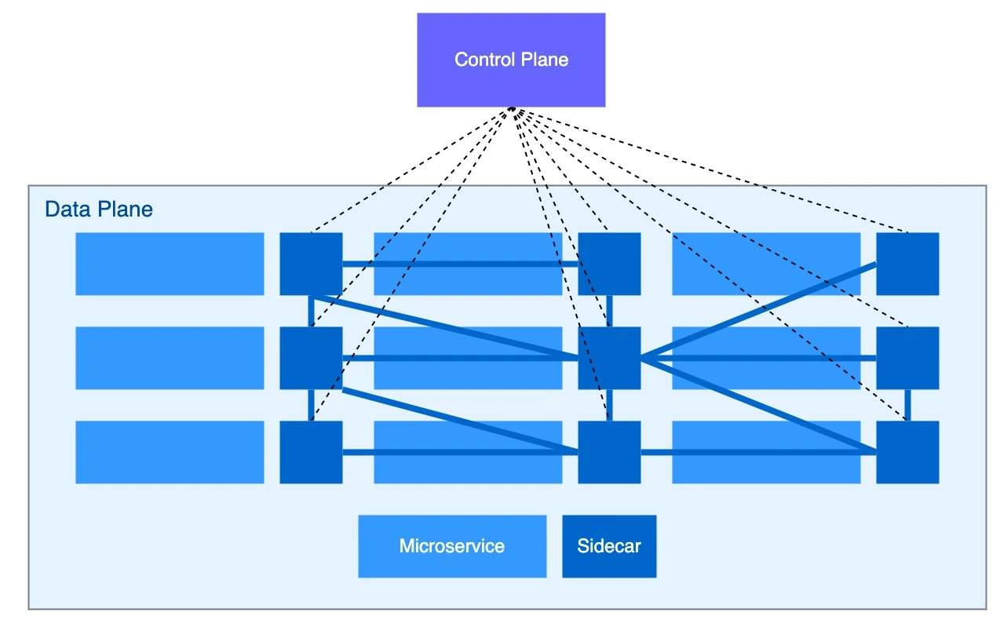
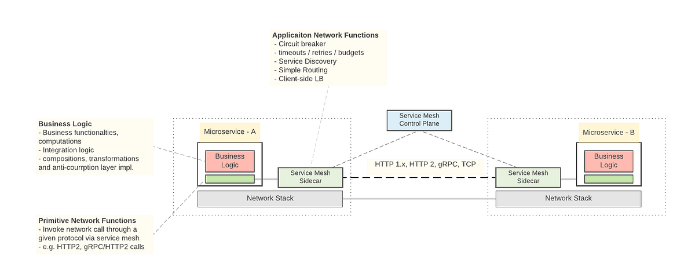
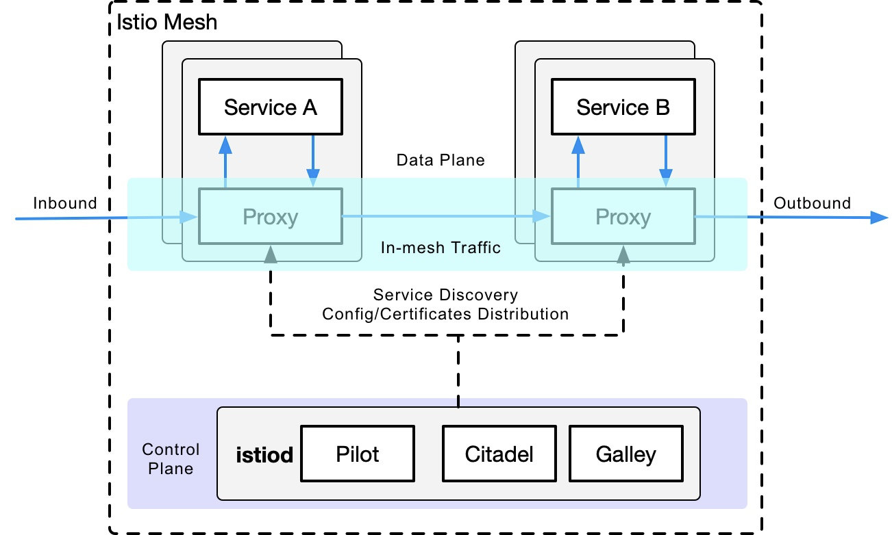

# 定义
* Service Mesh 不是用来解决业务领域问题的，而是一层专门的基础设施（中间件）。
* Service Mesh 的定位很简单也很清晰，就是用来处理服务与服务之间的通讯。
* 服务间通讯为什么需要特殊处理？因为网络是不可靠的，Service Mesh 的愿景就是让服务间的请求传递变得可靠。
* Service Mesh 从一开始就是为现代化的云原生应用而生，瞄准了未来的技术发展趋势。
* 具体 Service Mesh 应该怎么实现？典型方式都是通过一组轻量级的网络代理，在应用无感知的情况下偷偷就把这事给干了。
* 这些网络代理一定是跟应用部署在一起，一对一近距离贴心服务；否则，如果应用与代理之间也还是远程不靠谱通讯，这事儿就没完了。

## Service Mesh 主要负责的工作
以前这些都是由业务服务自己在代码里处理，或依赖侵入式的开源框架/库（如 Spring Cloud、Apache Dubbo、Nacos 服务发现、Netflix OSS 的 Ribbon/Hystrix 等）来解决。这类方案的共同问题是：业务代码需要显式引入 SDK，跟具体语言/框架强绑定，多语言团队很难统一治理。Service Mesh 把这些能力下沉到 sidecar，做成业务代码零侵入、语言无关的统一基础设施层，只在部署层面生效，不需要业务代码做任何改动。  

- 流量管理（Traffic Management）
  - 服务发现、负载均衡
  - 请求路由（灰度发布、A/B 测试、按权重分流）
  - 超时、重试（网络层面的、通用的重试）
  - 熔断、限流
- 安全（Security）
  - 服务间通信自动加密（mTLS），不用业务代码手动管证书
  - 服务身份认证、访问控制 Access Control（仅限于粗粒度服务间授权，给每个服务一个 "身份"，然后基于身份定义谁能访问谁，通过给每个服务签发一个基于 mTLS 证书的身份来实现。没有 mesh 之前，这种 "服务 A 能不能调用服务 B" 的控制，要么没做 - 内网通常被默认信任谁都能调用谁，要么每个服务自己在代码里写鉴权逻辑，维护成本高还容易漏。有了 mesh，这变成了统一的、声明式的策略，而且是 "零信任" 模型 — 默认不信任任何调用，必须显式声明允许关系。这也是为什么很多公司在做 "零信任网络" 改造时会用 Service Mesh 作为落地手段）
- 可观测性（Observability）
  - 自动采集所有调用的延迟、成功率、流量这些指标
  - 分布式链路追踪（一次请求经过了哪些服务，每一跳耗时多少）
  - 统一的日志/监控数据格式，不需要每个服务自己埋点
- 统一策略下发（通过控制平面）
  - 所有这些规则（路由、重试、熔断阈值、安全策略）通过控制平面集中配置和下发，改一次全网生效，不用重新编译部署业务服务

## 明确不负责的（需要业务自己解决）
- **分布式事务**（Saga、TCC 这些是业务层的事）
- **业务语义相关的错误处理和重试判断**（比如 "库存不足" 要不要重试，只有业务知道）
- **业务逻辑本身**（它只管服务之间 "怎么通信"，不管服务内部"做什么"）
- **细粒度 Access Control**（Service Mesh 只管服务级别的粗粒度访问控制，业务级别的权限控制还是要业务自己管）

## 总结
Service Mesh 的核心价值是把 **"服务间通信"这件跟业务无关但每个服务都要重复处理的事**，从业务代码里剥离出来，做成统一的、可集中管理的基础设施层 — 降低的是治理和运维复杂度，不是业务复杂度。  


* 架构落地：控制平面 + 数据面
  * 控制平面：通过长连接（如 xDS 协议）异步、提前把配置推送给 Sidecar；Sidecar 只在启动时做一次性全量拉取。控制平面（比如 Istiod）会持续监听 K8s 里 Service/Endpoints 的变化，一旦服务 B 有实例上线、下线、IP 变了，控制平面会主动把最新的路由和服务发现信息，通过一个长连接（xDS 协议，基于 gRPC 双向流）推送给所有相关的 Sidecar。这个推送跟 "服务 A 要不要调用服务 B" 完全没关系 — 不管有没有请求发生，只要服务 B 的状态变化了，控制平面就会主动同步给所有订阅了这份信息的 Sidecar。
  * 数据面（Sidecar）：Envoy 这类 Sidecar 会把收到的这些信息，缓存成本地的数据结构（Envoy 里叫 Cluster、Listener、Route 这些配置对象），相当于自己抽屉里存了一份 "全网地图"。本地维护路由表缓存，请求发生时（如服务 A 调用服务 B），服务 A 的 Sidecar 直接查自己本地缓存的路由表，找到服务 B 当前健康的实例列表，按配置的负载均衡策略（轮询、最少连接等）选一个，直接转发过去 — 全程不产生任何到控制平面的网络请求，本地内存查找，走的是纯本地计算，延迟极低（微秒级）。
  * 这种 "异步下发、本地生效" 的解耦，很好地解决了以下 2 个问题
    * 延迟爆炸：多了一次到控制平面的往返网络请求，一次简单的服务调用变成了两次网络调用，性能完全不可接受
    * 单点故障风险：如果控制平面这时候正好抖动或者不可用，所有服务间通信都会跟着瘫痪 — 这违背了 "控制平面挂了，数据面（实际流量转发）应该还能继续正常工作" 这个 Service Mesh 的核心设计原则
* 与 K8s 的集成方式
  * Sidecar 自动注入：靠 K8s 的 Mutating Admission Webhook，Pod 创建时自动塞入 Sidecar 容器
  * 服务发现：直接复用 K8s 原生的 Service/Endpoints，不用另起注册中心
  * 配置管理：Mesh 规则（VirtualService、AuthorizationPolicy 等）通过 CRD 定义，跟普通 K8s YAML 一样用 kubectl apply
  * 控制平面本身：也是跑在集群里的 Pod，通过 API Server watch 各类资源变化
* 网络拓扑图的含义
  * 经典的"网格图"（深绿 Microservice + 浅蓝 Sidecar）表达的是：业务服务间看似杂乱的调用关系，底层实际都走 Sidecar-to-Sidecar 的统一路径；连线故意画得不完全（非 full mesh），呼应 Mesh 实际采用的是部分连接、按需建立的拓扑，而非穷举式全连接。
* 现实中的取舍：什么时候真的需要 Mesh
  * 适合上 Mesh：K8s 原生部署、多语言技术栈、有平台团队支撑运维复杂度
  * 不一定需要：单语言、规模小、对 RPC 性能极度敏感（Dubbo 原生二进制协议）、没有专门团队维护 Mesh 本身的复杂度（Envoy 调试、证书轮换等）
  * 本质是 "要不要为未来的多语言/规模化扩展性提前买单" 的权衡，不是纯技术先进性问题

# 设计


Service Mesh 主要就是边车模式以及智能网络拓扑作为基石
* 边车代理作为网络拓扑的基本单元。
* 网络拓扑提供了边车代理之间通信和协作的框架。
* 控制平面管理和配置这个由边车代理组成的网络拓扑。



也是基于这两个基石，Service Mesh 进一步发展出：
* 集中式策略管理：通过控制平面统一管理网络策略。
* 高级流量控制：如金丝雀发布、流量分割、流量路由、流量镜像（复制生产流量到测试环境）等。
* 安全增强：自动化 mTLS（双向 TLS）、细粒度访问控制。
* 可观察性：分布式追踪、集中式日志和指标收集。

Service Mesh 的网络拓扑通常不是完全的点对点连接，而是采用了一种更优化和有策略的连接方式：
1. 部分连接拓扑 - Service Mesh 通常采用部分连接的拓扑结构，而不是全网格（full mesh）连接。这种方式有几个原因：
   - 可扩展性：全网格连接在大规模部署中会导致连接数量呈指数增长，难以管理。
   - 性能考虑：维护所有可能的连接会消耗大量资源。
   - 实际需求：并非所有服务都需要直接与其他所有服务通信。
2. 分层或分区连接 - Service Mesh 经常采用分层或分区的连接策略：
   - 服务分组：基于功能、团队或其他逻辑将服务分组。
   - 分区内全连接：同一分区内的服务可能保持全连接。
   - 分区间有限连接：不同分区之间通过特定的网关或代理进行连接。
3. 动态连接 - Service Mesh 的连接通常是动态建立的：
   - 按需连接：只在需要通信时建立连接。
   - 连接池：维护一个活跃连接的池，而不是与所有可能的目标保持连接。
4. 智能路由 - Service Mesh 使用智能路由而非直接点对点连接
   - 多跳路由：消息可能经过多个中间节点到达目的地。
   - 基于延迟的路由：选择最低延迟的路径。
   - 故障转移：在直接路径不可用时自动选择替代路径。
5. 边缘代理 - 许多 Service Mesh 实现使用边缘代理或网关：
   - 入口（Ingress）和出口（Egress）网关处理进出集群的流量。
   - 这减少了需要直接暴露到外部的服务数量。
6. 控制平面的角色 - 控制平面在决定和管理这种部分连接拓扑中起着关键作用：
   - 动态更新连接策略。
   - 基于服务发现信息优化连接。
   - 实施流量管理策略。
7. 实际例子
   - Istio：使用 Pilot 组件来动态配置 Envoy 代理，实现智能路由和部分连接。
   - Linkerd：采用轻量级代理，支持动态服务发现和路由。
8. 优化考虑
   - 局部性：优先连接同一数据中心或区域的服务。
   - 亲和性：基于服务间的通信频率和模式优化连接。
9. 未来趋势
   - 自适应拓扑：基于实时流量模式自动调整连接策略。
   - 机器学习优化：使用 AI/ML 预测和优化连接需求。

总之，Service Mesh 通过采用部分连接和智能路由策略，在提供全面服务互连能力的同时，也保持了系统的可扩展性和效率。这种方法允许 Service Mesh 在大规模微服务环境中更好地工作。

未来发展
* eBPF 集成：利用 eBPF 技术优化网络性能。


## 入口（Ingress）和出口（Egress）网关
是 Service Mesh 架构中的重要组件，它们管理进出服务网格的流量。以下是一些关键知识点：
1. 入口（Ingress）网关
   - 功能：
     - 处理进入服务网格的外部流量
     - 作为整个网格的统一入口点
     - 实现负载均衡、TLS 终止、路由等功能
   - 关键特性：
     - 流量路由：基于 HTTP 头、URL 路径等条件路由请求
     - 安全性：实现 TLS 终止，可以集成身份验证和授权
     - 流量控制：实现限流、重试等策略
     - 可观察性：为入站流量提供监控和日志记录
2. 出口（Egress）网关
   - 功能：
     - 管理从服务网格到外部服务的流量
     - 控制和监控对外部资源的访问
     - 实现安全策略和流量管理
   - 关键特性：
     - 访问控制：限制哪些服务可以访问外部资源
     - 安全增强：为出站流量提供 TLS 加密
     - 流量监控：记录和分析对外部服务的调用
     - 流量塑形：实现对外部服务的调用限制和控制
3. 共同特点
   - 作为网格边界：定义了服务网格的边界
   - 策略执行点：集中实施安全和流量策略
   - 可观察性：提供进出网格流量的统一监控点
4. 实现方式
   - 通常基于相同的代理技术（如 Envoy）
   - 可以作为独立的部署单元或与边车代理共存
5. 高级用例
   - 多集群连接：作为不同集群间通信的桥梁
   - 混合云架构：管理跨云和本地环境的流量
   - 合规性：在网关层实施数据本地化或审计策略
6. 性能考虑
   - 可能成为性能瓶颈，需要适当的资源分配和扩展策略
   - 在大规模部署中可能需要多个网关实例
7. 安全性增强
   - 可以集成 WAF（Web 应用防火墙）功能
   - 支持细粒度的访问控制和身份验证
8.  与 API 网关的关系
    - 入口网关可以与 API 网关集成或共存
    - 服务网格网关更专注于内部服务通信，而 API 网关更侧重于 API 管理和业务逻辑

理解和正确配置入口和出口网关对于构建安全、可控的服务网格至关重要。它们不仅管理流量，还是实施安全策略、监控和控制的关键点。

配置示例（Istio）

入口网关配置：
```yaml
apiVersion: networking.istio.io/v1alpha3
kind: Gateway
metadata:
  name: my-gateway
spec:
  selector:
    istio: ingressgateway
  servers:
  - port:
      number: 80
      name: http
      protocol: HTTP
    hosts:
    - "example.com"
```

出口网关配置：
```yaml
apiVersion: networking.istio.io/v1alpha3
kind: ServiceEntry
metadata:
  name: external-svc-entry
spec:
  hosts:
  - api.external-service.com
  location: MESH_EXTERNAL
  ports:
  - number: 443
    name: https
    protocol: HTTPS
  resolution: DNS
```
