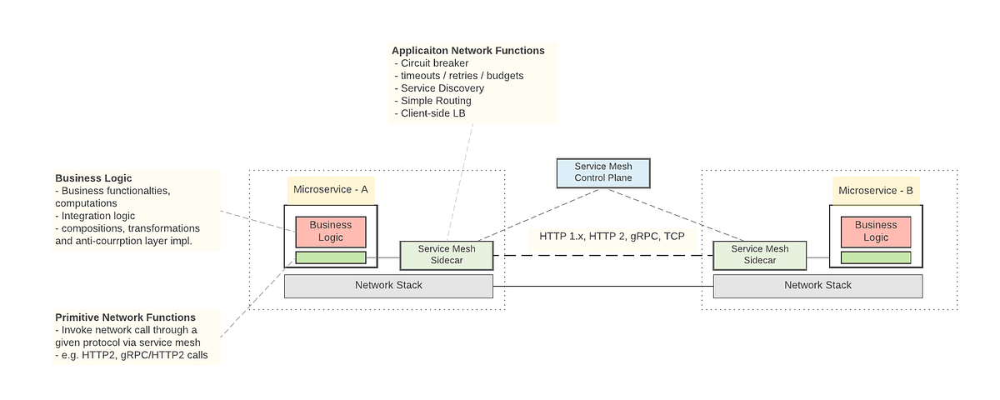

Service Mesh 主要就是边车模式以及智能网络拓扑作为基石
* 边车代理作为网络拓扑的基本单元。
* 网络拓扑提供了边车代理之间通信和协作的框架。
* 控制平面管理和配置这个由边车代理组成的网络拓扑。


也是基于这两个基石，Service Mesh 进一步发展出：
* 集中式策略管理：通过控制平面统一管理网络策略。
* 高级流量控制：如金丝雀发布、流量分割、流量路由、流量镜像（复制生产流量到测试环境）等。
* 安全增强：自动化 mTLS（双向 TLS）、细粒度访问控制。
* 可观察性：分布式追踪、集中式日志和指标收集。

Service Mesh 的网络拓扑通常不是完全的点对点连接，而是采用了一种更优化和有策略的连接方式：
1. 部分连接拓扑 - Service Mesh 通常采用部分连接的拓扑结构，而不是全网格（full mesh）连接。这种方式有几个原因：
   - 可扩展性：全网格连接在大规模部署中会导致连接数量呈指数增长，难以管理。
   - 性能考虑：维护所有可能的连接会消耗大量资源。
   - 实际需求：并非所有服务都需要直接与其他所有服务通信。
2. 分层或分区连接 - Service Mesh 经常采用分层或分区的连接策略：
   - 服务分组：基于功能、团队或其他逻辑将服务分组。
   - 分区内全连接：同一分区内的服务可能保持全连接。
   - 分区间有限连接：不同分区之间通过特定的网关或代理进行连接。
3. 动态连接 - Service Mesh 的连接通常是动态建立的：
   - 按需连接：只在需要通信时建立连接。
   - 连接池：维护一个活跃连接的池，而不是与所有可能的目标保持连接。
4. 智能路由 - Service Mesh 使用智能路由而非直接点对点连接
   - 多跳路由：消息可能经过多个中间节点到达目的地。
   - 基于延迟的路由：选择最低延迟的路径。
   - 故障转移：在直接路径不可用时自动选择替代路径。
5. 边缘代理 - 许多 Service Mesh 实现使用边缘代理或网关：
   - 入口（Ingress）和出口（Egress）网关处理进出集群的流量。
   - 这减少了需要直接暴露到外部的服务数量。
6. 控制平面的角色 - 控制平面在决定和管理这种部分连接拓扑中起着关键作用：
   - 动态更新连接策略。
   - 基于服务发现信息优化连接。
   - 实施流量管理策略。
7. 实际例子
   - Istio：使用 Pilot 组件来动态配置 Envoy 代理，实现智能路由和部分连接。
   - Linkerd：采用轻量级代理，支持动态服务发现和路由。
8. 优化考虑
   - 局部性：优先连接同一数据中心或区域的服务。
   - 亲和性：基于服务间的通信频率和模式优化连接。
9. 未来趋势
   - 自适应拓扑：基于实时流量模式自动调整连接策略。
   - 机器学习优化：使用 AI/ML 预测和优化连接需求。

总之，Service Mesh 通过采用部分连接和智能路由策略，在提供全面服务互连能力的同时，也保持了系统的可扩展性和效率。这种方法允许 Service Mesh 在大规模微服务环境中更好地工作。

未来发展
* eBPF 集成：利用 eBPF 技术优化网络性能。


## 入口（Ingress）和出口（Egress）网关
是 Service Mesh 架构中的重要组件，它们管理进出服务网格的流量。以下是一些关键知识点：
1. 入口（Ingress）网关
   - 功能：
     - 处理进入服务网格的外部流量
     - 作为整个网格的统一入口点
     - 实现负载均衡、TLS 终止、路由等功能
   - 关键特性：
     - 流量路由：基于 HTTP 头、URL 路径等条件路由请求
     - 安全性：实现 TLS 终止，可以集成身份验证和授权
     - 流量控制：实现限流、重试等策略
     - 可观察性：为入站流量提供监控和日志记录
2. 出口（Egress）网关
   - 功能：
     - 管理从服务网格到外部服务的流量
     - 控制和监控对外部资源的访问
     - 实现安全策略和流量管理
   - 关键特性：
     - 访问控制：限制哪些服务可以访问外部资源
     - 安全增强：为出站流量提供 TLS 加密
     - 流量监控：记录和分析对外部服务的调用
     - 流量塑形：实现对外部服务的调用限制和控制
3. 共同特点
   - 作为网格边界：定义了服务网格的边界
   - 策略执行点：集中实施安全和流量策略
   - 可观察性：提供进出网格流量的统一监控点
4. 实现方式
   - 通常基于相同的代理技术（如 Envoy）
   - 可以作为独立的部署单元或与边车代理共存
5. 高级用例
   - 多集群连接：作为不同集群间通信的桥梁
   - 混合云架构：管理跨云和本地环境的流量
   - 合规性：在网关层实施数据本地化或审计策略
6. 性能考虑
   - 可能成为性能瓶颈，需要适当的资源分配和扩展策略
   - 在大规模部署中可能需要多个网关实例
7. 安全性增强
   - 可以集成 WAF（Web 应用防火墙）功能
   - 支持细粒度的访问控制和身份验证
8.  与 API 网关的关系
    - 入口网关可以与 API 网关集成或共存
    - 服务网格网关更专注于内部服务通信，而 API 网关更侧重于 API 管理和业务逻辑

理解和正确配置入口和出口网关对于构建安全、可控的服务网格至关重要。它们不仅管理流量，还是实施安全策略、监控和控制的关键点。

配置示例（Istio）

入口网关配置：
```yaml
apiVersion: networking.istio.io/v1alpha3
kind: Gateway
metadata:
  name: my-gateway
spec:
  selector:
    istio: ingressgateway
  servers:
  - port:
      number: 80
      name: http
      protocol: HTTP
    hosts:
    - "example.com"
```

出口网关配置：
```yaml
apiVersion: networking.istio.io/v1alpha3
kind: ServiceEntry
metadata:
  name: external-svc-entry
spec:
  hosts:
  - api.external-service.com
  location: MESH_EXTERNAL
  ports:
  - number: 443
    name: https
    protocol: HTTPS
  resolution: DNS
```
