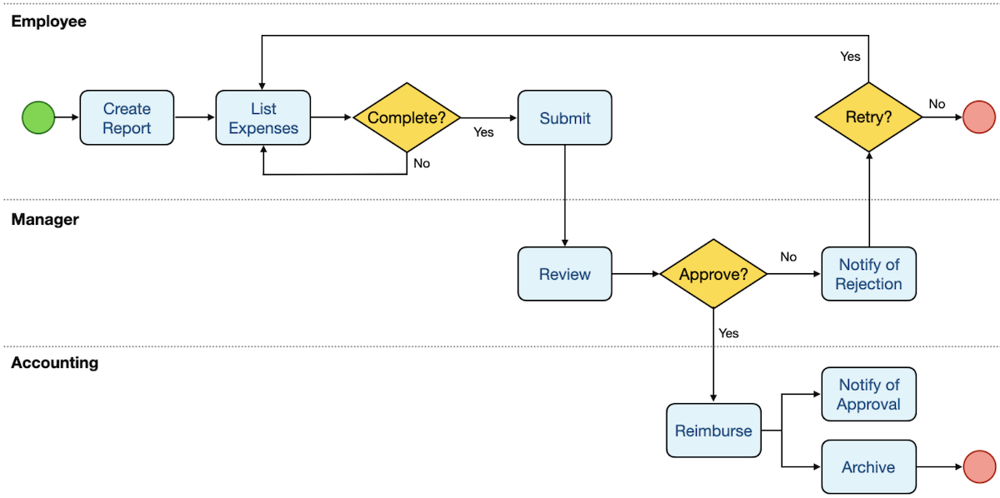
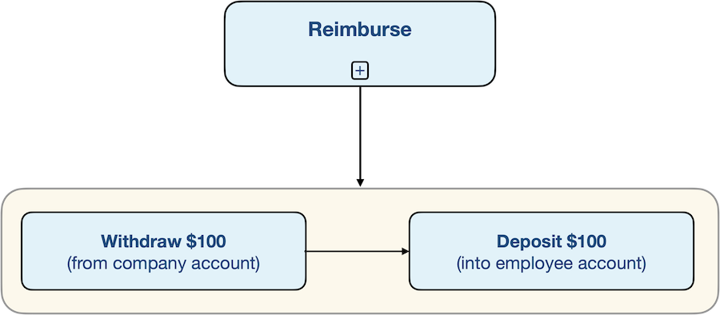
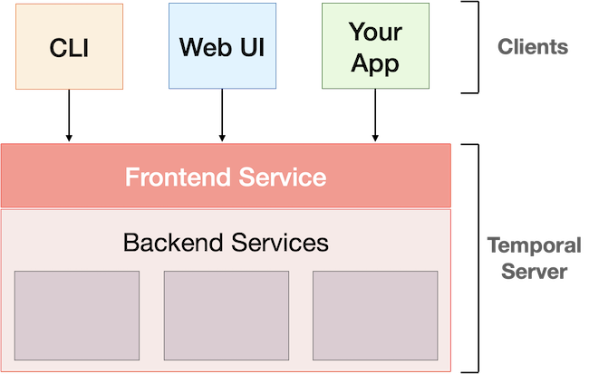
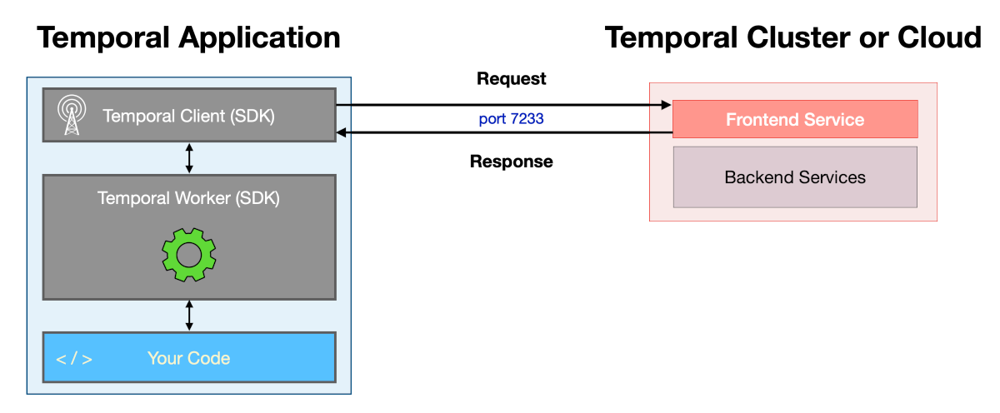
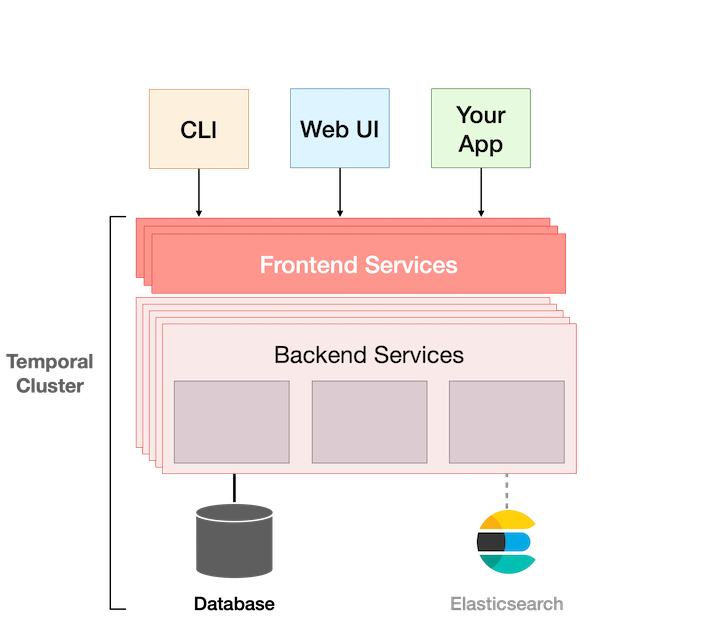
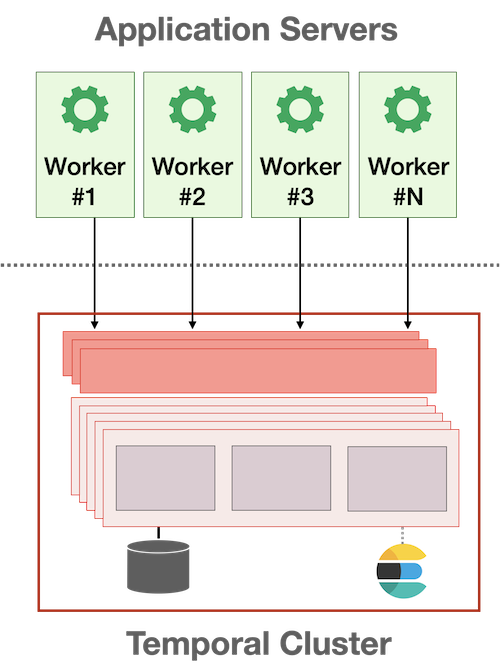
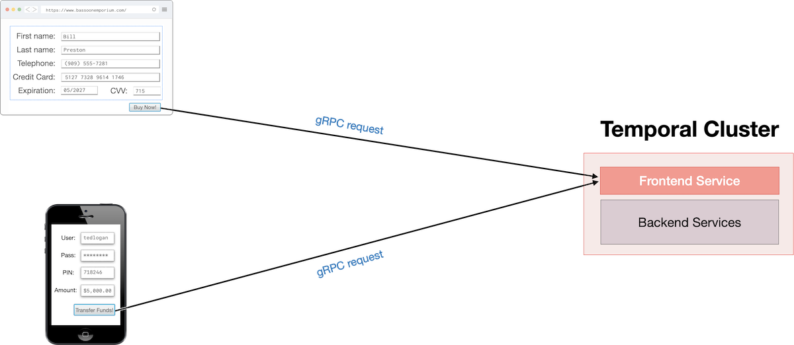
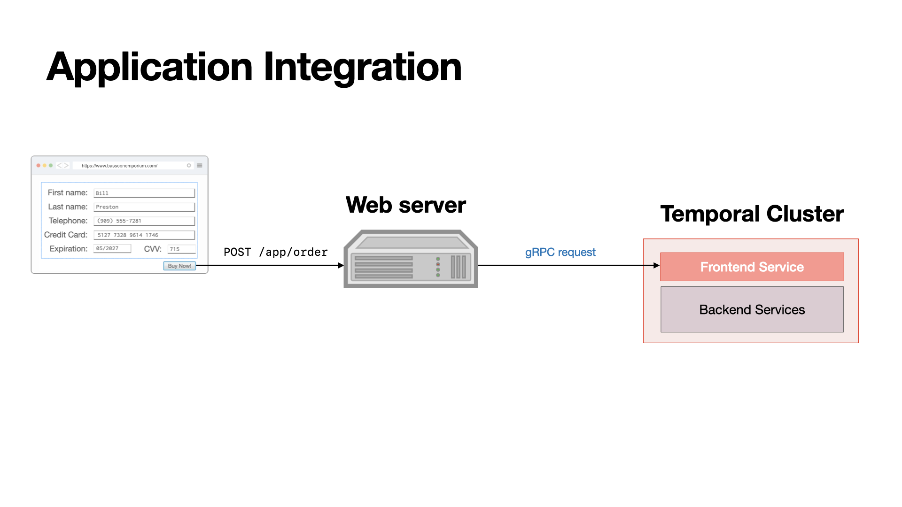

# Workflow
工作流或工作流编排系统是对工作流程及其操作步骤、业务规则的抽象与自动化描述。它将一连串的任务、数据和人按照特定的逻辑顺序组织起来，让复杂的业务或计算过程在计算机或 AI 的帮助下自动、顺畅地执行。  

AI Agent 的执行天然就是 Workflow。  

## Workflow 和普通 API 的区别
普通 API：Request -> Service -> DB -> Response  
通常生命周期只有几秒。

Workflow 引擎、框架：Activity A -> Activity B -> Wait 3 days -> Activity C -> Activity D  
它甚至可以睡 N 天，然后自动醒过来继续执行。而且不需要基于底层组件（Redis delayed queue + Kafka + DB state + cron + retry table + worker）自建开发实现上面这些复杂功能，引擎、框架（Temporal）已经帮开发者把这些可靠性机制抽象掉。  

Workflow 不是新的概念，已经在业界应用多年，随着微服务的新起而迎来了新的挑战 - 各类分布式系统问题，因此涌现了一些新的引擎、框架系统来解决这些问题：
```
Distributed Business Process
│
└── Workflow
    │
    ├── Orchestration
    │   ├── Temporal
    │   ├── Camunda
    │   └── AWS Step Functions
    │
    └── Choreography
        └── Event-driven / Saga
```

## Temporal
是一个分布式工作流编排 / Durable Execution（持久化执行）系统。把一个跨服务、跨时间、可能执行几天甚至几个月的业务流程，写成一段代码，然后 Temporal 保证它最终能够可靠地执行完。[Temporal 101](https://temporal.talentlms.com/plus/my/training/126/units/2101)  

简而言之，Temporal 平台能够保证应用程序代码的持久化执行。它让开发者可以像开发过程中完全忽略故障一样进行开发。即使遇到网络中断或服务器崩溃等问题（这些问题对一般应用程序而言可能是灾难性的），应用程序也能可靠运行。Temporal 平台会处理这类问题，让开发可以专注于业务逻辑，而无需编写用于检测和恢复故障的应用程序代码。  

工作流程
Temporal 应用程序使用一种名为工作流的抽象概念构建。可以使用通用编程语言（例如 Go、Java、TypeScript 或 Python）编写代码来开发这些工作流。编写的代码与运行时执行的代码相同，因此可以使用自己喜欢的工具和库来开发时间类工作流。  
Temporal 工作流具有极强的弹性。即使底层基础设施发生故障，它们也能持续运行数年之久。如果应用程序本身崩溃，Temporal 会自动恢复其故障前的状态，以便从中断处继续运行。  

什么是工作流程？  
即一系列步骤。从概念上讲，工作流定义了一系列步骤。在 Temporal 中，这些步骤通过编写代码（称为工作流定义）来定义，并通过运行该代码来执行，从而产生工作流执行。  

工作流程示例  
将概念映射到现实世界的应用 - 每天都会遇到各种工作流程。例如，订阅娱乐服务、购买音乐会门票、预订假期、订购披萨或提交费用报销单等。  
以提交费用报告为例，需要经过一系列步骤：首先，员工需要创建报告，描述购买的物品，如有需要，请附上收据，然后提交。经理审核后，会拒绝（如果被拒绝，员工会收到通知，以便解决问题并根据需要重新提交）或批准。如果获得批准，财务部门将进行处理，并通过支票或直接存款的方式向员工报销，并通知员工报销已完成。他们还会将此报告存档，以备审计之需。  
  
这种工作流程有一些特点（其中许多也存在于其他领域的工作流程中）。其中之一是它可能是一个耗时较长的过程。根据组织规模和所需审批的数量，从开始到结束可能需要几天、几周甚至更长时间。另一个特点是它包含条件逻辑；就像计算机程序一样，它存在决策点和执行路径，这些路径会根据结果而有所不同：如果员工的费用报销单被接受，下一步就是报销；如果被拒绝，下一步则是发送通知，要求员工修改并重新提交报销单。另一个特点是：该工作流程可能包含循环；例如，被拒绝的报销单可能会导致更正、重新提交和再次审核。此外，值得注意的是，该工作流程涉及多方人为交互，包括员工、经理和财务部门。它还涉及外部系统，特别是公司银行（作为报销款项的来源）和员工银行（作为这些资金的目标）。  
工作流的另一个有趣之处在于它可以由其他工作流组成。以费用报销为例，报销实际上不是一个步骤而是两个不同的操作。  
第一步是从雇主的银行账户中提取资金，第二步是将相同金额存入雇员的银行账户。要正确完成此操作，有两个重要的限制条件。首先，必须同时执行取款和存款操作。其次，必须分别执行每项操作一次。
更广义地说，报销其实就是两个账户之间的资金转移。这种工作流程还有许多其他应用场景。事实上，每天有数百万人在使用 Square、Stripe、Western Union、PayPal、Venmo、Swish 或 Apple Pay 等服务时都依赖于这种流程。  
这种工作流程通常会涉及通过某种远程过程调用访问多个账户，因此它是一个分布式系统。与任何分布式系统一样，它可能因多种原因而发生故障，包括服务器故障或网络中断。如果此工作流程不是基于 Temporal 构建的，后果可能不堪设想。如果它在执行过程中（即提款和存款步骤之间）发生故障，则账户余额将不正确。更糟糕的是，当前状态将会丢失，因此重启应用程序将重新执行提款操作，而不是从存款操作继续。作为开发人员，有责任检测并缓解这些故障，但如果使用 Temporal Workflows，则可以让平台处理这些类型的故障。  

### Architectural Overview
#### Temporal Platform
  
Temporal Server 由前端服务和多个后端服务组成，这些服务协同工作以管理应用程序代码的执行。所有这些服务都支持水平扩展，生产环境通常会在多台机器上运行每个服务的多个实例，以提高性能和可用性。
另一方面，还有一些客户端会与临时服务器通信。三种类型的客户端：
* Temporal 的命令行界面 (CLI)
* Temporal 的基于 Web 的用户界面 (Web UI)
* 嵌入到开发者运行的应用程序中的临时客户端

请注意，作为 Temporal Server 一部分的前端服务充当 API 网关。换句话说，它是面向客户端的前端，而不是面向最终用户的前端（最终用户将与 CLI 或 Web UI 进行交互）。  
客户端通过向前端服务发出请求与临时服务器通信。前端服务随后根据需要与后端服务通信以完成请求，并将响应返回给客户端。集群内部及集群与客户端之间的通信使用 gRPC 完成。  
  
所有这些通信都可以使用 TLS 进行保护，TLS 会在数据通过网络传输时对其进行加密，还可以通过验证客户端和服务器的证书来验证其身份。  

#### Temporal Cluster
就像计算机中的 CPU 或汽车中的引擎一样，Temporal 服务器是整个系统的重要组成部分，但其运行需要其他组件。整个系统被称为 Temporal 集群，它是在若干台机器上部署的 Temporal 服务器软件及其配套组件的组合。  
  
唯一必需的组件是数据库，例如 Apache Cassandra、PostgreSQL 或 MySQL。Temporal 集群会跟踪工作流每次执行的当前状态。它还会维护工作流执行期间发生的所有事件的历史记录，以便在发生故障时重建当前状态。它会将这些信息以及其他信息（例如与持久计时器和队列相关的详细信息）持久化到数据库中。  
Elasticsearch 是一个可选组件。它并非基本操作所必需，但添加它后，可以获得更高级的搜索、排序和筛选功能，用于查找当前和最近工作流执行的信息。当运行数百万次工作流并需要查找特定工作流时，此功能非常有用；例如，可以根据工作流的启动时间、运行时长或最终状态进行查找。  
Temporal 通常还会配合另外两个工具使用。Prometheus 用于从 Temporal 收集指标，而 Grafana 用于基于这些指标创建仪表盘。这些工具协同工作，帮助运维团队监控集群和应用程序的运行状况。  

#### Workers
Temporal 集群本身并不执行代码。虽然该平台保证代码的持久化执行，但它是通过编排实现的。应用程序代码的执行发生在集群外部，在典型的部署环境中，这些代码运行在一组独立的服务器上，这些服务器可能位于与 Temporal 集群不同的数据中心。  
负责执行代码的实体称为 Worker，通常会在多台服务器上运行 Worker，因为这样可以提高应用程序的可扩展性和可用性。作为应用程序一部分的 Worker 与 Temporal Cluster 通信，以管理工作流的执行。  
换句话说，Worker 是由业务方自己部署和运行的长运行后台进程，可以部署在自己的服务器、虚拟机、Kubernetes Deployment、Docker Container、ECS Task 或其他计算环境中。Temporal Server 不会主动执行业务代码，而是把任务放入 Task Queue，等待 Worker 轮询并执行。  
  
应用程序将包含用于初始化 Worker、Workflow 以及构成业务逻辑的其他函数的代码，可能还包括用于启动或检查 Workflow 状态的代码。运行时，需要在至少运行一个 Worker 进程的每台机器上准备好执行应用程序所需的一切资源，包括代码中引用的任何库或其他依赖项。  

#### Worker Connectivity
由于 Worker 使用 Temporal Client 与 Temporal Cluster 通信，因此运行 Worker 的每台机器都需要连接到集群的前端服务，该服务默认监听 TCP 端口 7233。  

### 集成到应用
Temporal 服务于多种应用场景；例如，确保电子商务订单和金融交易的可靠执行。这些应用的最终用户并非开发人员，可能并不了解 Temporal，但他们的操作会触发工作流执行以及与 Temporal 集群的其他交互。  
这就引出了一个问题：如何将 Temporal 应用程序集成到整个应用程序中？例如，如何响应用户在 Web 或移动应用程序中点击按钮的操作来启动工作流执行？  

直接集成到应用程序前端 - 可以在这些应用程序内部使用 Temporal 客户端。也可以完全不使用 Temporal 客户端，直接从应用程序发出 gRPC 请求。然而，这两种方法都属于非典型做法。  
  

更典型的做法是让最终用户应用程序调用后端服务（例如提供 REST 端点的 Web 应用程序），该服务充当应用程序网关，并使用 Temporal 客户端与集群交互。例如，假设最终用户在 Web 应用程序中提交表单，这将导致向与订单处理相关的端点发出请求。在这种情况下，Web 服务器上运行的代码可以从 HTTP 请求中提取数据，并将其用作工作流执行的输入。工作流执行通过 Temporal Client 启动，从而向 Temporal Cluster 发出 gRPC 请求。Web 应用程序还可以提供用于取消工作流或检索其结果的端点，这些端点也可以使用 Temporal Client 来实现。  
从网络安全角度来看，这种方法更容易支持，因为 Temporal 集群的前端服务只需要接受来自 Web 服务器的入站连接，而不需要接受来自每个最终用户的连接。  
  

#### Client 和 Worker 的代码库关系
Temporal Client 和 Worker 是两个不同的运行角色，但在真实项目里，它们通常来自同一个代码库，并以不同入口、不同进程或不同部署单元运行。  

常见形态：
```
same repo
├── cmd/api        # 后端 API 服务，创建 Temporal Client，启动 Workflow
├── cmd/worker     # Worker 服务，注册 Workflow / Activity，轮询 Task Queue
├── workflows      # Workflow Definition
└── activities     # Activity Definition
```

也就是说，Client 通常集成在后端应用中，负责响应用户请求、定时任务或消息事件并启动 Workflow；Worker 通常作为独立的长运行后台进程部署，负责真正执行 Workflow 和 Activity。两者可以共享同一个代码库中的 Workflow / Activity 类型定义，但运行时通常是不同进程，例如不同的 Docker Container、Kubernetes Deployment、ECS Task 或 systemd service。  

为什么通常是共享代码库，而不是共享同一个运行服务？原因是 Client 端调用 `client.ExecuteWorkflow()` 时通常需要引用 Workflow function 的类型签名。在 Go、Java 这类强类型语言里尤其明显：Client 需要知道要启动哪个 Workflow、输入参数是什么、返回值是什么。如果 Client 和 Worker 完全分属两个独立代码库，就容易出现 Workflow 类型定义重复维护、字符串 name 约定不一致、参数结构版本不一致、拼写错误等问题，最终可能导致 Workflow 启动失败或 Task 长时间无法被正确处理。共享代码库可以让 Workflow / Activity 的类型定义复用，提升类型安全（type safety）和版本同步能力。  

Client 和 Worker 之间并不直接通过网络互相调用，它们通过 Task Queue 连接起来。Client 在 `StartWorkflowOptions` 中指定 Task Queue 名称，并通过 Temporal Server 创建 Workflow Execution；Worker 轮询同一个 Task Queue 名称来领取 Workflow Task 或 Activity Task。也就是说，Temporal Server 是中介：Worker 暂时挂掉时，任务会保留在 Temporal Server 端等待可用 Worker，而不是像同步 RPC 那样因为目标服务不可用就立即失败。  

这种拆分的原因是 API Server 和 Worker 的负载模型不同：API Server 面向用户请求，通常追求低延迟和快速返回；Worker 面向后台任务，可能执行耗时操作、自动重试、等待 Timer 或调用外部系统。因此两者通常使用不同的扩缩容策略和运维边界。这里的 Timer 是 Temporal 持久化 Timer，不是 Worker 进程内的 `sleep`。即使 Worker 重启、机器宕机或换了一批 Worker，只要 Temporal Server 的状态还在，Timer 到期后 Workflow 仍然可以被唤醒并继续执行。  

需要注意版本兼容问题：Client 和 Worker 可以共享同一个代码库，但部署时间点可能不同，而且线上可能存在旧版本 Workflow Execution 仍在运行。如果 Worker 升级后直接改变 Workflow 代码逻辑，旧 Workflow 在 replay 历史事件时可能触发 non-determinism error。Temporal 提供 Workflow Versioning 机制来处理这类演进问题，例如在代码中使用 `workflow.GetVersion`，或者使用 Worker Versioning 特性。Client / Worker 分离部署虽然带来扩缩容和故障隔离优势，但 Workflow 代码版本演进是实际项目里需要认真设计的运维复杂度之一。  

### Worker 初始化
配置 Worker 通常需要三样东西：
* Temporal 客户端 - 用于与 Temporal 集群通信。函数的第一行 main 创建一个客户端，接下来的几行代码检查创建过程是否出现任何错误，并确保在不再需要时将其关闭。如果使用的是 Temporal Cloud 或自托管集群，则用于创建客户端的代码将与此处所示的代码有所不同，因为这还包含前端服务的地址和端口号以及用于身份验证的凭据。
* 任务队列的名称 - 该队列由 Temporal 服务器维护，并由 Woker 轮询。实例代码里任务队列名称为 `greeting-task-queue`。此值与客户端一起在创建 Worker 时提供。
* Workflow 定义函数的完整限定名称 - 用于调用 RegisterWorkflow。每个工作流定义函数必须至少注册到一个 Worker 才能执行，但可以将多个此类函数注册到任何给定的 Worker。

完成 Worker 的配置后，即可调用其 Run 函数启动它。Worker 是一个持续运行的进程，启动后通常不会在处理完一个 Workflow 后退出，而是持续对指定的任务队列进行长轮询。如果使用类似上文所示的程序从终端启动 Worker，则可能只看到几行输出，这是正常现象。程序并未卡住，它只是忙于轮询任务队列并处理从 Temporal Cluster 接收的任务。  

#### Worker 的生命周期
Worker 的生命周期和 Workflow Execution 的持续时间没有直接关系。  
用于启动 Worker 的 Run 函数是一个阻塞函数。除非 Worker 被终止，或者遇到致命错误，否则它不会停止。Worker 进程可能会持续运行几天、几周，甚至更久。  
如果它处理的 Workflow 比较短，那么一个 Worker 在自己的生命周期内可能会执行成千上万，甚至数百万个 Workflow。另一方面，一个 Workflow 可能会运行数年，而运行某个 Worker 进程的服务器，可能几个月后就因为管理员维护而重启。如果这个 Workflow Type 已经注册到了其他 Worker 上，那么其中一个或多个 Worker 会自动从原 Worker 停下的位置继续执行。  
如果当前没有其他可用 Worker，那么等原来的 Worker 重启后，Workflow Execution 也会从之前中断的位置继续执行。
无论是哪种情况，Worker 的停机都不会导致 Workflow Execution 失败。  

**选择 Task Queue 名称**  
Task Queue 名称是大小写敏感的。为了减少问题，应该选择描述性强、尽量简短、简单的名称。

### 使用 CLI 启动 Workflow
已经创建一个 Workflow Definition，并初始化一个能够执行它的 Worker。下一步就是运行应用程序。
启动 Workflow 的一种方式，是使用 `temporal` 命令行工具执行类似下面的命令：
```bash
temporal workflow start \
    --type Greet \
    --task-queue greeting-task-queue \
    --workflow-id greeting-workflow \
    --input '"Temporal"'
```
注意 `input` 值的引号写法：外层是单引号，里面还有双引号。  
传给 `temporal` 命令的输入必须是 JSON 格式。这里的引号写法是为了让这个值能够正确地穿过 shell，并以正确格式传入 Workflow。

**命令参数说明**  
这个命令指定了几个参数。
第一个是 Workflow Type。在 Go SDK 中，Workflow Type 默认是 Workflow Definition 函数的名称。  
下一个是 Task Queue。Temporal Cluster 会使用这个 Task Queue，它必须和初始化 Worker 时提供的值完全一致。由于 Task Queue 是动态创建的，所以如果 Task Queue 名称写错，并不会立即报错。但这会导致创建出两个不同的 Task Queue。这样 Temporal Cluster 和 Worker 就不会共享同一个队列，Workflow Execution 也就永远不会继续推进。  
命令还指定了一个 Workflow ID。这个参数是可选的，但推荐提供。Workflow ID 是用户自定义标识符，通常带有业务含义。例如，一个费用报销 Workflow 的 Workflow ID 可以用来标识某个费用报销单，或者提交报销单的员工。如果省略 Workflow ID，Temporal 会自动分配一个 UUID 作为 Workflow ID。  
由于这个 Workflow 需要输入参数，也就是一个用于定制问候语的名字字符串，所以命令里传入了这个值。  
当通过命令行提交 Workflow 执行请求时，输入总是 JSON 格式。这就是为什么命令中的 input 看起来是在单引号里面放了双引号。  
对于这种简单场景，直接在命令行里写 JSON 没问题，因为这里只有一个参数和一个值。但如果要传入更复杂的数据，这种方式就会很笨拙。好在可以把输入保存成一个 JSON 文件，然后通过 `--input-file` 指定文件路径，而不是用 `--input` 在命令行里直接写数据。  

**执行命令后会发生什么**  
当运行这个命令时，它会把 Workflow Execution 请求提交给 Temporal Cluster。  
Cluster 会返回 Workflow ID。这个 Workflow ID 要么就是提供的那个值，要么是在省略时由系统自动分配的 UUID。  
它还会显示一个 Run ID。Run ID 用来唯一标识这一次具体的 Workflow 执行。  
不过，命令不会显示 Workflow 返回的结果，因为 Workflow 可能会运行几个月甚至几年。  
可以使用下面的命令查看结果：
```bash
temporal workflow show --workflow-id greeting-workflow
```

### 从应用程序代码执行工作流
另一种方法是通过应用程序代码启动工作流，这样可以避免每次 temporal 都输入冗长的命令。  
虽然两种方法都能达到相同的目的，但通过代码实现可以更方便地将 Temporal 集成到应用程序中。例如，可以根据用户操作（例如在 Web 或移动应用中点击按钮）来执行或终止工作流。  

[示例代码说明：执行 Workflow](../system%20design/temporal_app/cmd/starter/main.go)  
这个应用程序通过以下三个主要步骤来启动 Workflow：
1. 从 Temporal SDK 导入 `client` 包。
2. 创建并配置一个 client。
3. 使用 API 请求执行 Workflow。

关于第二点，这里用于创建和配置 client 的代码，与初始化 Worker 时使用的代码是完全相同的。可以将应用程序设计成让这两部分代码共享同一个 client。实际上，在真实的 Temporal 应用程序中，这是一种很常见的做法。不过在本课程中，将 Worker 的初始化代码和 Workflow 启动代码分开，这样更容易区分两者各自的职责。  

Workflow Execution 的配置项指定了 **Workflow ID** 和 **Task Queue 名称**，也就是传给 `temporal` 命令的那两个参数。  
应用程序通过调用 client 的 `ExecuteWorkflow` 函数来请求执行 Workflow。调用时需要传入：
* `Context`
* Workflow Execution 配置项
* Workflow 函数的完整限定名称（fully-qualified name）
* Workflow 的输入参数

在这个例子中，Workflow 的输入参数是在运行这个应用程序时通过命令行提供的。  
顺便说一下，当从代码中启动 Workflow 时，并不需要像在命令行中那样把输入写成 JSON 格式。可以直接使用 SDK 所支持的类型，例如整数、字符串或者结构体，SDK 会自动将它们转换成 JSON。  

**获取执行结果**  
Workflow 可以运行非常长的时间。`ExecuteWorkflow` 的调用不会阻塞，因此即使 Workflow 需要几年才能完成，Starter 仍会紧接着就输出 `"Started Workflow"`，以及 Workflow ID 和 Run ID 日志。  
业务并不要求必须等待 Workflow 完成，也不一定需要获取它的结果。不过示例代码展示了如何获取结果。由于只有当 Workflow Execution 完成之后才能获得结果，因此 `ExecuteWorkflow` 会返回一个 **`Future`**。这个 `Future` 可以在结果准备好之后提供对结果的访问。  

真正发生阻塞的是对这个 `Future` 调用 `Get` 函数。  
在调用 `Get` 之前，代码首先定义一个与 Workflow 函数返回值类型匹配的变量。在这个例子中，它是一个名为 `result`、类型为 `string` 的变量。  
然后，代码调用 `ExecuteWorkflow` 返回的 `Future` 上的 `Get` 函数，并将这个变量的地址传进去，以便接收 Workflow 函数返回的结果。  
用于获取结果的 `Get` 调用会一直阻塞到 Workflow Execution 完成为止。如果 Workflow Execution 成功完成，那么 `result` 变量就会被赋值为 Workflow 的输出结果。如果 Workflow Execution 产生了错误，那么 `result` 变量不会被设置，而是会得到对应的错误值。  

这里其实是在讲 Temporal 一个非常重要的概念  
可以把它简单理解成：提交/启动一个可靠的长期任务，并立即拿到一个代表这个任务执行结果的 Future。这也是 Temporal 和普通函数调用非常重要的区别。  

### 使用 CLI 查看 Workflow History
**运行 `temporal workflow show`**  
Temporal Service 会维护每个 Workflow Execution 的详细历史记录（Event History）。这是 Temporal 平台的一项优势：无论 Workflow 当前正在运行，还是最近刚刚运行结束，都可以通过历史记录了解应用程序中发生了什么。  
查看 Workflow Execution 简要历史的一种方式，是运行类似下面的 `temporal` 命令：
```bash
temporal workflow show --workflow-id greeting-workflow
```

**解读命令输出**  
运行上面的命令后，会看到类似下面的输出，其中记录了这个 Workflow 执行期间发生的事件：
```text
Progress:
    ID           Time                     Type
        1  2025-03-10T17:38:31Z  WorkflowExecutionStarted
        2  2025-03-10T17:38:31Z  WorkflowTaskScheduled
        3  2025-03-10T17:38:31Z  WorkflowTaskStarted
        4  2025-03-10T17:38:31Z  WorkflowTaskCompleted
        5  2025-03-10T17:38:31Z  WorkflowExecutionCompleted

Results:
    Status          COMPLETED
    Result          "Hello Temporal!"
    ResultEncoding  json/plain
```
这个 Workflow Execution 的 Event History 中包含五个事件，同时还显示了它的状态和输出结果。后续会进一步学习这些 Event 的含义。  
如果要查看更详细的 Workflow Execution 历史，可以运行下面的命令：
```bash
temporal workflow show \
        --workflow-id greeting-workflow \
        --detailed
```
然后可以看到，详细输出包含了简要输出中的相同事件，但提供了更多上下文信息和配置项。  
第一个事件右侧的字段包含了 Workflow Type（`Greet`）、Task Queue（`greeting-task-queue`）、输入值（`Temporal`）以及本次 Workflow Execution 使用的各种超时设置。接下来的三个事件表示 Temporal Service 调度了一个 Workflow Task，该任务随后由 Worker 启动并完成。最后一个事件确认 Workflow Execution 已经完成，并返回了结果（`Hello Temporal!`）。  

### 修改 Workflow
向后兼容性（Backward Compatibility）是 Temporal 中的重要考量。一个给定的 Workflow Definition 可能执行数百次、数千次甚至数百万次。如果某次执行失败，Temporal 会重建 Workflow 在故障前的状态，然后继续执行。虽然现在还不需要深入了解这个机制的工作原理，但它对 Workflow Definition 的开发和维护方式有一些影响。  

**输入参数和返回值**  
一般来说，应该避免改变 Workflow 输入参数的数量或类型，以及返回值的类型。  
Temporal 建议 Workflow Function 只接收单个输入参数，且该参数是一个 `struct`（结构体），而不是多个输入参数。改变结构体中哪些字段是其组成部分并不会改变结构体本身的类型，因此这种方式提供了一种向后兼容的代码演进方法。  

**确定性（Determinism）**  
虽然 Temporal 应用程序经常用于管理非确定性工作（例如调用微服务或 LLM），但 Workflow Definition 本身必须是确定性的，即用于编排这些工作的代码。Temporal 对确定性有明确的定义，但理解这个定义需要更深入的 Workflow Execution 知识，所以这里先泛化一下：可以把确定性理解为一个要求——给定相同的输入，Workflow 的每一次执行都必须产生相同的输出。这意味着在 Workflow 代码中不应该做诸如使用随机数这样的事情。  

**关于非确定性操作**  
确定性要求仅适用于 Workflow 编排逻辑。几乎所有与外部世界交互的操作都本质上是非确定性的：
- 调用 LLM API 或调用 AI 工具
- 查询数据库
- 读取或写入文件
- 向外部服务发起 HTTP 请求

好消息是：Temporal 应用程序完全可以处理所有这些操作。如果需要执行某些非确定性操作，只需将这些代码移到一个名为 **Activity** 的单独函数中，然后在 Workflow 代码中引用它。Activity 在 Workflow replay 路径之外运行，并由 Temporal 可靠地重试。下一章会进一步学习和开始使用 Activity。  

**Temporal 不能用于 AI 吗？**  
恰恰相反。Workflow 确定性正是 Temporal 很适合用于 AI 应用的原因。因为 LLM 调用、工具使用和 agent 步骤都进入了 Activity，Workflow 可以编排这些序列，而 Temporal 会持久化每一步——所以 agent 可以从崩溃中恢复、重试失败的 LLM 调用，并在不丢失状态的情况下恢复长期运行的任务。  
这种确定性 Workflow 与非确定性 Activity 之间的分离，正是使 Temporal 能够提供 Durable Execution（持久化执行）的基础。  

### 版本控制（Versioning）
由于 Temporal 中的 Workflow Execution 可能会运行很长时间 - 有时长达数月甚至数年 - 在某个 Workflow Execution 仍在进行中时，经常需要对 Workflow Definition 进行重大改变。例如，假设当前的 Workflow 在订单发货时用电子邮件通知客户，后来决定改为同时发送电子邮件和短信。版本控制是 Temporal 中的一个特性，可帮助安全地管理这些代码变更。通过版本控制，可以修改 Workflow Definition，使得新执行使用更新的代码，而现有的执行继续运行原始版本。当进行非确定性变更时，这尤其有用 - 即导致正在运行的 Workflow Execution 内部执行顺序发生变化的变更。Temporal SDK 允许跟踪和管理这些版本，让旧执行使用原始代码，而新执行使用修改后的版本。可以使用 SDK 的 ["Versioning"](https://docs.temporal.io/go/versioning/) 特性来识别何时引入了非确定性变更。  
更多关于版本控制的内容，可以参考免费的 [Versioning Workflows](https://learn.temporal.io/courses/versioning/) 课程。  

### Worker 代码更新需要重启 Worker 进程才能生效
Temporal Worker 会使用缓存来实现最佳性能。其结果是，开发者对代码所做的修改不会立刻生效，直到重启正在运行该应用程序的 Worker。  
在刚接触 Temporal 开发时，忘记在修改代码后重启 Worker 是一种相当常见的错误。若在修改后没有看到预期结果，应该优先尝试的事情之一，就是检查并重启 Worker。  

### Activities 是什么？
之前学到过，Workflow 代码必须是确定性的，而且在相同输入下每次都必须产生相同输出。这也意味着它不能与外部世界交互，例如访问文件或网络资源，或者调用 LLM 和其他 AI 服务，因为这些资源在某个时间点可能不可用。即使它们可用，它们在每次调用时也可能返回不同的结果。然而，业务逻辑可能确实需要做这些事情。那怎么办？  
在 Temporal 中，可以使用 Activity 来封装那些容易失败的业务逻辑。与 Workflow Definition 不同的是，Activity Definition 不要求是确定性的。  
一般来说，任何会引入失败可能性的操作，都应该作为 Activity 的一部分来执行，而不是直接写在 Workflow 中。虽然 Activity 是 Workflow Execution 的一部分，但它们有一个重要特征：如果失败，它们会被重试。假设有一个很大的 Workflow，需要访问某个服务，而这个服务恰好不可用。程序不会想要重跑整个 Workflow，而是只想重试失败的那一部分，因此可以把这段代码定义为一个 Activity，并在 Workflow Definition 中引用它。这个 Activity Definition 中的代码会被执行；如果必要，会进行重试；等 Activity 成功完成后，Workflow 才会继续往前推进。  

### Activity Definition
就像 Workflow Definition 是一个可导出的 Go 函数一样，Activity Definition 也是一个可导出的 Go 函数，并且它与 Workflow Definition 在输入参数和返回值允许的类型规则上是相同的。这个函数必须返回一个 `Error` 类型的值，但它也可以返回另一个任何允许类型的值。例如，任何能转换为 JSON 的内容都可以，但像 channel 或 unsafe pointer 这类内容不行。Temporal 不会强制要求 Activity Definition 的命名方式。可以把 Activity Definition 放在和 Workflow Definition 同一个源文件里，也可以放在不同的源文件中。  
虽然 Temporal 不像 Workflow Definitions 那样强制要求 Activity Definition 的第一个参数必须是某种固定类型，但建议让 `context.Context` 成为 Activity Definition 的第一个参数。这样可以利用一些额外特性，例如心跳（heartbeating），它可以改善长时间运行 Activity 的失败检测。虽然现在可能还不需要这些特性，但养成在 Activity Definition 中把 `context.Context` 放在第一个参数的位置的习惯，会在未来需要使用这些高级特性时更容易上手。  

**Activity Definition 示例**  
下面这段代码是一个 Activity Definition，和在后面的练习中将会使用的版本很像。和已经运行过的 Workflow Definition 一样，它接收一个名字（`string`）作为输入，并返回一个定制化的问候语（`string`）作为输出。然而，这个 Activity 会调用一个通过 HTTP 访问的微服务，以请求西班牙语的问候语。它会把名字放进 URL 中，并从响应体中获取问候语。  
```go
package serviceworkflow

import (
        "context"
        "errors"
        "fmt"
        "io/ioutil"
        "net/http"
        "net/url"
)

func GreetInSpanish(ctx context.Context, name string) (string, error) {
        base := "http://localhost:9999/get-spanish-greeting?name=%s"
        url := fmt.Sprintf(base, url.QueryEscape(name))

        resp, err := http.Get(url)
        if err != nil {
                return "", err
        }
        defer resp.Body.Close()

        body, err := ioutil.ReadAll(resp.Body)
        if err != nil {
                return "", err
        }

        translation := string(body)
        status := resp.StatusCode
        if status >= 400 {
                message := fmt.Sprintf("HTTP Error %d: %s", status, translation)
                return "", errors.New(message)
        }

        return translation, nil
}
```

### 注册 Activities
在初始化 Worker 时，必须注册 Workflow。对 Activities 也必须执行类似的步骤。注册 Activity 的过程几乎与注册 Workflow 完全相同，唯一的区别只是调用的注册函数名不同。  

**Activity Registration Example**  
下面的 Worker 初始化代码展示了注册 Activity 的示例（`app.GreetInSpanish` 是对定义 Activity 的函数的完全限定名称的引用）。  
```go
func main() {
        c, err := client.Dial(client.Options{})
        if err != nil {
                log.Fatalln("Unable to create client", err)
        }
        defer c.Close()

        w := worker.New(c, "greeting-tasks", worker.Options{})

        w.RegisterWorkflow(app.GreetSomeone)
        w.RegisterActivity(app.GreetInSpanish)

        err = w.Run(worker.InterruptCh())
        if err != nil {
                log.Fatalln("Unable to start worker", err)
        }
}
```

### 执行 Activities

#### 指定 Activity 选项
在 Workflow 中执行 Activity 的第一步，是指定控制其执行的选项：  
```go
options := workflow.ActivityOptions{
    StartToCloseTimeout: time.Second * 5,
}
```  

关键的是，这里包括了一个 `Start-to-Close` 超时（Start-to-Close timeout），建议始终设置它。这个值应该大于业务认为 Activity 执行最长可能耗时的时间。这样 Temporal Cluster 就能检测到 Worker 已崩溃的情况，并将该次尝试视为失败，然后创建另一个任务，让其他 Worker 来接手。这里还可以设置[其他类型的超时](https://docs.temporal.io/tags/timeouts)，但它们使用频率较低。  

**执行 Activity**  
需要调用 `workflow.ExecuteActivity` 函数来请求执行 Activity。这个函数的第一个参数是一个 `context`，需要通过调用 `workflow.WithActivityOptions` 创建它，并把 Workflow 传入的 `context` 对象和定义好的 `ActivityOptions` 一起传进去。  
`ExecuteActivity` 的第二个参数是定义 Activity 的函数名。如果开发者的 Activity 需要输入参数，就把它作为第三个参数传入。  
```go
ctx = workflow.WithActivityOptions(ctx, options)
future := workflow.ExecuteActivity(ctx, GreetInSpanish, name)
```  

**获取结果**  
Workflow 本身并不执行 Activity，也就是说，它不会直接调用 Activity Function。相反，它会向 Temporal Cluster 发起请求，要求它去调度 Activity 的执行。  
和 Workflow Execution 一样，`ExecuteActivity` 调用也会返回一个 `Future`，因为 Activity 返回的结果要等 Activity 完成之后才能拿到。  
要访问这个 `Future` 中的值，首先要定义一个与返回值类型对应的变量。接着，需要在这个 `Future` 上调用 `Get` 函数，并传入之前传给 `ExecuteActivity` 的 `context`，以及要赋值的变量地址。一定要先检查错误，再尝试使用这个结果，因为如果 Activity Execution 失败，这个变量就不会被赋值。  
```go
var result string
err := future.Get(ctx, &result)
if err != nil {
    return err 
}

// do something with the result
```  

虽然可以把 `ExecuteActivity` 和 `Get` 分成两条语句调用，但通常会像下一段示例那样把它们串起来。  
这个示例展示了一个 Workflow Definition：它发起一个 Activity 执行请求，并在一条语句中获取其结果。  
```go
func GreetSomeone(ctx workflow.Context, name string) (string, error) {
    options := workflow.ActivityOptions{
        StartToCloseTimeout: time.Second * 5,
    }
    ctx = workflow.WithActivityOptions(ctx, options)

    var spanishGreeting string
    err := workflow.ExecuteActivity(ctx, GreetInSpanish, name).Get(ctx, &spanishGreeting)
    if err != nil {
        return "", err
    }

    return spanishGreeting, nil
}
```

### 使用合适的超时时间
`Start-to-Close Timeout` 表示允许 Activity Task 执行的总时间，因此它应该略大于预期这个 Activity 成功完成的最长时间。一个 Start-to-Close Timeout 为 5 秒，可能对一个最基本的 Hello World 示例非常合适。因为它的 Activity 只需在几分之一秒内返回问候语：  
```go
// Start-to-Close Timeout should be set a little longer than the maximum
// length of time you expect for the Activity to complete successfully
options := workflow.ActivityOptions{
    StartToCloseTimeout: time.Second * 5,
}
ctx = workflow.WithActivityOptions(ctx, options)

var result string
err := workflow.ExecuteActivity(ctx, MyActivity, input).Get(ctx, &result)
```

但是，如果修改了 Activity 代码，让它调用远程服务、处理文件，或者查询数据库，那么执行时间会明显更长。如果没有把这个值更新为大于预期执行时间的值，那么这个 Activity 很大概率会超时。  
虽然把 `Start-to-Close Timeout` 设得过短会导致问题，但也要避免设得过长。`Start-to-Close Timeout` 是 Temporal 用来检测 Worker 崩溃的机制，因此过长的值会延迟故障检测与恢复，从而浪费时间并降低吞吐量。`Start-to-Close Timeout` 的设置应当略大于预期的最慢成功执行时间。  


### Temporal 如何处理 Activity 失败
#### 默认行为
Temporal 的默认行为是自动重试 Activity：每次尝试之间会有一个较短的延迟，直到 Activity 成功或被取消。这意味着，间歇性故障通常不需要采取任何操作。只要后续请求成功，代码就会像故障从未发生过一样继续执行。  
不过，这种行为并不总是符合需求，因此 Temporal 允许通过自定义的 Retry Policy（重试策略）来调整它。  

#### 修改重试时间和次数
以下四个属性决定重试的时间间隔和次数：
| 属性 | 说明 | 默认值 |
| --- | --- | --- |
| `InitialInterval` | 第一次重试前等待的时长 | 1 秒 |
| `BackoffCoefficient` | 用于计算后续重试间隔的乘数 | 2.0 |
| `MaximumInterval` | 两次重试之间允许的最大间隔 | `100 * InitialInterval` |
| `MaximumAttempts` | 放弃前允许的最大重试次数 | 0（无限次） |

- `InitialInterval` 属性定义了初次失败后多久进行第一次重试。默认值为 1 秒。
- `BackoffCoefficient` 是一个乘数，会应用于 `InitialInterval`，用于计算后续每次尝试之间的等待时间。假设这两个属性都使用默认值，那么第一次重试会在 1 秒后进行，之后分别在 2 秒、4 秒、8 秒后重试，以此类推。
- `MaximumInterval` 限制了重试间隔的上限。默认值是初始间隔的 100 倍，这意味着重试间隔会像上面描述的那样不断翻倍，但永远不会超过 100 秒。
- 最后，`MaximumAttempts` 指定了在将 Activity 标记为失败之前允许的最大重试次数。如果 Activity 最终失败，Workflow 可以根据业务逻辑处理这个失败。

// TBC...
