# 简介
评估构建端到端机器学习解决方案包括：
* 设计可扩展的数据管道
  * 数据处理
    * 处理缺失或不一致的数据
    * 使用 Spark 或 Flink 等框架、分布式技术进行大规模数据处理
  * 特征工程
    * 数据归一化和缩放
    * 特征提取与选择
    * 自动化特征工程流程
* 选择合适的算法和模型
  * 模型设计和训练包括：
    * 选择合适的算法（例如，深度学习、梯度提升）
    * 超参数调优与验证
    * 针对大型数据集的分布式系统训练
    * 实施提前停止和正则化
* 数据质量处理（定期审核数据是否存在偏差、整合多种数据来源、在模型评估过程中使用公平性指标）和预处理
* 确保模型部署和监控
  * 跟踪准确率、延迟和吞吐量等指标
  * 检测模型漂移和数据分布变化
  * 根据需要自动重新训练和更新模型
  * 异常日志记录和警报系统
  * 模型版本控制和回滚策略
* 应对延迟（优化模型推理速度、使用硬件加速器例如 GPU、模型复杂性和速度之间的平衡）、可扩展性高效（分布式、缓存、批量处理）和可复现性（维护代码和数据版本控制、使用 MLflow 等实验跟踪工具、实现流程自动化以获得一致的结果）等挑战

## 约束 
通过机器学习来实现核心业务功能，需要：
* 定义机器学习目标 - 业务⽬标可能是将销售额提⾼ 20% 或改善⽤户留存率。但⽬标可能没有明确定义，不能仅仅通过告诉模型 “提⾼ 20% 的销售额” 来训练它。为了让机器学习系统解决任务，需要将业务⽬标转化为明确的机器学习⽬标。⼀个好的机器学习⽬标是机器学习模型能够解决的⽬标。
* 指定系统的输入和输出（比如输入文本还是图片，输出布尔值还是连续数值）
  * 分类模型 - 分类是预测离散类别标签的任务，例如预测输⼊图像是否应该被分类为狗或猫。分类模型可以分为 2 组：⼆分类模型、多分类模型。
  * 回归模型 - 回归是预测连续数值的任务，例如预测房价或股票价格。回归模型可以分为线性回归和非线性回归。回归的核心思想是拟合（Fitting），比如坐标轴上散落着很多点，回归模型就是尝试画出一条最能代表这些点趋势的线。线性回归（Linear Regression）：假设关系是一条直线。方程类似于 y = ax + b。比如：工龄越长，工资越高。非线性回归：关系可能是曲线（比如指数增长）。
* 选择正确的机器学习类别（保证机器学习模型与业务目标保持一致）
  * 监督学习 - 通过使⽤带标签的数据集来学习任务。实际上，许多问题都属于这⼀类别，因为从带标签的数据中学习通常能得到更好的结果。
  * 无监督学习 - 通过处理不含正确答案的数据来进⾏预测。⽆监督学习模型的⽬标是从数据中发现潜在结构。
  * 强化学习 - 计算机智能体通过与环境的反复试错互动来学习执⾏任务。例如，可以训练机器⼈在房间中⾏⾛，也可以通过强化学习让 AlphaGo 这样的程序与对⼿在围棋中竞技。

### 数据相关
1. 数据准备 - 数据源 -> 数据工程 -> 特征工程 -> 预备特征
2. 数据工程 - 是设计和构建⽤于收集、存储、检索和处理数据的管道的实践。
3. 数据来源 - 机器学习系统可以处理来⾃许多不同来源的数据。了解数据来源是回答许多背景问题的好⽅法，这些问题可能包括：谁收集的数据？数据有多⼲净？数据来源是否可信？数据是⽤户⽣成的还是系统⽣成的？
4. 数据存储 - 数据库，如何存储多模态数据
   1. ETL（提取、转换、加载）
   2. 数据类型 - 结构化数据、非结构化数据、半结构化数据
   3. 数值数据
   4. 类别数据
5. 特征⼯程 - 包括两个过程。选择合适的特征是开发和训练机器学习模型时最重要的决策之⼀。选择最有价值的特征⾄关重要，⽽这⼀特征⼯程过程需要领域专家的知识，同时也⾼度依赖于具体任务。
   1. 使⽤领域知识从原始数据中选择和提取具有预测能⼒的特征
   2. 将预测特征转换为模型可⽤的格式
6. 特征工程操作 - ⼀旦选择了预测特征，就需要通过特征⼯程操作将它们转换为合适的格式。通常，⼀些选定的特征并不是模型可以直接使⽤的格式。特征⼯程操作可以将这些特征转换为模型可使⽤的格式。技术包括处理缺失值、缩放值有偏分布的数据，以及编码类别特征。
   1. 处理缺失值 - 没有⼀种处理缺失值的⽅法是完美的，每种⽅法都有其权衡。
      1. 删除 - 删除可以分为⾏删除和列删除。在列删除中，如果某个特征的缺失值太多，可以移除整个表示该特征的列。在⾏删除中，如果某个数据点有许多缺失值可以移除这⼀行。
      2. 填补 - ⽤默认值、均值、中位数或众数（最常⻅的值）填补缺失值。
   2. 特征缩放 - 是指将特征缩放到标准范围和分布的过程。当数据集中的特征处于不同的范围时，许多机器学习模型在学习任务时会遇到困难。例如，年龄和收⼊这样的特征可能有不同的取值范围。此外，当⼀个特征具有偏态分布时，⼀些模型在学习任务时也可能遇到困难。
      1. 归⼀化（最⼩-最⼤缩放）- 在这种⽅法中，特征被缩放到所有值都在［0，1］的范围内。归⼀化不会改变特征的分布，如果要将特征的分布更改为标准分布，则使⽤标准化。
      2. 标准化（Z-score 归⼀化）- 标准化是将特征的分布更改为均值 0，标准差为 1 的过程。
      3. 对数缩放 - 为了减⼩特征的偏度，可以使⽤⼀种称为对数缩放的常⽤技术。
   3. 离散化（分箱）- 离散化是将连续特征转换为类别特征的过程。
   4. 码类别特征 - 在⼤多数机器学习模型中，所有的输入和输出都必须是数值型的。这意味着如果某个特征是类别型的，应该在将其传递给模型之前将其编码为数值。将类别特征转换为数值表示的三种常⻅⽅法是整数编码、独热编码和嵌⼈学习。
      1. 紧数编码 - 为每个唯⼀的类别值分配⼀个整数值。
      2. 独热编码 - 会为每个唯⼀值创建⼀个新的⼆进制特征。
      3. 嵌入学习 - 是⼀种将类别特征映射到 N 维向量的⽅法。当特征可能取的唯⼀值数量⾮常⼤时，这种⽅法很有⽤。在这种悄况下，独热编码不是⼀个好的选择，因为它会导致⾮常⼤的向量⼤⼩。

## 模型开发
指选择合适的机器学习模型并对其进行训练以解决当前任务的过程。

### 模型选择
模型选择过程如下：
1. 建⽴⼀个简单的基线 - 例如，在视频推荐系统中，可以通过推荐最受欢迎的视频来获得基线。
2. 尝试简单的模型 - 在有了基线之后，探索⼀些训练速度较快的机器学习算法是⼀个好的做法，例如逻辑回归。
3. 切换到更复杂的模型 - 如果简单模型⽆法提供令⼈满意的结果，那么可以考虑更复杂的模型，如深度神经⽹络。
4. 如果需要更精确的预测，可以使⽤模型集成 - 使⽤多个模型的集成⽽不是单⼀模型可能会提⾼预测质量。创建模型集成有三种⽅式：bagging、boosting 和 stacking

**⼀些常⻅的模型选项包括：**
* 逻辑回归
* 线性回归
* 决策树
* 梯度提升决策树和随机森林
* 支持向量机
* 朴素⻉叶斯
* 因⼦分解机（FM）
* 神经⽹络

在选择机器学习算法时，重要的是考虑模型的不同⽅面。例如：模型需要⽤于训练的数据量；训练速度；超参数选择和超参数调优技术；持续学习的可能性；计算需求，⼀个更复杂的模型可能提供更⾼的准确性，但可能需要更多的计算能⼒，如 GPU ⽽⾮ CPU；模型的可解释性，⼀个更复杂的模型可能提供更好的性能，但其结果可能更难以解释。  

### 模型训练
⼀旦完成了模型选择，就可以开始训练模型了。在这个步骤中需要考虑：
* 构建数据集，有 5 个步骤
  1. 收集原始数据
  2. 识别特征和标签 - 获取标签有两种常⻅⽅式：⼈⼯标注和⾃然标注。⼈⼯标注。这意味着个别标注者⼿动标注数据。例如，个别标注者标注⼀个帖⼦是否包含虚假信息。由于有⼈⼯参与，⼈⼯标注通常能得到准确的标签。然⽽，⼈⼯标注也有很多缺点；它成本⾼且速度慢，会引⼊偏差，需要领域知识，并且对数据隐私构成威胁。⾃然标注。在⾃然标注中，真实标签是⾃动推断的，⽆需⼈⼯标注。通过⼀个例⼦更好地理解⾃然标签。假设想设计⼀个基于相关性对新闻推送进⾏排序的机器学习系统。解决这⼀任务的⼀个可能⽅法是训练⼀个模型，该模型以⽤户和帖⼦为输⼊，并输出⽤户在看到该帖⼦后按下点赞按钮的概率。在这种情况下，训练数据是⽤户，帖⼦对及其对应的标签，如果⽤户点赞该帖⼦则标签为 1，否则为 0。通过这种⽅式，能够⾃然地对训练数据进⾏标注，⽽⽆需依赖⼈⼯标注。
  3. 选择采样策略 - 通常，收集所有数据是不现实的，因此采样是减少系统数据量的⼀种有效⽅式。常⻅的采样策略包括便利采样、滚雪球采样、分层采样、⽔库采样和重要性采样。
  4. 划分数据 - 数据划分是指将数据集分为训练集、评估（验证）集和测试集的过程。
  5. 解决类别不平衡问题 - 具有偏斜类别标签的数据集被称为不平衡数据集。数据集中占较⼤⽐例的类别称为多数类，⽽占较⼩⽐例的类别称⼒少数类。平衡数据集是模型训练中的⼀个严重问题，因为这意味着模型可能没有⾜够的数据来学习少数类。有多种技术可以缓解这个问题。两种常⽤的⽅法：重新采样训练数据和更改损失函数。
     * 重新采样训练数据 - 重新采样是指调整不同类别之间的⽐例，使数据更加平衡。例如，可以对少数类进⾏过采样或对多数类进⾏⽋采样
     * 改损失函数 - 此技术通过更改损失函数，使其对类别不平衡更具鲁棒性。⾼层次的思路是对来⾃少数类的数据点赋予更⾼的权重。在损失函数中赋予更⾼的权重，可以在模型对少数类预测错误时对其进⾏更⼤的惩罚，从⽽迫使模型更有效地学习少数类。
* 选择损失函数 - 损失函数是衡量模型在预测预期结果时的准确性。损失函数使优化算法能够在训练过程中更新模型参数，以最小化损失。设计一种新的损失函数很困难，通常情况下是在已有的损失函数列表中根据具体情况选一个合适的，并按需进行一些小改动。
* 从头训练与微调 - 微调是指通过对模型的已学参数进行微小调整，继续在新数据上训练模型。
* 分布式训练 - 通过在多个工作节点之间分配任务，并使得工作节点并行操作，从而加快模型训练速度。主要有两种类型：数据并行和模型并行。

讨论要点
以下是⼀些讨论要点：
- 模型选择：哪些机器学习模型适合该任务，它们的优缺点是什么。在模型选择过程中可以考虑以下话题：
  - 训练所需时间、模型期望的训练数据量；模型可能需要的计算资源；模型在推理时的延迟；模型是否可以部署在⽤户设备上；模型的可解释性。使模型更复杂可能提⾼其性能，但结果可能更难解释；能否利⽤持续训练，还是需要从头开始训练；模型有多少参数？需要多少内存；对于神经⽹络，可能需要讨论典型架构/模块，如 ResNet 或基于 Transformer 的架构。还可以讨论超参数选择，如隐藏层数、神经元数量、激活函数等。
- 数据集标签：应该如何获取标签？数据是否经过标注，如果是，标注的质量如何？如果有⾃然标签，如何获取它们？如何接收⽤户对系统的反馈？获取⾃然标签需要多⻓时间？
- 模型训练。
  - 应该选择什么损失函数？（例如，交叉熵，MSE，MAE，Huber 损失等）
  - 应该使⽤什么正则化⽅法？（例如，L119，L219，熵正则化，K 折交叉验证，或 dropout）
  - 什么是反向传播？
  - 可能需要描述⼀些常⻅的优化⽅法，如 SGD、AdaGrad、Momentum 和 RMSProp。
  - 想使⽤哪些激活函数以及原因是什么？（例如，ELU、ReLU、Tanh、Sigmoid）。
  - 如何处理不平衡数据集？
  - 什么是偏差/⽅差权衡？
  - 过拟合和⽋拟合的可能原因是什么？如何解决它们？
- 持续学习：是否希望在每个新数据点上在线训练模型？是否需要将模型个性化到每个⽤户？多⻓时间重新训练⼀次模型？⼀些模型需要每天或每周重新训练，另⼀些则需要每⽉或每年。

## 评估
模型开发完成后的下⼀步是评估，这是使⽤不同的指标来理解机器学习模型性能的过程。有两种评估⽅法：离线评估和在线评估。  

### 离线评估
离线评估是指在模型开发阶段评估机器学习模型的性能。为了评估模型，通常⾸先使⽤评估数据集进⾏预测。接下来，使⽤各种离线指标来衡量预测值与真实值的接近程度。下面展示了⼀些常⽤于不同任务的常用离线评估指标。  
Task | Offline metrics
--- | ---
Classification | Precision, recall, F1 score, accuracy, ROC-AUC, PR-AUC, confusion matrix
Regression | MSE, MAE, RMSE
Ranking | Precision@k, recall@k, MRR, mAP, nDCG
Image generation | FID, Inception score
Natural language processing | BLEU, METEOR, ROUGE, CIDEr, SPICE

### 在线评估
在线评估是指在模型部署后，评估其在生产环境中的表现。为了衡量模型的影响，需要定义不同的指标。在线指标是指在在线评估中使用的指标，通常与业务目标相关。下面展示了针对不同问题的在线评估的各种指标。  
Problem | Online metrics
--- | ---
Ad click prediction | Click-through rate, revenue lift, etc.
Harmful content detection | Prevalence, valid appeals, etc.
Video recommendation | Click-through rate. total watch time. number of completed videos, etc
Friend recommendation | Number of requests sent per day, number of requests accepted per day, etc.

## 部署与服务
为在线和离线评估选择合适的指标后的⾃然下⼀步是将模型部署到⽣产环境中，为数百万⽤户提供
服务。需要涵盖的⼀些重要主题包括：
- 云端部署与设备端部署
- 模型压縮
- ⽣产环境中的测试
- 预测流⽔线

### 云端与设备端部署的权衡
| Cloud | On-device
--- | --- | ---
Simplicity | Simple to deploy and manage using cloud-based services | Deploying models on a device is not straightforward
Cost | Cloud costs might be high | No cloud cost when computations are performed on-device
Network latency | Network latency is present | No network latency
Inference latency | Usually faster inference due to more powerful machines | ML models run slower
Hardware constraints | Fewer constraints | More constraints, such as limited memory, battery consumption, etc.
Privacy | Less privacy as user data is transferred to the cloud | More privacy since data never leaves the device
Dependency on internet connetion | Internet connection needed to send and data to the cloud | No internet connection needed

### 模型压縮
模型压缩是指使模型更⼩的过程。这对于减少推理延迟和模型⼤⼩是必要的。压缩模型的三种常⽤技术是：
- 知识蒸馏：知识蒸馏的⽬标是训练⼀个⼩模型（学⽣模型）来模仿⼀个⼤模型（教师模型）。
- 剪枝：剪枝是指找到最不重要的参数并将它们置零。这样可以得到更稀疏的模型，使存储更加⾼效。
- 量化：模型参数通常⽤32位浮点数表示。在量化过程中，我们使⽤更少的位数来表示参数，从⽽减⼩模型的⼤⼩。量化可以在训练过程中或训练后进⾏。

### ⽣产环境中的测试
确保模型在⽣产环境中表现良好的唯⼀⽅法是⽤真实流量进⾏测试。常⽤的模型測试技术包括影⼦部署、A/B 测试、⾦丝雀发布、交叉实验、多臂赌博机等。

### 预测流⽔线
要在⽣产中服务请求，需要⼀个预测流⽔线。
⼀个重要的设计决策是在线预测与批量预测之间批量预测。在批量预测中，模型会定期进⾏预测。由于预测是预先计算的，不需要担⼼模型⽣成预测时的时间问题。
在线预测。在在线预测中，预测会在请求到达时⽴即⽣成并返回。在线预测的主要问题是模型可能需要较⻓时间来⽣成预测。

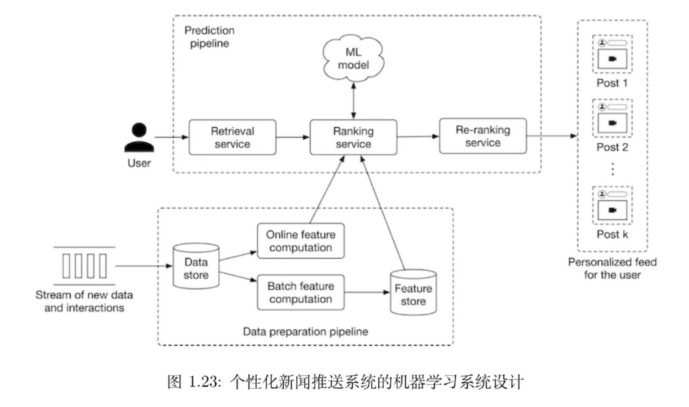

机器学习系统在部署到⽣产环境后可能失败的原因有很多。最常⻅的原因之⼀是数据分布变化。数据分布变化是指模型在⽣产环境中遇到的数据与训练时遇到的数据不同的情况。
现实世界中的数据分布不断变化。换句话说，随着时间的推移，训练时使⽤的数据可能会变得不再相关。这会导致模型陈旧，性能随时间下降。因此，我们应该持续监控系统以检测这⼀问题。应对数据分布变化的两种常⻅⽅法是：
- 使⽤⼤型数据集进⾏训练。⾜够⼤的训练数据集可以使模型学习到全⾯的分布，因此⽣产环境中遇到的任何数据点很可能来⾃这个学习到的分布。
- 定期使⽤新分布中的有标签数据重新训练模型。

机器学习系统中的监控技术分为两类：与操作相关的指标和机器学习特定的指标。
与操作相关的指标：这些指标确保系统正常运⾏。它们包括平均服务时间、吞吐量、预测请求数量、CPU/GPU 利⽤率等。
机器学习特定的指标：
- 监控输⼊/输出。模型的表现取决于它所接收的数据，因此监控模型的输⼊和输出⾄关重要。
- 漂移。监控系统的输⼊和模型的输出，以检测它们底层分布的变化。
- 模型准确性。例如，期望准确性在特定范围内。
- 模型版本。监控部署的是哪个版本的模型。

# Visual Search System 视觉搜索系统  
该系统帮助⽤户发现与所选图像在视觉上相似的图像。设计⼀个类似于 Pinterest的 视觉搜索系统  
该系统根据⽤户提供的查询图像检索相似的图像，并根据它们与查询图像的相似度进⾏排序，然后显示给⽤户。平台仅⽀持图像，不允许视频或⽂本查询。为简化起⻅，不需要个性化。  

### 选择正确的机器学习类别
模型的输出是⼀组与查询图像相似的排序图像。因此，视觉搜索系统可以被框定为⼀个排序问题。通常，排序问题的⽬标是根据与查询的相关性对⼀组项⽬（如图像、⽹站、产品等）进⾏排序，使得更相关的项⽬在搜索结果中排名更⾼。许多机器学习应⽤，如推荐系统、搜索引擎、⽂档检索和在线⼴告，都可以被框定为排序问题。这里将使⽤⼀种⼴泛使⽤的⽅法，称为表示学习。  

在表示学习中，模型被训练将输⼊数据（如图像）转换称为嵌⼈的表示。另⼀种描述⽅式是，模型将输⼊图像映射到称为嵌⼈空间的 N 维空间中的点。学习这些嵌⼈，使得相似的图像在空间中具有彼此接近的嵌⼊。下图展示了两个相似的图像如何被映射到嵌⼊空间中的两个接近的点。为演示起⻅，在⼀个⼆维空间中可视化图像嵌⼈（以 ’xxx’ 表示）。实际上，这个空间是 N 维的，其中 N 是嵌⼈向量的⼤⼩。  
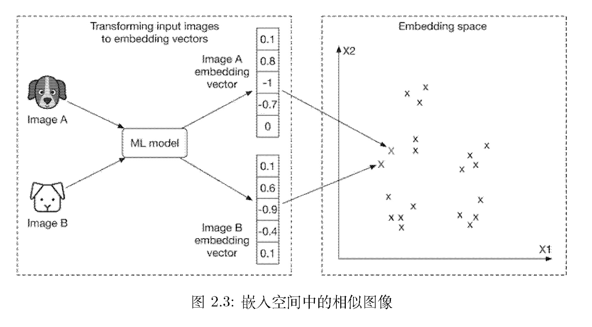  

如何使⽤表示学习对图像进⾏排序？  
⾸先，输⼊图像被转换嵌入向量。接下来，通过测量查询图像与平台上其他图像在嵌入空间中的距离来计算它们的相似度分数。图像根据相似度分数进行排序
   
## 数据准备
### 数据工程
除了通用的数据工程基础知识外，了解可用的数据也很重要。由于视觉搜索系统主要关注用户和图像，有以下可⽤数据：图像、⽤户、⽤户-图像交互  
图像创作者上传图像，系统存储这些图像及其元数据，如所有者ID、上下⽂信息（如上传时间）、标签等。用户⽤户数据包含与⽤户相关的⼈⼝统计属性，如年龄、性别等。⽤户-图像交互交互数据包含不同类型的⽤户交互。根据收集到的需求，主要的交互类型是展示和点击。  

### 特征⼯程
当使⽤了⼀个期望图像作输⼈的模型。图像在传递给模型之前需要进⾏预处理。来看⼀些常⻅的图像预处理操作：
- 调整⼤⼩：模型通常需要固定的图像尺⼨（例如，224×224）
- 缩放：将图像的像素值缩放到 0 和 1 的范围内
- Z-score 归⼀化：将像素值缩放为均值为 0，⽅差为 1
- 颜⾊致性：确保图像具有⼀致的颜⾊模式（例如，RGB 或 CMYK）

## 模型开发
### 模型选择
选择神经⽹络的原因是：
- 神经⽹络擅⻓处理⾮结构化数据，例如图像和⽂本。
- 与许多传统机器学习模型不同，神经⽹络能够⽣成在表示学习中所需的嵌⼈。

应该使⽤哪种神经⽹络架构？架构必须适⽤于图像。基于 CNN 的架构，如 ResNet，或者更新的基于 Transformer 的架构，如 ViT，在处理图像输⼈时表现良好。下图展示了⼀个将输⼈图像转换嵌⼊向量的简化模型架构。卷积层的数量、全连接层中的神经元数量以及嵌⼊向量的⼤⼩是通常通过实验选择的超参数。  
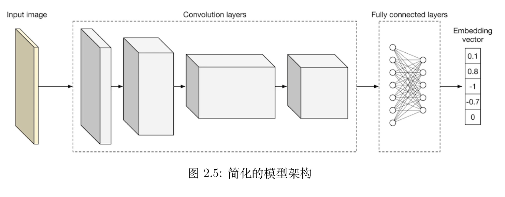  

### 模型训练
⼀种常⻅的学习图像表示的技术是对⽐训练。使⽤这种技术，训练模型以区分相似和不相似的图像。为模型提供⼀个查询图像，⼀个与查询图像相似的图像，以及⼀些不相似的图像。在训练过程中，模型学习⽣成的表示使得相似图像⽐其他图像更接近查询图像。要使⽤对⽐训练技术训练模型，⾸先需要构建训练数据。

### 构建数据集
如前所述，每个⽤于训练的数据点包含⼀个查询图像、⼀个与查询图像相似的正样本图像，以及 n-1 个与查询图像不相似的负样本图像。数据点的真实标签是正样本图像的索引。如下图所示，除了查询图像（q）之外，还有 n 个其他图像，其中⼀个与 q 相似（狗的图像），其他 n-1 个图像是不相似的。该数据点的真实标签是正样本图像的索引，即 2（下图中 n 个图像中的第⼆张图像）。  
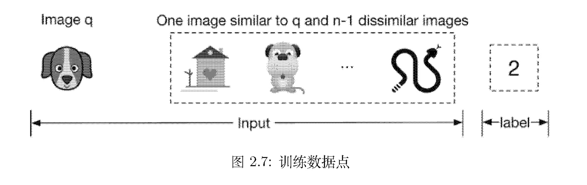  

为了构建⼀个训练数据点，随机选择个查询图像和 —1 个负样本图像。选择正样本图像时，有以下三种选择：
- 使⽤⼈⼯判断 - 这种⽅法依赖⼈⼯标注者⼿动查找相似图像。⼈⼯参与能够产⽣准确的训练数据，但使⽤⼈⼯标注成本⾼且耗时。
- 使⽤⽤户点击等交互数据作为相似性的代理 - 这种⽅法中，基于交互数据来衡量相似性。例如，当⽤户点击某个图像时，点击的图像被视⼒与查询图像 q 相似。这种⽅法不需要⼈⼯操作，可以⾃动⽣成训练数据。然⽽，点击信号通常噪声很⼤。⽤户有时即使在图像与查询图像不相似时也会点击。此外，这种数据⾮常稀疏，对于很多图像我们可能没有点击数据。使⽤噪声⼤且稀疏的训练数据会导致较差的性能。
- ⼈⼯⽣成与查询图像相似的图像，即⾃监督 - 这种⽅法中，⼈⼯⽣成⼀个与查询图像相似的图像。例如，可以通过旋转查询图像进⾏增强，并将新⽣成的图像作为相似图像。最近开发的框架，如 SimCLR 和 MoCo，采⽤了相同的⽅法。种⽅法的优势在于不需要⼈⼯操作。可以通过简单的数据增强逻辑来创建相似图像。此外，构建的训练数据没有噪声，因为增强图像总是与原始图像相似。这种⽅法的主要缺点是构建的训练数据与真实数据不同。在实际操作中，相似图像并不是查询图像的增强版本；它们在视觉和语义上相似，但去是不同的。

一旦构建了数据集，就可以使⽤合适的损失函数训练模型。  

### 选择损失函数
如下图所示，模型将图像作为输⼈，并为每个输⼊图像⽣成⼀个嵌⼈。Ex 表示图像 x 的嵌入。训练的⽬标是优化模型参数，使相似图像在嵌⼊空间中彼此靠近。如下图所示，正样本图像和查询图像在训练过程中应变得更加接近。为了实现这⼀⽬标，需要使⽤损失函数来衡量⽣成的嵌⼈的质量。不同的损失函数是为对⽐训练设计的，了解对⽐损失函数的⼯作原理是很重要的。  
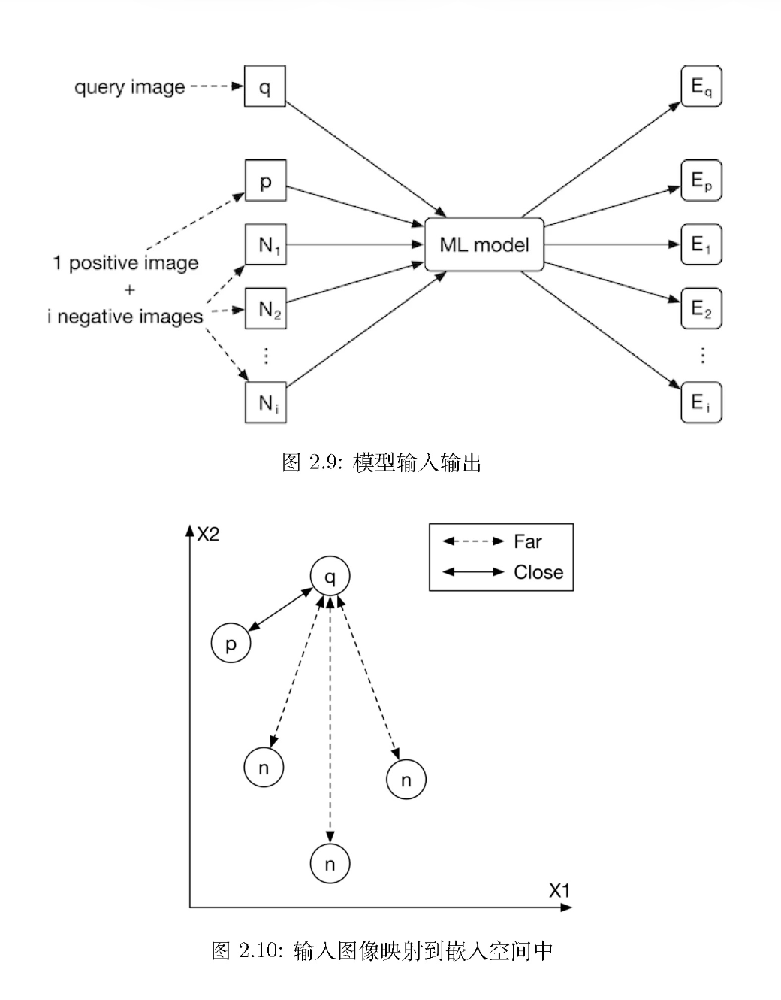  

- 计算相似度。⾸先，我们计算查询图像与其他图像嵌⼊之间的相似度。点积和余弦相似度⼴泛⽤于测量嵌⼈空间中点之间的相似度。欧⼏⾥得距离也可以⽤来测量相似度。然⽽，欧⼏⾥得距离在⾼维空间中通常表现较差，这是由于维度灾难的影响。
- Softmax。在计算的距离上应⽤ Softmax 函数。这确保了值的总和为 1，从⽽可以将这些值解释为概率。
- 交叉熵。交叉熵衡量预测概率与真实标签的接近程度。当预测概率接近真实标签时，说明嵌⼈⾜以区分正样本图像和负样本图像。
  
还可以讨论使⽤预训练模型的可能性。例如，可以利⽤⼀个预训练的对⽐模型，并使⽤训练数据对其进⾏微调。这些预训练模型已经在⼤型数据集上进⾏了训练，因此它们学到了良好的图像表示。与从头开始训练模型相⽐，这可以显著减少训练时间。

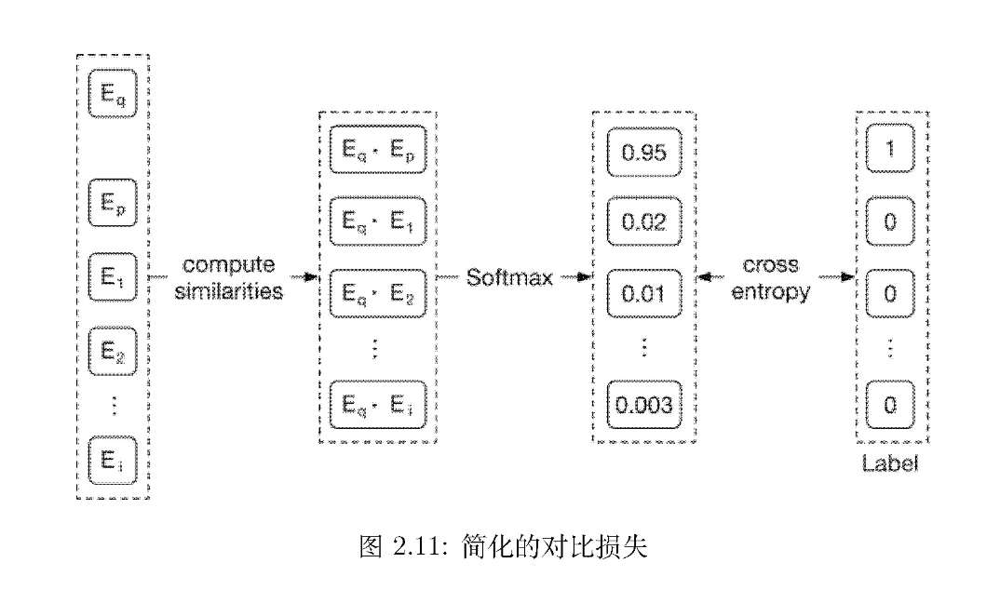  

## 评估
在开发完模型后，可以讨论评估。

### 离线指标
根据给定的需求，评估数据集可⽤于离线评估。假设每个数据点都有⼀个查询图像、⼀些候选图像，以及每个候选图像和查询图像对的相似度得分。相似度得分是⼀个介于 0 到 5 之间的整数，其中 0 表示没有相似性，5 表示两个图像在视觉上和语义上⾮常相似。对于评估数据集中的每个数据点，将模型⽣成的排序与基于真实得分的理想排序进⾏⽐较。  

来看看搜索系统中常⽤的离线指标。注意，搜索、信息检索和推荐系统通常共享相同的离线指标。
- 平均倒数排名（MRR）- 指标通过考虑模型⽣成的每个输出列表中第⼀个相关项的排名，并对它们进⾏平均来衡量模型的质量。公式为 `MRR = 1/N * ∑(1/rank_i)`，其中 N 是数据点的数量，rank_i 是第 i 个数据点中第⼀个相关项的排名。该指标的⼯作原理。对于每个排序列表，计算其倒数排名（RR），然后计算 RRs 的平均值以得到 MRR。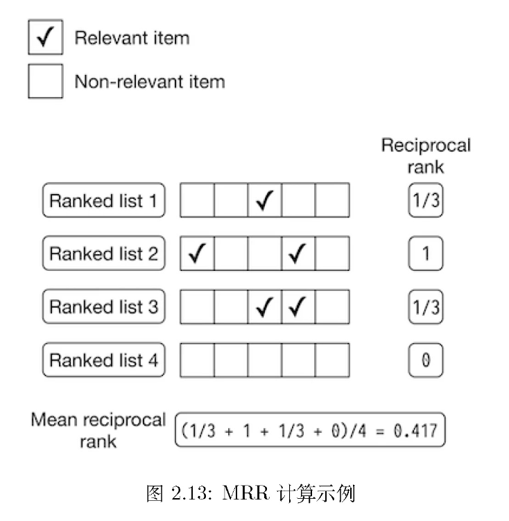指标的缺点 - 由于 MRR 只考虑第⼀个相关项，忽略了列表中的其他相关项，因此它⽆法衡量排序列表的精确度和排名质量。例如两个不同模型的输出。模型 1 的输出有 3 个相关项，⽽模型 2 的输出只有 1 个相关项。然⽽，这两个模型的倒数排名可以都是 0.5。*因此本系统不采纳该指标。*
  - 相关项（relevant item）即对当前查询/用户来说正确答案的那些 item，MRR 只关心一件事：第一个相关项排在第几名
- 召回率@k - 该指标衡量输出列表中相关项的数量与整个数据集中可⽤的相关项总数之间的⽐率。公式为 `Recall@k = (number of relevant items among the top k in output list) / (total number of relevant items)`。尽管召回率@k 衡量了模型未包含在输出列表中的相关项数量，但这并不总是⼀个好的指标。因为在某些系统（如搜索引擎）中，相关项的总数可能⾮常⾼。这会对召回率产⽣负⾯影响，因为分⺟⾮常⼤。例如，当查询图像是⼀张狗的图⽚时，数据库中可能包含数百万张狗的图⽚。*本次设计的系统的⽬标不是返回每⼀张狗的图⽚，⽽是检索⼏张最相似的狗图⽚，所以也不采纳该指标。*
- 准确率@k - 指标衡量输出列表中前k项中相关项的⽐例。公式为 `Precision@k = (number of relevant items among the top k in output list) / k`。这个指标衡量输出列表的精确度，但它不考虑排名质量。例如，两个模型的输出列表中前 k 项都包含 2 个相关项，但在模型 1 的输出列表中，这些相关项排在前面，而在模型 2 的输出列表中，这些相关项排在后面。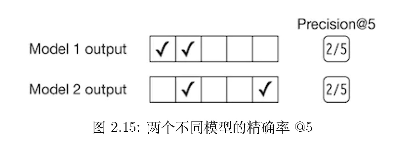*本系统的⽬标是返回与查询图像最相似的图像，因此关心相关项的排名质量，而不仅是相关项的数量，所以也不采纳该指标。*
- 平均准确率 mAP（Mean Average Precision）- 该指标⾸先计算每个输出列表的平均精确度（AP），然后对 AP 值进⾏平均。AP 接受⼀个包含 k 项（如图像）的列表，并在不同的⼈值下对精确度@k 进行平均。如果更多的相关项位于列表的顶部，AP 就会更⾼。对于⼤小为 k 的列表，AP 的公式为 `AP = (1/number of relevant items) * ∑(Precision@i if item i is relevant)`。由于对精确度进⾏了平均，因此考虑了列表的整体排名质量，然⽽，mAP 设计⽤于⼆元相关性，换句话说，当每个项要么相关要么不相关时，它表现良好。对于连续相关性得分，nDCG 是更好的选择。
- 归一化折损累积增益 nDCG（Normalized Discounted Cumulative Gain）- 该指标衡量输出列表的排名质量，并显示与理想排名相⽐排名的好坏。首先先理解 DCG
  - DCG 通过对列表中每个项的相关性得分进⾏累加来计算列表的累积增益。然后，得分从输出列表的顶部开始累加，并对较低排名的结果进⾏折扣。公式为 `DCG = ∑(relevance_i / log2(i + 1))`，
- 什么是 nDCG？由于 DCG 对项的相关性得分进⾏累加并对其位置进⾏折损，DCG 的结果可能是任意值。为了获得更有意义的得分，我们需要对 DCG 进行归一化。为此， nDCG 将 DCG 除以理想排名的 DCG。公式为 `nDCG = DCG / IDCG`，其中 IDCG 是理想排名的 DCG。nDCG 的值介于 0 和 1 之间，其中 1 表示输出列表与理想排名完全匹配。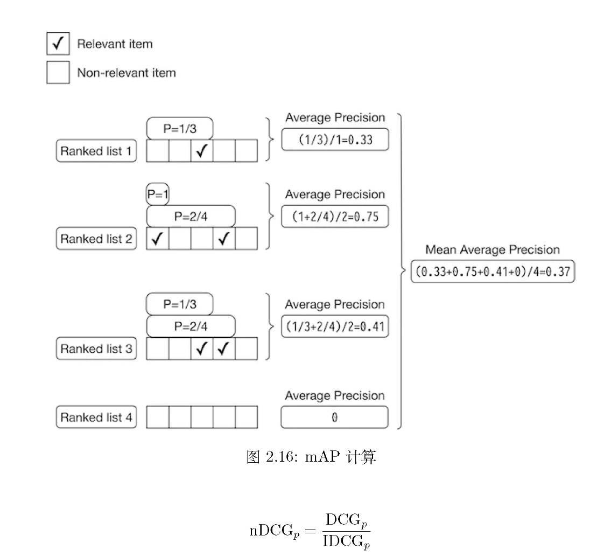。nDCG 在⼤多数情况下表现良好，其主要缺点是，获取真实相关性得分并不总是可能的。在本次案例中，由于评估数据集中包含相似性得分，可以使⽤ nDCG 来衡量模型在离线评估中的表现。通过 3 个步骤来计算 nDCG：
  1. 计算 DCG
  2. 计算 IDCG
  3. 将 DCG 除以 IDCG

### 在线指标
⼀些⽤于衡量⽤户多快能发现他们喜欢的图像的常⽤在线指标。
- 点击率（CTR）- 该指标显示⽤户点击显示项的频率。CTR 可以使⽤以下公式计算 `CTR = (number of clicked item) / (number of suggested item)`，其中点击数是⽤户点击显示项的次数，展示数是显示项被展示给⽤户的次数。CTR 衡量了系统吸引⽤户点击的能力，但它并不衡量⽤户是否喜欢他们点击的图像。较⾼的CTR表示⽤户经常点击显示的项。CTR 通常在搜索和推荐系统中⽤作在线指标
- 建议图像的⽇均、周均和⽉均花费时间 - 该指标显示⽤户对建议图像的参与度。当搜索系统准确时，期望此指标增加。

## 服务
在服务时，系统根据查询图像返回⼀个排序的相似图像列表。下图显示了预测 Pipeline 和索引 Pipeline。
  

### 预测 Pipeline
#### 嵌⼈⽣成服务
该服务计算输⼊查询图像的嵌⼈。如下图所示，它对图像进⾏预处理并使⽤训练好的模型来确定嵌⼊。
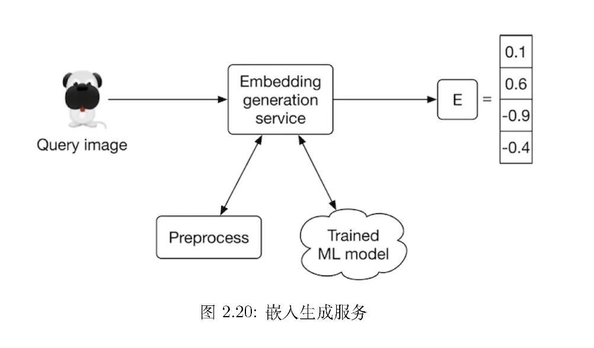  

#### 最近邻服务
⼀旦得到了查询图像的嵌⼈，就需要从嵌⼈空间中检索相似的图像。最近邻服务执⾏此操作。更正式地定义最近邻搜索：给定⼀个查询点 q 和⼀组其他点 S，它在集合 S 中找到最接近 q 的点。请注意，图像嵌⼈是 N 维空间中的⼀个点，其中 N 是嵌⼈向量的⼤⼩。

#### 重排序服务
该服务结合了业务层⾯的逻辑和策略。例如过滤不适当的结果，确保不包含私密图像，去除重复或近似重复的结果，并在向⽤户显示最终结果之前执⾏其他类似逻辑。

### 索引 Pipeline
索引服务平台上的所有图像都由该服务进⾏索引，以提⾼搜索性能。索引服务的另⼀个职责是保持索引表的更新。例如，当创作者向平台添加新图像时，该服务会对新
图像的嵌⼈进⾏索引，以便最近邻搜索能够找到它。  
索引会增加内存使⽤，因为在索引表中存储了所有图像的嵌⼈。有多种优化⽅法可⽤于减少内存使⽤，例如向量量化和产品量化。

### 最近邻（NN）算法的性能
最近邻搜索是信息检索、搜索和推荐系统的核⼼组件。其效率的微⼩改进会带来显著的整体性能提升。鉴于这⼀组件的重要性，最好深入探讨这个主题。  
NN 算法可以分两类：精确和近似。  

#### 精确最近邻
精确最近邻，也称为线性搜索，是 NN 的最简单形式。它通过搜索整个索引表，计算每个点与查询点 q 的距离，并检索最近的 k 个点。时间复杂度 O(N*D)，其中 N 是点的总数，D 是点的维度。在 N 可能轻松达到数⼗亿的⼤规模系统中，线性时间复杂度太慢。

#### 近似最近邻（ANN）
在许多应⽤中，展示⾜够相似的项给⽤户就⾜够了，没有必要执⾏精确的最近邻搜索。
在 ANN 算法中，使⽤特定的数据结构来将 NN 搜索的时间复杂度降低到次线性例如 O(D*logN)。它们通常需要前期的预处理或额外的空间。ANN 算法可以分为以下三类：
- 基于树的 ANN
- 基于局部敏感哈希（LSH）的 ANN
- 基于聚类的 ANN

每个类别中都有各种算法。  

**基于树的 ANN**  
基于树的算法通过将空间划分为多个部分来形成树。然后，它们利⽤树的特性进⾏更快的搜索。通过逐步向每个节点添加新标准来形成树。例如，根节点的⼀个标准可以是：`gender=male`。这意味着具有⼥性属性的点属于左⼦树。  

在树中，⾮叶节点根据标准将空间划分为两个部分。叶节点表示空间中的特定区域。下图显示了⼀个分为了个区域的空间示例。算法只搜索查询点所属的分区。典型的基于树的⽅法包括 R-树、Kd-树 和 Annoy（Approximate Nearest Neighbor Oh Yeah）  
  

**基于局部敏感哈希 LSH（Locality Sensitive Hashing）**  
LSH 使⽤特定的哈希函数来减少点的维度，并将它们分组到桶（bucket）中。这些哈希函数将彼此靠近的点映射到同⼀个桶中。LSH 仅搜索属于与查询点 q 同⼀个桶中的点。  
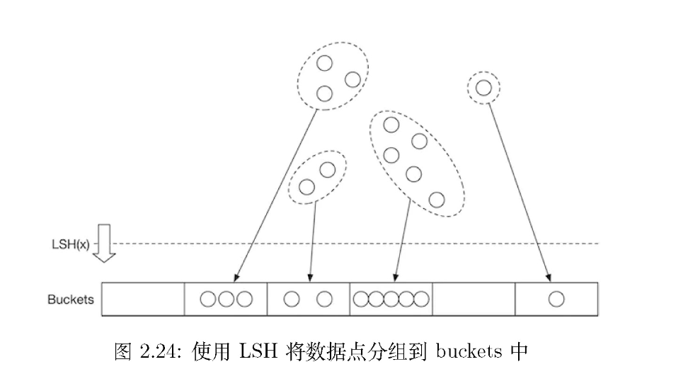  

**基于聚类的 ANN**  
这些算法通过根据相似性将点进⾏分组来形成聚类。⼀旦形成了聚类，算法只搜索查询点所属的聚类中的点⼦集。  

#### 应该使⽤哪种算法？
精确最近邻⽅法的结果保证是准确的。这使它成为当数据点有限或需要精确最近邻时的良好选择。然⽽，当点的数量很多时，运行该算法效率较低。在这种情况下，通常使⽤ ANN ⽅法。尽管它们可能不会返回精确的点，但它们在找到最近的点时更⾼效。  
鉴于当前系统中可⽤的数据量，ANN ⽅法是更务实的解决⽅案。在视觉搜索系统中，使⽤ ANN 来查找相似的图像嵌⼈。  
对于应⽤型机器学习⻆色，可能会要求实现 ANN。两个⼴泛使⽤的库是 Faiss（由 Meta 开发）和 ScaNN（由 Google 开发）。每个库都⽀持本章中描述的⼤多数⽅法。建议熟悉⾄少其中一个库，以便更好地理解这些概念，并在机器学习编程⾯试中有信⼼实现最近邻搜索。  

## 进阶要点
- 通过识别和阻⽌不适当的图像来调节系统中的内容。
- 系统中存在不同的偏差，例如位置偏差。
- 如何使⽤标签等图像元数据来改进搜索结果。下一章 Google 街景模糊系统介绍了这⼀点。
- 使⽤对象检测进⾏智能裁剪。
- 如何使⽤图形神经⽹络学习更好的表示。
- ⽀持通过⽂本查询搜索图像的能⼒。第 4 章中对此进⾏研究。
- 如何使⽤主动学习或⼈机交互 ML 更有效地注释数据。

#  Google Street View Blurring System 街景模糊系统
⼀个⾃动模糊⼈脸和⻋牌的系统，以保护⽤户隐私。  
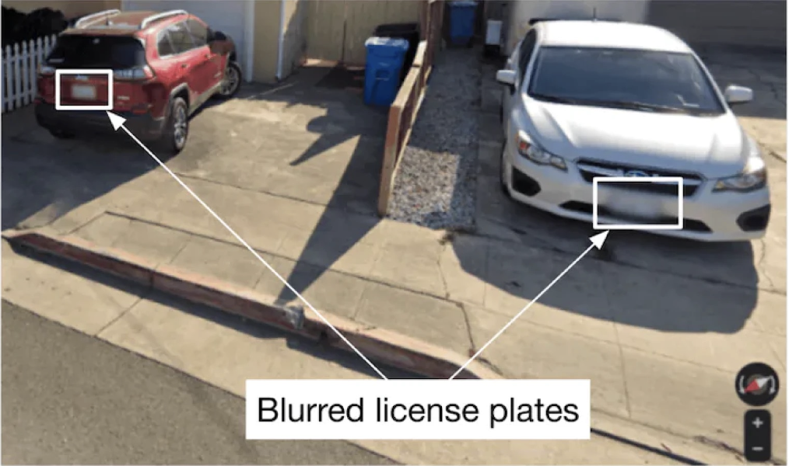  

## 将问题框定为⼀个机器学习任务
### 定义机器学习⽬标
该系统的业务⽬标是通过模糊街景图像中可⻅的⻋牌和⼈脸来保护⽤户隐私。但保护⽤户隐私并不是⼀个机器学习⽬标，因此需要将其转化机器学习系统可以解决的⽬标。  
⼀个可能的机器学习⽬标是准确地检测图像中的感兴趣对象。如果机器学习系统能够准确地检测到这些对象，那么就可以在向⽤户展示图像之前对这些对象进⾏模糊处理。  
后面会使⽤对象代替⼈脸和⻋牌。  

### 指定系统的输⼊和输出
对象检测模型的输⼊是⼀张包含零个或多个位于不同位置的对象的图像。模型检测这些对象并输出它们的位置。下图显示了⼀个对象检测系统及其输⼊和输出
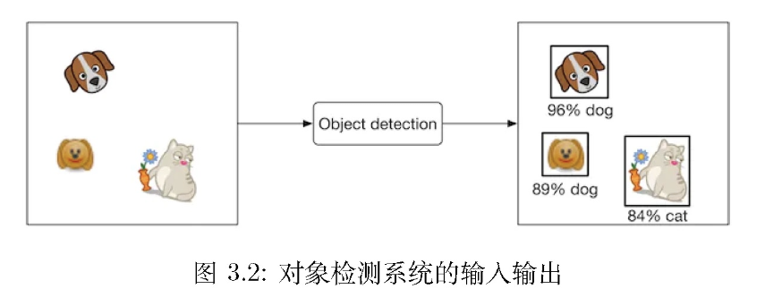  

### 选择正确的机器学习类别
⼀般来说，对象检测系统有 2 个职责：
- 预测图像中每个对象的位置
- 预测每个边界框的类别（例如，狗、猫等）

第⼀个任务是⼀个回归问题，因为位置可以⽤（x, y）坐标表示，这些是数值值。第⼆个任务可以框定为⼀个多分类问题。  
传统上，对象检测架构分为单阶段⽹络和双阶段⽹络。最近，基于 Transformer 的架构如 DETR 显示出了良好的效果，但在本系统中主要探讨双阶段和单阶段架构。

### 双阶段⽹络 Two-stagenetworks
顾名思义，双阶段⽹络中使⽤了两个独⽴的模型：
1. 区域建议⽹络 RPN（Region proposal network）：扫描图像并提出可能是对象的候选区域。
2. 分类器：处理每个建议区域并将其分类为⼀个对象类别。

下图显示了这两个阶段  
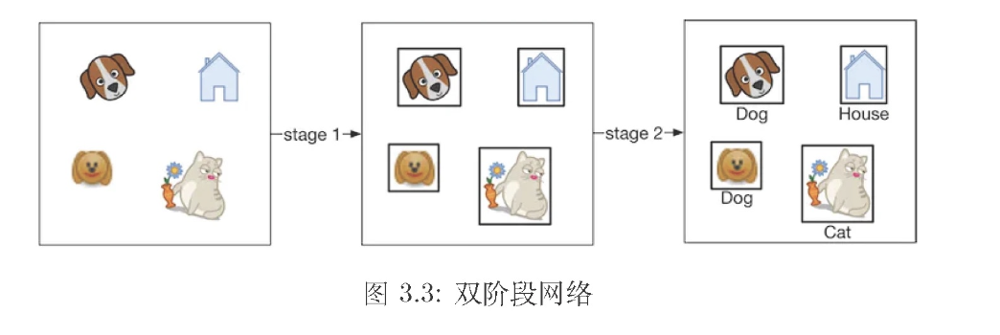  

常⽤的双阶段⽹络包括：R-CNN、FastR-CNN 和 FasterR-CNN。

### 单阶段⽹络 One-stagenetworks
在这些⽹络中，两个阶段被合并。使⽤⼀个单⼀⽹络，同时⽣成边界框和对象类别，⽽不需要显式的区域建议检测。  
常⽤的单阶段⽹络包括：YOLO 和 SSD 架构。  

**单阶段 vs 双阶段**  
双阶段⽹络包含两个顺序运行的组件，因此通常速度较慢，但更准确。  
在本案例中，数据集包含 100 万张图像，这在现代标准下并不算⼤。这表明使⽤双阶段⽹络不会显著增加训练成本。因此，在本次从双阶段⽹络开始。当训练数据增加或需要更快地进行预测时，可以切换到单阶段⽹络。  

## 数据准备
### 数据⼯程
对于本系统，有以下数据可⽤：
- 标注数据集
- 街景图像

#### 标注数据集
根据需求，有 100 万张标注图像。每张图像都有⼀个边界框列表和相关的对象类别。下表显示了数据集中的⼀些数据点：
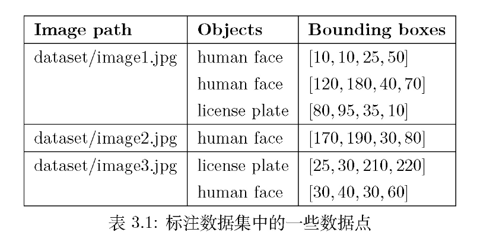  
每个边界框是由 4 个数字组成的列表：左上⻆ X 和 Y 坐标，以及对象的宽度和⾼度。  

#### 街景图像
这些是数据采集团队收集的街景图像。ML 系统处理这些图像以检测⼈脸和⻋牌。下表显示了图像的元数据。
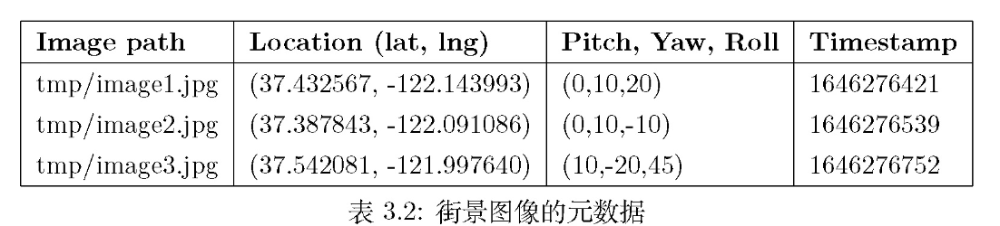  

### 特征⼯程
在特征⼯程中，⾸先应⽤标准的预处理操作，如调整⼤小和归⼀化。之后，通过数据增强技术增加数据集的⼤小。  
数据增强数据增强是⼀种通过对原始数据进⾏轻微修改来添加副本，或从原始数据中⼈工创建新数据的技术。随着数据集⼤小的增加，模型能够学习到更复杂的模式。当数据集不平衡时，该技术特别有⽤，因为它可以增加少数类的数据点数量。  
⼀种特殊的数据增强类型是图像增强。常⽤的增强技术包括：
- 随机裁剪
- 随机饱和度
- 垂直或⽔平翻转
- 旋转和/或平移
- 仿射变换
- 改变亮度、饱和度或对⽐度

下图展示了应⽤了各种数据增强技术的图像。
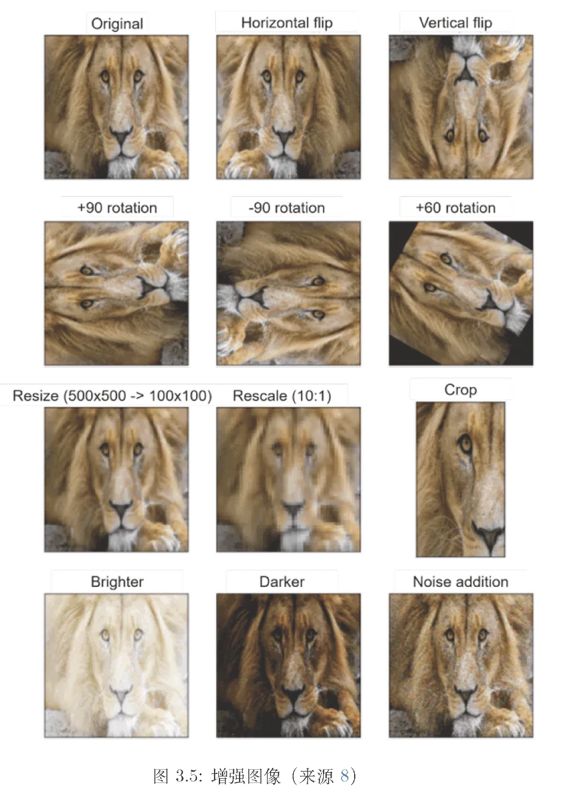  

需要注意的是，对于某些类型的增强，真实边界框也需要进⾏相应的变换。例如，当旋转或翻转原始图像时，真实边界框也必须进⾏变换。数据增强可以以离线或在线形式使⽤。
- 离线：在训练之前增强图像
- 在线：在训练过程中实时增强图像

**在线 vs 离线**：在离线数据增强中，训练速度较快，因为不需要额外的增强操作。然⽽，它需要额外的存储空间来存储所有增强后的图像。虽然在线数据增强会减慢训练速度，但不会消耗额外的存储空间。  
在在线和离线数据增强之间的选择取决于存储和计算能⼒的限制。更重要的是，需要谈论不同的选择并讨论权衡。在本案例中，进⾏离线数据增强。  
下图显示了数据集准备流程。通过预处理，图像被调整⼤⼩、缩放和归⼀化。通过图像增强，图像数量会增加。假设数量从 100 万增加到 1000 万。  
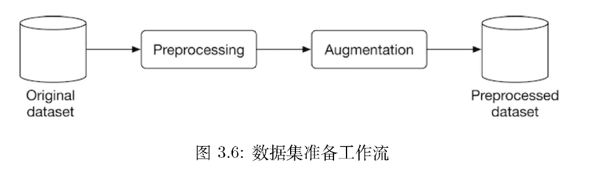

## 模型开发
### 模型选择
前面选择了双阶段⽹络，下面检查每个组件。  
#### 卷积层
卷积层处理输⼈图像并输出特征图。
#### 区域建议⽹络（RPN）
RPN 提出可能包含对象的候选区域。它使⽤神经⽹络作其架构，并将卷积层⽣成的特征图作为输入，输出图像中的候选区域。
#### 分类器
分类器确定每个候选区域的对象类别。它将特征图和建议的候选区域作为输⼊，并⼀个对象类别。该分类器通常基于神经⽹络。

### 模型训练
训练神经⽹络的过程通常包括三个步骤：前向传播、损失计算和反向传播。
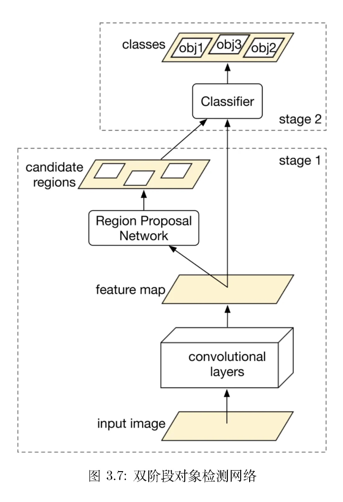  

对象检测模型需要很好地执⾏ 2 项任务。⾸先，预测的对象边界框应该与真实边界框⾼度重合。这是⼀个回归任务。其次，每个对象类别的预测概率应该准确。这是⼀个分类任务。现在为每个任务定义⼀个损失函数。
- 回归损失：该损失度量预测的边界框与真实边界框的对⻬程度。使⽤标准回归损失函数，如均⽅误差（MSE），并将其表示为 Lreg
- 分类损失：这衡量每个检测到的对象的预测概率的准确性。这⾥，使⽤标准分类损失，如对数损失（交叉熵），并将其表示为 Lcls

为了定义⼀个衡量模型整体性能的最终损失，将分类损失和回归损失按⼀个平衡参数⼊组合：`L = Lcls + λLreg`

## 评估
⼀个对象检測模型通常需要检测图像中的 N 个不同的对象。了衡量模型的整体性能，分别评估每个对象的检测结果，然后对结果进⾏平均。  
下图显示了⼀个对象检测模型的输出。图中展示了检测到的边界框和实际的边界框。模型检测到了 6 个边界框，⽽实际上只有 2 个⽬标实例。  
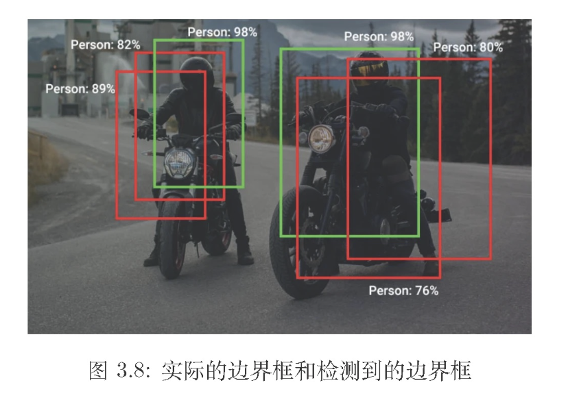  

什么时候预测的边界框被认为是正确的？回答这个问题，需要了解交并比 IOU（Intersection Over Union）的定义。  
交并比：衡量两个边界框的重叠程度。下图显示了 IOU 的可视化表示。  
  
IOU ⽤来确定检测到的边界框是否正确。IOU 为 1 时是理想的，表示检测到的边界框和实际边界框完全重合。在实践中，IOU 为 1 的情况很少⻅。IOU 越⾼，表示预测的边界框越准确。通常会使⽤ IOU 阈值来决定检测到的边界框是正确（真阳性）还是错误（假阳性）。例如，IOU 阈值 0.7 时，任何与实际边界框有 0.7 或更⾼重叠度的检测结果都被认为是正确的检测。  

### 离线指标
模型开发是⼀个迭代过程。我们使⽤离线指标来快速评估新开发的模型性能。以下是⼀些可能对对象检测系统有⽤的指标：
- 精确率
- 平均精度（AP）
- 平均平均精度（mAP）

精确率这是所有图像中所有检测中正确检测的⽐例。较⾼的精确率表明系统的检测结果更加可靠。
`Precision = Correctdetections / Totaldetections`  
为了计算精确率，需要选择⼀个 IOU 阈值。下图显示了⼀组实际的边界框和检测到的边界框以及它们各⾃的 IOU 值。
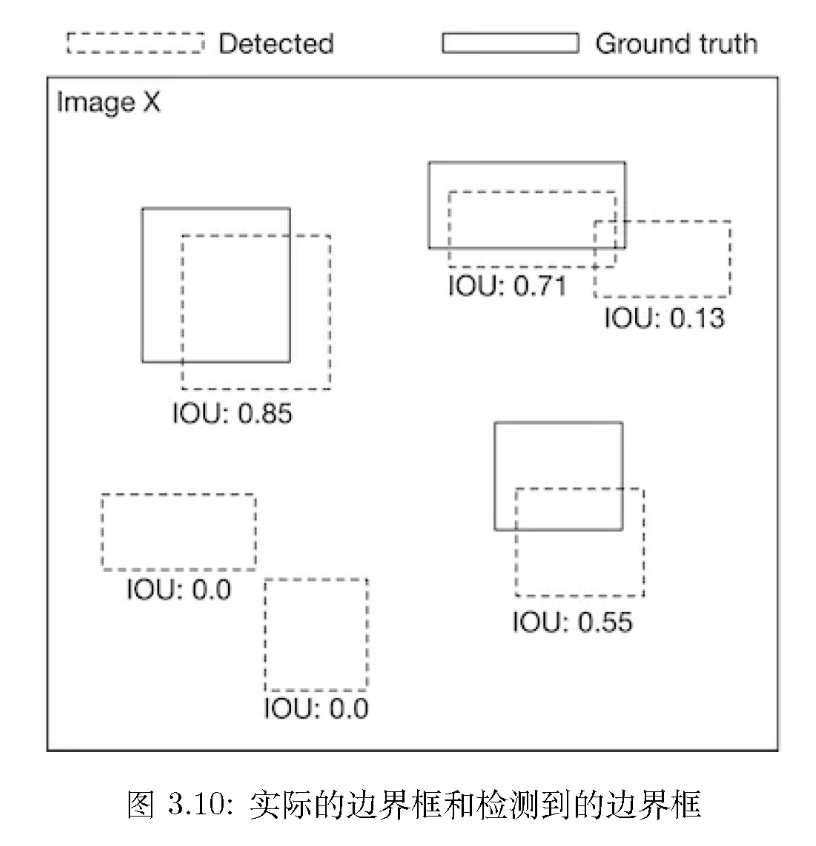
计算三个不同 IOU 阈值下的精确率：0.7、0.5 和 0.1。  
IOU 阈值 = 0.7：在 6 个检测结果中，有 2 个的 IOU ⾼于 0.7。因此在此阈值下有 2 个正确预测
IOU 阈值 = 0.5：在此阈值下，有 3 个检测结果的 IOU ⾼于 0.5
IOU 阈值 = 0.1：这次有 4 个正确的检测

注意到，精确率的主要缺点是它随着不同的 IOU 阈值⽽变化。因此，仅通过查看特定 IOU 阈值下的精确率很难了解模型的整体性能。平均精度 AP（Average Precision）解决了这⼀限制。
平均精度 AP（Average Precision）：该指标在各种 IOU 阈值下计算精确率并取其平均值。AP 的公式为 `AP = 1/N * ΣP(r)`，其中 P(r) 是 IOU 阈值为 r 时的精确率，N 是不同的 IOU 阈值的总数。  
AP 汇总了模型在特定对象类别（例如⼈脸）上的整体精确率。为了衡量模型在所有对象类别（例如⼈脸和⻋牌）上的整体精确率，需要使⽤平均平均精度 mAP（Mean Average Precision）。  

平均平均精度 mAP（Mean Average Precision）是 AP 在所有对象类别上的平均值。该指标总结了模型的整体性能。公式为 `mAP = 1/M * ΣAP(c)`，其中 M 是对象类别的总数，AP(c) 是类别 c 的平均精度。mAP 指标常⽤于评估对象检测系统。  

### 在线指标
根据需求，系统需要保护个⼈隐私。评估这⼀点的⼀个⽅法是统计⽤户举报和投诉的数量。还可以依赖⼈⼯标注员来抽查错误模糊的图像百分⽐。其他衡量偏差和公平性的指标也很重要。例如，希望在⼈脸模糊中对不同种族和年龄组同样准确地进⾏处理。但如需求中所述，衡量偏差超出了本⽂的讨论范围。

## 服务
对象检测系统中可能出现的⼀个常⻅问题：重叠的边界框。

### 重叠的边界框
在图像上运⾏对象检测算法时，边界框重叠是⾮常常⻅的情况。这是因为 RPN ⽹络会在每个对象周围提出多个⾼度重叠的边界框。在推理过程中，将这些边界框精简每个对象的单个边界框⾮常重要。  
⼀种⼴泛使⽤的解决⽅案是称为⾮极⼤值抑制 NMS（Non-maximum suppression）的算法。NMS 是⼀种后处理算法，旨在选择最合适的边界框。它保留置信度较⾼的边界框，并移除重叠的边界框。
  

### ML 系统设计
[Ref](https://bytebytego.com/guides/how-do-googleapple-maps-blur-license-plates-and-human-faces-on-street-view/)  

* 批量预测 Pipeline - 根据收集的需求，延迟不是⼀个⼤问题，因为可以在处理新图像时向⽤户展示现有的图像。由于不需要即时结果，可以利⽤批量预测预先计算对象检测结果。请注意，预处理和模糊化服务在设计中是分开的。原因是预处理图像往往是⼀个 CPU 密集型过程，⽽模糊化服务则依赖于 GPU。将这些服务分开有两个好处：根据每个服务接收到的⼯作负载独⽴扩展服务；更好地利⽤ CPU 和 GPU 资源。
  * 预处理。原始图像通过该组件进⾏预处理。已经在特征⼯程部分讨论过。
  * 模糊化服务。该服务对 Street View 图像执⾏以下操作：
    1. 提供图像中检测到的对象列表。
    2. 使⽤ NMS 组件优化检测到的对象列表。
    3. 对检测到的对象进⾏模糊处理。
    4. 将模糊处理后的图像存储在对象存储中（模糊处理的 Street View 图像）。
* 数据 Pipeline - 负责处理⽤户报告，⽣成新的训练数据，并准备供模型使⽤的训练数据。数据 Pipeline 的组件⼤多是⾃解释的。困难负样本挖掘是唯⼀需要更多解释的组件。
  * 困难负样本挖掘 - 是从错误预测的示例中专⻔创建的负样本，并添加到训练数据集中。当在更新的训练数据集上重新训练模型时，模型应该表现得更好。

  
  
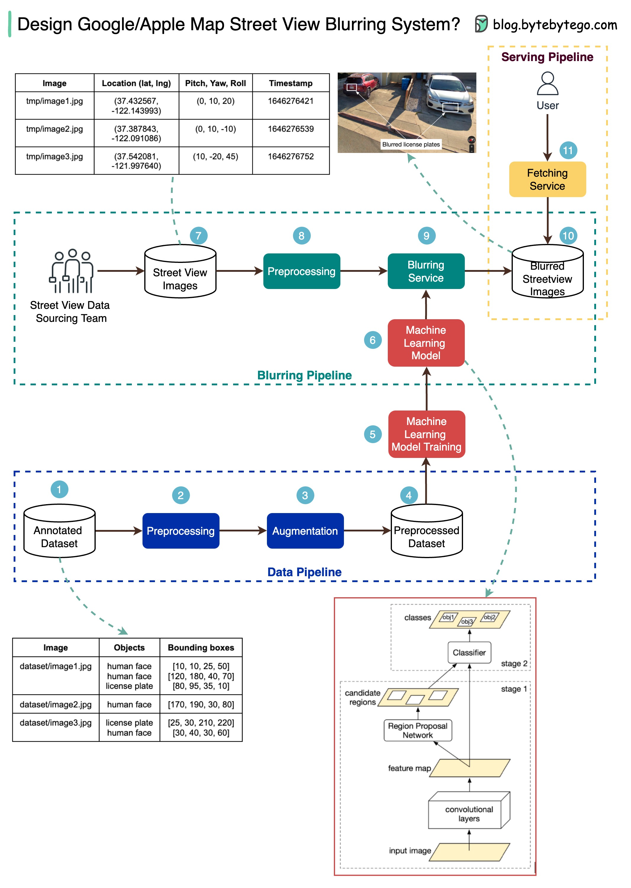  

## 进阶
- Transformer-based 对象检测架构与单阶段或双阶段模型有何不同，以及它们的优缺点。
- 提⾼在⼤规模数据集上对象检测的分布式训练技术。
- 欧洲的《通⽤数据保护条例（GDPR）》可能如何影响系统。
- 评估⾯部检测系统中的偏差。
- 如何持续微调模型。
- 如何使⽤主动学习或⼈机协作学习来选择训练的数据点。

# YouTube Video Search 视频搜索
在 YouTube 等视频共享平台上，视频数量可以迅速增⻓到数⼗亿级别。设计⼀个视频搜索系统，能够⾼效地处理如此⼤量的内容。如图所示，⽤户在搜索框中输⼊⽂本，系统展示与该⽂本最相关的视频。  

## 框定为 ML 任务
### 定义 ML ⽬标
⽤户期望搜索系统提供相关且有⽤的结果。将其转化为 ML ⽬标的⼀种⽅法是根据视频与⽂本查询的相关性对视频进⾏排名。  

### 指定系统的输⼊和输出
如图所示，搜索系统以⽂本查询为输⼊，并输出按与⽂本查询相关性排序的视频列表。
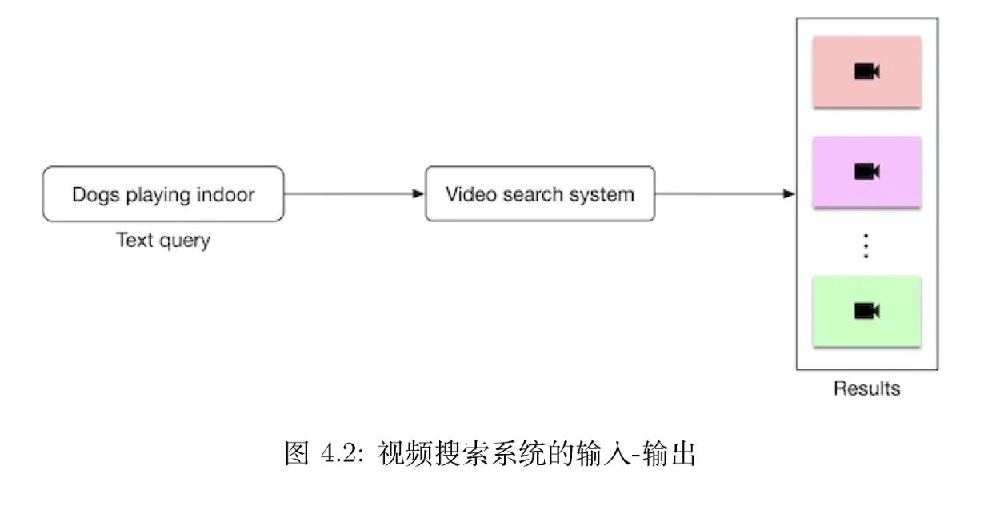 

### 选择合适的 ML 分类
为了确定视频与⽂本查询之间的相关性，这里利⽤视频的视觉内容和⽂本数据。  

**视觉搜索**该组件接受⽂本查询作为输⼊，并输出视频列表。这些视频根据⽂本查询与其视觉内容之间的相似性进⾏排名。表征学习是⼀种常⽤于通过处理视频视觉内容进⾏搜索的⽅法。在该⽅法中，⽂本查询和视频分别使⽤两个编码器进⾏编码。如图所示，ML 模型包含⼀个视频编码器，⽤于从视频⽣成嵌⼊向量，以及⼀个⽂本编码器，⽤于从⽂本⽣成嵌入向量。通过计算视频与⽂本表示的点积来计算相似度得分。  

  

为了对与⽂本查询在视觉和语义上相似的视频进⾏排序，在嵌⼊空间中计算⽂本与每个视频之间的点积，然后根据相似度得分对视频进⾏排名。

**⽂本搜索** 图展示了当⽤户输⼊⽂本查询 “dogsplayingindoor” 时，⽂本搜索的⼯作原理。标题、描述或标签与⽂本查询最相似的视频会显示为输出。倒排索引是⼀种⽤于创建基于⽂本的搜索组件的常⽤技术，允许在数据库中进⾏⾼效的全⽂搜索。由于倒排索引不是基于机器学习的，因此没有训练成本。许多搜索引擎公司经常使⽤的⼀个流⾏搜索引擎是 Elasticsearch，这是⼀种可扩展的搜索引擎和⽂档存储库。  

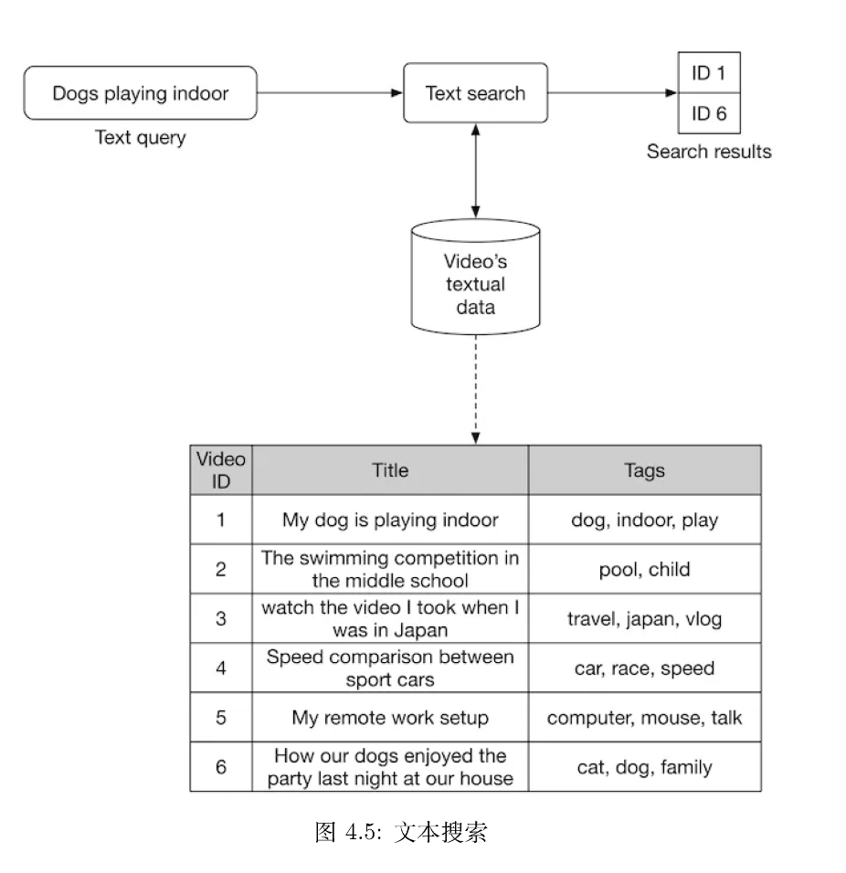  

## 数据准备
### 数据⼯程
由于已经获得了⼀个带注释的数据集来训练和评估模型，因此不需要进⾏数据⼯程处理。下表显示了带注释的数据集的示例。  
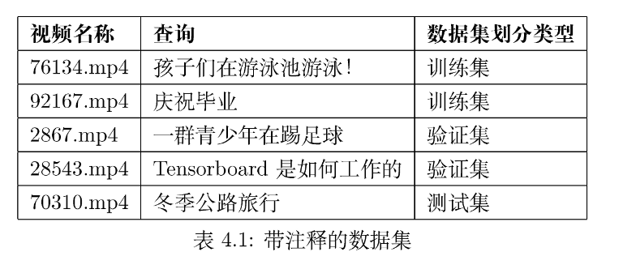  

### 特征⼯程
⼏乎所有的机器学习算法只接受数值输⼊。因此，诸如⽂本和视频等⾮结构化数据需要在此步骤中转换为数值表示。来看看如何为模型准备⽂本和视频数据。  

⽂本数据准备如下图所示，⽂本通常通过三个步骤转换数值向量：⽂本归⼀化、标记化和将标记转换为 ID。
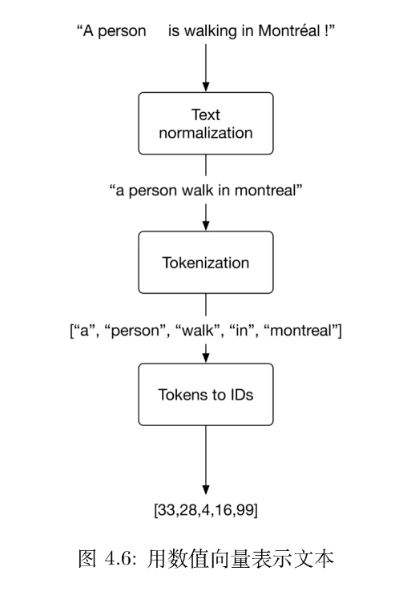  

- 文本归⼀化 - 确保单词和句⼦的⼀致性。例如，同⼀个单词可能有略微不同的拼写形式，如 ”dog”、”dogs” 和 ”DOG!” 都指的是同⼀事物，但拼写不同。句⼦也是如此。以下是⼀些常⻅的⽂本归⼀化⽅法：
  - 转换⼩写：将所有字⺟转换⼩写，因为这不会改变单词或句⼦的含义
  - 移除标点符号：移除⽂本中的标点符号。常⻅的标点符号包括句号、逗号、问号、感叹号等
  - 去除空格：去除前后多余空格
  - 正规化形式 KD（NFKD）：将组合字符分解为更简单的字符组合
  - 去除重⾳符号：从单词中移除重⾳符号。例如：Malaga-Malaga、Noel-Noel
  - 词形还原与词⼲提取：识别⼀组相关词形的标准代表。例如：walking、walks、walked-walk
- 标记化 - 是将⽂本拆分为更⼩的单元（称为标记）的过程。通常有三种类型的标记化：
  - 单词标记化：根据特定的分隔符将⽂本拆分为单个单词。例如，短语 "I have an interview tomorrow" 会被拆分为 "I" "have" "an" "interview" "tomorrow"
  - 子词标记化：将⽂本拆分为⼦词（或 n-gram 字符）
  - 字符标记化：将⽂本拆分字符集
- 将标记转换为 ID - ⼀旦获得了标记，就需耍将它们转换为数值（ID）。可以通过两种⽅式表示标记的数值：
  - 查找表：在这种⽅法中，每个唯⼀的标记都映射到⼀个 ID。接着，创建⼀个查找表来存储这些 1:1 映射。
  - 哈希：也称为“特征哈希”或“哈希技巧”，是⼀种节省内存的⽅法，它使⽤哈希函数获取 ID，⽽⽆需保留查找表。

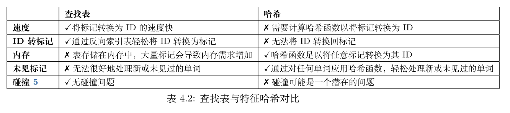  

**视频数据准备** 下图展示了处理原始视频的典型⼯作流程。  
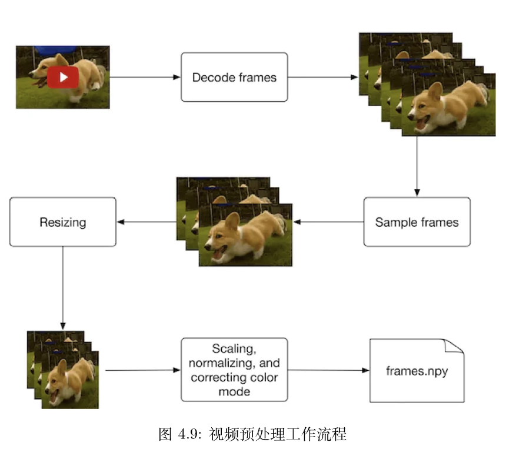  

## 模型开发
### 模型选择
⽂本查询通过⽂本编码器转换嵌⼊，视频则通过视频编码器转换为嵌⼊。以下讨论每个编码器可能的模型架构。  
⽂本编码器将⽂本转换为向量表示。例如，如果两个句⼦的含义相似，它们的嵌⼊也会更相似。要构建⽂本编码器，有两⼤类⽅法可供选择：统计⽅法和基于机器学习的⽅法。  

### 统计⽅法
这些⽅法依赖统计数据将句⼦转换为特征向量。两种流⾏的统计⽅法是：
- 词袋模型 BoW（Bagof Words）- 该⽅法将⼀个句⼦转换为固定⻓度的向量。它通过创建⼀个矩阵来表示句⼦中的单词出现情况，其中⾏表示句⼦，列表示单词索引。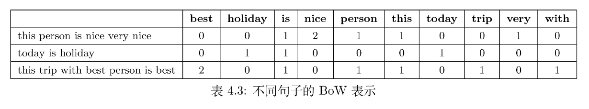。BoW 是⼀种计算句⼦表示速度较快的⽅法，但它有以下局限性：
  - 它不考虑句⼦中单词的顺序。例如，“Let's watch TV after work” 和 “let's work after watch TV” 会有相同的 BoW 表示。
  - 获得的表示⽆法捕捉句⼦的语义和上下⽂含义。例如，具有相同含义但使⽤不同单词的两个句⼦，其表示完全不同。
  - 表示向量是稀疏的。表示向量的⼤⼩等于拥有的唯⼀标记总数。这个数字通常⾮常⼤，因此每个句⼦表示主要由零填充。
- 词频-逆⽂档频率 TF-IDF（Term Frequency - Inverse Document Frequency）- 这是⼀个反映单词在⽂档集合或语料库中的重要性的数值统计。TF-IDF 创建了与 BoW 相同的句⼦ - 单词矩阵，但它根据单词的频率对矩阵进⾏归⼀化。由于 TF-IDF 对频繁出现的单词赋⼦较低权重，因此它的表示通常⽐ BoW 更好。然⽽，它也有以下局限性：
  - 当添加新句⼦时，需要重新计算词频进⾏归⼀化。
  - 它不考虑句⼦中单词的顺序。
  - 获得的表示⽆法捕捉句⼦的语义含义。
  - 表示是稀疏的。

总的来说，统计⽅法通常较快。然⽽，它们⽆法捕捉句⼦的上下⽂含义，并且表示是稀疏的。基于机器学习的⽅法解决了这些问题。  

### 基于机器学习的⽅法
在这些⽅法中，机器学习模型将句⼦转换为有意义的单词嵌⼈，以使两个嵌⼊之间的距离反映相应单词的语义相似性。例如，如果两个单词（如 “rich” 和 “wealth”）在语义上相似，它们的嵌⼈在嵌入空间中就会很接近。下图显示了 2D 嵌入空间中单词嵌入的简单可视化，相似的单词被分组在⼀起。 有三种常⻅的基于机器学习的⽅法可以将⽂本转换为嵌⼊：
- 嵌⼊（查找）层 - 使⽤嵌⼊层将每个 ID 映射到⼀个嵌⼊向量，它是将稀疏特征（如 ID）转换固定⼤⼩嵌⼊的⼀种简单有效的解决⽅案。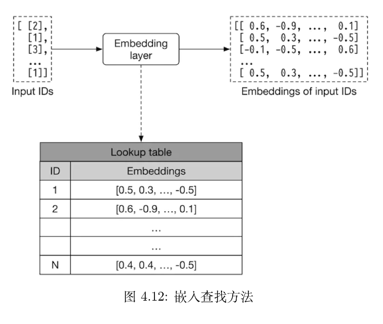
- Word2vec - 是⼀系列⽤于⽣成单词嵌⼊的相关模型。这些模型使⽤浅层神经⽹络架构，并利⽤单词在局部上下⽂中的共现来学习单词嵌⼊。特别是，该模型在训练阶段学习从上下⽂词中预测中⼼词。在训练阶段之后，该模型能够将单词转换为有意义的嵌⼊。基于 word2vec 的主要模型有两个：连续词袋模型（CBOW）和 Skip-gram。下图显示了 CBOW 的⾼级⼯作原理。 尽管 word2vec 和嵌⼈层⽅法简单有效，但最近基于 Transformer 的架构表现出了很好的效果。
- 基于 Transformer 的架构 - 这些模型在将单词转换为嵌⼊时，会考虑句⼦中的单词上下⽂。与 word2vec 模型不同，它们根据上下⽂为相同的单词⽣成不同的嵌入。Transformers 在理解上下⽂和⽣成有意义的嵌⼊⽅面⾮常强⼤。BERT、GPT3 和 BLOOM 等模型展示了 Transformers 在执⾏各种⾃然语⾔处理任务中的潜⼒。在本案例中，选择 BERT 作为⽂本编码器。

### 视频编码器
有 2 种编码视频的架构选择：
- 视频级模型 - 视频级模型处理整个视频以创建嵌⼊，如图所示。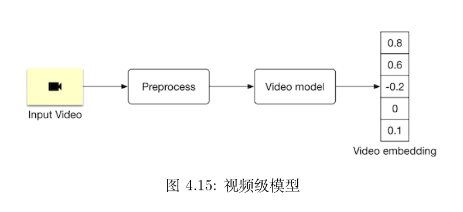 该模型架构通常基于 3D 卷积或 Transformers。由于模型处理的是整个视频，因此计算量⼤。
- 帧级模型 - 帧级模型的⼯作⽅式不同。可以通过三步将视频分解为帧级模型并提取嵌⼈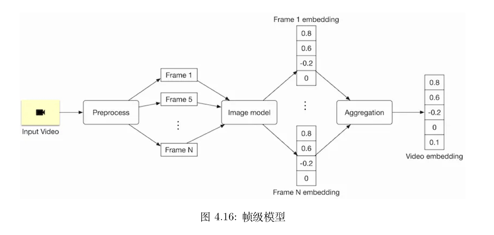
  - 对视频进⾏预处理并对其进⾏帧采样。
  - 使⽤模型对采样帧运⾏，以⽣成帧嵌⼊。
  - 聚合（例如，求平均值）帧嵌⼊以⽣成视频嵌⼈。

由于此模型在帧级⼯作，因此通常更快且计算成本较低。然⽽，帧级模型通常⽆法理解视频的时间⽅⾯，如动作和运动。在实践中，帧级模型在视频的时间理解不太重要的情况下更受欢迎。在本系统采⽤帧级模型（如 ViT），原因是：提⾼训练和推理速度、减少计算量。  

### 模型训练
为了训练⽂本编码器和视频编码器，使⽤对⽐学习⽅法。  
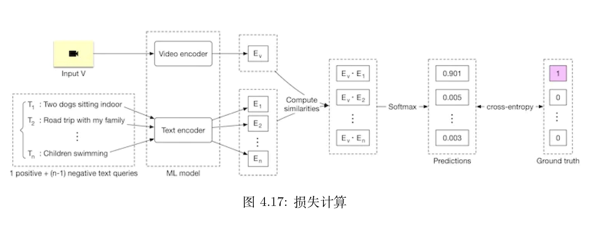  

## 评估
### 离线指标
以下是搜索系统中常⽤的⼀些离线指标。  
- Precision@k 和 mAP，公式 `precision@k = number of relevant items among the top k items in the ranked list / k`。在评估数据集中，给定的⽂本查询只关联⼀个视频。这意味着 precision@k 公式的分⼦最多为 1。这导致 precision@k 的值较低。例如，对于给定的⽂本查询，即使将其关联的视频排名在列表顶部，precision@10 也只有 0.1。由于这⼀局限性，precision 类指标（如 precision@k 和 mAP）并不⼗分有⽤。
- Recall@k 这衡量搜索结果中相关视频数量与总相关视频数量之间的⽐率。公式 `recall@k = Number of relevant videos among the top k videos / Total number of relevant videos`。如前所述，总相关视频数始终为 1。因此可以将 recall@k 公式转换为以下内容：如果相关视频在前 k 个视频中 recall@k = 1，否则 recall@k = 0。这个指标优点是它有效地衡量了模型查找给定⽂本查询相关视频的能⼒，缺点是一是它依赖于 k 的选择所以选择合适的k可能具有挑战性，二是当相关视频不在输出列表的前 k 个视频中时，recall@k 始终 0，即使有些模型表现更好。
- 平均倒数排名（MRR），该指标通过计算每个搜索结果中第⼀个相关项的排名并求平均来衡量模型的质量。公式为 MRR = 1/N * Σ(1/rank_i)。该指标解决了 recall@k 的不⾜之处，可以作为本系统的离线指标。

### 在线指标
作为在线评估的⼀部分，系统需要跟踪多种指标。以下是⼀些最重要的指标：
- 点击率（CTR）- 该指标显示⽤户点击检索到的视频的频率。CTR 的主要问题是它不能跟踪点击的视频是否对⽤户有⽤。尽管存在这个问题，CTR 仍然是⼀个很好的指标，因为它显示了有多少⼈点击了搜索结果。
- 视频完成率 - 该指标衡量有多少视频出现在搜索结果中，并被⽤户观看到结束。该指标的问题在于，⽤户可能只观看了视频的⼀部分，但仍然觉得它相关。视频完成率本身⽆法反映搜索结果的相关性。
- 搜索结果的总观看时间 - 该指标跟踪⽤户观看搜索结果返回的视频的总时间。如果搜索结果相关，⽤户往往会花更多时间观看。该指标是衡量搜索结果相关性的良好指标。

## 服务
在服务阶段，系统根据给定的⽂本查询显示⼀份排序的视频列表。

### 预测流程
该流程包括：
- 视觉搜索 - 该组件对⽂本查询进⾏编码，并使⽤最近邻服务查找与⽂本嵌⼊最相似的视频嵌⼊。为了加速最近邻搜索，这里采⽤近似最近邻（ANN）算法，如视觉搜索系统中所述。
- ⽂本搜索 - 使⽤ Elasticsearch，该组件查找与⽂本查询重叠的标题和标签的视频。
- 融合层 - 该组件从前⼀步中获取两个不同的相关视频列表，并将它们合并为⼀个新的视频列表。融合层可以通过两种⽅式实现，其中最简单的⼀种是根据预测相关性分数的加权和重新排序视频。更复杂的⽅法是采⽤额外的模型来重新排序视频，这种⽅法更昂贵，因为它需要模型训练。此外，它在服务时更慢。因此，这里使⽤前⼀种⽅法。
- 重新排序服务 - 服务通过结合业务层逻辑和策略来修改视频的排序列表。

  

需要注意的是，上面简化了视频搜索系统的系统设计。实际上，它要复杂得多。

## 进阶
- 使⽤多阶段设计（候选⽣成＋排名）。
- 使⽤更多视频特征，如视频⻓度、视频受欢迎程度等。
- 不要依赖注释数据，⽽是使⽤交互（例如点击、喜欢等）来构建和标记数据。这使能够不断训练模型。
- 使⽤ ML 模型查找与⽂本查询语义相似的标题和标签。此模型可以与 Elasticsearch 结合使⽤以提⾼搜索质量。
- 搜索系统中的⼀个重要主题是查询理解，例如拼写纠正、查询类别识别和实体识别。如何构建查询理解组件？
- 如何构建处理语音和音频以改进搜索结果的多模式系统
- 如何扩展以支持其他语言
- 最终输出中的近似重复视频可能影响用户体验，如何检测并去重？
- 生成输出列表时如何考虑流行度和新鲜度？

# Harmful Content Detection 有害内容检测
## Introduction
许多社交媒体平台，如 Facebook、LinkedIn 和 Twitter，都有标准指南来维护平台的完整性并确保⽤户的安全。这些指南禁⽌某些对社区有害的⽤户⾏为、活动和内容。因此，拥有识别有害内容和不良⾏为者的技术和资源⾄关重要。可以将完整性维护的重点分为两个类别：
- 有害内容：包含暴⼒、裸路、⾃残、仇恨⾔论等的帖⼦。
- 不良⾏为/不良⾏为者：假账户、垃圾信息、⽹络钓⻥、组织的不道德活动以及其他不安全⾏为。

本章重点讨论检测可能包含有害内容的帖⼦。具体来说，设计⼀个系统，主动监控新发布的帖⼦，检测有害内容，并在内容违反平台指南时删除或降级这些内容。  

## 将问题框架化为⼀个机器学习任务

### 定义机器学习⽬标
机器学习⽬标是准确地预测有害帖⼦。因为如果能够准确地检测到有害帖⼦，就可以将其删除或降级，从⽽创建⼀个更安全的平台。  

### 设定系统的输⼊和输出
系统接收⼀个帖⼦作头输⼊，并输出该帖⼦是有害的概率。⼀个帖⼦可以是异构的，并且可能是多模态的。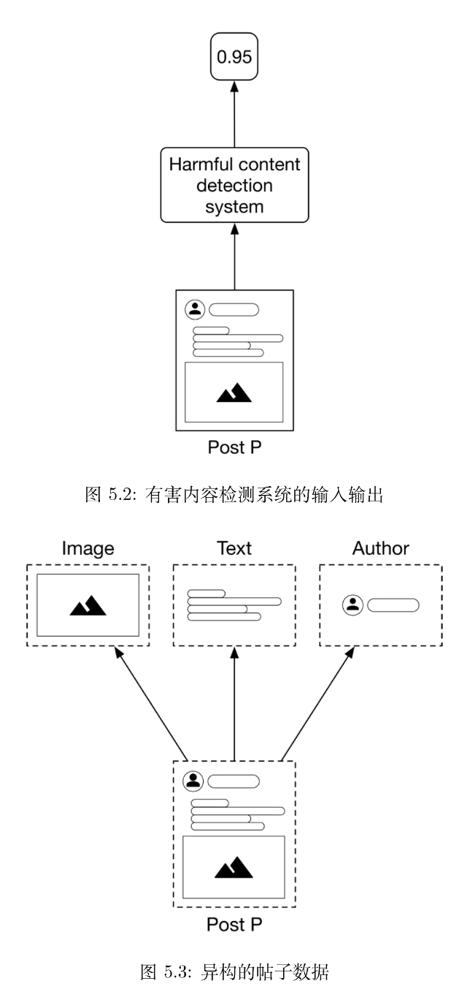 为了做出准确的预测，系统应考虑所有模态。两种常⽤的融合⽅来结合异构数据：后期融合和前期融合。

#### 后期融合
在后期融合中，机器学习模型独⽴处理不同的模态，然后结合它们的预测来得出最终的预测。下图展示了后期融合的⼯作原理。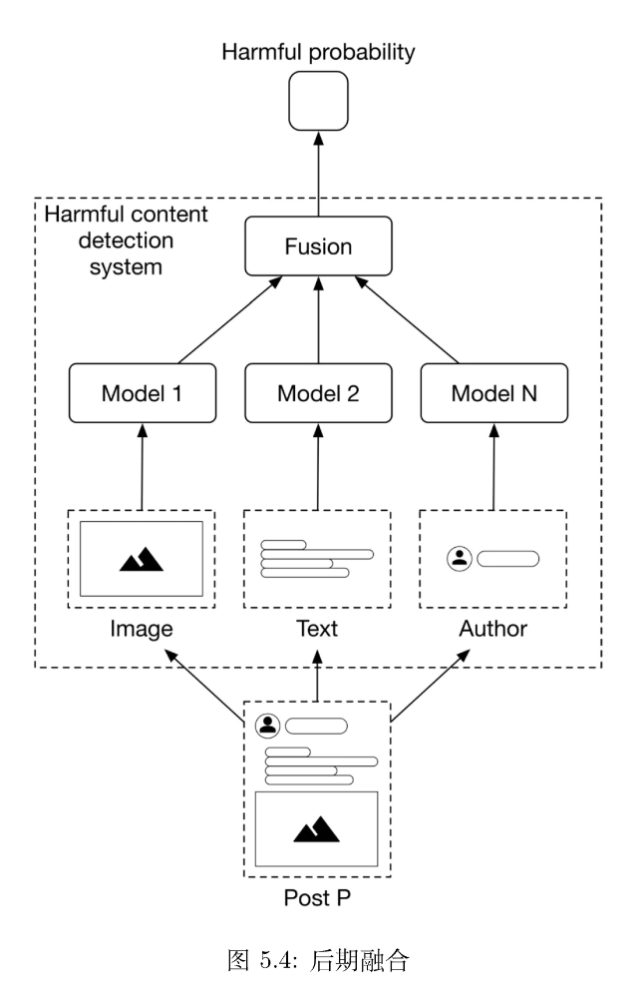  
后期融合的优点是可以独⽴地训练、评估和改进每个模型。然⽽，后期融合有 2 个主要缺点。⾸先，要训练这些单独的模型，需要为每个模态准备单独的训练数据，这可能耗时且成本⾼昂。其次，即使每个模态单独来看都是良性的，它们的组合也可能是有害的。尤其是在结合图像和⽂本的表情包（memes）中，这种情况很常⻅。在这些情况下，后期融合⽆法正确预测内容是否有害。这是因每个模态单独预测时都是良性的，所以融合层的输出也是良性的。但这其实是错误的，因模态的组合可能是有害的。  

#### 前期融合
在前期融合中，⾸先将各个模态结合，然后模型进⾏预测。下图展示了前期融合的⼯作原理。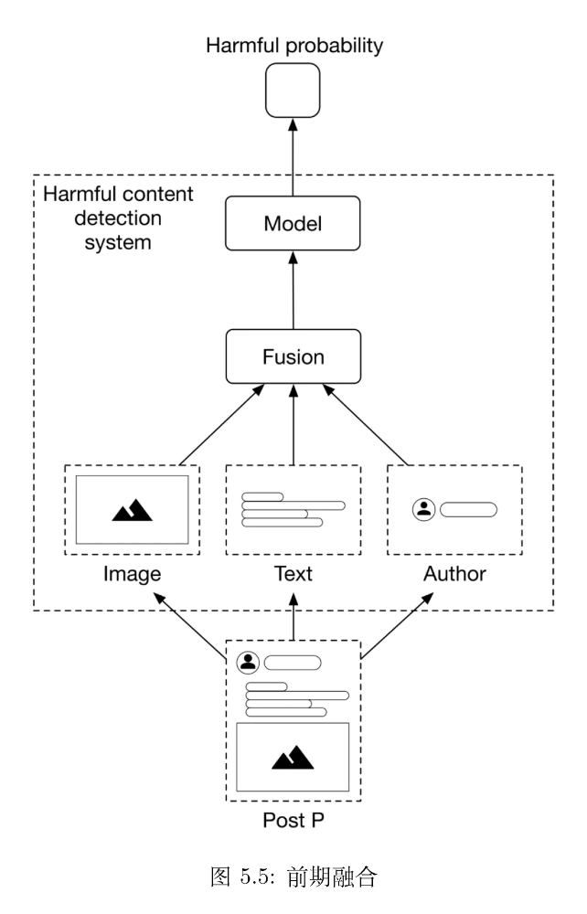  
前期融合有 2 个主要优点。⾸先，不需要为每个模态单独收集训练数据。由于只需训练⼀个模型，只需该模型收集训练数据。其次，模型会考虑所有模态，如果每个模态单独来看都是良性的，但它们的组合是有害的，那么模型可以在统⼀的特征向量中捕捉到这⼀点。  
然⽽，由于模态之间关系复杂，模型学习这个任务更加困难。在缺乏⾜够训练数据的情况下，模型很难学习复杂的关系并做出良好的预测。  

#### 应该使⽤哪种融合⽅法？
这里使⽤前期融合⽅法，因为它使能够捕捉那些整体上可能有害的帖⼦，即使每个模态单独来看是良性的。此外，每天发布的帖⼦数量约为 5 亿，模型有⾜够的数据来学习这⼀任务。  

### 选择合适的机器学习类别
本系统有以下机器学习类别的选项：
- 单⼀⼆分类器
- 针对每个有害类别的⼆分类器
- 多标签分类器
- 多任务分类器

#### 单⼀⼆分类器
在这种情况下，模型以融合的特征输⼊，并预测该帖⼦为有害的概率。由于输出是⼆元结果，该模型为⼆分类器。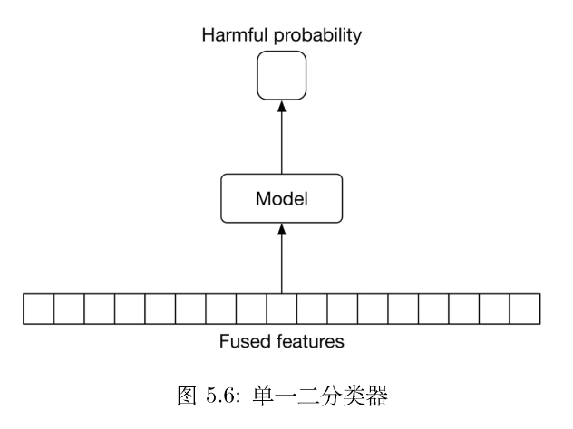  
这种选择的缺点是，很难确定帖⼦属于哪种有害类别，例如暴⼒。这⼀限制会导致两个主要问题：
- 由于系统仅输出表示帖⼦整体是否有害的⼆元值，很难向⽤户解释为什么要删除某个帖⼦。因为⽆法知道该帖⼦属于哪个特定的有害类别。
- 难以识别系统在表现不佳的有害类别，从⽽⽆法改进在这些类别上的检测能⼒。

由于解释删除帖⼦原因⾄关重要，单⼀⼆分类器不是⼀个好的选择。

#### 针对每个有害类别的⼆分类器
在这种情况下，为每个有害类别采⽤⼀个⼆分类器。如图所示，每个模型确定⼀个帖⼦是否属于某个特定的有害类别。每个模型以融合的特征为输⼊，并预测该帖⼦属于某个有害类别的概率。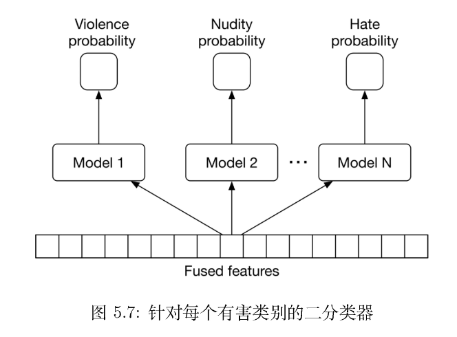  

这种选择的优点是可以向⽤户解释为什么某个帖⼦被删除。此外，可以独⽴地监控和改进不同的模型。然⽽，这种选择有⼀个主要缺点。由于有多个模型，它们必须分别进⾏训练和维护。分别训练这些模型耗时且成本⾼。  

#### 多标签分类器
在多标签分类中，希望分类的数据点可能属于任意数量的类别。在这种情况下，使⽤⼀个单⼀模型作多标签分类器。如图所示，模型的输⼊是融合的特征，模型预测每个有害类别的概率。  
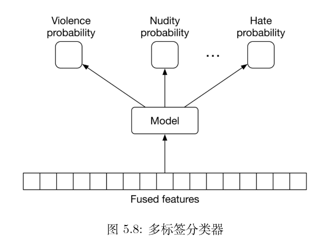  
通过使⽤⼀个共享模型处理所有有害类别，训练和维护的成本较低，具体⽅法比如 WPIE。然⽽，使⽤共享模型来预测每个有害类别的概率并不理想，因为输⼊特征可能需要不同的转换⽅式。  

#### 多任务分类器
多任务学习是指模型同时学习多个任务的过程。这使模型能够学习任务之间的相似性。通过这种⽅式，当某个输⼊转换对多个任务有⽤时，可以避免不必要的计算。  
在本案例中，将不同的有害类别（如暴⼒和裸露）视为不同的任务，并使⽤多任务分类模型来学习每个任务。如图所示，多任务分类有两个阶段：共享层和任务特定层。
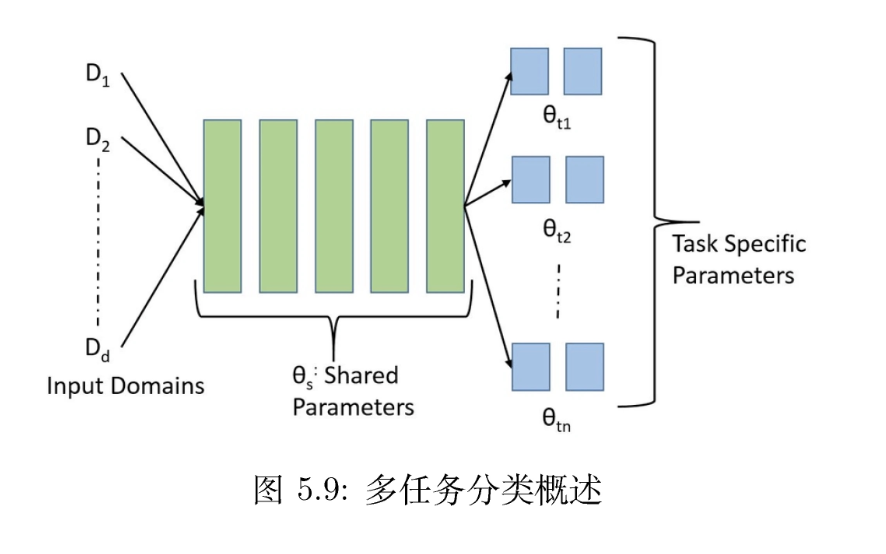  

**共享层** 如图所示，共享层是⼀组隐藏层，将输入特征转换新的特征。这些新转换的特征⽤于对每个有害类别进⾏预测。
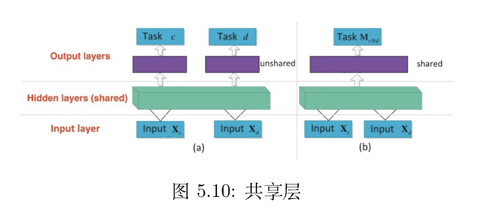

**任务特定层** 是⼀组独⽴的机器学习层（也称分类头）。每个分类头以最适合预测某个特定有害类别概率的⽅式转换特征。多个分类头又称多头模型。
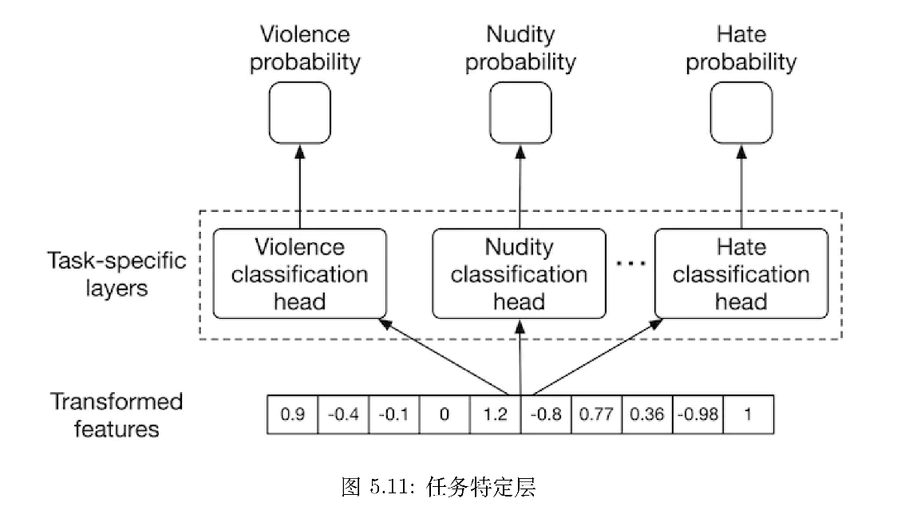

多任务分类有三个优点。⾸先，由于使⽤的是单⼀模型，训练和维护的成本较低。其次，共享层以有利于每个任务的⽅式转换特征。这避免了冗余计算，使多任务分类更⾼效。最后，每个任务的训练数据都可以促进其他任务的学习。当某个任务的数据有限时，这尤其有帮助。由于这些优势，本系统采⽤多任务分类⽅法。  
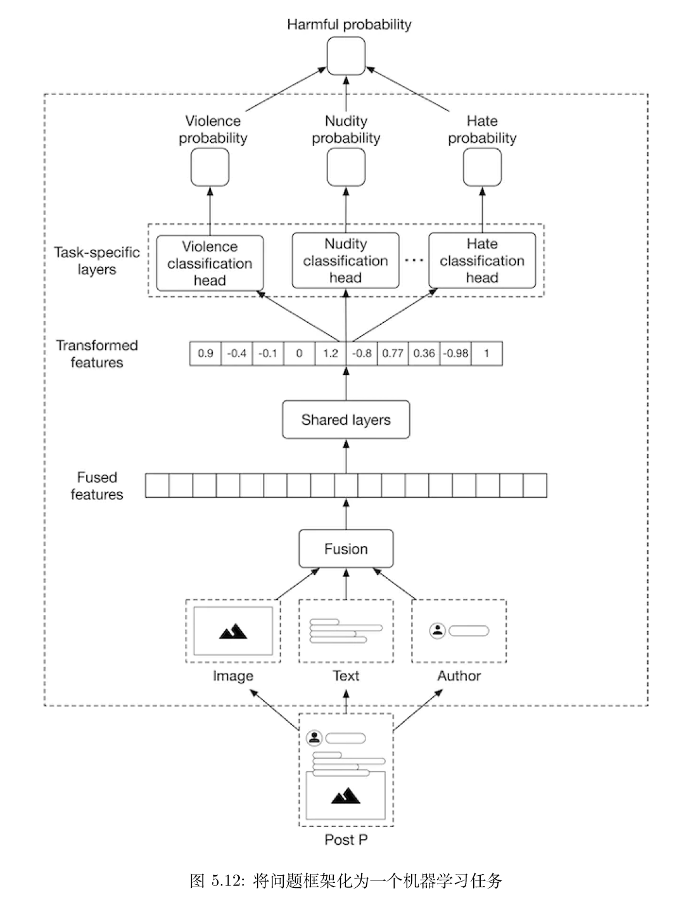  

## 数据准备
### 数据⼯程
有以下可⽤数据：
- ⽤户
- 帖⼦
- ⽤户-帖⼦交互

#### ⽤户
以下是⽤户数据的模式。  
ID | Username | Age | Gender | City | Country | Email
--- | --- | --- | --- | --- | --- | --- 

#### 帖⼦
帖⼦数据包含诸如作者、上传时间等字段。下表展示了⼀些最重要的属性。实际上，每个帖⼦通常有数百个相关属性。
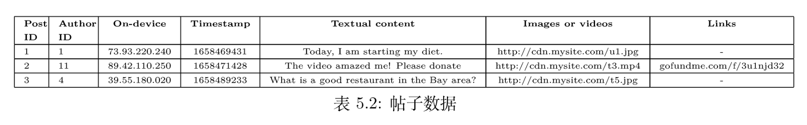  

#### ⽤户-帖⼦交互
⽤户-帖⼦交互数据主要包括⽤户对帖⼦的反应，如点赞、评论、收藏、分享等。⽤户还可以举报帖⼦为有害或请求申诉。下表展示了这些数据的样例。
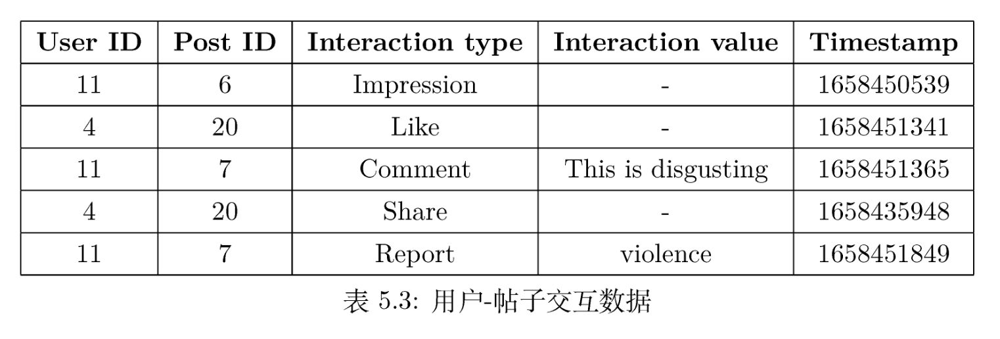  

### 特征⼯程
探讨可以从帖⼦中提取的预测特征。⼀个帖⼦可能包括以下元素：
- ⽂本内容 - 
- 图⽚或视频
- ⽤户对帖⼦的反应
- 作者
- 上下⽂信息

看看每个元素。

#### ⽂本内容
帖⼦的⽂本内容可以⽤来判断帖⼦是否有害。如 YouTube 视频搜索中所述，⽂本数据通常分两步准备：
- ⽂本预处理（如归⼀化、分词）
- 向量化：将预处理后的⽂本转换为有意义的特征向量

这里专注于向量化，因为这是本系统的独特内容。为了向量化⽂本并提取特征向量，可以使⽤统计⽅法或基于机器学习的⽅法。统计⽅法如 BoW 或 TF-IDF 易于实现且计算速度快。然⽽，它们⽆法编码⽂本的语义。对于本系统，理解⽂本内容的语义对判断是否有害很重要，因此采⽤基于机器学习的⽅法。为了将⽂本转换为特征向量，使⽤预训练的基于 Transformer 的语⾔模型，如 BERT。然⽽，原始的 BERT 存在两个问题：
- 由于模型规模较⼤，⽣成⽂本嵌⼊需要很⻓时间。由于这个过程较慢，将其⽤于在线预测并不理想。
- BERT 是在仅包含英语的数据上训练的。因此，对于其他语⾔的⽂本，它⽆法⽣成有意义的嵌入。

DistiBERT 是 BERT 的更⾼效变体，解决了这两个问题。如果两句话的意思相同，但用不同语⾔表达，它们的嵌⼊会⾮常相似。

#### 图⽚或视频
通常可以通过查看帖⼦中的图⽚或视频来了解其内容。以下 2 个步骤常⽤于准备图像或视频等⾮结构化数据：
- 预处理：解码、调整⼤⼩和归⼀化数据。
- 特征提取：预处理后，使⽤预训练模型将⾮结构化数据转换为特征向量。这使能够用特征向量表示图像或视频。对于图像，预训练的图像模型如 CLIP 的视觉编码器或 SimCLR 是可⾏的选择。对于视频，像 VideoMoCo 这样的预训练模型可能表现良好。

#### ⽤户对帖⼦的反应
根据⽤户的反应，也可以判断帖⼦是否有害，尤其是在内容模棱两可的情况下。如图所示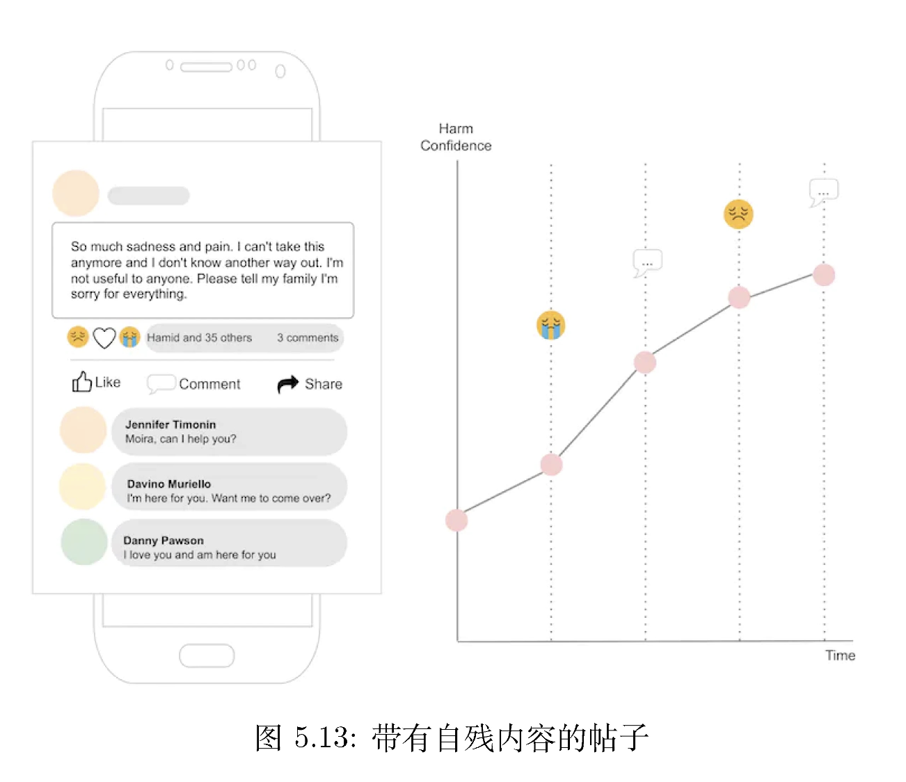，随着评论数量的增加，越来越明显地表明该帖⼦包含与⾃残相关的内容。  
由于⽤户反应在判断有害内容时⾄关重要，以下是⼀些可以基于⽤户反应构建的特征。  
- 点赞数、分享数、评论数和举报数：通常会对这些数值进⾏缩放，以加快模型训练时的收敛速度。
- 评论：如上图所示，评论可以帮助识别有害内容。为了准备特征，通过以下⽅式将评论转换⼒数值表示：
  - 使⽤之前使⽤的预训练模型获取每条评论的嵌⼈。
  - 聚合（如平均）嵌⼊以获得最终的嵌⼈。

下图总结以上描述的特征。
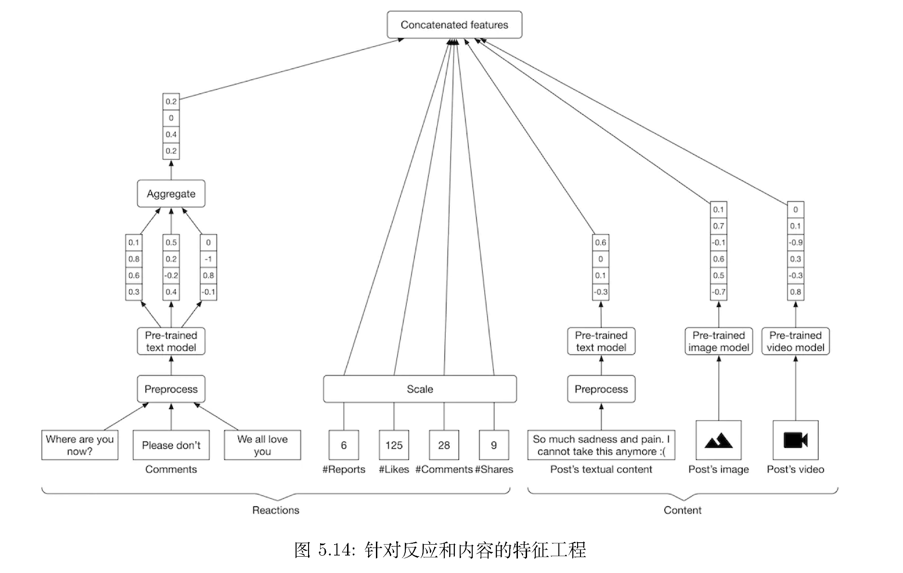  

#### 作者特征
作者的过去互动记录可以⽤来判断帖⼦是否有害。以下为帖⼦作者构建相关特征。  
- 作者的违规历史  
  - 违规次数：这是⼀个数值，表示作者过去违反平台规定的次数。
  - 总⽤户举报数：⼀个数值，表示⽤户举报该作者帖⼦次数的总和。
  - 脏话率：这是⼀个数值，表示作者之前的帖⼦和评论中脏话的⽐例。使⽤预定义的脏话列表来判断⼀个词是否是脏话。
- 作者的⽤户信息
   - 年龄：⽤户年龄是最重要的预测特征之⼀。
   - 性别：这是表示⽤户性别的分类特征。使⽤独热编码来表示性别。
   - 城市和国家：城市和国家有很多不同的取值。使⽤嵌⼊层将城市和国家转换特征向量。请注意，使⽤独热编码表示城市和国家并不是⼀种⾼效的⽅法，因为它们的表示会很⻓且稀疏。
- 账户信息
   - 关注者和关注数量
   - 账户年龄：这是⼀个数值，表示作者账户的年龄。这是⼀个预测特征，因账户年龄较低的更有可能是垃圾账户或违反平台规定的账户。

#### 上下⽂信息
- ⼀天中的时间：这是作者发帖时的⼀天中的时间。将其分类为多个类别，如早晨、中午、下午、傍晚或晚上，并使⽤独热编码来表示该特征。
- 设备：作者使⽤的设备，如智能⼿机或桌⾯电脑。使⽤独热编码表示该特征。

下图总结了有害内容检测系统的⼀些最重要特征。  
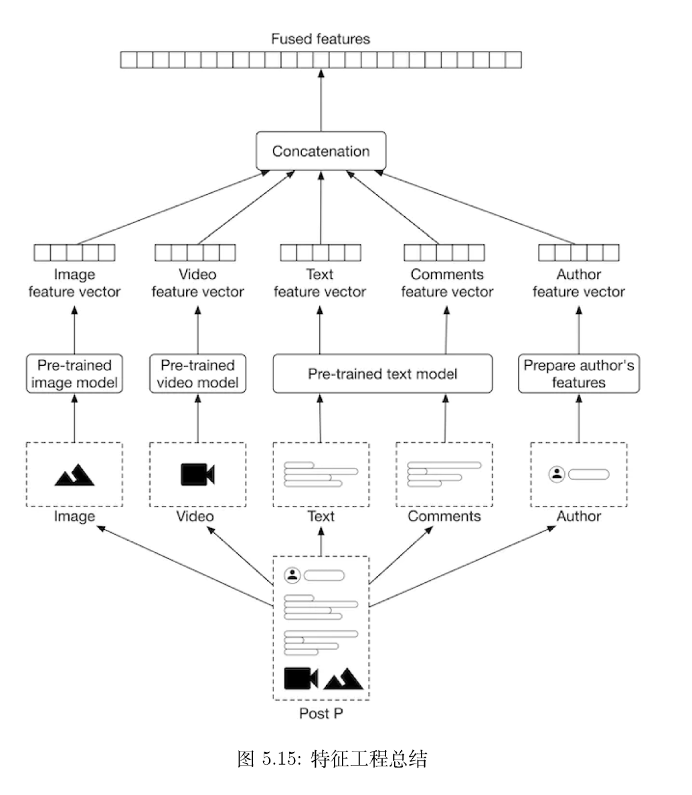

## 模型开发
### 模型选择
神经⽹络是多任务学习中最常⽤的模型。本次模型开发采⽤神经⽹络。  
选择神经⽹络时应考虑哪些因素？有必要确定神经⽹络的架构设计和最佳超参数选择，如其隐藏层、激活函数、学习率等。最佳超参数的选择通常通过超参数调优来确定，超参数调优是模型找到最佳超参数值以实现最佳性能的过程。⽹格搜索通常⽤于调优超参数。其过程包括为每种超参数值组合训练⼀个新模型，评估每个模型，然后选择表现最好的超参数组合。  

### 模型训练
构建数据集要训练多任务分类模型，⾸先需要构建数据集。该数据集包含模型的输⼊（特征）和模型预期预测的输出（标签）。为构建输⼊，将帖⼦按批次离线处理，并计算前述的融合特征。这些特征可以存储在特征库中以供未来训练使⽤。为了每个输⼊创建标签，有两种选择：
- ⼿动标注
- ⾃然标注

在⼿动标注中，⼈类标注⼈员⼿动标记帖⼦。这种⽅法能⽣成准确的标签，但成本⾼且耗时⻓。在⾃然标注中，依赖⽤户举报⾃动标记帖⼦。虽然这种⽅法产⽣的标签噪声较⼤，但标签⽣成速度更快。在评估数据集中，使⽤⼿动标注以优先保证标签的准确性；⽽在训练数据集中，使⽤⾃然标注以优先保证标记速度。下图显示了构建的数据集中的⼀个数据点。  
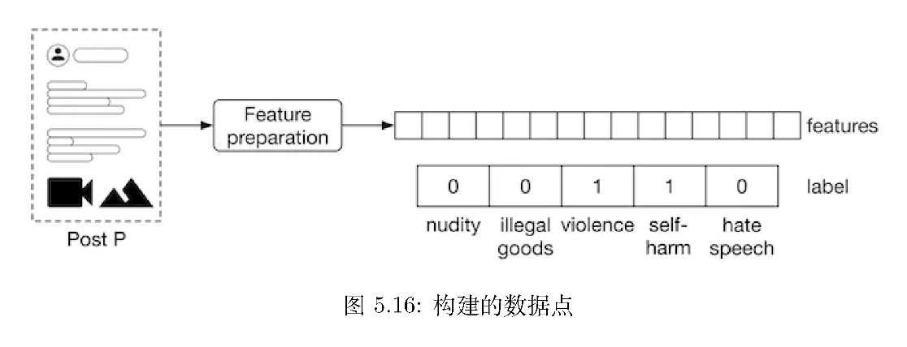  

选择损失函数训练多任务神经⽹络与通常训练神经⽹络模型的⽅式⾮常相似。前向传播进⾏计算以进⾏预测，损失函数测量预测的准确性，反向传播优化模型的参数以在下⼀次迭代中减少损失。在多任务训练中，每个任务根据其机器学习类别分配⼀个损失函数。在本例⼦中，每个任务都被框定为⼆元分类，所以为每个任务采⽤标准的⼆元分类损失（如交叉熵）。总体损失是通过结合特定任务的损失来计算的，如下图所示。  
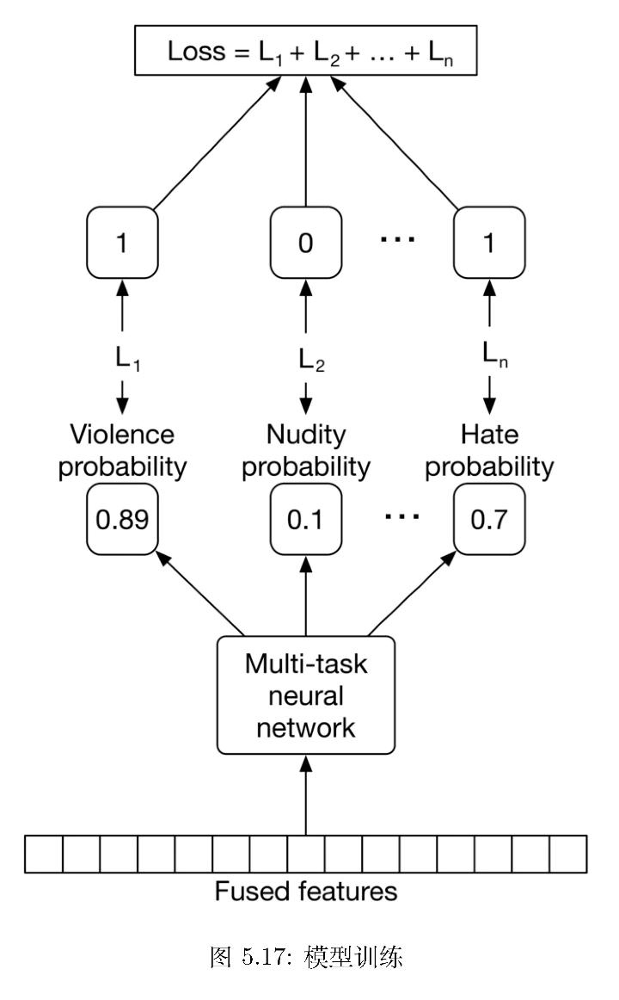  

训练多模态系统的⼀个常⻅挑战是过拟合。例如，当不同模态的学习速度不同时，某⼀模态（如图像）可能会主导学习过程。解决这个问题的两种技术是梯度混合和聚焦损失。  

## 评估
### 离线指标
为了评估⼆元分类模型的性能，通常使⽤离线指标，如精确率、召回率和 f1 分数。然⽽，单独的精确率或召回率不⾜以理解整体性能。例如，精确率⾼的模型可能会有很低的召回率。精确率-召回（PR）曲线和受试者⼯作特征（ROC）曲线可以解决这些限制。以下探讨⼀下每个指标。  
- PR 曲线 - 显示了模型精确率和召回率之间的权衡。如下图所示，通过绘制模型在不同概率阈值下的精确率获得 PR 曲线，阈值范围从 0 到 1。为了总结精确率和召回率之间的权衡，PR-AUC（精确率-召回曲线下的⾯积）计算了 PR 曲线下的⾯积。⼀般来说，PR-AUC 越⾼，模型越准确。
- ROC 曲线 - 显示了真正率（召回率）和假正率之间的权衡。与 PR 曲线类似，ROC-AUC 通过计算 ROC 曲线下的⾯积来总结模型的性能。

ROC 和 PR 曲线是总结分类模型性能的两种不同⽅法。在本案例中，使⽤ ROC-AUC 和 PR-AUC 作为离线指标。

### 在线指标
以下是⼀些平台的安全性重要指标。  
- 流⾏率 - 该指标测量未能防⽌的有害帖⼦与平台上所有帖⼦之⽐。`Prevalence = Number of harmful posts we didn't prevent / Total number of posts on the platform` 该指标的缺点是它将有害帖⼦⼀视同仁。例如，⼀个拥有 100K 次观看或展示的有害帖⼦⽐两个每个只有 10 次观看的帖⼦更有害。
- 有害展示次数 - 相⽐流⾏率，本系统更倾向于使⽤该指标。其原因在于平台上的有害帖⼦数量并未显示有多少⼈受到这些帖⼦的影响，⽽有害展示次数则捕捉到了这⼀信息。
- 有效中诉 - 被判定为有害但通过申诉恢复的帖⼦百分⽐。公式 `Appeals = Number of reversed appeals / Number of harmful posts detected by the system`
- 主动率。系统在⽤户举报前发现并删除的有害帖⼦百分⽐。公式 `Proactive rate = Number of harmful posts detected by the system / Number of harmful posts detected by the system + reported by users`
- 每个有害类别的⽤户举报数 - 该指标通过查看⽤户对每个有害类别的举报情况来评估系统性能。

## 部署
  

### 有害内容检测服务
给定⼀个新帖⼦，该服务预测其有害的概率。根据要求，由于某些有害类型的敏感性，需要⽴即处理。当发⽣这种情况时，违规执⾏服务会⽴即删除该帖⼦。

### 违规执⾏服务
当有害内容检测服务⾼置信度地预测到有害内容时，违规执⾏服务会⽴即下架该帖⼦。它还会通知⽤户为什么该帖⼦被删除。

### 降级服务
如果有害内容检测服务对有害的预测置信度较低，降级服务会暂时降低帖⼦的排名，以减少其在⽤户中传播的可能性。然后，该帖⼦会存储在存储中，以供⼈⼯审核。审核团队⼿动审核该帖⼦，并从预定义的有害类别中分配标签。将在未来的训练迭代中使⽤这些标记的帖⼦来改进模型。

### 其他讨论点
- 处理⼈⼯标注引⼊的偏⻅。
- 使系统适应检测新的有害类别（如 Covid-19，选举）。
- 如何构建⼀个利⽤⽤户⾏为序列等时间信息的有害内容检测系统。
- 如何有效地选择帖⼦样本进⾏⼈⼯审核。
- 如何检测真实和虚假账户。
- 如何处理边界内容，即那些不被指南禁⽌但接近指南界限的内容。
- 如何使有害内容检测系统更⾼效，从⽽能在设备上部署。
- 如何⽤线性 transformers 代替基于 transformers 的架构，以创建更⾼效的系统。

# Video Recommendation System 视频推荐系统
推荐系统在视频和⾳乐流媒体服务中起着关键作⽤。例如，YouTube 向⽤户推荐他们可能喜欢的视频，Netflix 向⽤户推荐他们可能喜欢观看的电影，Spotify 向⽤户推荐⾳乐。  
设计⼀个类似于 YouTube 的视频推荐系统。该系统基于⽤户的个⼈资料、先前的互动等内容在⽤户的主⻚上推荐视频。  
推荐系统的设计通常⾮常复杂，开发⼀个⾼效且可扩展的系统需要投⼊⼤量的⼯程⼯作量。业务⽬标是提⾼⽤户参与度。每当⽤户加载主⻚时，系统推荐最具吸引⼒的视频。⽤户遍布全球，视频可能有不同的语⾔。平台上⼤约有 100 亿个视频，并且推荐应该快速提供。  

### 定义机器学习⽬标
系统的业务⽬标是提⾼⽤户参与度。有⼏种⽅法可以将业务⽬标转化为明确的机器学习⽬标。
- 最⼤化⽤户点击数。视频推荐系统可以设计为最⼤化⽤户点击数。然⽽，该⽬标有⼀个主要缺点。模型可能会推荐所谓的“标题党”视频，即标题和缩略图看起来很吸引⼈，但视频内容可能很⽆聊、不相关甚⾄具有误导性。标题党视频会随着时间的推移降低⽤户的满意度和参与度。
- 最⼤化完成视频的数量。系统还可以推荐⽤户可能会完整观看的视频。该⽬标的⼀个主要问题是，模型可能会推荐⽤户更容易看完的短视频。
- 最⼤化观看总时⻓。该⽬标会产⽣⽤户花更多时间观看的推荐视频。
- 最⼤化相关视频的数量。该⽬标会产⽣与⽤户相关的视频推荐。⼯程师或产品经理可以根据⼀些规则定义相关性。这些规则可以基于隐式和显式⽤户反馈。例如，⼀个定义可以规定，如果用户明确按下喜欢按钮或观看了⾄少⼀半的视频，则该视频是相关的。⼀旦定义了相关性，就可以构建数据集并训练模型以预测⽤户与视频之间的相关性分数。

在这个系统中，选择最⼤化相关视频的数量作为机器学习⽬标，因可以更好地控制使⽤哪些信号。此外，它没有前述其他选项的缺点。

### 指定系统的输入和输出
如图所示，视频推荐系统以⽤户为输⼊，并输出按相关性分数排序的视频列表。
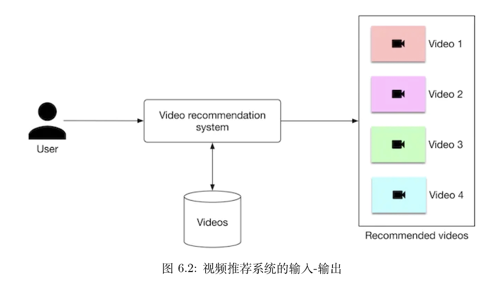  

### 选择合适的机器学习类别
在本节中，将研究三种常⻅的个性化推荐系统类型。
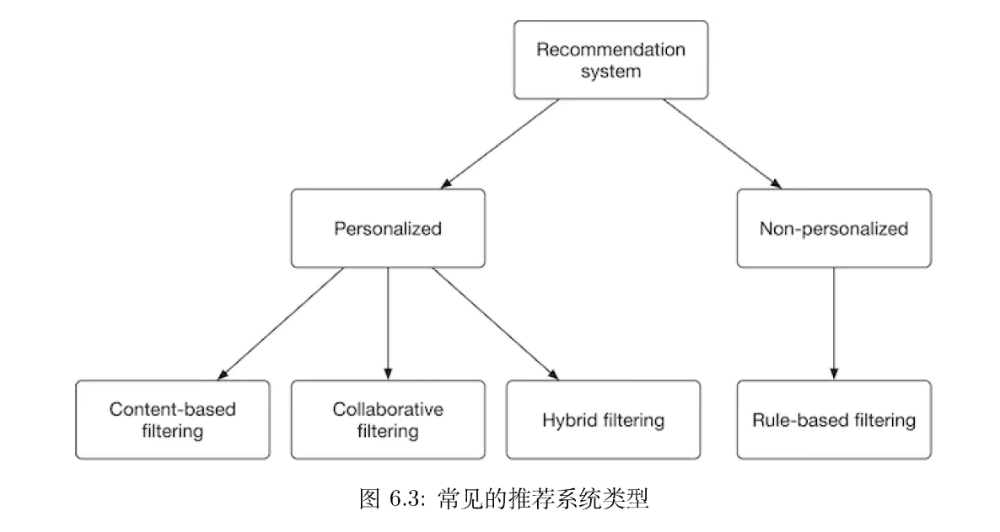
- 基于内容的过滤
- 协同过滤
- 混合过滤

#### 基于内容的过滤
该技术使⽤视频特征来推荐新视频这些新视频相似于⽤户觉得相关的视频。例如，如果⽤户过去与许多滑雪视频有互动，那么此⽅法将推荐更多滑雪视频。下图显示了⼀个例⼦。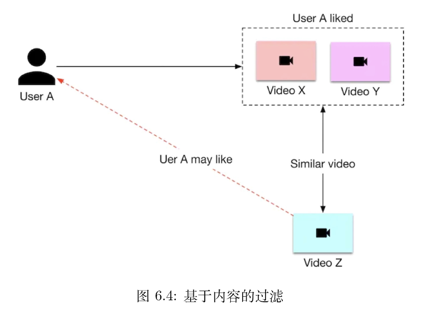

基于内容的过滤有其优缺点。  
优点：
- 能够推荐新视频。使⽤此⽅法，⽆需等待⽤户的交互数据即可为新视频构建视频档案。视频档案完全依赖于其特征。
- 能够捕捉⽤户的独特兴趣。这是因为根据⽤户过去的互动推荐视频。

缺点：
- 难以发现⽤户的新兴趣。
- 该⽅法需要领域知识，通常需要⼿动设计视频特征。

