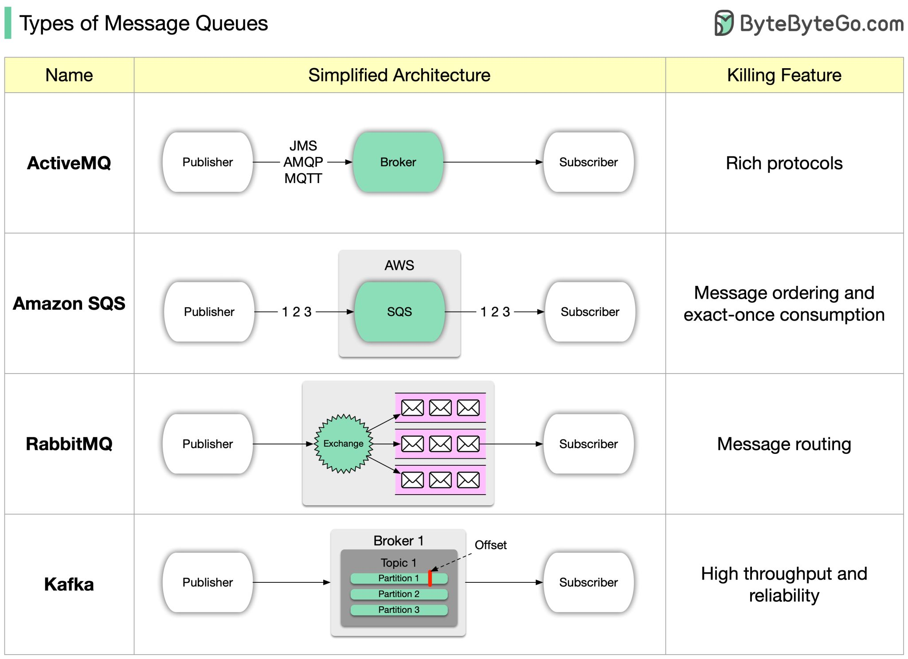

# 消息队列与流处理
在计算机科学中，消息队列（英语：Message queue）是一种进程间通信或同一进程的不同线程间的通信方式，软件的贮列用来处理一系列的输入，通常是来自用户。消息队列提供了异步的通信协议，每一个贮列中的纪录包含详细说明的资料，包含发生的时间，输入设备的种类，以及特定的输入参数，也就是说：消息的发送者和接收者不需要同时与消息队列交互。消息会保存在队列中，直到接收者取回它。  
消息队列本身是异步的，它允许接收者在消息发送很长时间后再取回消息，这和大多数通信协议是不同的。例如 WWW 中使用的 HTTP 协议（HTTP/2 之前）是同步的，因为客户端在发出请求后必须等待服务器回应。然而，很多情况下需要异步的通信协议。比如，一个进程通知另一个进程发生了一个事件，但不需要等待回应。但消息队列的异步特点，也造成了一个缺点，就是接收者必须轮询消息队列，才能收到最近的消息。  
和信号相比，消息队列能够传递更多的信息。与管道相比，消息队列提供了有格式的数据，这可以减少开发人员的工作量。但消息队列仍然有大小限制。  
消息队列除了可以当不同线程或进程间的缓冲外，更可以透过消息队列当前消息数量来侦测接收线程或进程性能是否有问题。  

流处理 (Stream processing) 是一种计算机编程范型，相当于数据流程编程，事件流处理，和反应式编程，其允许一些应用更容易地利用了有限形式的并发处理。这些应用程序可以使用多个计算单元，例如图形处理上的浮点运算器或现场可编程门数组（FPGAs），而无需明确管理这些单元之间的分配，同步或通信。  
编程语言中的[流](./../../Tool%20Sets/Stream.java)。  

消息队列、面向消息的中间件与流处理可以统称为消息代理，消息代理相对服务同步调用（如 REST API）有几个优点：
* 如果收件人不可用或过载，可以充当缓冲区，从而提高系统的可靠性。
* 它可以自动将消息重新发送到已经崩溃的进程，从而防止消息丢失。
* 避免发件人需要知道收件人的 IP 地址和端口号（这在虚拟机经常出入的云部署中特别有用）。
* 它允许将一条消息发送给多个收件人。
* 将发件人与收件人逻辑分离（发件人只是发布邮件，不关心使用者）。

与服务同步调用相比，差异在于消息传递通信通常是单向的：发送者通常不期望收到其消息的回复。一个进程可能发送一个响应，但这通常是在一个单独的通道上完成的。这种通信模式是异步的：发送者不会等待消息被传递，而只是发送它，然后忘记它。  
一个主题只提供单向数据流。但是，消费者本身可能会将消息发布到另一个主题上（因此可以将它们链接在一起），或者发送给原始消息的发送者使用的回复队列（允许请求 / 响应数据流，类似于 RPC）。  

## 不同的传递语义
* 至多一次交付（At-Most Once）- 正如其名称所示，至多一次交付意味着消息将被传递、处理不止一次。消息可能会丢失，但不会重新传递。这是至多一次交付在高层次上的工作原理。应用场景：适用于监控度量等情况，其中可以接受少量数据丢失。
* 至少一次交付（At-Least Once）- 在这种数据传递语义下，可以接受将消息传递多次，但不应丢失任何消息。应用场景：至少一次交付不会丢失消息，但同一消息可能会传递、处理多次。虽然从用户的角度来看并不理想，但至少一次交付语义通常对于数据重复不是一个大问题或者可以在消费者端进行去重处理。例如，通过每个消息中的唯一键，可以在将重复数据写入数据库时拒绝消息。
* 仅一次交付（Exactly Once）- 仅一次交付是最难实现的交付语义。它对用户友好，但对系统的性能和复杂性有很高的成本。应用场景：与财务相关的用例（支付、交易、会计等）。仅一次交付在不可接受重复和下游服务或第三方不支持幂等性的情况下尤为重要。
  
## 不同的消息队列
  
[RabbitMQ 的消息路由机制：](https://www.51cto.com/article/715429.html)  
多种交换器类型：RabbitMQ 提供了不同类型的交换器（Exchanges），每种类型都支持不同的消息路由策略。常见的交换器类型包括：
* 直接交换器（Direct Exchange）：基于消息的路由键（Routing Key）将消息发送到与之匹配的队列。
* 主题交换器（Topic Exchange）：使用通配符来匹配路由键，使得消息可以按照更灵活的模式进行路由。
* 扇出交换器（Fanout Exchange）：将消息广播给所有与交换器绑定的队列，不考虑路由键。
* 头交换器（Header Exchange）：使用消息头中的属性来匹配队列，而不是路由键。
  
## Message Queues vs Event Streaming Platforms such as Kafka
> While many consumers may be active, queues only deliver messages to a single consumer (typically whichever consumer is available to receive it first) before removing that message from the queue. Meanwhile, streaming brokers send the same message to every subscriber of that log file.  
> In a queue, once a message is delivered, it's gone forever. To reprocess a message, you have to have a backup, like a batch layer, so that you can put it back into the queue. In comparison, a streaming broker uses a distributed log file, so consumers can move backward and forward within that file to re-process messages they've already received on command.  
> Examples of event streaming platforms include Apache Kafka, where streaming data is organized by Kafka topics. Kafka streams offer the same high throughput and high performance of message queues, but with different functionality.  
> As you can see, the primary difference between queues and streams is the means of message delivery. This seemingly subtle difference completely changes the landscape of use cases for each of these services.  

reference: https://blog.iron.io/message-queue-vs-streaming/  

> Message Queues ensure delivery and scaling, while Kafka focuses on high-throughput and low-latency. Kafka suits high data volumes and streaming, and Message Queues excel in decoupling services and workloads. Kafka's log-based storage ensures persistence; Message Queues rely on acknowledgements for delivery.  

reference: https://blog.iron.io/message-queue-vs-apache-kafka/  

## 分布式的 Actor 框架
分布式的 Actor 框架实质上是将消息代理和 actor 编程模型集成到一个框架中。  

分布式 Actor 即[并发编程模型的 Actor 模型](../../Computer%20System%20Layer/并发编程模型.md#Actor-模型)。  

**其他**  
Akka 是一个构建在 JVM 上，基于 Actor 模型的的并发框架，为构建伸缩性强，有弹性的响应式并发应用提高更好的平台。  

## Message Queue 和 Stream 的区别
消息队列（Message Queue）和流处理（Stream Processing）是两种不同的数据处理模式，虽然它们都涉及到数据的传输和处理，但在用途、特点和应用场景上有一些区别。

**消息队列（Message Queue）：**
1. **目的：** 消息队列用于解耦应用程序之间的通信，将消息从一个发送者传递给一个或多个接收者。
2. **通信模式：** 消息队列通常采用发布-订阅（Publish-Subscribe）或点对点（Point-to-Point）的通信模式。
3. **用途：** 消息队列常用于异步通信、任务调度、事件通知、解耦应用组件、处理批量任务等场景。
4. **数据处理：** 消息队列通常不对数据进行处理，只负责传递消息。接收者从队列中取出消息后进行处理。
5. **消息保障：** 消息队列通常提供消息的可靠性保障，确保消息不会丢失，例如通过持久化、重试等机制。

**流处理（Stream Processing）：**
1. **目的：** 流处理用于实时处理数据流，将数据从源头到目的地进行实时处理和转换。
2. **通信模式：** 流处理一般采用流式处理模式，对数据流进行实时处理、过滤、聚合等操作。
3. **用途：** 流处理常用于实时分析、实时监控、实时决策、实时反馈等场景。
4. **数据处理：** 流处理框架可以对数据进行实时处理、转换和分析，可以应用各种业务逻辑。
5. **事件保障：** 流处理通常需要保证事件的顺序性和一致性，确保实时处理的正确性。

总的来说，消息队列更侧重于解耦和异步通信，而流处理更注重实时数据处理和分析。根据具体的应用需求，可以选择合适的模式来满足不同的数据处理要求。

以上 by ChatGPT  
