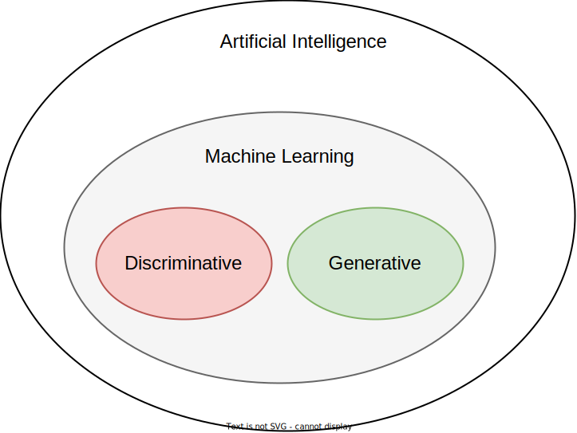
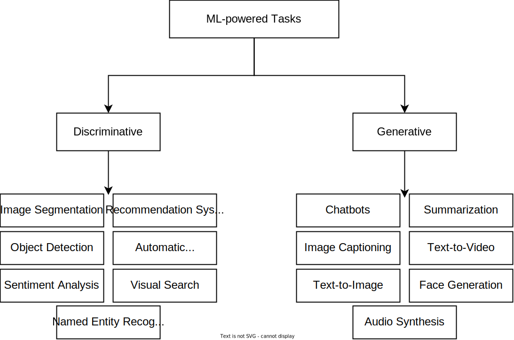
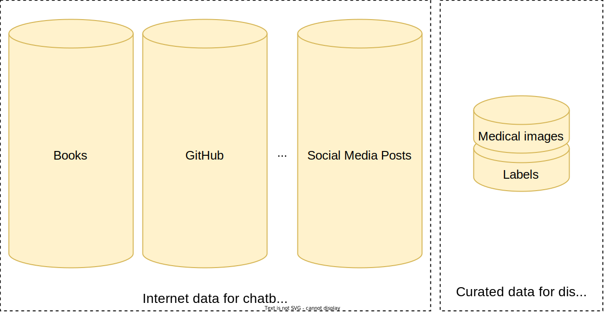
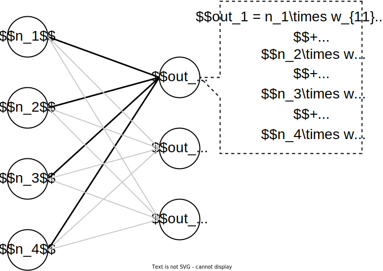
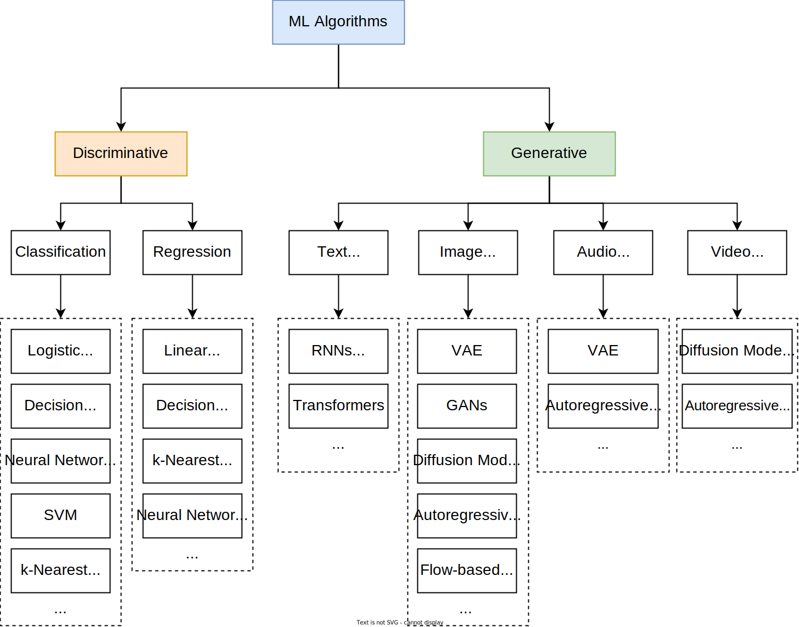
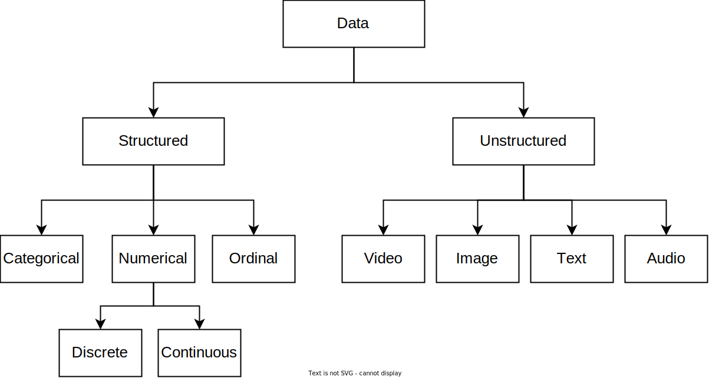

# 生成式人工智能系统设计

## GenAI 概述
### 什么是人工智能和机器学习？
人工智能（AI）是计算机科学的一个分支，专注于创建能够执行通常需要人类智能才能完成的任务的系统，例如推理、规划和问题解决。机器学习（ML）是人工智能的一个子集，它使用算法从数据中学习，而不是依赖预定义的规则。这些算法分析数据、识别模式，并根据学习到的模式进行预测或生成新内容。推荐系统、欺诈检测、自动驾驶汽车和聊天机器人等应用通常都由机器学习模型驱动。  

机器学习模型通常分为两类：
- Discriminative（判别式）
- Generative（生成式）

#### 判别式
判别模型通过学习基于输入特征的类别之间的差异来对数据进行分类。形式上，它们学习条件概率 P(Y|X)，其中 Y 代表目标变量，X 代表输入特征。  

判别模型既可用于分类（目标是确定输入数据所属类别），也可用于回归（目标是预测连续值）。例如，在欺诈检测中，判别模型可以通过分析交易金额和购买历史等特征，将交易分类为合法交易或欺诈交易。类似地，在电影推荐中，模型可以根据用户的历史互动记录来预测用户对电影的评分。  

常用的判别模型开发算法包括：  
- 逻辑回归：一种基于输入特征预测二元结果概率的线性模型。
- 支持向量机（SVM）：SVM 寻找能够最好地分离特征空间中类别的[超平面](https://zh.wikipedia.org/wiki/%E8%B6%85%E5%B9%B3%E9%9D%A2)。它们可以通过内核函数扩展来学习非线性边界。
- 决策树：这些模型及其变体，如随机森林，根据目标变量递归地将数据分成子组。
- K 近邻 (KNN)：一种非参数方法，它根据特征空间中最近邻的多数标签对样本进行分类。
- 神经网络：这些模型由多层相互连接的神经元组成。它们使用加权输入、激活函数和反向传播来学习和逼近复杂函数，以完成分类和回归等任务。
  
虽然这些算法可以根据输入特征预测目标变量，但它们大多缺乏学习生成新数据实例所需的底层数据分布的能力。为此，需要借助生成模型。

#### 生成模型
生成模型旨在理解并复现数据的底层分布。形式上，当仅关注输入数据时（例如，图像生成），它们对分布 P(X) 进行建模；当同时考虑输入数据和目标变量时（例如，文本到图像生成），它们对联合概率分布 P(X, Y) 进行建模。这使得它们能够通过从这些学习到的分布中采样来生成新的数据实例。  

与侧重于区分数据实例的判别式模型不同，生成式模型可以创建与原始数据高度相似的新数据实例。例如，用人脸图像训练的生成式模型可以生成全新的面孔。这些模型被应用于各种任务，例如文本生成、图像生成和语音合成。  

生成算法可以分为两类：经典算法和现代算法。经典算法擅长从结构化数据中学习模式，但它们在学习更复杂或非结构化数据时可能较为困难。常见的经典生成算法包括：
- 朴素贝叶斯：基于贝叶斯定理的概率模型。
- 高斯混合模型（GMM）：GMM 将数据表示为高斯分布的混合。
- 隐马尔可夫模型（HMM）：HMM 对观测序列和生成这些序列的隐藏状态的联合概率进行建模。
- 玻尔兹曼机：基于能量的模型，用于特征学习或降维。

另一方面，现代生成算法能够从复杂的数据分布中学习，非常适合生成逼真的图像和根据查询生成准确的文本输出等任务。常见的现代生成算法包括：
- 变分自编码器（VAE）：一种自编码器，它通过将数据编码到潜在空间来建模数据的分布，然后使用解码器重建原始数据。
- 生成对抗网络（GAN）：一类神经网络，其中生成器和判别器同时进行训练。生成器生成真实数据，判别器则试图区分真实数据和生成数据。
- 扩散模型：通过逆扩散过程学习复杂数据分布的模型。它们常用于图像和视频生成。
- 自回归模型：这类模型通过根据序列中前面的元素预测每个元素来生成数据。它们常用于文本生成和时间序列预测。

判别模型和生成模型用途不同。判别模型通常用于分类或预测；生成模型用于生成新的样本。下图展示了由生成模型和判别模型驱动的常用任务。
  

### 什么是 GenAI？它为何越来越受欢迎？
GenAI 涉及使用现代生成算法来训练能够生成新数据样本（例如图像、视频、文本和音频）的模型。  

GenAI 近来迅速走红，主要有两个原因。首先，这些模型能够跨领域执行各种任务，例如生成文本、创建逼真图像和创作音乐。这种多任务处理能力使其在各行各业都极具价值，从创意艺术和娱乐到医疗保健和软件开发，无所不包。  
其次，GenAI 应用显著提高了生产力。例如，在内容创作方面，这些模型可以生成草稿、提出改进建议，甚至生成最终成果，从而节省大量时间和资源。另一个例子是使用大型语言模型（LLM），例如 ChatGPT，它可以辅助完成诸如回答复杂问题和进行有意义的对话等任务。  

### 为什么人工智能（GenAI）变得如此强大？
近年来，GenAI 模型展现出了令人瞩目的能力，并且正变得越来越强大。推动这一进步的三大关键因素是：
- 数据
- 模型容量
- 计算

#### 数据
机器学习模型的有效性取决于其训练数据。例如，如果模型没有使用大量的医疗数据进行训练，则可能难以准确诊断疾病。改进特定任务的模型需要带有标签的大型数据集，但收集这些数据可能既困难又昂贵。  
GenAI 成功的关键驱动力之一是自监督学习。与通常在已标注数据上训练效果良好的传统模型不同，GenAI 模型可以从未标注数据中学习。这种方法使它们能够利用来自互联网的海量数据集，而无需耗费成本和时间进行标注工作。  
  
上图中展示了一个数据架构图，对比了两种类型的数据源。左侧标注为 "聊天室的互联网数据……"，图中显示了三个大型的垂直圆柱体，分别代表不同的互联网数据源："书籍"、"GitHub" 和 "社交媒体帖子"。省略号（…）表示这是一个代表性样本，暗示存在更多数据源。这些圆柱体在视觉上相似，表明它们采用了统一的数据结构或处理方法。右侧标注为 "疾病的精选数据……"，图中描绘了一个较小的双层圆柱体，其上层为 "医学图像"，下层为 "标签"。这种结构表明，医学图像与其对应的标签配对，意味着这是一个结构化且带有注释的数据集，这与左侧互联网数据的非结构化特性截然不同。每个部分周围的虚线在视觉上分隔了两种数据类型，突显了庞大且多样化的互联网数据与规模较小、经过精心整理的医学图像数据集之间的对比。  
由于可以轻松从互联网获取海量数据集，现代 GenAI 模型可以利用海量数据集进行训练，有时甚至超过数十亿个文本文件或图像。例如，Meta 的 Llama 3 模型使用 15 万亿个 Tokens（约 50 TB 数据）进行训练；谷歌的 Flamingo 模型使用 18 亿个（图像，文本）对进行训练。如此庞大的数据量有助于这些模型学习复杂的模式和细微差别，从而产生高质量的输出。  

#### 模型容量
机器学习模型有效性的另一个关键因素是其学习能力。模型能力可以通过两种方式衡量：
- 参数数量
- 浮点计数

**参数数量**  
参数是指模型在训练过程中学习到的值。参数的数量是衡量模型数据学习能力的关键指标。  
通常来说，参数越多的模型越能学习数据中存在的复杂模式和关系。假设模型已在大数据集上训练过，这往往意味着更好的性能。下表列出了五种常用 GenAI 模型及其参数数量。

型号名称 | 参数
---    | ---
Google's PaLM |	540B
OpenAI's GPT-3 |	175B
Google's Flamingo |	80B
Meta's Llama 3 |	405B
Google's Imagen |	2B

**浮点计数**  
FLOP（浮点运算次数）通过计算完成一次前向传播所需的浮点运算次数来衡量模型的计算复杂度。这包括加法、乘法等基本算术运算，以及数据在模型各层之间传输时发生的其他运算。  
为了更好地理解 FLOP 计数，来看一个简单的例子。  
  
考虑一个具有 4 个输入神经元和 3 个输出神经元的全连接层。每个输出神经元的计算方法是将输入神经元与其对应的权重相乘，然后将所有乘积相加。如上图所示，每个输出神经元需要进行 4 次乘法运算和 3 次加法运算。因此，总浮点运算次数为 3 (4+3)=21。

参数数量衡量模型的规模，而 FLOP 则表示算术运算次数，并能反映模型的计算复杂度。虽然参数越多的模型通常 FLOP 值越高，但这并非绝对。网络架构起着至关重要的作用 -- 即使参数数量相同，密集连接层通常也比稀疏连接层需要更多的 FLOP。理解这种区别对于优化模型至关重要，因为优化模型需要平衡参数数量和 FLOP 值。理解这些区别有助于设计出既精确又计算高效的模型。  

#### 计算
随着模型容量的增加，其性能往往会提升，但训练这些大型模型需要大量的计算资源。模型训练所需的计算量通常以 FLOP 为单位，代表执行的总运算次数。例如，谷歌的 PaLM-2 模型使用了 10^22 FLOPs 进行训练。  

计算能力通常由 CPU、GPU（图形处理器）和 TPU（张量处理器）等硬件提供。例如，英伟达提供 H100、A100 和 A10 等先进的 GPU，每款 GPU 的成本和处理能力各不相同。这些机器的性能通常以 FLOP/S（每秒浮点运算次数）来衡量。例如，英伟达的 H100 最高可达每秒 60 万亿次浮点运算（60 TFLOP/S）。

训练高级 GenAI 模型成本高昂，需要数千个 GPU，耗时数周。为了更好地理解 PaLM-2 等模型的计算需求，来计算一下所需的 H100 GPU 数量。假设 H100 的峰值性能为 60 TFLOP/S，则其每天大约可以完成 5.18 EFLOPs 的计算。鉴于 PaLM-2 需要 10^22 FLOPs 的计算量，单个 H100 GPU 完成所需的计算大约需要 5.5 年。因此，训练大型模型的成本极其高昂，通常超过数千万美元。例如，OpenAI 曾表示，训练 GPT-4 的成本超过 1 亿美元。  

几年前，训练拥有数十亿参数的模型（例如 GPT-4、Llama 3）还是不可能的。这种能力的提升主要归功于硬件的进步，特别是专为深度学习任务设计的专用芯片，例如 GPU 和 TPU。分布式训练也至关重要，它允许工作负载在数百甚至数千台机器上并行共享。这显著加快了训练速度，使得在海量数据集上训练超大型模型成为可能。这些基础设施的改进和训练技术的进步，使得以前所未有的规模训练 GenAI 模型成为可能。  

#### 标度律
在计算资源有限（以浮点运算次数衡量）的情况下，模型规模和训练数据量（以 Token 数量衡量）的最佳组合是什么？这种组合能够使损失值最低。这是研究人员试图通过扩展规律来解答的根本问题。  

2020 年，OpenAI 的研究人员开展了大量 LLM 训练实验，探索了模型规模 (N)、数据集规模 (D)、计算资源 (C)、模型架构和上下文长度等各种因素。研究结果揭示了两个关键见解。首先，模型规模对性能的影响远大于架构变化的影响。其次，随着模型规模、数据集规模或计算资源的增加，模型性能会相应且可预测地提升，并遵循幂律趋势。  
  
2022年，DeepMind的 研究人员进一步拓展了这一理解，他们指出许多现有的 LLM 模型训练不足，这意味着模型规模不足以应对训练所用的数据量。他们发现，为了达到最佳性能，数据量应与模型规模呈线性关系。  

随着 GPT o1 的发布，研究人员也开始推测推理过程中是否存在缩放规律。  

### GenAI 的风险和局限性
人工智能技术发展迅速，通过创建逼真的文本、图像和视频，推动了众多行业的进步。然而，它也带来了一些关键风险和局限性，需要认真考虑。解决这些问题是确保负责任和可持续发展的关键。常见的挑战包括：  
- 伦理问题：与偏见、知识产权、虚假信息和滥用生成内容相关的问题可能会对社会造成有害影响。
- 环境影响：训练大型模型需要强大的计算能力，这会导致大量的能源消耗和碳排放。
- 模型局限性： GenAI 模型通常缺乏真正的理解，导致在复杂的推理任务中出现不准确和局限性，甚至产生幻觉。
- 安全风险：利用 GenAI 创建深度伪造视频，用于敲诈勒索、政治操纵、自动化网络钓鱼攻击以及恶意攻击，从而操纵医疗保健和金融等关键系统中的模型输出，会带来安全威胁。

这些领域都对基因人工智能应用的发展构成重大挑战。应对这些风险需要采取多学科方法，不仅包括技术解决方案，还包括伦理框架、法律法规和社会意识。  

## 机器学习系统设计面试框架
许多工程师认为机器学习算法 -- 例如自回归 Transformer 或扩散模型 -- 就是机器学习系统的全部。然而，构建和部署全息人工智能（GenAI）系统远不止训练模型那么简单。这些系统非常复杂，包含诸多组件，例如用于处理和预处理大型数据集的数据管道、用于评估输出质量和安全性的评估机制、用于大规模交付人工智能生成内容的基础设施，以及用于确保长期性能稳定的监控系统。简而言之，与[机器学习系统设计](./机器学习系统设计.md)步骤基本一样。  

### 选择合适的机器学习方法
选择合适的机器学习算法的方法有很多种，选择标准也因应用场景而异。以下步骤可以帮助缩小选择范围，从而找到最合适的算法：
1. 判别式模型与生成式模型：首先，确定问题需要判别式模型还是生成式模型。这可以根据系统的输出轻松判断。例如，在目标检测问题中，输出是输入图像的类别，因此该任务属于判别式任务。相反，设计一个能够生成文本输出的聊天机器人则属于生成式任务。
2. 确定任务类型：接下来，确定具体的任务类型，以进一步缩小算法的选择范围。判别模型最常见的两个任务是分类和回归。生成模型通常执行文本、图像、音频和视频生成等任务。系统的输出有助于确定任务类型。例如，图像描述系统生成文本，因此属于文本生成任务；人脸生成系统生成图像，因此属于图像生成任务；输出对象类别的对象检测系统属于分类任务。
3. 选择合适的算法：最后，根据需求选择最合适的算法。考虑的因素包括处理不同输入模式的能力、效率和质量预期。例如，在文本到图像的系统中，算法必须处理文本作为输入并生成图像作为输出；因此，尽管 VAE 或 GAN 能够生成图像，但它们可能并非理想之选。这一步是评估各种选项并讨论其优缺点的最佳时机。

  

### 数据准备
机器学习模型直接从数据中学习；因此，高质量的数据对于有效的训练至关重要。  

在机器学习中，数据通常分为两种类型：结构化数据和非结构化数据。

非结构化数据：非结构化数据是指没有底层数据模式或结构的数据，例如文本、图像、视频、音频文件或它们的组合。例如，社交媒体帖子或电子邮件就是非结构化数据的例子。  

传统的机器学习模型通常使用结构化数据进行训练。相比之下，驱动生成式人工智能（GenAI）应用的模型主要处理图像、文本和视频等非结构化数据。因此，处理结构化数据的传统模型和处理非结构化数据的生成式模型在数据准备方面的侧重点截然不同。  

#### GenAI 中的数据准备
在为生成模型准备非结构化数据时，重点从特征工程转移到收集大量数据；确保数据质量高且安全；以及利用工具高效且大规模地存储和检索数据。  
  

- 数据收集 - 数据收集过程通过抓取不同来源（例如网站、社交媒体和论坛）的文本来收集大型数据集。随着模型规模的扩大，一种趋势是利用人工智能生成的内容来增强训练数据集。这涉及到使用现有模型创建合成数据，然后用这些数据来训练另一个 GenAI 模型。
- 数据清洗 - 来自互联网的海量数据集通常包含大量噪声，并且可能包含低质量或不适宜的内容。必须仔细清理数据，避免将偏见、错误信息或有害内容引入模型，从而影响其性能。此外，确保数据的代表性至关重要。这需要去除重复内容，并确保数据的多样性和平衡性。
- 数据效率 - 管理大型数据集需要高效的存储和检索工具及技术。
  - 高效存储 - 使用传统工具存储海量数据既昂贵又缓慢。诸如 Hadoop 分布式文件系统 (HDFS) 和 Amazon S3 等分布式存储系统旨在跨多台机器存储海量数据。这些系统尤其适用于管理大量非结构化数据。此外，诸如 Parquet 和 ORC 等列式存储格式非常适合结构化数据或已转换为结构化形式的非结构化数据。这些针对分析优化的格式可提供更高的压缩率和更快的查询性能。
  - 高效检索
    - 分片：将数据分散到多个设备上，可以实现并行访问，从而加快检索和处理速度。
    - 索引：使用 Apache Lucene 或 Elasticsearch 等技术对数据进行索引，从而可以轻松快速地找到特定的信息片段。
    - 预加载或缓存：将经常访问的数据预加载到内存中，以减少检索期间的 I/O 延迟。

讨论要点
- 数据来源：有哪些数据可用？从哪里收集数据？数据种类如何？数据集有多大？
- 数据敏感性：数据的敏感程度如何（例如，个人信息、财务信息、医疗信息）？是否需要匿名化来保护敏感信息？
- 偏差：数据中是否存在固有偏差（例如，人口统计偏差、地理偏差）？如何检测和减轻这些偏差以确保公平呈现？
- 数据质量：如何过滤低质量、不相关或噪声数据？数据集中是否存在异常值或异常情况？如何处理它们？
- 不当数据：数据集中是否存在不当、有害或不适宜工作场所观看的内容？有哪些流程用于检测和删除此类数据？
- 数据预处理：如何将数据表示为模型可以理解的格式？如果使用文本数据，如何对其进行分词并转换为数值格式（例如，词嵌入）？如果处理多模态数据（例如，图像、文本、音频），如何对其进行预处理以供模型使用？

### 模型开发
它包括选择合适的架构、训练模型，以及最终从训练好的模型生成新数据。

