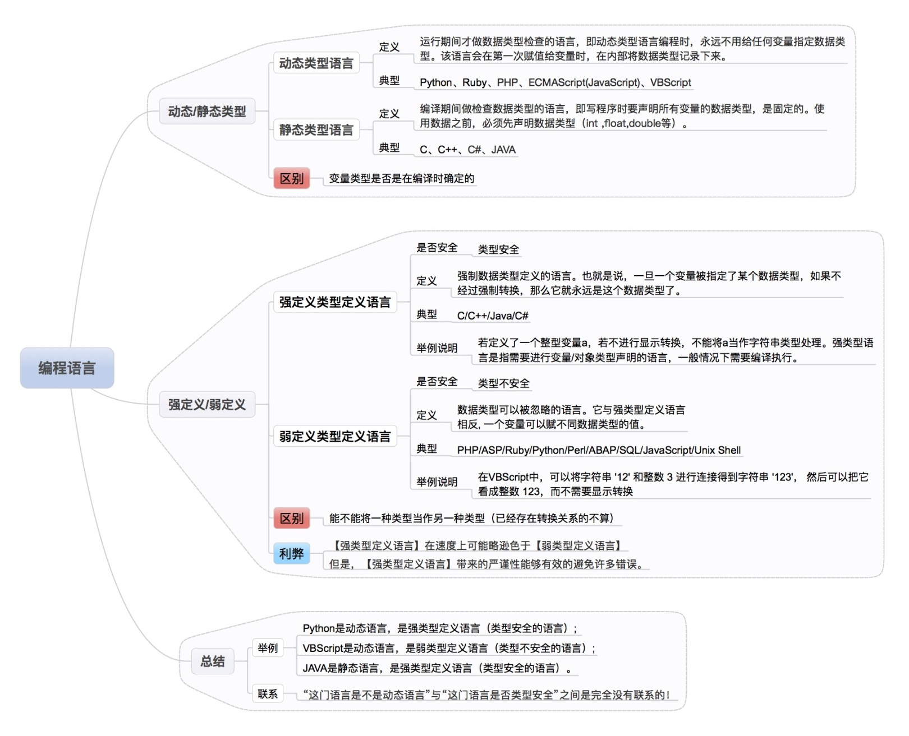
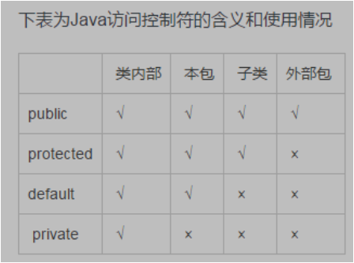

# 概述
在一些编程语言里，如 Java，很容易因为语言特性如`引用`的认知、使用错误，导致算法与数据结构正确的情况下题目解不出来或总是通不过测试却又找不出原因，或不懂得善用语言特性而无法使用简单的算法、数据结构与语言特性搭配来轻松解决问题（例子如`引用`配合`队列`）。  
以下列出在算法解题及面试中的 3 种常用编程语言的特性及它们的一些不同点。  
  
## Java 特性
[Java Core](./Java%20Core.gif) 在算法解题及面试中比较常用、重要的知识点有：  
* [集合](../Tool%20Sets/Collections.java)
* [异常](../HackerRank%20Practises/java/easy/Java%20Exception%20Handling.java)
* [并发](../Computer%20System%20Layer/并发与并行(Java)/)
* 日期与时间 [Example 1](../HackerRank%20Practises/java/easy/Java%20Date%20and%20Time.java)、[Example 2](../Tool%20Sets/Time.java)
* [IO](../Tool%20Sets/IO(Serializable).java)
* [反射](../HackerRank%20Practises/java/easy/Java%20Reflection%20-%20Attributes.java)
* [泛型](../HackerRank%20Practises/java/easy/Java%20Generics.java)
* [JVM](../Computer%20System%20Layer/JVM/)  
  
建议各种类、接口、API 多查看 [Java 官方文档](https://docs.oracle.com/javase/8/docs/api/overview-summary.html)  
另外，需熟记 [Java 的关键字](Java%20关键字.pdf) 以及 [Java 标准库](./Java%20标准库.md)  
  
## Python 特性
ToDo ...  
  
## C++ 特性
ToDo ...  
  
## 编程语言间的差别
有的的语言有组合数计算的 API，比如 Python、Go，有的没有比如 Java、C++。  

[弱类型、强类型、动态类型、静态类型语言及其区别](https://cloud.tencent.com/developer/article/1332131)  
  

To Be Continue ...  
  
### 内置工具对比
  
  
### Reference（引用）
错误例子：  
```java
void foo(String a) {
    a = new String('abc');
}

String a = new String('123');
foo(a); 
// Actually result to outside "a" is still '123' since java only support pass by value. 
// The "a" inside foo() is actually a copy (pass by value), 
// so foo(a) return 'abc' but ouside "a" still reference to '123', 
// inside "a" and outside "a" are different references.
```
  
**[重要] Pass By Value vs Pass By Reference:**  
* Java / Python always pass by value (比如 Java，即使传参是基础类对象如 Integer 也一样)
* C++ / C# support boths (比如 C++ 可通过设定参数为指针类型实现 Pass By Reference)  
  
对于 Java / Python 这类 always pass by value 的语言，如果想 pass by reference，可用以下方法：  
1. 使用 array / attribute（除了数组也许其他 collection 类型如队列也可以？）  
```java
void foo(String[] a) {
    a = new String[]{'abc'};
}

String[] a = new String[]{'123'};
foo(a); // then outside a[0] == 'abc'
```
2. 使用 class member（类成员）  
```java
public class A<T> {
    private T val;

    public A(T initVal) {
       val = initVal;
    }

    public void set(T newVal) {
       val = newVal;
    }

    public T get() {
       return val;
    }
}

public static void foo(A<String> a) {
   a.set('abc');
}

public static void main(String[] args) {
  A<String> a = new A<>('123');
  foo(a);
  System.out.println(a.get()); // a.get() => 'abc'
}
```  
  
以上参考：https://www.youtube.com/watch?v=BCIYdW73-kc  
  
### 运算符优先级
#### 基本规则
1. 一元运算符优于二元运算符
2. 乘除加减优于大部分运算符
3. 位运算优于逻辑运算

#### Java

[Java Operators](https://docs.oracle.com/javase/tutorial/java/nutsandbolts/operators.html)

|  类别   | 列表  |
|  ----   | ----  |
|  括号  | ()     |
|  前后缀与一元运算符  | ++, --, !, ~, +, - |
|  乘除加减  | *, /, +, - |
|  位移  | >>, << |
|  判断与比较  | >, >=, <, <=, ==,  |
|  位运算  | &, ^, \|, &&, \|\| |
|  逻辑运算  | &&, \|\| |
|  三元运算符  | ? : |
|  赋值  | =, +=, -=, ^=, >>= |


**面向对象和面向过程的区别**  
面向过程：将问题分解成步骤，然后按照步骤实现函数，执行时依次调用函数。数据和对数据的操作是分离的。  
面向对象：将问题分解成对象，描述事物在解决问题的步骤中的行为。对象与属性和行为是关联的。  

面向过程的优点是性能比面向对象高，不需要面向对象的实例化；缺点是不容易维护、复用和扩展。  
面向对象的优点是具有封装、继承、多态的特性，因而容易维护、复用和扩展，可以设计出低耦合的系统；缺点是由于需要实例化对象，因此性能比面向过程低。  


**可见性修饰符和数据域封装**  
Java 的可见性修饰符用于控制对类成员的访问。可见性修饰符包括 public、private、protected 和默认修饰符。  

  

*可见性修饰符可以用于控制对类成员的访问，也可以用于对数据域进行封装。*  
*数据与封装的含义是，对数据域使用 private 修饰符，将数据域声明为私有域。如果不使用数据域封装，则数据域的值可以从类的外部直接修改，导致数据被篡改以及类难以维护。使用数据域封装的目的是为了避免直接修改数据域的值。*  
*在定义私有数据域的类之外，不能通过直接引用的方式访问该私有数据域，但是仍然可能需要读取和修改数据域的值。为了能够读取私有数据域的值，可以编写 get 方法（称为读取器或访问器）返回数据域的值。为了能够修改私有数据域的值，可以编写 set 方法（称为设置器或修改器）将数据域的值设置为新值。*  


