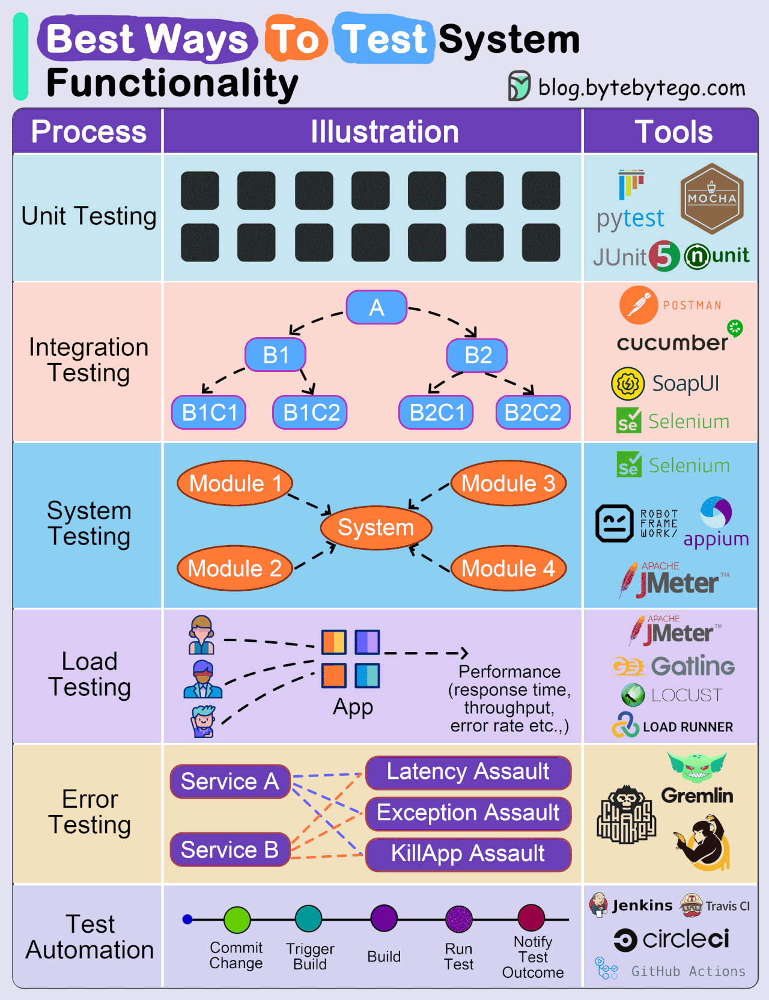
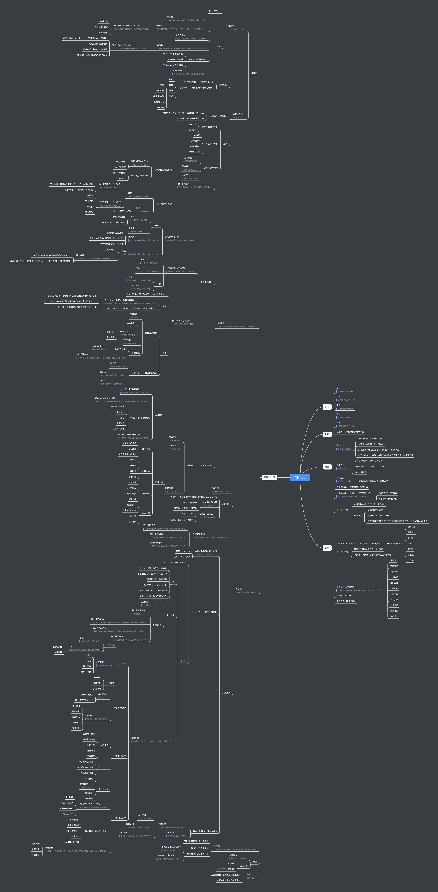
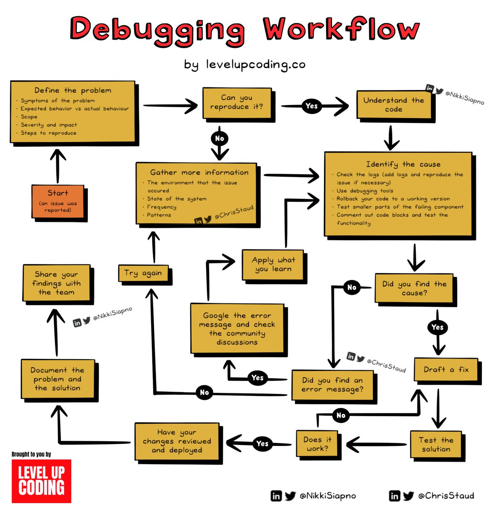
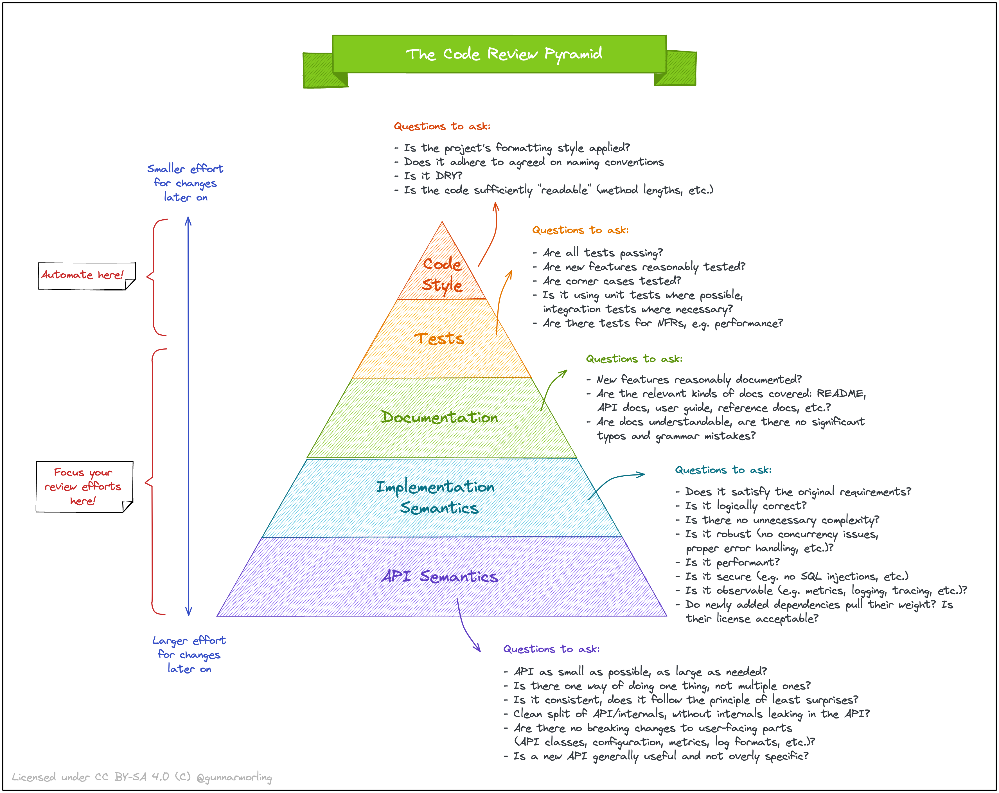
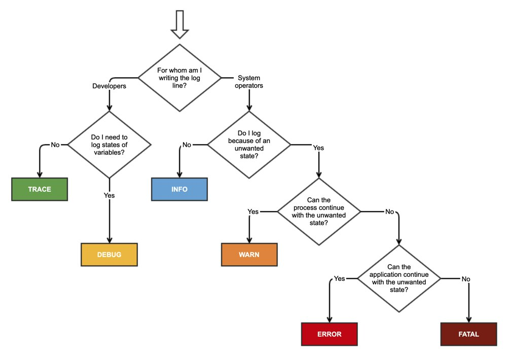
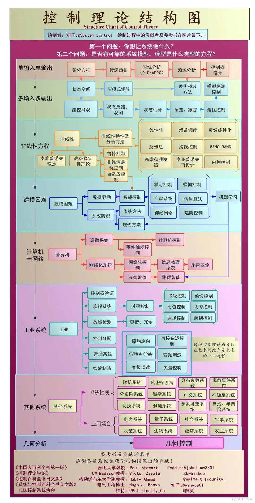
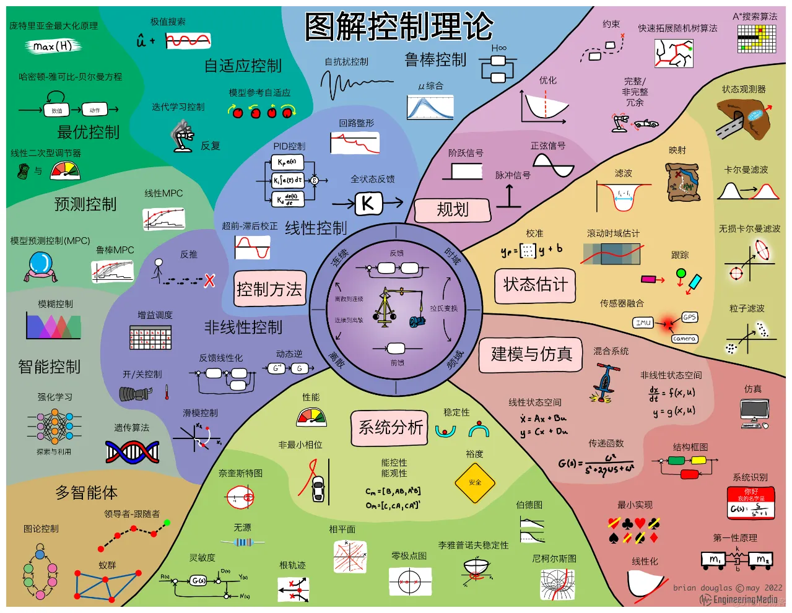

# Quality Assurance
在面试的 Take Home Project 或 OOD Exam 环节里经常会或多或少地考核代码质量以及测试相关，所以也需要特别注意。  
  

* 另外还有基准测试 benchmark，以 Go 为例子[参考](https://geektutu.com/post/hpg-benchmark.html)
* [灰度测试](https://www.woshipm.com/pd/4948376.html)

## 测试
### <代码整洁之道>
单元测试：
* 可读性（精简、足具表达力、避免重复 -- 比如如生产代码一样合理使用函数）
* 每个测试一句断言
  * 每个测试一个概念（比如一个测试一个独立功能）
* F.I.R.S.T
  * Fast - 测试代码可以快速运行
  * Independent - 测试之间相互独立（可以单独运行单个测试），一个测试不应为下一个测试设定条件
  * Repeatable - 测试应当可在任何环境中重复通过
  * Self Validating - 测试应该有布尔值输出（不应该依赖查看日志来确认是否通过）
  * Timely - 测试应及时编写（在生产代码之前编写）
* 测试覆盖度

### <软件测试>
* 测试基础
  * 黑盒测试和白盒测试
  * 静态测试和动态测试
* 测试文档

### <软件测试的艺术>
* 功能测试
* 系统测试
  * 性能测试（除逻辑正确性测试之外还需保证性能，比如压力测试）
  * 安全性测试
  * 可靠性测试
  * 兼容性测试

需要考虑的问题是：软件测试是否应先独立地测試每个模块，然后再将这些模块組装成完整的程序？还是先将下一步要测试的模块组装到测试完成的模块集合中，然后再进行测试？第一种方法称为非增量测试或 “崩溃 (big-bang)” 测试，而第二种方法称为增量测试或集成。不同于独立地测试每个模块，增量测试首先將下一个要测试的模块组装到前面已经测试过的模块集合中去。  
增量测试要优于非增量测试，主要原因如下：
* 非增量测试所需的工作量要多一些。
* 如果使用了增量测试，可以较早地发现模块中与不匹配接口、不正确假设相关的编程错误。这是由于尽早地对模块组合进行了集成测试。然而，如果采用非增量测试，只有到了测试过程的最后阶段，模块之间才能 “互相看到”。
* 增量测试，调试会进行得容易一些。
* 增量测试会将测试进行得更彻底。

非增量测试的优势则是如下：
* 非增量测试所占用的机器时间显得少一些。
* 模块测试阶段开始时，如果使用的是非增量测试，就会有更多的机会进行并行操作 (也就是说，所有的模块可以同时测试)。

### [混沌工程](https://principlesofchaos.org/zh/)
混沌工程（CHAOS ENGINEERING）是在系统上进行实验的学科, 目的是建立对系统抵御生产环境中失控条件的能力以及信心。  
可以把混沌工程看作是为了揭示系统弱点而进行的实验。破坏稳态的难度越大，对系统行为的信心就越强。如果发现了一个弱点，那么就有了一个改进目标，避免在系统规模化之后被放大。  
高级原则：
* 建立一个围绕稳定状态行为的假说
* 多样化真实世界的事件
* 在生产环境中运行实验
* 持续自动化运行实验
* 最小化爆炸半径

### Modern Best Practices for Testing in Java
* [资料](https://phauer.com/2019/modern-best-practices-testing-java/)

### Best Practices for Unit Testing in Java
* [资料 1](https://www.developer.com/java/best-practices-unit-testing-java/)
* [资料 2](https://www.baeldung.com/java-unit-testing-best-practices)

# Best Practice 工作实践
* 工程复杂性管理
  * UNIX 哲学
    * 一
      * 程序应该只关注一个目标，并尽可能把它做好
      * 让程序能够互相协同工作
      * 应该让程序处理文本数据流，因为这是一个通用的接口
    * 二
      * 永远不会知道程序会在什么地方耗费时间。程序的瓶颈常常出现在意想不到的地方，因此在确信找到瓶颈后再动手优化代码
      * 测试代码。只有在详细测试了代码，并且发现一部分代码耗费了绝大部分的运行时间时再对程序作速度优化
      * 复杂算法在处理小规模问题时效率很低，这是因为问题往往规模很小常量很大。除非知道遇到的常常是复杂的情况，否则就让代码丑陋但是简单而高效（即使问题规模确实很大，也首先尝试第二条规则）
      * 复杂算法比简单算法更容易产生 bug，更难实现。尽量使用简单的算法和数据结构（疑惑不定之时最适合穷举）
      * 数据决定一切。如果选择的数据结构能很好的管理数据，算法部分往往不言自明。记住，数据结构，而非算法，才是编程的关键
    * 三
      * 小即是美
      * 让程序只做好一件事
      * 尽可能早地建立原型
      * 可移植性比效率更重要
      * 数据应该保存为文本文件
      * 尽可能地榨取软件的全部价值
      * 使用 shell 脚本来提高效率和可移植性
      * 避免使用可定制性低下的用户界面
      * 所有程序都是数据的过滤器
    * 精简版：只做一件事，并做到极致。其实就是 SOLID 的 Single Responsibility，适用于广泛的软件日常设计，比如 OOD、系统设计、领域划分（如微服务职责、数据库表设计）、应用层级职责（如 controller 层不要写 SQL，repository 层不要写业务）
    * [Make It Work, Make It Right, Make It Fast](https://wiki.c2.com/?MakeItWorkMakeItRightMakeItFast) - first make it work, then make it right, and, finally, make it fast.
  * KISS 原则 - Keep It Simple, Stupid
  * 奥卡姆剃刀 - 如无必要，勿增实体；如果关于同一个问题有许多种理论、方案，人们应该选择假设最少的理论、方案，在没有证明假设之前，更应倾向于简单而非复杂。假设是非常有用的，但不正确的假设会产生灾难性的影响。系统越复杂，失败的概率就越高
    * 最后响应时刻 | Last Responsible Moment - 尽可能晚做决定，直到可以根据事实而不是不确定的假设和预测做出决定
    * 过度工程化 - 将产品设计得比其应用所需的更健壮或更复杂，过度工程的一个典型例子是有太多的抽象层；相反是过度简单设计，把复杂的问题和问题看得比实际简单得多，简单的软件设计可能只关注当前的功能需求，而忽略了某些非功能需求，如可维护性、可扩展性和可重用性
    * [YAGNI 原则](https://en.wikipedia.org/wiki/You_aren%27t_gonna_need_it) - You aren't gonna need it，不应添加任何功能，除非它被认为有必要；YAGNI 旨在与其他几种极限编程实践结合使用，例如持续重构、持续自动化单元测试和持续集成，如果没有持续重构，YAGNI 可能会导致代码混乱和大量返工，即技术债务
  * 模块化最佳实践
    * 接口优先设计 - 模块之间先定义接口，再写实现，且接口与实现分离
    * 分层清晰/模块边界清晰 + 限制依赖方向 - 模块之间只通过接口通信，不要跨层调用（例如 controller 不要直接调 SQL，repository，要走 service -> repository），不允许反向调用（比如 repository 反调 service），平层调用可以但要有限制，另外还有通用模块 util/pkg/helper 之类的虽然在最顶层也可以作为最底层模块被前面说的各个层级调用（但是要保持内聚、无业务逻辑、低依赖、轻量、抽象、可重用、明确分类，因为通用模块本身也可以分层、互相依赖所以其实模块内规范与前面其他层级一样）
    * 领域驱动设计（适合复杂业务）- 用领域对象表达业务规则，而不是散落在 if-else
    * 解耦第三方依赖 - 通过接口适配第三方系统
    * 横切关注点抽离（AOP 思想）- 认证、日志、监控、事务，不要散落在业务逻辑里，而是集中处理
  * [软件设计哲学 | A Philosophy of Software Design](https://go7hic.github.io/A-Philosophy-of-Software-Design/#/)
    * [降低软件复杂性一般原则和方法](./降低软件复杂性一般原则和方法.md)
    * 原书总结
      * 复杂性本质
        * 3 种分类：
          * **变更放大（修改扩散）：看似简单的变更需要在许多地方进行代码修改**
          * **认知负荷：为了进行更改，开发人员必须积累大量信息**
          * **未知的未知（不可知）：尚不清楚需要修改哪些代码，或必须考虑哪些信息才能进行这些修改**
        * 造成原因：一般是**依赖性和模糊性**。其中，依赖是指某部分代码不能被独立地修改和理解，必定会牵涉到其他代码。模糊性/代码晦涩，是指从代码中难以找到重要信息
        * 特性：复杂性是递增的
        * 抽象是实体的概览，它保留必要的信息，但忽略了可以放心地忽略的细节
      * 浅接口与深模块、拆分通用与专用
      * 封装与（信息）隐藏、减少模块间的联系与依赖（高内聚低耦合）- 反信息泄漏
        * 模块的拆分组合基于清晰的抽象边界而不是长度，该结构应最好地隐藏信息、产生最少的依赖关系
      * 不同的层采用不同的抽象（越底层越通用，越上层越专用），另外应尽可能将复杂性下沉（客户端更方便，服务端揽更多的活）
      * 避免直通方法（方法是减少重叠：拆分、组合或合并）与直通变量（方法是采用一个调用方不可写的全局上下文）
      * 配置参数在一些场景下是必要的，但其本质是提高复杂度而不是降低复杂度（减少配置的方法包括使用默认值、系统自身动态反馈调整等）
      * 通过定义规避错误 - 非必要不定义异常（尽量减少异常抛出，或采用归一顶级异常处理），异常和错误处理是造成软件复杂的罪魁祸首之一
      * 精准名称、显见逻辑（比如[约定优于配置](https://zh.wikipedia.org/wiki/%E7%BA%A6%E5%AE%9A%E4%BC%98%E4%BA%8E%E9%85%8D%E7%BD%AE)）、保持一致
      * 注释可以缓解认知负荷与未知的未知（注释也可以作为系统设计的工具，如果只需要简单的注释就可以描述模块的设计思路和功能，说明这个模块的设计是良好的。另一方面，如果模块很难注释，说明模块没有好的抽象），另外注释应该描述代码中不明显的内容
  * [软件复杂度](./软件复杂度.md)
  * [软件复杂性的三大定律](https://maheshba.bitbucket.io/blog/2024/05/08/2024-ThreeLaws.html)
    * 设计良好的系统会随着时间变得设计不良
    * 复杂性是一种护城河（由泄漏的抽象填充）
    * 软件复杂性没有根本的上限
  * 代码大全 | Code Complete [Ref 1](https://blog.codingnow.com/cloud/CodeComplete)、[Ref 2](https://book.douban.com/review/1075004/)、[Ref 3](https://www.cnblogs.com/janes/p/4506310.html)
    * 需求阶段
      * 发现错误的时间要尽量接近进入该错误的时间。由于需求是首先进行的活动，所以需求阶段引入的缺陷可能在系统中潜伏的时间最长，代价也更昂贵
      * 如果没有一个良好的问题定义，你努力解决的可能是一个错误的问题
      * 明确的需求有助于确保用户驾驭系统的能力、避免争论
      * 重视需求有助于减少开始编程开发之后的系统变更情况
    * 架构阶段
      * 大型系统的本质问题是维持其概念完整性
      * 好的架构设计应该与待解决的问题和谐一致
      * 架构应该描述所有主要决策的动机
      * 优秀的软件架构很大程度上是与编程语言无关的
    * 编程阶段
      * 简单性可以通过两种方式来获取：一是减少在同一时间所关注的本质性复杂度的量（比如一个循环只做一件事情），二是避免生成不必要的偶然的复杂度
      * 预料不同程度的变化
      * 好的设计都是迭代的（设计是一种启发式的过程，避免固执于某一种单一方法）
      * 自上而下和自下而上的设计方法
      * 避免使用缩写，或者谨慎地仅使用标准规范缩写
      * 合理的参数个数，上限大概在 7 个左右
      * 防御式编程：保护程序使其免受无效、错误输入的影响、破坏 - 具体可以为检查输入数据以及定义如何处理错误的数据
      * 结构体可以使得程序更简单、更容易理解，以及更容易维护
      * 组织直线型代码的最主要原则是按照依赖关系进行排列。如果代码之间没有顺序依赖关系，那就设法使相关的语句尽可以地接近
      * 表驱动法帮助厘清复杂的数据类型、关系模型与逻辑
      * 重视编程工具
      * 协同构建、结对开发有益于发现缺陷、提高效率、优化设计
      * [减少代码嵌套，手段：提前返回、空值判断、面向对象 / 结构体、表驱动法、高阶函数（链式写法）](https://www.youtube.com/watch?v=dzO0yX4MRLM)
  * 数学工具
    * [利用德摩根定律简化布尔运算](https://www.cnblogs.com/skychx/p/De-Morgan-laws.html)
  * [业务代码工程性与算法性的平衡](../README.md#算法的实用性)
  * [领域驱动设计 | DDD](https://tech.meituan.com/2017/12/22/ddd-in-practice.html)
    * **DDD 的核心诉求就是将业务架构映射到系统架构上，在响应业务变化调整业务架构时，也随之变化系统架构。而微服务追求业务层面的复用，设计出来的系统架构和业务一致；在技术架构上则系统模块之间充分解耦，可以自由地选择合适的技术架构，去中心化地治理技术和数据。**
    * [DDD 知识点](https://juejin.cn/post/7146116779905908772)
    * 解决复杂和大规模软件的武器可以被粗略地归为三类：抽象、分治和知识。
      * 分治 - 把问题空间分割为规模更小且易于处理的若干子问题。分割后的问题需要足够小，以便一个人单枪匹马就能够解决他们；其次，必须考虑如何将分割后的各个部分装配为整体。分割得越合理越易于理解，在装配成整体时，所需跟踪的细节也就越少。即更容易设计各部分的协作方式。评判什么是分治得好，即高内聚低耦合。
      * 抽象 - 使用抽象能够精简问题空间，而且问题越小越容易理解。
      * 知识 - 顾名思义，DDD 可以认为是知识的一种。DDD 提供了这样的知识手段，以确定如何抽象出限界上下文以及如何去分治。
    * 领域 - 现实世界中，领域包含了问题域和解系统。一般认为软件是对现实世界的部分模拟。在 DDD 中，解系统可以映射为一个个限界上下文，限界上下文就是软件对于问题域的一个特定的、有限的解决方案。
    * 限界上下文 - 一个由显示边界限定的特定职责。领域模型便存在于这个边界之内。在边界内，每一个模型概念，包括它的属性和操作，都具有特殊的含义。一个给定的业务领域会包含多个限界上下文，想与一个限界上下文沟通，则需要通过显示边界进行通信。系统通过确定的限界上下文来进行解耦，而每一个上下文内部紧密组织，职责明确，具有较高的内聚性。一个很形象的隐喻：细胞质所以能够存在，是因为细胞膜限定了什么在细胞内，什么在细胞外，并且确定了什么物质可以通过细胞膜。
      * 划分限界上下文的方法：实践是，考虑产品所讲的通用语言，从中提取一些术语称之为概念对象，寻找对象之间的联系；或者从需求里提取一些动词，观察动词和对象之间的关系；然后将紧耦合的各自圈在一起，观察他们内在的联系，从而形成对应的界限上下文。形成之后，可以尝试用语言来描述下界限上下文的职责，看它是否清晰、准确、简洁和完整。简言之，限界上下文应该从需求出发，按领域划分。
      * 集成限界上下文的方法：在进行上下文划分之后，还需要进一步梳理上下文之间的关系。根据康威定律，任何组织在设计一套系统（广义概念上的系统）时，所交付的设计方案在结构上都与该组织的沟通结构保持一致。
  * [后端复杂问题](./后端复杂问题.md)
  * [框架](./框架.md)
  * 数据抽象指只向外界提供关键信息，并隐藏其后台的实现细节，即只表现必要的信息而不呈现细节。是一种依赖于接口和实现分离的编程（设计）技术。
* [架构](./架构.md) - [推荐材料](https://promacanthus.netlify.app/computer-science/architecture/)
  * [架构、复杂度与三原则](./架构、复杂度与三原则.md) - 重点推荐，包括架构设计哲学、架构与框架的区别等等
  * 
* 问题解决软技能 [[1]](https://medium.com/@SantalTech/no-leetcode-the-stripe-interview-experience-cf1b29e6f55d),[[2]](https://plantegg.github.io/2018/05/24/%E5%A6%82%E4%BD%95%E5%9C%A8%E5%B7%A5%E4%BD%9C%E4%B8%AD%E5%AD%A6%E4%B9%A0V1.1/)
* [反面模式](./反面模式.md)
* [NASA 10 大编程原则](https://www.youtube.com/watch?v=GWYhtksrmhE)
  * Simple Control Flow
  * Limit All Loops
  * Don't use the Heap
  * Limit Function Size
  * Practice Data Hiding
  * Check Return Values
  * Limit the Preprocessor
  * Restrict Pointers Use
  * Be Pedantic
  * Test Test Test
* [极限编程 | XP](https://zh.wikipedia.org/wiki/%E6%9E%81%E9%99%90%E7%BC%96%E7%A8%8B) - 一种软件工程方法学，强调可适应性（有能力在项目周期的任何阶段去适应变化）而不是可预测性，因为软件需求的不断变化是不可避免的、很自然的现象
  * 价值排序
  * 风险排序
* 软件生命周期 - software development life cycle, how will you lead a project from end to end, how will you split the work amongst your peers etc.
* [约定式提交](https://www.conventionalcommits.org/zh-hans/v1.0.0/) - 包括 git 分支名、commit 内容格式等等

## 代码质量
### <代码整洁之道>
* 函数
  * 短小
  * 只做一件事（单一职责）
  * 每个函数一个抽象层级
  * 无副作用（比如封装、访问控制、输入输出参数 Immutable、时序性耦合等等）
  * 分隔指令与询问 - 函数要么做什么事（比如修改对象状态），要么回答什么事（比如返回对象的信息），两样都干通常会导致混乱（其实与下面的使用异常而非返回码一个意思）
  * 避免重复
  * 结构化编程
* 错误处理
  * 使用异常而非返回（错误）码
  * 给出异常发生的环境说明
  * 依调用者需要定义异常类
* 系统
  * 将系统的构造与使用分开
* 其他（[Ref 1](https://juejin.cn/post/7156754418929500168)）
  * 恰当使用注释 - 随着时间的推移，代码可能会变动，如果不及时更新注释，那么注释就容易产生误导，偏离代码的实际意义
  * 多用 return
  * 使用注解
  * 尽量不传递 null 值、尽量不返回 null 值
  * 有类型区分时定义好枚举
  * 远程接口调用设置超时时间
  * 用业务代码代替多表 join

### Google Java Style Guide
* [资料](https://google.github.io/styleguide/javaguide.html)
  * [翻译版](https://github.com/fantasticmao/google-java-style-guide-zh_cn)

### [Javadoc](https://www.cnblogs.com/linj7/p/14339381.html)
Javadoc 是一款能根据源代码中的文档注释来产生 HTML 格式的 API 文档的工具。  
只要在 java 源码中按一定的格式写注释，就可以利用 javadoc 这款工具自动生成配套的 API 文档。  

* Javadoc 注释分类 - Javadoc 注释根据写法和位置的不同，主要分为以下：
  * 写在类/方法上面的 Javadoc 注释
  * 写在字段上面的 Javadoc
  * 写在包上面的 Javadoc
* 文档标记 (block tags) - 常用的标签。文档标记常放于包/类/方法的 Javadoc 注释的第三段
  * `@author, @since, @version, @code, @return, @param, @value, @throws @exception, @link @linkplain @see, @deprecated, <pre>`, etc

## Debugging Workflow
  

### 根本原因分析 RCA
* [根本原因分析](https://aws.amazon.com/cn/what-is/root-cause-analysis/)  

## Code Review
  

## 日志打印最佳实践
  

## 发布
* [灰度发布](https://www.woshipm.com/pd/4381854.html) - 灰度，就是存在于黑与白之间的一个平滑过渡的区域。对于互联网产品来说，上线和未上线就是黑与白之分，而实现未上线功能平稳过渡的一种方式就叫做灰度发布。小产品（受众、流量较小）时使用灰度发布工程成本、迭代效率代价过高。
  * 实现方式
    * AB 实验
    * 正式上线流量控制
  * 兼容变更 vs 不兼容变更 - 比如 API 版本控制

### [AB 实验最佳实践](https://tech.meituan.com/2023/08/24/ab-test-practice-in-meituan.html)
注意不是所有的实验都会被证明对指标增长有显著效果，如果是这样，就没有必要进行实验了。因此对于实验失败（大概率事件）不要灰心，正因为某些实验被证明无效，才会找到有效的增长方式，最好的办法就是增加测试频率、持续测试，而非浅尝辄止，又回到经验决策或直觉拍板的旧思路上。  

## 系统工程（系统科学内容之一）
* [What is systems engineering](https://www.freecodecamp.org/news/what-is-systems-engineering/)
* [系统工程 wiki](https://zh.wikipedia.org/zh-hans/%E7%B3%BB%E7%BB%9F%E5%B7%A5%E7%A8%8B)

### 控制理论
https://zh.wikipedia.org/wiki/%E6%8E%A7%E5%88%B6%E7%90%86%E8%AE%BA  
  
  
