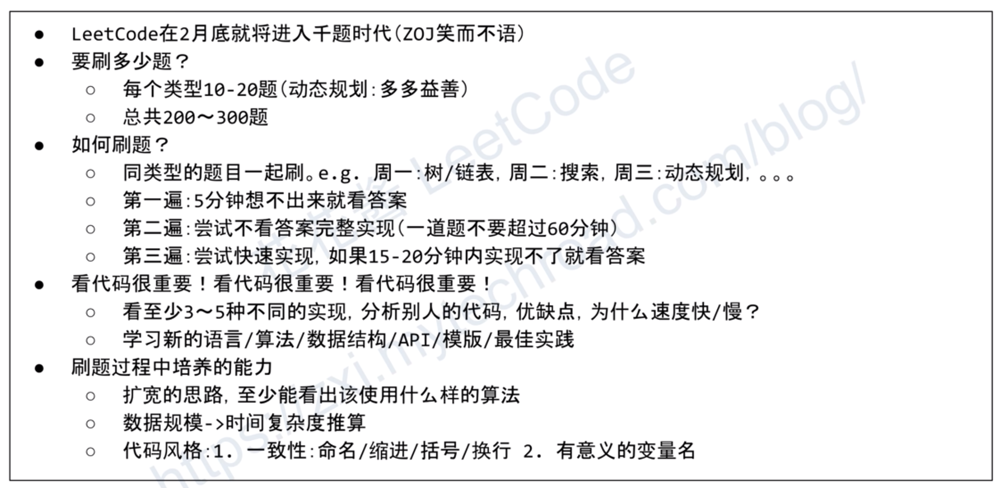

# data-structure-and-algorithm-study-note
  
*本项目仅为私人笔记而非任何盈利或正规项目，其中引用、摘录了学习过程中看过的大量的网络资料（所有引用与摘录皆有写明出处），若涉及版权问题烦请版权所有者不吝沟通以便解决此类问题，在这里提前说声抱歉。*  
*This repository is just a personal study note, but not any profitable or regular project. Contents may contains/quotes plenty of online materials I learned from (and all these contents are referenced with their source). Please contact me if there is any copyright issues. Sorry about that.*  
  
### 本笔记包括以下内容:  
* Books and Courses 
  * [算法导论 | Introduction to Algorithms](./Introduction%20to%20Algorithms/)
  * [程序员面试金典 | Cracking the Coding Interview](./Cracking%20the%20Coding%20Interview/)
  * [算法竞赛入门经典](./算法竞赛入门经典/)
  * [算法艺术与信息学竞赛](./算法艺术与信息学竞赛/)
  * [其他数据结构网课笔记](./其他数据结构网课/)
* [行为型问题与工作实践 | Behavior Question & Best Practice](./Behavior%20Question%20and%20Best%20Practice/)
* [Topcoder](./Topcoder/)
* [Codility Practices](./Codility%20Practices/)
* [HackerRank Practices](./HackerRank%20Practises/) (包括一些 [Java 语言实例解析](./HackerRank%20Practises/java/)、[Linux Bash](./HackerRank%20Practises/bash/))
* [Google Code Jam Practices](./Google%20Code%20Jam/)
* [Leetcode Practices](./Leetcode%20Practices/) (主要包含了[算法](./Leetcode%20Practices/algorithms/)、[SQL](./Leetcode%20Practices/database/)、[OOD](./Leetcode%20Practices/object%20oriented%20design/) 、[系统设计](./Leetcode%20Practices/system%20design/) 和 [API 设计](./Leetcode%20Practices/system%20design/System%20Design%20Fundamentals.md#api-design)；算法题第一次提交 round 1 是自己的首次解答方法，第二次提交 round 2 是进行复盘复习后并添加、理解他人的更优解以及增添其他语言解题实现，round 0 则是首次答题没头绪参考他人解题思路)
  * **[重点：分类分析套路](./分析套路.md)**
* [常用编码逻辑工具集查询手册 | Tool Sets](./Tool%20Sets/) (包括一些 Java 语言实例解析、非 Java 语言内置但是重要的数学工具等等)
* [常用算法及理论 | Common Algorithm & Theory](./Common%20Algorithm%20and%20Theory/)
* [常用数据结构、数据类型及其实现 | Common Data Structure & Data Type & Implementation](./Common%20Data%20Structure%20and%20Data%20Type/) (包括并发相关的数据结构的详解)
* [计算机数学 | Computer Science Maths](./Computer%20Science%20Maths/) (包括理论信息学如 [P/NP 问题](./Computer%20Science%20Maths/P%20vs%20NP%20vs%20NPC.md)，基础数学如[数学归纳法](./Computer%20Science%20Maths/Mathematical%20Induction.md)、[排列组合](./Computer%20Science%20Maths/Combinatorics.md)，以及算法常用数学工具、ACM 数论等等)
* [其他算法实践、真题、面经笔记](./Other%20Practices/)
* [计算机系统基础 | Computer System Layer & Basics](./Computer%20System%20Layer/) (包括一些 [CAS、并发相关的 Java 数据结构的用例与详解](./Computer%20System%20Layer/并发与并行(Java)/) 和 [SQL 数据库详解](./Computer%20System%20Layer/数据库)、[数据建模](./Leetcode%20Practices/system%20design/数据库数据建模分库分表.md#数据模型设计))
* [编程语言特性 | Programming Languages Features](./Program%20Languages%20Features/)
* [基础知识、面试八股文 | Domain Knowledge](./面试八股文/README.md)
  * [计算机术语表 | Related Terms](./面试八股文/英文术语.md)
* [标准认知能力测试 | Criteria Cognitive Aptitude Test](./智力测试/README.md)
* [其他类别岗位（如架构师、工程经理、安全工程师等）模拟面试 ｜ Other Position Interview Mock](https://www.youtube.com/@tryexponent/playlists)  
  
  
### 刷题技巧与笔记:
  
#### 看题
1. 确定完全看懂题目，题目描述若一下子不理解可先看下面的例子解释来结合理解，再不行建议主动向考官交流、咨询，另外细节与条件或限制也应该在一开始厘清：比如输入数据的集合大小范围、集合是否有顺序、集合内的每个元素的范围（是否有重复、是否正负）、题解是否规定时间复杂度或空间复杂度、输出是否允许重复或是否要求顺序、是否允许更改原输入集合等等。
2. 应留意及平时记住一些算法专业术语、题目描述术语，比如空间要求 in-place 即意为空间复杂度应为 O(1) 或原地修改。  
  
#### 首先看完题目先不要急着做，进行下述几个思考阶段先
1. （**重要**）发生在面试的最开始、影响整场面试体验，先理清题目是关于哪（几）个 Topic，**通常只要推测出 Tag、Topic 就可极大降低做题的难度，比如什么类型数据结构、算法相关？在这里总结了一套重要的可执行的套路方法来分析：[分类分析套路](./分析套路.md)**。通常若题目没有明显处理算法暗示或思绪提供时则可以考虑暴力破解（如遍历、回溯法、递归循环穷举法或 DFS、BFS 等），又或通过题目性能要求推测考点算法 - 比如要求性能达到 logN 时即很可能要使用二分搜索算法。（记住递归可以顺序也可以反序 - 如面试金典 9.2-2.5 进阶）。
2. 是否需要做一些[预处理](./Tool%20Sets/)，如排序，又或者先做一些额外预处理比如补零数位以及遍历至尾，在从尾部往回处理（如面试金典 9.2-2.5 进阶），又或者中间有一些不直观、麻烦但有规律的处理或输出可以采用语法糖比如 [Java Stream](./Tool%20Sets/Stream.java) 来灵活处理并使得代码紧凑简洁。这种情况往往出现在题目明显有违常规思路时，即总是有些条件、可能、边缘情况阻碍常规思路，意味着出题者可能是故意增加了一些难度需要解题者预处理。这些预处理工作即使看起来复杂且一开始不确定是否对解题有帮助也不妨试试，尽量按常规系统性方法解题（即上面所有 Leetcode 内的解题法分类如递归、动态规划等等，经验足够的话大的解题类方向通常一开始就可以定下来），可以分割困难，但不要苦思奇法。
3. 当题目已暗示可能要进行大规模输入检测题解效率时，可以考虑进行一些预处理、动态规划思路，例子如 Leetcode Q244。
4. (草稿时)引入一些[数学工具、模型](./Tool%20Sets/Math.java) - 如[状态机](./Tool%20Sets/FSM(DFA).java)等等有助于理清思路与解题(例子如 Leetcode Q309，KMP 算法实现)，辅助的数学思想还可以包括且不限于加减乘除(商、余数、取模)、开方、[指数](./Tool%20Sets/Math.java)、对数(例如 Leetcode Q818)、微积分(例如 Leetcode Q367 牛顿法)、[素数](./Leetcode%20Practices/algorithms/medium/204%20Count%20Primes.java)、[公约数](./Tool%20Sets/Math.java)、[公倍数](./Tool%20Sets/Math.java)、概率(例如 Leetcode 688)、阶乘/[组合数学](./Computer%20Science%20Maths/Combinatorics.md)(例如 Leetcode Q62)、数列(例如 Leetcode Q818)、坐标(例如 Leetcode Q149)、二元一次方程(例如 Leetcode Q149)、几何函数(sin、cos、tan)、[矩阵](./Tool%20Sets/Math.java)(例如 Leetcode Q311)、穷举法(例如 Leetcode Q818)、不等式、多项式、进位转换等等。
5. 有时有些题目未必是完整使用某个算法来解题，有可能只是使用该算法的一部分或其某个某些工具（例如 Leetcode Q459 Q1392 只使用 KMP 的 Partial Match Table）。
6. 有些问题或子问题未必需要使用正式的算法或计算处理（即使有适用的算法也未必是效率最好的），很可能仅需简单地 hard coding 一些预备数据（特别是当这些问题的可能的结果/子结果的集合是有限的、在不大的区间时），然后再基于这些预备数据简单处理一下即可给出答案（比如问题：随机产生多个 4 位数字的 PIN 码且每个码都是独一无二的且每个码都符合连续两位不能相同连续三位不能递增，其解决方案即 hard coding 一个包含所有合规的 PINs 的数组，然后再通过随机函数从中不重叠地选取即可，但是也有一些面试情况希望给出产生这些 PIN 的算法，见[实例](./Other%20Practices/15-05-2021%20pin%20generator/)）。此种方法也可与某些算法（如动态规划）结合使用。
7. 当一些题目要求在 O(N) 时间复杂度 O(1) 空间复杂度等苛刻条件内完成时，可能需要通过一些特别的适用于该题情况的方法（比如位运算）而不是先排序再处理或基于哈希表数组等工具的惯常做法（例如 Leetcode Q136 Q137）。又比如如何在 O(1) 的空间代价完成两两链表合并或反转，这个问题在面试中常常出现，为了达到空间代价是 O(1)，通常宗旨是原地调整链表元素的 next 指针完成合并或反转。
8. 数据结构之间有时可以互相切换，或者必要时候可以通过组合、改造那些常规数据结构来造一个更趁手的工具（比如 Leetcode Q12 里两个数组的组合可以近似一个哈希表而且更适应该题题况，又比如 Leetcode Q146 LRU Cache）。
9. 当解题时遇到要在循环里的一次同时处理几个同类子问题时，可以结合使用 BFS（队列）和 for 循环（length 为要同时处理的子问题的个数）来 mock 一个假同时处理（如 Leetcode Q994）。
10. 以空间换时间的思路。比如，程序循环重复对一组数据进行类似的重组、操作、改动（改动是引发下一轮重复类似重组的原因）（比如在每一次循环里对集合排序、使用数据并更改原集合里的某些数据），通常会使得性能受较大影响，此时可以考虑一下先扩展数据至所有可能性（把所有改动后的可能结果并集），然后再进行一次且仅一次的重组、操作（例如 [多处理器最小处理时间](./Other%20Practices/04-11-2021%20multiple%20processor%20schedule%20min%20time/Solution.java)）。
11. 还可以以空间换题解简化，比如将原来要处理的目标对象、集合（比如数组）做一次（或 N 次）镜像、复制 append，然后再写代码逻辑处理往往可以简化代码和思路的复杂度（如 Leetcode Q858 etc）。
12. 不要边写代码边思考，最好是先脑子想清楚再开始，从而减少实现时候的思路回滚，提高编码效率。另外就是养成习惯平时尽量简化代码。[刷题技巧](https://www.youtube.com/watch?v=Wknle1SAG6U)
13. 如果一开始实在没有思绪，比如不知道是什么 tag、topic 或解题方向，可以先尝试多写下来几个输入输出例子，边写边从主观上看看能不能发现一些规律。
14. 有些时候可以灵活使用编程语言的特性优化性能，比如指针/引用替换 (pointer/reference) 结合垃圾收集 (GC) 可以把原先 O(N) 的替换性能优化到 O(1)，比如 Leetcode Q102 Q199；但有时这样做也不一定有太多改善或反而使性能更差，比如 Leetcode Q127。
15. 有些题目甚至可以是通过结合设计模式解题，比如 Leetcode Q792 题解可以采用订阅发布设计模式。  
  
#### 编码时、做题中、Debug
1. 制作工具，即是否需要、可以把复杂或重复部分的逻辑、代码封装成一个函数。（大致方向已明晰的情况下，这样尤其有利于简化中间实现过程中一些中等的复杂、模糊的思绪）
2. 活用伪代码、注释行，以先画骨再填血肉的方式先把解题框架给出（系统、简单也有助于思考、理清思路）（甚至可以注释代替算法如递归，做题经验丰富后此方法较可行有益）。这在做题时遇到复杂题如思考二中遇到需要多项预处理且一开始不明朗是否有用的情况时有很大帮助。
3. 注意一些语言的相似数据结构的不同效率以及 performance，如 Java 的普通 Array 的时间及空间性能都会比 ArrayList 好很多。另外也注意某些语法糖的效率可能较原写法明显降低，如 Java 8 用一些 Lambda 写法就会慢很多（如 2ms 变成 90ms），尽管使用的算法本质是一样的，又如 Java 8 Stream 流操作（声明式编程）性能可能在某些情况下比不上原来的命令式编程、但可能又在另一些情况下比命令式编程性能更好（如某些情况下[并行优化](./Computer%20System%20Layer/并发与并行(Java)/OnJava8/ParallelPrime.java)、内存优化）。
4. 在没把握的前提下，先求解题而不先优化，比如递归很显然但迭代没头绪的情况下，优先使用显然的思路解题，除非题目要求用特定方法（但其实也可以先用显然方式理清思路再求转换）。
5. 关于错误：有时候错误可能只是少算一步而已比如 for 循环里是应 > 还是 >=；又或者是漏考虑一些边缘情况比如递归的最底部处理或赋予初创值比如 null；又或者语言特性犯错，比如 Java 的引用(reference)赋值并非复制因此更改赋值变量会使原变量也同时改变从而造成解题思路、逻辑没错但是 OA 就是不通过(尤其要小心 Java 引用搭配一些 loop 的语法糖比如 for(Object obj : objs)，因为该语句的 obj 与 objs 里轮循到的元素其实是同一个引用，任何对 obj 的后续改动就是改动 objs 里的该元素)，又比如 Java 早期版本不支持无符号数据类型导致相关题目用 Java 早期版本解题时要格外注意；又比如一些数据结构的特性导致，比如 Java 的 PriorityQueue 使用 while + poll() 出来的是排好序的，但是如果直接 for loop 遍历元素却可能是没排好序的，切记这类问题；又或者没有注意数据类型的限制，比如你初始化一些工具变量如整形数据，但算法题的测试用例参数可能会故意设置得很大导致程序中途因增值等操作使得数值会超出整形变量范围从而使算法程序得不到正确答案（其他数据类型也同理），此时写程序代码时就要注意变通思维，比如 x*x < y 可以写为 x < y/x 等等。还有一些时候错误是有关转义字符串的（尤其是涉及到正则表达式或字符串操作 split 等类似操作时，比如 Leetcode Q165），最好在做题之前或当中留意，因为 debug 时该类错误不容易发现。
6. 有时题解没通过测试时不用先急着怀疑是自己的基本思路错误，有可能只是需要再对一些 edge cases 做优化即可（例如 Leetcode Q214）。
7. 题解中的一些灵活小技巧，比如在某些情况下可以对 char 或 string 等非数学数据类型直接互相进行 +/- 操作，又比如链表、树图相关的使用 dummy 节点减少边界情况的处理，这些都可以减少代码里一些繁琐的逻辑、表达、判断、处理等等。
8. 尽量用工具类以省事（尤其在处理一些复杂组合的非基础算法题时），比如当前集合、容器（List、Set、Map）的内置方法，又比如 `int index = Collections.binarySearch(list, key);` [更多详见](./Tool%20Sets/Collections.java)。
9. 有些题目答案较大时会要求取模即可，要注意，有时计算中间的变量应使用 int 然后 % 1000000007（比如 Leetcode Q907），而有时中间变量则应使用 long 然后 % 1000000007L（比如 Leetcode Q2320），或者 MOD 也可以写成 `(int) 1e9 + 7` 或 `(long) 1e9 + 7`，建议所有情况还是使用 long 比较保险（比如 Leetcode Q823）。另外还要注意在中间计算时如果当前就有溢出风险时就要取一次模，但有时[一些情况下过早取模也会出错](https://blog.51cto.com/u_15067234/4216624)（比如：取模与其他计算操作顺序不正确，又或者用 max 比较很大数据时先取模等等）。对于除法取模，与加减乘法不同，因为有前次取模后值过小导致下次取模不能整除的风险，因此需要使用比较特别的数论技巧[基于费马小定理的乘法逆元](./Common%20Algorithm%20and%20Theory/取模运算.md)。
10. 一些算法编码时的最佳实践：
    * [使用 `grid[y][x]` 而不是 `grid[x][y]`，又或者可以命名为 `grid[r][c]`](https://www.youtube.com/watch?v=P50r4CDeUYw)
11. 注意一些基本包装类的对比，比如两个 Java Integer 可能值一样但是使用 `==` 时返回 false（有时返回 true），[具体参考](https://stackoverflow.com/a/4428779/6481829)，所以包装类对比时应该一致使用内置 equals 函数而不是 `==`，使用基本类型如 int、long、double 等等则不会有此问题。  

#### 面试、讲解、题解时
1. 注意有些专业术语的英语要表述正确：比如根号 M - square root of M 或 2th root of M； M^N - M to the power of N
2. 最好题解过程中，在面板上记录并模拟每一步的处理数据的动态、状态，因为比较直观和易懂甚至有助于发现思考时的盲点
3. 沟通尽量像日常沟通，尽量不冷场有助于面试官记录、有想法时可以直接问、与面试官互动 - 比如目前思路是否一个好的方向
4. 尽量编码清晰、最佳代码风格规范、编码速度尽量快，注重边界处理（预判），尽量有注释
5. 是否给出正确的解法，是否给出较优的解法，以及对 follow up 的预判
6. 可以开头问有几道题（比如有没有 follow up），简单题开始写代码后可以代码为主解释为辅（面试官可能默认只是热身、更多是期望快速解题，所以最好不要浪费时间）
7. [数据结构手绘、白板（文本文件）上绘图技巧](./白板绘图(数据结构手绘).md)

#### 预先准备
1. 预备一，熟用熟背常用模版比如[反转链表 | Leetcode Q92](./Leetcode%20Practices/algorithms/medium/92%20Reverse%20Linked%20List%20II.java)、[前缀树(字典树) | Leetcode 208](./Leetcode%20Practices/algorithms/medium/208%20Implement%20Trie%20(Prefix%20Tree).java)、[并查集与联合查找 | Leetcode 200 684 UF 解法](./Leetcode%20Practices/algorithms/medium/200%20Number%20of%20Islands.java)、[树状数组 | Leetcode 307](./Common%20Data%20Structure%20and%20Data%20Type/Data%20Structure%20Implementation/BinaryIndexedTree(FenwickTree)/README.md#树状数组实现)、[滑动窗口](./Common%20Algorithm%20and%20Theory/双指针法与滑动窗口算法.md)、[快慢指针 | Leetcode 142](./Leetcode%20Practices/algorithms/medium/142%20Linked%20List%20Cycle%20II.java)、[多路归并 | Leetcode 23](./Leetcode%20Practices/algorithms/hard/23%20Merge%20k%20Sorted%20Lists.java)、[单调栈 | Leetcode 503](./Common%20Algorithm%20and%20Theory/单调栈.md)、[树复原 | Leetcode 105 106](./Leetcode%20Practices/algorithms/medium/105%20Construct%20Binary%20Tree%20from%20Preorder%20and%20Inorder%20Traversal.java)、[穷举递增子序列 | Leetcode 491](./Leetcode%20Practices/algorithms/medium/491%20Increasing%20Subsequences.java)、[二分搜索 | Leetcode 34 2517 etc](./Common%20Algorithm%20and%20Theory/二分搜索.md)、[翻转树 | Leetcode 156 226](./Leetcode%20Practices/algorithms/medium/156%20Binary%20Tree%20Upside%20Down.java)、[线段树 | Leetcode 2286 307](./Leetcode%20Practices/algorithms/hard/2286%20Booking%20Concert%20Tickets%20in%20Groups.java)、[LRU 缓存 | Leetcode 146](./Leetcode%20Practices/algorithms/medium/146%20LRU%20Cache.java)、[拓扑排序 | Leetcode 210](./Common%20Algorithm%20and%20Theory/拓扑排序.md)、[Kadane 算法 | Leetcode 53](./Leetcode%20Practices/algorithms/easy/53%20Maximum%20Subarray.java)、[弗洛伊德算法 | Leetcode 1462](./Leetcode%20Practices/algorithms/medium/1462%20Course%20Schedule%20IV.java)、[Dijkstra 算法 | Leetcode 743](./Leetcode%20Practices/algorithms/medium/743%20Network%20Delay%20Time.java)、[滚动哈希](./Common%20Algorithm%20and%20Theory/滚动哈希.md)、[LCA | Leetcode 236](./Leetcode%20Practices/algorithms/medium/236%20Lowest%20Common%20Ancestor%20of%20a%20Binary%20Tree.java)、[扫描线 | Leetcode 218](./Leetcode%20Practices/algorithms/hard/218%20The%20Skyline%20Problem.java)，[多线程的方案集 A | Leetcode 1115](./Leetcode%20Practices/algorithms/medium/1115%20Print%20FooBar%20Alternately.java)，[多线程的方案集 B | Leetcode 1116](./Leetcode%20Practices/algorithms/medium/1116%20Print%20Zero%20Even%20Odd.java)，[红黑树](./Common%20Data%20Structure%20and%20Data%20Type/Data%20Structure%20Implementation/RedBlackTree/RBTree.java)，[最小生成树 | Leetcode 1135](./Leetcode%20Practices/algorithms/medium/1135%20Connecting%20Cities%20With%20Minimum%20Cost.java)，[模拟计算器 | Leetcode 772 227 etc](./Leetcode%20Practices/algorithms/hard/772%20Basic%20Calculator%20III.java)，[待补充...]() 等等。  
  
#### 题型技巧
查看[更多题型、细节技巧](https://github.com/yihaoye/data-structure-and-algorithm-study-notes/tree/master/Cracking%20the%20Coding%20Interview)  
  
  
#### 感想
要培养分治法（分而治之）的思维，把一个大的复杂困难的问题分解成多个小的较简单、直白的问题，原问题的解则由子问题的解的合并获得，这种思维在平时工作、生活中也很重要、实用。  
其实算法解题及其比赛绝大部分时候不是考验智商或灵光一现，考验的是系统性的学习（各种算法、数据结构、语言特性甚至设计模式）与训练（解题思路、解题技巧、解题方法论 - 面试金典、解题心态）。  
在 Leetcode 如何最快速的刷题（cspiration.com），第一次做题或初学者:   
1. 注重基础！注重基础！注重基础！（基础知识，可以边刷题边回头学、建立思维体系，然后可以再刷第 2、3、n 遍）
2. 按类型刷题、按顺序刷题(cspiration.com 的 Leetcode 分类顺序表)。
3. 直接看答案！看答案！看答案！（某些题可能必定使用某类数据结构或算法，但你很生疏或完全不会时，不要自负因为死磕只会无谓浪费时间，目的应在于熟练应用算法与数据结构而不是幻想自己能生造出来，而且基础扎实、刷题经验足、量变成质变后，面对新题时才容易下意识、直觉、快速找到正确思路以及最优解否则容易被陷阱、以为容易但被误导或能找出一个解决方案但性能不好）
4. 先做简单的题再做难题，因为有些简单题的题解可能是另一些稍难的题的工具之一（例如 Leetcode Q206 是 Q234 的工具），所以先做过前一道题有经验了，解后一道题时思路就容易清晰了。
5. 背经典算法、经典题。
6. 有人带会更快、其次才是自己上课、看书。（所有新知识学习皆如此）  
  
更多：  
  
花花酱刷题题目列表：https://bit.ly/2E8yBHq  
刷题或面试的[编程语言选择](./Program%20Languages%20Features/)：有传言 Google 的工程师说是尽量使用 C++ 和 Java 实现，另外一亩三分地上的讨论也是建议尽量使用 C++ 或 Java。  
**另外，如果离面试时间不是很紧或处于预备阶段时，应当注重做经典题以及定期参加周赛打好基础，若是已接近面试阶段时，可以使用 Leetcode 的各个公司板块各自高频题列表（如[谷歌高频题列表](https://leetcode.com/company/google/)）针对性地刷题，即使真实面试时出原题并不常见也仍有很大助益。**  
  
[养成 6 个习惯](https://www.youtube.com/watch?v=AvcJ9VcQweI)：  
1. 结构化（系统化、有条理地刷题，形成知识图谱）
2. 记笔记
3. 复习
4. 精益求精、深化理解（尽可能优化代码）
5. 没 BUG
6. 写代码速度快
  
[高效地刷 LC](https://www.youtube.com/watch?v=fyf-GRH1Ceo)：  
1. 不用全做，做過幾題後集中在想解題的算法即可，全作時間上不允許，要記得看討論看別人的解法
2. 主要集中做難度 medium 就可以了，因为 medium 會了 easy 通常也行了，而近年来 FLAG 等大公司也较少考 hard 了（就算考也是当 bonus，而且一般不要求最优解，可以暴力解出也就可以了）
3. 刷題集中在一種類型，自己強的類型可以解得快，自己弱的題目在高強度練習後可以有效加強
4. 重質不重量（不要觉得 LC 上已经有上千题但是自己只做了 300 多道就没自信，因为这种评判标准是不准确的，可以按公司标签的题库来做增加自信，近年来 G 家问 DP 问得较多）
5. leetcode 的解法並不見得是最好的，要參考別的網站解法（比如 github、stack overflow、geekforgeeks 等等。但是要注意 geekforgeeks 之類的網站有些解法根本是錯的）（面试很重要一環是 problem solving，所以學習找正確的答案也是培養這個技能的方法）
6. 設定時間，一題想解法不超過 5 分鐘（甚至 2、3 分钟），因為實戰你有的時間更少，解不了就看解答（主要看解题思路而不是代码，应该是看完思路自己想怎么写代码）
7. 多考慮 edge case，要有辦法回答时间空间复杂度
8. 解法不需要全會，通常會一種就行（保留意见，暴力解基本上都會被問有沒有辦法更好，看法是暴力解以外要會一種解法。對暴力解的看法是像是一個秘密武器，真的沒招了再拿出來使用）  
  
### LeetCode 需要的基础
> LC 需要的基础，实在是太广了，以最基本的来论，科班出身必学的两门课《数据结构》《算法分析》，能够覆盖到 70% 左右，但也仅限于此不能再多了。简单给大家说一下我们需要知道的基础：  
> 1，数据结构  
> 数据结构（低级的）：数组，链表，栈，队列，树，图，堆，HashTable 等  
> 数据结构（高级的，本科基本学不到）：线段树，树状数组，并查集，字典树等  
> 2，算法  
> 算法（低级的）：排序算法（八种），DFS，BFS，二分查找，回溯，分治，递归，动态规划，拓扑排序，贪心等  
> 算法（学校学不到的）：Sliding Window，扫描线算法（图形学），蓄水池算法，Flood Fill（图形学）等  
> 更难的其实也涉及到很多：KMP，马拉车等  
> 3，其他知识  
> 这还仅仅是算法和数据结构，那么还有别的知识：  
> 位运算（Bit），基础数据结构实现（LinkedList、Deque等实现），一些设计思想（Design），数学知识（Math），通配符，转义字符，记忆化搜索等。  
> 如果用的是 Java，其实别的语言也一样，Java 还有一些常用的数据结构：TreeMap，TreeSet，PriorityQueue，Deque 等  
> 以上的所有东西，全部都是 Leetcode 题目出现过的。  
> 如果是针对面试，有很多都是北美的，Google、Facebook 这种公司，会的还要更多：  
> Dijkstra，二分图，红黑树知识等；  
> Java 的基础：Heap 实现，HashMap，HashSet 具体区别等，equals、hashcode 重写等  
> 这些东西一样，都是曾经在面试中大量出现的，就是我们要会的基础。  
  
以上引用自：https://www.zhihu.com/question/30737325/answer/524120016  
  
### 面试里的综合型、组合考核
Google、Amazon 等各大中型公司技术面开始不再单纯地考核算法，而是抛出一个场景与需求，要求面试者先根据业务需求将其转化为程序的抽象设计，然后再具体实现，即把[面向对象设计](./Leetcode%20Practices/object%20oriented%20design/)与数据结构、算法一同组合起来考核（比如经典题 [LRU Cache](./Leetcode%20Practices/algorithms/medium/146%20LRU%20Cache.java)），其中可以注意几点：  
* 开始编码前要注重沟通，问清楚该业务场景下的所有需求 - 比如需要哪几个类/对象、类之间的关系如何（比如一对多、多对多关系，一个对象与另一个对象的某个属性之间的关系等等）；又比如哪个类/对象应该实现什么方法、该方法与其他类/对象有何种关系等等；又比如应该问某个属性/数据是否唯一、有什么数据类型偏好（有时可以从题目给定的接口中推断出来）。面向对象设计的过程就是抽象的过程，分以下三步来完成：第一步：发现类（需求中的名词有控制台、宠物、昵称和主人等）；第二步：发现类的属性（可作为属性的的名词有健康值、亲密度和品种等）；第三步：发现类的方法（需求中的动词有输入、选择和领养等）；[详细步骤](./Leetcode%20Practices/object%20oriented%20design/README.md#详细掌握-ood-的基本方法与步骤)。另外建议参考 [5C 解题法](https://www.youtube.com/watch?v=oaUVVBOhyJw&t=3340s)：  
  
* 类/对象之间的关系、类/对象的方法及业务场景下的延伸思考 - 应该使用何种数据结构来表达、连接、存储（比如用 Java Collection 作为容器来存储/管理某个类的对象或跨类对象的某几个属性时，若有多个数据结构均可以胜任时哪个性能更好（面试 FLAG、独角兽等这类企业时，要求较高，需时刻思考时间、空间复杂度是否最优）？比如在确认需要存储的数据不会发生重复的情况下，选择 Set 作为容器在性能上会好于 List。平时不要只关注某几个数据结构对其他数据结构不够熟悉）；有时在某些场景下直接使用内置的某个数据结构未必趁手可能需要自己重复造一个相同的数据结构（如[示例代码](./Common%20Data%20Structure%20and%20Data%20Type/数据结构组合/README.md#组合-1)），以及[多个数据结构如何组合](./Common%20Data%20Structure%20and%20Data%20Type/数据结构组合/)为好 - 学会根据面向对象设计的需求来组合数据结构以及多熟悉一些经典组合/最佳实践以及规避组合：比如尽量避免嵌套 Map。
* 面向类/对象设计的过程中，设计的优化思路可参考 [SOLID 原则](./Leetcode%20Practices/object%20oriented%20design/README.md) 和 [其他面向对象设计原则](./Leetcode%20Practices/object%20oriented%20design/README.md#其他面向对象设计原则)。
* 数据类型的深入思考 - 比如若有多个数据类型（比如 Integer 或 String）均可以胜任时该场景（比如存储在不同容器如 List 或 Set）下使用/搭配哪个更好；以及应不应该对多个数据结构的同一个属性（比如 userID）保持数据类型一致还是说可以允许转换数据类型即不同数据结构中的对应属性/关联键的数据类型不同。
* 理解、推测考核意图 - 比如提出考虑使用 UUID 生成 userID 但是考官询问是否有其他方法（比如简单的整数从零自增 userID++）时，并不是说考官认为在这里使用 UUID 不正确，而是可能考官只是想在接下来的延伸环节里考核多线程情景下的 userID++ 的线程不安全问题与解决方案而已（[UUID 是线程安全的](https://stackoverflow.com/questions/7212635/is-java-util-uuid-thread-safe)）。  
  
### 算法的实用性
实际工作中，因为多数开发是业务场景，通过算法优化程序性能的机会可能并不多，因为大部分时候使用的库、框架已经封装了最优解的算法与数据结构。当然在基础设施（如网络）、库开发、科研与实验（应用了数据科学）、高频使用各种算法的特定领域（如计算机图形、音频视频、通信等等）、安全与数据传输（加密解密、压缩解压）、系统底层或某些自定义模块（比如搜索模块、推荐系统、可视化、数据处理与分析、监控警报系统等等）的场景下，会使用最优的算法、数学和数据结构则非常重要了。另外业务代码的逻辑与性能里很多时候是应该先考虑设计好数据库数据建模、设计优良的 SQL 而不是先想着通过代码算法进行优化。  
领域算法例子如下：  
* 安全算法 - 摘要、加密
* 大数据处理 - 分治、布隆、外排 ...
* 分布式算法 - Paxos、Raft、ZAB、Quorum ...
* 负载均衡 - 经典 6 种（Nginx）
* 推荐算法 - 常见 8 种
* 数据挖掘 - top 10

相比数据结构与算法，实际工作中更多的性能优化是来自并发、异步编程（比如多线程与非阻塞逻辑、NIO）以及 SE（软件工程）、OOD（抽象化、设计模式）、系统设计相关的工程优化（比如程序尽量复用缓存如内存变量或 NoSQL 且减少重复的 IO 调用如外部 API 请求等等，以及架构、数据库操作优化等等）。  
  
### 进阶 ACM

展开

> 成为大牛还是菜鸟，还要看自己的努力程度，因为 ACM 是一个很漫长，很枯燥的路，因为别人在休息，玩的时候，自己可能在机房刷题目，学算法等等。见过很多人，从大一进入集训队，当时激情澎湃，热情似火，说很感兴趣，要达到什么什么高度。结果过了半年，一年，就受不了这个苦。兴趣，激情都被时间慢慢的磨灭了。  
> 而且 ACM 不是短期可以见到成果的，没有经过大量的题目训练，很难出成绩。所以，ACMer 都是耐得住寂寞的人，因为不得不放弃自己的业余时间，如果没有打算把自己大多数业余时间放在 ACM 上，那还是洗洗睡吧。  
  
> 高手建议：一般要做到 50 行以内的程序不用调试、100 行以内的二分钟内调试成功。ACM 主要是考算法的，主要时间是花在思考算法上，不是花在写程序与 debug 上。  
> 第一阶段：练经典常用算法，下面的每个算法给打上十到二十遍，同时精简代码，因为太常用，所以要练到写时不用想，10-15 分钟内打完。最短路(Floyd、Dijkstra、Bellman Ford)；最小生成树(先写个 prim，kruscal 要用并查集，不好写)；大数（高精度）加减乘除；二分查找(代码可在五行以内)；叉乘、判线段相交、然后写个凸包；BFS、DFS，同时熟练 hash 表(要熟，要灵活，代码要简)；数学上的比如辗转相除（两行内）、线段交点、多角形面积公式；调用系统的 qsort，技巧很多，慢慢掌握；任意进制间的转换。  
> 第二阶段：练习复杂一点，但也较常用的算法。二分图匹配（匈牙利），最小路径覆盖；网络流，最小费用流；线段树；并查集；熟悉动态规划的各个典型 LCS、最长递增子串、三角剖分、记忆化 dp；博弈类算法、博弈树、二进制法等；最大团，最大独立集；判断点在多边形内；差分约束系统；双向广度搜索、A*算法、最小耗散优先。  
> 第三阶段：前两个阶段是打基础，第三阶段是锻炼在比赛中可以快速建立模型、想新算法，这就要平时多做做综合的题型了。把 oibh 上的论文看看（大概几百篇的）；平时扫扫 zoj 上的难题，别老做那些不用想的题；多参加网上的比赛，感受一下比赛的气氛，评估自己的实力；一道题不要过了就算，问一下人，有更好的算法也打一下；做过的题要记好。  
> （一）不可能都完全记住那么多的算法。常用算法，拿过来就可以写出来。不常用的，拿起书来，看 10 分钟就能理解算法(因为以前记过)。对以前没有记过的算法就不好说了，难的可能要研究好几天。这样就可以了。应该熟练掌握的常用的算法应该有：各种排序算法（插入排序、冒泡排序、选择排序，快速排序，堆排序，归并排序）；线性表(一般的线性表、栈、队列)的插入和删除；二叉树的遍历（前序，中序，后序）；图的遍历（深度优先，广度优先）；二分法查找，排序二叉树，Hash 查找（处理冲突的方法）。  
> （二）分析一个东西，可以用不同的眼光去看待，有很多时候就跟自己生活一样，觉得小时候看待问题很幼稚，现在看问题全面了而且方式不一样了。为什么？就是成长吧，就跟这个一样的，你对算法比如写一个程序，可能直接写很简单，可是可以有一些有趣的方式，比如通过什么样来表达、怎么样更高效..等等。  
> （三）基本的专业课学扎实，如：数据结构，离散，操作系统等。碰到一些基本的数据结构和算法，如查找排序要根据原理马上能写出相应的代码就行了，个人是这样理解的，对于更深层次的东西，也是建立在自己熟练的基础之上的吧。  
> （四）《算法与数据结构考验试题精析》第2版 机械工业出版社 - 如果想练习的话，这里有 N 多的题可以来练习，但实际中能用到的比较少，除非搞一些高端的玩意，不过平时也可以在自己的项目中结合使用。  
> （五）数据结构在平时可能用不上，但数据结构可以培养写程序时注意效率的意识，一个学过数据结构的人和一个没有学过数结构的人写出来的程序可能在效率上有差别。  
> （六）搞 ACM 需要的掌握的算法，要注意，ACM 的竞赛性强，因此自己应该和自己的实际应用联系起来，适合自己的才是好的，有的人不适合搞算法，喜欢系统架构，因此不要看到别人什么就眼红。发挥自己的长处，这才是重要的。  
> 如果能掌握上面大部分算法，那也基本上达到了训练的目的，就可以选择自己比较喜欢的方面进行加深和强化。不要觉得看算法的证明是很麻烦的事，这可以加强思维能力，这在 ACM 中也很重要，ACM 的题目是没有范围的，只能在平时中多积累多练习，多比别人多努力一点就会比别人多一线希望。  
  
摘录自：  
https://www.zhihu.com/question/30377015/answer/71033131  
https://blog.csdn.net/qq_40688707/article/details/80602064  
  
#### ACM 的正确入门方式是什么
> 一般的入门顺序：  
> 1. C语言的基本语法(或者直接开C++也行，当一个java选手可能会更受欢迎，并且以后工作好找，但是难度有点大)，【参考书籍：刘汝佳的《算法竞赛入门经典》，C++入门可以考虑《c++ primer plus》，java选手可以考虑《think in java》or中文版《java编程思想》，请远离谭浩强...】可以选择切一些特别水的题巩固以及适应一下ACM中常见的输入输出格式...例如杭电著名的100题 [Problem Set](http://acm.hdu.edu.cn/listproblem.php?vol=11)  
> 2. 一些基本算法和数据结构(队列 栈 树 图 并查集 堆 DFS BFS 最短路 最小生成树 拓扑排序 动态规划 贪心 搜索 KMP 哈希 Trie AC自动机 快速幂 逆元 费马小定理 欧拉函数 素数筛 分解质因数)你可以找两个小伙伴一起分工合作，各自认领专题【参考书籍：刘汝佳《算法竞赛入门经典第二版》or《算法竞赛训练手册》，《算法导论》】这时候可以刷的题就多了，你可以选择一些专题进行突破，学习一下技巧 例如  
> [kuangbin带你飞](http://vjudge.net/contest/65959#overview)专题一 简单搜索  
> [kuangbin带你飞](http://vjudge.net/contest/66569#overview)专题四 最短路练习  
> [kuangbin带你飞](http://vjudge.net/contest/66964#overview)专题五 并查集  
> [kuangbin带你飞](http://vjudge.net/contest/66965#overview)专题六 最小生成树  
> [kuangbin带你飞](http://vjudge.net/contest/68966#overview)专题十二 基础DP1  
> [kuangbin带你飞](http://vjudge.net/contest/70017#overview)专题十四 数论基础  
> [kuangbin带你飞](http://vjudge.net/contest/70325#overview)专题十六 KMP & 扩展KMP & Manacher  
> [kuangbin带你飞](http://vjudge.net/contest/70326#overview)专题十七 AC自动机如果这些你和你的小伙伴都能熟悉掌握，并且能够尽快写出来，那么没有意外的话就可以在网络赛中拿到现场赛的门票（当然还得看出题人的风格...）  
> 3. 一些进阶的算法以及复杂一些的数据结构（树状数组 线段树 平衡树 后缀数组 二分图匹配 网络流 费用流 割点 桥 强联通 双联通 最近公共祖先 四大DP(数位dp 区间dp 状压dp 概率dp)  博弈论SG函数 ）  
> 【参考资料：各种博客......】  
> [kuangbin带你飞](http://vjudge.net/contest/66989#overview)专题七 线段树  
> [kuangbin带你飞](http://vjudge.net/contest/67418#overview)专题九 连通图  
> [kuangbin带你飞](http://vjudge.net/contest/68127#overviews)专题十 匹配问题  
> [kuangbin带你飞](http://vjudge.net/contest/68128#overview)专题十一 网络流  
> [kuangbin带你飞](http://vjudge.net/contest/70324#overview)专题十五 数位DP  
> [kuangbin带你飞](http://vjudge.net/contest/70655#overview)专题十八 后缀数组  
> [kuangbin带你飞](http://vjudge.net/contest/76505#overviews)专题二十一 概率&期望  
> [kuangbin带你飞](http://vjudge.net/contest/77874#overview)专题二十二 区间DP  
> 这些掌握之后在现场赛中拿到牌子应该就没什么问题了，发挥出色还能拿到银牌。。。不过如果遇到比较凶残的赛区...  
> 4. 这时候如果开始组队了，就可以去刷一些套题了，例如 [Contests - Virtual Judge](http://vjudge.net/contest#contestType=1&contestRunningStatus=3&contestOpenness=0&title=&manager=) 这里每一场比赛都是过去真实发生的录像，你可以 clone 之后和自己的队友一起实操一下。  
> 5. 更高深的技巧，更复杂的数据结构（树链剖分，动态树，可持久化线段树，DLX，后缀自动机，回文树，斜率优化/单调队列优化/四边形优化DP，插头dp，莫比乌斯反演......）这部分最能体现人与人的差异了...智商碾压一般就在这部分。而要想拿到金牌，一般来说这些知识都要尽可能掌握。【参考资料：各种论文，解题报告】这部分的题目比较杂，因此请自行去vjudge上查找....  
> 6. 同 4，并且中国国内的比赛如果已经满足不了你，你可以去 https://icpcarchive.ecs.baylor.edu/index.php 或者 [Gym - Codeforces](http://codeforces.com/gyms) 上找到全世界的区域赛的题目，不过题解就不怎么保证了...也许你会觉得性价比很低，学这么多东西，才"有可能”拿到牌子，但是收获的不一定是物质的牌子，还有学习过程的苦辣酸甜的经历（例如各种 WA TLE RE MLE 之后的一次AC），还有和基友一起并肩作战切套题的同甘共苦，而且还锻炼了自己的学习能力（善用百度，谷歌，维基百科）。  
> 再补充一下：这些算法都是说着容易，但是灵活搭配用起来难，然后还能在一定时间内写出来，并顺利通过数据测试拿到AC更难。  
> 由于大家手上的模板越来越强大，区域赛一般都不会出现裸的模板题了，一旦出现，肯定就是被大家骂回家的存在。所以在综合训练的过程中，尽量选择需要动脑的题目，不要一昧追求直接贴一个模板上来 AC 走人特别爽的题目。  
> 一般比较需要动脑的题目类型：贪心，动态规划（最好需要加上优化的），组合数学（推组合数公式，各种等价变换），图论（网络流，最短路，匹配）的各种建图过程。。。虽然说年轻人要少水群，多做题，才能进 Finals——kuangbin 但是一直闭门单刷也不是一件好事，还是要和大家多多交流心得，这样才能避免自己陷入一个瓶颈。  
  
以上摘录自：https://www.zhihu.com/question/51727516/answer/127265733  
  
#### 关于专业与业余的算法差距
> 先来看看算法比赛专业选手都做的是什么数据和算法吧！  
> 初级的算法是数论、二分、三分、线段树、树状数组、最短路、最小生成树、简单DP等。  
> 而中级算法则是树套树、划分树、AC自动机、离散化、RMQ、LCA、DFA、KMP、后缀树、博弈理论、网络流、二分匹配、连通图等（[更多参考](https://github.com/yihaoye/data-structure-and-algorithm-study-notes/blob/master/%E7%AE%97%E6%B3%95%E7%AB%9E%E8%B5%9B%E5%85%A5%E9%97%A8%E7%BB%8F%E5%85%B8/)）。  
> 至于高级的，则不是单纯的某一类算法或数据结构了。  
> 或者说高级的，已经不能成为算法了，而是一个实际的现实问题抽象简化而来，都是要使用多个数据结构和算法，综合运用来解决一道问题，以及使用更多数学知识（如[《具体数学》](https://zh.wikipedia.org/wiki/%E5%85%B7%E9%AB%94%E6%95%B8%E5%AD%B8)、[《数值分析》](https://book.douban.com/subject/26600495/)、[《离散数学》](https://book.douban.com/subject/6558200/)等等）。  
> 专业选手毕竟是专业化的人员，在解决各种算法问题的过程中，他们使得自己的分析问题能力、代码能力，查错问题能力得到很大的提高。  
> 分析问题能力可以让他们分析出一道题该如何解决（类似于工作中的项目或者问题，能够快速找找到解决方案）。  
> 而代码能力则是将解决问题的想法具体实现。  
> 查错问题能力则是在代码实现的过程中，发生了不符合预期的结果时，快速找到原因（比如发现原先的分析思路有误，重新分析问题），并最终解决问题。  
> 专业选手通过不断的训练自己，个人能力已经是我们这些业余选手远远不能想象的了。  
  
以上总结、摘录自：http://github.tiankonguse.com/blog/2019/06/26/algorithm-profession-and-amateur.html  

