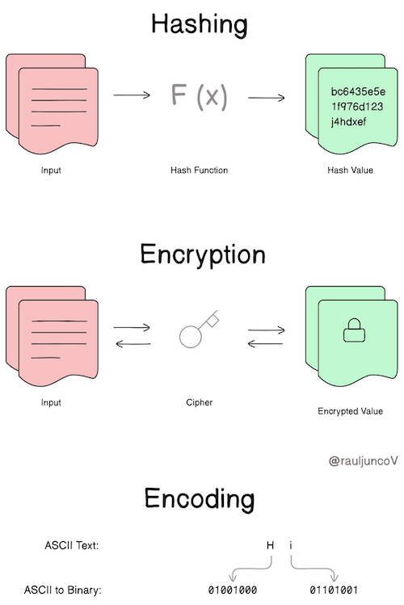
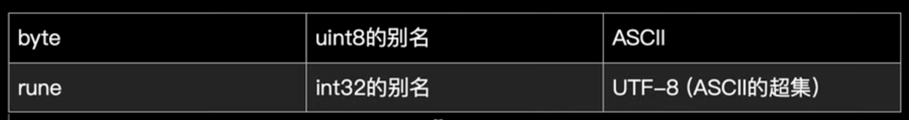
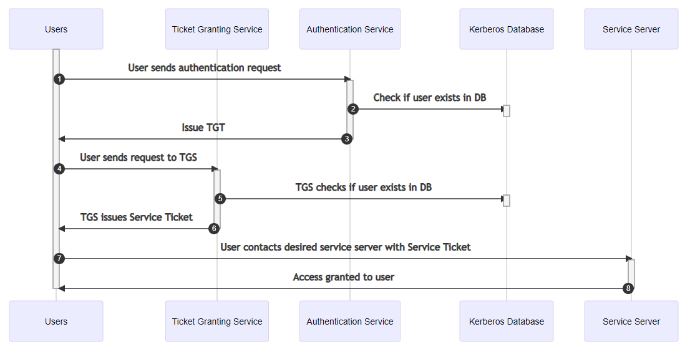
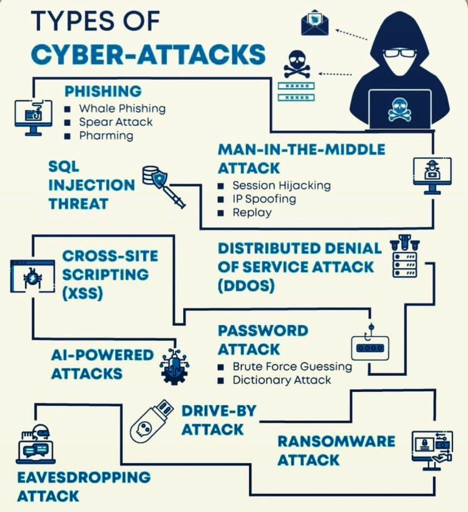
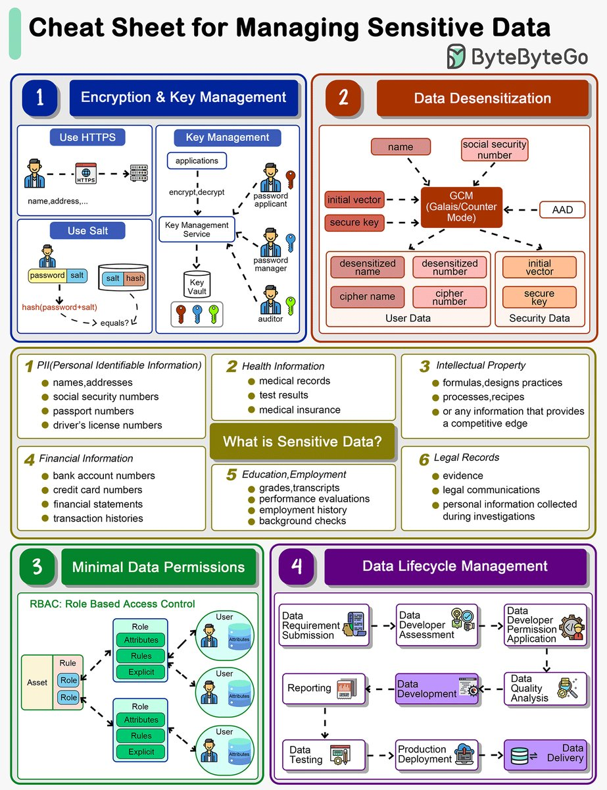

# 基础知识、面试八股文

## 如何回答基础知识问题？
1. 分点叙述：对于复杂的题目尝试分成几个要点，举个例子，题目：“从输入 URL 到展现页面的全过程” 涉及非常多细节和内容，面试回答的时候尝试分解成：  
   * URL 解析
   * 建立连接
   * 服务器处理请求
   * 客户端渲染
2. 先总后分：一个常见的错误是针对问题直接说出一大段内容，让面试官进行阅读理解找重点。正确的方式是应该根据总分结构，分点后先将要点的关键字说出来，让面试官对你接下来要讲的内容有一定的预期，然后再阐述对应的细节。
3. 选点阐述：要有侧重地从这些要点中选择一两个你比较熟悉的阐述细节，其他要点简单介绍即可。例如如果你最熟悉的是建立连接阶段（比如 TCP 连接以及 HTTP/S 连接，TCP 使用三次握手建立连接）

这种情况下，面试官会从你比较熟悉的点去进行延伸提问。  

## 设计模式、系统设计、DevOps 高频
* MVC 模型和 MVVM 模型的区别
* 简述常见的工厂模式以及单例模式的使用场景
* 如何在多线程环境下进行懒加载 - 使用双重检查锁（Double-Checked Locking）模式
* [线程池是如何实现的？简述线程池的任务策略](https://tech.meituan.com/2020/04/02/java-pooling-pratice-in-meituan.html)
* 简述 CAS 原理，什么是 ABA 问题，怎么解决？CAS（Compare and Swap）操作通常是由硬件层面提供的原子性指令来支持的，不同的处理器架构可能提供不同的 CAS 指令，例如 x86 架构上的 CMPXCHG 指令，这些指令允许在一个操作中比较内存中的值与预期值，如果它们相等，就将新值写入内存中。
* 自旋锁是什么？自旋锁是一种基于忙等待的锁，它的特点是线程在尝试获取锁时不会立即阻塞，而是会反复检查锁是否可用，如果锁已经被其他线程持有，线程会一直循环检查，而不是进入阻塞状态，自旋锁通常在锁的竞争情况较短暂且线程数不多的情况下表现良好。自旋锁通常使用 CAS（比较并交换）操作来实现。
* 什么是公平锁？什么是非公平锁？遵循 "先来先得锁" 的原则。
* 产生死锁的必要条件有哪些？如何解决死锁？
* [[微服務] 什麼是 gRPC，架構上為什麼要使用 gRPC](https://www.youtube.com/watch?v=qEB3yFzETVs)
* RPC 与 REST 区别与选择 - [解答一](https://www.cnblogs.com/wongbingming/p/11086773.html)、[解答二](https://zhuanlan.zhihu.com/p/102760613)、[服务调用 / API 设计](../Leetcode%20Practices/system%20design/System%20Design%20Fundamentals.md#API%20Design)
* 基于文本的数据格式如 JSON 为什么比一些二进制序列化格式会占用更多的空间？
  * 文本字符的额外开销：JSON 使用可读的文本字符来表示数据，这包括了各种标记、键、值以及字符间的分隔符号（如大括号、逗号、冒号等）。这些额外的字符和标记增加了数据的体积。
  * 数据类型表示：JSON 为了支持不同的数据类型（字符串、数字、布尔值等）而增加了额外的字符，比如字符串需要用引号括起来，数字和布尔值等需要明确标识。
  * 编码问题：相比于二进制编码（如 Protocol Buffers、MessagePack 等），文本编码（如 JSON）需要更多的字节来表示相同的数据（比如 UTF-8 包含一些非 ASCII 字符的数据时会占用更多的字节空间；压缩能力受限，通常用压缩算法例如 Gzip 来减少文本数据的大小，但是相比于二进制格式，因为文本格式的数据已经尽可能地被编码为文本字符，而这些字符可能已经被优化得足够好，因此在压缩时不能得到很大的优化空间）。
* [CI 服务有什么用途](https://www.modb.pro/db/404626)
* [服务降级、服务熔断](./../Leetcode%20Practices/system%20design/%E6%9C%8D%E5%8A%A1%E9%99%8D%E7%BA%A7%E4%B8%8E%E6%9C%8D%E5%8A%A1%E7%86%94%E6%96%AD.md)
* [态势感知](https://www.amazonaws.cn/en/knowledge/what-is-situation-awareness/)
* 云计算的定义 - 云计算就是指通过互联网，以按需服务的形式提供计算资源。这样企业就无需自行采购、配置或管理资源，而且只需要为实际使用的资源付费。本质上云计算就是第三方数据中心托管的一堆 Linux（或其他 OS）服务器。
* 哈希、加密、编码的区别 
* [SDN（软件定义网络）](https://www.cloudflare.com/zh-cn/learning/network-layer/what-is-sdn/) - SDN 通过将控制平面与转发平面分离，实现了网络的集中控制，从而可以灵活地控制网络流量，满足各种应用的需求，最终达成：提高系统的灵活性和可编程性、降低系统的管理和运维成本、提高系统的安全性。
  
## 编程语言
### Java 高频
* Java 中垃圾回收机制中如何判断对象需要回收？常见的 GC 回收算法有哪些？ （中等）
* HashMap 与 ConcurrentHashMap 的实现原理是怎样的？HashMap 为什么使用红黑树？[ConcurrentHashMap 是如何保证线程安全的？](https://github.com/JasonGaoH/KnowledgeSummary/blob/master/Docs/Java/ConcurrentHashMap%E6%98%AF%E5%A6%82%E4%BD%95%E4%BF%9D%E8%AF%81%E7%BA%BF%E7%A8%8B%E5%AE%89%E5%85%A8%E7%9A%84.md) （中等）
* ConcurrentHashMap 的写操作会对读操作产生性能影响吗？[1](https://stackoverflow.com/a/71805283/6481829)、[2](https://stackoverflow.com/questions/68968305/how-can-i-block-concurrenthashmap-get-operations-during-a-put)
* 简述 Java 的反射机制及其应用场景  （简单）
* [Java 所有锁细节](https://tech.meituan.com/2018/11/15/java-lock.html)
* Synchronized，Volatile（及其实现原理），可重入锁的不同使用场景及优缺点？synchronized 关键字实际上是基于操作系统的互斥锁（Mutex）来实现的；volatile 利用内存屏障（memory barrier）来实现可见性，它告诉编译器和处理器不要对 volatile 变量进行优化，确保变量的值总是从主内存中读取；可重入锁是一种高级锁机制，允许同一个线程多次获取同一把锁而不会造成死锁，Java 中的 ReentrantLock 和 synchronized 都属于可重入锁。
* [sun.misc.Unsafe](https://tech.meituan.com/2019/02/14/talk-about-java-magic-class-unsafe.html)
* [简述 Java BIO、NIO、AIO 的区别](https://tobebetterjavaer.com/nio/BIONIOAIO.html)  （困难）
* Java 类的加载流程是怎样的？什么是双亲委派机制？  （简单）
* JMM 中内存模型是怎样的？什么是指令序列重排序？  （中等）
* JVM 内存是如何对应到操作系统内存的？  （中等）
* Java 怎么防止内存溢出？避免创建不必要的对象、尽量重用对象，关闭不再需要的资源，分析堆内存、递归深度和 GC。
* Java 线程间有多少通信方式？
* [Java 中接口和抽象类的区别](../Leetcode%20Practices/object%20oriented%20design/README.md#何时使用抽象类，何时使用接口)  （简单）
* hashcode 和 equals 方法的联系？
* Java 常见锁有哪些？ReetrantLock 是怎么实现的？  （中等）
* ThreadLocal 实现原理是什么？每个线程都有自己的 ThreadLocalMap，它是一个哈希表，用于存储线程的局部变量。这个哈希表的键是 ThreadLocal 对象，值是对应线程的局部变量。
* 简述 Spring 的初始化流程（bean 的生命周期）？加载配置文件 -> 创建容器 -> Bean 的定义 -> Bean 的实例化 -> 依赖注入 -> Bean 的初始化回调 -> 应用程序使用 Bean -> Bean 的销毁回调 -> 容器关闭。
* 简述 Netty 线程模型，Netty 为什么如此高效？[高效的 I/O 模型](./../Leetcode%20Practices/system%20design/IO模型与Web服务器工作模型.md)以及零拷贝技术等等。
* [简述 Spring 的 IOC 机制？依赖注入](../Leetcode%20Practices/object%20oriented%20design/README.md)
* 简述 Spring AOP 的原理？核心原理是基于代理模式和动态代理技术，通过代理对象拦截方法调用并应用通知，以实现横切关注点的功能。
* 简述动态代理（在运行时动态生成代理类。动态代理不需要预先创建代理类的代码，而是在运行时使用反射等机制动态生成代理类）与静态代理（代理类的代码是在编译时期就已经生成的，它们在编译时与具体的目标类绑定）
* [Java IO](https://www.cnblogs.com/czwbig/p/10007201.html)
* [Java 注解原理](../Tool%20Sets/Annotation.java)
* [Java 编译部署](../Computer%20System%20Layer/编译部署/README.md)

### Golang 高频
* [什么是 golang 内存逃逸](./../Computer%20System%20Layer/内存与程序.md#内存逃逸)
* [go routine 和 thread、process 区别](https://huweicai.com/process-thread-goroutine/)
* panic 相关 - [panic](https://www.yiibai.com/go/golang-panic.html)、panic 和 recover：[Ref 1](https://draveness.me/golang/docs/part2-foundation/ch05-keyword/golang-panic-recover/) + [Ref 2](https://xiaomi-info.github.io/2020/01/20/go-trample-panic-recover/)
  * recover（对应 Java 的 try catch）等机制会将程序当前状态（主要是 cpu 的栈指针寄存器 sp 和程序计数器 pc，Go 的 recover 是依赖 defer 来维护 sp 和 pc ）保存到一个与 panic（对应 Java 的 throw）共享的内存里。当有异常的时候，从该内存中提取之前保存的 sp 和 pc 寄存器值，直接将函数栈调回到 sp 指向的位置，并执行 ip 寄存器指向的下一条指令，将程序从异常状态中恢复到正常状态。
  * recover 应且只能在 defer 里面用：[示例代码](https://go.dev/blog/defer-panic-and-recover)
  * panic 内部主要流程是这样：获取当前调用者所在的 g，也就是 goroutine -> 遍历并执行 g 中的 defer 函数 -> 如果 defer 函数中有调用 recover，并发现已经发生了 panic，则将 panic 标记为 recovered -> 在遍历 defer 的过程中，如果发现已经被标记为 recovered，则提取出该 defer 的 sp 与 pc，保存在 g 的两个状态码字段中 -> 调用 runtime.mcall 切到 m->g0 并跳转到 recovery 函数，将前面获取的 g 作为参数传给 recovery 函数。
* [go code examples](https://github.com/yihaoye/go-example/tree/master/general-demo)
* [上下文 Context](https://draveness.me/golang/docs/part3-runtime/ch06-concurrency/golang-context/)
* [Golang 的 select、defer、Context](https://github.com/yihaoye/go-example/blob/master/general-demo/README.md)
* [什么是 Go Scheduler](https://golang.design/go-questions/sched/what-is/)
* [GPM 是什么](https://golang.design/go-questions/sched/gpm/)
* goroutine 泄露 - 在应用程序中创建的 goroutine 没有正确地退出或释放资源，导致它们持续存在而不被使用，从而浪费了系统资源。为了避免 goroutine 泄露，需要确保在不再需要时正确退出 goroutine，并释放其占用的资源。这通常需要使用适当的控制机制，例如 context 包、sync 包中的 WaitGroup 或者通道来通知 goroutine 退出；[其余参考](https://alexstocks.github.io/html/lessons.html)
* [Golang unsafe 包](https://juejin.cn/post/6844903453303504910)
* Golang 字符型的实际类型 

## 数据库高频
* [为什么 InnoDB 表必须有主键，并且推荐使用整型的自增主键？](https://blog.csdn.net/weixin_41699562/article/details/104139458)
* [TSID for db Primary Key](https://vladmihalcea.com/uuid-database-primary-key/)
* ORM N+1 问题 - [解答一](https://segmentfault.com/a/1190000039421843)、[解答二](https://www.cnblogs.com/google4y/p/3455534.html)、[解答三](https://zhuanlan.zhihu.com/p/27323883)
* [MySQL 索引背后的数据结构及算法原理 / B+树](https://blog.codinglabs.org/articles/theory-of-mysql-index.html)
* [LSM 树](./../Common%20Data%20Structure%20and%20Data%20Type/Data%20Structure%20Implementation/LSMTree/README.md)
* [MySQL 中的 UTF8 和 UTF8mb4 编码的详细区别](https://cloud.tencent.com/developer/article/1930660)
* [什么是 SPL（structured process language）以及为什么基于 SQL 的复杂计算不那么直观](https://mp.weixin.qq.com/s/LHSlD4OJ_k4E_6gbI5OTFg)
* 什么是 Hive？- [解答一](https://zhuanlan.zhihu.com/p/25608332)、[解答二](https://dunwu.github.io/bigdata-tutorial/hive/hive-quickstart.html)
  * [Hive 优化](https://blog.csdn.net/Swofford/article/details/126651171)
  * [Hive 为什么不支持更新和删除](https://blog.csdn.net/zhulangfly/article/details/128904982)
* 关系数据库的 schema 意义 - 缺乏 schema 的最重要的劣势是数据完整性和一致性难以得到保证，另外就是 JOIN 操作必须基于 schema
* JOIN 操作的 2 个主要优点 - 提高效率（查询优化，减少数据库扫描的数据量）、降低成本（减少存储冗余）

### Redis 高频
* Redis 有哪些数据类型？可以应用在什么场景？[Ref 1](https://cloud.tencent.com/developer/article/1975464)、[Ref 2](../Computer%20System%20Layer/数据库/Redis/README.md)
* [Redis 的过期键的删除策略有哪些？](https://cloud.tencent.com/developer/article/1975464)
* [缓存穿透、缓存击穿、缓存雪崩是什么？怎么解决呢？](https://cloud.tencent.com/developer/article/1975464)
* [Redis 事务](https://pdai.tech/md/db/nosql-redis/db-redis-x-trans.html)
* [Redis 管道](https://redis.io/docs/manual/pipelining/)
* [AOF 持久化机制](https://zq99299.github.io/note-book/cache-pdp/redis/010.html#aof-%E6%8C%81%E4%B9%85%E5%8C%96%E6%9C%BA%E5%88%B6%E7%9A%84%E4%BC%98%E7%82%B9)
  * [AOF 重写机制](https://redis.io/docs/management/persistence/#log-rewriting) - AOF 重写会只保留当前缓存内的数据集

## Kafka 高频
* [System Design: Why is Kafka fast?](https://www.youtube.com/watch?v=UNUz1-msbOM)
  * 顺序 I/O
  * [Zero-Copy (DMA)](./../Leetcode%20Practices/system%20design/IO模型与Web服务器工作模型.md#零拷贝)
* [kafka 架构](https://cloud.tencent.com/developer/article/1853417)
* [如何确定当前能读到哪一条消息](https://cloud.tencent.com/developer/article/1853417)
* [Kafka consumer group](https://www.cnblogs.com/huxi2b/p/6223228.html)
* [Kafka 如何保证消息顺序性](https://cloud.tencent.com/developer/article/1839597)

## Flink 高频
* [流式计算核心概念](https://juejin.cn/post/7316591784623407130)
  * 数据流、数据源、消息队列
  * 窗口
  * 流处理模型，定义了如何对数据流进行处理和分析。流处理模型可以分为 2 种类型：事件驱动模型和时间驱动模型。事件驱动模型是基于事件的发生顺序进行处理的，而时间驱动模型是基于时间点进行处理的
  * 核心算法
    * 事件驱动
      * 基于状态的算法：这种算法将数据流分为多个窗口，并为每个窗口维护一个状态。当新的数据元素进入窗口时，算法会更新窗口的状态。当数据元素离开窗口时，算法会根据窗口的状态计算结果
      * 基于操作的算法：这种算法对数据流进行一系列操作，例如过滤、聚合、连接等。这些操作会改变数据流的结构和内容
    * 时间驱动
      * 基于时间窗口的算法：这种算法将数据流分为多个时间窗口，并为每个时间窗口维护一个状态。当时间窗口到达时，算法会根据窗口的状态计算结果
      * 基于时间触发的算法：这种算法会在特定的时间点进行处理。这些时间点可以是固定的，也可以是动态的
  * 中间存储，以及状态维护（是流式计算的关键组件，它用于存储和管理数据流的状态。状态可以是简单的键值对，也可以是复杂的数据结构，如树、图等）
  * 结果输出 - 数据库、下游等等
* [Flink Checkpoint 机制](https://tech.youzan.com/flink_checkpoint_mechanism/) - Flink 里 EXACTLY ONCE 的实现方法

## 统计、机器学习高频
* [七大最常见的机器学习面试问题：模型性能评估、过拟合/欠拟合、训练与评估数据分配、梯度下降、MLE 和 MAP（最大似然估计和最大后验估计）、Kernel、PCA 和 SVD/EVD](https://www.youtube.com/watch?v=j340MdN0QSY)
  * 过拟合（overfitting）是一种不受欢迎的机器学习行为，当机器学习模型为训练数据提供准确的预测而不是新数据时，就会发生这种行为。当使用机器学习模型进行预测时，首先在已知数据集上训练模型。然后，根据这些信息，该模型尝试预测新数据集的结果。过度拟合模型可能给出不准确的预测，并且无法对所有类型的新数据表现良好。过拟合产生原因包括：训练数据大小过小，并且未包含足够的数据样本，无法准确代表所有可能的输入数据值；训练数据包含大量不相关的信息，称为噪声数据；模型在单个数据样本集上训练的时间过长；模型复杂程度较高，因此其可以学习训练数据中的噪声。
  * 欠拟合（underfitting）是另一种错误类型，当模型无法确定输入数据和输出数据之间是否存在有意义的关系时，会发生这种错误。如果模型没有在大量数据点上进行适当时长的训练，则会获得欠拟合模型。
* [假阳性、假阴性、灵敏度、特异度](https://www.youtube.com/watch?v=Seje2u1fltQ)
* [机器学习高频概念：卷积、感知器、损失函数（极大似然估计、交叉熵、KL 散度）、激活函数（sigmoid、softmax）、梯度下降及其改良优化算法、反向传播算法、L1 L2 正则化、SVM 等等](https://www.youtube.com/watch?v=D641Ucd_xuw&list=PLxIHUhMHF8okwhq8poRuiHBChWjkVUHLL) - 其中 sigmoid 可以被认为是一种特殊的 softmax，简单来讲就是 sigmoid 用于单一分类（非此即彼或百分比/概率），softmax 用于多类的分类（A、B、C、D... 里其中一个或哪个百分比/概率更接近），选择哪一个本质上是要符合最大熵原理（使用工具如矩、特征函数、概率分布等），最大熵原理认为，在所有可能的概率模型/分布中，熵最大的模型是最好的模型/分布。
  * 反向传播（Backpropagation，意为误差反向传播，缩写为 BP）- 是对多层人工神经网络进行梯度下降的算法，也就是用链式法则以网络每层的权重为变量计算损失函数的梯度，以更新权重来最小化损失函数。
* [张量 tensor：rank、shape、type](https://zhuanlan.zhihu.com/p/48982978) - 在深度学习中，tensor 实际上就是一个多维数组，其目的是能够创造更高维度的矩阵、向量。
* [随机优化、批量 batch](https://www.jiqizhixin.com/articles/071502) - 使用批量训练有助于提高深度学习模型的训练效率、内存利用、并行计算、稳定性和泛化性能，使训练过程更高效、更稳定，并能够处理大规模数据。批量大小是一个超参数，通常需要根据具体任务和硬件资源来进行调整。较大的批量大小可能可以提高训练速度，但也会增加内存需求，因此需要权衡。
* [通道 channel](https://zhuanlan.zhihu.com/p/95573093) - 一般 channels 的含义是，每个卷积层中卷积核的数量；另一种解释是 channels 就是网络提取的特征数（模型的宽度），channel 越多特征越丰富，层深越深，细节越多。
* [学习率](https://zh.wikipedia.org/zh-hans/%E5%AD%A6%E4%B9%A0%E7%8E%87) - 每一轮深度学习（迭代）都是通过梯度下降进行一次参数优化一小步。学习率是一个超参数，控制了每次参数更新的步长或大小。它是一个重要的调整参数，如果学习率设置得太小，收敛速度可能会很慢，而如果设置得太大，模型可能会发散而不是收敛。通常，学习率的选择需要经过实验来调整。
* 迭代轮数 epochs - 训练一个深度学习模型通常需要多个迭代轮数，每个轮次都包括对整个训练数据的一次完整遍历。在每个迭代轮数中，模型的参数都会根据损失和梯度进行更新。迭代轮数的选择通常取决于许多因素，包括数据集的大小、模型的复杂性、学习率的设置、训练目标以及计算资源的可用性：一些深度学习项目可能需要数百轮迭代，而其他项目可能只需要几十轮。因此，没有固定的迭代轮数，它会根据具体情况而变化。
* 池化 pooling - 其本质，其实就是降采样，对于输入的 feature map，选择某种方式对其进行降维压缩，以加快运算速度。实施池化的目的：(1) 降低信息冗余；(2) 提升模型的尺度不变性、旋转不变性；(3) 防止过拟合。池化层的常见操作包含以下几种：最大值池化，均值池化，随机池化，中值池化，组合池化等。
* logtis - 在深度学习的上下文中，logits 就是一个向量，下一步通常被投给 softmax/sigmoid 的向量。logtis 可以看作神经网络输出的未经过归一化（softmax/sigmoid）的概率，所以将其结果用于分类任务计算 loss 时，如求 cross_entropy 的 loss 函数会设置 from_logits 参数。
* 为什么需要用 GPU 进行训练 - 训练多层的深度神经网络是深度学习的过程，这是机器学习的一个分支。训练深度神经网络时需要多个并行计算，GPU 在处理这些任务方面比CPU更有效。与 CPU 相比，GPU 的内核数量要多得多，可以同时进行更多的计算，对矩阵乘法和卷积具有极大的计算优势。深度神经网络训练需要数百万次计算，因此，这种并行性对于加速这一过程至关重要。另外 CPU 是延迟优化的，而 GPU 是带宽（内存）优化的。
* 工具、库（Pandas 和 PyTorch 有不同的用途和数据类型，但在某些任务中也可以结合使用。例如，在深度学习中，可以使用 Pandas 加载和准备数据，然后将其转换为 PyTorch 张量以进行模型训练。这种组合利用了两者的优势，以完成复杂的数据处理和深度学习任务）
  * Pandas - 用于数据清洗、数据转换、数据分组、聚合、索引和时间序列分析等数据操作任务。使用类似 SQL 的数据操作语法。处理的是表格型数据，通常是二维的数据结构，适用于处理表格、CSV 文件、SQL 数据库等。
  * [PyTorch](https://www.youtube.com/watch?v=KBdb53NrVAc&list=PLXO45tsB95cJxT0mL0P3-G0rBcLSvVkKH&index=6) - 用于构建和训练神经网络，进行图像处理、自然语言处理、深度学习模型研究等机器学习和深度学习任务。处理的是多维数组（张量），适用于处理数值数据，特别是在深度学习中广泛使用的张量数据。使用张量操作语法，类似于 NumPy，但具有自动微分功能，用于定义和优化神经网络。
  * 除此之外还有其他常用库如：scikit-learn/xgboost、Keras/TensorFlow（支持 Python）、NumPy、SciPy、matplotlib/seaborn（绘图可视化）等等。
* 网络的宽与深 - 更宽（每层隐藏层有更多的神经元）的网络更容易学习更多的线性关系，而更深（更多的隐藏层）的网络更倾向更多的非线性关系。哪个更好取决于数据集。
* [什么是归一化](https://paddlepedia.readthedocs.io/en/latest/tutorials/deep_learning/normalization/basic_normalization.html) - 归一化是一种数据处理方式，能将数据经过处理后限制在某个固定范围内。
* 管道 - 用于帮助自动化机器学习工作流程，能够简化工作，并在构建和部署机器学习模型时自动执行许多繁琐且耗时的任务，可以同时包括：自动化数据预处理、特征选择、模型训练、评估和部署步骤。
* 特征工程作用 - 对数据进行预处理如添加或转换（平方、分割、组合、映射、聚合等等）以匹配消除数据与模型的关系差距、提高模型的预测性能、减少计算或数据需求、提高结果的可解释性。
* 互信息 - 在概率论和信息论中，两个随机变量的互信息（mutual Information，MI）度量了两个变量之间相互依赖的程度。具体来说，对于两个随机变量，MI 是一个随机变量由于已知另一个随机变量而减少的 “信息量”（单位通常为比特）。互信息的概念与随机变量的熵紧密相关，熵是信息论中的基本概念，它量化的是随机变量中所包含的 “信息量”。
* 聚类算法 - 如 K-Means 等。分类是一种监督学习任务，其主要目标是将数据分为不同的类别或标签。即物以类聚，添加集群标签的动机是集群会将特征之间的复杂关系分解为更简单的块。然后，模型可以一一学习更简单的块，而不必一次学习复杂的整体，这是一种 “分而治之” 的策略。
* 主成分分析（Principal components analysis，PCA）- 是一种统计分析、简化数据集的特征工程方法，主要用于用于减少数据维度和去除冗余特征。它利用正交变换来对一系列可能相关的变量的观测值进行线性变换，从而投影为一系列线性不相关变量的值，这些不相关变量称为主成分。用例：降维、去相关、降噪、异常检查等等。
* 模型大小与推断速度 - 它们之间的关系通常是一个权衡问题。较小的模型通常需要更少的计算资源，因此在推断时可以更快地得出结果。然而，较小的模型可能会牺牲一些性能，因为它们可能无法捕获复杂的特征或模式。
* 结果模型的持久化 - 训练好的模型可以通过不同的方式进行持久化存储，以便在之后的时间点重新加载和使用。以下是一些常见的模型持久化存储方法：模型参数保存文件中（常见的格式包括 HDF5、TensorFlow 的 SavedModel、PyTorch 的 .pth 文件等）、模型序列化（将整个模型对象，包括权重、结构和训练配置保存到文件中，这通常用于保存完整的模型架构和状态）、ONNX 格式。另外还可以对存储压缩和优化，以及上传云存储和进行版本控制。
* [自动机器学习 AutoML](https://zh.wikipedia.org/wiki/%E8%87%AA%E5%8A%A8%E6%9C%BA%E5%99%A8%E5%AD%A6%E4%B9%A0) - 是将机器学习应用于现实世界问题的任务自动化的过程。自动机器学习可能包括从原始数据集开始到构建准备部署的机器学习模型的每个阶段。
* [联邦学习](https://zh.wikipedia.org/wiki/%E8%81%AF%E9%82%A6%E5%AD%B8%E7%BF%92) - 联合学习使多个参与者能够在不共享数据的情况下建立一个共同的、强大的机器学习模型，从而可以解决数据隐私、数据安全、数据访问权限和异构数据访问等关键问题（力求在保护隐私的前提下提高模型效果，比如在金融、医疗、政府中起到重要作用）。
* [OpenAI: New and improved content moderation tooling](https://openai.com/blog/new-and-improved-content-moderation-tooling)
  * [A Holistic Approach to Undesired Content Detection in the Real World](https://browse.arxiv.org/pdf/2208.03274.pdf)
* 图灵机与感知机的区别 - 图灵机是一种抽象的理论计算模型，旨在研究可计算性和算法的基本性质，是用于研究问题的可计算性、算法和计算理论的重要工具。感知机是一种最简单的人工神经元模型，用于处理二元分类任务，是一种线性分类器，通常用于解决线性可分的问题，通过学习权重来对输入进行二元分类。图灵机和感知机在概念和应用上是截然不同的，它们没有直接的关联或类似之处，图灵机是计算理论的基础，而感知机是机器学习领域神经网络的早期模型之一。
  * 图灵机 - 由一条无限长的纸带和能够读写纸带上符号的读写头组成。它具有有限状态的控制单元，可以根据当前状态和读写头所在位置的符号进行状态转移和符号的读写。通过这种方式，图灵机可以模拟各种算法，并解决各种可计算问题。其在某种程度上类似于状态机，但图灵机具有更强的计算能力，它可以模拟任何计算过程，并能解决一系列可计算问题，相比之下，一般的状态机通常用于描述特定系统或过程中的状态转换，其计算能力较为有限。
  * 感知机 - 接收多个输入，并为每个输入分配权重，然后将加权和传递给激活函数进行处理。通常，阈值函数用于激活输出（0 或 1）。感知机可以被用于简单的线性分类问题，并且可以通过训练来调整权重以更好地分类数据。
* [什么是 MLOps](https://aws.amazon.com/cn/what-is/mlops/)
* [特征/表征学习](https://zh.wikipedia.org/wiki/%E8%A1%A8%E5%BE%81%E5%AD%A6%E4%B9%A0)

## 硬件与操作系统（Linux & bash）高频
* [进程、线程、协程的区别](./../Computer%20System%20Layer/进程与线程.md)
* [Linux 基础知识](https://pdai.tech/md/devops/linux/linux.html)
* 锁的实现可以分为两大类：基于操作系统（软件）的锁和基于硬件的锁（比如 CAS 指令）。
  * 基于操作系统的锁：这种锁是通过操作系统提供的原语来实现的，例如 Linux 的互斥锁（mutex），Windows 的临界区（critical section）等。它们是在操作系统层面上实现的，通常会涉及到用户态到内核态的切换，因此相对来说比较重量级。[互斥锁的实现](https://www.zhihu.com/question/332113890)及相关[算法](https://zh.wikipedia.org/wiki/Peterson%E7%AE%97%E6%B3%95)。
  * 基于硬件的锁：这种锁是直接利用处理器提供的原语来实现的，最典型的就是 CAS（Compare and Swap）指令。CAS 指令是一种乐观锁，它尝试将一个变量的值与一个期望的值进行比较，如果相等就将该变量设置为一个新的值。如果失败，则说明其他线程已经修改了这个变量，需要重新尝试。由于 CAS 是在硬件层面上实现的，所以比基于操作系统的锁要轻量级，性能更高。
* [内存屏障](https://monkeysayhi.github.io/2017/12/28/%E4%B8%80%E6%96%87%E8%A7%A3%E5%86%B3%E5%86%85%E5%AD%98%E5%B1%8F%E9%9A%9C/)
* [Linux for Programmers](https://www.youtube.com/watch?v=ebHX9c75H8I&list=PLzMcBGfZo4-nUIIMsz040W_X-03QH5c5h)
  * `cat`、`rm`、`cd`、`mv`、`cp`
  * `ps`、`top`、`kill`
  * `ls -l`、`chmod` (permission)
  * 网络
    * `ssh` (用于远程登录到其他计算机，提供了安全的加密通信。可以在终端中运行远程命令)、`ssh-keygen`、`scp` (用于通过SSH在本地计算机和远程计算机之间复制文件。可以实现安全的文件传输)、`curl` (可发送 HTTP/HTTPS、SFTP、FTP 等协议的网络请求)、`wget` (用于从网络下载文件)
    * `ifconfig` 或 `ip` (用于显示和配置网络接口的信息，包括 IP 地址、子网掩码、广播地址等)、`netstat` (用于显示网络连接、路由表、接口统计、网络协议统计等信息。可以帮助查看当前网络连接和端口状态)、`ping`、`traceroute` (用于跟踪数据包从本地主机到目标主机的路径)、`route` (Manages IP routing table)、`iptables` (用于设置和管理 Linux 防火墙规则，可以控制网络流量和安全)、`nslookup` (用于查询域名系统 DNS 信息，可以查找域名的 IP 地址以及反向查找 IP 地址对应的域名)、`hostname` (Displays or sets the system's hostname)、`arp` (Manages ARP cache)
  * `crontab` (i.e. cronjob)、[sleep](https://linuxize.com/post/how-to-use-linux-sleep-command-to-pause-a-bash-script/)
  * [Linux 中最重要的 3 个命令，均为文本操作（因为 Linux 一切皆文本）](https://zhuanlan.zhihu.com/p/110983126)
    * [grep（更适合单纯的查找或匹配）](https://juejin.cn/post/7069591460730896414#heading-21)
    * [sed（更适合编辑匹配到的文本，取行和替换）](https://juejin.cn/post/7069591460730896414#heading-22)
    * [awk（功能最强大，但也最复杂，简单来说就是把文件逐行的读入，以空格为默认分隔符将每行切片，切开的部分再进行各种分析处理）](https://juejin.cn/post/7069591460730896414#heading-23)
* [bash 文件管理命令](https://juejin.cn/post/7069591460730896414#heading-38)
* [bash 网络通讯命令](https://juejin.cn/post/7069591460730896414#heading-67)
* [bash 系统管理命令](https://juejin.cn/post/7069591460730896414#heading-73)
* [profile 与 bashrc 与 bash_profile 区别](https://zhuanlan.zhihu.com/p/405174594) - /etc/profile 文件用于设置系统级的环境变量和启动程序，不建议在此添加环境变量；bashrc 文件有两种级别，系统级的位于 /etc/bashrc 对所有用户生效，用户级的位于 ~/.bashrc 仅对当前用户生效，每次新打开一个终端窗口时都会执行；.bash_profile 仅在用户登录时读取一次，用于设置一次性的环境变量和启动会话所需的全局设置。
* [Linux 目录结构](https://zhuanlan.zhihu.com/p/496602829)
* [Linux 网络命令大全](https://juejin.cn/post/6844903844267180039)
* [Linux 使用的进程间通信方式](https://juejin.cn/post/7069591460730896414#heading-9)
* [Linux 有哪些系统日志文件](https://juejin.cn/post/7069591460730896414#heading-10)
* [什么是 root 帐户](https://juejin.cn/post/7069591460730896414#heading-13)
* [Linux 常用 bash 命令](https://www.cnblogs.com/savorboard/p/bash-guide.html)
* [Bash 脚本教程](https://wangdoc.com/bash/)
* [The 50 Most Popular Linux & Terminal Commands](https://www.youtube.com/watch?v=ZtqBQ68cfJc)
  * ln (create hard/soft link)、open、date、piping (i.e. |)
* [硬链接和软链接](https://blog.csdn.net/LEON1741/article/details/100136449)
* [实时监控日志文件](https://blog.csdn.net/rlnLo2pNEfx9c/article/details/122852275)
* [systemd / systemctl](https://www.youtube.com/watch?v=5JVBpXiYMKo)
* [NIO 相关基础](../Leetcode%20Practices/system%20design/IO模型与Web服务器工作模型.md)
* 多路复用 - 多路复用是指使用一个线程来检查多个文件描述符（Socket）的就绪状态，比如调用 select、poll、epoll 函数，传入多个文件描述符，如果有一个文件描述符就绪，则返回。
* [eBPF](https://ebpf.io/what-is-ebpf/)
* [eBPF 使用](https://zhuanlan.zhihu.com/p/480811707)
* [文件系统：FAT、NTFS 和 Ext3 区别](https://learn.lianglianglee.com/%E4%B8%93%E6%A0%8F/%E9%87%8D%E5%AD%A6%E6%93%8D%E4%BD%9C%E7%B3%BB%E7%BB%9F-%E5%AE%8C/30%20%20%E6%96%87%E4%BB%B6%E7%B3%BB%E7%BB%9F%E7%9A%84%E5%BA%95%E5%B1%82%E5%AE%9E%E7%8E%B0%EF%BC%9AFAT%E3%80%81NTFS%20%E5%92%8C%20Ext3%20%E6%9C%89%E4%BB%80%E4%B9%88%E5%8C%BA%E5%88%AB%EF%BC%9F.md)
* [inode](https://www.ruanyifeng.com/blog/2011/12/inode.html)
* [虚拟内存](https://learn.lianglianglee.com/%e4%b8%93%e6%a0%8f/%e9%87%8d%e5%ad%a6%e6%93%8d%e4%bd%9c%e7%b3%bb%e7%bb%9f-%e5%ae%8c/24%20%20%e8%99%9a%e6%8b%9f%e5%86%85%e5%ad%98%20%ef%bc%9a%e4%b8%80%e4%b8%aa%e7%a8%8b%e5%ba%8f%e6%9c%80%e5%a4%9a%e8%83%bd%e4%bd%bf%e7%94%a8%e5%a4%9a%e5%b0%91%e5%86%85%e5%ad%98%ef%bc%9f.md)
* [Interview best 20 questions on OPERATING SYSTEM](https://leetcode.com/discuss/interview-question/operating-system/3816083/Interview-best-20-questions-on-OPERATING-SYSTEM)
* 操作系统内核是什么？有什么基本能力？
  * 管理进程、线程，决定哪个进程、线程使用 CPU，也就是进程调度的能力；
  * 管理内存，决定内存的分配和回收，也就是内存管理的能力；
  * 管理硬件设备，为进程与硬件设备之间提供通信能力，也就是硬件通信能力；
  * 提供系统调用，如果应用程序要运行更高权限运行的服务，那么就需要有系统调用，它是用户程序与操作系统之间的接口。
* 管道和流的区别 - 管道通常用于多进程间的通信，因为进程之间不共享内存。流通常用于同一进程但可以是多线程的数据的输入和输出，它是一种连续的数据传输方式。
* 进程间通信（IPC）的机制 - 如管道、套接字、消息队列、共享内存等。
* 芯片微架构与指令集 - 所谓微架构说白点就是 CPU 硬件图纸，设计这里有几个晶体管，那里怎么连接晶体管。核心对应的是逻辑图，是一种逻辑关系，微架构是逻辑关系的硬件实现（把逻辑门转换为硬件设计）。指令集是机器代码和硬件功能的对应，比如 x86 的指令集中 010110 代表把 a 和 b 加起来，而 arm 指令集 10011 代表把 a 和 b 加起来。编译器，你在电脑上敲的代码 a+b 是高级语言，x86 对应编译器把 a+b 翻译为 a 010110 b，arm 编译器则翻译为 a 10011 b，然后给对应的 CPU 看。所谓的 soc 整合设计，一个芯片，上方放 4 个 A75 cpu 下方放 8 个 mali gpu 左边放内存右边放 dsp，然后拿塑料片盖上。[链接](https://zhuanlan.zhihu.com/p/19893066)
* 内存的读取速度通常不会因内存大小增加而变慢，内存速度受到访问内存的硬件和体系结构的限制，而不是内存容量本身。SSD 的随机读取时间复杂度通常可视为接近 O(1)。
* [写入放大](https://zh.wikipedia.org/zh-hans/%E5%86%99%E5%85%A5%E6%94%BE%E5%A4%A7) - 是闪存和固态硬盘（SSD）中一种不良的现象，即实际写入的物理资料量是写入资料量的多倍。
* [运行时](https://www.zhihu.com/question/20607178/answer/2133648600)
* [GCC 优化](https://www.linuxjournal.com/article/7269)
* [SSH 进阶技巧](https://plantegg.github.io/2019/06/02/%E5%8F%B2%E4%B8%8A%E6%9C%80%E5%85%A8_SSH_%E6%9A%97%E9%BB%91%E6%8A%80%E5%B7%A7%E8%AF%A6%E8%A7%A3--%E6%94%B6%E8%97%8F%E4%BF%9D%E5%B9%B3%E5%AE%89/)
  * [A Visual Guide to SSH Tunnels: Local and Remote Port Forwarding](https://iximiuz.com/en/posts/ssh-tunnels/)

### Docker 高频
* [Dockerfile 配置文件中的 COPY 和 ADD 指令有什么不同](https://www.modb.pro/db/404626)
* [Docker Image 是什么](https://www.modb.pro/db/404626)
* [Docker Container 是什么](https://www.modb.pro/db/404626)
* [Docker Hub 什么概念](https://www.modb.pro/db/404626)
* [Docker 容器可能存在的运行阶段](https://www.modb.pro/db/404626)
* [Dockerfile 配置文件中最常用的指令](https://www.modb.pro/db/404626)
* [什么类型的应用（无状态性或有状态性）更适合 Docker 容器技术](https://www.modb.pro/db/404626)
* [基本 Docker 应用流程](https://www.modb.pro/db/404626)
* [Docker Image 和 Docker Layer 有什么不同](https://www.modb.pro/db/404626)
* [Docker Compose 是什么](https://www.cnblogs.com/sparkdev/p/9753793.html)
* [Docker 群（Swarm）是什么](https://www.modb.pro/db/404626)
* [在使用 Docker 技术的产品中如何监控其运行](https://www.modb.pro/db/404626)

## 网络高频
* [计算机网络面试突击](https://juejin.cn/post/6932001161532669960)
  * [RFC1180 A TCP/IP Tutorial](https://datatracker.ietf.org/doc/html/rfc1180)
* [深入理解 Port（端口）](https://zhuanlan.zhihu.com/p/225777212)
* [Linux network ring buffers](https://medium.com/coccoc-engineering-blog/linux-network-ring-buffers-cea7ead0b8e8)
* [Linux 网络栈接收数据过程](https://blog.packagecloud.io/monitoring-tuning-linux-networking-stack-receiving-data/)
* [TCP 三次握手](https://www.zhihu.com/question/24853633/answer/63668444)
  * 三次握手的主要目的是确认自己和对方的发送和接收都是正常的，从而保证了双方能够进行可靠通信。若采用两次握手，当第二次握手后就建立连接的话，此时客户端知道服务器能够正常接收到自己发送的数据，而服务器并不知道客户端是否能够收到自己发送的数据。
  * ACK 是为了告诉客户端发来的数据已经接收无误，而传回 SYN 是为了告诉客户端，服务端收到的消息确实是客户端发送的消息。Seq 为序号。
* [Network Protocols Behind Server Push](https://blog.bytebytego.com/p/network-protocols-behind-server-push)
* [Websocket](https://www.ruanyifeng.com/blog/2017/05/websocket.html)
* [Server Sent Events (SSE)](https://www.ruanyifeng.com/blog/2017/05/server-sent_events.html)
* URL 结构 
* [等价多路径路由](https://zh.wikipedia.org/wiki/%E7%AD%89%E5%83%B9%E5%A4%9A%E8%B7%AF%E5%BE%91%E8%B7%AF%E7%94%B1)

## [安全高频](https://tldrsec.com/)
* [安全模型](https://en.wikipedia.org/wiki/Security_modes)
  * [零信任网络](https://www.cloudflare.com/zh-cn/learning/security/glossary/what-is-zero-trust/)
* [CORS（跨域访问）及其工作流程](./CORS.PNG)
  * [为什么浏览器要限制跨域访问](https://www.zhihu.com/question/26379635/answer/534866558)
  * [CORS 为什么能保障安全？为什么只对复杂请求做预检？](https://www.51cto.com/article/705584.html)
* [CSRF](https://tech.meituan.com/2018/10/11/fe-security-csrf.html)
  * [CSRF 与 CORS](https://b1ngz.github.io/csrf-and-cors/)
* 加密解密
  * [对称加密](https://www.youtube.com/watch?v=uD_zCOKuYPc) - 最粗糙的一次性安全加密可以采用异或运算即可（通常异或就是工业级对称加密算法的基础，比如 [AES](https://zh.wikipedia.org/wiki/%E9%AB%98%E7%BA%A7%E5%8A%A0%E5%AF%86%E6%A0%87%E5%87%86)）
  * [非对称加密](https://github.com/yihaoye/stem-notes/blob/master/e-computer-network/https_and_ssl_tls.md)
* [实际工程项目中应用密匙如何存取](https://zh.wikipedia.org/zh-hant/%E5%AF%86%E9%92%A5%E7%AE%A1%E7%90%86)
* [Security for Programmer](https://www.youtube.com/watch?v=qjrkV4RjgIU)
* OWASP top 10 : [1](https://owasp.org/www-pdf-archive/OWASP_Top_10_2017_%E4%B8%AD%E6%96%87%E7%89%88v1.2.pdf), [2](https://owasp.org/www-project-top-ten/)
  * 代码注入 (SQL、[跨站脚本 XSS](https://www.cnblogs.com/54chensongxia/p/11643787.html)) - [PrepareStatement 如何防御代码注入](https://cloud.tencent.com/developer/article/2092203)
  * 失效的识别、身份认证
  * 敏感信息泄露、加密失败
  * 失效的访问控制
  * 安全配置错误
  * 软件和数据完整性故障（不安全的反序列化）
  * 使用含有已知漏洞的、易受攻击或过期的组件
  * 失效或不足的日志记录和监控
  * 服务端请求伪造（SSRF）
  * 不安全的设计（需要更多地使用威胁建模、安全设计模式和原则以及参考架构）
* [Cookie、Session、Token、JWT 区别](https://juejin.cn/post/6844904034181070861)
* [JWT 认证中可以防止他人冒充 token 吗？否](https://www.zhihu.com/question/364616467)
* [Password, Session, Cookie, Token, JWT, SSO, OAuth - Authentication Explained](https://blog.bytebytego.com/p/password-session-cookie-token-jwt)
  * [ByteByteGo - Session, cookie, JWT, token, SSO, and OAuth](https://blog.bytebytego.com/p/ep34-session-cookie-jwt-token-sso)
* [JSON Web Token 入门教程](https://www.ruanyifeng.com/blog/2018/07/json_web_token-tutorial.html)
* [Session 是怎么实现的？存储在哪里？](https://juejin.cn/post/6942852054847062053)
* 安全清单
  * 反 SQL/代码注入
  * SSL / OpenSSL 更新
  * 密码加盐
  * 多重要素验证（应用在例如后勤办公室等）
  * 对敏感数据进行 AES 加密
  * 避免非加密信息/数据在非安全处（比如邮件）存放/发送
* [伪基站](https://zh.wikipedia.org/wiki/%E4%BC%AA%E5%9F%BA%E7%AB%99)
* SIM 卡 - SIM 由 CPU、ROM、RAM、EEPROM 和 I/O 电路组成。用户使用 SIM 时，实际上是手机向 SIM 卡发出命令，SIM 卡应该根据标准规范来执行或者拒绝；SIM 卡并不是单纯的消息存储器。SIM 卡本身最重要的是存储其中的密钥和算法，并使用它们来进行身份验证（握手阶段时，设备启动并尝试连接到移动网络，设备和 SIM 卡与网络中的身份验证中心进行通信）
* [算法复杂度攻击](https://en.wikipedia.org/wiki/Algorithmic_complexity_attack) - 通常为设计各类算法的最差场景：包括如[哈希高碰撞、词法分析高耗、正则表达式回溯灾难、快速排序性能退化、压缩高耗性能等](https://blog.csdn.net/Solstice/article/details/514)，已被 OWASP 收录
  * Bebug 不易 - 通常如果日志不全面的话，算法复杂度攻击的 debug 都比较困难，因为通常需要觉察数据倾斜或是超时是哪一行代码造成的时候，都需要拿到具体的输入进行复现才能找到根因
* 身份认证协议
  * [Kerberos](https://zh.wikipedia.org/wiki/Kerberos) - 一种计算机网络授权协议，用来在非安全网络中，对个人通信以安全的手段进行身份认证。加密方式有比如使用预共享密钥 PSK 或基于避免明文传输的用户密码派生的会话密钥。软件设计上采用客户端/服务器结构，并且能够进行相互认证，即客户端和服务器端均可对对方进行身份认证。可以用于防止窃听、防止重放攻击、保护数据完整性等场合，是一种应用对称密钥体制进行密钥管理的系统（其扩展产品也使用非对称加密方法进行认证）。当有 N 个人使用该系统时，为确保在任意两个人之间进行秘密对话，系统至少保存有它与每个人的共享密钥，所需的最少会话密钥数为 N 个。因其在协议设计上的优秀特性，使得其在大规模的网络环境，尤其是在安全性要求较高的环境中得到了广泛的应用
    * Kerberos 可用于：身份认证、SSO、授权、安全通信
    * [kinit Linux 命令](https://juejin.cn/post/7114236312382603295) - Kerberos 使用称为“票”的令牌，允许用户和服务之间的安全通信。票由它的密钥分发中心（KDC）发放。KDC 是 Kerberos 的核心，管理所有的票据和密钥。用户首先要向 KDC 请求一个 Ticket Granting Ticket（TGT），这一步通常由 `kinit` 命令完成
    * [Kerberos 工作流](https://www.freecodecamp.org/news/how-does-kerberos-work-authentication-protocol/) 
  * [OpenID](https://zh.wikipedia.org/wiki/OpenID) - 去中心化的网上身份认证系统。对于支持 OpenID 的网站，用户不需要记住像用户名和密码这样的传统验证标记。取而代之的是，他们只需要预先在一个作为 OpenID 身份提供者（identity provider, IdP）的网站上注册。OpenID 是去中心化的，任何网站都可以使用 OpenID 来作为用户登录的一种方式，任何网站也都可以作为 OpenID 身份提供者。OpenID 既解决了问题而又不需要依赖于中心性的网站来确认数字身份。
* 主要攻击类型 
* 敏感数据管理 

## Nginx 高频
* [Nginx epoll 模型](./../Leetcode%20Practices/system%20design/IO%E6%A8%A1%E5%9E%8B%E4%B8%8EWeb%E6%9C%8D%E5%8A%A1%E5%99%A8%E5%B7%A5%E4%BD%9C%E6%A8%A1%E5%9E%8B.md)
* [Nginx 多进程模型是如何实现高并发的](./../Leetcode%20Practices/system%20design/IO%E6%A8%A1%E5%9E%8B%E4%B8%8EWeb%E6%9C%8D%E5%8A%A1%E5%99%A8%E5%B7%A5%E4%BD%9C%E6%A8%A1%E5%9E%8B.md)
* [Nginx 高效原理](https://zhuanlan.zhihu.com/p/108031600)

## 前端高频
* [reactjs interview questions](https://github.com/sudheerj/reactjs-interview-questions)
* [什么是 React 及其基本设计理念](https://zh-hans.react.dev/learn/thinking-in-react)
* [React Hooks](https://github.com/yihaoye/stem-notes/tree/master/t-frameworks/react.js#react-hooks)
* [什么是 JSX](https://legacy.reactjs.org/docs/introducing-jsx.html)
* [什么是 Virtual DOM 以及为什么使用它](https://juejin.cn/post/6844903953499422727)
* [React Virtual DOM 的 diff 算法](https://juejin.cn/post/7005846199479566344)
* [什么是 Fiber](https://juejin.cn/post/7106148927606358030)
* [JavaScript 异步、非阻塞](https://developer.mozilla.org/zh-CN/docs/Learn/JavaScript/Asynchronous/Introducing)
* [React build 输出](https://handsonreact.com/docs/build-deploy)
* [什么是 SSR](https://zhuanlan.zhihu.com/p/90746589)

以上部分参考：https://osjobs.net/topk/  
