# 基础知识、面试八股文

## 如何回答基础知识问题？
1. 分点叙述：对于复杂的题目尝试分成几个要点，举个例子，题目：“从输入 URL 到展现页面的全过程” 涉及非常多细节和内容，面试回答的时候尝试分解成：  
   * URL 解析
   * 建立连接
   * 服务器处理请求
   * 客户端渲染
2. 先总后分：一个常见的错误是针对问题直接说出一大段内容，让面试官进行阅读理解找重点。正确的方式是应该根据总分结构，分点后先将要点的关键字说出来，让面试官对你接下来要讲的内容有一定的预期，然后再阐述对应的细节。
3. 选点阐述：要有侧重地从这些要点中选择一两个你比较熟悉的阐述细节，其他要点简单介绍即可。例如如果你最熟悉的是建立连接阶段（比如 TCP 连接以及 HTTP/S 连接，TCP 使用三次握手建立连接）

这种情况下，面试官会从你比较熟悉的点去进行延伸提问。  


## 商品、产品
* [流媒体](https://zh.wikipedia.org/wiki/%E6%B5%81%E5%AA%92%E4%BD%93)
  * [常见视频格式](./video-format.jpeg)


## 设计模式、系统设计、DevOps、架构高频
* MVC 模型和 MVVM 模型的区别
* 简述常见的工厂模式以及单例模式的使用场景
* 如何在多线程环境下进行懒加载 - 使用双重检查锁（Double-Checked Locking）模式
* [线程池是如何实现的？简述线程池的任务策略](https://tech.meituan.com/2020/04/02/java-pooling-pratice-in-meituan.html)
* 简述 CAS 原理，什么是 ABA 问题，怎么解决？CAS（Compare and Swap）操作通常是由硬件层面提供的原子性指令来支持的，不同的处理器架构可能提供不同的 CAS 指令，例如 x86 架构上的 CMPXCHG 指令，这些指令允许在一个操作中比较内存中的值与预期值，如果它们相等，就将新值写入内存中。
* 自旋锁是什么？自旋锁是一种基于忙等待的锁，它的特点是线程在尝试获取锁时不会立即阻塞，而是会反复检查锁是否可用，如果锁已经被其他线程持有，线程会一直循环检查，而不是进入阻塞状态，自旋锁通常在锁的竞争情况较短暂且线程数不多的情况下表现良好。自旋锁通常使用 CAS（比较并交换）操作来实现。
* 什么是公平锁？什么是非公平锁？遵循 "先来先得锁" 的原则。
* 产生死锁的必要条件有哪些？如何解决死锁？
* [[微服務] 什麼是 gRPC，架構上為什麼要使用 gRPC](https://www.youtube.com/watch?v=qEB3yFzETVs)
* RPC 与 REST 区别与选择 - [解答一](https://www.cnblogs.com/wongbingming/p/11086773.html)、[解答二](https://zhuanlan.zhihu.com/p/102760613)、[服务调用 / API 设计](../Leetcode%20Practices/system%20design/System%20Design%20Fundamentals.md#API%20Design)
* 基于文本的数据格式如 JSON 为什么比一些二进制序列化格式会占用更多的空间？
  * 文本字符的额外开销：JSON 使用可读的文本字符来表示数据，这包括了各种标记、键、值以及字符间的分隔符号（如大括号、逗号、冒号等）。这些额外的字符和标记增加了数据的体积。
  * 数据类型表示：JSON 为了支持不同的数据类型（字符串、数字、布尔值等）而增加了额外的字符，比如字符串需要用引号括起来，数字和布尔值等需要明确标识。
  * 编码问题：相比于二进制编码（如 Protocol Buffers、MessagePack 等），文本编码（如 JSON）需要更多的字节来表示相同的数据（比如 UTF-8 包含一些非 ASCII 字符的数据时会占用更多的字节空间；压缩能力受限，通常用压缩算法例如 Gzip 来减少文本数据的大小，但是相比于二进制格式，因为文本格式的数据已经尽可能地被编码为文本字符，而这些字符可能已经被优化得足够好，因此在压缩时不能得到很大的优化空间）。
* [CI 服务有什么用途](https://www.modb.pro/db/404626)
* [服务降级、服务熔断](./../Leetcode%20Practices/system%20design/%E6%9C%8D%E5%8A%A1%E9%99%8D%E7%BA%A7%E4%B8%8E%E6%9C%8D%E5%8A%A1%E7%86%94%E6%96%AD.md)
* [态势感知](https://www.amazonaws.cn/en/knowledge/what-is-situation-awareness/)
* 云计算的定义 - 云计算就是指通过互联网，以按需服务的形式提供计算资源。这样企业就无需自行采购、配置或管理资源，而且只需要为实际使用的资源付费。本质上云计算就是第三方数据中心托管的一堆 Linux（或其他 OS）服务器。
* 哈希、加密、编码的区别 - 哈希和加密的一个重要区别是前者不可逆而后者可逆 
* [SDN（软件定义网络）](https://www.cloudflare.com/zh-cn/learning/network-layer/what-is-sdn/) - SDN 通过将控制平面与转发平面分离，实现了网络的集中控制，从而可以灵活地控制网络流量，满足各种应用的需求，最终达成：提高系统的灵活性和可编程性、降低系统的管理和运维成本、提高系统的安全性。
* [服务网格 | Service Mesh](../Leetcode%20Practices/system%20design/Service-Mesh.md) - [ref]((https://www.redhat.com/zh/topics/microservices/what-is-a-service-mesh))，可以认为是一种分布式通信系统的架构模式，用网格描述其实即图数据结构。
  * [控制面板（Control Panel）](https://www.zhihu.com/tardis/zm/art/397945267?source_id=1003)- 是用来从全局的角度上控制 SideCar，相当于 Service Mesh 架构的大脑，控制着 SideCar 来实现服务治理的各项功能。比如，它负责所有 SideCar 的注册，存储统一的路由表，帮助各个 SideCar 进行负载均衡和请求调度，配置分发以及证书配置；它收集所有 SideCar 的监控信息和日志数据。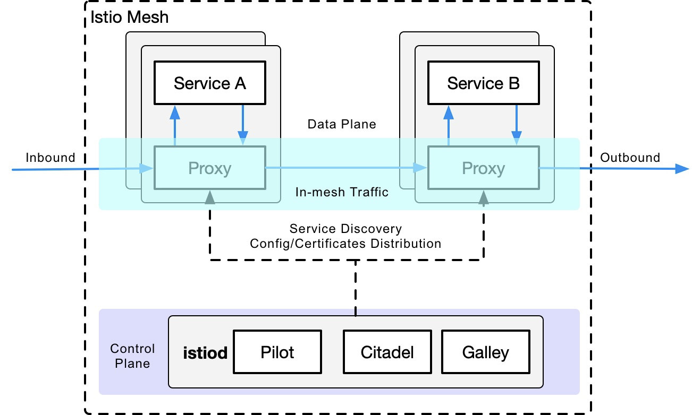
  * [Service Mesh 起源、演进、定义](https://www.lixueduan.com/posts/istio/02-service-mesh/)
  * [Why Istio](https://jimmysong.io/en/blog/why-do-you-need-istio-when-you-already-have-kubernetes/)
* 规则引擎 vs 代码编程
  * 采用规则引擎场景：系统解耦（比如多个程序应用基础代码一样只是业务逻辑不同）、业务规则频繁变化、非技术人员参与规则定义、规则复杂度高、动态配置调整扩展和决策。
  * 采用代码编程场景：业务逻辑复杂度低、性能要求高、技术团队熟悉或好的技术积累。
  * 简单的说，规则引擎是间于配置与编码的中间角色，或者说就是可执行的配置。
* AB 实验 vs 配置中心
  * AB 实验系统主要是面向对照分析，适用场景：功能特性验证、UI/交互体验测试、算法效果对比、业务策略验证等
  * 配置中心主要面向系统配置且中长期有效、偏技术/运维层面，适用场景：系统参数、数据库连接地址、开关控制、阈值限制、重试次数等
  * 决策原则：是否需要对照验证、是否需要分组测试、配置影响范围、变更频率、运维复杂度
  * 特殊情况：有些配置可能两者都需要、可以从 AB 实验 "毕业" 到配置中心
* 为什么数据库分片数建议采用质数数量？- 首先来说假如关键字是随机分布的，那么无所谓一定要模质数。但在实际中往往关键字有某种规律、元素分布是有非 1 步长的，例如大量的等差数列，那么公差和模数不互质的时候发生碰撞的概率会变大，而用质数就可以很大程度上回避这些问题。（等差数列比如集合 A = {0, 6, 12, 18, 24, 30, 36, ...}，此时当 M 取合数时，比如 M = 10，映射情况为 0->0, 6->6, 12->2, 18->8, 24->4, 30->0, 36->6, ...。很容易发现，最后映射到了集合 B = {0, 6, 2, 8, 4} = {0, 2, 4, 6, 8}，和理想中的{0, 1, 2, 3, 4, 5, 6, 7, 8, 9} 差距很大）
  * 再进一步分析，当 x（每个元素值）都与 M（分片数）最大公因数为 1 的情况下，x % M 后可以得到的一系列的余数 r，而全体余数 r 的集合 R 就是 {0, 1, 2, ..., M-1}。每个余数 r 代表了一个 x 的集合，比如余数 0 代表了 x 的集合 {0, 10, 20, 30, ...}，这个集合就叫做 “同余类”。即余数集合 R 中有 M 个余数，每个余数 r 代表一个同余类。现在思路就很清晰了，最理想的方式就是将集合 A 映射到余数集合 R 上，即 B = R。那么为什么有时候无法完全利用余数集合 R ？假设 x = ki, M = kj，x 和 M 存在最大公因数 k，此时可以将 x % M = r 转化为公式 x = Mq + r，即 ki = kjq + r 其中 q 是商，r 是余数。表面上 r 的取值范围是 {0, 1, 2, ..., M-1}，但是其实可以对公式进行稍微的变换，r = k(i - jq)，由于 i 和 jq 都是整数，此时看到 r 的实际取值范围是 {0, k, 2k, 3k, ...}，缩小了 k 倍。实际场景中，只需要大部分元素值都与分片数有集中的公因数 k（这里 k 可以多个），就会造成分布的不均匀。因此最后的目标就是保证 x 与 M 最大公因数为 1，最简单的方式就是直接取 M 为质数。[转载来源](https://www.zhihu.com/question/20806796/answer/159392465)
* [什么是 P99、P95、P50](https://www.cnblogs.com/robots2/p/17526324.html)
  * 许多大型的互联网公司会采用P99.9值，也就是99.9%用户耗时作为指标，意思就是1000个用户里面，999个用户的耗时上限，通过测量与优化该值，就可保证绝大多数用户的使用体验，至于P99.99值，优化成本过高，而且服务响应由于网络波动、系统抖动等不能解决之情况，因此大多数时候都不考虑该指标。
  * 响应耗时从小到大排列，顺序处于95%位置的值即为P95值。
  * 即中位数值。100个请求按照响应时间从小到大排列，位置为50的值，即为P50值。
* 编程语言选择
  * 垃圾回收 - 在不考虑人为开发错误的情况下，可主动释放、管理内存的编程语言比依赖垃圾回收的编程语言在性能上更优、更可预测。
* 网络流量（流入、流出）、网络延迟
* 日志错误率、警告率
* ASCII - 规定了 128 个字符的编码（英语字符与二进制位之间的关系的统一规定），包含控制字符和可显示字符
* Unicode - 一种编码，可理解为 ASCII 的升级或扩展，将世界上所有的语言、符号都纳入其中。每一个符号都给予一个独一无二的编码，那么乱码问题就会消失。这就是 Unicode，就像它的名字都表示的，这是一种所有符号的编码。Unicode 当然是一个很大的集合，现在的规模可以容纳 100 多万个符号。每个符号的编码都不一样，具体的符号对应表，可以查询[unicode.org](http://www.unicode.org/)。需要注意的是，Unicode 只是一个符号集，它只规定了符号的二进制代码，却没有规定这个二进制代码应该如何存储。([参考](https://www.ruanyifeng.com/blog/2007/10/ascii_unicode_and_utf-8.html))
* UTF-8 就是在互联网上使用最广的一种 Unicode 的实现方式。其他实现方式还包括 UTF-16（字符用两个字节或四个字节表示）和 UTF-32（字符用四个字节表示），不过在互联网上基本不用。重要：这里的关系是，UTF-8 是 Unicode 的实现方式之一
* Base64 - 是一种基于 64 个可打印字符来表示二进制数据的表示方法，常用于在通常处理文本数据的场合，表示、传输、存储一些二进制数据（如 gRPC 调用、图片、文件等），包括 MIME 的电子邮件及 XML 的一些复杂数据
* 双缓存 - 一写多读的场景的并发安全方案，将数据分成两个缓冲区，一个用于读（因为多读都是并发安全），一个用于写。写操作完成后，将读指针和写指针互换（指针的切换必须是原子操作），从而实现该场景的并发安全，避免了锁的开销。[Ref 1](https://www.cnblogs.com/gaoxingnjiagoutansuo/p/15773361.html)、[Ref 2](https://colobu.com/2024/01/14/double-buffering-and-Exchanger/)
* Reactor - 非阻塞 IO 致力于解决阻塞型的长时间等待 IO 事件，其具体处理方式是：先查询 IO 事件是否准备就绪，当 IO 事件准备就绪了，则会真正的通过系统调用实现数据读写；查询操作，不管是否数据准备就绪都会立即返回，即非阻塞；因此，通常情况下，会通过轮训来不断监听 IO 事件是否准备就绪；因为操作是非阻塞的，这个过程中通常只需及少量线程（一般一个线程即可）来处理这个轮训操作，极大的解决阻塞模式下 IO 枯竭问题。这种一个线程就可以监听所有网络连接的 IO 事件是否准备就绪的模式，就是有名的 IO 多路复用（或称 IO 复用模式，5 种 IO 模型之一，例子如 epoll）。Reactor 模型就是基于 IO 多路复用构建起来的。转载自：[高性能网络编程之 Reactor 网络模型](https://juejin.cn/post/7092436770519777311)
  * 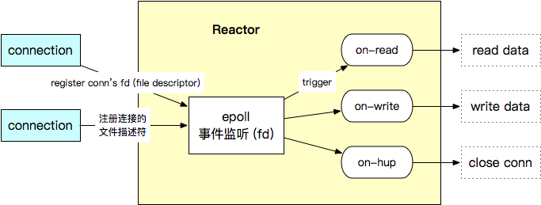
* 微服务滥用 - 很多时候仅需库就可以很好地完成工作，而不是微服务，原因在于网络 IO 成本极高（性能以及错误处理等），因此尽可能通过开发库并使用库即可，如果想保证相关逻辑总是实时更新或尽量实时更新，可行的办法是对使用该库（或 git 仓库）的服务每次代码更新时进行版本检查和强制执行更新
* 系统设计中的瓶颈分析：
  * 计算瓶颈
    * CPU 使用率过高
    * 处理线程数达到上限
    * 算法复杂度问题
    * 计算密集型任务阻塞
  * 内存瓶颈
    * 内存容量不足
    * 内存泄漏
    * 频繁 GC
    * 缓存命中率低
  * IO 瓶颈
    * 磁盘 IO 速度慢
    * 网络带宽受限
    * 连接数达到上限
    * 数据库读写速度
  * 架构瓶颈
    * 系统耦合度高
    * 单点故障
    * 扩展性差
    * 负载不均衡
    * 数据一致性问题
  * 依赖服务瓶颈
    * 第三方服务响应慢
    * 外部接口限流
    * 级联故障
  * 应对方案通常包括
    * 垂直扩展(提升单机性能)
    * 水平扩展(增加机器)
    * 引入缓存
    * 异步化处理
    * 数据分片
    * 负载均衡
    * 服务降级/熔断
  

## 编程语言
* OOM 的常见场景
  * 内存泄漏（Memory Leak）- 指应用程序分配了内存，但在不再需要时未释放它们，又比如对象生命周期长，内存过度使用，导致内存使用不断增加。长时间运行的应用程序中，内存泄漏可能会导致内存耗尽，触发 OOM 错误。
  * 大对象分配或数量过多（Large Object Allocation）- 在一些情况下，应用程序可能需要分配大量的内存来处理大型数据结构或者大文件或不断地请求大量内存，如果系统内存不足以容纳这些大对象，就会导致 OOM。
  * 并发线程过多（Excessive Concurrent Threads）- 每个线程（Golang 协程也一样）都需要一定的内存空间来存储其上下文信息，当应用程序创建过多的线程时，可能会导致系统内存耗尽。
  * 内存碎片化（Memory Fragmentation）- 如果系统中的内存分配和释放过于频繁，可能会导致内存碎片化，使得系统中没有足够的连续内存块来满足大对象的分配请求，最终触发 OOM。GC 也需要花费更多的时间来扫描和整理内存空间。
  * 第三方库或框架中的缺陷 - 在某些情况下，应用程序使用的第三方库或框架可能存在内存泄漏或其他缺陷，导致 OOM 错误。
  * 资源竞争（Resource Contention）- 当多个应用程序或者系统组件竞争有限的资源（比如内存）时，可能会导致资源争夺和耗尽，最终触发 OOM。
  * GC 算法选择、阈值设置不当 - 不同的 GC 算法具有不同的性能特点。一些 GC 算法可能更适合处理大量的短期对象，而另一些 GC 算法可能更适合处理长期存在的大对象。如果选择的 GC 算法性能不佳，就可能导致 GC 耗时过高。如果 GC 的阈值设置过低，可能会导致 GC 运行过于频繁，从而增加了系统的负载，设置过低则相反。
* OOM 与 GC 的关系 - OOM 的背景内存占用过多可能会导致 GC 的频繁执行。当系统中的内存占用过高时，GC 会频繁地尝试回收不再使用的内存对象，以释放内存空间。然而，如果系统中存在大量活跃对象或者内存碎片化等问题，GC 可能无法有效地回收足够的内存空间，导致频繁的 GC 执行。这种情况下，GC 的频繁执行可能会导致系统的性能下降，进而影响到应用程序的正常运行，最终可能导致 OOM 错误的发生。
* CPU 使用过高场景 - 可以通过性能分析工具（如 top、htop、perf 等）来诊断
  * 不合理的算法和代码：使用了低效的算法或者编写了复杂的代码可能导致 CPU 负载过高。这可能是因为循环嵌套过多、递归调用深度过深、算法复杂度过高等原因。
  * 大数据量处理：处理大量数据时，如果算法不够高效或者数据结构不合适，就可能导致CPU使用率过高。例如，在对大型数据库进行复杂查询或大规模数据分析时。
  * 并发和并行处理：多线程或多进程应用程序中，如果并发执行的任务过多或者线程之间没有合理的同步机制，就可能导致 CPU 负载过高。
  * 无限循环或死锁：编写了含有无限循环的代码，或者因为资源竞争导致了死锁，都可能导致 CPU 使用率持续高涨。
  * 外部服务调用延迟：如果应用程序依赖于外部服务或者资源，而这些服务的响应延迟较高，就可能导致 CPU 在等待这些响应时保持高负载。
  * 系统资源耗尽：当系统资源（如内存、磁盘等）不足时，可能会导致 CPU 使用率过高。因为系统需要频繁地进行资源调度和管理，从而增加了 CPU 的负载。
  * 恶意软件或后台进程：某些恶意软件或后台运行的进程，会占用大量 CPU 资源，导致系统性能下降。
* 随机函数大部分都不是并发安全的，包括 Java 和 Golang 的自建（[代码示例](./rand_concurrency.go)，但是 golang math/rand 默认的是并发安全的因为有锁）。
* 普通哈希表都是并发更新不安全的，如果只是并发纯读取则是安全的。
* 泛型的意义 - 泛型是一种在编程语言中用于创建可重用代码的机制，它可以增加代码的灵活性、复用性和安全性。Java 中的泛型通过类型擦除来实现，在编译过程中会将泛型类型信息擦除，并插入强制类型转换和辅助方法来确保类型安全。*使用场景：如果要写一个容器类（支持数据增删查询的），在写了支持 String 类型的，后面还需要写支持 Integer 类型的，然后还有 Doubel、Float、各种自定义类型，这样导致重复代码过多，而且这些容器的算法均一致。因此可以通过泛指一种类型 T，来代替之前需要的所有类型，把需要的类型作为参数传递到容器里面，这样只需要写一套就可以适应所有的类型。*
  * 为什么不是 Object 类型（共同祖先）呢？ - 这样的有一个问题：如果集合里面数据很多，某一个数据转型出现错误，在编译期是无法发现的。但是在运行期会发生 java.lang.ClassCastException，[Ref](https://anymarvel.github.io/AndroidSummary/book/java/deepIntoJavaGenerics/roleAndSignificanceOfGenerics.html)。Golang 同理，虽然 Go 中的空接口 interface{} 允许存储任何类型的值，但它是一种动态类型的机制，并且在使用时需要进行类型断言，相比之下，泛型（Generics）提供了一种静态类型的通用解决方案，使得代码可以在不失去类型安全性的前提下处理多种数据类型，[Ref](https://www.cnblogs.com/apocelipes/p/13832224.html)

### Java 高频
* Java 中垃圾回收机制中如何判断对象需要回收？常见的 GC 回收算法有哪些？ （中等）
* HashMap 与 ConcurrentHashMap 的实现原理是怎样的？HashMap 为什么使用红黑树？[ConcurrentHashMap 是如何保证线程安全的？](https://github.com/JasonGaoH/KnowledgeSummary/blob/master/Docs/Java/ConcurrentHashMap%E6%98%AF%E5%A6%82%E4%BD%95%E4%BF%9D%E8%AF%81%E7%BA%BF%E7%A8%8B%E5%AE%89%E5%85%A8%E7%9A%84.md) （中等）
* ConcurrentHashMap 的写操作会对读操作产生性能影响吗？[1](https://stackoverflow.com/a/71805283/6481829)、[2](https://stackoverflow.com/questions/68968305/how-can-i-block-concurrenthashmap-get-operations-during-a-put)
* 简述 Java 的反射机制及其应用场景  （简单）
* [Java 所有锁细节](https://tech.meituan.com/2018/11/15/java-lock.html)
* Synchronized，Volatile（及其实现原理），可重入锁的不同使用场景及优缺点？synchronized 关键字实际上是基于操作系统的互斥锁（Mutex）来实现的；volatile 利用内存屏障（memory barrier）来实现可见性，它告诉编译器和处理器不要对 volatile 变量进行优化，确保变量的值总是从主内存中读取；可重入锁是一种高级锁机制，允许同一个线程多次获取同一把锁而不会造成死锁，Java 中的 ReentrantLock 和 synchronized 都属于可重入锁。
* [sun.misc.Unsafe](https://tech.meituan.com/2019/02/14/talk-about-java-magic-class-unsafe.html)
* [简述 Java BIO、NIO、AIO 的区别](https://tobebetterjavaer.com/nio/BIONIOAIO.html)  （困难）
* Java 类的加载流程是怎样的？什么是双亲委派机制？  （简单）
* JMM 中内存模型是怎样的？什么是指令序列重排序？  （中等）
* JVM 内存是如何对应到操作系统内存的？  （中等）
* Java 怎么防止内存溢出？避免创建不必要的对象、尽量重用对象，关闭不再需要的资源，分析堆内存、递归深度和 GC。
* Java 线程间有多少通信方式？
* [Java 中接口和抽象类的区别](../Leetcode%20Practices/object%20oriented%20design/README.md#何时使用抽象类，何时使用接口)  （简单）
* hashcode 和 equals 方法的联系？
* Java 常见锁有哪些？ReetrantLock 是怎么实现的？  （中等）
* ThreadLocal 实现原理是什么？每个线程都有自己的 ThreadLocalMap，它是一个哈希表，用于存储线程的局部变量。这个哈希表的键是 ThreadLocal 对象，值是对应线程的局部变量。
* 简述 Spring 的初始化流程（bean 的生命周期）？加载配置文件 -> 创建容器 -> Bean 的定义 -> Bean 的实例化 -> 依赖注入 -> Bean 的初始化回调 -> 应用程序使用 Bean -> Bean 的销毁回调 -> 容器关闭。
* 简述 Netty 线程模型，Netty 为什么如此高效？[高效的 I/O 模型](./../Leetcode%20Practices/system%20design/IO模型与Web服务器工作模型.md)以及零拷贝技术等等。
* [简述 Spring 的 IOC 机制？依赖注入](../Leetcode%20Practices/object%20oriented%20design/README.md)
* 简述 Spring AOP 的原理？核心原理是基于代理模式和动态代理技术，通过代理对象拦截方法调用并应用通知，以实现横切关注点的功能。
* 简述动态代理（在运行时动态生成代理类。动态代理不需要预先创建代理类的代码，而是在运行时使用反射等机制动态生成代理类）与静态代理（代理类的代码是在编译时期就已经生成的，它们在编译时与具体的目标类绑定）
* [Java IO](https://www.cnblogs.com/czwbig/p/10007201.html)
* [Java 注解原理](../Tool%20Sets/Annotation.java)
* [Java 编译部署](../Computer%20System%20Layer/编译部署/README.md)
* String 不可变的原因（[实际可以利用反射机制改变 value](https://juejin.cn/post/7046055960988614687)）- 字符串在应用中的广泛使用和安全性方面的考虑，[具体细分原因](https://www.cnblogs.com/wkfvawl/p/11693260.html)如下：
  * 便于实现字符串池，节省资源
  * 线程安全
  * 黑客安全
  * 加快字符串处理速度，因为保证了 hashcode 的唯一性，于是在创建对象时其 hashcode 就可以放心的缓存了，不需要重新计算
* 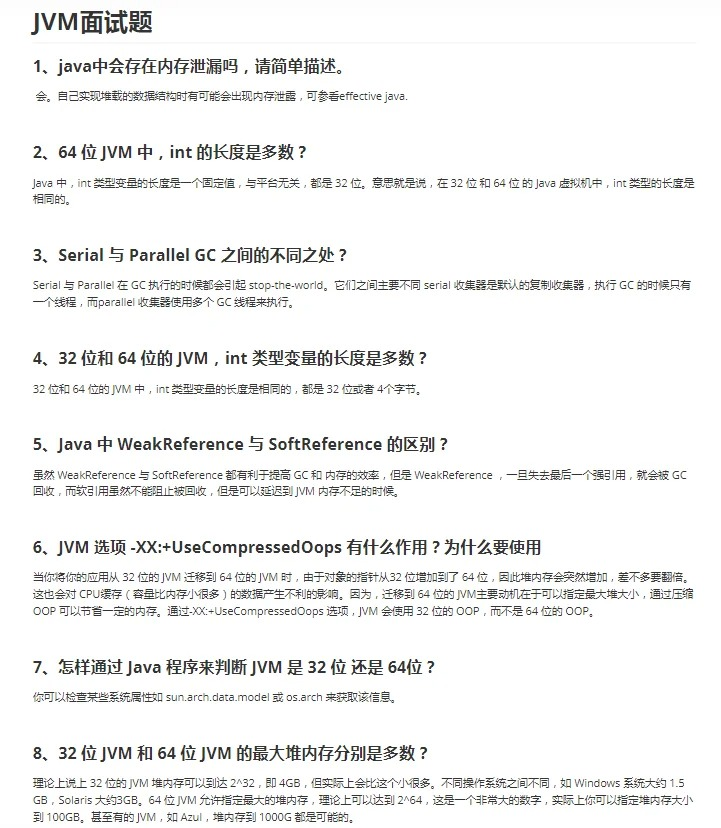
* Java 中的 main 函数使用 static 修饰符的主要原因是为了便于程序启动时直接调用它，而无需实例化任何对象，Java 程序的入口点是一个固定签名的 main 方法，Java 虚拟机（JVM）启动时需要调用这个方法来执行程序，JVM 在调用 main 方法时，不实例化类，而是直接通过类名访问该方法。避免 static 问题时可以用 ```Main m = new Main(); m.myFunc();``` 来解决（假设类名为 Main）

### Golang 高频
* [什么是 golang 内存逃逸](./../Computer%20System%20Layer/内存与程序.md#内存逃逸)
* [go routine 和 thread、process 区别](https://huweicai.com/process-thread-goroutine/)
* panic 相关 - [panic](https://www.yiibai.com/go/golang-panic.html)、panic 和 recover：[Ref 1](https://draveness.me/golang/docs/part2-foundation/ch05-keyword/golang-panic-recover/) + [Ref 2](https://xiaomi-info.github.io/2020/01/20/go-trample-panic-recover/)
  * recover（对应 Java 的 try catch）等机制会将程序当前状态（主要是 cpu 的栈指针寄存器 sp 和程序计数器 pc，Go 的 recover 是依赖 defer 来维护 sp 和 pc ）保存到一个与 panic（对应 Java 的 throw）共享的内存里。当有异常的时候，从该内存中提取之前保存的 sp 和 pc 寄存器值，直接将函数栈调回到 sp 指向的位置，并执行 ip 寄存器指向的下一条指令，将程序从异常状态中恢复到正常状态。
  * recover 应且只能在 defer 里面用：[示例代码](https://go.dev/blog/defer-panic-and-recover)
  * panic 内部主要流程是这样：获取当前调用者所在的 g，也就是 goroutine -> 遍历并执行 g 中的 defer 函数 -> 如果 defer 函数中有调用 recover，并发现已经发生了 panic，则将 panic 标记为 recovered -> 在遍历 defer 的过程中，如果发现已经被标记为 recovered，则提取出该 defer 的 sp 与 pc，保存在 g 的两个状态码字段中 -> 调用 runtime.mcall 切到 m->g0 并跳转到 recovery 函数，将前面获取的 g 作为参数传给 recovery 函数。
* [go code examples](https://github.com/yihaoye/go-example/tree/master/general-demo)
* Context 的作用
  * 传递共享的数据（上下文信息）
  * 取消 goroutine、防止 goroutine 泄漏（协程之间的事件通知：超时、取消）
* [上下文 Context](https://draveness.me/golang/docs/part3-runtime/ch06-concurrency/golang-context/) - 上下文信息包括 kv 数据、取消信号、超时时间、截止时间等
* [Golang 的 select、defer、Context](https://github.com/yihaoye/go-example/blob/master/general-demo/README.md)
* [什么是 Go Scheduler](https://golang.design/go-questions/sched/what-is/)
* [GPM（或 GMP）模型](../Computer%20System%20Layer/并发编程模型.md#gmp-模型) - [更多资料](https://golang.design/go-questions/sched/gpm/)
* goroutine 泄露 - 在应用程序中创建的 goroutine 没有正确地退出或释放资源，导致它们持续存在而不被使用，从而浪费了系统资源。为了避免 goroutine 泄露，需要确保在不再需要时正确退出 goroutine，并释放其占用的资源。这通常需要使用适当的控制机制，例如 context 包、sync 包中的 WaitGroup 或者通道来通知 goroutine 退出；[其余参考](https://alexstocks.github.io/html/lessons.html)
* [Golang unsafe 包](https://juejin.cn/post/6844903453303504910)
* Golang 字符型的实际类型 
* Golang 里传递的类型 - 引用类型 func、slice、map 和 channel、func（本质上它们仍然是指针的值传递）；值类型包括 int、float、bool、string、array 和 struct 等（直接的值传递）
* [for loop 指针错误](https://colobu.com/2023/12/17/Less-Error-Prone-Loop-Variable-Scopin/)
* Go channel 使用 make 声明并指定缓冲区大小时，会在缓冲区写满时阻塞写入；但是 slice 或 map 进行 make 声明并指定缓冲区大小时，不会在缓冲区写满时阻塞写入，而是会动态地扩展大小
* 为什么需要 make 关键词？make 的作用是申请内存，并且初始化数据。另外因为 slice, map 和 chan 的底层结构上要求在使用 slice，map 和 chan 的时候必须初始化，如果不初始化，或者通过 new 创建，那 slice，map 和 chan 的值就是零值，也就是 nil - map 如果是 nil，是不能往 map 插入元素的，插入元素会引发 panic；chan 如果是 nil，往 chan 发送数据或者从 chan 接收数据都会阻塞；slice 会有点特殊，理论上 slice 如果是 nil，也是没法用的，但是 append 函数处理了 nil slice 的情况，可以调用 append 函数对 nil slice 做扩容。[转载来源](https://www.zhihu.com/question/446317882/answer/2245768201)
  * make 多用于 map 、slice 、channel ，new 多用于结构体
* make len 性能意义 - Go 的切片 (slice) 是在数组 (array) 之上的抽象数据类型，数组类型定义了长度和元素类型。数组固定长度，缺少灵活性，大部分场景下会选择使用基于数组构建的功能更强大，使用更便利的切片类型。使用内置函数 make 进行初始化，make 的函数定义：```func make([]T, len, cap) []T``` 第一个参数是 []T，T 即元素类型，第二个参数是长度 len，即初始化的切片拥有多少个元素，第三个参数是容量 cap，容量是可选参数，默认等于长度。容量是当前切片已经预分配的内存能够容纳的元素个数，如果往切片中不断地增加新的元素。如果超过了当前切片的容量，就需要分配新的内存，并将当前切片所有的元素拷贝到新的内存块上。因此为了减少内存的拷贝次数，容量在比较小的时候，一般是以 2 的倍数扩大的，例如 2 4 8 16 ...，当达到 2048 时，会采取新的策略，避免申请内存过大，导致浪费。Go 语言源代码 runtime/slice.go 中是这么实现的，不同版本可能有所差异。[转载来源](https://geektutu.com/post/hpg-slice.html)
* [协程泄露](https://iswbm.com/586.html) - 在程序运行过程中，有一些协程由于某些原因，无法正常退出。协程的运行是需要占用内存和 CPU 时间的，一旦这种协程越来越多，会导致内存无端被浪费，CPU 时间片被占用，程序会越来越卡。只要有可能导致程序阻塞的，都有可能会导致协程泄露。
  * 主要原因：通道阻塞、锁阻塞、等待阻塞
* [receiver-type | 入参类型](https://go.dev/wiki/CodeReviewComments#receiver-type)
  * 如果 receiver 或入参的类型是 map、func 或者 chan，不要用指针。如果是 slice，如果不想重新分配 slice（reslice or reallocate the slice），也不要用指针。
  * 如果方法需要修改入参，那么入参必须是指针类型。
  * 如果入参是一个包含 sync.Mutex 或类似同步字段的结构体，入参必须是指针类型，以避免结构体被复制。
  * 如果入参是一个大型结构体或数组，使用指针入参效率更高。如何判断“多大是大”？假设将所有字段作为参数传递给方法，如果感觉字段太多，则认为结构体太大，应该使用指针入参。
  * 如果方法会同时（并发）修改入参，或者从其他方法调用中可能修改入参，则需要使用指针入参。值类型入参会在调用方法时创建入参的副本，外部的修改不会应用到该副本上。如果希望对原始入参的修改可见，则入参必须是指针类型。
  * 如果入参是一个结构体、数组或切片，且其中的元素包含可能被修改的指针，为了让代码意图更加清晰，建议使用指针入参。
  * 如果入参是一个小型数组或结构体，它本质上是一个值类型（例如 time.Time 类型），没有可变字段或指针，或者入参只是一个简单的基础类型（如 int 或 string），使用值入参更合适。值入参可能减少垃圾回收的开销：如果值被传递给值方法，可以直接在栈上复制，而无需在堆上分配内存。（编译器会尽量优化避免堆分配，但并非总能成功）但不要仅仅因为这一点选择值入参，除非通过性能分析确认其效果。
  * 不要混合使用不同的入参类型。所有方法要么统一使用指针入参，要么统一使用值入参。
  * 如果不确定，优先选择指针入参。
* 函数式编程建议不用修改入参，为何有时 Go 程序甚至库仍会这样做？- [出于现实情况考量，基于最佳规范仍然建议能不修改入参就不修改](https://forum.golangbridge.org/t/functional-in-golang-immutable-and-return-vs-manipulation-references/5040)。另外 Go 是值传递而非 Java 这类的引用传递，所以不遵守规范风险相较于后者略低，因为前者可选择值传递或指针传递，问题可控，开发更灵活也应负起更多责任
* func 不能直接对比，比如 f1 == f2，但是可以判断是否是同一个函数对象：具体为使用 reflect.ValueOf(f).Pointer() 比较函数地址，因此使用单实例函数（全局变量即可 `var SingletonFunc = func(b int) int { return b+1 }`）
* 函数变量（单实例）可以并发调用，只要不是改写函数变量且函数是纯函数式编程（不读写函数外的全局变量，只使用入参和局部变量）的话就是并发安全的
* [sqlx 简介及其使用](https://colobu.com/2024/05/10/sqlx-a-brief-introduction/#more)
* 内联优化 - 内联（inlining）是编程语言编译器常用的优化手段，其优化的对象为函数，也称为函数内联。如果某函数 F 支持内联，则意味着编译器可以用 F 的函数体/函数定义替换掉对函数 F 进行调用的代码，以消除函数调用带来的额外开销。通常情况下在构建生产代码时会进行内联优化，以提高性能，尤其是在使用默认的编译优化级别时（也就是没有显式关掉优化的情况下）。[Ref 1](https://tonybai.com/2022/10/17/understand-go-inlining-optimisations-by-example/)


## 数据库高频
* [为什么 InnoDB 表必须有主键，并且推荐使用整型的自增主键？](https://blog.csdn.net/weixin_41699562/article/details/104139458)
* [TSID for db Primary Key](https://vladmihalcea.com/uuid-database-primary-key/)
* ORM N+1 问题 - [解答一](https://segmentfault.com/a/1190000039421843)、[解答二](https://www.cnblogs.com/google4y/p/3455534.html)、[解答三](https://zhuanlan.zhihu.com/p/27323883)
* [MySQL 索引背后的数据结构及算法原理 / B+树](https://blog.codinglabs.org/articles/theory-of-mysql-index.html)
* [LSM 树](./../Common%20Data%20Structure%20and%20Data%20Type/Data%20Structure%20Implementation/LSMTree/README.md)
* [MySQL 中的 UTF8 和 UTF8mb4 编码的详细区别](https://cloud.tencent.com/developer/article/1930660)
* [什么是 SPL（structured process language）以及为什么基于 SQL 的复杂计算不那么直观](https://mp.weixin.qq.com/s/LHSlD4OJ_k4E_6gbI5OTFg)
* 什么是 Hive？- [解答一](https://zhuanlan.zhihu.com/p/25608332)、[解答二](https://dunwu.github.io/bigdata-tutorial/hive/hive-quickstart.html)
  * [Hive 优化](https://blog.csdn.net/Swofford/article/details/126651171)
  * [Hive 为什么不支持更新和删除](https://blog.csdn.net/zhulangfly/article/details/128904982)
* 关系数据库的 schema 意义 - 缺乏 schema 的最重要的劣势是数据完整性和一致性难以得到保证，另外就是 JOIN 操作必须基于 schema
* JOIN 操作的 2 个主要优点 - 提高效率（查询优化，减少数据库扫描的数据量）、降低成本（减少存储冗余）
* [ElasticSearch 详解](https://pdai.tech/md/db/nosql-es/elasticsearch.html)
  * [Ref 1](../Leetcode%20Practices/system%20design/README.md#设计搜索引擎-Twitter-Search) 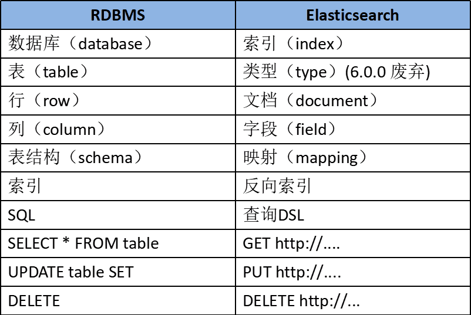
  * [Usage Cases](../Computer%20System%20Layer/数据库/ElasticSearch/README.md)
* DBA 职责 - 负责数据库的设计、规划和建模，包括数据库的结构设计、表设计、索引设计等，满足业务需求，并具备良好的性能和扩展性；管理和实施数据库的安全策略，包括用户身份验证、访问控制、数据加密、审计日志、安全补丁更新等；数据备份与恢复；监控和调优数据库系统的性能，识别和解决性能瓶颈，优化数据库查询、索引、存储过程等，提高数据库系统的响应速度和吞吐量；异常与故障排除；版本升级与维护；用户权限管理与支持；硬件、容量规划等；
* [跳表 vs B+树](https://stackoverflow.com/a/28270537/6481829)
* 为什么许多数据持久化数据库的索引为什么使用 B+ 树而不使用跳表 - B+ 树是多叉树结构，每个结点都是一个 16k 的数据页，能存放较多索引信息，所以`扇出很高`（每个节点可以包含多个键/指针，一个节点可以指向的子节点数量非常高），3 层左右就可以存储 2kw 左右的数据。也就是说查询一次数据，如果这些数据页都在磁盘里，那么最多需要查询 3 次磁盘 IO。跳表是链表结构，一条数据一个结点，如果最底层要存放 2kw 数据，且每次查询都要能达到二分查找的效果，2kw 大概在 2^24 左右，所以，跳表大概高度在 24 层左右。最坏情况下，这 24 层数据会分散在不同的数据页里，也即是查一次数据会经历 24 次磁盘 IO。因此存放同样量级的数据，B+ 树的高度比跳表的要少，如果放在数据库上来说，就是磁盘 IO 次数更少，因此 B+ 树查询更快。而针对写操作，B+ 树需要拆分合并索引数据页，跳表则独立插入，并根据随机函数确定层数，没有旋转和维持平衡的开销，因此跳表的写入性能会比 B+ 树要好。其实，mysql 的存储引擎是可以换的，以前是 myisam，后来才有的 innodb，它们底层索引用的都是 B+ 树。也就是说，完全可以造一个索引为跳表的存储引擎装到 mysql 里。
  * 扇入扇出性 - 扇入是指一个模块被多少个其他模块调用或依赖，高扇入就是被许多其他模块依赖，这表明这个模块可能是系统中的关键组件，它的性能和可靠性对整体系统有重要影响；扇出是指一个模块调用或依赖多少个其他模块，高扇出意味着该模块依赖于许多其他模块，可能需要从多个模块获取数据或服务，这可能使得该模块变得复杂和难以维护，因为它需要处理许多不同的依赖，低扇出意味着该模块依赖的其他模块较少，通常会更加独立和易于维护。
* Redis 为什么使用跳表而不使用 B+ 树或二叉树呢 - 因为 Redis 是内存数据库，进行读写数据都是操作内存，跟磁盘没啥关系，因此也不存在磁盘 IO 了，所以层高就不再是跳表的劣势了，而 B+ 树是有一系列合并拆分操作的，换成红黑树或者其他 AVL 树的话也是各种旋转，目的也是为了保持树的平衡。而跳表插入数据时，只需要随机一下，就知道要不要往上加索引，减少了旋转平衡的开销。
* 全文搜索是一种信息检索技术，它允许用户在大量文本数据中快速查找包含特定关键词组合的数据记录（比如文档对象）。
* 内存数据库 vs 持久化数据库 - 除了性能外，主要区别是内存数据库通常设置过期策略，且读取写入操作的目标介质一个是内存一个是磁盘，因此一个有数据丢失风险而另一个没有。
* 什么是区块链 - 是一种分布式和去中心化的数据库技术，主要特性为每个节点都有完整的数据库副本，写入数据时采用 append-only（事件溯源模式），不变更过往的记录（区块信息）且通过每个区块本身包含前一个区块的哈希值来保证无法变更性，最终的值或状态则通过所有这些过往区块信息合并得出。而每一次写入都要经过共识机制/算法裁决成功与否，如此确保没有单个节点或节点组可以操纵网络来维护区块链的公正性与安全性。

### Redis 高频
* Redis 有哪些数据类型？可以应用在什么场景？[Ref 1](https://cloud.tencent.com/developer/article/1975464)、[Ref 2](../Computer%20System%20Layer/数据库/Redis/README.md)
* [Redis 的过期键的删除策略有哪些？](https://cloud.tencent.com/developer/article/1975464)
* [缓存穿透、缓存击穿、缓存雪崩是什么？怎么解决呢？](https://cloud.tencent.com/developer/article/1975464)
* [Redis 事务](https://pdai.tech/md/db/nosql-redis/db-redis-x-trans.html)
* [Redis 管道](https://redis.io/docs/manual/pipelining/)
* [AOF 持久化机制](https://zq99299.github.io/note-book/cache-pdp/redis/010.html#aof-%E6%8C%81%E4%B9%85%E5%8C%96%E6%9C%BA%E5%88%B6%E7%9A%84%E4%BC%98%E7%82%B9)
  * [AOF 重写机制](https://redis.io/docs/management/persistence/#log-rewriting) - AOF 重写会只保留当前缓存内的数据集
* [全数据结构及其 API](https://www.cnblogs.com/yidengjiagou/p/17305653.html)
  * [ZSet (Sorted Set)](https://redis.io/docs/latest/develop/data-types/sorted-sets/)
    * 内部编码有 2 种：
      * ziplist 编码：当 Zset 中元素个数小于 128 个，并且所有元素的长度都小于 64 字节时，Redis 会使用 ziplist 编码存储 Zset。这种编码方式可以节省内存空间，并且可以提高存取效率，但是不支持随机访问和范围查询
      * skiplist 编码：当 Zset 中元素个数大于等于 128 个，或者有一个元素的长度大于 64 字节时，Redis 会使用 skiplist 编码存储 Zset。这种编码方式支持高效的随机访问和范围查询，但是需要占用更多的内存空间
    * ZSet 若元素权重（score）相同，如何排序？- 按键的字典顺序排序
    * 有序集合和集合一样也是 string 类型元素的集合，且不允许重复的元素（即 string）。不同的是每个元素都会关联一个 double 类型的权重分数（score）。有序集合的 string 元素是唯一的，但分数（score）不是唯一的
    * 有序集合是通过 `哈希表 + 跳表` 实现的，[参考](https://redis.io/glossary/redis-sorted-sets/#:~:text=In%20Redis%2C%20sorted%20sets%20are,elements%20based%20on%20their%20scores.)
    * ZRANGE - 返回有序集中，指定区间内的元素，且元素按分数值递增来排序，具有相同分数值的元素按字典序排列。另外还有 ZREVRANGE，但已弃用
  * String
    * SETNX - 仅当 key 不存在时，才设置 key 的值


## Kafka 高频
* [System Design: Why is Kafka fast?](https://www.youtube.com/watch?v=UNUz1-msbOM)
  * 顺序 I/O
  * [Zero-Copy (DMA)](./../Leetcode%20Practices/system%20design/IO模型与Web服务器工作模型.md#零拷贝)
* [kafka 架构](https://cloud.tencent.com/developer/article/1853417)
  * 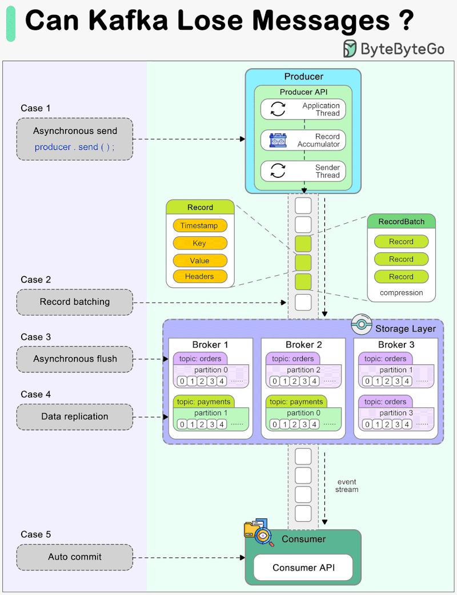
* [如何确定当前能读到哪一条消息](https://cloud.tencent.com/developer/article/1853417)
* [Kafka consumer group](https://www.cnblogs.com/huxi2b/p/6223228.html)
* [Kafka 如何保证消息顺序性](https://cloud.tencent.com/developer/article/1839597)
* 背压（Backpressure）- 是指当数据生产速度超过数据消费速度时，消费者向生产者施加的一种压力机制。背压的目的是为了保护消费者，防止其被生产者产生的数据压倒或超负荷，从而导致系统资源耗尽或性能下降，[ref 1](https://www.zhihu.com/question/49618581)
  * 反压机制（Pushback）： 消费者通过某种方式向生产者发出信号，告知生产者当前处理速率不足，需要减缓生产速度。生产者收到信号后可以采取相应的措施，例如降低数据生成速率、缓存数据或丢弃部分数据
  * Backpressure 响应式编程（Reactive Programming）： 在响应式编程中，背压是一种处理异步数据流的机制。例如，在使用 RxJava、Project Reactor 等响应式框架时，可以使用背压操作符来处理数据流中的背压情况，例如通过缓存、丢弃、延迟请求等方式来减缓数据流的速率
  * 具体来说，背压通常用于处理数据流式处理场景，特别是在异步、非阻塞的环境中，例如响应式编程、流处理系统等。在这些场景中，数据生产者产生的数据速率可能会超过消费者处理的速率，导致消费者处理不过来，造成内存溢出、系统崩溃等问题。为了解决这个问题，可以采取背压机制，让消费者通知生产者降低生产速率，从而使数据生产和消费达到平衡


## Flink 高频
* [流式计算核心概念](https://juejin.cn/post/7316591784623407130)
  * 数据流、数据源、消息队列
  * 窗口
  * 流处理模型，定义了如何对数据流进行处理和分析。流处理模型可以分为 2 种类型：事件驱动模型和时间驱动模型。事件驱动模型是基于事件的发生顺序进行处理的，而时间驱动模型是基于时间点进行处理的
  * 核心算法
    * 事件驱动
      * 基于状态的算法：这种算法将数据流分为多个窗口，并为每个窗口维护一个状态。当新的数据元素进入窗口时，算法会更新窗口的状态。当数据元素离开窗口时，算法会根据窗口的状态计算结果
      * 基于操作的算法：这种算法对数据流进行一系列操作，例如过滤、聚合、连接等。这些操作会改变数据流的结构和内容
    * 时间驱动
      * 基于时间窗口的算法：这种算法将数据流分为多个时间窗口，并为每个时间窗口维护一个状态。当时间窗口到达时，算法会根据窗口的状态计算结果
      * 基于时间触发的算法：这种算法会在特定的时间点进行处理。这些时间点可以是固定的，也可以是动态的
  * 中间存储，以及状态维护（是流式计算的关键组件，它用于存储和管理数据流的状态。状态可以是简单的键值对，也可以是复杂的数据结构，如树、图等）
  * 结果输出 - 数据库、下游等等
* [Flink Checkpoint 机制](https://tech.youzan.com/flink_checkpoint_mechanism/) - Flink 里 EXACTLY ONCE 的实现方法


## 统计、机器学习高频
* [七大最常见的机器学习面试问题：模型性能评估、过拟合/欠拟合、训练与评估数据分配、梯度下降、MLE 和 MAP（最大似然估计和最大后验估计）、Kernel、PCA 和 SVD/EVD](https://www.youtube.com/watch?v=j340MdN0QSY)
  * 过拟合（overfitting）是一种不受欢迎的机器学习行为，当机器学习模型为训练数据提供准确的预测而不是新数据时，就会发生这种行为。当使用机器学习模型进行预测时，首先在已知数据集上训练模型。然后，根据这些信息，该模型尝试预测新数据集的结果。过度拟合模型可能给出不准确的预测，并且无法对所有类型的新数据表现良好。过拟合产生原因包括：训练数据大小过小，并且未包含足够的数据样本，无法准确代表所有可能的输入数据值；训练数据包含大量不相关的信息，称为噪声数据；模型在单个数据样本集上训练的时间过长；模型复杂程度较高，因此其可以学习训练数据中的噪声。
  * 欠拟合（underfitting）是另一种错误类型，当模型无法确定输入数据和输出数据之间是否存在有意义的关系时，会发生这种错误。如果模型没有在大量数据点上进行适当时长的训练，则会获得欠拟合模型。
* [假阳性、假阴性、灵敏度、特异度](https://www.youtube.com/watch?v=Seje2u1fltQ) - 真正例（True Positive，TP）是算法正确地预测是 XXX 的数量、假正例（False Positive，FP）是算法错误地预测是 XXX 数量、假反例（False Negative，FN）是算法错误地预测为不是 XXX 的数量
  * [召回率与精确率](https://refusea.com/?p=1546) - 召回率（Recall）是一种衡量模型预测能力的指标，特别是模型识别出相关实例的能力。具体来说，召回率是指模型正确识别出的正例（真正例，又称真阳性）占所有实际正例（真正例+假反例，反例又称阴性）的比例。换句话说，它是模型找到的相关实例占所有相关实例的比例。
    * 召回率（Recall）= 真正例 / (真正例 + 假反例)
    * 精确率（Precision）= 真正例 / (真正例 + 假正例)
* [机器学习高频概念：卷积、感知器、损失函数（极大似然估计、交叉熵、KL 散度）、激活函数（sigmoid、softmax）、梯度下降及其改良优化算法、反向传播算法、L1 L2 正则化、SVM 等等](https://www.youtube.com/watch?v=D641Ucd_xuw&list=PLxIHUhMHF8okwhq8poRuiHBChWjkVUHLL) - 其中 sigmoid 可以被认为是一种特殊的 softmax，简单来讲就是 sigmoid 用于单一分类（非此即彼或百分比/概率），softmax 用于多类的分类（A、B、C、D... 里其中一个或哪个百分比/概率更接近），选择哪一个本质上是要符合最大熵原理（使用工具如矩、特征函数、概率分布等），最大熵原理认为，在所有可能的概率模型/分布中，熵最大的模型是最好的模型/分布。
  * [推荐概论](https://zhuanlan.zhihu.com/p/243050824)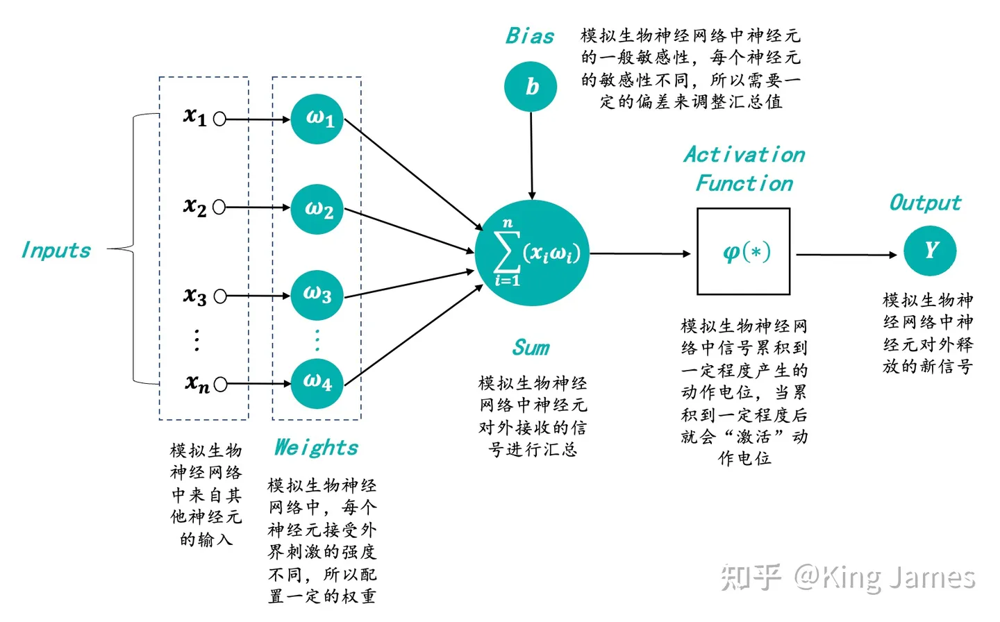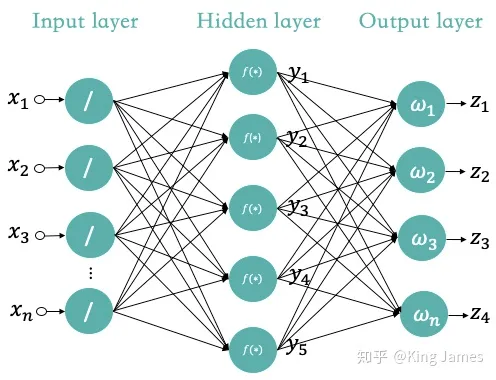
  * 损失函数是用于衡量模型所作出的预测离真实值（Ground Truth）之间的偏离程度。
  * 激活函数的作用：增加非线性因素，解决线性模型表达能力不足的缺陷。没有激活函数的神经网络实质上是一个线性回归模型，只能解决线性可分的问题。
  * 反向传播（Backpropagation，意为误差反向传播，缩写为 BP）- 是对多层人工神经网络进行梯度下降的算法，也就是用链式法则以网络每层的权重为变量计算损失函数的梯度，以更新权重来最小化损失函数。
  * 支持向量机（SVM）- 给定一组训练实例，每个训练实例被标记为属于两个类别中的一个或另一个，SVM 训练算法建立一个将新的实例分配给两个类别之一的模型，使其成为非概率二元线性分类器。
* [张量 tensor：rank、shape、type](https://zhuanlan.zhihu.com/p/48982978) - 在深度学习中，tensor 实际上就是一个多维数组，其目的是能够创造更高维度的矩阵、向量。
  * 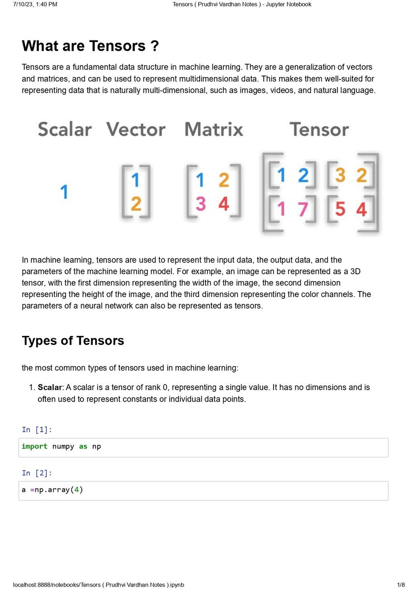
* [随机优化、批量 batch](https://www.jiqizhixin.com/articles/071502) - 使用批量训练有助于提高深度学习模型的训练效率、内存利用、并行计算、稳定性和泛化性能，使训练过程更高效、更稳定，并能够处理大规模数据。批量大小是一个超参数，通常需要根据具体任务和硬件资源来进行调整。较大的批量大小可能可以提高训练速度，但也会增加内存需求，因此需要权衡。
* [通道 channel](https://zhuanlan.zhihu.com/p/95573093) - 一般 channels 的含义是，每个卷积层中卷积核的数量；另一种解释是 channels 就是网络提取的特征数（模型的宽度），channel 越多特征越丰富，层深越深，细节越多。
* [学习率](https://zh.wikipedia.org/zh-hans/%E5%AD%A6%E4%B9%A0%E7%8E%87) - 每一轮深度学习（迭代）都是通过梯度下降进行一次参数优化一小步。学习率是一个超参数，控制了每次参数更新的步长或大小。它是一个重要的调整参数，如果学习率设置得太小，收敛速度可能会很慢，而如果设置得太大，模型可能会发散而不是收敛。通常，学习率的选择需要经过实验来调整。
* 迭代轮数 epochs - 训练一个深度学习模型通常需要多个迭代轮数，每个轮次都包括对整个训练数据的一次完整遍历。在每个迭代轮数中，模型的参数都会根据损失和梯度进行更新。迭代轮数的选择通常取决于许多因素，包括数据集的大小、模型的复杂性、学习率的设置、训练目标以及计算资源的可用性：一些深度学习项目可能需要数百轮迭代，而其他项目可能只需要几十轮。因此，没有固定的迭代轮数，它会根据具体情况而变化。
* 池化 pooling - 其本质，其实就是降采样，对于输入的 feature map，选择某种方式对其进行降维压缩，以加快运算速度。实施池化的目的：(1) 降低信息冗余；(2) 提升模型的尺度不变性、旋转不变性；(3) 防止过拟合。池化层的常见操作包含以下几种：最大值池化，均值池化，随机池化，中值池化，组合池化等。
* logtis - 在深度学习的上下文中，logits 就是一个向量，下一步通常被投给 softmax/sigmoid 的向量。logtis 可以看作神经网络输出的未经过归一化（softmax/sigmoid）的概率，所以将其结果用于分类任务计算 loss 时，如求 cross_entropy 的 loss 函数会设置 from_logits 参数。
* 为什么人工智能需要并行计算 - 人工智能运算需要并行计算能力是因为深度学习模型通常涉及大量的矩阵运算和张量操作，这些操作可以高度并行化。在训练或推理阶段，模型需要根据输入数据进行前向传播，通过一系列的矩阵乘法、卷积运算、非线性激活等操作来生成输出结果。这些操作通常可以通过并行计算来加速。
  * 矩阵运算和张量操作为什么可以以并行加速的数学原理 - 矩阵乘法的并行性：在矩阵乘法中，每个输出矩阵元素都是通过对输入矩阵中的对应行和列进行内积计算得到的，这意味着每个输出元素的计算都是相互独立的，可以并行进行。例如，对于一个矩阵乘法 C = A * B，可以同时计算 C 中的每个元素，因为它们之间的计算是相互独立的。张量操作的并行性：张量操作（如张量加法、张量乘法、张量卷积等）也具有类似的性质，其中每个元素之间的计算都是相互独立的，可以并行进行。
* 为什么需要用 GPU 进行训练 - 训练多层的深度神经网络是深度学习的过程，这是机器学习的一个分支。训练深度神经网络时需要多个并行计算，GPU 在处理这些任务方面比 CPU 更有效。与 CPU 相比，GPU 的内核数量要多得多，可以同时进行更多的计算，对矩阵乘法和卷积具有极大的计算优势。深度神经网络训练需要数百万次计算，因此，这种并行性对于加速这一过程至关重要。另外 CPU 是延迟优化的，而 GPU 是带宽（内存）优化的。
* 工具、库（Pandas 和 PyTorch 有不同的用途和数据类型，但在某些任务中也可以结合使用。例如，在深度学习中，可以使用 Pandas 加载和准备数据，然后将其转换为 PyTorch 张量以进行模型训练。这种组合利用了两者的优势，以完成复杂的数据处理和深度学习任务）
  * Pandas - 用于数据清洗、数据转换、数据分组、聚合、索引和时间序列分析等数据操作任务。使用类似 SQL 的数据操作语法。处理的是表格型数据，通常是二维的数据结构，适用于处理表格、CSV 文件、SQL 数据库等。
  * [PyTorch](https://www.youtube.com/watch?v=KBdb53NrVAc&list=PLXO45tsB95cJxT0mL0P3-G0rBcLSvVkKH&index=6) - 用于构建和训练神经网络，进行图像处理、自然语言处理、深度学习模型研究等机器学习和深度学习任务。处理的是多维数组（张量），适用于处理数值数据，特别是在深度学习中广泛使用的张量数据。使用张量操作语法，类似于 NumPy，但具有自动微分功能，用于定义和优化神经网络。
  * 除此之外还有其他常用库如：scikit-learn/xgboost、Keras/TensorFlow（支持 Python）、NumPy、SciPy、matplotlib/seaborn（绘图可视化）等等。
* 网络的宽与深 - 更宽（每层隐藏层有更多的神经元）的网络更容易学习更多的线性关系，而更深（更多的隐藏层）的网络更倾向更多的非线性关系。哪个更好取决于数据集。
* [什么是归一化](https://paddlepedia.readthedocs.io/en/latest/tutorials/deep_learning/normalization/basic_normalization.html) - 归一化是一种数据处理方式，能将数据经过处理后限制在某个固定范围内。
* [什么是嵌入](https://www.cloudflare.com/zh-cn/learning/ai/what-are-embeddings/) - 是一种将离散变量（如单词、类别、实体）转换为连续的向量表示的方法。其基本思想是将具有相似含义或者在某种上下文中相互紧密关联的情况，映射为向量空间中的接近点。
* 检索增强生成 RAG 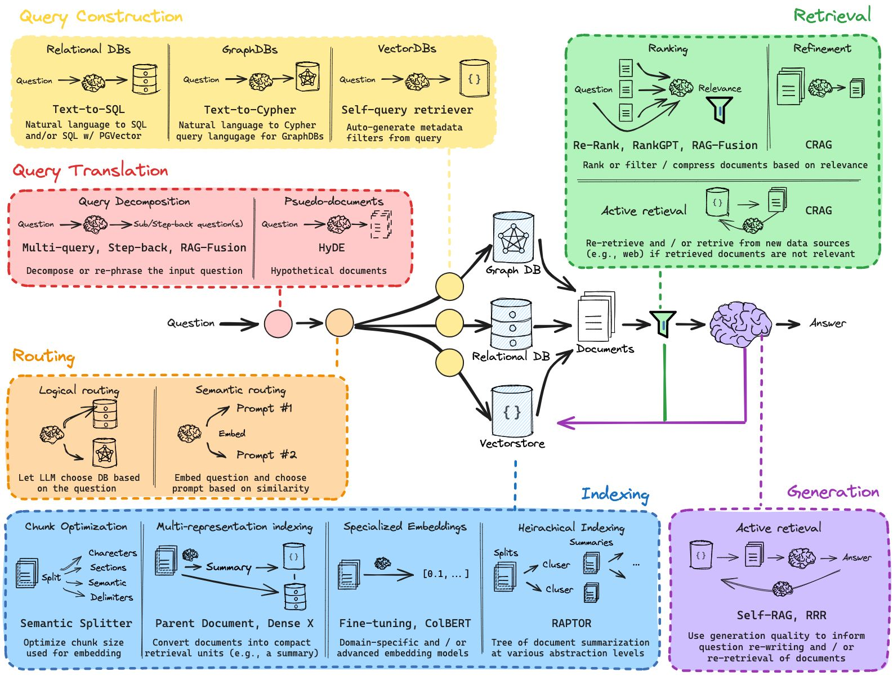
  * 查询转译（Query Translation）- 这一步可以优化用户输入，使其更适合检索系统。例如，将一个复杂的问题转化为更容易检索的关键词或短语。
    * Step back 是查询转译中的一种重要策略，它的核心思想是在处理具体问题之前，先退一步思考更广泛的上下文或更基础的概念，获得更全面的背景知识。避免狭隘或片面的回答、帮助处理复杂或多方面的问题、提高回答的质量和相关性。
    * RAG Fusion 使用多个不同的检索查询或策略来获取相关文档，然后融合这些结果以提供更全面、更相关的上下文信息给语言模型。其工作原理
      1. 查询扩展：从原始查询生成多个变体或相关查询。
      2. 多重检索：使用这些查询分别进行检索。
      3. 结果融合：合并和重新排序检索到的文档。
      4. 上下文构建：使用融合后的结果构建最终的上下文。
    * Pseudo Document 是一种人工构造的文档，它不是真实存在的完整文档，而是基于某些特定目的或规则创建的 "虚拟" 文档。它可以用来：汇总分散在多个文档中的相关信息、创建特定主题或概念的浓缩版本、提供额外的结构化或半结构化信息。创建方法：
      1. 文档聚合：合并多个相关文档的关键信息
      2. 信息提取：从大型文档中提取关键段落或句子
      3. 模板填充：使用预定义模板，填充特定信息
      4. 动态生成：使用语言模型动态创建针对特定查询的伪文档
  * 路由 - 比如选择更合适的数据库或选择更合适的 Prompt；对于拥有多个知识库的 RAG 系统，这一步可以决定查询应该被发送到哪个特定的知识源。
  * 查询构建 - 比如 Text-to-DB-Command；这涉及如何最有效地构建对知识库的查询，可能包括利用元数据或特定的数据结构来提高检索效率。
  * 索引 - RAG 系统的基础工作之一，涉及如何最有效地组织和存储知识，以便快速检索。可能包括词嵌入、创建向量索引或其他高效的数据结构。
    * 搜索方法 - 这可能包括使用语义搜索、混合搜索等方法，而不仅仅依赖于简单的向量相似度搜索。
  * 后处理 - 比如 Re-Rank；这一步可能包括对检索到的文档进行筛选或重新排序，以确保提供给生成模型的上下文信息最相关和有用。
  * 生成 - RAG 的生成部分或回馈、Self-RAG，它强调了检索和生成之间的交互。包括使用语言模型来验证或扩展检索到的信息，确保最终生成的回答既基于检索到的信息，又保持连贯和准确。
* 管道 - 用于帮助自动化机器学习工作流程，能够简化工作，并在构建和部署机器学习模型时自动执行许多繁琐且耗时的任务，可以同时包括：自动化数据预处理、特征选择、模型训练、评估和部署步骤。
* 特征工程作用 - 对数据进行预处理如添加或转换（平方、分割、组合、映射、聚合等等）以匹配消除数据与模型的关系差距、提高模型的预测性能、减少计算或数据需求、提高结果的可解释性。
* 互信息 - 在概率论和信息论中，两个随机变量的互信息（mutual Information，MI）度量了两个变量之间相互依赖的程度。具体来说，对于两个随机变量，MI 是一个随机变量由于已知另一个随机变量而减少的 “信息量”（单位通常为比特）。互信息的概念与随机变量的熵紧密相关，熵是信息论中的基本概念，它量化的是随机变量中所包含的 “信息量”。
* 聚类算法 - 如 K-Means 等。分类是一种无监督学习任务，其主要目标是将数据分为不同的类别或标签。即物以类聚，添加集群标签的动机是集群会将特征之间的复杂关系分解为更简单的块。然后，模型可以一一学习更简单的块，而不必一次学习复杂的整体，这是一种 “分而治之” 的策略。
* 主成分分析（Principal components analysis，PCA）- 是一种统计分析、简化数据集的特征工程方法，主要用于用于减少数据维度和去除冗余特征。它利用正交变换来对一系列可能相关的变量的观测值进行线性变换，从而投影为一系列线性不相关变量的值，这些不相关变量称为主成分。用例：降维、去相关、降噪、异常检查等等。[Ref:](https://twitter.com/mdancho84/status/1786744637505343666)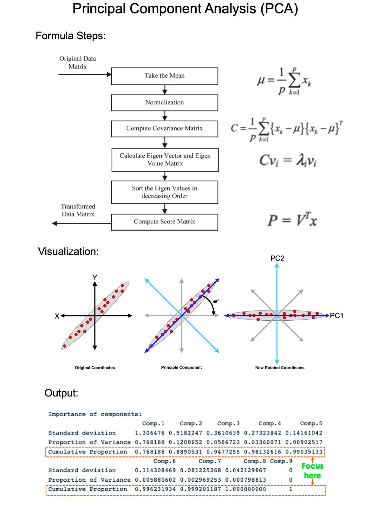
* 模型大小与推断速度 - 它们之间的关系通常是一个权衡问题。较小的模型通常需要更少的计算资源，因此在推断时可以更快地得出结果。然而，较小的模型可能会牺牲一些性能，因为它们可能无法捕获复杂的特征或模式。
* 结果模型的持久化 - 训练好的模型可以通过不同的方式进行持久化存储，以便在之后的时间点重新加载和使用。以下是一些常见的模型持久化存储方法：模型参数保存文件中（常见的格式包括 HDF5、TensorFlow 的 SavedModel、PyTorch 的 .pth 文件等）、模型序列化（将整个模型对象，包括权重、结构和训练配置保存到文件中，这通常用于保存完整的模型架构和状态）、ONNX 格式。另外还可以对存储压缩和优化，以及上传云存储和进行版本控制。实际工程中训练好的模型会被存储到 [Model Registry](https://docs.gitlab.com/ee/user/project/ml/model_registry/)。
* [自动机器学习 AutoML](https://zh.wikipedia.org/wiki/%E8%87%AA%E5%8A%A8%E6%9C%BA%E5%99%A8%E5%AD%A6%E4%B9%A0) - 是将机器学习应用于现实世界问题的任务自动化的过程。自动机器学习可能包括从原始数据集开始到构建准备部署的机器学习模型的每个阶段。
* [联邦学习](https://zh.wikipedia.org/wiki/%E8%81%AF%E9%82%A6%E5%AD%B8%E7%BF%92) - 联合学习使多个参与者能够在不共享数据的情况下建立一个共同的、强大的机器学习模型，从而可以解决数据隐私、数据安全、数据访问权限和异构数据访问等关键问题（力求在保护隐私的前提下提高模型效果，比如在金融、医疗、政府中起到重要作用）。
* [OpenAI: New and improved content moderation tooling](https://openai.com/blog/new-and-improved-content-moderation-tooling)
  * [A Holistic Approach to Undesired Content Detection in the Real World](https://browse.arxiv.org/pdf/2208.03274.pdf)
* 图灵机与感知机的区别 - 图灵机是一种抽象的理论计算模型，旨在研究可计算性和算法的基本性质，是用于研究问题的可计算性、算法和计算理论的重要工具。感知机是一种最简单的人工神经元模型，用于处理二元分类任务，是一种线性分类器，通常用于解决线性可分的问题，通过学习权重来对输入进行二元分类。图灵机和感知机在概念和应用上是截然不同的，它们没有直接的关联或类似之处，图灵机是计算理论的基础，而感知机是机器学习领域神经网络的早期模型之一。
  * 图灵机 - 由一条无限长的纸带和能够读写纸带上符号的读写头组成。它具有有限状态的控制单元，可以根据当前状态和读写头所在位置的符号进行状态转移和符号的读写。通过这种方式，图灵机可以模拟各种算法，并解决各种可计算问题。其在某种程度上类似于状态机，但图灵机具有更强的计算能力，它可以模拟任何计算过程，并能解决一系列可计算问题，相比之下，一般的状态机通常用于描述特定系统或过程中的状态转换，其计算能力较为有限。
  * 感知机 - 接收多个输入，并为每个输入分配权重，然后将加权和传递给激活函数进行处理。通常，阈值函数用于激活输出（0 或 1）。感知机可以被用于简单的线性分类问题，并且可以通过训练来调整权重以更好地分类数据。
* 图灵机与状态机的区别 - 图灵机是通用的计算模型，能够模拟任何算法（图灵完备），绝大多数现代编程语言都是图灵完备的。状态机具有有限的状态和计算能力，通常用于描述简单的、有限的行为。
* [什么是 MLOps](https://aws.amazon.com/cn/what-is/mlops/)
* [特征/表征学习](https://zh.wikipedia.org/wiki/%E8%A1%A8%E5%BE%81%E5%AD%A6%E4%B9%A0)
* 学习分类
  * 监督学习 - 可以由训练资料中学到或建立一个模式（函数 / learning model），并依此模式推测新的实例。训练资料是由输入对象（通常是向量）和预期输出所组成。函数的输出可以是一个连续的值（称为回归分析），或是预测一个分类标签（称作分类）。
  * 无监督学习 - 没有给定事先标记过的训练示例，自动对输入的资料进行分类或分群。无监督学习的主要运用包含：聚类分析（将数据分组成具有相似特征的簇）、关联规则学习（发现数据中的关联模式）、维度缩减（保留最重要的信息）。
  * 半监督学习 - 结合了有标签数据和无标签数据的学习方法。
  * 强化学习 - 强调如何基于环境而行动，以取得最大化的预期利益。强化学习是除了监督学习和非监督学习之外的第三种基本的机器学习方法。与监督学习不同的是，强化学习不需要带标签的输入输出对，同时也无需对非最优解的精确地纠正。其关注点在于寻找探索（对未知领域的）和利用（对已有知识的）的平衡。（其灵感来源于心理学中的行为主义理论，即有机体如何在环境给予的奖励或惩罚的刺激下，逐步形成对刺激的预期，产生能获得最大利益的习惯性行为）
* [概率图模型](https://zh.wikipedia.org/wiki/%E5%9C%96%E6%A8%A1%E5%BC%8F)
* 推理服务器与 Web 服务器的区别 - 推理阶段通常需要使用模型的参数和结构，而不需要进行模型的训练。推理可以在各种平台上进行，包括服务器、移动设备、嵌入式系统等。推理服务器通常是指部署了机器学习模型的服务器，用于处理推理请求。与一般的 Web 服务器相比，推理服务器可能需要更强大的计算资源，以支持模型的高并发推理请求和复杂计算。此外，推理服务器通常需要专门的软件和框架来管理模型的部署和调用。在与一般的 Web 服务器的区别方面，推理服务器可能需要更多的计算资源，例如 GPU 或专用的 AI 加速器（ASIC、FPGA、Habana 等），以支持复杂的模型推理。此外，推理服务器还需要专门的软件架构来管理和优化模型的部署和调用。[参考](https://docs.aws.amazon.com/zh_cn/dlami/latest/devguide/instance-select.html)
  * 如果不熟悉深度学习，那么具有单个 GPU 的实例可能适合需求。
  * 如果注重预算，则可以使用仅含 CPU 的实例。
  * 如果想优化深度学习模型训练的高性能和成本效益，则可以使用带有 Habana 加速器的实例。
  * 对于高容量推理服务，具有大量内存的单个 CPU 实例或此类实例的集群可能是更好的解决方案。
  * 如果使用的是具有大量数据或较大批处理大小的大型模型，那么需要具有更多内存的大型实例。也可以将模型分发到 GPU 集群。如此可能会发现，如果减小批处理大小，则使用内存较少的实例将是更好的选择。这可能会影响准确性和训练速度。
* [计算机视觉（CV）模型](https://www.ibm.com/cn-zh/topics/computer-vision) - 具有数亿到数万亿参数的深度神经网络模型（通常基于卷积神经网络 CNN），可以学习极其复杂和抽象的特征表示。[深度学习与计算机视觉教程：斯坦福 CS231n](https://www.showmeai.tech/tutorials/37)
  * 卷积（convolution）- 是数学、信号处理和图像处理中的一种重要运算。它可以将两个函数或信号组合起来，产生一个第三个函数或信号，反映了第一个函数通过第二个函数进行 “过滤” 或 “变换” 的结果。
* 视频的人工智能视觉认识过程
  * 关键帧提取：由于视频包含大量的帧，为了提高效率，可以先对视频进行关键帧提取，通常是视频中变化较大或重要内容发生变化的帧。
  * 图像分析：对提取的关键帧进行图像分析，包括图像分类、目标检测、人脸识别等任务，可以获取视频的一些基本信息，如场景、人物、物体等。
  * 光流分析：光流是描述图像中像素运动方向和速度的方法，可以用于检测视频中的运动目标、行为等，可以识别出视频中的动作、运动轨迹、行为特征等。
    * 关键事件检测：通过上面的行为特征、识别，可以及时发现并响应对应的归类事件、异常。
  * 标注分类：将视频分为不同的类别或标签。这可以帮助用户更快速地找到感兴趣的视频内容，提高用户体验。
* [机器学习中的傅立叶变换](https://mp.weixin.qq.com/s/R_492VVJGwpxx2NckThlzQ) - 在音频处理中，傅里叶变换帮助识别音频信号中存在各种频率，使得可以进行语音识别、音乐分类和降噪等任务。在图像分析中，傅里叶变换可用于从图像中提取纹理和图案信息。通过将图像转换到频域，更容易检测边缘、形状和其他视觉特征。这对于图像识别、物体检测和图像压缩等任务至关重要。
* 大语言模型 LLM
  * [提示工程](https://zh.wikipedia.org/zh/%E6%8F%90%E7%A4%BA%E5%B7%A5%E7%A8%8B)基础，3 种高级提示工程技术，它们在实践中被广泛使用或引用。在提示工程中，任务的描述会被嵌入到输入中，例如，不是隐含地给予模型一定的参数，而是以问题的形式直接输入。提示工程的典型工作方式是将一个或多个任务转换为基于提示的数据集，并通过所谓的基于提示的学习（prompt-based learning）来训练语言模型。提示工程可以从一个大型的冻结预训练语言模型开始工作，其中只学习了提示的表示方法，即所谓的前缀调整（prefix-tuning）或提示调整（prompt tuning）。[Ref](https://twitter.com/i/bookmarks?post_id=1787694219924308064)
    * 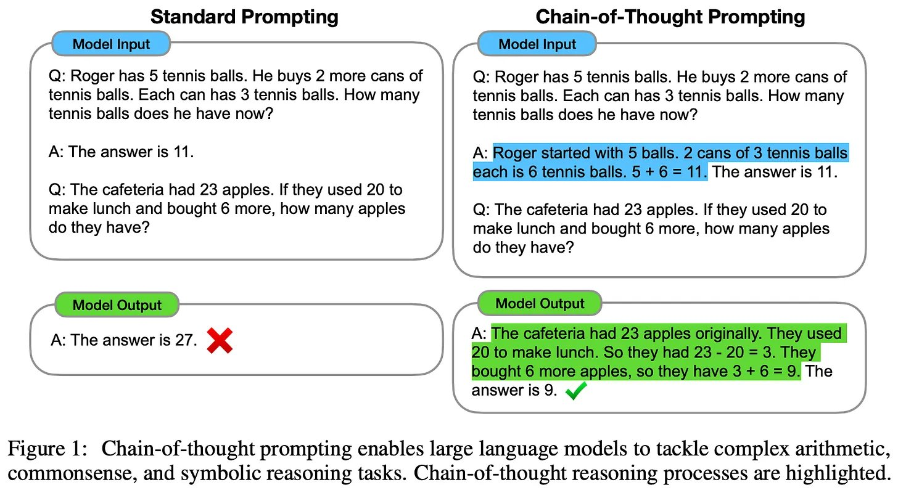思维链（CoT）提示：通过在模型提示中的样本内嵌入一系列思维链（即一系列中间推理步骤）来激发 LLM 的推理能力。通过为每个样本增加思维链，模型通过上下文学习学会在输出答案之前生成类似的思维链。在上图中看到，明确解释解决问题的底层推理过程实际上使模型在推理方面更为高效。CoT 变体：鉴于 CoT 提示的有效性和流行性，提出了几种扩展：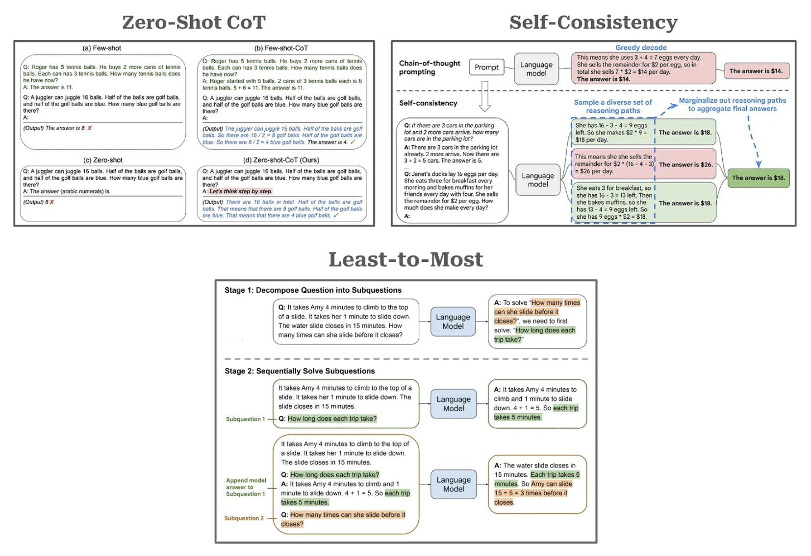
      * 零样本 CoT：去除了少样本样本，而是通过在提示的末尾添加“让我们一步一步地思考。”这句话来鼓励模型生成问题解决的推理。
      * 自我一致性：通过在解决问题时独立生成多个思维链并对每个思维链产生的最终答案进行投票来提高推理过程的鲁棒性。
      * 由浅入深：将一个问题分解为多个部分，分别解决每个部分，并使用每个子问题的解决方案作为下一个子问题的上下文。
    * 思维树（ToT）提示：CoT 提示在需要规划、战略前瞻、回溯和并行探索多个解决方案的问题上表现不佳。ToT 提示将一个复杂问题分解为一系列更简单的问题（或“思维”）。LLM 生成许多思维，并通过自然语言（即通过提示）不断评估其向最终解决方案的进展。通过利用模型对解决方案进展的自我评估，我们可以使用广泛使用的搜索算法（如广度优先搜索或深度优先搜索）来增强探索过程，从而在解决问题时允许预见和回溯。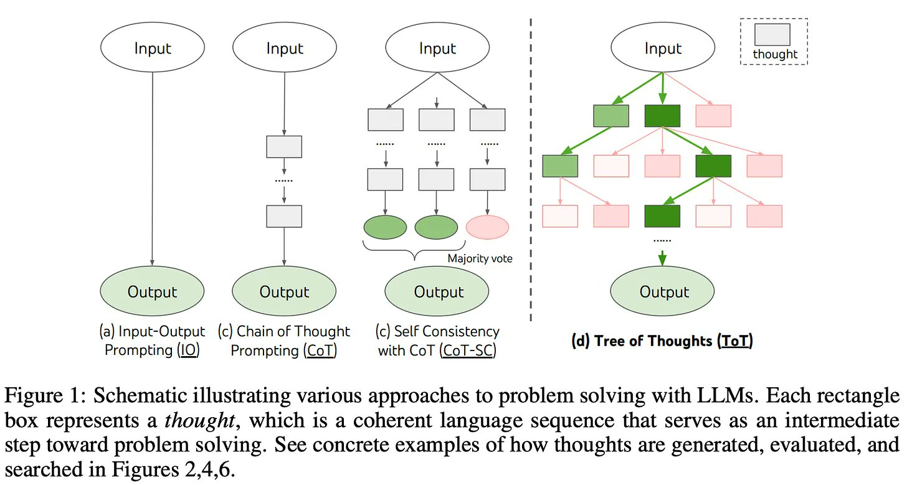
    * 思维图（GoT）提示：后续研究将 ToT 提示的研究推广到基于图的推理策略。这些技术与 ToT 提示类似，但不认为用于生成解决方案的思维路径是线性的。我们可以在推导解决方案时重用思维，甚至通过一系列思维进行递归。已经提出了多种基于图的提示策略。然而，这些提示技术 —— 以及 ToT 提示——因其缺乏实用性而受到批评。使用 GoT 提示解决推理问题可能需要 LLM 进行大量推理步骤。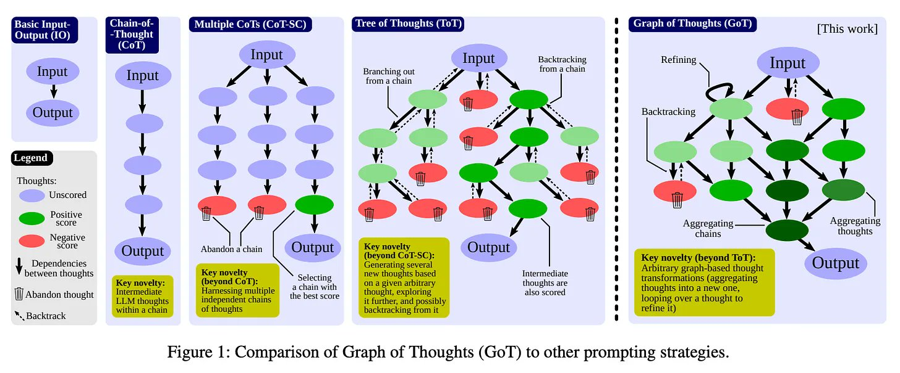
  * [模型设置](https://www.promptingguide.ai/introduction/settings)
    * Temperature：temperature 的参数值越小，模型就会返回越确定的一个结果。如果调高该参数值，大语言模型可能会返回更随机的结果，也就是说这可能会带来更多样化或更具创造性的产出。
    * Top_p：同样，使用 top_p（与 temperature 一起称为核采样的技术），可以用来控制模型返回结果的真实性。如果需要准确和事实的答案，就把参数值调低。如果想要更多样化的答案，就把参数值调高一些。一般建议是改变 Temperature 和 Top P 其中一个参数就行，不用两个都调整。
    * Max Length：可以通过调整 max length 来控制大模型生成的 token 数。指定 Max Length 有助于防止大模型生成冗长或不相关的响应并控制成本/性能。
    * Stop Sequences：stop sequence 是一个字符串，可以阻止模型生成 token，指定 stop sequences 是控制大模型响应长度和结构的另一种方法。例如，可以通过添加 “11” 作为 stop sequence 来告诉模型生成不超过 10 个项的列表。
    * Frequency Penalty：frequency penalty 是对下一个生成的 token 进行惩罚，这个惩罚和 token 在响应和提示中出现的次数成比例，frequency penalty 越高，某个词再次出现的可能性就越小，这个设置通过给重复数量多的 Token 设置更高的惩罚来减少响应中单词的重复。
    * Presence Penalty：presence penalty 也是对重复的 token 施加惩罚，但与 frequency penalty 不同的是，惩罚对于所有重复 token 都是相同的。出现两次的 token 和出现 10 次的 token 会受到相同的惩罚。此设置可防止模型在响应中过于频繁地生成重复的词。如果希望模型生成多样化或创造性的文本，可以设置更高的 presence penalty，如果希望模型生成更专注的内容，可以设置更低的 presence penalty。
* 置信 - 用一个范围来对一个事情进行估计的方式称为区间估计，得出来的区间就是置信区间 (confidence interval)。估算出一个区间了，但是估算的准不准呢？准确度又有多大呢？把这个估算的区间的准确度/可信度称为置信度。比如说有 95% 的把握估计考试得分是 600-650，这里的置信区间就是 (600,650)，置信度就是 95%。一般置信度和置信区间是同向的，意思就是置信度和置信区间一般是相同趋势。当置信度很高时，置信区间也会很大；当置信区间很大时，置信度也会很高。[Ref](https://cloud.tencent.com/developer/article/1521732)
* 语义网 - 通过给万维网上的文档（如: HTML 文档）添加能够被计算机所理解的语义（元数据），从而使整个互联网成为一个通用的信息交换媒介。语义万维网通过使用标准、置标语言和相关的处理工具来扩展万维网的能力。[语义网络（Semantic Network）](https://zh.wikipedia.org/wiki/%E8%AF%AD%E4%B9%89%E7%BD%91%E7%BB%9C)常常用作知识表示的一种形式，它其实是一种有向图，其中，顶点代表的是概念，而边则表示的是这些概念之间的语义关系，语义网络是机读型字典（machine-readable dictionary）的一种常见类型。
* XLM (Cross-lingual Language Model Pretraining) - [Ref](https://cloud.tencent.com/developer/article/1740267)。尽管原有的BERT模型可以在上百种语言上进行预训练，但是语言之间的信息并不是互通的，不同的语言模型之间没有共享知识。Facebook 的 XLM 模型克服了信息不互通的难题，将不同语言放在一起采用新的训练目标进行训练，从而让模型能够掌握更多的跨语言信息。这种跨语言模型的一个显著优点是，对于预训练后的后续任务（比如文本分类或者翻译等任务），训练语料较为稀少的语言可以利用在其他语料上学习到的信息
  * [XLM-R (Unsupervised Cross-lingual Representation Learning at Scale)](https://www.jiqizhixin.com/articles/2019-11-29-2) - 全称叫做 XLM-RoBERTa。XLM-R 的改进：在 XLM 和 RoBERTa 中使用的跨语言方法的基础上（所以，本质就是 XLM+RoBERTa，没有其他了），在新模型中增加了语种数量和训练数据集的数量，具体来说使用超过 2TB 预处理过的 CommonCrawl 数据集，以自监督的方式训练跨语言表征；在 fine-tuning 期间，基于多语言模型的能力来使用多语言的标注数据，以提升下游任务的性能；调整了模型的参数，以抵消不利因素如使用跨语言迁移来将模型扩展到更多的语言时限制了模型理解每种语言的能力，参数更改包括在训练和词汇构建过程中对低资源语言进行上采样，生成更大的共享词汇表，以及将整体模型增加到 5.5 亿参数量
* 6 大常见概念问题：[Ref 1](./ai-domain-knowledge-1.jpeg)、[Ref 2](./ai-domain-knowledge-2.jpeg)
* Model repository, which is a storage location where models developed from any framework such as TensorFlow, PyTorch, Caffe, etc. When the inference server container starts on a GPU or CPU server, it loads the models from the repository into memory. The application then uses an API to call the inference server to run inference on a model. [Ref](https://medium.com/dataseries/easily-deploy-deep-learning-models-in-production-13db48071578)
  * 模型本身可简单认为是一种函数，模型训练的本质就是调整参数，模型仓库（Model Repository）里存的是：
    * 模型文件
      * 模型参数和权重：即训练好的模型的核心数据，包括神经网络的权重、线性模型的系数等
      * 模型架构：特别是对深度学习模型来说，模型文件中可能还包含网络的层次结构、每层的配置、激活函数等信息
      * 文件格式：不同的机器学习框架会有各自的模型文件格式，如 TensorFlow 的 .pb、PyTorch 的 .pt、Scikit-Learn 的 .pkl 或 .joblib，以及通用的 .onnx 格式。
    * 版本信息、元数据
    * 依赖项和环境信息、推理配置
  * 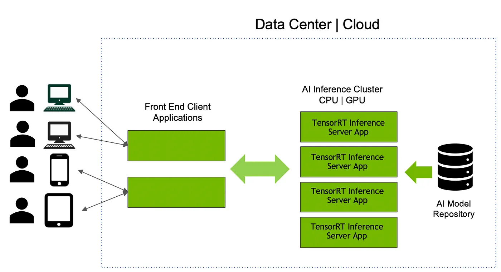
* 语义缓存 - [Ref 1](https://redis.io/blog/rediscover-redis-for-vector-similarity-search/)、[Ref 2](https://www.cnblogs.com/smartloli/p/18105994)、[Ref 3](https://platform.openai.com/docs/guides/embeddings)、[Ref 4](https://openai.com/index/new-embedding-models-and-api-updates/)、[Ref 5](https://www.luxiangdong.com/2023/07/09/vecdb/)、[Ref 6](https://www.pinecone.io/learn/series/faiss/locality-sensitive-hashing/)、[Ref 7](https://www.pinecone.io/learn/search-with-pinecone/)、[Ref 8](https://www.pinecone.io/learn/series/faiss/vector-indexes/#Inverted-File-Index)、[Ref 9](https://docs.pinecone.io/guides/get-started/quickstart)、[Ref 10](https://docs.pinecone.io/models/multilingual-e5-large)


## 硬件与操作系统（Linux & bash）高频
* [进程、线程、协程的区别](./../Computer%20System%20Layer/进程与线程.md)
* [Linux 基础知识](https://pdai.tech/md/devops/linux/linux.html)
* 锁的实现可以分为两大类：基于操作系统（软件）的锁和基于硬件的锁（比如 CAS 指令）。
  * 基于操作系统的锁：这种锁是通过操作系统提供的原语来实现的，例如 Linux 的互斥锁（mutex），Windows 的临界区（critical section）等。它们是在操作系统层面上实现的，通常会涉及到用户态到内核态的切换，因此相对来说比较重量级。[互斥锁的实现](https://www.zhihu.com/question/332113890)及相关[算法](https://zh.wikipedia.org/wiki/Peterson%E7%AE%97%E6%B3%95)。
  * 基于硬件的锁：这种锁是直接利用处理器提供的原语来实现的，最典型的就是 CAS（Compare and Swap）指令。CAS 指令是一种乐观锁，它尝试将一个变量的值与一个期望的值进行比较，如果相等就将该变量设置为一个新的值。如果失败，则说明其他线程已经修改了这个变量，需要重新尝试。由于 CAS 是在硬件层面上实现的，所以比基于操作系统的锁要轻量级，性能更高。
* [内存屏障](https://monkeysayhi.github.io/2017/12/28/%E4%B8%80%E6%96%87%E8%A7%A3%E5%86%B3%E5%86%85%E5%AD%98%E5%B1%8F%E9%9A%9C/)
* [Linux 命令大全手册](https://www.linuxcool.com/)
* [Linux for Programmers](https://www.youtube.com/watch?v=ebHX9c75H8I&list=PLzMcBGfZo4-nUIIMsz040W_X-03QH5c5h)
  * `cat`、`rm`、`cd`、`mv`、`cp`
  * `ps`、`top`、`kill`
    * 其中 kill 主要用途是发送信号到进程，标准的 Unix/Linux 信号主要关注进程的生命周期管理和一些基本的系统事件通知（比如用户中断、进程结束或进程异常），这里须知信号和通信在操作系统中是两个不同的概念，尽管信号也可以被视为一种非常简单的通信形式，但它与常规的数据传输通信机制完全不同，基本毫无关系，相比之下信号和中断更为相似。[Linux 信号机制](https://ty-chen.github.io/linux-kernel-signal/)
    * 对于更复杂的进程间通信、数据传输，Unix/Linux 系统提供了其他机制如：[管道（基于文件描述符）和有名管道（基于文件系统路径）](https://ty-chen.github.io/linux-kernel-pipe/)，消息队列（内核 IPC 机制 - 主要为 msgsnd 和 msgrcv），[共享内存、信号量](https://ty-chen.github.io/linux-kernel-shm-semaphore/)，[套接字（也是 D-Bus 的基石）](https://ty-chen.github.io/linux-kernel-socket/)
      * 以 `ps -ef | grep 关键字 | awk '{print $2}' | xargs kill -9` 为例，这里面的竖线 | 就是一个管道。它会将前一个命令的输出，作为后一个命令的输入。从管道的这个名称可以看出来，管道是一种单向传输数据的机制，它其实是一段缓存，里面的数据只能从一端写入，从另一端读出。如果想互相通信，需要创建两个管道才行。管道分为两种类型，| 表示的管道称为匿名管道，意思就是这个类型的管道没有名字，用完了就销毁了。就像上面那个命令里面的一样，竖线代表的管道随着命令的执行自动创建、自动销毁。用户甚至都不知道自己在用管道这种技术，就已经解决了问题。另外一种类型是命名管道。这个类型的管道需要通过 `mkfifo` 命令显式地创建。
  * `ls -l`、`chmod` (permission)
  * 网络
    * `ssh` (用于远程登录到其他计算机，提供了安全的加密通信。可以在终端中运行远程命令)、`ssh-keygen`、`scp` (用于通过 SSH 在本地计算机和远程计算机之间复制文件。可以实现安全的文件传输)、`curl` (可发送 HTTP/HTTPS、SFTP、FTP 等协议的网络请求)、`wget` (用于从网络下载文件)
    * `ifconfig` 或 `ip` (用于显示和配置网络接口的信息，包括 IP 地址、子网掩码、广播地址等，BSD 系比如 MacOS 通常没有内置 `ip` 命令集所以只能使用前者)、`netstat` (用于显示网络连接、路由表、接口统计、网络协议统计等信息。可以帮助查看当前网络连接和端口状态)、`ping`、`traceroute` (用于跟踪数据包从本地主机到目标主机的路径)、`route` (Manages IP routing table)、`iptables` (用于设置和管理 Linux 防火墙规则，可以控制网络流量和安全，同样不是 BSD 系内置命令集)、`nslookup` (用于查询域名系统 DNS 信息，可以查找域名的 IP 地址以及反向查找 IP 地址对应的域名)、`hostname` (Displays or sets the system's hostname)、`host` (常用的分析域名查询工具，可进行 DNS <-> IP 双向查找)、`arp` (Manages ARP cache)
    * 重要网络配置文件，通过 `cat` 命令可看
      * `/etc/hosts` - 负责 ip 地址与域名快速解析的文件
  * `crontab` (i.e. cronjob)、[sleep](https://linuxize.com/post/how-to-use-linux-sleep-command-to-pause-a-bash-script/)
  * [Linux 中最重要的 3 个命令，均为文本操作（因为 Linux 一切皆文本）](https://zhuanlan.zhihu.com/p/110983126)
    * [grep（更适合单纯的查找或匹配）](https://juejin.cn/post/7069591460730896414#heading-21)
    * [sed（更适合编辑匹配到的文本，取行和替换）](https://juejin.cn/post/7069591460730896414#heading-22)
    * [awk（功能最强大，但也最复杂，简单来说就是把文件逐行的读入，以空格为默认分隔符将每行切片，切开的部分再进行各种分析处理）](https://juejin.cn/post/7069591460730896414#heading-23)
* [bash 文件管理命令](https://juejin.cn/post/7069591460730896414#heading-38)
* [bash 网络通讯命令](https://juejin.cn/post/7069591460730896414#heading-67)
* [bash 系统管理命令](https://juejin.cn/post/7069591460730896414#heading-73)
* [profile 与 bashrc 与 bash_profile 区别](https://zhuanlan.zhihu.com/p/405174594) - /etc/profile 文件用于设置系统级的环境变量和启动程序，不建议在此添加环境变量；bashrc 文件有两种级别，系统级的位于 /etc/bashrc 对所有用户生效，用户级的位于 ~/.bashrc 仅对当前用户生效，每次新打开一个终端窗口时都会执行；.bash_profile 仅在用户登录时读取一次，用于设置一次性的环境变量和启动会话所需的全局设置。
* [Linux 目录结构](https://zhuanlan.zhihu.com/p/496602829)
* [Linux 网络命令大全](https://juejin.cn/post/6844903844267180039)
* [Linux 使用的进程间通信方式](https://juejin.cn/post/7069591460730896414#heading-9)
* [Linux 有哪些系统日志文件](https://juejin.cn/post/7069591460730896414#heading-10)
* [什么是 root 帐户](https://juejin.cn/post/7069591460730896414#heading-13)
* [Linux 常用 bash 命令](https://www.cnblogs.com/savorboard/p/bash-guide.html)
* [Bash 脚本教程](https://wangdoc.com/bash/)
* [The 50 Most Popular Linux & Terminal Commands](https://www.youtube.com/watch?v=ZtqBQ68cfJc)
  * ln (create hard/soft link)、open、date、piping (i.e. |)
  * 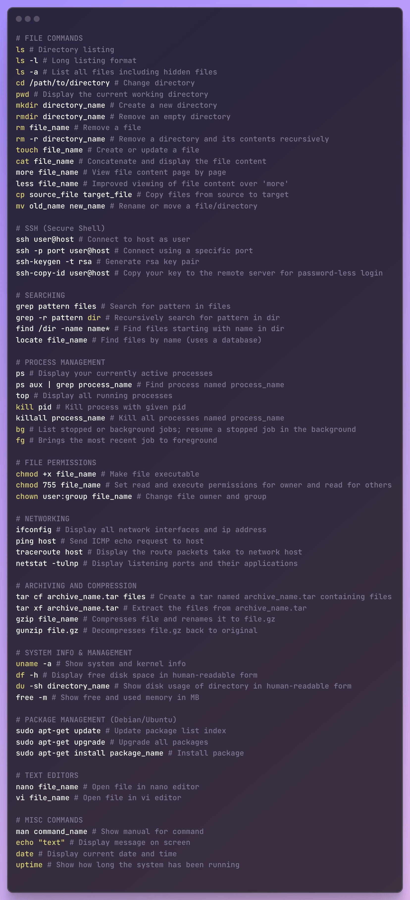
* [硬链接和软链接](https://blog.csdn.net/LEON1741/article/details/100136449)
* [实时监控日志文件](https://blog.csdn.net/rlnLo2pNEfx9c/article/details/122852275)
* [systemd / systemctl](https://www.youtube.com/watch?v=5JVBpXiYMKo) - 守护进程管理解决方案。Systemd 并不是一个命令，而是一组命令，涉及到系统管理的方方面面，systemctl 是 Systemd 的主命令，用于管理系统。[其他参考](https://www.ruanyifeng.com/blog/2016/03/systemd-tutorial-commands.html)
* [NIO 相关基础](../Leetcode%20Practices/system%20design/IO模型与Web服务器工作模型.md)
* 多路复用 - 多路复用是指使用一个线程来检查多个文件描述符（Socket）的就绪状态，比如调用 select、poll、epoll 函数，传入多个文件描述符，如果有一个文件描述符就绪，则返回。
* [eBPF](https://ebpf.io/what-is-ebpf/)
* [eBPF 使用](https://zhuanlan.zhihu.com/p/480811707)
* [文件系统：FAT、NTFS 和 Ext3 区别](https://learn.lianglianglee.com/%E4%B8%93%E6%A0%8F/%E9%87%8D%E5%AD%A6%E6%93%8D%E4%BD%9C%E7%B3%BB%E7%BB%9F-%E5%AE%8C/30%20%20%E6%96%87%E4%BB%B6%E7%B3%BB%E7%BB%9F%E7%9A%84%E5%BA%95%E5%B1%82%E5%AE%9E%E7%8E%B0%EF%BC%9AFAT%E3%80%81NTFS%20%E5%92%8C%20Ext3%20%E6%9C%89%E4%BB%80%E4%B9%88%E5%8C%BA%E5%88%AB%EF%BC%9F.md)
* [inode](https://www.ruanyifeng.com/blog/2011/12/inode.html)
* [虚拟内存](https://learn.lianglianglee.com/%e4%b8%93%e6%a0%8f/%e9%87%8d%e5%ad%a6%e6%93%8d%e4%bd%9c%e7%b3%bb%e7%bb%9f-%e5%ae%8c/24%20%20%e8%99%9a%e6%8b%9f%e5%86%85%e5%ad%98%20%ef%bc%9a%e4%b8%80%e4%b8%aa%e7%a8%8b%e5%ba%8f%e6%9c%80%e5%a4%9a%e8%83%bd%e4%bd%bf%e7%94%a8%e5%a4%9a%e5%b0%91%e5%86%85%e5%ad%98%ef%bc%9f.md)
* [Interview best 20 questions on OPERATING SYSTEM](https://leetcode.com/discuss/interview-question/operating-system/3816083/Interview-best-20-questions-on-OPERATING-SYSTEM)
* 操作系统内核是什么？有什么基本能力？
  * 管理进程、线程，决定哪个进程、线程使用 CPU，也就是进程调度的能力；
  * 管理内存，决定内存的分配和回收，也就是内存管理的能力；
  * 管理硬件设备，为进程与硬件设备之间提供通信能力，也就是硬件通信能力；
  * 提供系统调用，如果应用程序要运行更高权限运行的服务，那么就需要有系统调用，它是用户程序与操作系统之间的接口。
* 管道和流的区别 - 管道通常用于多进程间的通信，因为进程之间不共享内存。流通常用于同一进程但可以是多线程的数据的输入和输出，它是一种连续的数据传输方式。
* 进程间通信（IPC）的机制 - 如管道、套接字、消息队列、共享内存等。
* 芯片微架构与指令集 - 所谓微架构说白点就是 CPU 硬件图纸，设计这里有几个晶体管，那里怎么连接晶体管。核心对应的是逻辑图，是一种逻辑关系，微架构是逻辑关系的硬件实现（把逻辑门转换为硬件设计）。指令集是机器代码和硬件功能的对应，比如 x86 的指令集中 010110 代表把 a 和 b 加起来，而 arm 指令集 10011 代表把 a 和 b 加起来。编译器，你在电脑上敲的代码 a+b 是高级语言，x86 对应编译器把 a+b 翻译为 a 010110 b，arm 编译器则翻译为 a 10011 b，然后给对应的 CPU 看。所谓的 soc 整合设计，一个芯片，上方放 4 个 A75 cpu 下方放 8 个 mali gpu 左边放内存右边放 dsp，然后拿塑料片盖上。[链接](https://zhuanlan.zhihu.com/p/19893066)
* 内存的读取速度通常不会因内存大小增加而变慢，内存速度受到访问内存的硬件和体系结构的限制，而不是内存容量本身。SSD 的随机读取时间复杂度通常可视为接近 O(1)。
* [写入放大](https://zh.wikipedia.org/zh-hans/%E5%86%99%E5%85%A5%E6%94%BE%E5%A4%A7) - 是闪存和固态硬盘（SSD）中一种不良的现象，即实际写入的物理资料量是写入资料量的多倍。
* [运行时](https://www.zhihu.com/question/20607178/answer/2133648600)
* [GCC 优化](https://www.linuxjournal.com/article/7269)
* [SSH 进阶技巧](https://plantegg.github.io/2019/06/02/%E5%8F%B2%E4%B8%8A%E6%9C%80%E5%85%A8_SSH_%E6%9A%97%E9%BB%91%E6%8A%80%E5%B7%A7%E8%AF%A6%E8%A7%A3--%E6%94%B6%E8%97%8F%E4%BF%9D%E5%B9%B3%E5%AE%89/)
  * [A Visual Guide to SSH Tunnels: Local and Remote Port Forwarding](https://iximiuz.com/en/posts/ssh-tunnels/)
  * 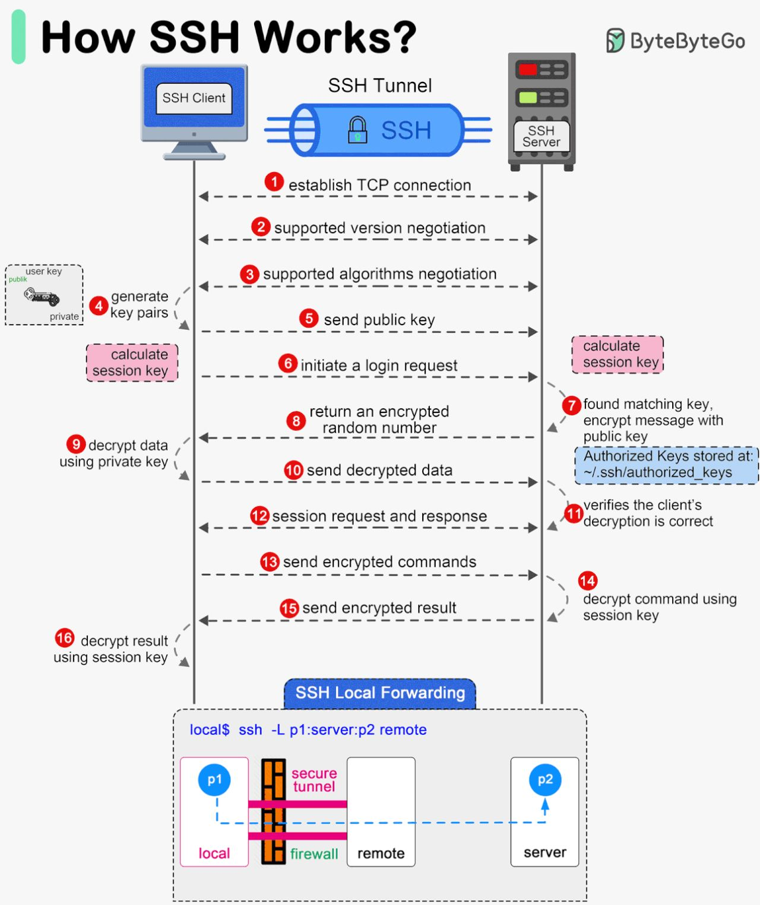
* FPGA - 是一种可编程硬件设备，允许用户根据其特定的应用需求对芯片进行定制和配置，简单来说就是可以把软件系统/逻辑通过硬件实现（因为硬件层面的实现会比软件性能更好）。优点包括：灵活性（可编程性）、并行性、低功耗、低延迟。应用领域：数字信号处理、网络设备、加密和安全应用、科学计算与仿真、硬件加速、实时系统、嵌入式系统等任何需要定制化的高效硬件计算或控制的场景。
* [运维工程师基本功](https://zhuanlan.zhihu.com/p/562269117) - [其他](http://www.sa-log.com/389.html)
* 固件（Firmware）- 是嵌入式系统中的一种软件类型（低级别的编程语言如 C/C++、汇编语言、特定领域语言 DSL），通常被存储在设备的非易失性存储器（如闪存或 ROM）中，并用于控制设备的硬件操作和功能。固件通常包含设备的操作系统、驱动程序、固件升级程序和其他必要的软件组件。固件与传统的软件有所不同，主要表现在以下方面：
  * 直接与硬件交互，与设备密切相关：固件直接运行在设备的硬件上，并与硬件紧密交互，控制硬件的操作和行为。固件是设备的一个重要组成部分，它直接影响设备的功能、性能和稳定性。因此，固件的设计和开发需要考虑到设备的硬件特性和应用场景。
  * 通常不可更改：固件通常被存储在设备的只读存储器（ROM）或者闪存等非易失性存储器中，并且通常不会随意更改。但有些设备也提供了固件升级的机制，允许用户更新固件以修复 bug、增加新功能或提高性能。
* [Cache 直接映射、组相连映射以及全相连映射](https://www.cnblogs.com/east1203/p/11572500.html) ([Ref](https://en.wikipedia.org/wiki/Cache_placement_policies))
* [RDMA | 远程直接内存访问](https://zh.wikipedia.org/zh-hans/%E8%BF%9C%E7%A8%8B%E7%9B%B4%E6%8E%A5%E5%86%85%E5%AD%98%E8%AE%BF%E9%97%AE) - 一种绕过远程主机操作系统内核访问其内存中数据的技术，由于不经过操作系统，节省了大量 CPU 资源，提高了系统吞吐量、降低了系统的网络通信延迟，在大规模并行计算机集群中有广泛应用
* [独立硬盘冗余阵列 (RAID)](https://zh.wikipedia.org/wiki/RAID) - 在单机时代，采用单块磁盘进行数据存储和读写的方式，由于寻址和读写的时间消耗，导致 I/O 性能非常低，且存储容量还会受到限制。另外，单块磁盘极其容易出现物理故障，经常导致数据的丢失。因此大家就在想，有没有一种办法将多块独立的磁盘结合在一起组成一个技术方案，来提高数据的可靠性和 I/O 性能呢。在这种情况下，RAID 技术就应运而生了，即独立磁盘冗余阵列（Redundant Array of Independent Disks），简称为`磁盘阵列`。[Ref](https://zhuanlan.zhihu.com/p/143338394)
  * 数据冗余，是指把数据的校验信息同步、存放在冗余的磁盘中，在某些磁盘数据损坏时，能从其他未损坏的磁盘中，重新构建数据，与纠错码原理类似
  * 性能提升，是指 RAID 能把多块独立的磁盘组成磁盘阵列，通过把数据切成分片的方式，使得读/写数据能走多块磁盘，从而提升性能
* [CompTIA Linux+](https://www.youtube.com/watch?v=NN_xoinL6f4&list=PLw78nfbi6DWjX8ephtrITEqdnWL1wv8qC)

### Docker 高频
* [Dockerfile 配置文件中的 COPY 和 ADD 指令有什么不同](https://www.modb.pro/db/404626)
* [Docker Image 是什么](https://www.modb.pro/db/404626)
* [Docker Container 是什么](https://www.modb.pro/db/404626)
* [Docker Hub 什么概念](https://www.modb.pro/db/404626)
* [Docker 容器可能存在的运行阶段](https://www.modb.pro/db/404626)
* [Dockerfile 配置文件中最常用的指令](https://www.modb.pro/db/404626)
* [什么类型的应用（无状态性或有状态性）更适合 Docker 容器技术](https://www.modb.pro/db/404626)
* [基本 Docker 应用流程](https://www.modb.pro/db/404626)
* [Docker Image 和 Docker Layer 有什么不同](https://www.modb.pro/db/404626)
* [Docker Compose 是什么](https://www.cnblogs.com/sparkdev/p/9753793.html)
* [Docker 群（Swarm）是什么](https://www.modb.pro/db/404626)
* [在使用 Docker 技术的产品中如何监控其运行](https://www.modb.pro/db/404626)


## 网络高频
* 基本概念：[拓扑、硬件与分类](./network1.jpeg)、[OSI 模型](./network2.jpeg)、[协议与安全](./network3.jpeg)、[NAT 与云](./network4.jpeg)
* [计算机网络面试突击](https://juejin.cn/post/6932001161532669960)
  * [RFC1180 A TCP/IP Tutorial](https://datatracker.ietf.org/doc/html/rfc1180)
* [深入理解 Port（端口）](https://zhuanlan.zhihu.com/p/225777212)
* [Linux network ring buffers](https://medium.com/coccoc-engineering-blog/linux-network-ring-buffers-cea7ead0b8e8)
* [Linux 网络栈接收数据过程](https://blog.packagecloud.io/monitoring-tuning-linux-networking-stack-receiving-data/)
* [TCP 三次握手](https://www.zhihu.com/question/24853633/answer/63668444)
  * 三次握手的主要目的是确认自己和对方的发送和接收都是正常的，从而保证了双方能够进行可靠通信。若采用两次握手，当第二次握手后就建立连接的话，此时客户端知道服务器能够正常接收到自己发送的数据，而服务器并不知道客户端是否能够收到自己发送的数据。
  * ACK 是为了告诉客户端发来的数据已经接收无误，而传回 SYN 是为了告诉客户端，服务端收到的消息确实是客户端发送的消息。Seq 为序号。
* [Network Protocols Behind Server Push](https://blog.bytebytego.com/p/network-protocols-behind-server-push)
* [Websocket](https://www.ruanyifeng.com/blog/2017/05/websocket.html)
* [Server Sent Events (SSE)](https://www.ruanyifeng.com/blog/2017/05/server-sent_events.html)
* URL 结构 
* [等价多路径路由](https://zh.wikipedia.org/wiki/%E7%AD%89%E5%83%B9%E5%A4%9A%E8%B7%AF%E5%BE%91%E8%B7%AF%E7%94%B1)
* 分块下载 - [分块下载（Chunked Transfer Encoding）](https://zh.wikipedia.org/wiki/%E5%88%86%E5%9D%97%E4%BC%A0%E8%BE%93%E7%BC%96%E7%A0%81)是 HTTP/1.1 协议的一部分。HTTP/1.1 引入了分块传输编码机制，允许服务器将响应消息分成多个块，并且在发送每个块之前不需要知道整个消息的长度。这使得服务器可以在生成响应时逐块发送数据，而不必等待整个响应消息完全准备好。客户端接收到每个块后可以立即开始处理，这在大文件下载和流式传输等场景下非常有用。[Go 示例代码](https://go.dev/play/p/nbOz8nhSnis)
  * 分块上传则通常不是 HTTP 协议的一部分，而是由特定的服务或框架实现。通常情况下，分块上传是通过多部分上传（multipart upload）来实现的，这是一种将大文件分成多个小块进行上传的方法，每个小块可以独立上传，然后在服务器端进行合并。常见的使用场景是在文件存储服务（如云存储服务）中，例如 AWS S3 的分块上传。HTTP 协议本身并没有直接支持分块上传的功能，但是 HTTP 协议提供了一些特性（如分块传输编码），可以用于实现分块上传的相关功能。
* 影响网络带宽的因素
  * 物理网络设备（例如路由器、交换机、网络接口卡等）的规格、性能及其基本配置与设置
  * 传输介质（如光纤、铜缆、无线等）
  * 网络拓扑和结构 - 网络的拓扑结构和设计也会影响带宽。某些拓扑结构可能导致网络瓶颈，限制整体带宽
  * 网络拥塞和负载 - 当网络中的流量过大，超过了设备和链路的处理能力时，网络可能会拥塞，从而影响带宽
  * 软件、网络协议和传输机制 - 使用的网络协议和软件也可以影响网络的带宽。一些协议可能更高效，而另一些可能会产生较大的开销
  * 网络供应商和服务计划
* 局域网 - 以太网是目前应用最普遍的局域网技术，取代了其他局域网标准如令牌环、FDDI 和 ARCNET
  * 以太网的标准拓扑结构为[总线拓扑（Bus Topology）](https://zh.wikipedia.org/wiki/%E5%8C%AF%E6%B5%81%E6%8E%92%E6%8B%93%E6%92%B2)，该网络拓扑之节点直接连接到一个共用的半双工的线性网络上。由于该拓扑是由一条主缆线串接所有的电脑或其他网络设备，因此也称为线性总线（Linear Bus）
* 网络抓包中的头（Header）包含以下 HTTP 协议的部分，即在客户端和服务器之间传递元数据信息；而响应（Response）则通常就是 HTML
  * 请求头 (Request Header)：请求方法（Request Method）指定了客户端要对服务器执行的操作，比如 GET、POST、PUT、DELETE 等；目标 URL（Request URL）请求要发送到的目标 URL；用户代理（User-Agent）发起请求的客户端的标识信息，通常是浏览器的类型和版本号；内容类型（Content-Type）请求的主体内容的 MIME 类型，比如 text/plain、application/json 等；接受内容类型（Accept）指定客户端接受的内容类型，用于指示服务器返回的响应应该是什么类型的数据；授权信息（Authorization）包含了客户端的身份验证信息，比如用户名和密码；Cookie 包含了客户端的会话信息，用于在客户端和服务器之间跟踪用户的状态；缓存控制（Cache-Control）指示请求和响应是否应该被缓存的指令；Referer（Referer）包含了发送请求页面的 URL，用于告诉服务器请求是从哪个页面发起的；连接控制（Connection）控制客户端和服务器之间连接的行为，比如 keep-alive、close 等；[地址相关](https://www.cnblogs.com/luxiaojun/p/10451860.html)。
  * 响应头 (Response Header)：状态码（Status Code）；内容类型（Content-Type）响应的主体内容的 MIME 类型；内容长度（Content-Length）响应主体内容的长度；缓存控制（Cache-Control）指示客户端如何缓存响应的指令；服务器（Server）服务器的软件信息，通常包含了服务器的名称和版本号；日期（Date）响应的日期和时间；Cookie（Set-Cookie）服务器设置的新的 Cookie；跨域资源共享（CORS）指示客户端是否可以跨域访问资源的指令，比如 Access-Control-Allow-Origin；重定向（Location）重定向的目标 URL，当服务器返回 3xx 状态码时使用；内容压缩（Content-Encoding）指示服务器对响应主体进行了压缩的编码方式，比如 gzip、deflate 等。
  * 请求参数（Query String Parameter）- GET 请求的参数
  * 表单数据（Form Data）- POST 请求的参数
* [抓包工具](https://cloud.tencent.com/developer/article/1506253)
  * 如果只分析网页数据，用浏览器提供的工具就足够了
  * 仅 HTTP/S 抓包并且想对手机流量抓包的可以使用 Charles（配置手机使用 Charles 代理），其余的如 Fiddler 也可以对手机、App 流量抓包，并且后者提供更多高级功能（如自定义规则、自动化脚本、性能分析等）。
  * 全协议抓包则可以使用 WireShark 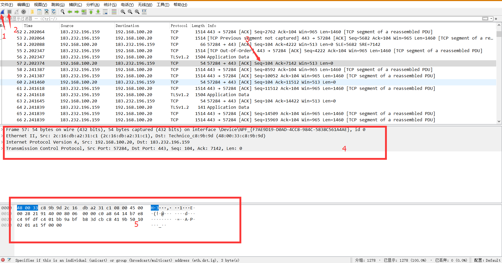 1 处表示开始抓包；2 处表示停止抓包；过滤器可以过滤想看的内容，比如过滤 TCP，就会只列出 TCP 协议的会话；3 处表示已抓取的会话列表；4 处是对应会话的全部内容；5 处是数据包原始的内容。
* [常用 HTTP 状态码](https://juejin.cn/post/6844904202863394830)
  * 1xx - 信息状态码
  * 2xx - 成功状态码
    * 200 - OK
  * 3xx - 重定向状态码
    * 301 - 永久性重定向
    * 302 - 临时性重定向
  * 4xx - 客户端错误状态码
    * 400 - 客户端请求报文中存在语法错误，服务器无法理解
    * 401 - 请求要求用户的身份认证
    * 403 - 服务器理解请求客户端的请求，但是拒绝执行此请求
    * 404 - 服务器无法根据客户端的请求找到资源
  * 5xx - 服务器错误状态码
    * 500 - 服务器内部错误，无法完成请求
    * 503 - 由于超载或系统维护，服务器暂时的无法处理客户端的请求
* [gRPC 状态码](https://grpc.github.io/grpc/core/md_doc_statuscodes.html)
  * OK (0) - 调用成功
  * CANCELLED (1) - 调用被取消
  * UNKNOWN (2) - 调用发生未知错误
  * INVALID_ARGUMENT (3) - 无效参数
  * DEADLINE_EXCEEDED (4) - 调用超时
  * NOT_FOUND (5) - 请求资源未找到
  * PERMISSION_DENIED (7) - 没有权限执行该操作
  * INTERNAL (13) - 服务器内部错误
  * UNAUTHENTICATED (16) - 请求没有该操作要求的有效身份验证凭据
* 网络抖动（Network Jitter）是指数据包在网络中传输时，其延迟（即从源到目的地的时间）出现不稳定或波动的现象。具体来说，网络抖动是指一系列数据包的传输延迟在不同时间段内不一致。这种不一致性会导致实时应用（如视频会议、VoIP、在线游戏等）出现质量问题，如画面卡顿、声音断续、延迟增加等。成因：
  * 网络拥塞：当网络中的流量过大，网络设备（如路由器、交换机）无法及时处理所有数据包时，会发生网络拥塞，导致数据包的传输时延增加和丢包率上升。
  * 网络故障：网络设备或链路出现故障时，可能导致数据包的传输延迟增加或丢失。
  * 网络拓扑变化：当网络拓扑结构发生变化时，如路由器的路由表更新、链路状态改变等，可能会导致数据包传输路径的变化，从而引起网络抖动。
  * 网络干扰：外部干扰因素，如电磁干扰、信号衰减等，可能导致数据包传输中断或出现不稳定的传输时延。
* 带宽（Bandwidth）是指在特定时间段内，网络连接或通信链路能够传输的数据量。通常以比特每秒（bps）、千比特每秒（Kbps）、兆比特每秒（Mbps）、吉比特每秒（Gbps）等单位表示。在网络和通信领域，带宽是衡量网络性能和容量的重要指标。
  * 带宽由物理介质（光纤电缆）、网络设备（路由器、交换机、网卡）、通信协议、环境条件（信号干扰与距离）、网络架构（拓扑结构、分段和汇聚）、ISP/骨干网提供的带宽、网络负载等因素决定，这些因素综合影响网络的最大数据传输能力。
* [网络传播类型](https://support.biamp.com/General/Networking/Multicast_traffic_and_IGMP) - 单播、广播、[组播](https://cshihong.github.io/2018/02/12/IP%E7%BB%84%E6%92%AD%E5%9F%BA%E7%A1%80/)
  * 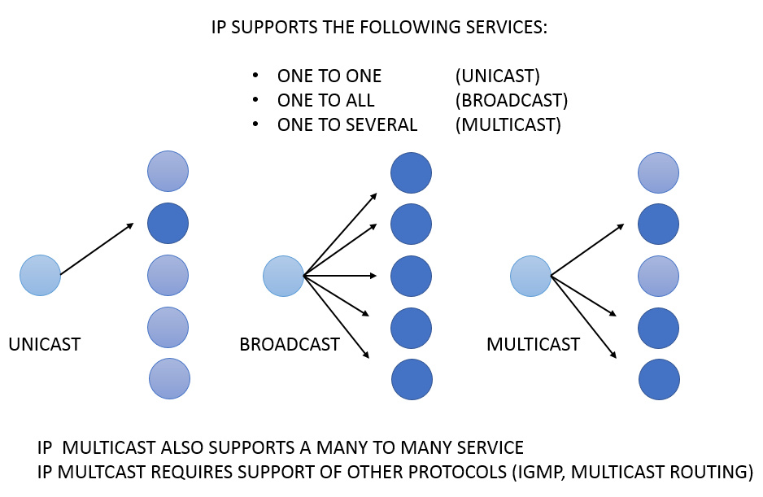
* [蓝牙](https://zh.wikipedia.org/zh/%E8%97%8D%E7%89%99) - 是一種无线通讯技術標準，用來讓固定與行動裝置，在短距離間交換資料，以形成個人區域網絡（PAN）。其使用短波特高頻（UHF）無線電波，經由 2.4 至 2.485 GHz 的 ISM 頻段來進行通信。1994 年由電信商愛立信（Ericsson）發展出该技術。最初的設計是希望建立一個 RS-232 數據線的無線通訊替代版本。它能夠連結多個裝置，以克服同步的亦被干擾等問題。
* [BGP](https://zhuanlan.zhihu.com/p/25433049)
* [网速及信号传输](https://www.youtube.com/watch?v=7uWLEGahyW4)
* IPv4 vs IPv6（[Ref](https://wsgzao.github.io/post/ipv6/)）
  * 主要区别
    1. 地址空间 (最关键的区别以及更换原因):
       - IPv4: 32 位地址，2^32 = 约 42 亿个
       - IPv6: 128 位地址，2^128 个，近乎用不完
    2. 数据包头部结构:
       - IPv4: 可变长度、复杂
       - IPv6: 固定 40 字节、简化。简化的头部提高了路由效率。更小的路由表，因为 IPv6 在地址分配时遵循聚类原则，相同区域默认分配相同前缀 IP 地址。当路由在查找和传递过程中，可以更高效地选择最优路由进行传递，大大节省传递时的开销。
    3. 安全性:
       - IPv6 内置 IPSec 提供更好的端到端加密（也是强制启用），增强了网络通信的安全性。
    4. 自动配置:
       - IPv6 支持无状态地址自动配置 (SLAAC)，类似 IPv4 的 DHCP，简化了网络管理。IPv6 地址的后 64 位是由网卡的物理地址 (MAC) 加上转换算法得来，本身就是全球唯一的地址，所以也就很难遇到 IP 地址冲突现象
    5. 服务质量 (QoS):
       - IPv6 通过流标签改进了 QoS 支持，有利于多媒体等应用。
    6. 分片处理:
       - IPv4: 数据包在传输过程中，路由器会根据其设置的 MTU 值 (最大传输单元，默认为 1500 字节) 来对数据包进行分片传输
       - IPv6: 在 IPv6 的网络中，主机在发出数据包时，就已经对数据包进行分片处理 (默认最小 MTU 为 1280 字节)，这样在数据传输的过程中就不需要路由器来担任分片工作，大大提高了数据传输的效率，减轻了网络设备负担。
    7. 过渡机制:
       - 双栈、隧道、转换等技术允许 IPv4 和 IPv6 共存，是目前网络部署的重要考虑。
  * 重点知识
    1. 地址表示:
       - IPv4: 点分十进制 (如 192.168.1.1)
       - IPv6: 冒号十六进制 (如 2001:db8::1)
    2. 特殊地址:
       - IPv4: 127.0.0.1 (回环), 192.168.0.0/16 (私有)
       - IPv6: ::1 (回环), fc00::/7 (唯一本地地址)
    3. 头部字段:
       - IPv6 移除了一些 IPv4 字段 (如校验和)，添加了流标签
    4. NAT (网络地址转换):
       - IPv4 广泛使用 NAT
       - IPv6 理论上不需要，但实践中仍有应用
    5. 多播和任播:
       - IPv6 改进了对这些通信模式的支持
    6. DNS:
       - IPv6 使用 AAAA 记录，而不是 IPv4 的 A 记录
* 为何仍在使用 IPv4？- 这是因为协议的全球更换不容易。一方面因为 NAT（Network Address Translation）技术的应用，延缓了 IPv4 地址枯竭的速度。NAT 通过地址转换可以使多个设备共享一个 IP 地址来访问互联网，节省了部分地址资源。另一方面，网络升级到 IPv6 的成本巨大。从 IPv4 到 IPv6 的升级，不仅仅是更改地址，而是涉及到网络的方方面面。从个人终端到运营商网络，从各种应用软件到网站服务，都需要全面改造升级。
* IPv6 地址表示法，IPv6 地址表示有特殊规则，比如压缩表示法等（理解这些表示规则对于正确识别和使用 IPv6 地址非常重要。这种压缩表示法使 IPv6 地址更易读和书写，同时保持了其独特性和完整性）：
  1. 完整的 IPv6 地址：
     - 由 8 组 16 位的十六进制数组成，每组用冒号分隔
     - 例如：2001:0db8:0000:0000:0000:ff00:0042:8329
  2. 前导零省略规则：
     - 每组中的前导零可以省略
     - 上面的地址可以写成：2001:db8:0:0:0:ff00:42:8329
  3. 零压缩规则：
     - 一个或多个全零组可以用双冒号 (::) 代替
     - 但在一个地址中只能使用一次双冒号，因为使用多次会造成歧义，错误示例：2001::25::8329（无法确定每个 :: 代表多少个零组）
     - 例如：2001:db8::ff00:42:8329
  4. 零压缩的应用：
     - 特别适用于表示包含大量零的地址
     - 如本地回环地址：::1 (完整形式是 0000:0000:0000:0000:0000:0000:0000:0001)
     - 未指定地址：:: (全零地址)
  5. 最佳实践：
     - 尽可能使用压缩来简化地址表示
     - 在有多种压缩方式时，通常压缩最长的零序列
     1. 例子：
        - fe80:0000:0000:0000:0202:b3ff:fe1e:8329
        - 可以简化为：fe80::202:b3ff:fe1e:8329
  6. 特殊地址：
     - 本地回环：::1
     - IPv4 映射地址：::ffff:192.0.2.1
* IPv6 中的端口使用 - IPv6 系统中同样使用端口，端口号的范围和使用方式与 IPv4 相同（0-65535），通常表示为 `[IPv6地址]:端口`，如 `[2001:db8::1]:80`，注意 IPv6 地址需要用方括号括起来，以区分地址和端口
* 光纤为什么取代铜线 - 光与电信号的速度理论上是一样的，因此优势主要不是在这部分
  * 带宽容量：光纤通信的典型工作波长在红外线范围（约 100-400 THz），而铜线的频率范围通常在 MHz 到 GHz 级别（如电话线一般在 1 MHz 以下，光纤的频率则远远超过）。更大的频率范围意味着光纤可以支持更高的带宽，因此可以同时传输更多的数据
  * 信号衰减与抗干扰：均比传统电话线/铜线强，因为铜线长距离传输电时会因电阻导致信号衰减，且电信号易受电磁干扰
* [近场通讯 NFC](https://zh.wikipedia.org/zh-hans/%E8%BF%91%E5%A0%B4%E9%80%9A%E8%A8%8A) - 是一套通讯协定，让两个电子装置（其中一个通常是行动装置，例如智慧型手机）在相距几公分之内进行通讯，允许行动支付取代或支援这类系统。近场通讯技术由非接触式射频识别（RFID）及互连技术演变而来，是一种短距高频的无线电
* [计算机网络为什么要分层](https://www.cnblogs.com/ricklz/p/16457713.html) - 同理，软件开发需要抽象、分类（或网络分层）的根本原因，是因为通过抽象可以将原来的组合爆炸控制为有限的几个集合，然后使用时只需将它们组合起来即可，如此一方面即实现了功能并满足所有场景，另一方面又减少不必要的管理维护复杂、信息冗余
* 五元组 (Five Tuple) - 通信术语。通常是指源 IP 地址，源端口，目的 IP 地址，目的端口和传输层协议
* [内网穿透](https://sspai.com/post/88937) - 内网穿透是指在局域网中，通过一些工具和技术，将内网中的服务或者资源映射到互联网上，让外部用户可以访问和使用


## [安全高频](https://tldrsec.com/)
* [安全模型](https://en.wikipedia.org/wiki/Security_modes)
  * [零信任网络](https://www.cloudflare.com/zh-cn/learning/security/glossary/what-is-zero-trust/)
* [CORS（跨域访问）及其工作流程](./CORS.PNG)
  * [为什么浏览器要限制跨域访问](https://www.zhihu.com/question/26379635/answer/534866558)
  * [CORS 为什么能保障安全？为什么只对复杂请求做预检？](https://www.51cto.com/article/705584.html)
* [CSRF](https://tech.meituan.com/2018/10/11/fe-security-csrf.html)
  * [CSRF 与 CORS](https://b1ngz.github.io/csrf-and-cors/)
* 加密解密
  * [对称加密](https://www.youtube.com/watch?v=uD_zCOKuYPc) - 最粗糙的一次性安全加密可以采用异或运算即可（通常异或就是工业级对称加密算法的基础，比如 [AES](https://zh.wikipedia.org/wiki/%E9%AB%98%E7%BA%A7%E5%8A%A0%E5%AF%86%E6%A0%87%E5%87%86)）
  * [非对称加密](https://github.com/yihaoye/stem-notes/blob/master/e-computer-network/https_and_ssl_tls.md)
* [实际工程项目中应用密匙如何存取](https://zh.wikipedia.org/zh-hant/%E5%AF%86%E9%92%A5%E7%AE%A1%E7%90%86)
* [Security for Programmer](https://www.youtube.com/watch?v=qjrkV4RjgIU)
* OWASP top 10 : [1](https://owasp.org/www-pdf-archive/OWASP_Top_10_2017_%E4%B8%AD%E6%96%87%E7%89%88v1.2.pdf), [2](https://owasp.org/www-project-top-ten/)
  * 代码注入 (SQL、[跨站脚本 XSS](https://www.cnblogs.com/54chensongxia/p/11643787.html)) - [PrepareStatement 如何防御代码注入](https://cloud.tencent.com/developer/article/2092203)
  * 失效的识别、身份认证
  * 敏感信息泄露、加密失败
  * 失效的访问控制
  * 安全配置错误
  * 软件和数据完整性故障（不安全的反序列化）
  * 使用含有已知漏洞的、易受攻击或过期的组件
  * 失效或不足的日志记录和监控
  * 服务端请求伪造（SSRF）
  * 不安全的设计（需要更多地使用威胁建模、安全设计模式和原则以及参考架构）
* XSS 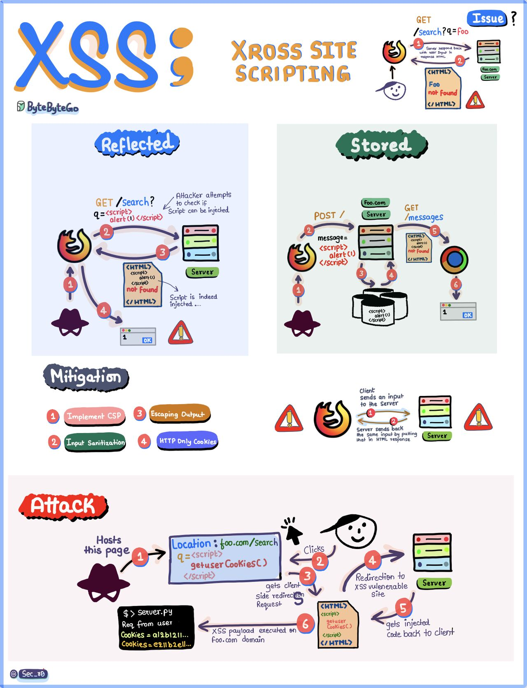
* [Cookie、Session、Token、JWT 区别](https://juejin.cn/post/6844904034181070861)
* [JWT 认证中可以防止他人冒充 token 吗？否](https://www.zhihu.com/question/364616467)
* [Password, Session, Cookie, Token, JWT, SSO, OAuth - Authentication Explained](https://blog.bytebytego.com/p/password-session-cookie-token-jwt)
  * [ByteByteGo - Session, cookie, JWT, token, SSO, and OAuth](https://blog.bytebytego.com/p/ep34-session-cookie-jwt-token-sso)
  * [SSO, SAML, OpenID](https://www.youtube.com/watch?v=O1cRJWYF-g4) - session/cookie 方便了同源网站系统登录，而 token (SAML, OpenID JWT 等，基于 OAuth 2.0 协议) 进一步将便利性普及到非同源网站系统
  * [OAuth 2.0](https://www.youtube.com/watch?v=ZV5yTm4pT8g) - 即临时凭证（当用户希望某个第三方有限地访问自己在某个系统的资源但又不希望直接给出账号密码时）
* [JSON Web Token 入门教程](https://www.ruanyifeng.com/blog/2018/07/json_web_token-tutorial.html)
* [Session 是怎么实现的？存储在哪里？](https://juejin.cn/post/6942852054847062053)
* 安全清单
  * 反 SQL/代码注入
  * SSL / OpenSSL 更新
  * 密码加盐
  * 多重要素验证（应用在例如后勤办公室等）
  * 对敏感数据进行 AES 加密
  * 避免非加密信息/数据在非安全处（比如邮件）存放/发送
* [伪基站](https://zh.wikipedia.org/wiki/%E4%BC%AA%E5%9F%BA%E7%AB%99)
* SIM 卡 - SIM 由 CPU、ROM、RAM、EEPROM 和 I/O 电路组成。用户使用 SIM 时，实际上是手机向 SIM 卡发出命令，SIM 卡应该根据标准规范来执行或者拒绝；SIM 卡并不是单纯的消息存储器。SIM 卡本身最重要的是存储其中的密钥和算法，并使用它们来进行身份验证（握手阶段时，设备启动并尝试连接到移动网络，设备和 SIM 卡与网络中的身份验证中心进行通信）
* [算法复杂度攻击](https://en.wikipedia.org/wiki/Algorithmic_complexity_attack) - 通常为设计各类算法的最差场景：包括如[哈希洪水攻击](https://www.zhihu.com/question/286529973/answer/676290355)以及[词法分析高耗、正则表达式回溯灾难、快速排序性能退化、压缩高耗性能等](https://blog.csdn.net/Solstice/article/details/514)，已被 OWASP 收录
  * Bebug 不易 - 通常如果日志不全面的话，算法复杂度攻击的 debug 都比较困难，因为通常需要觉察数据倾斜或是超时是哪一行代码造成的时候，都需要拿到具体的输入进行复现才能找到根因
* 身份认证协议
  * [Kerberos](https://zh.wikipedia.org/wiki/Kerberos) - 一种计算机网络授权协议，用来在非安全网络中，对个人通信以安全的手段进行身份认证。加密方式有比如使用预共享密钥 PSK 或基于避免明文传输的用户密码派生的会话密钥。软件设计上采用客户端/服务器结构，并且能够进行相互认证，即客户端和服务器端均可对对方进行身份认证。可以用于防止窃听、防止重放攻击、保护数据完整性等场合，是一种应用对称密钥体制进行密钥管理的系统（其扩展产品也使用非对称加密方法进行认证）。当有 N 个人使用该系统时，为确保在任意两个人之间进行秘密对话，系统至少保存有它与每个人的共享密钥，所需的最少会话密钥数为 N 个。因其在协议设计上的优秀特性，使得其在大规模的网络环境，尤其是在安全性要求较高的环境中得到了广泛的应用
    * Kerberos 可用于：身份认证、SSO、授权、安全通信
    * [kinit Linux 命令](https://juejin.cn/post/7114236312382603295) - Kerberos 使用称为“票”的令牌，允许用户和服务之间的安全通信。票由它的密钥分发中心（KDC）发放。KDC 是 Kerberos 的核心，管理所有的票据和密钥。用户首先要向 KDC 请求一个 Ticket Granting Ticket（TGT），这一步通常由 `kinit` 命令完成
    * [Kerberos 工作流](https://www.freecodecamp.org/news/how-does-kerberos-work-authentication-protocol/) 
  * [OpenID](https://zh.wikipedia.org/wiki/OpenID) - 去中心化的网上身份认证系统 (SSO)。对于支持 OpenID 的网站，用户不需要记住像用户名和密码这样的传统验证标记。取而代之的是，他们只需要预先在一个作为 OpenID 身份提供者（identity provider, IdP）的网站上注册。OpenID 是去中心化的，任何网站都可以使用 OpenID 来作为用户登录的一种方式，任何网站也都可以作为 OpenID 身份提供者。OpenID 既解决了问题而又不需要依赖于中心性的网站来确认数字身份。基于 JSON (JWT)。
  * [SAML (Security Assertion Markup Language)](https://en.wikipedia.org/wiki/Security_Assertion_Markup_Language) - 与 OpenID 基本一致，只是基于 XML。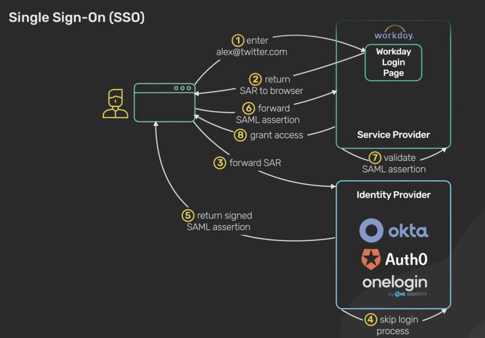
* 原像抗性 - 是指对于给定的哈希值，找到相应的原始输入的难度。
* 伪随机与哈希的区别 - 在算法不变的情况下，一个是以输入数据来决定输出值，一个是以序列（以及随机种子）来决定输出值。
* [X.509](https://zh.wikipedia.org/zh-hans/X.509) - 是密码学里公钥证书的格式标准。X.509 证书里含有公钥、身份信息（比如网络主机名，组织的名称或个体名称等）和签名信息（可以是证书签发机构 CA 的签名，也可以是自签名）。
* 主要攻击类型 
* 敏感数据管理 
* [CISSP 考试认证](https://mp.weixin.qq.com/s/YRuiZ81dQKqNuhYkyFTtAA)
  * 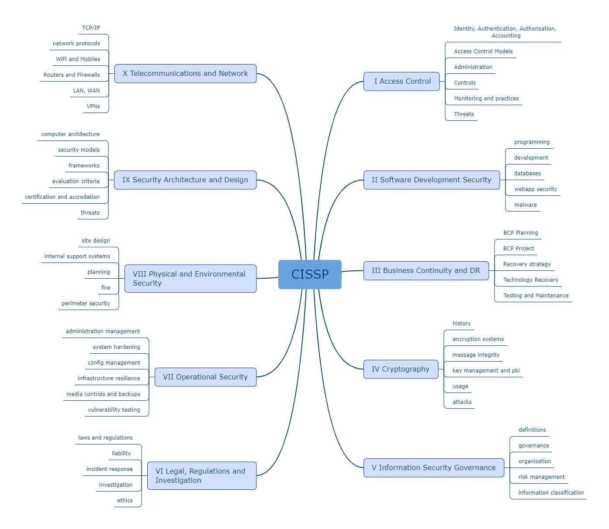
* [SSL 证书劫持](https://www.zhihu.com/question/22795329/answer/138770468) - [Ref](https://www.invicti.com/learn/mitm-ssl-hijacking/)
* LLM 提示注入 - 是一种用于劫持语言模型输出的技术。当不可信的文本作为提示的一部分使用时，就会发生这种情况。[Ref](https://learnprompting.org/docs/prompt_hacking/injection)
  * [OWASP Top 10 for LLM](https://owasp.org/www-project-top-10-for-large-language-model-applications/)
  * 防御方案
    * [LLM Guard](https://github.com/protectai/llm-guard) - 开源方案 LLM Guard 为大语言模型的输入和输出内容提供了全面的评估和保护功能，包括清理、有害语言和数据泄漏检测以及防止提示注入和越狱攻击。其开发目的很简单：尽管大语言模型可以提高员工生产力，但企业对大语言模型在生产环境的部署始终疑虑重重，因为大语言模型存在数据泄露、提示攻击、分析偏见、错误信息（AI 幻觉）等重大安全风险，而且这些 AI 模型普遍缺乏控制和可观察性。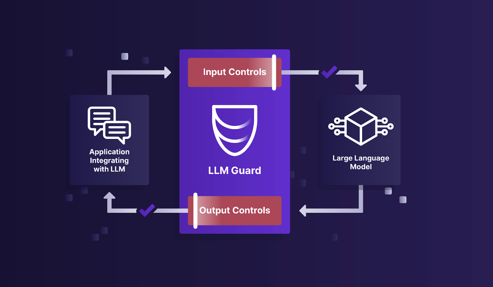
      * 输入扫描：检测恶意提示、诱导、敏感话题检测、敏感信息数据、提示注入检测等
      * 输出扫描：检查有害内容、个人信息泄露、敏感信息脱敏等
      * 语言检测（多语言混淆、越狱挑战、假语言输入、错误语言输出）
      * 令牌输入限制（DoS、可用性保障）
    * [Llama Guard](https://ai.meta.com/research/publications/llama-guard-llm-based-input-output-safeguard-for-human-ai-conversations/) - [Ref 1](http://www.mfbz.cn/a/870426.html)、[Ref 2](https://medium.com/@sivasiddharth929/introducing-llama-guard-a-beacon-of-safety-in-human-ai-conversations-cb57d37933d1)，Meta 的 LLM 安全方案。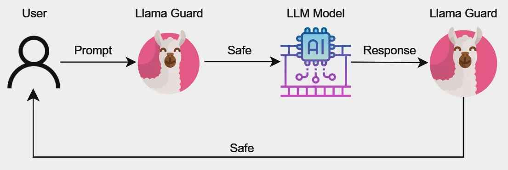
    * [NeMo-Guardrails](https://github.com/NVIDIA/NeMo-Guardrails/tree/develop) - 英伟达方案，除了包括了提示注入防御之外还集成了 RAG 解决方案。
* 搜寻引擎最佳化（SEO）- 是透过了解搜寻引擎的运作规则来调整网站，以及提高目的网站在有关搜寻引擎内排名的方式。[黑帽 SEO](https://zhuanlan.zhihu.com/p/93168290)
* [内容农场](https://zh.wikipedia.org/zh-hans/%E5%85%A7%E5%AE%B9%E8%BE%B2%E5%A0%B4) - 指为了牟取广告费等商业利益或出于控制舆论、带风向等特殊目的，快速生产大量网路文章来吸引流量的网站，通常，其也利用搜索引擎来达到吸睛点击；农场文则是此类网站制造的文章。
  * 常见特征：大量剽窃、二手转载、垃圾劣质机造内容、免洗网站、社群导流、夸大标题、匿名作者、广告行销、恶意程式。
* [盲水印和图片隐写术](https://ulyc.github.io/2019/03/15/%E7%9B%B2%E6%B0%B4%E5%8D%B0%E5%92%8C%E5%9B%BE%E7%89%87%E9%9A%90%E5%86%99%E6%9C%AF/)
* [7 种权限模型](https://www.woshipm.com/share/6057931.html)
  * ACL (Access Control List) - 一种面向资源的访问控制模型。核心在于用户可以直接和权限挂钩，权限模型包括：资源标识、用户标识、授权状态
    * DAC - 在 ACL 的基础上，DAC 模型将授权的权力下放，允许拥有权限的用户，可以自主地将权限授予其他用户，常见于 OS 的文件系统
    * MAC - 弥补 DAC 权限控制过于分散的问题而诞生的。主体被赋予一定的安全级别，客体被赋予一定的安全级别，主体能否访问客体由双方的关系安全级别决定
  * RBAC (Role-Based Access Control) - 将访问权限与角色相关联，通过给用户分配适合的角色，让用户与访问权限相联系
  * ABAC - 基于属性的访问控制权限模型。定义：规定哪些属性的主体可以对哪些属性的资源在哪些属性的环境下进行哪些操作属性
  * TBAC - 基于任务的访问控制模型。它从工作流中的任务角度建模，可以依据任务和任务状态的不同，对权限进行动态管理
  * EBAC - 基于受控实体的访问控制技术。对各种客观存在的和逻辑定义的企业信息资源（即主体拥有访问权限的客体），定义为受控实体


## Nginx 高频
* [Nginx epoll 模型](./../Leetcode%20Practices/system%20design/IO%E6%A8%A1%E5%9E%8B%E4%B8%8EWeb%E6%9C%8D%E5%8A%A1%E5%99%A8%E5%B7%A5%E4%BD%9C%E6%A8%A1%E5%9E%8B.md)
* [Nginx 多进程模型是如何实现高并发的](./../Leetcode%20Practices/system%20design/IO%E6%A8%A1%E5%9E%8B%E4%B8%8EWeb%E6%9C%8D%E5%8A%A1%E5%99%A8%E5%B7%A5%E4%BD%9C%E6%A8%A1%E5%9E%8B.md)
* [Nginx 高效原理](https://zhuanlan.zhihu.com/p/108031600)


## 前端高频
* [reactjs interview questions](https://github.com/sudheerj/reactjs-interview-questions)
* [什么是 React 及其基本设计理念](https://zh-hans.react.dev/learn/thinking-in-react)
* [React Hooks](https://github.com/yihaoye/stem-notes/tree/master/t-frameworks/react.js#react-hooks)
* [什么是 JSX](https://legacy.reactjs.org/docs/introducing-jsx.html)
* [什么是 Virtual DOM 以及为什么使用它](https://juejin.cn/post/6844903953499422727)
* [React Virtual DOM 的 diff 算法](https://juejin.cn/post/7005846199479566344)
* [什么是 Fiber](https://juejin.cn/post/7106148927606358030)
* [JavaScript 异步、非阻塞](https://developer.mozilla.org/zh-CN/docs/Learn/JavaScript/Asynchronous/Introducing)
* [React build 输出](https://handsonreact.com/docs/build-deploy)
* [什么是 SSR](https://zhuanlan.zhihu.com/p/90746589)
* 浏览器存储
  * Cookies：每次请求都会自动附带 Cookie 数据（下面的 2 种不会），适合需要在服务器之间共享的少量数据。并且[支持设置自动过期时间](https://www.w3schools.com/js/js_cookies.asp)（下面的 2 种需要编程）。
  * [Web Storage](https://www.w3schools.com/js/js_api_web_storage.asp)：适用于少量、简单数据的持久化和临时存储，如用户设置、购物车内容和会话状态。
    * LocalStorage - 数据持久化，除非被明确删除，否则数据不会过期。每个源（origin）有大约 5-10 MB的存储空间。
    * SessionStorage - 数据在会话结束后（例如浏览器标签关闭时）自动删除。每个源（origin）有大约 5-10 MB的存储空间。
  * [IndexedDB](https://developer.mozilla.org/zh-CN/docs/Web/API/IndexedDB_API)：适合存储大量（存储空间大小仅受限于用户设备的存储能力）、复杂数据（包括二进制），支持离线使用、大数据管理和复杂客户端数据库操作，如离线应用和数据同步、事务等。[另外在安全上它也是使用同源原则](https://developer.mozilla.org/zh-CN/docs/Web/API/IndexedDB_API/Using_IndexedDB)。
* iframe 使用场景及安全风险 - `iframe` 常用于嵌入第三方内容（如广告、视频、社交媒体插件）、多域内容整合（展示不同来源的数据或应用）和隔离不受信任的组件（避免影响主页面）。此外，它还能嵌入文档或网页，提供多功能展示。然而，`iframe` 带来了一些安全风险。跨站脚本（XSS）攻击可能通过 `iframe` 嵌入恶意内容；点击劫持（Clickjacking）引诱用户执行意想不到的操作；数据泄露可能通过内嵌第三方内容发生；不当的跨域资源共享（CORS）设置可能允许未授权访问；混合内容问题在 HTTPS 页面嵌入 HTTP 内容会导致安全漏洞；过多权限可能执行危险操作。
  * 防护措施包括：设置严格的 Content Security Policy（CSP）限制外部资源；使用 `X-Frame-Options` 或 `Content-Security-Policy` 响应头防止点击劫持；使用 `sandbox` 属性限制 `iframe` 行为；配置严格的 CORS 策略确保信任来源；确保所有嵌入内容使用 HTTPS 协议；最小化 `iframe` 权限，使用 `allow` 属性控制功能。通过这些措施，可以显著提高 `iframe` 的安全性。
* 前端性能优化 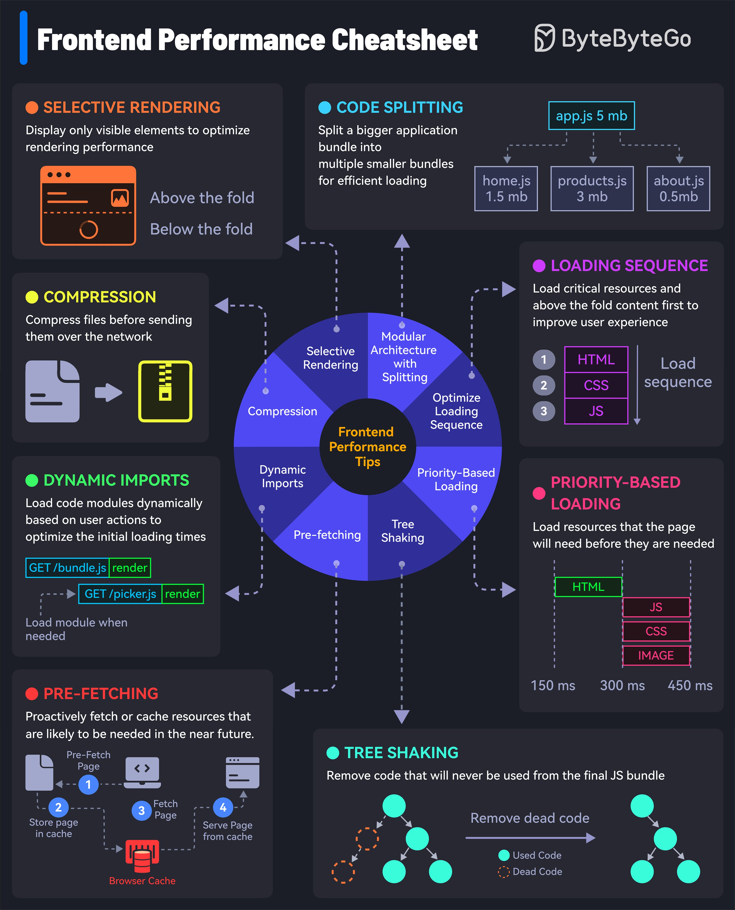


以上部分参考：https://osjobs.net/topk/  
